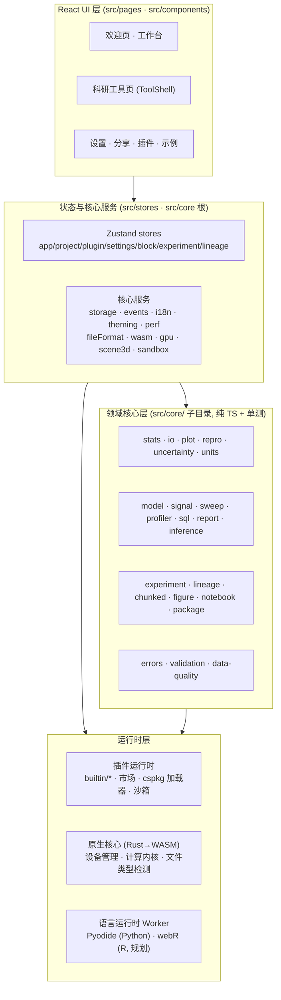

# Ergalics Studio 架构规范

> 版本：v1.0（2026-09-18）
> 范围：全部架构约束与规范，含既有约定与规划项（标注"规划"）
> 关联文档：[需求文档](./REQUIREMENTS.md)
> 状态：待评审

---

## 1. 架构总览

Ergalics Studio 采用分层架构：React 前端应用层 → 状态与核心服务层 → 领域核心层 → 运行时层（插件运行时 / 原生 WASM / GPU）。核心原则：**领域核心保持纯 TypeScript 且可单测，UI 层保持薄，第三方代码仅可进入沙箱**。

**分层约束**

| 层 | 允许依赖 | 禁止依赖 |
|---|---|---|
| UI 层 | 核心服务、stores、领域核心 | 直接操作运行时细节（经服务层） |
| 领域核心 | 纯 TS 标准库、内部模块 | DOM、React、浏览器专属 API |
| 核心服务 | 领域核心、浏览器 API | React 组件 |
| 运行时层 | 浏览器 API、WASM | 领域核心反向依赖 |

---

## 2. 前端应用层

### 2.1 技术基线

| 项 | 约定 |
|---|---|
| 框架 | React 18（函数组件 + Hooks） |
| 语言 | TypeScript 5.7，`strict` 模式开启 |
| 构建 | Vite 6，`base: './'`，`target: 'esnext'` |
| 路由 | react-router-dom 7，**HashRouter**（静态部署兼容） |
| 状态 | Zustand 5（stores 目录统一管理） |
| 路径别名 | `@` → `src/`（vite.config.ts 定义） |

### 2.2 构建配置约束（vite.config.ts 既有约定）

- 应用版本号经 `define.__APP_VERSION__` 从 package.json 注入，禁止硬编码（欢迎页版本展示依赖此项）。
- `manualChunks` 将 react 相关依赖单独分包。
- Pyodide 与 Blockly 媒体资源通过自定义插件 vendoring 到 `public/`（同源加载，不依赖 CDN，兼容大陆网络环境）。新增浏览器专属运行时的资源一律遵循同源 vendoring，禁止运行时访问外部 CDN。
- `optimizeDeps.include` 覆盖动态导入的浏览器专属依赖，防止冷启动解析失败。
- Worker 构建格式 `format: 'es'`。

### 2.3 应用外壳（src/App.tsx 既有约定）

- 全局 `ErrorBoundary` 包裹；`BannerStack` / `ToastStack` 为全局反馈通道。
- 路由全部懒加载（`lazy` + `Suspense`），路由切换以 `location.pathname` 为 key 重放 `.route-stage` 入场动画。
- store 初始化（project / experiment / lineage）在应用装配阶段执行。
- 科研工具统一经 `/studio/:toolId` + `RESEARCH_TOOLS` 注册表解析；**旧书签路由以客户端重定向保活**，禁止删除。

---

## 3. 路由与页面规范

### 3.1 路由表

| 路径 | 页面 | 说明 |
|---|---|---|
| `/` | 欢迎页 | 硬件自检 + 模式卡片 + 科研工具启动网格 + 最近项目 |
| `/workbench` | 工作台 | 标准/流程/积木/代码四模式容器 |
| `/studio/:toolId` | 科研工具页 | 由 `RESEARCH_TOOLS` 注册表驱动，统一 ToolShell |
| 旧路径（如 `/#/runs`） | 重定向 | 永久重定向到 `/studio/:toolId` |
| `/settings` | 设置 | 全局设置与主题 |
| `/plugin/:pluginId` | 插件视图 | 单插件详情 |
| `/share/:payload` | 分享 | 分享载荷渲染 |
| `*` | 重定向 | 回欢迎页 |

### 3.2 科研工具注册表（RESEARCH_TOOLS）

- 每个科研工具一个条目：`id`、`path`、`legacyPath`、图标、名称、描述、分组、懒加载组件。
- **入口集中**：欢迎页分组启动网格为科研/分析工具的主入口（分组：测量与不确定性 / 建模与推断 / 数据与图谱 / 信号与扫描 / 交付与复现），TopBar 提供二级快捷入口。
- 新科研工具必须注册进注册表并配置 legacyPath，禁止散落路由。
- 科研工具一律为**独立整页**（非弹窗），共享 ToolShell 外壳，保留必要的顶栏与状态栏。

---

## 4. 领域核心层（src/core）

### 4.1 模块清单与职责

| 模块 | 职责 | 形态 |
|---|---|---|
| `stats/` | 描述统计、特殊函数、假设检验、效应量、多重比较、功效分析 | 纯 TS + 单测 |
| `io/` | 科研二进制 I/O 调度（HDF5/NetCDF/FITS/Zarr/Parquet） | 纯 TS + 单测 |
| `plot/` | 出版级 SVG/PDF 渲染引擎（线性/对数/时间刻度） | 纯 TS + 单测 |
| `repro/` | 可复现性：种子 RNG、稳定哈希、运行清单、DAG→Python、repro.lock | 纯 TS + 单测 |
| `uncertainty/` | Bootstrap/蒙特卡洛传播/MCMC，CPU + WGSL GPU 双引擎 | 纯 TS + 单测 |
| `units/` | 类型化量值与量纲代数（SI 词头、换算检查） | 纯 TS + 单测 |
| `model/` | 回归建模（OLS/逻辑/岭/多项式）+ 诊断图 | 纯 TS + 单测 |
| `signal/` | FFT/PSD/滤波/ACF-PACF/季节分解 | 纯 TS + 单测 |
| `sweep/` | 参数扫描领域层（网格/列表/拉丁超立方 + 全测试校验） | 纯 TS + 单测 |
| `profiler/` | 流式列画像 + 质量评分 | 纯 TS + 单测 |
| `sql/` | DuckDB-WASM 引擎封装（懒加载） | 纯 TS + 单测 |
| `report/` | 自包含 HTML 报告生成 | 纯 TS + 单测 |
| `inference/` | HMC/NUTS 采样、R-hat/ESS/WAIC/LOO/PPC 诊断 | 纯 TS + 单测 |
| `experiment/` | 实验记录（运行历史，IndexedDB runs 存储） | 纯 TS + 单测 |
| `lineage/` | 数据血缘 DAG（文件→运行） | 纯 TS + 单测 |
| `chunked/` | 大文件异步行窗口读取 | 纯 TS + 单测 |
| `figure/` | Figure Studio（期刊模板组图） | 纯 TS + 单测 |
| `notebook/` | 混合 Notebook（Pyodide 运行时） | 纯 TS + 单测 |
| `package/` | 补充材料 ZIP 打包 | 纯 TS + 单测 |
| `errors/` | 错误分类法、Result、重试、错误注册表、全局捕获 | 纯 TS + 单测 |
| `validation/` | 可组合字段校验、安全 JSON/数值解析 | 纯 TS + 单测 |
| `data-quality/` | 期望契约、画像、坏行隔离（Pandera 风格） | 纯 TS + 单测 |
| `gpu.ts` / `wgsl.ts` / `compute.ts` | GPU 设备管理、WGSL 模板、计算管线 | 服务层 |
| `sandbox.ts` / `plugin-worker.ts` | 插件沙箱协议与 Worker 桥 | 服务层 |
| `fileFormat.ts` | 文件类型检测（魔数 + 扩展名 + WASM 辅助） | 服务层 |
| `storage.ts` | IndexedDB 项目存储 | 服务层 |
| `scene3d.ts` | Three.js 场景托管（懒创建、GPU 安全销毁） | 服务层 |
| `events.ts` / `perf.ts` / `logger.ts` | 事件总线 / 性能监控 / 会话日志 | 服务层 |

### 4.2 领域核心约束

- 领域核心禁止访问 DOM 与 React；测试在 Node 环境运行（Vitest）。
- 新能力优先落在 `src/core/` 的纯 TS 模块，再在 UI 层装配，禁止在组件内实现领域逻辑。
- 运行类操作（flow/block/code/notebook/sweep/uncertainty/model/inference）必须通过事件总线汇入实验记录与血缘，禁止绕过。
- 模块保持"小且可测"，允许同构拆分；禁止为假想需求预建抽象。

---

## 5. 运行时与 Worker 规范

| 运行时 | 用途 | 隔离方式 | 生命周期 |
|---|---|---|---|
| Pyodide Worker | 代码模式 Python（完整 CPython） | Web Worker | 页面卸载终止；停止即重启 Worker |
| webR Worker（规划 FR-04） | 代码模式 R（完整运行时） | Web Worker | 同上，加载失败回退内置 IR |
| 插件沙箱 Worker | 第三方插件代码 | Worker + postMessage RPC | 随插件激活创建 |
| 渲染通道 | 沙箱插件画布 | OffscreenCanvas 转移 | 随插件激活 |

- 语言运行时注入 `studio` 模块/API，使各语言与积木/流程共享数据语义。
- 失控循环的中断策略：终止并重启 Worker，禁止共享状态残留。
- Worker 不可用时的回退路径必须文档化且有测试覆盖。

---

## 6. 原生核心层（Rust → WASM）

- 源：`native/ergalics-core`；构建：`npm run build:wasm`（wasm-bindgen → `src/native`）。
- 导出面：`BindingDescriptor`、`ComputeKernel`（compile/dispatch/compilation_info）、`GpuDeviceManager`。
- 职责：GPU 设备管理、计算内核调度、文件类型检测（可选 WASM 辅助）。
- **WASM 模块缺失时前端必须优雅降级**（开发模式不依赖 Rust 工具链）；生产构建先 `build:wasm` 再 `vite build`。
- 触碰 `native/` 后的改动必须重新生成 WASM 绑定并提交产物。

---

## 7. WebGPU 层

- `src/core/gpu.ts` 统一管理适配器/设备，**CPU 回退为强制要求**，禁止假设 WebGPU 可用。
- 引擎选择器（自动 / CPU / GPU）贯穿不确定性引擎等 GPU 加速模块；选择结果必须写入运行记录。
- WGSL 内核集中在 `src/core/wgsl.ts`；随机数内核使用 PCG32，MCMC 按链分配 workgroup。
- 内核执行必须上报耗时与内存（`perf.ts`），进入性能监控面板。
- 规划（FR-12）：新增矩阵乘法、FFT、K-means、分箱聚合内核；GPU 路径与 CPU 路径结果必须在数值容差内一致（测试保障）。
- 3D 场景经 `Scene3DHandle` 托管：懒创建、自动相机适配、GPU 安全销毁；2D 插件激活时自动隐藏 3D 场景。

---

## 8. 插件系统规范

### 8.1 插件契约

每个插件实现 `Plugin` 接口：`init/destroy/activate/deactivate/render/updateParams/getParams/compute/loadData/renderToScene`，并接收 `PluginApi`（i18n、状态、性能上报、通知、文件访问、项目级参数）。

### 8.2 加载与分发

- **两级加载**：核心插件启动自动加载；趣味/工具插件 `autoload: false` 按需加载，保持注册表精简。
- 文件路由：拖放文件 → `fileFormat` 魔数 + 扩展名检测 → 路由到匹配插件；多匹配时弹选择对话框；导入对话框必须带文件格式过滤。
- 插件一键导出：2D/3D 快照 PNG；表格数据导出 RFC-4180 CSV（UTF-8 BOM，仿真类带行数上限与抽样）。

### 8.3 沙箱（安全底线）

- 第三方入口代码运行于 Web Worker，经 postMessage RPC 桥接；**无法访问宿主全局、DOM、stores**。
- 画布渲染经转移的 OffscreenCanvas；Worker 不可用时有文档化的尽力回退。
- 沙箱隔离不因签名机制（FR-05）而弱化——签名解决"信任来源"，沙箱解决"运行隔离"，二者独立。

### 8.4 cspkg 与市场

- cspkg = manifest.json + 入口 + 资源的 ZIP；清单校验：id 格式、入口路径穿越防护、沙箱枚举。
- 市场目录 `src/plugins/marketplace.ts`：标签 / 流行度 / 分类筛选（科学 / 趣味 / 工具）。
- 规划（FR-05）：ed25519 签名 + 公钥指纹校验 + 安装管线 + 统计。
- 规划（FR-22）：SDK v1 冻结、弃用策略、脚手架 `create-ergalics-plugin`、官方模板仓库。

---

## 9. 数据层规范

| 存储 | 用途 | 说明 |
|---|---|---|
| IndexedDB | 项目（.clproj）、运行记录、设置 | 现有主存储 |
| OPFS（规划 FR-17） | 大文件分块存储 | 项目元数据仍留 IndexedDB；可迁移 |
| 内存 | 会话数据、Worker 传输 | 通过 Arrow/ArrayBuffer 高效传递 |

- 项目生命周期：创建/打开/保存/自动保存/分享（.clproj 存 IndexedDB）。
- 科研二进制 I/O：单一调度器路由到 HDF5（h5wasm）、NetCDF（netcdfjs）、FITS（fitsjs）、Parquet（parquet-wasm）、Zarr（zarrita），每个变量/数据集/HDU 转为项目数据文件。
- SQL：DuckDB-WASM 懒加载，项目文件注册为表；查询结果保存为新 CSV 时自动继承血缘边。
- 数据质量：`data-quality/` 列级/表级期望契约，懒求值质量报告，按行隔离（quarantine）。
- 大文件：`chunked/` 行窗口读取 + 列投影 + 内容指纹；规划（FR-16）Worker 池 + 虚拟化表格 + 自动降采样。

---

## 10. 编辑器与 IR 规范

- **共享 IR（`src/editor/ir/`）是唯一事实来源**：区块 JSON ↔ IR 在纯函数模块内往返；同一份 IR 由积木模式与代码模式共享，流程模式经转换模块对齐。
- 三模式互转：积木 ↔ 流程 ↔ 代码经共享 IR（`convert.ts` / `parse.ts`），拓扑排序 + 参数对齐 + `mergeFlowIR` 保留非 DAG 语句，并有注水签名守卫防节点丢失。
- IR 解释器调用与流程模式区块相同的 `studio.*` API，使 `studio.plot(...)` 落到与流程区块完全相同的渲染插件。
- IR → JS/Python 代码生成（`codegen/`）实时预览。
- 代码模式：Python 经 Pyodide（完整 CPython）；R 经内置 IR 引擎（现状）→ webR（规划 FR-04）；JS 经内置 IR 引擎。切换语言即从 IR 中枢 codegen 成另一语言。
- 积木画布基于 Blockly 13，**懒加载**，不拖累首屏；区块名称/提示/下拉/工具箱类别经 `BKY_*` 本地化，语言切换重建工作区并有专门测试。
- 代码编辑器基于 Monaco，懒加载；`Ctrl/⌘+Enter` 运行，输入防抖后同步回 IR。

---

## 11. 可视化规范

- 2D 容器：所有 2D 插件共享 canvas 容器（`viewport2d.ts`），涵盖点云/粒子/时间序列/直方图/热力图/等值线/散点/柱状/雷达/网络/气泡/小提琴/桑基/箱线/平行坐标/误差带/矩形树图/QQ 等。
- 3D：宿主管理 Three.js 场景，网格/坐标轴/灯光/轨道控制/自动适配/GPU 安全销毁；3D 表面仅对声明 `renderToScene` 的插件懒创建。
- 出版级绘图：`core/plot/` 纯 TS SVG 渲染器，线性/对数/时间刻度与优雅刻度值；SVG/PDF 导出（jsPDF + svg2pdf）。
- 规划（FR-15）：3D 表面图、体素渲染、GPU 百万级点云；规划（FR-03）投稿检查与图注生成进入 Figure Studio。

---

## 12. UI/UX 设计规范

### 12.1 布局与导航

- **ToolShell**：科研工具页统一外壳 = 顶栏（返回工作台 + 工具名 + 全局工具）+ 主内容区 + 状态栏。所有实验室页面必须复用，禁止引入新范式。
- **TopBar 与 Sidebar 职责分离**：TopBar 承担模式切换、数据/示例、项目操作（新建/打开/另存为/导出日志）、科研入口、环境（设置/语言/主题/FPS）；Sidebar 聚焦项目管理与插件，禁止重复 TopBar 功能。
- 欢迎页：优先动作引导（新建项目、最近项目、示例、模板），硬件自检信息收敛（"环境就绪"卡片常驻展开、不可折叠），版本号动态注入。
- 科研入口：集中分组 + 搜索（14+ 工具防淹没），每个工具带图标、名称、描述。

### 12.2 组件与交互约束

- 复用统一组件：`EmptyState`（空状态）、`Modal`（含确认类弹窗）、`ErrorBoundary`、反馈横幅/Toast。
- 所有图标用一致 SVG 组件 + aria-label，禁止文本字符充当图标。
- 下拉组件支持键盘导航、焦点管理、搜索过滤。
- **禁止无功能按钮**：任何可点击元素必须有实际行为；工作台各模式侧栏必须模式化（流程/积木/代码各自有效功能）。
- 破坏性操作（删除项目等）必须模态确认。
- 窄屏响应式：六卡布局防断行/空白，次要操作进溢出菜单。

### 12.3 全局性

- i18n（zh-CN / en-US）响应式切换；新文案未本地化不得上线。
- CSS 变量驱动的暗/亮主题；规划（FR-21）主题包机制（.cstheme，含配色/字体/密度，图表配色联动）。
- 可访问性：键盘全程可操作、对比度达标、屏幕阅读器标注；规划（FR-18）WCAG 2.1 AA 自测 ≥ 95%。

---

## 13. 测试规范

| 层 | 工具 | 覆盖 |
|---|---|---|
| 单元 | Vitest | 领域核心全部、stores、编辑器转换、区块目录、i18n、沙箱、错误/校验/质量引擎 |
| E2E | Playwright-core（headless Edge） | 插件、WebGPU、区块/代码模式、AI 示例、科研工具、UI 修复 |
| 脚本 | `scripts/verify-*.mjs` | 冒烟、UI、3D、插件、语言模式等专项验证 |

- `npm run verify`（typecheck + test）必须保持绿色；`npm run test:e2e` 覆盖完整回归面。
- 新增功能（FR-01~FR-24）必须伴随测试：领域逻辑单测 + 关键路径 E2E。
- 规划（FR-23）：基准套件（导入/GPU 内核/渲染帧率/内存），CI 回归对比，发布附基准报告。
- 规划（FR-06）：构建产物体积检查并入 CI 门槛。

---

## 14. 构建与发布规范

- 命令：`npm run build`（wasm → typecheck → vite build → docs）；`build:web`（无 WASM）；`build:wasm`；`build:docs`。
- 发布节奏：按迭代期打 tag（0.2.x → 1.0.x），CHANGELOG 随版本维护；规划（FR-10）tagged release 自动归档产 DOI。
- CI：GitHub Actions 单元 + E2E + Pages 部署；仓库配置 Gitee / GitHub 双远端（main 为主干）。
- 文档：VitePress 独立 workspace（`docs/`）；README 双语维护，重大变更必须同步更新。
- 性能预算：首屏 JS（gzip）≤ 500KB；新增依赖需体积评估（FR-06 落地后由 CI 强制）。

---

## 15. 安全规范

| 面 | 规范 |
|---|---|
| 插件隔离 | Worker + RPC + OffscreenCanvas，禁止逃逸宿主全局/DOM/stores |
| 签名（规划） | ed25519，公钥指纹入 manifest，未签名包默认拒绝 |
| 依赖 | 漏洞审计为合入门槛；SBOM 随发布生成（FR-18） |
| 数据 | 用户数据默认不出本机；在线行为需显式授权（AI 助手在线模式等） |
| 输入 | 安全 JSON/数值解析（validation/），文件路径穿越防护（cspkg） |
| 环境 | CSP 等响应头按部署形态配置；跨源隔离（COEP/COOP）在沙箱与共享内存场景评估 |

---

## 16. 工程纪律

- **模块边界**：只修改实验室与工作台组件；简单工具（simple kits）保持不变。
- **提交规范**：语义化 commit message（feat/refactor/fix/docs 前缀，仓库既有风格）。
- **代码注释**：仅在"为什么"非显而易见时注释；不写解释性注释与多行 docstring。
- **不做过度设计**：不为假想需求加抽象；无用的兼容 shim 直接删除。
- **测试先行**：任何运行类逻辑改动先补测试再合入。
- **版本与兼容**：科研工具旧路由永久保活；SDK 类契约（FR-22）变更需弃用期。
