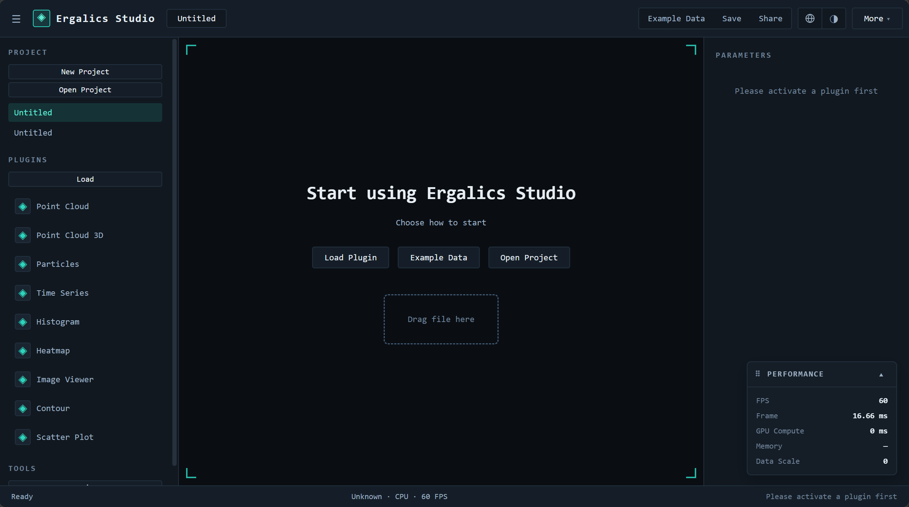
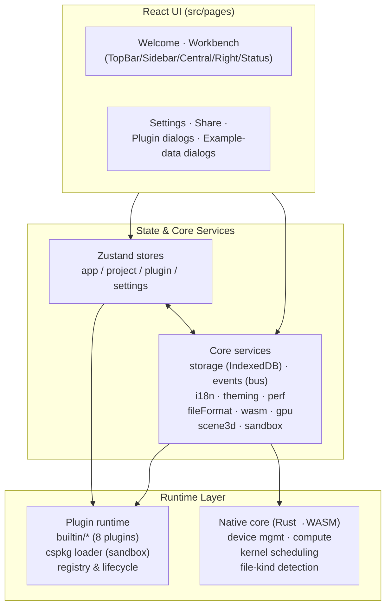

<div align="center">

# ◈ Ergalics Studio

**A browser-based scientific computing workstation scaffold.**

Interactive data exploration, GPU compute scheduling, and a sandboxed
plugin system — all running in the browser, with a Rust/WASM core.

[](https://github.com/SnowLeopard-io/ErgalicsStudio)
[](LICENSE)
[](https://www.typescriptlang.org/)
[](https://react.dev/)
[](#gpu-compute)
[](#native-core)

</div>



---

## Table of Contents

- [Overview](#overview)
- [Features](#features)
- [Architecture](#architecture)
- [Tech Stack](#tech-stack)
- [Getting Started](#getting-started)
- [Project Layout](#project-layout)
- [Plugin System](#plugin-system)
- [GPU Compute & Native Core](#gpu-compute--native-core)
- [Testing](#testing)
- [Documentation](#documentation)
- [Roadmap](#roadmap)
- [Contributing](#contributing)
- [License](#license)

---

## Overview

Ergalics Studio is an **industrial-grade scaffold** for a professional
scientific-computing workstation that runs entirely in the browser. It
combines a React + TypeScript frontend, a Rust core compiled to WebAssembly,
a WebGPU compute pipeline, and a plugin architecture designed for third-party
extensions.

The project is currently in the **planning stage**: the core loop (project
management, data loading, plugin registry, 2D/3D rendering, i18n, theming,
performance monitoring) is functional, while GPU-accelerated computation and
the plugin marketplace are being built out incrementally. Every module is
kept deliberately small and testable so the scaffold can grow into a
production system without a rewrite.

> Status: **Planning stage** — functional scaffold, actively developed.

---

## Features

**Workbench**

- Four-region layout: sidebar (projects/plugins/tools), central viewport,
  right parameter panel, status bar with GPU/perf indicators.
- Project lifecycle: create / open / save / autosave / share (`.clproj`
  format stored in IndexedDB).
- File routing: drag & drop any file; the host detects the format by magic
  number **and** extension (with optional WASM assist) and routes it to a
  matching plugin — with a picker dialog when multiple plugins match.

**Rendering**

- 2D canvas container shared by all 2D plugins (point clouds, particles,
  time series, histograms, heatmaps, image viewer, contour plots, scatter).
- Host-managed **Three.js 3D scene** (`Scene3DHandle`): grid/axes/lights,
  orbit controls, resize handling, auto camera fit, and GPU-safe disposal.
  The 3D surface is created lazily — only for plugins that declare 3D
  capability (`renderToScene`) — and is **automatically hidden when a 2D
  plugin is active**, so a 3D coordinate system never bleeds into a 2D view.

**Plugin system**

- 8 built-in example plugins covering the full API surface.
- `.cspkg` package loading (ZIP with `manifest.json` + entry + assets) with
  manifest validation (id format, entry path traversal guard, sandbox enum).
- **Real sandbox isolation** (§6.2): third-party entry code runs inside a
  Web Worker with a postMessage RPC bridge — no access to the host page's
  globals, DOM, or stores. Canvas rendering works via a transferred
  `OffscreenCanvas`; a documented best-effort fallback exists when Workers
  are unavailable.
- Locale-aware parameter panels (range / select / number / checkbox / text /
  file / button / toggle).

**Infrastructure**

- i18n (zh-CN / en-US) with reactive locale switching.
- Dark/light theming via CSS variables.
- Performance monitor: FPS, frame time, GPU time, memory, data scale, with
  warning thresholds (§7.3).
- Error boundaries, fallbacks, and a banner/notification system.

---

## Architecture



- **Host ↔ plugin contract**: every plugin implements a `Plugin` interface
  (init/destroy/activate/deactivate/render/updateParams/getParams/compute/
  loadData/renderToScene) and receives a `PluginApi` for locale, status,
  perf reporting, notifications, file access, and project-scoped params.
- **Isolation boundary**: sandboxed plugins communicate exclusively through
  a typed RPC protocol (`src/core/sandbox.ts` + `src/core/plugin-worker.ts`).
- **WebGPU**: `src/core/gpu.ts` manages the adapter/device with a CPU
  fallback; the Rust core (`native/ergalics-core`) exposes
  `BindingDescriptor`, `ComputeKernel` (compile/dispatch/compilation_info)
  and `GpuDeviceManager` to JS via wasm-bindgen.

---

## Tech Stack

| Layer      | Choice                                                    |
| ---------- | --------------------------------------------------------- |
| UI         | React 18, react-router-dom 7, Zustand 5                   |
| Language   | TypeScript 5.7 (strict)                                   |
| Build      | Vite 6                                                     |
| 3D         | Three.js r185 (+ @types/three)                            |
| Native     | Rust → wasm32-unknown-unknown, wasm-bindgen 0.2            |
| GPU        | WebGPU / WGSL via web-sys                                  |
| Testing    | Vitest (unit) + Playwright-core (E2E, headless Edge)       |
| Docs       | VitePress (separate `docs/` workspace)                    |
| Packaging  | fflate (cspkg ZIP), lz-string (project compression)       |

---

## Getting Started

### Prerequisites

- **Node.js ≥ 20** and npm
- **Rust toolchain** with the `wasm32-unknown-unknown` target and
  `wasm-bindgen-cli` (only needed to build the native core; the frontend
  degrades gracefully when the WASM module is absent)

### Install

```bash
npm install
```

### Run in development

```bash
npm run dev
```

The app opens at the Vite dev server URL. The welcome page runs hardware
self-checks (WebGPU, WASM, IndexedDB) before entering the workbench.

### Build

```bash
npm run build          # wasm → typecheck → vite build
npm run build:web      # frontend only (no WASM)
npm run build:wasm     # rebuild the Rust core into src/native
```

The production build is emitted to `dist/`. Note that `build:wasm` runs
before `vite build` so the WASM bindings are always fresh.

### Docs site

```bash
cd docs && npm install && npm run dev
```

See [Documentation](#documentation) for details.

---

## Project Layout

```
.
├── src/                      # Frontend
│   ├── core/                 #   services: storage, events, i18n, gpu, wasm,
│   │                         #   fileFormat, scene3d, sandbox, cspkg, …
│   ├── pages/                #   welcome, workbench, settings, share, dialogs
│   ├── plugins/builtin/      #   8 example plugins (2D + 3D)
│   ├── stores/               #   zustand stores (app/project/plugin/settings)
│   ├── types/                #   plugin & project contracts
│   └── native/               #   generated WASM bindings (git-untracked)
├── native/ergalics-core/     # Rust core (device, compute, utils)
├── examples/data/            # sample datasets used by the example plugins
├── scripts/                  # build-wasm · make-example-data · E2E suites
├── tests/                    # Vitest unit tests
└── docs/                     # VitePress documentation workspace
```

---

## Plugin System

### Built-in plugins

| Plugin            | Data                    | Capability                |
| ----------------- | ----------------------- | ------------------------- |
| Point Cloud       | `.xyz`                  | 2D canvas                 |
| Point Cloud 3D    | `.xyz`, `.dat`          | Three.js scene, height ramp |
| Particles         | `.dat`                  | 2D simulation + compute progress |
| Time Series       | `.csv`                  | 2D line charts            |
| Histogram         | `.dat`                  | binning + log scale       |
| Heatmap           | `.json` (grid)          | viridis ramp              |
| Image Viewer      | `.png`                  | base64 asset              |
| Contour           | `.json` (grid)          | color ramp + isolines     |
| Scatter           | `.dat`, `.csv`, `.xyz`  | 2D scatter, color channel |

### Third-party packages (`.cspkg`)

A package is a ZIP containing `manifest.json` plus the entry module and any
assets. Loading validates the manifest (required fields, plugin-id format,
entry path traversal, sandbox enum) and then executes the entry **inside a
Web Worker sandbox** by default:

```jsonc
{
  "id": "com.example.analyzer",
  "name": "Analyzer",
  "version": "1.2.0",
  "author": "Example Corp",
  "description": "…",
  "entry": "dist/index.js",
  "sandbox": "isolated",        // "isolated" (default) | "trusted"
  "formats": [{ "extension": ".dat" }]
}
```

- `sandbox: "isolated"` (default) — runs in a Worker: separate global scope,
  no DOM/window/store access; canvas rendering via `OffscreenCanvas`.
- `sandbox: "trusted"` — executes in the host context with full DOM access.
  Only use for packages you control.

**Limitations (documented honestly)**: workers share the origin's IndexedDB,
and the legacy fallback (`new Function` with shadowed globals) is a
best-effort approximation, **not** a security boundary. The UI warns when the
fallback is used.

---

## GPU Compute & Native Core

The Rust crate `native/ergalics-core` compiles to `wasm32-unknown-unknown`
and is bound with wasm-bindgen. Current surface:

- `GpuDeviceManager` — adapter/device acquisition with CPU-fallback option.
- `KernelDescriptor` + `BindingDescriptor` — describe a compute kernel and
  its buffer bindings (uniform / storage / read-only-storage, dynamic
  offsets, min binding size).
- `ComputeKernel::compile` — builds a **real** `GPUBindGroupLayout` from the
  binding descriptors, compiles the WGSL module, and creates the pipeline.
- `ComputeKernel::dispatch(queue, bindGroup, x, y, z)` — encodes and submits
  a single dispatch.
- `ComputeKernel::compilation_info()` — surfaces WGSL compile diagnostics
  (error/warning + line/column) asynchronously.
- `detect_file_kind` — magic-number file detection used by the loader.

The JS side (`src/core/gpu.ts`) requests the adapter/device, tracks
uncaptured errors and out-of-memory, and reports GPU time to the perf panel.
The compute scheduler is intentionally small; the host drives command
encoders directly for anything beyond a single dispatch.

---

## Testing

Unit tests (Vitest, node environment):

```bash
npm test          # or npm run test:unit
npm run verify    # typecheck + unit tests
```

51 tests across 7 suites: file-format detection, cspkg parsing/validation,
sandbox RPC (including an end-to-end round trip through a fake Worker),
i18n, app store, WASM retry policy, and built-in plugin logic.

E2E suites (Playwright-core, headless Edge) against a production preview:

```bash
npm run test:e2e
```

| Suite                | Covers                                                                 |
| -------------------- | ---------------------------------------------------------------------- |
| `smoke-test`         | boot, auto-loaded plugins, reactive params, project restore            |
| `verify-ui`          | layout, theming, canvas, plugin list                                   |
| `verify-fixes`       | all 8 example plugins render their sample data correctly               |
| `verify-3d`          | 3D point cloud in the host Three.js scene                              |
| `verify-plugins`     | 3D↔2D surface visibility, contour, scatter, tornado sample             |

---

## Documentation

A dedicated VitePress documentation workspace lives in [`docs/`](docs/):

```bash
cd docs
npm install
npm run dev       # local documentation site
npm run build     # static site → docs/.vitepress/dist
```

The production frontend build copies the docs site into `dist/docs/`, so the
welcome page's **Docs** link works from a preview server. The docs site can
also be deployed independently (e.g. GitHub Pages).

---

## Roadmap

See [`docs/guide/roadmap.md`](docs/guide/roadmap.md) for the current status
table. Highlights:

- [x] Workbench layout, project management, file routing
- [x] 8 example plugins (2D + 3D), cspkg loading, Worker sandbox
- [x] WebGPU device management + real compute-kernel pipeline
- [x] i18n, theming, perf monitoring, share links
- [x] Vitest unit tests + Playwright E2E suites
- [ ] GPU-accelerated compute in example plugins (WGSL kernels)
- [ ] Plugin marketplace & package signing
- [ ] GitHub Actions CI (unit + E2E + Pages deploy)

---

## Contributing

1. Fork the repository and create a feature branch.
2. Keep changes small and covered by tests — `npm run verify` must stay
   green, and new plugin/feature work should ship with an E2E check.
3. Run `npm run test:e2e` before opening a pull request (requires the Edge
   browser at its default install path; adjust `EDGE` in the scripts
   otherwise).
4. Regenerate WASM bindings with `npm run build:wasm` when touching
   `native/ergalics-core`.

Report bugs and feature requests via
[GitHub Issues](https://github.com/SnowLeopard-io/ErgalicsStudio/issues).

---

## License

[MIT](LICENSE) © Ergalics Studio contributors
