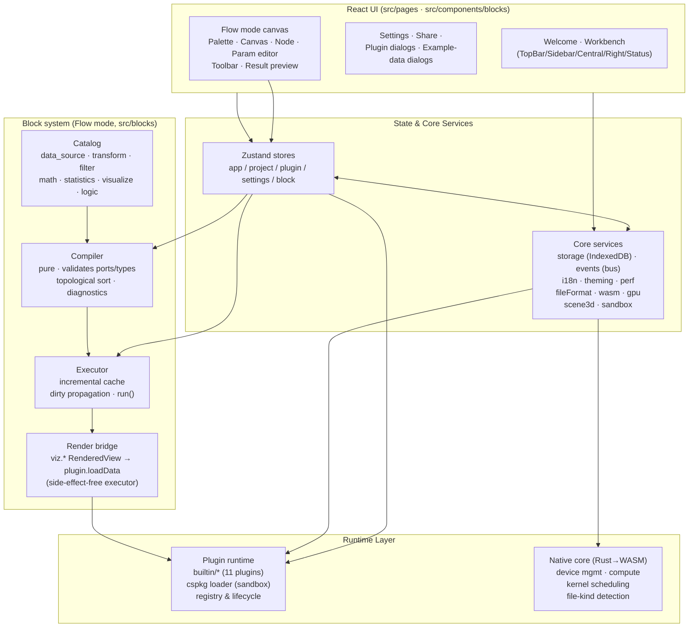

<div align="center">

# ◈ Ergalics Studio

**A browser-based scientific computing workstation scaffold.**

Interactive data exploration, GPU compute scheduling, and a sandboxed
plugin system — all running in the browser, with a Rust/WASM core.

[](https://github.com/SnowLeopard-io/ErgalicsStudio)
[](LICENSE)
[](https://www.typescriptlang.org/)
[](https://react.dev/)
[](#gpu-compute)
[](#native-core)

</div>


---

## Table of Contents

- [Overview](#overview)
- [Features](#features)
- [Architecture](#architecture)
- [Tech Stack](#tech-stack)
- [Getting Started](#getting-started)
- [Project Layout](#project-layout)
- [Standard Mode](#standard-mode)
- [Flow Mode](#flow-mode)
- [Block Mode](#block-mode)
- [Plugin System](#plugin-system)
- [GPU Compute & Native Core](#gpu-compute--native-core)
- [Testing](#testing)
- [Documentation](#documentation)
- [Roadmap](#roadmap)
- [Contributing](#contributing)
- [License](#license)

---

## Overview

Ergalics Studio is an **industrial-grade scaffold** for a professional
scientific-computing workstation that runs entirely in the browser. It
combines a React + TypeScript frontend, a Rust core compiled to WebAssembly,
a WebGPU compute pipeline, and a plugin architecture designed for third-party
extensions.

The workbench exposes three modes for three kinds of users — see the section
for each one below:

- **Standard** — drag a dataset onto a plugin, see the visualisation. The
  fastest path from "I have data" to "I see something".
- **Flow** — compose a visual dataflow pipeline from built-in blocks, run it
  topologically, inspect every node's output.
- **Block** — a Scratch-like block editor where a single "Run" hat block
  kicks off the program. Beginner-friendly, but fully scripted (variables,
  loops, conditionals, transforms, plots).

The project is currently in the **active-development stage**: the core loop
(project management, data loading, plugin registry, 2D/3D rendering, i18n,
theming, performance monitoring, the Flow mode, and the Block mode) is
functional and tested. GPU-accelerated computation beyond the existing
Particles and N-Body plugins, the plugin marketplace, and the Code mode
(Python/R) are being built out incrementally. Every module is kept
deliberately small and testable so the scaffold can grow into a production
system without a rewrite.

> Status: **Active development** — functional scaffold, three workbench
> modes shipped, plugin & GPU compute foundations live.

---

## Features

**Workbench**

- Four-region layout: sidebar (projects/plugins/tools), central viewport,
  right parameter panel, status bar with GPU/perf indicators.
- Project lifecycle: create / open / save / autosave / share (`.clproj`
  format stored in IndexedDB).
- File routing: drag & drop any file; the host detects the format by magic
  number **and** extension (with optional WASM assist) and routes it to a
  matching plugin — with a picker dialog when multiple plugins match.

**Rendering**

- 2D canvas container shared by all 2D plugins (point clouds, particles,
  time series, histograms, heatmaps, image viewer, contour plots, scatter).
- Host-managed **Three.js 3D scene** (`Scene3DHandle`): grid/axes/lights,
  orbit controls, resize handling, auto camera fit, and GPU-safe disposal.
  The 3D surface is created lazily — only for plugins that declare 3D
  capability (`renderToScene`) — and is **automatically hidden when a 2D
  plugin is active**, so a 3D coordinate system never bleeds into a 2D view.

**Plugin system**

- 11 built-in example plugins covering the full API surface.
- `.cspkg` package loading (ZIP with `manifest.json` + entry + assets) with
  manifest validation (id format, entry path traversal guard, sandbox enum).
- **Real sandbox isolation** (§6.2): third-party entry code runs inside a
  Web Worker with a postMessage RPC bridge — no access to the host page's
  globals, DOM, or stores. Canvas rendering works via a transferred
  `OffscreenCanvas`; a documented best-effort fallback exists when Workers
  are unavailable.
- Locale-aware parameter panels (range / select / number / checkbox / text /
  file / button / toggle).

**Infrastructure**

- i18n (zh-CN / en-US) with reactive locale switching.
- Dark/light theming via CSS variables.
- Performance monitor: FPS, frame time, GPU time, memory, data scale, with
  warning thresholds (§7.3).
- Error boundaries, fallbacks, and a banner/notification system.

**Flow mode (visual dataflow pipeline)**

- A second workbench mode next to Standard — toggle with the `Standard | Flow`
  switch in the top bar. Standard mode is *load data → see it*; Flow mode is
  *compose a visual pipeline → run it → see every node's output*.
- 23 built-in blocks organised by category: data sources, transforms, filters,
  math, statistics, and visualizations. Control-flow blocks (if/else, repeat,
  parallel) are deliberately deferred — the `region` seam on `BlockInstance`
  is in place so they slot in later as an extension, not a refactor.
- **Compiler is a pure function**: structural validation (ports / required
  inputs / type compatibility), cycle detection, and Kahn-style topological
  sort. Errors come back as structured `diagnostics` so the canvas can paint
  red edges and an inline diagnostic strip without ever throwing.
- **Executor with incremental caching** at per-node granularity plus a
  dirty-propagation invalidation pass — change a single block's parameter and
  only it and its downstream re-execute.
- **Result preview** with one click: `RenderedView` outputs go through the
  existing plugin renderer (scatter, histogram, …); `DataTable` outputs
  render as a read-only table (so `stats.summary` / `stats.histogram` bins
  actually show something); `Scalar` outputs render inline. A chip switcher
  picks which node to inspect when a pipeline has more than one output.
- **Reactive parameter editor** bound to the selected node, with a two-way
  link to the canvas — the node card shows the live `key: value` summary, so
  you always see what the canvas is actually running.
- **Block metadata is localized** (`nameI18n` / `descriptionI18n`) and the
  palette, node card, and parameter panel all resolve via
  `src/blocks/l10n.ts`, so adding a locale is a data-only change.
- **Sample pipelines live as `.clproj` files** under `examples/projects/`
  (`block-01-signal-analysis.clproj`, …). They are normal projects — loadable
  through the standard project picker — and discovered at build time via
  `import.meta.glob`. Adding a new sample is dropping a file plus an entry in
  `SAMPLE_META`.
- The whole graph persists into the project's `blockGraph` and rehydrates on
  open, sharing the autosave/share/export pipeline that already backs every
  `.clproj`.

**Block mode (Scratch-style scripted editor)**

- A third workbench mode — `Standard | Flow | Blocks | Code` in the top
  bar. The Block mode is the entry point for learners and for anyone who
  wants an imperative feel: you write a top-down script of blocks under a
  single green **「运行时 / Run」hat**, and that hat is the only execution
  entry point (orphan blocks never run).
- 30+ built-in blocks organised by category — Start, Data, Variables,
  Operators, Transform, Statistics, Visualize, Control, Utility — covering
  data sources (`load CSV`, `load XYZ`, `random`, `range`), transforms
  (`normalize`, `sort`, `select`, `filter`), statistics (`summary`,
  `histogram`), plots (`scatter`, `line`, `histogram`, `point cloud`),
  control flow (`if`, `repeat`, `while`, `for_each`), and 1-to-1 utility
  primitives (`set`, `print`).
- **Shared IR** (`src/editor/ir/`) is the single source of truth. Block
  JSON ↔ IR round-trips in a pure, Node-testable module — when a future
  Code mode lands, the IR is what it shares with Block mode for
  bidirectional sync.
- **IR interpreter** (`src/editor/runtime/interpreter.ts`) walks the IR
  directly and calls into the **same `studio.*` API** that Flow-mode blocks
  use (`studio.load / normalize / plot / print / …`), so `studio.plot(
  'scatter', df, { x, y })` lands in the very same scatter plugin a Flow-
  mode `viz.scatter` block does.
- **IR → JS / Python codegen** (`src/editor/codegen/`) emits runnable code
  from the IR; the toolbar's "Python" / "JS" toggle shows the live codegen
  result for the current workspace.
- **Blockly 13** powers the canvas (`src/editor/block/`); the package is
  **lazy-loaded** so Standard / Flow first paint is unaffected (~828 KB
  on-demand chunk).
- **Block names, tooltips, dropdown options, and toolbox categories are
  localised** through Blockly's `BKY_*` key system; switching language
  re-creates the workspace with re-labelled blocks and is verified by a
  dedicated unit test (`tests/editor/block-i18n.test.ts`).
- **Sample programs** live in `src/editor/block/samples.ts` (5 built-in
  pipelines: galaxy scatter, telemetry line, random histogram, normalised
  scatter, repeat-print) and are loaded via the **Examples** dialog in the
  top bar — discoverable by any user, one click away.

---

## Architecture



- **Host ↔ plugin contract**: every plugin implements a `Plugin` interface
  (init/destroy/activate/deactivate/render/updateParams/getParams/compute/
  loadData/renderToScene) and receives a `PluginApi` for locale, status,
  perf reporting, notifications, file access, and project-scoped params.
- **Isolation boundary**: sandboxed plugins communicate exclusively through
  a typed RPC protocol (`src/core/sandbox.ts` + `src/core/plugin-worker.ts`).
- **WebGPU**: `src/core/gpu.ts` manages the adapter/device with a CPU
  fallback; the Rust core (`native/ergalics-core`) exposes
  `BindingDescriptor`, `ComputeKernel` (compile/dispatch/compilation_info)
  and `GpuDeviceManager` to JS via wasm-bindgen.

---

## Tech Stack

| Layer      | Choice                                                    |
| ---------- | --------------------------------------------------------- |
| UI         | React 18, react-router-dom 7, Zustand 5                   |
| Language   | TypeScript 5.7 (strict)                                   |
| Build      | Vite 6                                                     |
| 3D         | Three.js r185 (+ @types/three)                            |
| Native     | Rust → wasm32-unknown-unknown, wasm-bindgen 0.2            |
| GPU        | WebGPU / WGSL via web-sys                                  |
| Testing    | Vitest (unit) + Playwright-core (E2E, headless Edge)       |
| Docs       | VitePress (separate `docs/` workspace)                    |
| Packaging  | fflate (cspkg ZIP), lz-string (project compression)       |

---

## Getting Started

### Prerequisites

- **Node.js ≥ 20** and npm
- **Rust toolchain** with the `wasm32-unknown-unknown` target and
  `wasm-bindgen-cli` (only needed to build the native core; the frontend
  degrades gracefully when the WASM module is absent)

### Install

```bash
npm install
```

### Run in development

```bash
npm run dev
```

The app opens at the Vite dev server URL. The welcome page runs hardware
self-checks (WebGPU, WASM, IndexedDB) before entering the workbench.

### Build

```bash
npm run build          # wasm → typecheck → vite build
npm run build:web      # frontend only (no WASM)
npm run build:wasm     # rebuild the Rust core into src/native
```

The production build is emitted to `dist/`. Note that `build:wasm` runs
before `vite build` so the WASM bindings are always fresh.

### Docs site

```bash
cd docs && npm install && npm run dev
```

See [Documentation](#documentation) for details.

---

## Project Layout

```
.
├── src/                      # Frontend
│   ├── core/                 #   services: storage, events, i18n, gpu, wasm,
│   │                         #   fileFormat, scene3d, sandbox, cspkg, …
│   ├── blocks/               #   block system (Flow mode):
│   │                         #     types · registry · compiler · executor ·
│   │                         #     ops · catalog · sample · l10n · render
│   ├── editor/               #   Block mode & (future) Code mode:
│   │                         #     ir · block (Blockly) · codegen ·
│   │                         #     runtime (StudioApi + interpreter)
│   ├── components/blocks/    #   Flow-mode canvas, palette, node, param editor,
│   │                         #     toolbar, result preview, workbench shell
│   ├── components/editor/    #   Block-mode canvas, variable / console panels
│   ├── pages/                #   welcome, workbench, settings, share, dialogs
│   ├── plugins/builtin/      #   11 example plugins (2D + 3D)
│   ├── stores/               #   zustand stores (app/project/plugin/settings/block/editor)
│   ├── types/                #   plugin & project & editor contracts
│   └── native/               #   generated WASM bindings (git-untracked)
├── native/ergalics-core/     # Rust core (device, compute, utils)
├── examples/
│   ├── data/                 # sample datasets used by the example plugins
│   └── projects/             # sample `.clproj` projects (incl. Flow pipelines)
├── scripts/                  # build-wasm · make-example-data · E2E suites
├── tests/                    # Vitest unit tests
├── docs/                     # VitePress documentation workspace
└── block-code-modes.md       # Block + Code mode design draft
```

---

## Standard Mode


The default landing experience. Three panels: a **left rail** that lists your
projects and plugins, a **centre viewport** that hosts whichever plugin is
active (with a drop zone on first launch), and a **right panel** that turns
the active plugin's declared parameters into reactive form fields. Files
dragged onto the centre (or onto the plugin list) are routed by extension and
magic number to a matching plugin; when more than one plugin matches, a
chooser dialog lets you decide.

This is the mode you want when you already know which plugin answers your
question and just need to point it at a file.

---

## Flow Mode


A second workbench mode. Instead of *using* a plugin, you **compose a visual
dataflow pipeline** from built-in blocks and run it. The pipeline editor
lives on the left of the screen (palette), the canvas in the middle (nodes
+ edges), a parameter editor on the right for whichever node is selected,
and a live **result preview** at the bottom that adapts to the chosen
node's output type:

- **`RenderedView`** (any `viz.*` node) — routed through the existing plugin
  renderer (scatter, histogram, …).
- **`DataTable`** (a `stats.summary` / `stats.histogram` row) — a read-only
  table so non-viz outputs become visible too.
- **`Scalar`** — an inline value.

The graph persists into the project's `blockGraph` and rehydrates on open,
sharing the autosave/share/export pipeline that backs every `.clproj`. See
[`docs/guide/flow-mode.md`](docs/guide/flow-mode.md) for the architecture
(compiler + incremental executor + the render bridge), and the sample
pipelines under `examples/projects/`.

---

## Block Mode


A Scratch-style block editor for fully scripted programs. A single green
**「运行时 / Run」hat block** is the only entry point — anything not connected
underneath it is ignored at run time, which makes "broken code" impossible
to execute accidentally. Below the hat, blocks wire together into a
top-down script: `set df = load CSV telemetry.csv` → `set n = normalize
df column temp min-max` → `scatter df X:time Y:temp_minmax color:…`.

The run button ships a **live result preview**, **variables** panel, and
**console** panel in the right-hand cards, so each run shows you what your
data became and what got printed.

Under the hood:

- **Shared IR** (`src/editor/ir/`) is the single source of truth for both
  Block mode and the (upcoming) Code mode. Block JSON ↔ IR round-trips in a
  Node-testable pure module.
- **IR interpreter** (`src/editor/runtime/interpreter.ts`) walks the IR
  directly and calls into the same `studio.*` API that the Flow mode
  blocks use — so `studio.plot('scatter', df, { x, y })` lands in the
  very same scatter plugin as a Flow-mode `viz.scatter` block.
- **IR → JS / Python codegen** (`src/editor/codegen/`) reuses the same IR
  to emit code, powering the "view code" overlay in the toolbar.
- **Blockly 13** (`src/editor/block/`) provides the canvas; the package
  is **lazy-loaded** so Standard/Flow first paint is unaffected (~828 KB
  chunk on demand).
- **i18n** is wired through `BKY_*` keys into Blockly's locale system
  — switching language re-creates the workspace with re-labelled blocks.

See [`docs/guide/block-mode.md`](docs/guide/block-mode.md) for the full
architecture, the 30+ built-in blocks, the 5 sample programs, and the
limitations / next steps.

---

## Plugin System

### Built-in plugins

| Plugin            | Data                    | Capability                |
| ----------------- | ----------------------- | ------------------------- |
| Point Cloud       | `.xyz`                  | 2D canvas                 |
| Point Cloud 3D    | `.xyz`, `.dat`          | Three.js scene, height ramp |
| Particles         | `.dat`                  | 2D simulation + real WGSL compute + progress |
| Time Series       | `.csv`                  | 2D line charts            |
| Histogram         | `.dat`                  | binning + log scale       |
| Heatmap           | `.json` (grid)          | viridis ramp              |
| Image Viewer      | `.png`                  | base64 asset              |
| Contour           | `.json` (grid)          | color ramp + isolines     |
| Scatter           | `.dat`, `.csv`, `.xyz`  | 2D scatter, color channel |
| N-Body Gravity    | `.json` (bodies)        | 3D Three.js points + WGSL all-pairs gravity |
| Protein Interactions | `.json` (network)    | force-directed layout + component metrics |

Two of the eleven are shown below — a 3-D astrophysics demo and a
systems-biology demo, both of which lean on the real WGSL compute path
(with identical CPU fallbacks):

**N-Body Gravity** — direct-summation gravity, O(N²) per step, on the GPU.


**Protein Interactions** — force-directed layout of a PPI network with
component metrics.


Every built-in runs the same math on CPU when WebGPU is absent — see
[GPU Compute & Native Core](#gpu-compute--native-core) and
[`docs/guide/plugins.md`](docs/guide/plugins.md) for all eleven plugins and
their compute paths.

### Third-party packages (`.cspkg`)

A package is a ZIP containing `manifest.json` plus the entry module and any
assets. Loading validates the manifest (required fields, plugin-id format,
entry path traversal, sandbox enum) and then executes the entry **inside a
Web Worker sandbox** by default:

```jsonc
{
  "id": "com.example.analyzer",
  "name": "Analyzer",
  "version": "1.2.0",
  "author": "Example Corp",
  "description": "…",
  "entry": "dist/index.js",
  "sandbox": "isolated",        // "isolated" (default) | "trusted"
  "formats": [{ "extension": ".dat" }]
}
```

- `sandbox: "isolated"` (default) — runs in a Worker: separate global scope,
  no DOM/window/store access; canvas rendering via `OffscreenCanvas`.
- `sandbox: "trusted"` — executes in the host context with full DOM access.
  Only use for packages you control.

**Limitations (documented honestly)**: workers share the origin's IndexedDB,
and the legacy fallback (`new Function` with shadowed globals) is a
best-effort approximation, **not** a security boundary. The UI warns when the
fallback is used.

---

## GPU Compute & Native Core

The Rust crate `native/ergalics-core` compiles to `wasm32-unknown-unknown`
and is bound with wasm-bindgen. Current surface:

- `GpuDeviceManager` — adapter/device acquisition with CPU-fallback option.
- `GpuBuffer` — the missing buffer half of the compute foundation: create
  with an explicit usage mask (`create_storage`, `create_readable_storage`,
  `create_uniform`), upload bytes with `write`, and read results back with
  `read` (copies into a dedicated `MAP_READ | COPY_DST` readback buffer — see
  the buffer-usage note below).
- `KernelDescriptor` + `BindingDescriptor` — describe a compute kernel and
  its buffer bindings (uniform / storage / read-only-storage, dynamic
  offsets, min binding size).
- `ComputeKernel::compile` — builds a **real** `GPUBindGroupLayout` from the
  binding descriptors, compiles the WGSL module, and creates the pipeline.
- `ComputeKernel::bind_group` — materializes a bind group (buffer *i* →
  binding *i*) from the kernel's retained layout.
- `ComputeKernel::run(queue, buffers, x, y, z)` — bind group + dispatch +
  submit in one call; `dispatch(queue, bindGroup, x, y, z)` remains for
  host-managed command encoders.
- `ComputeKernel::compilation_info()` — surfaces WGSL compile diagnostics
  (error/warning + line/column) asynchronously.
- `detect_file_kind` — magic-number file detection used by the loader.

### Host-side compute service

`src/core/gpu.ts` owns the adapter/device lifecycle (CPU fallback, OOM
tracking). On top of it, `src/core/compute.ts` exposes the **plugin-facing
compute surface** (`PluginApi.gpu`): `createBuffer` / `write` / `read`,
`compileKernel` + `compilationInfo`, and one-shot `run`. It routes through
the Rust core when the WASM module is loaded and through the raw WebGPU API
otherwise — so accelerated compute works in dev *and* production, and the
Rust core stays the reference engine.

Reusable WGSL kernels live in `src/core/wgsl.ts` (particle integration and
3-D all-pairs N-body gravity), paired with host-side pack/unpack helpers that
mirror the kernel math for the CPU fallback. The Particles plugin demonstrates
the single-buffer path (upload interleaved `[x, y, vx, vy]` + uniform params →
dispatch the WGSL integrator → read back → report real GPU time); the N-Body
plugin demonstrates the heavier all-pairs path with ping-pong buffers that keep
every integration step on the device with no per-step read-back.

> When WebGPU (or the WASM module) is unavailable, `api.gpu` is `undefined`
> and plugins fall back to CPU — same behaviour, no GPU required.

---

## Testing

Unit tests (Vitest, node environment):

```bash
npm test          # or npm run test:unit
npm run verify    # typecheck + unit tests
```

126 tests across 17 suites: file-format detection, cspkg parsing/validation,
sandbox RPC (including an end-to-end round trip through a fake Worker),
i18n, app store, WASM retry policy, GPU compute (WGSL templates, buffer
packing, CPU integrator, service gating), built-in plugin logic, and the
block system end-to-end — `DataTable` ops, registry, compiler
(validation/topology/type-check), executor (incremental cache + invalidation),
geometry, catalog executors, the `viz.*` → plugin render bridge, and the
pipeline samples that load via `import.meta.glob`.

E2E suites (Playwright-core, headless Edge) against a production preview:

```bash
npm run test:e2e
```

| Suite                | Covers                                                                 |
| -------------------- | ---------------------------------------------------------------------- |
| `smoke-test`         | boot, auto-loaded plugins, reactive params, project restore            |
| `verify-ui`          | layout, theming, canvas, plugin list                                   |
| `verify-fixes`       | all 11 example plugins render their sample data correctly              |
| `verify-3d`          | 3D point cloud in the host Three.js scene                              |
| `verify-plugins`     | 3D↔2D surface visibility, contour, scatter, tornado sample             |

---

## Documentation

A dedicated VitePress documentation workspace lives in [`docs/`](docs/):

```bash
cd docs
npm install
npm run dev       # local documentation site
npm run build     # static site → docs/.vitepress/dist
```

The production frontend build copies the docs site into `dist/docs/`, so the
welcome page's **Docs** link works from a preview server. The docs site can
also be deployed independently (e.g. GitHub Pages).

---

## Roadmap

See [`docs/guide/roadmap.md`](docs/guide/roadmap.md) for the current status
table. Highlights:

- [x] Workbench layout, project management, file routing
- [x] 11 example plugins (2D + 3D), cspkg loading, Worker sandbox
- [x] WebGPU device management + real compute-kernel pipeline
- [x] i18n, theming, perf monitoring, share links
- [x] Flow mode — visual dataflow pipeline (compiler + incremental executor + 23 built-in blocks + canvas UI + sample pipelines in `examples/projects/`)
- [x] Vitest unit tests + Playwright E2E suites
- [x] Plugin compute surface (`api.gpu`), WGSL templates, Particles accelerated
- [ ] GPU acceleration across all example plugins (histogram/heatmap/point cloud)
- [ ] Plugin marketplace & package signing
- [ ] GitHub Actions CI (unit + E2E + Pages deploy)
- [x] Block mode (Scratch-like, Google Blockly) — see [Block Mode](docs/guide/block-mode.md) and the [design draft](block-code-modes.md). 30+ built-in blocks, shared IR with the interpreter, lazy-loaded Blockly 13, and 5 sample programs; lives behind the `Blocks` top-bar slot.
- [ ] Code mode (Python/Pyodide, R/webR) — same IR, bidirectional block ↔ code sync; Phase 2 (Python via Pyodide) lands next.

---

## Contributing

1. Fork the repository and create a feature branch.
2. Keep changes small and covered by tests — `npm run verify` must stay
   green, and new plugin/feature work should ship with an E2E check.
3. Run `npm run test:e2e` before opening a pull request (requires the Edge
   browser at its default install path; adjust `EDGE` in the scripts
   otherwise).
4. Regenerate WASM bindings with `npm run build:wasm` when touching
   `native/ergalics-core`.

Report bugs and feature requests via
[GitHub Issues](https://github.com/SnowLeopard-io/ErgalicsStudio/issues).

---

## License

[MIT](LICENSE) © Ergalics Studio contributors
