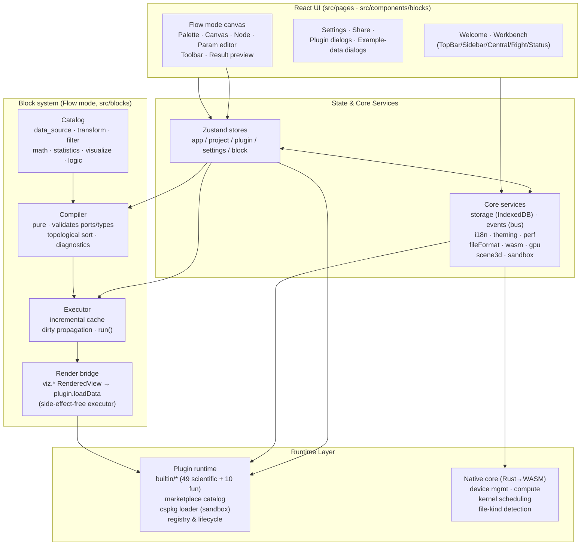

<div align="center">


<h1>Ergalics Studio</h1>

<p><b>An in-browser scientific computing workstation</b> — interactive data
exploration, GPU compute scheduling, and a sandboxed plugin system, all
running in the browser with a Rust/WASM core.</p>

<p>
<a href="https://snowleopard-io.github.io/ErgalicsStudio/"></a>
<a href="https://snowleopard-io.github.io/ErgalicsStudio/app/"></a>
<a href="https://snowleopard-io.github.io/ErgalicsStudio/app/docs/"></a>
</p>

<p>
<a href="https://github.com/SnowLeopard-io/ErgalicsStudio"></a>
<a href="LICENSE"></a>
<a href="https://www.typescriptlang.org/"></a>
<a href="https://react.dev/"></a>
<a href="#gpu-compute"></a>
<a href="#native-core"></a>
</p>

</div>

<br>


---

## Table of Contents

- [Overview](#overview)
- [Features](#features)
- [Architecture](#architecture)
- [Tech Stack](#tech-stack)
- [Getting Started](#getting-started)
- [Project Layout](#project-layout)
- [Standard Mode](#standard-mode)
- [Flow Mode](#flow-mode)
- [Block Mode](#block-mode)
- [Code Mode](#code-mode)
- [Research Modules](#research-modules-科研)
- [Plugin System](#plugin-system)
- [GPU Compute & Native Core](#gpu-compute--native-core)
- [Testing](#testing)
- [Documentation](#documentation)
- [Roadmap](#roadmap)
- [Contributing](#contributing)
- [License](#license)

---

## Overview

Ergalics Studio is a professional scientific-computing workstation that runs
entirely in the browser. It combines a React + TypeScript frontend, a Rust
core compiled to WebAssembly, a WebGPU compute pipeline, and a plugin
architecture designed for third-party extensions.

The workbench exposes four modes for four kinds of users — see the section
for each one below:

| Mode           | For                                    | What you do                                                                                                                    |
| -------------- | -------------------------------------- | ------------------------------------------------------------------------------------------------------------------------------ |
| **Standard**   | "I have data → I see something"        | Drag a dataset onto a plugin and the visualisation appears — the fastest path.                                                  |
| **Flow**       | Pipeline builders                      | Compose a visual dataflow pipeline from built-in blocks, run it topologically, inspect every node's output.                    |
| **Block**      | Learners / imperative feel             | A Scratch-like block editor where one green "Run" hat kicks off the program — fully scripted (variables, loops, conditionals, transforms, plots). |
| **Code**       | Real scripting                         | A Monaco editor for **Python / R / JavaScript**: Python runs CPython via a Pyodide worker, R/JS execute on the shared in-process IR engine; switching language translates the whole buffer instantly. REPL console, variable panel and `studio.*` autocompletion included. |

Ergalics Studio is under **active development** and already usable end to
end: the core loop (project management, data loading, plugin registry, 2D/3D
rendering, i18n, theming, performance monitoring, the Flow mode, the Block
mode, and a Code mode that speaks Python/R/JavaScript) is functional and
covered by tests. GPU acceleration spans Particles, N-Body, the LBM fluid,
the wave equation, histogram, heatmap and point-cloud kernels. On top of the
first research toolset (experiment tracking, uncertainty quantification, a
unit system, data lineage, chunked ingestion, a figure studio, supplement
packaging and a notebook), a second-generation research platform has
landed: a GPU uncertainty engine, Sweep Studio, Signal Lab, Model Lab, Data
Profiler, Repro Lock, a DuckDB-powered SQL Workbench, a Report Builder and
Inference Forge (HMC/NUTS Bayesian inference) — every research tool is a
standalone full-page lab sharing one unified shell. A ten-plugin
**geography suite** has landed as well — mapping, solar geometry,
climographs, population pyramids, IDW/kriging interpolation, distance &
area measure with standard-deviational ellipses, Tissot projection
distortion, DEM terrain analysis with watershed delineation, GPX tracks
and a 3-D globe — each built on research-grade algorithms (LOOCV +
global Moran's I, priority-flood → D8 → flow accumulation, FAO-56
radiation) and each with a one-click **Send to Figure Studio** action
that composes a multi-panel figure with a bilingual method caption. The
code editor now speaks Python, R and JavaScript (R/JS run on the in-process IR engine —
the IR base always ships, while a full free-form R runtime (webR) stays
optional and is not vendored by default). Ed25519 package signing for
the marketplace already ships (FR-05); consuming webR for free-form R
syntax is the next milestone. Every
module is kept deliberately small and testable so the
codebase keeps scaling without a rewrite.

> Status: **Active development** — usable today. What ships:

| Area              | Shipped today |
| ----------------- | ------------- |
| Workbench         | 4 modes (Standard / Flow / Block / Code), 59 built-in plugins (49 scientific + 10 fun), sandboxed plugin system + marketplace catalog |
| Compute           | Live WebGPU compute, in-browser AI training plugin, AI assistant (offline rule engine / online OpenAI-compatible service) |
| Data & plots      | Scientific binary I/O (HDF5 / NetCDF / FITS / Zarr / Parquet), publication-grade SVG/PDF plot engine, statistics subsystem, reproducibility support |
| Code editing      | Three languages — Python via Pyodide; R and JavaScript via the shared in-process IR engine |
| Research          | 19-page research workbench (Analysis, Runs, Uncertainty, Model Lab, Inference Forge, Model Inference, Profiler, Signal Lab, Sweeps, SQL, Cleaning, Report, Repro Lock, Lineage, Figure Studio, Notebook, Supplement, Course, Gallery) + unit-system and chunked-ingestion kernels |
| Web surfaces      | Official website (gallery / theme marketplace / plugin marketplace) deep-linked into the workbench |
| Next up           | Full free-form R runtime (webR, optional & not vendored by default) |

---

## Features

**Workbench**

- Four-region layout: sidebar (projects / plugins), central viewport, right
  parameter panel, status bar with GPU/perf indicators. The top bar groups
  its actions into five semantic clusters separated by dividers —
  `[标准 | 流程 | 积木 | 代码]` mode switch, `[数据⓷ | 示例]` data cluster,
  `[项目▾ | 保存 | 分享]` project cluster (项目▾ = new / open / save-as /
  export log), `[分析 | 科研▾]` research cluster, and `[⚙ | ? | FPS | 语言 |
  主题]` environment cluster.
- Welcome-page quick start: four workbench mode cards (Standard / Flow /
  Block / Code) plus a searchable launch grid for all 14 standalone
  research tools (Analysis keeps its own quick entry); the same four mode
  cards render in the workbench empty state. A guided tour (`?` in the top
  bar) walks new users through the workbench.
- Project lifecycle: create / open / save / autosave / share (`.clproj`
  format stored in IndexedDB).
- File routing: drag & drop any file; the host detects the format by magic
  number **and** extension (with optional WASM assist) and routes it to a
  matching plugin — with a picker dialog when multiple plugins match, and
  a replace confirmation when a data file with the same name already
  exists in the project.
  Import dialogs filter by file format so unrecognized files never reach a
  parser.

**Rendering**

- 2D canvas container shared by all 2D plugins (point clouds, particles,
  time series, histograms, heatmaps, image viewer, contour plots, scatter,
  bar charts, radar, network graphs, bubble charts, violin plots, sankey
  diagrams, box plots, parallel coordinates, error bands, treemaps, QQ
  plots, and the fractal/art toys).
- Host-managed **Three.js 3D scene** (`Scene3DHandle`): grid/axes/lights,
  orbit controls, resize handling, auto camera fit, and GPU-safe disposal.
  The 3D surface is created lazily — only for plugins that declare 3D
  capability (`renderToScene`) — and is **automatically hidden when a 2D
  plugin is active**, so a 3D coordinate system never bleeds into a 2D view.
  All 3-D plugins share this one host scene, and every plugin switch fully
  clears the previous plugin's objects, so nothing leaks between views even
  when jumping directly from one 3-D plugin to another.

**Plugin system**

- **59 built-in plugins** — 49 scientific/core plugins plus 10 fun &
  utility toys — covering the full API surface (2D canvas, Three.js scene,
  WGSL compute, buttons/toggles, sandboxing, in-browser model training).
- **Two-tier loading**: core plugins are auto-loaded at startup; fun/utility
  plugins declare `autoload: false` and are loaded on demand from the
  built-in panel or the marketplace tab, keeping the startup registry lean.
- **Marketplace catalog** (`src/plugins/marketplace.ts`) — every built-in
  plugin is surfaced with curated tags, popularity, and category filters
  (scientific / fun / utility); community "coming soon" submissions are
  listed as placeholders.
- `.cspkg` package loading (ZIP with `manifest.json` + entry + assets) with
  manifest validation (id format, entry path traversal guard, sandbox enum).
- **Worker-first plugin isolation** (§6.2): third-party entry code runs inside a
  Web Worker with a postMessage RPC bridge — no access to the host page's
  globals, DOM, or stores. Canvas rendering works via a transferred
  `OffscreenCanvas`. When Workers are unavailable, execution falls back to a
  best-effort restricted `new Function` scope on the main thread; that
  fallback is **not a security sandbox** (a determined escape exists) and is
  gated by the same signature gate as every `.cspkg` load — tampered packages
  always throw, unsigned/unknown-key packages require explicit user trust
  confirmation (FR-05). See `SECURITY.md` for the exact trust boundary.
- Locale-aware parameter panels (range / select / number / checkbox / text /
  file / button / toggle).
- One-click export on every built-in plugin: PNG snapshots of the 2-D
  canvas or the 3-D scene, plus RFC-4180 CSV export (UTF-8 BOM, with row
  caps and sampling for simulations) from every chart/viewer that owns
  tabular data. Several plugins also gained analysis overlays — OLS
  trendlines and rolling means, cumulative/density histograms, box-plot
  mean markers, violin jitter points, bar ordering, and Game-of-Life
  pattern presets. Every plugin in the geography suite additionally ships
  a **Send to Figure Studio** action that composes a multi-panel figure
  sheet — auto panel tags plus a bilingual (English / 中文) caption
  stating the method and formulas.

**Infrastructure**

- i18n (zh-CN / en-US) with reactive locale switching.
- Dark/light theming via CSS variables.
- Performance monitor: FPS, frame time, GPU time, memory, data scale, with
  warning thresholds (§7.3).
- Error boundaries, fallbacks, and a banner/notification system, backed by a
  research-grade reliability core: a structured error taxonomy (codes,
  severity, retriable flags, cause chains), a `Result` type, bounded
  backoff-and-jitter retry, assertion guards, a deduping error registry with
  a bounded diagnostics ring, and global `error` / `unhandledrejection`
  capture (`src/core/errors/`), plus a composable path-addressed validation
  framework with safe JSON / numeric-text parsing (`src/core/validation/`).

**Scientific computing subsystems (pure TypeScript, unit-tested)**

- **Statistics kernel** (`src/core/stats/`) — descriptive statistics,
  special functions (incomplete gamma/beta, inverse CDFs), hypothesis
  tests (one/two-sample & paired t-tests, one-way ANOVA, Mann–Whitney U,
  chi-square independence), effect sizes (Cohen's d, Pearson/Spearman
  correlation), multiple-comparison corrections (Bonferroni,
  Benjamini–Hochberg) and two-sample power analysis.
- **Scientific binary I/O** (`src/core/io/`) — a single dispatcher routes
  dropped files to loaders for HDF5 (h5wasm), NetCDF (netcdfjs), FITS
  (fitsjs), Parquet (parquet-wasm) and Zarr (zarrita), turning each
  variable/dataset/HDU into project data files.
- **Publication-grade plot engine** (`src/core/plot/`) — a pure-TS
  SVG renderer with linear/log/temporal scales and nice ticks, plus
  SVG and PDF export for line, scatter, histogram and bar charts.
- **Reproducibility kernel** (`src/core/repro/`) — seeded RNG
  (mulberry32), stable hashing, run manifests (seed + version + input
  hashes + graph hash) and DAG-to-Python export for reruns.
- **Run-log export** (`src/core/logger.ts` + `download.ts`) — session
  logs can be exported from the workbench for bug reports.
- **Data-quality engine** (`src/core/data-quality/`) — Pandera-style
  column/table expectations evaluated lazily into a row-addressed quality
  report: type inference and profiling (quartiles, IQR outliers,
  missing/distinct counts), schema suggestion inferred from a profile,
  per-row quarantine of rejected rows with reasons, and a `DataTable`
  adapter bridging the columnar store to the row-oriented engine.

**Research toolset (科研 — pure-TS cores + Zustand stores + standalone pages)**

Every research tool is now a **standalone full page** (not a dialog) sharing
one lab shell — a back-to-workbench header plus an unconstrained scrollable
body. The cores under `src/core/` stay pure TypeScript, unit-tested, and
wired into the event bus, so run history, the lineage DAG and the
supplement manifest pick them up automatically.

| Tool | Core | Highlights |
| ---- | ---- | ---------- |
| Experiment tracking | `src/core/experiment/` | every Flow / Block / Code / Notebook / Sweep / Uncertainty / Model-Lab run recorded into a per-project IndexedDB store with source, params, metrics, duration; A/B parameter diffing |
| GPU uncertainty engine | `src/core/uncertainty/` | bootstrap CIs, Monte-Carlo propagation, Metropolis–Hastings MCMC; WGSL GPU path (PCG32 RNG, one workgroup per chain) for million-sample resampling; R-hat / ESS convergence diagnostics |
| Model Lab | `src/core/model/` | OLS (QR), logistic (IRLS), ridge (K-fold CV), polynomial; coefficient tables (estimate / SE / p / CI) + 2×2 residual diagnostics |
| Data Profiler | `src/core/profiler/` | one streaming pass → per-column profiles, correlation matrix, 0–100 quality score; cached by content fingerprint |
| Signal Lab | `src/core/signal/` | FFT / Welch PSD, windows, Savitzky–Golay & moving-average filters, ACF/PACF, seasonal decomposition; filtered columns save back as derived files in the lineage DAG |
| Sweep Studio | `src/core/sweep/` | 1–3 parameter axes (grid / list / Latin hypercube) batch-run any pipeline; error-bar lines, response-surface heatmaps, parallel coordinates; plan drafts validated in a pure domain layer, stale results auto-detected |
| SQL Workbench | `src/core/sql/` | lazy DuckDB-WASM registers project files as tables; joins / aggregates / window functions in Monaco; results saved as CSVs with lineage edges |
| Report Builder | `src/core/report/` | ordered sections (headings, markdown, figures, tables, run summaries, interactive filters) → one self-contained HTML with inline SVG, light/dark, zh/en |
| Repro Lock | `src/core/repro/lock.ts` | export `repro.lock` (data fingerprints + param hashes + seeds + code snapshots), five-class drift verification, one-click re-run |
| Unit system | `src/core/units/` | typed `Quantity` with SI prefixes, dimensional algebra, conversion checks; `units.convert` / `units.check` Flow blocks + `QuantityInput` widget |
| Data lineage | `src/core/lineage/` | file→run DAG rebuilt from run records + ingestion events, layered SVG canvas; SQL queries, derived columns and sweeps appear as nodes |
| Chunked ingestion | `src/core/chunked/` | async row-window reader for large delimited files with column projection, preview sampling, content fingerprinting |
| Figure Studio | `src/core/figure/` | multi-panel publication figures on IEEE / Elsevier templates, auto panel tags, captions, live SVG preview, SVG / PDF / PNG-600dpi export |
| Supplement packaging | `src/core/package/` | one-click paper-ready ZIP: `manifest.json` (metadata + runs + lineage + author/license form) + optional data files and code sessions |
| Notebook | `src/core/notebook/` | markdown/code cells persisted in the project; code cells run on a dedicated Pyodide runtime, every run feeds the experiment history |
| Inference Forge | `src/core/inference/` | HMC / NUTS samplers (DualAveraging, U-turn), R-hat / bulk & tail-ESS, HDI, MCSE, WAIC / PSIS-LOO, PPC; declarative likelihood templates with data-scaled weak priors |
| Analysis page | `/#/analysis` | quick path: pick a file → line / scatter / histogram / bar, descriptive stats, t / Mann–Whitney tests, SVG / PDF export |

**Flow mode (visual dataflow pipeline)**

- A second workbench mode next to Standard — toggle with the `Standard | Flow`
  switch in the top bar. Standard mode is *load data → see it*; Flow mode is
  *compose a visual pipeline → run it → see every node's output*.
- 42 built-in blocks organised by category: data sources, transforms,
  filters, math, statistics (including t-tests, ANOVA, Mann–Whitney,
  chi-square, correlation, effect sizes and multiple-comparison
  corrections), plotting and visualizations. Control-flow blocks
  (if/else, repeat, parallel) are deliberately deferred — the `region`
  seam on `BlockInstance` is in place so they slot in later as an
  extension, not a refactor.
- **Compiler is a pure function**: structural validation (ports / required
  inputs / type compatibility), cycle detection, and Kahn-style topological
  sort. Errors come back as structured `diagnostics` so the canvas can paint
  red edges and an inline diagnostic strip without ever throwing.
- **Executor with incremental caching** at per-node granularity plus a
  dirty-propagation invalidation pass — change a single block's parameter and
  only it and its downstream re-execute.
- **Result preview** with one click: `RenderedView` outputs go through the
  existing plugin renderer (scatter, histogram, …); `DataTable` outputs
  render as a read-only table (so `stats.summary` / `stats.histogram` bins
  actually show something); `Scalar` outputs render inline. A chip switcher
  picks which node to inspect when a pipeline has more than one output.
- **Reactive parameter editor** bound to the selected node, with a two-way
  link to the canvas — the node card shows the live `key: value` summary, so
  you always see what the canvas is actually running.
- **Block metadata is localized** (`nameI18n` / `descriptionI18n`) and the
  palette, node card, and parameter panel all resolve via
  `src/blocks/l10n.ts`, so adding a locale is a data-only change.
- **Sample pipelines live as `.clproj` files** under `examples/projects/`
  (`block-01-signal-analysis.clproj`, …). They are normal projects — loadable
  through the standard project picker — and discovered at build time via
  `import.meta.glob`. Adding a new sample is dropping a file plus an entry in
  `SAMPLE_META`.
- The whole graph persists into the project's `blockGraph` and rehydrates on
  open, sharing the autosave/share/export pipeline that already backs every
  `.clproj`.

**Block mode (Scratch-style scripted editor)**

- A third workbench mode — `Standard | Flow | Blocks | Code` in the top
  bar. The Block mode is the entry point for learners and for anyone who
  wants an imperative feel: you write a top-down script of blocks under a
  single green **「运行时 / Run」hat**, and that hat is the only execution
  entry point (orphan blocks never run).
- 30+ built-in blocks organised by category — Start, Data, Variables,
  Operators, Transform, Statistics, Visualize, Control, Utility — covering
  data sources (`load CSV`, `load XYZ`, `random`, `range`), transforms
  (`normalize`, `sort`, `select`, `filter`), statistics (`summary`,
  `histogram`), plots (`scatter`, `line`, `histogram`, `point cloud`),
  control flow (`if`, `repeat`, `while`, `for_each`), and 1-to-1 utility
  primitives (`set`, `print`).
- **Shared IR** (`src/editor/ir/`) is the single source of truth. Block
  JSON ↔ IR round-trips in a pure, Node-testable module — the same IR that
  Code mode shares with Block mode for bidirectional sync.
- **IR interpreter** (`src/editor/runtime/interpreter.ts`) walks the IR
  directly and calls into the **same `studio.*` API** that Flow-mode blocks
  use (`studio.load / normalize / plot / print / …`), so `studio.plot(
  'scatter', df, { x, y })` lands in the very same scatter plugin a Flow-
  mode `viz.scatter` block does.
- **IR → JS / Python codegen** (`src/editor/codegen/`) emits runnable code
  from the IR; the toolbar's "Python" / "JS" toggle shows the live codegen
  result for the current workspace.
- **Blockly 13** powers the canvas (`src/editor/block/`); the package is
  **lazy-loaded** so Standard / Flow first paint is unaffected (~828 KB
  on-demand chunk).
- **Block names, tooltips, dropdown options, and toolbox categories are
  localised** through Blockly's `BKY_*` key system; switching language
  re-creates the workspace with re-labelled blocks and is verified by a
  dedicated unit test (`tests/editor/block-i18n.test.ts`).
- **Sample programs** live in `src/editor/block/samples.ts` (5 built-in
  pipelines: galaxy scatter, telemetry line, random histogram, normalised
  scatter, repeat-print) and are loaded via the **Examples** dialog in the
  top bar — discoverable by any user, one click away.

**Code mode (Monaco · Python / R / JavaScript)**

- A fourth workbench mode — `Standard | Flow | Blocks | Code` in the top
  bar. Code mode is the escape hatch for real scripting, with a segmented
  **Python / R / JS** language switcher in the toolbar plus an engine badge
  showing what will execute the buffer.
- **Python — full CPython via a Pyodide Web Worker**: free-form syntax
  (comprehensions, f-strings, packages), a real importable `studio` module,
  a **REPL** for single-expression evaluation, and a **stop** action that
  terminates and respawns the worker so runaway loops cannot hang the page.
- **R and JavaScript — the in-process IR engine**: the buffer is parsed into
  the same canonical IR that block mode emits and executed by the same
  interpreter + `studio.*` API, so R/JS code and blocks share exact data
  semantics. R uses `<-` assignment; JS uses `const/let/var`. Statements the
  DSL parser cannot model are skipped with a console notice (full syntax is
  one Python-tab away).
- **Instant language translation**: switching tabs codegens the current
  program from the IR hub into the other dialect — no copy/paste.
- **Same `studio.*` API in every language** (`load / random / range /
  exampleData / grid / normalize / sort / select / addColumn /
  addConstantColumn / filter / filterRange / topK / renameColumn / summary /
  histogram / plot / print / notify / getParam / setParam`) with Monaco
  autocompletion; `studio.plot(...)` renders through the shared plugin
  bridge.
- **Ctrl/⌘ + Enter** runs the buffer (and stops a running Python job);
  keystrokes are debounced before syncing back to IR so block/flow stay
  live while typing.
- **9 sample programs** live as real files under `examples/code/*.py`
  (loaded via `import.meta.glob`, display metadata in
  `src/editor/code/samples.ts`) and load through the **Examples** dialog —
  from a one-liner scatter to an EDA pipeline, Monte-Carlo π, and signal
  smoothing.

---

## Architecture



- **Host ↔ plugin contract**: every plugin implements a `Plugin` interface
  (init/destroy/activate/deactivate/render/updateParams/getParams/compute/
  loadData/renderToScene) and receives a `PluginApi` for locale, status,
  perf reporting, notifications, file access, and project-scoped params.
- **Isolation boundary**: sandboxed plugins communicate exclusively through
  a typed RPC protocol (`src/core/sandbox.ts` + `src/core/plugin-worker.ts`).
- **WebGPU**: `src/core/gpu.ts` manages the adapter/device with a CPU
  fallback; the Rust core (`native/ergalics-core`) exposes
  `BindingDescriptor`, `ComputeKernel` (compile/dispatch/compilation_info)
  and `GpuDeviceManager` to JS via wasm-bindgen.

---

## Tech Stack

| Layer      | Choice                                                    |
| ---------- | --------------------------------------------------------- |
| UI         | React 18, react-router-dom 7, Zustand 5                   |
| Language   | TypeScript 5.7 (strict)                                   |
| Build      | Vite 6                                                     |
| 3D         | Three.js r185 (+ @types/three)                            |
| Native     | Rust → wasm32-unknown-unknown, wasm-bindgen 0.2            |
| GPU        | WebGPU / WGSL via web-sys                                  |
| SQL        | DuckDB-WASM (lazy-loaded) + Apache Arrow                   |
| Testing    | Vitest (unit) + Playwright-core (E2E, headless Edge)       |
| Docs       | VitePress (separate `docs/` workspace)                    |
| Packaging  | fflate (cspkg ZIP), lz-string (project compression)       |

---

## Getting Started

### Prerequisites

- **Node.js ≥ 20** and npm
- **Rust toolchain** with the `wasm32-unknown-unknown` target and
  `wasm-bindgen-cli` (only needed to build the native core; the frontend
  degrades gracefully when the WASM module is absent)

### Install

```bash
npm install
```

### Run in development

```bash
npm run dev
```

The app opens at the Vite dev server URL. The welcome page runs hardware
self-checks (WebGPU, WASM, IndexedDB) before entering the workbench, and
offers the four workbench mode cards plus a searchable launch grid of the
standalone research tools.

### Build

```bash
npm run build          # wasm → typecheck → vite build → docs
npm run build:web      # frontend only (no WASM): typecheck → vite build → docs
npm run build:wasm     # rebuild the Rust core into src/native
```

The production build is emitted to `dist/`. Note that `build:wasm` runs
before `vite build` so the WASM bindings are always fresh.

### Docs site

```bash
cd docs && npm install && npm run dev
```

See [Documentation](#documentation) for details.

---

## Project Layout

```
.
├── src/                      # Frontend
│   ├── core/                 #   services: storage, events, i18n, gpu, wasm,
│   │                         #   fileFormat, scene3d, sandbox, cspkg,
│   │                         #   errors (taxonomy/registry/retry),
│   │                         #   validation (schema validators + safe parse),
│   │                         #   data-quality (expectations/profile/
│   │                         #   quarantine),
│   │                         #   stats (statistics kernel), io (HDF5/NetCDF/
│   │                         #   FITS/Zarr/Parquet), plot (SVG/PDF engine),
│   │                         #   repro (reproducibility + repro.lock),
│   │                         #   uncertainty (CPU + WGSL GPU engine), units,
│   │                         #   experiment, lineage, chunked, figure,
│   │                         #   notebook, package (supplement zip),
│   │                         #   model (regression), signal (FFT/filters),
│   │                         #   sweep, profiler, sql (DuckDB), report,
│   │                         #   inference (HMC/NUTS, headless), logger, …
│   ├── blocks/               #   block system (Flow mode):
│   │                         #     types · registry · compiler · executor ·
│   │                         #     ops · catalog · sample · l10n · render
│   ├── editor/               #   Block & Code modes:
│   │                         #     ir · block (Blockly) · code · codegen ·
│   │                         #     runtime (StudioApi + interpreter)
│   ├── components/blocks/    #   Flow-mode canvas, palette, node, param editor,
│   │                         #     toolbar, result preview, workbench shell
│   ├── components/editor/    #   Block/Code canvases, variable / console panels
│   ├── pages/                #   welcome (quick-start mode cards), workbench,
│   │                         #     settings, share, plugin view, figures,
│   │                         #     notebook, labs/ (runs · analysis ·
│   │                         #     uncertainty · model-lab · profiler ·
│   │                         #     reprolock · lineage · supplement),
│   │                         #     signal, sweeps, sql, report
│   ├── plugins/builtin/      #   49 scientific + 10 fun/utility plugins (2D + 3D)
│   ├── plugins/marketplace.ts #   marketplace catalog (tags/popularity/filters)
│   ├── stores/               #   zustand stores (app/project/plugin/settings/block/
│   │                         #     editor/experiment/lineage/chunk/figure/notebook/
│   │                         #     analysis/research/tour)
│   ├── types/                #   plugin & project & editor contracts
│   └── native/               #   generated WASM bindings (git-untracked)
├── native/ergalics-core/     # Rust core (device, compute, utils)
├── examples/
│   ├── data/                 # sample datasets used by the example plugins
│   ├── projects/             # sample `.clproj` projects (incl. Flow pipelines)
│   └── code/                 # sample Python programs for Code mode (*.py)
├── scripts/                  # build-wasm · make-example-data · E2E suites
├── tests/                    # Vitest unit tests
├── docs/                     # VitePress documentation workspace
├── website/                  # official website (gallery · theme marketplace ·
│                             #   plugin marketplace) — deploys to the Pages root
```

---

## Standard Mode


The default landing experience. Three panels: a **left rail** that lists your
projects and plugins, a **centre viewport** that hosts whichever plugin is
active (with a drop zone on first launch), and a **right panel** that turns
the active plugin's declared parameters into reactive form fields. Files
dragged onto the centre (or onto the plugin list) are routed by extension and
magic number to a matching plugin; when more than one plugin matches, a
chooser dialog lets you decide.

This is the mode you want when you already know which plugin answers your
question and just need to point it at a file.

---

## Flow Mode


A second workbench mode. Instead of *using* a plugin, you **compose a visual
dataflow pipeline** from built-in blocks and run it. The pipeline editor
lives on the left of the screen (palette), the canvas in the middle (nodes
+ edges), a parameter editor on the right for whichever node is selected,
and a live **result preview** at the bottom that adapts to the chosen
node's output type:

- **`RenderedView`** (any `viz.*` node) — routed through the existing plugin
  renderer (scatter, histogram, …).
- **`DataTable`** (a `stats.summary` / `stats.histogram` row) — a read-only
  table so non-viz outputs become visible too.
- **`Scalar`** — an inline value.

The graph persists into the project's `blockGraph` and rehydrates on open,
sharing the autosave/share/export pipeline that backs every `.clproj`. See
[`docs/guide/flow-mode.md`](docs/guide/flow-mode.md) for the architecture
(compiler + incremental executor + the render bridge), and the sample
pipelines under `examples/projects/`.

---

## Block Mode


A Scratch-style block editor for fully scripted programs. A single green
**「运行时 / Run」hat block** is the only entry point — anything not connected
underneath it is ignored at run time, which makes "broken code" impossible
to execute accidentally. Below the hat, blocks wire together into a
top-down script: `set df = load CSV telemetry.csv` → `set n = normalize
df column temp min-max` → `scatter df X:time Y:temp_minmax color:…`.

The run button ships a **live result preview**, **variables** panel, and
**console** panel in the right-hand cards, so each run shows you what your
data became and what got printed.

Under the hood:

- **Shared IR** (`src/editor/ir/`) is the single source of truth for both
  Block mode and Code mode. Block JSON ↔ IR round-trips in a
  Node-testable pure module.
- **IR interpreter** (`src/editor/runtime/interpreter.ts`) walks the IR
  directly and calls into the same `studio.*` API that the Flow mode
  blocks use — so `studio.plot('scatter', df, { x, y })` lands in the
  very same scatter plugin as a Flow-mode `viz.scatter` block.
- **IR → JS / Python codegen** (`src/editor/codegen/`) reuses the same IR
  to emit code, powering the "view code" overlay in the toolbar.
- **Blockly 13** (`src/editor/block/`) provides the canvas; the package
  is **lazy-loaded** so Standard/Flow first paint is unaffected (~828 KB
  chunk on demand).
- **i18n** is wired through `BKY_*` keys into Blockly's locale system
  — switching language re-creates the workspace with re-labelled blocks.

See [`docs/guide/block-mode.md`](docs/guide/block-mode.md) for the full
architecture, the 30+ built-in blocks, the 5 sample programs, and the
limitations / next steps.

---

## Code Mode


A real scripting editor for the fourth workbench mode. The toolbar hosts a
segmented **Python / R / JS** switcher and an engine badge: **Python** runs
**CPython in the browser** through a Pyodide Web Worker, while **R** and
**JavaScript** parse into the shared IR and execute on the same in-process
interpreter as block mode. You write against the same `studio.*` API that
the blocks generate — no scaffolding, no context switching.

- **Monaco editor** (`src/components/editor/CodeEditor.tsx`) with
  python/r/javascript syntax highlighting, dark/light theming, word wrap,
  per-language tab sizes and `studio.*` autocompletion (the JavaScript
  language service runs on a properly dispatched TypeScript worker).
- **Pyodide worker runtime** (`src/core/pyodide/`) — real CPython in a Web
  Worker. The `studio` module is injected as a proper importable module
  (`sys.modules['studio']`), and project data files ship into the worker as
  `_FILES` so `studio.load('telemetry.csv')` resolves synchronously.
- **R / JavaScript IR runtime** — `parseCodeToIR`
  (`src/editor/code/parse.ts`) parses the buffer into the canonical IR and
  `interpret` (`src/editor/runtime/interpreter.ts`) executes it against the
  workbench studio host (`createWorkbenchStudioApi`). R codegens with `<-`
  and JS with `const/let/var`; any statement outside the DSL grammar is
  retained as a raw-code node, skipped at run time, and reported once in the
  console with a count.
- **Language translation through the IR hub** — switching tabs translates
  the whole program from the current IR (`setSessionLanguage`), and edits
  are debounced (150 ms) before parsing back, with guards so a programmatic
  buffer replacement or a mid-flight language switch can never be parsed as
  the wrong dialect.
- **Same Studio API everywhere** — `studio.load / random / range /
  exampleData / grid / normalize / sort / select / addColumn /
  addConstantColumn / filter / filterRange / topK / renameColumn / summary /
  histogram / plot / print / notify / getParam / setParam`. `studio.plot(...)`
  renders through the exact same plugin bridge as a Flow-mode `viz.*` block,
  so a plot lands in the very same scatter / line / histogram plugin.
- **REPL** (Python only) — evaluate a single expression or statement from
  the console input without re-running the whole program.
- **Interrupt & shortcut** — stopping a run terminates and respawns the
  worker, so a runaway loop cannot hang the page; **Ctrl/⌘ + Enter** runs
  the buffer in every language (and stops a running Python job).
- **9 sample programs** live as real files under `examples/code/*.py`
  (mirroring flow-mode's `examples/projects/`) and load through the
  **示例 / Examples** dialog — from one-liner scatters to a full EDA
  pipeline, a Monte-Carlo π estimation, and signal smoothing.

The IR shared with block mode (`src/editor/ir/`), the IR interpreter, and the IR → Python / R / JS codegen are all reused here, so block and code modes stay
consistent on the same data semantics.

**Seamless Flow ⇄ Block ⇄ Code conversion** — the shared IR is the single
hub for the three editing modes. `src/editor/flow/convert.ts` round-trips
IR ↔ Flow DAG (`irToFlow` / `flowToIR`) with Kahn topological ordering and
parameters aligned 1:1 to the block catalog; `src/editor/block/convert.ts`
round-trips Blockly JSON ↔ IR; `src/editor/code/parse.ts` parses a
Python/R/JS buffer back into the IR, preserving unparsed lines as raw-code
nodes. Flow edits **merge** into the IR instead of flattening it
(`mergeFlowIR`): print/loop/if/function statements stay in place while DAG
nodes are replaced, and a graph-signature guard in `src/stores/useFlowSync.ts`
ignores the debounced echo of hydration so re-entering a mode never loses
nodes. Edit a pipeline in Flow, switch to Blocks and see the same logic as
Scratch blocks, then jump to Code in Python, R or JS — all driven by one IR.
The round-trips are pinned by `sync-threeway`, `flow-convert`,
`editorStore` and `examples-roundtrip` unit tests, and by the
`verify-lang-modes` E2E suite; all eight bundled `.clproj` sample projects
execute through the IR interpreter.

See [`docs/guide/block-mode.md`](docs/guide/block-mode.md) for the
architecture. A full free-form R runtime (webR, with CRAN packages) remains
on the roadmap; today's R tab covers the complete `studio.*` DSL.

---

## Research Modules (科研)

The **科研** dropdown in the top bar — plus the **分析** quick-analysis
button and the welcome page's quick-start cards — opens any of the 19
standalone research pages. Every page shares the same lab shell (back to
workbench + tool title + unconstrained scrollable body); every module is
layered the same way: a pure-TypeScript core under `src/core/` (no React), a
Zustand store that persists into the project or IndexedDB, and a page on
top, all covered by unit tests:

| Page | Route | What it does |
| ---- | ----- | ------------ |
| Analysis | `/#/analysis` | quick charts (line / scatter / histogram / bar), descriptive statistics and t / Mann–Whitney tests with SVG/PDF export |
| Experiment Runs | `/#/runs` | auto-recorded run history (source, parameters, metrics, duration) with A/B parameter diffing |
| Uncertainty | `/#/uncertainty` | bootstrap CIs, Monte-Carlo propagation, MCMC — CPU or WGSL GPU engine (auto-selected) with R-hat / ESS diagnostics |
| Model Lab | `/#/model-lab` | OLS / logistic / ridge / polynomial fitting with coefficient tables and 2×2 residual diagnostics |
| Inference Forge | `/#/inference` | HMC / NUTS Bayesian inference: declarative templates with weak priors, R-hat / ESS / HDI / MCSE, WAIC / LOO + PPC, trace & density charts |
| Model Inference | `/#/model-inference` | run ONNX models in-browser on the GPU (WebGPU) and inspect the inference results |
| Data Profiler | `/#/profiler` | streaming column profiles, correlation matrix, quality score + issue list, fingerprint cache |
| Signal Lab | `/#/signal` | FFT / Welch PSD, windows, Savitzky–Golay / moving-average filters, ACF/PACF, seasonal decomposition |
| Sweep Studio | `/#/sweeps` | parameter grids / lists / Latin-hypercube batch experiments with response-surface visualisation |
| SQL Workbench | `/#/sql` | DuckDB-WASM over project files: joins, aggregations, window functions; results save back with lineage |
| Data Cleaning Wizard | `/#/cleaning` | step-flow over a project file: type conversion, missing-value policy, outlier flagging, dedupe, rename — add / reorder / undo steps before applying |
| Report Builder | `/#/report` | narrative + figures + tables + interactive filters → one self-contained HTML file |
| Repro Lock | `/#/reprolock` | `repro.lock` export/import with five-class drift verification and one-click re-run |
| Data Lineage | `/#/lineage` | layered file→run DAG rebuilt from run records + ingestion events, rendered as an SVG canvas |
| Figure Studio | `/#/figures` | multi-panel publication figures on IEEE / Elsevier templates: panel editor with live SVG preview, captions, and SVG / PDF / PNG-600dpi export |
| Notebook | `/#/notebook` | markdown + Python cells persisted in the project; cells run on a dedicated Pyodide runtime, and notebook runs feed the experiment history |
| Supplement packaging | `/#/supplement` | paper-ready ZIP with `manifest.json` (runs + lineage + metadata form) plus optional data files and code sessions |
| Course Mode | `/#/course` | student/teacher workbench: create assignments, collect and grade student work offline |
| Gallery | `/#/gallery` | browse and reopen reproducible works shared by the community |

Two supporting kernels round out the toolset: a **unit system**
(`units.convert` / `units.check` Flow blocks + `QuantityInput`) for
dimension-safe parameters, and **chunked ingestion** that streams large
delimited files in row windows with preview + fingerprinting before a full
parse.

A publication-grade pipeline sits on top of Figure Studio. The **journal
submission check** pre-flights the active sheet against an **IEEE** or
**Elsevier** profile, grouped by *image / annotation / text / metadata*: it
verifies effective export resolution (600 / 300 dpi), RGB vs CMYK colour
mode, font embedding for vector output, lowercase panel tags, axis labels, an
accompanying caption, an accepted export format, a ≥ 7 pt label font, and a
matching journal template. Every failing item carries a "locate the issue"
action that jumps straight to the offending control, and a per-export failing
count is shown before you commit to SVG / PDF / PNG-600dpi. A **caption
drafter** turns the chart kind, column names and an optional statistic into an
editable "Figure 1. …" caption in English or 中文, and panels can carry
**metadata annotations** that feed both the submission gate and the supplement
manifest. Panel chart kinds now include a **3-D field map**: a shaded
surface drawn in a true 3-D box — floor grid, surface quads and z-axis —
rendered by the same SVG engine.

Runs recorded from Flow / Block / Code / Notebook / Sweeps / Uncertainty /
Model Lab / Inference Forge all land in the same history and the same
lineage graph, so the
question "which run produced this figure, from which data?" is always
answerable — and the answer ships with the paper via the supplement ZIP.

### Research lab in action


*Inference Forge runs NUTS sampling in-browser (WebAssembly) and reports the full convergence story: posterior summary with 94% HDI / MCSE / R-hat / ESS, per-chain diagnostics, WAIC / PSIS-LOO comparison, posterior predictive checks, and trace + posterior-density plots.*


*Figure Studio composes a publication figure — here a 2×2 OLS diagnostic panel on the IEEE single-column template — with per-panel layout, the caption drafter, the journal submission check, and SVG / PDF / 600-dpi PNG export.*


*Signal Lab runs frequency-domain analyses — here an amplitude spectrum (FFT) of a dose-response series — then forwards the chart to Figure Studio or saves it back as a project file.*


*The Work Gallery surfaces curated, reproducible works across disciplines, each tagged by subject and repro-lock status (locked / drift detected / not locked) with author and license for discovery and citation.*

---

## Plugin System

### Built-in plugins

**Core / scientific plugins** (auto-loaded at startup, 49 total):

| Plugin               | Data                        | Capability                |
| -------------------- | --------------------------- | ------------------------- |
| Point Cloud          | `.xyz`                      | 2D canvas                 |
| Point Cloud 3D       | `.xyz`, `.dat`              | Three.js scene, height ramp |
| 3D Surface           | `.json`, `.dat`, `.txt`     | height-field surface plot (z = f(x, y)) in the host Three.js scene |
| 3D Voxel Field       | `.json`, `.dat`, `.txt`     | isosurface / translucent voxel rendering of 3-D scalar fields |
| Particles            | `.dat`                      | 2D simulation + real WGSL compute + progress |
| Time Series          | `.csv`                      | 2D line charts            |
| Histogram            | `.dat`                      | binning + log scale       |
| Heatmap              | `.json` (grid)              | viridis ramp              |
| Image Viewer         | `.png`                      | base64 asset              |
| Contour              | `.json` (grid)              | color ramp + isolines     |
| Scatter              | `.dat`, `.csv`, `.xyz`      | 2D scatter, color channel |
| N-Body Gravity       | `.json` (bodies)            | 3D Three.js points + WGSL all-pairs gravity |
| Protein Interactions | `.json` (network)           | force-directed layout + component metrics |
| Bar Chart            | `.csv` (category, value)    | grouped bars, orientation & palette |
| Polar / Radar Plot   | `.csv` (dimension × series) | multi-series radar        |
| Network Graph        | `.csv` (source, target, weight) | force-directed layout, degree sizing |
| Bubble Chart         | `.csv` (x, y, size, color)  | bubble size + color channels |
| Violin Plot          | `.csv` (group, value)       | kernel density + box overlay |
| Sankey Diagram       | `.csv` (source, target, value) | proportional flow ribbons |
| Box Plot             | `.csv` (group, value)       | quartiles, whiskers, outliers |
| Parallel Coordinates | `.csv` (multi-variate)      | categorical coloring      |
| Error Band           | `.csv` (x, y, err)          | shaded confidence band    |
| Treemap              | `.csv` (label, size / label, parent, size) | hierarchical rectangle layout |
| QQ Plot              | `.csv`, `.dat` (single column) | normal quantile comparison + reference line |
| AI Trainer           | `.csv`, `.json` (MNIST)     | 4 models (linear / non-linear NN / logistic / CNN) with live loss curve, scatter+fit / decision boundary / digit grid |
| LBM Fluid            | `.json` (obstacle mask)     | 2-D lattice-Boltzmann channel flow (D2Q9) around an obstacle; WGSL collide + stream kernels, Kármán vortex street |
| Wave Equation        | `.json` (u / drive grids)   | 2-D finite-difference wave equation (pulse / twin-source interference / double-slit scenarios); WGSL leapfrog kernel |
| Double Pendulum      | `.json` (initial conditions) | RK4 integration with a chaos ghost twin offset by 0.001 rad — sensitive dependence made visible |
| GeoJSON Map          | `.geojson`, `.json`         | offline vector map with choropleth shading; Albers (China) / Web Mercator / equirectangular projections |
| Electromagnetism     | `.json` (charges / fields)  | draggable charges under Coulomb + Lorentz forces in a uniform B field; cyclotron spirals |
| Optics Lab           | `.json` (optical layout)    | geometric ray tracing with thin lenses, a Snell + dispersion prism, and a draggable light screen |
| Structural Mechanics | `.json` (truss members)     | pin-jointed truss with axial-force coloring, utilization readouts and overload collapse |
| EM Eigensolver | `.npz`, `.npy`, `.mtx` | sparse Hermitian eigenvalue solver (thick-restart Lanczos / LOBPCG / Jacobi-Davidson + MINRES shift-invert) with 2-D spectrum report and 3-D mode fields, run in a Pyodide worker |
| Fluid CFD Coupler | `.json` (network + 3-D field) | 1D pipeline–3D field bidirectional coupling with multi-rate time-step coordination, coarse–fine subcycling, forward/backward boundary coupling and millisecond valve control |
| Solar Elevation & Day Length | `.json` (site + year) | noon solar elevation, declination and day length across the year; FAO-56 daily radiation (extraterrestrial R_a eq. 21 + clear-sky R_so eq. 37) |
| Climatograph | `.csv`, `.txt` (month, temp, precip) | temperature-line / precipitation-bar climate diagram with a Köppen-style classification summary |
| Population Pyramid | `.csv` (age × sex) | back-to-back age-sex pyramid with dependency ratios and growth-shape reading |
| Spatial Interpolation | `.csv` (station x, y, value) | IDW + ordinary-kriging gridding (auto-fitted variogram) with LOOCV RMSE/MAE scoring and a global Moran's I randomization test |
| Distance & Area Measure | `.json`, `.csv` | great-circle distances, spherical polygon areas and a closed-form standard deviational ellipse (1σ / 2σ) |
| Projection Distortion (Tissot) | `.json` | seven world projections with Tissot indicatrices and local h / k / area-ratio distortion metrics |
| DEM Terrain Analysis | `.asc` (ESRI ASCII Grid) | hillshade / slope / aspect / contours, a 3-D mesh view, and watershed analysis: priority-flood depression filling → D8 flow directions → flow accumulation |
| GPX Track Analysis | `.gpx` | distance, hysteresis-filtered ascent/descent, duration and an elevation profile |
| Interactive Globe (3D) | `.json` | drag-to-spin 3-D globe with coastlines, graticule, spherical Tissot circles and auto-rotation |
| Crystal · 3D Unit Cell | `.cif`, `.poscar`, `.vasp`, `.xyz` | 3-D unit-cell preview: atoms, periodic bonds, reduced formula and density estimate |
| Reaction · MD 3D | `.json` (reaction scene) | 3-D reaction molecular dynamics on a NumPy/Langevin engine — bonds fracture over Arrhenius barriers and reform |
| Enzyme Kinetics | `.csv`, `.tsv`, `.json`, `.dat` | Michaelis–Menten fit (Levenberg–Marquardt) with competitive / non-competitive / uncompetitive inhibition and Lineweaver–Burk linearisation |
| Epidemic Modeling | `.json` (config), `.csv` / `.tsv` / `.dat` (cases) | deterministic SIR / SEIR compartments via RK4 with R₀, herd-immunity threshold, peak timing and attack-rate reporting |
| Sequence Alignment | `.fasta`, `.fa`, `.json`, `.csv`, `.tsv` | Needleman-Wunsch / Smith-Waterman pairwise alignment (affine gaps) plus composition and sliding-window GC profiling |
| Population Genetics | `.csv`, `.tsv`, `.json`, `.vcf`, `.dat` | Hardy–Weinberg chi-square test plus a seeded, fully reproducible Wright–Fisher drift simulation with optional selection |

Simulation plugins are strictly data-driven: they start empty and never
fabricate a default scene — the flow obstacle, the wave scenario, and the
pendulum initial conditions all come from a bundled sample or a user file,
and **Reset** replays the loaded data rather than restoring a built-in.

Every core plugin ships with a sample dataset (see `examples/data/`) so a
one-click load in the **示例 / Examples** dialog produces a real
visualisation immediately. Four of the plugins that lean on a non-trivial
compute path are shown below — three WGSL compute demos and the
TF.js-powered in-browser trainer:

**N-Body Gravity** — direct-summation gravity, O(N²) per step, on the GPU.


**Protein Interactions** — force-directed layout of a PPI network with
component metrics.


**Contour** — a 64×64 twin-peak scalar field rendered with the viridis
ramp and isolines.


**AI Trainer** — train linear / non-linear / logistic / convolutional models
in the browser with TensorFlow.js. The top of the canvas shows the live loss
curve, and the lower panel switches between scatter+fit, a 2-D decision
boundary, and a digit grid depending on the model. Four bundled samples
(`examples/data/ai/*.csv`) cover a linear regression, a cubic+sine curve, a
two-gaussian classification, and a 200-image MNIST subset. The TF.js bundle
itself is lazy-loaded on the first click of **Train**, so the trainer is in
the auto-load registry without paying a 2 MB cost at startup.


The simulation & geospatial plugins complete the registry — four more
data-driven engines shown below:

**LBM Fluid** — a 2-D lattice-Boltzmann channel flow (D2Q9) around an
obstacle, with WGSL collide + stream kernels. The bundled airfoil sample
shows the flow field in the Wind Flow view; inflow speed, relaxation and
lattice detail are live parameters.


**Wave Equation** — a 2-D finite-difference wave equation with pulse /
twin-source interference / double-slit scenarios, integrated by a WGSL
leapfrog kernel with adjustable wave speed and damping.


**Double Pendulum** — RK4 integration with a chaos ghost twin whose initial
angle differs by 0.001 rad; the HUD reads out the live ghost divergence
(137.42° in the frame below) as the two trajectories peel apart.


**GeoJSON Map** — an offline vector map with choropleth shading by property
(`adcode` for the bundled China provinces sample), graticule, and Albers
(China) / Web Mercator / equirectangular projections.


Three interactive physics labs round out the scientific registry — the
flagship hands-on demos where objects are manipulated directly on the
canvas:

**Electromagnetism** — draggable charges under Coulomb + Lorentz forces in
a uniform B field (strength and direction are independent parameters).
The cyclotron sample sends same-sign charges into spirals whose radius is
set by velocity, mass and B.


**Optics Lab** — geometric ray tracing with thin convex/concave lenses, a
triangular prism with Snell refraction and dispersion, and a light screen;
every element can be dragged on the canvas.


**Structural Mechanics** — a pin-jointed truss that carries its load live:
members are colored by axial force (orange = tension, cyan = compression)
with utilization readouts, and snap once overloaded until the frame
collapses.


**Geography suite** — nine further research-grade geo plugins beyond the
GeoJSON Map above (`src/plugins/builtin/geo/`), every one of them
one-click exportable to Figure Studio as a multi-panel sheet with a
bilingual (English / 中文) method-and-formula caption. Highlights:
**Spatial Interpolation** grids scattered stations with IDW or ordinary
kriging (automatic variogram fit), scores itself with leave-one-out
cross-validation (RMSE / MAE) and runs a global Moran's I
spatial-autocorrelation test (randomization z-score); **DEM Terrain
Analysis** renders hillshade / slope / aspect / contours from ESRI ASCII
grids, offers a 3-D mesh view, and delineates watersheds with the full
priority-flood (Barnes 2014, ε gradient) → D8 flow directions →
Kahn-topology flow-accumulation trio; **Distance & Area Measure**
computes great-circle distances, spherical polygon areas and a
closed-form 1σ / 2σ standard deviational ellipse; **Solar Elevation &
Day Length** estimates daily radiation with the FAO-56 equations
(extraterrestrial R_a, eq. 21 + clear-sky R_so, eq. 37). The remaining
five cover projection distortion (Tissot indicatrices with local h / k /
area-ratio metrics), Köppen-style climatographs, population pyramids,
GPX tracks (hysteresis-filtered ascent + elevation profile) and a
drag-to-spin 3-D globe.

**Fun & utility plugins** (`autoload: false`, 10 total — loaded on demand
from the built-in panel or marketplace tab):

| Plugin            | Type    | Description                              |
| ----------------- | ------- | ---------------------------------------- |
| Mandelbrot        | fractal | Mandelbrot / Julia set browser with palettes and zoom |
| Spirograph        | art     | hypotrochoid curve art                   |
| Lissajous         | art     | animated Lissajous curves                |
| Game of Life      | toy     | classic cellular automaton (play / pause / reseed) |
| Harmonograph      | art     | curve art from summed decaying sinusoids |
| Palette Explorer  | utility | two-stop gradient preview + swatches     |
| Koch Snowflake    | fractal | recursive segment fractal                |
| Barnsley Fern     | fractal | iterated function system fern            |
| Fireworks         | toy     | particle fireworks with gravity and trails |
| Truchet Tiles     | pattern | random quarter-circle arc tiles          |

Every built-in runs the same math on CPU when WebGPU is absent — see
[GPU Compute & Native Core](#gpu-compute--native-core) and
[`docs/guide/plugins.md`](docs/guide/plugins.md) for the full list and
their compute paths.

### Third-party packages (`.cspkg`)

A package is a ZIP containing `manifest.json` plus the entry module and any
assets. Loading validates the manifest (required fields, plugin-id format,
entry path traversal, sandbox enum) and then executes the entry **inside a
Web Worker sandbox** by default:

```jsonc
{
  "id": "com.example.analyzer",
  "name": "Analyzer",
  "version": "1.2.0",
  "author": "Example Corp",
  "description": "…",
  "entry": "dist/index.js",
  "sandbox": "isolated",        // "isolated" (default) | "trusted"
  "formats": [{ "extension": ".dat" }]
}
```

- `sandbox: "isolated"` (default) — runs in a Worker: separate global scope,
  no DOM/window/store access; canvas rendering via `OffscreenCanvas`.
- `sandbox: "trusted"` — executes in the host context with full DOM access.
  Only use for packages you control.

**Limitations (documented honestly)**: workers share the origin's IndexedDB,
and the legacy fallback (`new Function` with shadowed globals) is a
best-effort approximation, **not** a security boundary. The UI warns when the
fallback is used.

---

## GPU Compute & Native Core

The Rust crate `native/ergalics-core` compiles to `wasm32-unknown-unknown`
and is bound with wasm-bindgen. Current surface:

- `GpuDeviceManager` — adapter/device acquisition with CPU-fallback option.
- `GpuBuffer` — the missing buffer half of the compute foundation: create
  with an explicit usage mask (`create_storage`, `create_readable_storage`,
  `create_uniform`), upload bytes with `write`, and read results back with
  `read` (copies into a dedicated `MAP_READ | COPY_DST` readback buffer — see
  the buffer-usage note below).
- `KernelDescriptor` + `BindingDescriptor` — describe a compute kernel and
  its buffer bindings (uniform / storage / read-only-storage, dynamic
  offsets, min binding size).
- `ComputeKernel::compile` — builds a **real** `GPUBindGroupLayout` from the
  binding descriptors, compiles the WGSL module, and creates the pipeline.
- `ComputeKernel::bind_group` — materializes a bind group (buffer *i* →
  binding *i*) from the kernel's retained layout.
- `ComputeKernel::run(queue, buffers, x, y, z)` — bind group + dispatch +
  submit in one call; `dispatch(queue, bindGroup, x, y, z)` remains for
  host-managed command encoders.
- `ComputeKernel::compilation_info()` — surfaces WGSL compile diagnostics
  (error/warning + line/column) asynchronously.
- `detect_file_kind` — magic-number file detection used by the loader.

### Host-side compute service

`src/core/gpu.ts` owns the adapter/device lifecycle (CPU fallback, OOM
tracking). On top of it, `src/core/compute.ts` exposes the **plugin-facing
compute surface** (`PluginApi.gpu`): `createBuffer` / `write` / `read`,
`compileKernel` + `compilationInfo`, and one-shot `run`. It routes through
the Rust core when the WASM module is loaded and through the raw WebGPU API
otherwise — so accelerated compute works in dev *and* production, and the
Rust core stays the reference engine.

Reusable WGSL kernels live in `src/core/wgsl.ts` (particle integration,
3-D all-pairs N-body gravity, D2Q9 lattice-Boltzmann collide/stream/curl, and
the 2-D wave-equation leapfrog), paired with host-side pack/unpack helpers
that mirror the kernel math for the CPU fallback. The Particles plugin
demonstrates the single-buffer path (upload interleaved `[x, y, vx, vy]` +
uniform params →
dispatch the WGSL integrator → read back → report real GPU time); the N-Body
plugin demonstrates the heavier all-pairs path with ping-pong buffers that keep
every integration step on the device with no per-step read-back.

> When WebGPU (or the WASM module) is unavailable, `api.gpu` is `undefined`
> and plugins fall back to CPU — same behaviour, no GPU required.

---

## Testing

Unit tests (Vitest, node environment):

```bash
npm test          # or npm run test:unit
npm run verify    # typecheck + unit tests
```

**1761 tests across 106 test files** (1759 passing, 2 skipped on GPU-less CI).
Coverage by area:

| Area | What the unit tests pin down |
| ---- | ---------------------------- |
| Data & I/O | file-format detection, scientific binary I/O (NetCDF / HDF5 / FITS / Parquet / Zarr helpers), chunked ingestion |
| Statistics kernel | descriptive stats, special functions, hypothesis tests, effect sizes, corrections, power analysis |
| Plugins & sandbox | cspkg parsing/validation, sandbox RPC (end-to-end through a fake Worker), built-in plugin logic incl. one-click PNG/CSV export actions and bugfix regressions, parsing helpers (error bands, treemap hierarchy, QQ probit), plugin runtime lifecycle, structural-mechanics simulator |
| GPU compute | WGSL templates (particles, N-Body, histogram, heatmap, point cloud), buffer packing, CPU integrators, service gating |
| Block system | `DataTable` ops, registry, compiler (validation / topology / type-check), executor (incremental cache + invalidation), geometry, catalog executors, `viz.*` → plugin render bridge, codegen (JS/Python/R) |
| Three-mode IR sync | block ↔ flow ↔ code round-trips incl. `mergeFlowIR`, per-session language translation, flow-signature guard; Python/R/JavaScript code parsers; `examples-roundtrip` executes every bundled `.clproj` through the IR interpreter; studio API flow-parity methods; Pyodide worker protocol |
| Research modules | uncertainty suite (bootstrap, MC propagation, GPU-engine parity, R-hat/ESS), unit system, experiment tracking (IndexedDB runs store), lineage, figure composition, supplement packaging (zip round-trip), notebook model, Model Lab, Data Profiler, signal toolkit, sweep runner + draft/response-surface layer, SQL engine, report builder, repro lock, inference templates (pointwise likelihood, end-to-end sampler with WAIC/LOO/PPC + determinism), `fmt` edge-cases |
| Reliability cores | structured error taxonomy (normalisation, cause chains, Result combinators, retry/abort, registry dedup, global handlers), validation framework (composable validators, nested issue paths, safe parsing), data-quality engine (type inference, IQR outliers, expectation rules, schema suggestion, row quarantine, DataTable adapter) |
| Platform | i18n, app store, WASM retry policy, publication-grade plot engine, reproducibility kernel, pipeline samples loaded via `import.meta.glob` |

E2E suites (Playwright-core, headless Edge) against a production preview:

```bash
npm run test:e2e
```

| Suite                | Covers                                                                 |
| -------------------- | ---------------------------------------------------------------------- |
| `smoke-test`         | boot, auto-loaded plugins, reactive params, project restore            |
| `verify-ui`          | layout, theming, canvas, plugin list                                   |
| `verify-fixes`       | all example plugins render their sample data correctly              |
| `verify-3d`          | 3D point cloud in the host Three.js scene                              |
| `verify-plugins`     | 3D↔2D surface visibility, heatmap, scatter, tornado sample             |
| `verify-webgpu`      | GPU compute kernels (histogram / heatmap / point cloud) + CPU fallback |
| `verify-block-mode`  | block editor: mode switch, compile, run, block → code sync             |
| `verify-code-mode`   | Monaco + Pyodide: run a Python program, console, variables, plot       |
| `verify-ai-samples`  | AI Training: load all 4 samples (linear / non-linear / logistic / MNIST) |
| `verify-ai-training` | AI Trainer: activate, TF.js train, loss curve, model-switch reset, decision boundary, MNIST CNN grid |
| `verify-research`    | research toolset: experiment tracking, lineage, Figure Studio, supplement zip, notebook cell run |

Two further targeted checks complete the regression net but run separately:
`verify-lang-modes` (R/JS editing on the IR engine, R→JS translation, lossless
Flow ⇄ Block ⇄ Code cycling, real flow-pipeline run) and `npm run verify:site`
(merged-deploy path integrity for the website root, `<repo>/app/`, and
`<repo>/app/docs/`).

---

## Documentation

The workspace ships three web surfaces that deploy together to a single
GitHub Pages site:

- **Official website** (`website/`) at the Pages root — gallery, theme
  marketplace and plugin marketplace, with zero-install deep links into the
  workstation.
- **Workstation** (the repo's React app) at `<repo>/app/` — the "live
  workstation" entry point; embeds its own copy of the docs.
- **Docs** — a dedicated VitePress documentation workspace in [`docs/`](docs/):

```bash
cd docs
npm install
npm run dev       # local documentation site
npm run build     # static site → docs/.vitepress/dist
```

The `deploy.yml` workflow builds all three and merges them with
`node scripts/merge-deploy.mjs`: the website lands at the Pages root and the
workstation (with the embedded docs copy) under `<repo>/app/`. Build locally
with `npm run build:web && npm run build:website && npm run deploy:merge`.

The embedded docs are served under `<repo>/app/docs/` (set via the `DOCS_BASE`
env var). After any deploy build, `npm run verify:site` probes the merged
output for the canonical paths of all three surfaces — the website root,
`<repo>/app/`, and `<repo>/app/docs/` — and the `deploy.yml` pipeline runs it
before publishing, so a cross-site path regression fails CI instead of
silently breaking a nav link.

---

## Roadmap

See [`docs/guide/roadmap.md`](docs/guide/roadmap.md) for the current status
table. Highlights:

- [x] Workbench layout, project management, file routing
- [x] 59 built-in plugins (49 scientific + 10 fun/utility), cspkg loading, Worker sandbox
- [x] Plugin export & analysis pass — one-click PNG snapshots (3-D via scene snapshots) and RFC-4180 CSV export on all 59 plugins, plus trendline / rolling-mean / cumulative / density / jitter / ordering overlays and simulation presets (Game of Life patterns, Truchet variants)
- [x] Geography plugin suite — ten research-grade geo plugins (spatial interpolation with LOOCV + Moran's I, terrain analysis with priority-flood → D8 → flow-accumulation watersheds, FAO-56 solar radiation, Tissot indicatrices, standard-deviational-ellipse measure, Köppen climograph, population pyramid, GPX tracks, 3-D globe), each with one-click multi-panel Figure Studio export and bilingual captions
- [x] Plugin marketplace catalog (curated tags / popularity / category filters, on-demand loading)
- [x] WebGPU device management + real compute-kernel pipeline
- [x] i18n, theming, perf monitoring, share links
- [x] Flow mode — visual dataflow pipeline (compiler + incremental executor + 40+ built-in block types + canvas UI + sample pipelines in `examples/projects/`)
- [x] Vitest unit tests + Playwright E2E suites
- [x] Plugin compute surface (`api.gpu`), WGSL templates, Particles accelerated
- [x] GPU acceleration across all example plugins (histogram/heatmap/point cloud)
- [x] Plugin `.cspkg` signing gate (ed25519, FR-05) — see `SECURITY.md`
- [ ] Plugin marketplace: self-service third-party submit & install pipeline
- [x] GitHub Actions CI (unit + E2E + Pages deploy)
- [x] Block mode (Scratch-like, Google Blockly) — see [Block Mode](docs/guide/block-mode.md). 40+ built-in blocks, shared IR with the interpreter, lazy-loaded Blockly 13, and 5 sample programs; lives behind the `Blocks` top-bar slot.
- [x] Code mode (Python / R / JavaScript) — Monaco editor with a segmented language switcher; Python runs on a CPython Pyodide worker with a real importable `studio` module, R/JS parse to the shared IR and run on the in-process interpreter; instant cross-language buffer translation, REPL + variables, worker interrupt, Ctrl/⌘+Enter run, and 9 sample programs under `examples/code/`.
- [x] Seamless three-mode conversion — Block ↔ Flow ↔ Code round-trip through the shared IR (`src/editor/flow/convert.ts` + `src/editor/block/convert.ts` + `src/editor/code/parse.ts`) with topological ordering, catalog-aligned parameters, `mergeFlowIR` preservation of non-DAG statements and a hydration-signature guard against node loss; pinned by `sync-threeway`, `flow-convert`, `editorStore` and `examples-roundtrip` unit tests plus the `verify-lang-modes` E2E suite.
- [x] Statistics subsystem — hypothesis tests, effect sizes, multiple-comparison corrections, power analysis (`src/core/stats/`), surfaced as 14 Flow-mode `stats.*` blocks
- [x] Scientific binary I/O — HDF5 / NetCDF / FITS / Zarr / Parquet import via a single dispatcher (`src/core/io/`)
- [x] Publication-grade plot engine with SVG/PDF export and a reproducibility kernel (`src/core/plot/`, `src/core/repro/`)
- [x] Research toolset — experiment tracking with run history, uncertainty suite (bootstrap + Monte-Carlo propagation), typed unit system, data lineage DAG, chunked ingestion, Figure Studio (`/#/figures`), supplement packaging and a mixed Markdown/Python notebook (`/#/notebook`)
- [x] Top-bar redesign (semantic action clusters), welcome quick-start mode cards, guided tour
- [x] Research tools promoted to standalone pages sharing one lab shell (`/#/runs`, `/#/analysis`, `/#/uncertainty`, `/#/model-lab`, `/#/profiler`, `/#/reprolock`, `/#/lineage`, `/#/supplement`, …)
- [x] GPU uncertainty engine — WGSL PCG32 RNG, GPU bootstrap / MCMC, R-hat + ESS diagnostics, automatic CPU fallback
- [x] Model Lab — OLS / logistic / ridge / polynomial regression with diagnostics (`src/core/model/`, `/#/model-lab`)
- [x] Data Profiler — streaming column profiles + quality score (`src/core/profiler/`, `/#/profiler`)
- [x] Signal Lab — FFT / PSD / filters / ACF-PACF / seasonal decomposition (`src/core/signal/`, `/#/signal`)
- [x] Sweep Studio — grid / list / Latin-hypercube parameter sweeps with response surfaces (`/#/sweeps`)
- [x] SQL Workbench — DuckDB-WASM over project files (`/#/sql`)
- [x] Report Builder — self-contained interactive HTML export (`/#/report`)
- [x] Repro Lock — `repro.lock` export / verify / one-click re-run (`/#/reprolock`)
- [x] Inference Forge — HMC / NUTS Bayesian-inference page: declarative templates with weak priors, WAIC / LOO / PPC, trace & density charts (`/#/inference`)
- [x] Research-grade reliability layer — structured error taxonomy + `Result` / retry + deduping registry with global handlers, composable path-addressed validation with safe parsing, and a Pandera-style data-quality engine with row quarantine (`src/core/errors/`, `src/core/validation/`, `src/core/data-quality/`); Sweep Studio refactored into a pure validated domain layer with modular SOLID components (`src/pages/sweeps/`). See `ENHANCEMENT_REPORT.md` for the full analysis and change log.
- [x] Official website (`website/`) — gallery with chart panels, theme marketplace and plugin marketplace, i18n, dark/light theming; deep links apply a gallery theme and open straight into the workbench instead of the welcome page
- [x] Website ↔ workstation plugin install — marketplace "download" produces a real, loadable `.cspkg` ZIP archive (manifest + entry) that the workstation's sandbox correctly imports, rather than a bare JSON manifest; theme/plugin deep links and button styles fixed for dark mode
- [x] AI assistant online/offline modes — one-click switch to online mode with automatic authorization, graceful degradation to the off-line rule engine with a friendly notice when a real endpoint is unavailable
- [ ] Code mode: full free-form R runtime (webR with CRAN packages) — the current R tab runs the complete `studio.*` DSL on the IR engine; webR would add arbitrary R syntax/libraries

---

## Contributing

1. Fork the repository and create a feature branch.
2. Keep changes small and covered by tests — `npm run verify` must stay
   green, and new plugin/feature work should ship with an E2E check.
3. Run `npm run test:e2e` before opening a pull request (requires the Edge
   browser at its default install path; adjust `EDGE` in the scripts
   otherwise).
4. Regenerate WASM bindings with `npm run build:wasm` when touching
   `native/ergalics-core`.

Report bugs and feature requests via
[GitHub Issues](https://github.com/SnowLeopard-io/ErgalicsStudio/issues).

---

## License

[MIT](LICENSE) © 2026 [SnowLeopard-io](https://github.com/SnowLeopard-io)
