<div align="center">


<h1>Ergalics Studio</h1>

<p><b>An in-browser scientific computing workstation</b> — interactive data
exploration, GPU compute scheduling, and a sandboxed plugin system, all
running in the browser with a Rust/WASM core.</p>

<p>
<a href="https://snowleopard-io.github.io/ErgalicsStudio/"></a>
<a href="https://snowleopard-io.github.io/ErgalicsStudio/app/"></a>
<a href="https://snowleopard-io.github.io/ErgalicsStudio/app/docs/"></a>
</p>

<p>
<a href="https://github.com/SnowLeopard-io/ErgalicsStudio"></a>
<a href="LICENSE"></a>
<a href="https://www.typescriptlang.org/"></a>
<a href="https://react.dev/"></a>
<a href="#gpu-compute"></a>
<a href="#native-core"></a>
</p>

</div>

<br>

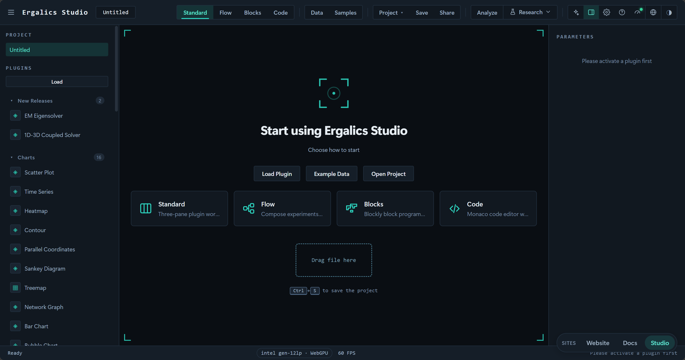

---

## Table of Contents

- [Overview](#overview)
- [Features](#features)
- [Tech Stack](#tech-stack)
- [Getting Started](#getting-started)
- [Architecture](#architecture)
- [Project Layout](#project-layout)
- [Four Workbench Modes](#four-workbench-modes)
- [Research Modules](#research-modules)
- [Plugin System](#plugin-system)
- [GPU Compute & Native Core](#gpu-compute--native-core)
- [Testing](#testing)
- [Documentation](#documentation)
- [Roadmap](#roadmap)
- [Contributing](#contributing)
- [License](#license)

---

## Overview

Ergalics Studio is a professional scientific-computing workstation that runs
entirely in the browser: a React + TypeScript frontend, a Rust core compiled
to WebAssembly, a WebGPU compute pipeline, and a plugin architecture for
third-party extensions. The workbench exposes four modes for four kinds of
users:

| Mode           | For                                    | What you do                                                                                                                    |
| -------------- | -------------------------------------- | ------------------------------------------------------------------------------------------------------------------------------ |
| **Standard**   | "I have data → I see something"        | Drag a dataset onto a plugin and the visualisation appears — the fastest path.                                                  |
| **Flow**       | Pipeline builders                      | Compose a visual dataflow pipeline from built-in blocks, run it topologically, inspect every node's output.                    |
| **Block**      | Learners / imperative feel             | A Scratch-like block editor where one green "Run" hat kicks off the program — fully scripted.                                   |
| **Code**       | Real scripting                         | A Monaco editor for **Python / R / JavaScript**; switching language translates the whole buffer via a shared IR instantly.       |

The project is under **active development** and already usable end to end.
What ships today:

| Area              | Shipped today |
| ----------------- | ------------- |
| Workbench         | 4 modes, 59 built-in plugins (49 scientific + 10 fun), sandboxed plugin system + marketplace catalog, `.cspkg` signing gate |
| Compute           | Live WebGPU compute, in-browser AI training plugin, AI assistant (offline rule engine / online OpenAI-compatible service) |
| Data & plots      | Scientific binary I/O (HDF5 / NetCDF / FITS / Zarr / Parquet), publication-grade SVG/PDF plot engine, statistics subsystem, reproducibility support |
| Code editing      | Python via Pyodide; R and JavaScript via the shared IR engine, with R upgraded to a full free-form webR runtime when vendored |
| Research          | 19 standalone research pages + unit-system and chunked-ingestion kernels |
| Web surfaces      | Official website (gallery / theme marketplace / plugin marketplace) deep-linked into the workbench |

---

## Features

**Rendering & workbench**

- Four-region layout: sidebar (projects / plugins), central viewport,
  parameter panel, status bar with GPU/perf indicators.
- Project lifecycle: create / open / save / autosave / share (`.clproj` in
  IndexedDB).
- File routing: drag & drop, detected by magic number + extension and
  routed to a matching plugin (picker if multiple match; replace
  confirmation on name collision).
- A shared 2D canvas container (point clouds, time series, histograms,
  heatmaps, contour, scatter, bar, radar, network, bubble, violin, sankey,
  box, parallel coordinates, error bands, treemaps, QQ plots, …) plus a
  host-managed Three.js 3D scene (created lazily for `renderToScene`
  plugins, hidden when a 2D plugin is active, fully cleared between plugins).

**Plugin system**

- **59 built-in plugins** (49 scientific + 10 fun) over the full API surface;
  two-tier loading (core auto-loads, fun loads on demand).
- Marketplace catalog `src/plugins/marketplace.ts` (curated tags, popularity,
  category filters).
- `.cspkg` package loading + manifest validation + **Worker-first isolation**
  (§sandbox): third-party entries run via a postMessage RPC bridge and
  transferred `OffscreenCanvas`; fallback is a restricted `new Function`
  scope (not a security sandbox). Both are gated by Ed25519 signature
  verification (FR-05, see `SECURITY.md`).
- Locale-aware parameter panels; one-click PNG / CSV export on every plugin,
  analysis overlays (trendlines, density/cumulative histograms, mean markers,
  jitter, bar ordering), and a **Send to Figure Studio** action.

**Infrastructure**

- i18n (zh-CN / en-US), dark / light theming, performance monitoring (FPS /
  GPU / memory / data scale).
- Research-grade reliability core: structured error taxonomy + `Result` /
  retry + error registry, composable validation framework with safe parsing,
  and a Pandera-style data-quality engine (contracts / profiling /
  quarantine) — see `src/core/errors|validation|data-quality`.

**Scientific & research cores (pure-TS core + Zustand store + standalone page)**

- Statistics kernel `src/core/stats/` (descriptive stats, special functions,
  hypothesis tests, effect sizes, multiple-comparison corrections, power).
- Scientific binary I/O `src/core/io/` (single dispatcher for HDF5 / NetCDF /
  FITS / Parquet / Zarr).
- Publication-grade plotting engine `src/core/plot/` (SVG + PDF).
- Reproducibility kernel `src/core/repro/` (seeded RNG, stable hashing, run
  manifest, DAG→Python) and `repro.lock`.
- Data-quality engine `src/core/data-quality/` and typed unit system
  `src/core/units/`.

---

## Tech Stack

| Layer    | Choice                                                        |
| -------- | ------------------------------------------------------------ |
| UI       | React 18, react-router-dom 7, Zustand 5                      |
| Language | TypeScript 5.7 (strict)                                      |
| Build    | Vite 6                                                       |
| 3D       | Three.js r185 (+ @types/three)                               |
| Native   | Rust → wasm32-unknown-unknown, wasm-bindgen 0.2              |
| GPU      | WebGPU / WGSL via web-sys                                    |
| SQL      | DuckDB-WASM (lazy) + Apache Arrow                            |
| Testing  | Vitest (unit) + Playwright-core (E2E, headless Edge)          |
| Docs     | VitePress (separate `docs/` workspace)                       |
| Packaging| fflate (cspkg ZIP), lz-string (project compression)          |

---

## Getting Started

Prereqs: **Node.js ≥ 20** + npm; building the native core needs a **Rust
toolchain** (`wasm32-unknown-unknown` target + `wasm-bindgen-cli`) — the
frontend degrades gracefully when the WASM module is missing.

```bash
npm install         # install dependencies
npm run dev         # dev run (welcome page hardware self-check: WebGPU/WASM/IndexedDB)

npm run build       # wasm → typecheck → vite build → docs
npm run build:web   # frontend only (no WASM)
npm run build:wasm  # rebuild the Rust core into src/native

cd docs && npm install && npm run dev   # docs site
```

Production builds output to `dist/`.

---

## Architecture

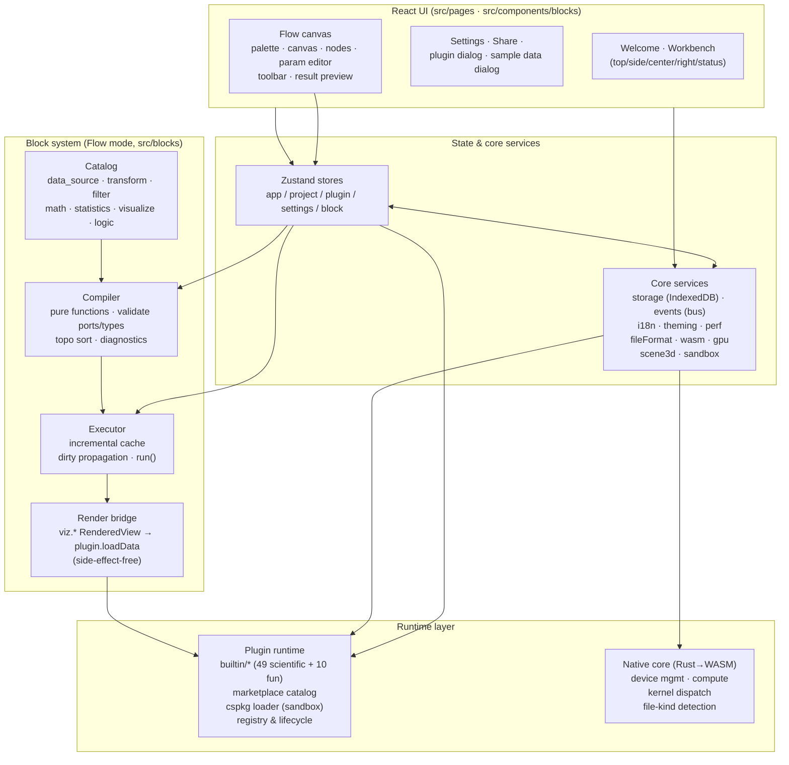

- **Host ↔ plugin contract**: each plugin implements a `Plugin` interface
  (init/destroy/activate/…/renderToScene) and receives a `PluginApi`;
  sandboxed plugins talk only through a typed RPC protocol
  (`src/core/sandbox.ts` + `plugin-worker.ts`).
- **WebGPU**: `src/core/gpu.ts` owns adapter/device with CPU fallback; the
  Rust core exposes `ComputeKernel` (compile / dispatch / compilation_info)
  and `GpuDeviceManager` via wasm-bindgen.

---

## Project Layout

```
.
├── src/                      # frontend
│   ├── core/                 #   services: storage, events, i18n, gpu, wasm, fileFormat,
│   │                         #   scene3d, sandbox, cspkg, errors, validation,
│   │                         #   data-quality, stats, io (HDF5/NetCDF/FITS/Zarr/Parquet),
│   │                         #   plot, repro, uncertainty, units, experiment, lineage,
│   │                         #   chunked, figure, notebook, package, model, signal,
│   │                         #   sweep, profiler, sql, report, inference, logger
│   ├── blocks/               #   block system (Flow mode): types · registry · compiler ·
│   │                         #     executor · ops · catalog · sample · l10n · render
│   ├── editor/               #   Block & Code modes: ir · block (Blockly) · code · codegen ·
│   │                         #     runtime (StudioApi + interpreter)
│   ├── components/           #   flow canvas / block & code canvas / workbench shell
│   ├── pages/                #   welcome, workbench, settings, share, plugin view, figures,
│   │                         #     notebook, labs (runs · analysis · uncertainty · model-lab ·
│   │                         #     profiler · reprolock · lineage · supplement), signal,
│   │                         #     sweeps, sql, report
│   ├── plugins/builtin/      #   49 scientific + 10 fun/utility plugins (2D + 3D)
│   ├── plugins/marketplace.ts#   marketplace catalog
│   ├── stores/               #   zustand stores
│   ├── types/                #   plugin & project & editor contracts
│   └── native/               #   generated WASM bindings (untracked)
├── native/ergalics-core/     # Rust core (device, compute, utils)
├── examples/{data,projects,code}/  # sample datasets, `.clproj` projects, Python programs
├── scripts/ · tests/ · docs/ · website/
```

---

## Four Workbench Modes

**Standard mode** — the default landing experience: left sidebar (projects /
plugins), central viewport, right parameter panel. A dropped file is routed
by extension + magic number to a matching plugin (picker on conflicts). Best
for "I already know the plugin; I just need to point it at a file".


**Flow mode** — compose a visual dataflow **pipeline** from built-in blocks
and run it. Left palette, central canvas (nodes + edges), right per-node
parameter editor, bottom live result preview that adapts to the selected
output (`RenderedView` via plugin renderers / `DataTable` read-only table /
`Scalar` inline). The compiler is pure functions (port/type validation +
cycle detection + Kahn topological sort); the executor has incremental
caching with dirty propagation, so editing one block re-runs only it and its
downstream. Graphs persist to the project's `blockGraph`. See
[`docs/guide/flow-mode.md`](docs/guide/flow-mode.md).


**Block mode** — a Scratch-like editor where a single "Run" hat block is the
only entry point. Block JSON round-trips with a **shared IR**
(`src/editor/ir/`); the IR interpreter calls the same `studio.*` API as Flow
blocks, so `studio.plot(...)` lands on the same scatter plugin; IR → JS /
Python codegen is live-visible. Blockly 13 provides the canvas and is
**lazily loaded** (~828 KB on-demand chunk); i18n plugs into Blockly's
`BKY_*` keys. Ships 30+ blocks and 5 sample programs. See
[`docs/guide/block-mode.md`](docs/guide/block-mode.md).

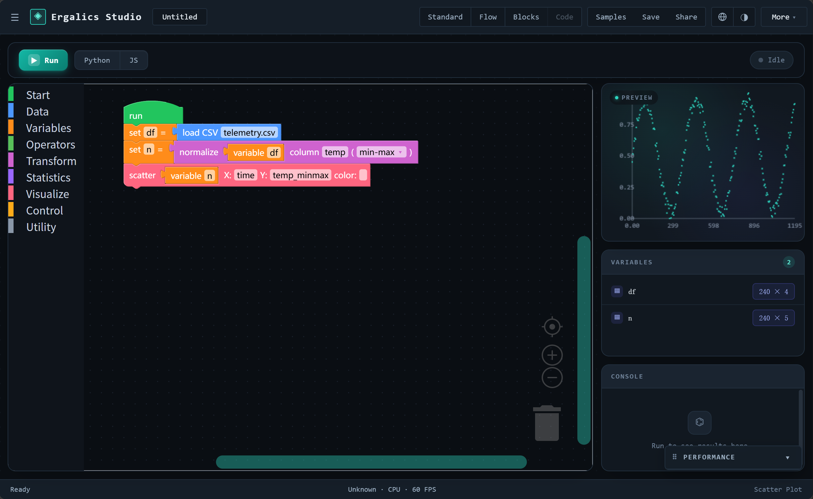

**Code mode** — a real-scripting Monaco editor with a segmented **Python /
R / JS** switcher and engine badges. **Python** runs full CPython via a
Pyodide Web Worker (a proper importable `studio` module, single-expression
REPL, stop restarts the worker). **R / JavaScript** parse to the shared IR
and run on the same interpreter as Block mode; R upgrades to a vendored
full webR runtime when present, falling back to the IR engine otherwise.
Switching language translates the whole buffer via the IR hub. All three
modes round-trip seamlessly through one IR (`flow/block/convert.ts` +
`code/parse.ts` + `mergeFlowIR` merge-write-back + a signature guard that
prevents node loss). Ships 9 sample programs. See
[`docs/guide/block-mode.md`](docs/guide/block-mode.md).

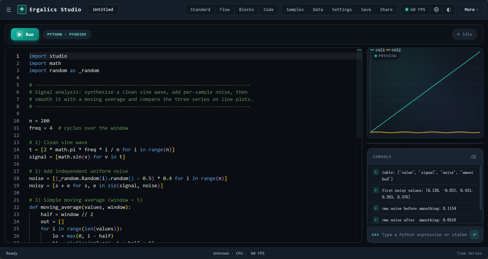

---

## Research Modules

The top-bar **Research** menu — plus the **Analysis** page and the welcome
grid — open 19 standalone research pages sharing one unified lab shell. Each
module follows the same layering: a pure-TS core (no React) under
`src/core/`, a Zustand store persisted to the project or IndexedDB, and a
page on top, all unit-tested:

| Page              | Route             | What it does                                                            |
| ----------------- | ----------------- | ----------------------------------------------------------------------- |
| Analysis          | `/#/analysis`     | Quick charts (line/scatter/hist/bar) + descriptive stats + t / Mann–Whitney |
| Runs              | `/#/runs`         | Auto-recorded run history (source, params, metrics, timings), A/B compare |
| Uncertainty       | `/#/uncertainty`  | Bootstrap CI, Monte Carlo propagation, MCMC — CPU or WGSL GPU engine, R-hat / ESS |
| Model Lab         | `/#/model-lab`    | OLS / logistic / ridge / polynomial regression + coefficient table & 2×2 residual diagnostics |
| Inference Forge   | `/#/inference`    | HMC / NUTS Bayesian inference + WAIC / LOO / PPC + trace & density plots |
| Model Inference   | `/#/model-inference` | Run ONNX models in-browser with WebGPU |
| Profiler          | `/#/profiler`     | Streaming column profiling, correlation matrix, quality score + issue list, fingerprint cache |
| Signal Lab        | `/#/signal`       | FFT / Welch PSD, window functions, Savitzky–Golay / moving-average filters, ACF/PACF, seasonal decomposition |
| Sweeps            | `/#/sweeps`       | Grid / list / Latin-hypercube parameter experiments + response surfaces |
| SQL Workbench     | `/#/sql`          | DuckDB-WASM queries on project files (join / aggregate / window), results wired into lineage |
| Cleaning          | `/#/cleaning`     | Step-by-step wizard: type casts, missing-value policy, outlier flags, dedupe, rename |
| Report            | `/#/report`       | Narrative + charts + tables + interactive filters → one self-contained HTML |
| Repro Lock        | `/#/reprolock`    | `repro.lock` export / import + five drift checks & one-click reproduce |
| Lineage           | `/#/lineage`      | File→run DAG rebuilt from runs + imports (SVG canvas) |
| Figure Studio     | `/#/figures`      | Multi-panel publication-grade figures on IEEE / Elsevier templates, SVG / PDF / PNG-600dpi |
| Notebook          | `/#/notebook`     | Markdown + Python cells persisted in the project, run on a dedicated Pyodide |
| Supplement        | `/#/supplement`   | Paper companion ZIP (`manifest.json` + runs + lineage + optional data/code) |
| Course            | `/#/course`       | Assign homework, collect and offline-grade student lab submissions |
| Gallery           | `/#/gallery`      | Browse and reopen community-shared reproducible works |

Companion kernels round out the toolset: the **unit system** (dimension-safe
`Quantity` + `units.convert` / `units.check`) and **chunked ingestion**
(windowed streaming reads of large delimited files). On top of Figure Studio
sits a **journal submission check** (IEEE / Elsevier, pre-flighted by
*image / annotation / text / metadata*), a **caption drafter** (bilingual), and a
**3D field plot** panel type. Runs from every mode feed one shared history
and lineage graph — "which run produced this figure, from which data?" is
always answerable and shipped with the supplement ZIP.

### Research lab highlights

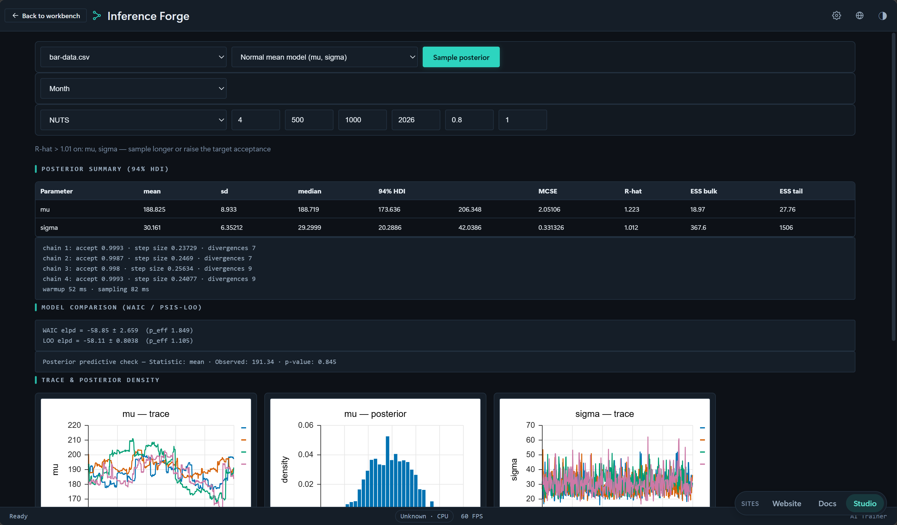

*Inference Forge runs NUTS sampling in the browser (WebAssembly): posterior
summary with 94% HDI / MCSE / R-hat / ESS, WAIC / PSIS-LOO comparison,
posterior predictive checks, and trace + density plots.*

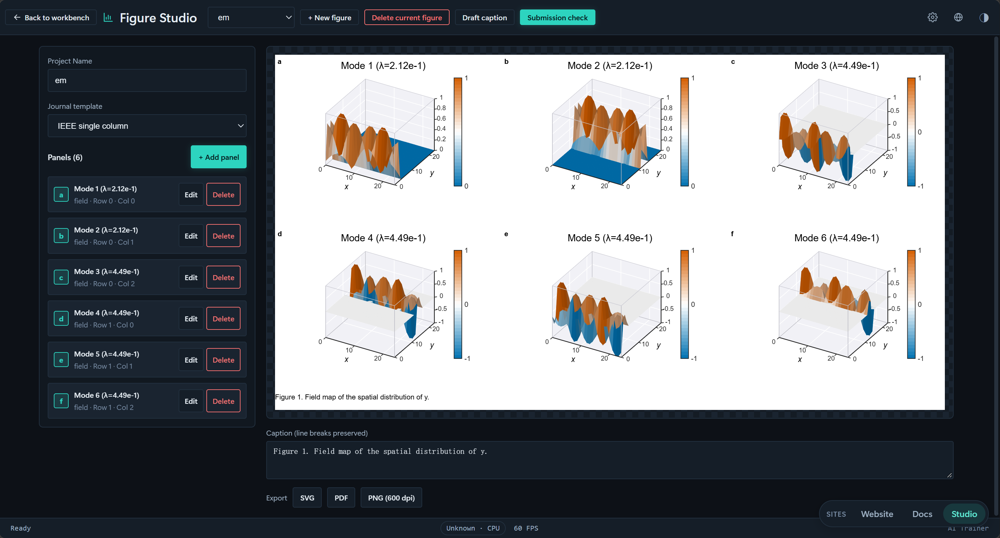

*Figure Studio composes publication-grade figures — here a multi-panel sheet
on the IEEE single-column template, with a caption drafter, a journal
submission check, and SVG / PDF / 600-dpi PNG export.*

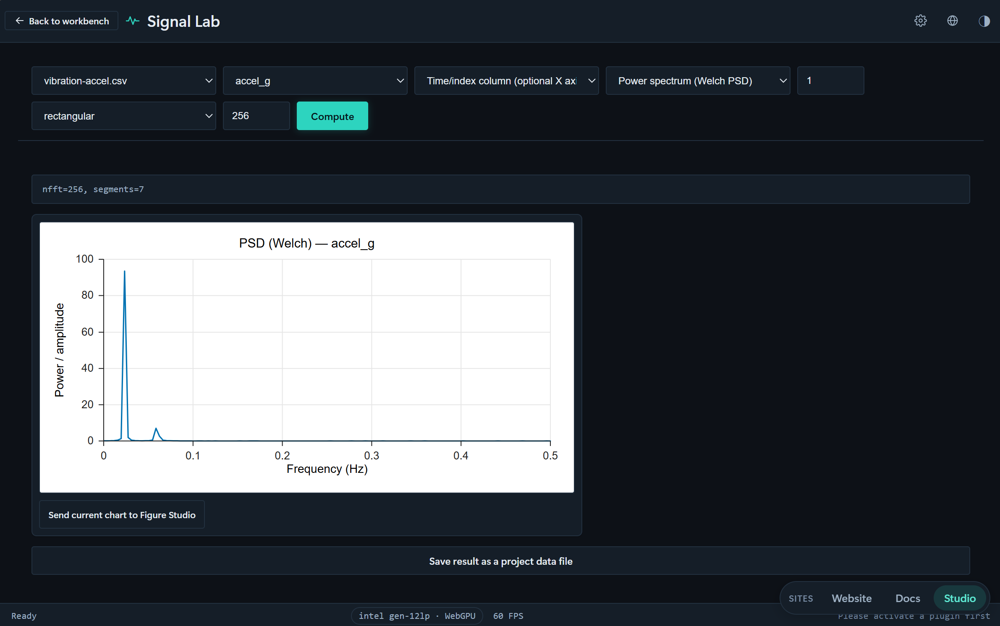

*Signal Lab does frequency-domain analysis — a Welch PSD of an acceleration
time series with a clear dominant peak — plus radix-2 FFT magnitude spectra,
windowing and filtering, with one-click Send to Figure Studio.*

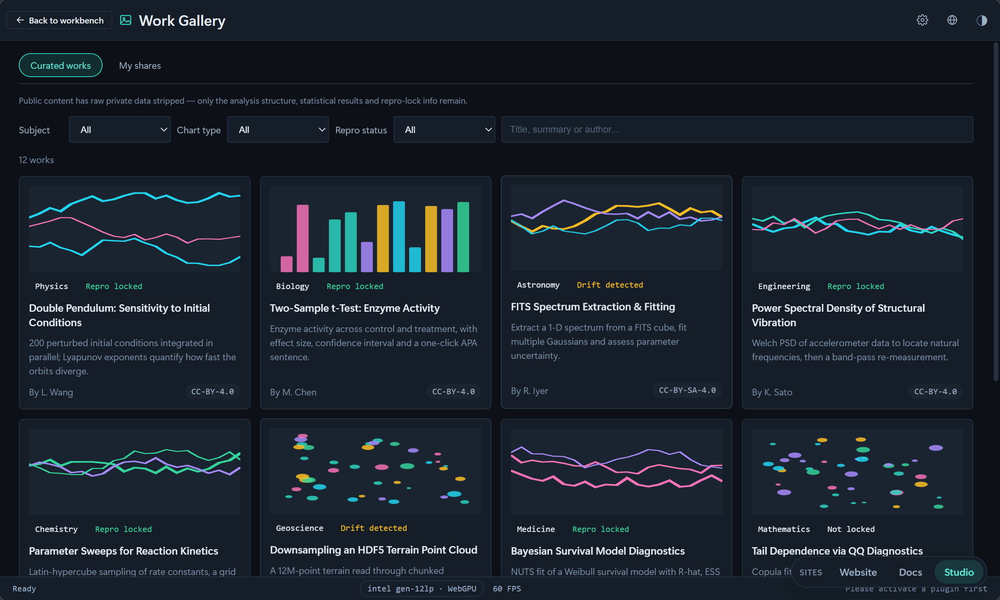

*The Gallery curates reproducible works by discipline, each card tagged by
repro-lock state (locked / drift / unlocked) for discovery, verification and
citation.*

---

## Plugin System

### Built-in plugins

**Core / scientific plugins** (auto-loaded at startup; 49 total):

- 2-D & 3-D visualisation: Point Cloud, Point Cloud 3D, 3D Surface, 3D Voxel
  Field, Time Series, Histogram, Heatmap, Image Viewer, Contour, Scatter,
  Bar / Polar / Radar, Network Graph, Bubble, Violin, Sankey, Box, Parallel
  Coordinates, Error Band, Treemap, QQ Plot, plus Particles (real WGSL
  compute).
- GPU simulation engines: N-Body Gravity (WGSL all-pairs), LBM Fluid (D2Q9
  lattice-Boltzmann, collide + stream, Kármán vortex street), Wave Equation
  (WGSL leapfrog; Gaussian pulse / two-source interference / double-slit),
  Double Pendulum (RK4 + chaotic ghost pendulum).
- Interactive physics labs: Electromagnetism, Optics Lab, Structure — all
  directly manipulable on canvas.
- Bio & chemical: Crystal 3D unit cell, Reaction MD 3D, Enzyme Kinetics
  (Michaelis–Menten LM fit), Epidemic Modeling (SIR/SEIR), Sequence
  Alignment (NW/SW), Population Genetics (HW test + Wright–Fisher drift),
  AI Trainer (in-browser TF.js training of 4 model types, incl. MNIST CNN).
- Geography suite (`geo/`; all with one-click Send to Figure Studio):
  GeoJSON Map, Solar Elevation & Day Length (FAO-56), Climatograph
  (Köppen), Population Pyramid, Spatial Interpolation (IDW / ordinary
  kriging + LOOCV + Moran's I), Distance & Area (standard-deviational
  ellipse), Projection Distortion (Tissot), DEM Terrain Analysis
  (priority-flood → D8 → flow accumulation watershed triple), GPX Tracks,
  and an Interactive 3D Globe.
- **Two competition-grade scientific solvers** (Pyodide Worker, see
  `docs/technical/09|10`):
  - **EM Eigensolver** — sparse Hermitian eigensolver: thick-restart
    Lanczos / block LOBPCG / Jacobi-Davidson + MINRES shift-invert, adaptive
    shifts, true-residual certification; 2-D spectrum report + 3-D mode
    fields, low-memory at 100k order.
  - **Fluid CFD Coupler** — 1-D pipe network ⇄ 3-D scalar field two-way
    coupling: multi-rate time stepping, forward/backward boundary coupling,
    millisecond valve control, conservation audit; verified against choked
    (Case A/C) and subcritical-literature (Case D) baselines.

Simulation plugins are strictly data-driven: empty on load, never faking a
default scene; **Reset** only replays loaded data. Every core plugin ships a
sample dataset under `examples/data/`, one click away in the examples dialog.

Four plugins with non-trivial compute paths:

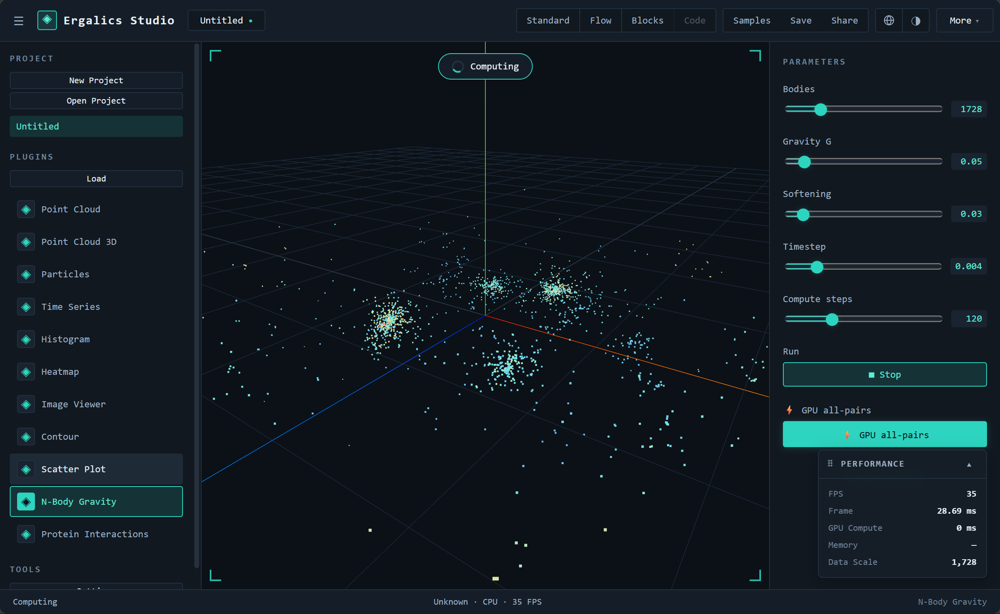

*N-Body Gravity runs brute-force gravity on the GPU via a WGSL all-pairs
kernel, O(N²) per step.*

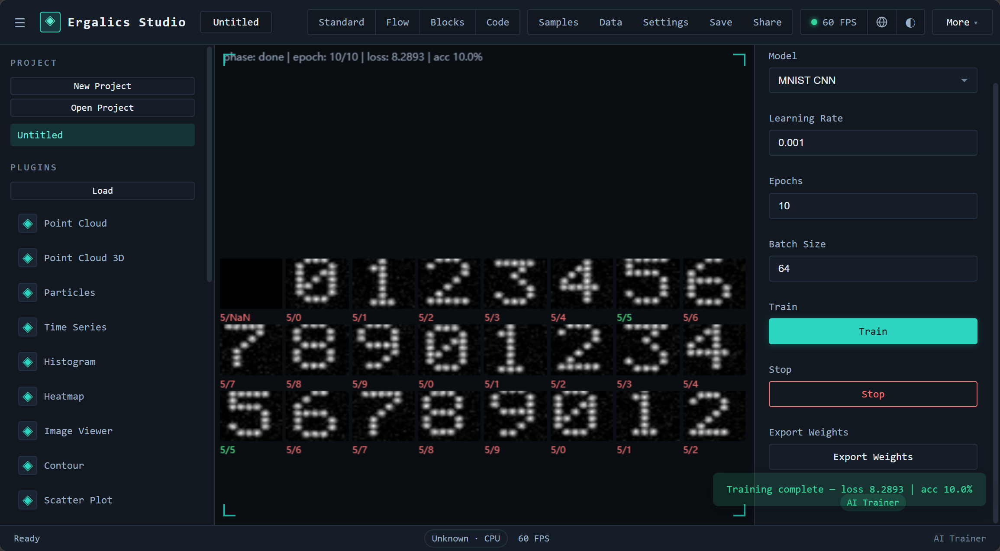

*AI Trainer trains linear / non-linear / logistic / convolutional models in
the browser with TensorFlow.js; the ~2 MB TF.js bundle lazy-loads on the
first click of Train.*


*GeoJSON Map renders offline vector maps and choropleths, with Albers /
Mercator / equirectangular projections.*

Three interactive physics labs serve as the flagship demos (objects are
directly manipulable on canvas):


*Electromagnetism: draggable charges move under Coulomb + Lorentz forces;
the cyclotron sample spirals charges on a radius set by speed, mass and B.*


*Optics Lab: geometric ray-tracing (thin lenses, Snell refraction + a
dispersive prism, draggable screens).*

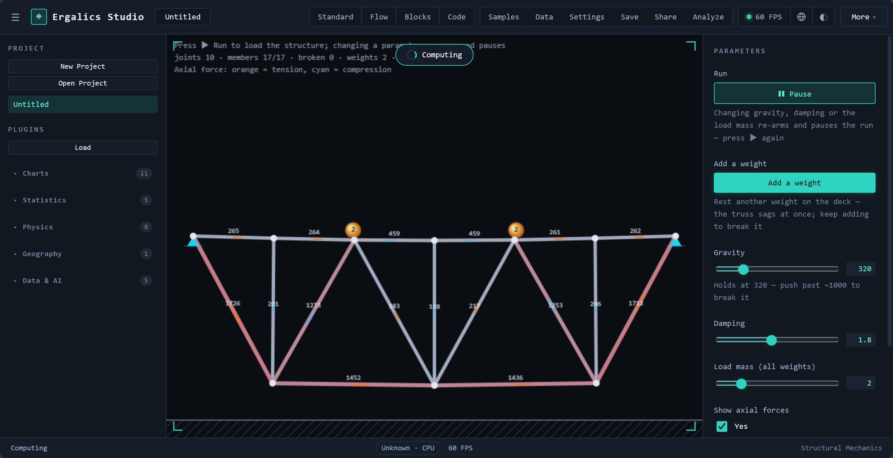

*Structure: pin-jointed trusses color-coded by axial force with a usage
readout; overload snaps members until collapse.*

**More plugin gallery** (geo / fluid simulation / life science / chemistry):

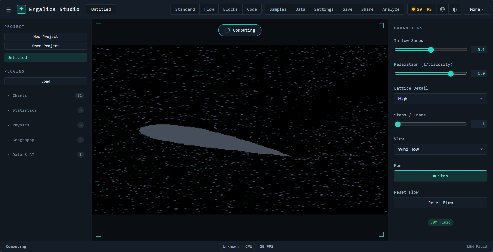

*LBM Fluid uses a D2Q9 lattice-Boltzmann collide+stream dual kernel for
channel flow around obstacles; the vorticity field shows the vortex street
shedding live.*

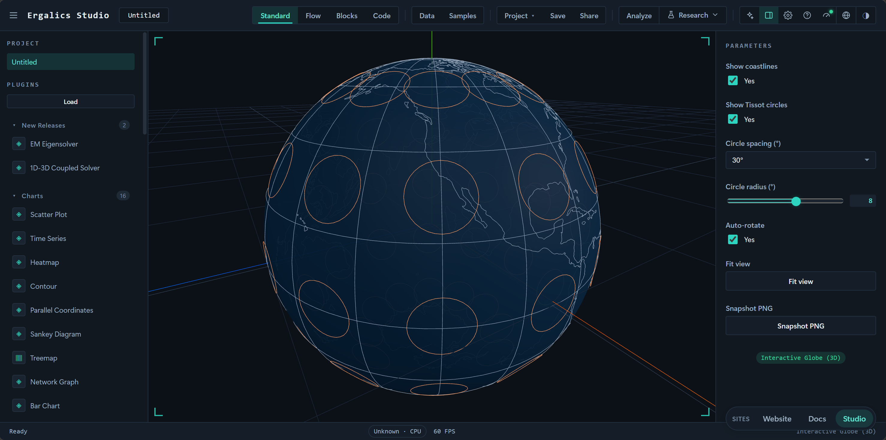

*Interactive Globe pastes Natural Earth 110m coastlines and a graticule onto a
sphere and overlays spherical Tissot distortion ellipses, with wheel zoom and
auto-rotation.*

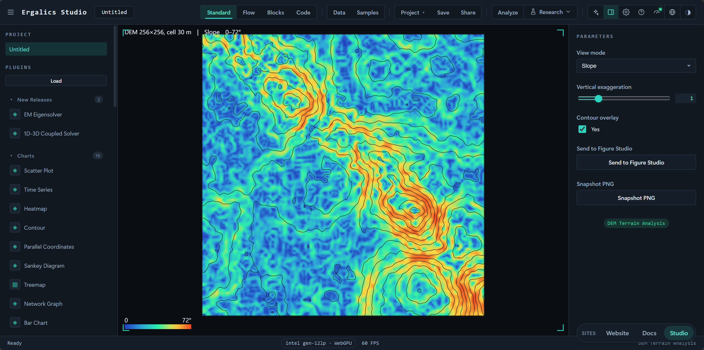

*DEM Terrain Analysis parses ESRI ASCII Grid elevation into hillshading,
Horn-method slope/aspect and contour lines, with a draggable 3D terrain model
view.*

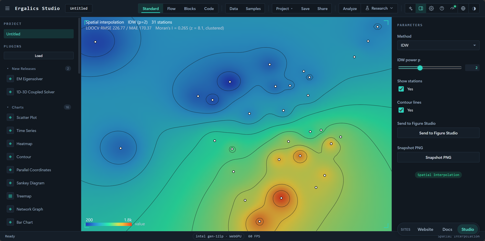

*Spatial Interpolation grids scattered station readings: inverse-distance
weighting (tunable power) and ordinary kriging (auto-fitted spherical /
exponential variograms) yield a heat surface, contours and station labels.*

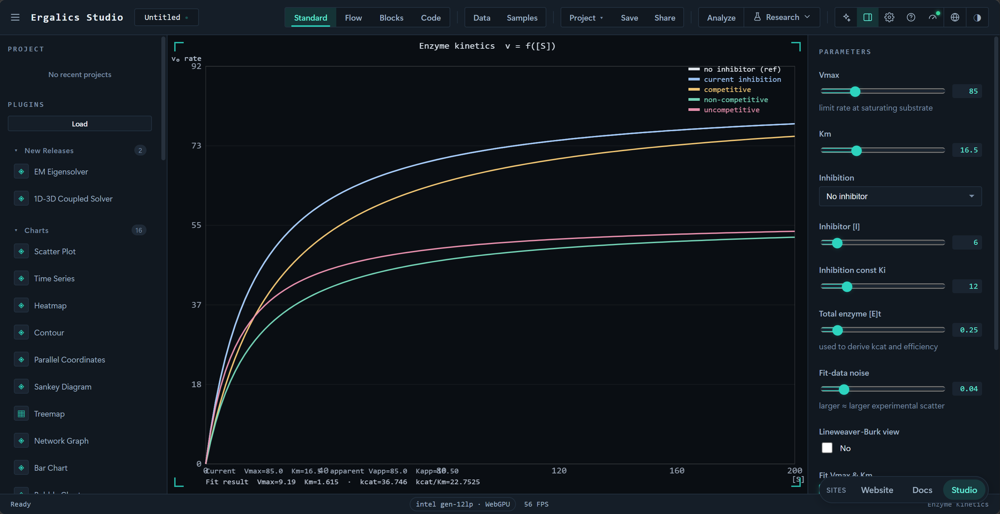

*The bio-enzyme plugin fits substrate–rate data to the Michaelis–Menten
equation via nonlinear LM regression, reporting K_m and V_max with confidence.*

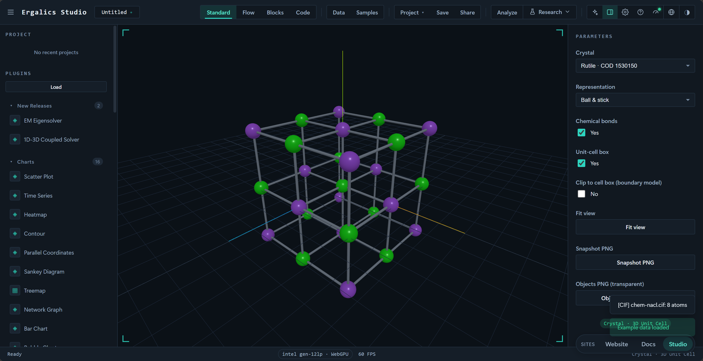

*The chemistry-crystal plugin renders a crystal unit cell in true 3D, rotatable
about any axis with electron-density isosurfaces overlaid.*

**Fun & utility plugins** (`autoload: false`; 10 total, loaded on demand from
the built-in panel or marketplace): Mandelbrot, Spirograph, Lissajous, Game
of Life, Harmonograph, Palette Explorer, Koch Snowflake, Barnsley Fern,
Fireworks, Truchet Tiles.

When WebGPU is missing, every built-in plugin runs the same math on the CPU —
full compute paths under [GPU Compute & Native Core](#gpu-compute--native-core).

### Third-party packages (`.cspkg`)

A package is a ZIP with `manifest.json` + entry + assets; the manifest is
validated (id format, entry path-traversal guard, sandbox enum) before the
entry runs:

```jsonc
{
  "id": "com.example.analyzer",
  "name": "Analyzer",
  "version": "1.2.0",
  "entry": "dist/index.js",
  "sandbox": "isolated",        // "isolated" (default, runs in a Worker, no DOM) | "trusted" (full DOM)
  "formats": [{ "extension": ".dat" }]
}
```

- `sandbox: "isolated"` (default) — a Worker with its own global scope;
  canvas via a transferred `OffscreenCanvas`.
- `sandbox: "trusted"` — runs in the host context with full DOM access; for
  packages you control.

**Limits (documented honestly)**: Workers share the same-origin IndexedDB,
and the `new Function` fallback is a best-effort approximation, **not** a
security boundary — a warning is shown when it is in use.

---

## GPU Compute & Native Core

The Rust crate `native/ergalics-core` compiles to WASM and is bound via
wasm-bindgen. Exposed surface: `GpuDeviceManager` (with CPU fallback),
`GpuBuffer`, `KernelDescriptor` + `BindingDescriptor`, `ComputeKernel`
(`compile` / `bind_group` / `run` / `compilation_info`), and `detect_file_kind`
magic-number detection.

`src/core/gpu.ts` owns the adapter/device lifecycle; `src/core/compute.ts`
exposes the **plugin-facing compute surface** (`PluginApi.gpu`): `createBuffer` /
`write` / `read`, `compileKernel`, and a one-shot `run` — routed through the
Rust core when the WASM module is loaded, otherwise through the native
WebGPU API, so accelerated compute works in dev and production while the Rust
core stays the reference engine.

Reusable WGSL kernels live in `src/core/wgsl.ts` (particle integration, 3-D
all-pairs N-body gravity, D2Q9 LBM collide / stream / curl, 2-D wave-equation
leapfrog), with host-side pack/unpack helpers for the CPU fallback. Particles
demonstrates the single-buffer path; N-Body uses ping-pong buffers so every
integration step stays on device.

> When WebGPU (or the WASM module) is unavailable, `api.gpu` is `undefined`
> and plugins fall back to the CPU — identical behaviour, no GPU required.

---

## Testing

Unit tests (Vitest, node environment):

```bash
npm test          # or npm run test:unit
npm run verify    # typecheck + unit tests
```

**2233 tests across 123 files** (2231 pass; 2 skipped without a GPU), covering:
data & I/O, the statistics kernel, plugins & sandbox, GPU compute, the block
system, three-mode IR sync (Block ↔ Flow ↔ Code round-trips), the research
modules (uncertainty / units / runs / lineage / figures / packaging /
notebook / model / profiler / signal / sweeps / SQL / report / repro-lock /
inference), the reliability core, and the platform.

E2E suite (Playwright-core, headless Edge):

```bash
npm run test:e2e
```

Covers `smoke-test`, `verify-ui`, `verify-fixes`, `verify-3d`,
`verify-plugins`, `verify-webgpu`, `verify-block-mode`, `verify-code-mode`,
`verify-ai-samples`, `verify-ai-training`, `verify-research`; two run
separately: `verify-lang-modes` (R/JS on the IR engine, mode round-trips)
and `npm run verify:site` (merged-deploy path integrity across the three
surfaces).

---

## Documentation

Three web surfaces deploy to one shared GitHub Pages site:

- **Official website** (`website/`) at the Pages root — gallery, theme
  marketplace and plugin marketplace, with zero-install deep links.
- **Workstation** (the React app) under `<repo>/app/` — the "open the live
  workstation" entry point, embedding its own docs copy.
- **Docs** — a standalone VitePress workspace under [`docs/`](docs/):

```bash
cd docs && npm install && npm run dev    # local docs site
npm run build                            # static site → docs/.vitepress/dist
```

`deploy.yml` merges the three via `scripts/merge-deploy.mjs`; `npm run
verify:site` probes the three key paths before release, so cross-site
navigation regressions fail CI instead of silently producing a dead link.

---

## Roadmap

Highlights (full status in [`docs/guide/roadmap.md`](docs/guide/roadmap.md)):

- [x] Workbench layout, project management, file routing; four modes
- [x] 59 built-in plugins, cspkg loading, Worker sandbox, Ed25519 signing gate (FR-05)
- [x] One-click PNG/CSV export + analysis overlays on every plugin; marketplace catalog
- [x] WebGPU device management + real compute kernels (Particles / N-Body / LBM / wave equation …)
- [x] Geography suite (IDW + kriging + LOOCV + Moran's I, watershed triple, FAO-56, …), all with Send to Figure Studio
- [x] Flow mode (compiler + incremental executor + 40+ blocks), Block mode (Blockly 13 + shared IR), Code mode (Python / R / JavaScript, multi-language translation)
- [x] Seamless three-mode round-trip via the shared IR hub (`mergeFlowIR` + signature guard)
- [x] Statistics subsystem, scientific binary I/O, publication-grade plot engine, reproducibility kernel
- [x] 19 standalone research pages (Runs / Uncertainty GPU engine / Model Lab / Profiler / Signal Lab / Sweep Studio / SQL Workbench / Report / Repro Lock / Inference Forge / Figure Studio / Notebook / Lineage / Course / Gallery, …)
- [x] Research-grade reliability layer (error taxonomy + validation + data-quality engine)
- [x] AI assistant (natural language → `studio.*` draft → run; offline / online modes)
- [x] Full free-form R runtime (webR + CRAN, falling back to the IR engine when absent)
- [x] Official website (gallery / theme marketplace / plugin marketplace); marketplace "Download" produces loadable `.cspkg`
- [x] GitHub Actions CI (unit + E2E + Pages deploy)
- [ ] Marketplace: third-party self-service submission & install pipeline

---

## Contributing

1. Fork and create a feature branch.
2. Keep changes small and test-covered — `npm run verify` must stay green;
   add E2E checks for new plugin/feature work.
3. Run `npm run test:e2e` before opening a pull request.
4. Re-run `npm run build:wasm` after touching `native/ergalics-core`.

Report bugs and feature requests via [GitHub Issues](https://github.com/SnowLeopard-io/ErgalicsStudio/issues).

---

## License

[MIT](LICENSE) © 2026 [SnowLeopard-io](https://github.com/SnowLeopard-io)