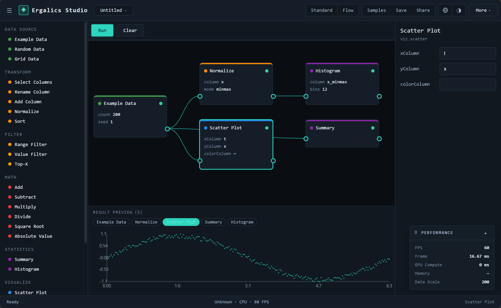
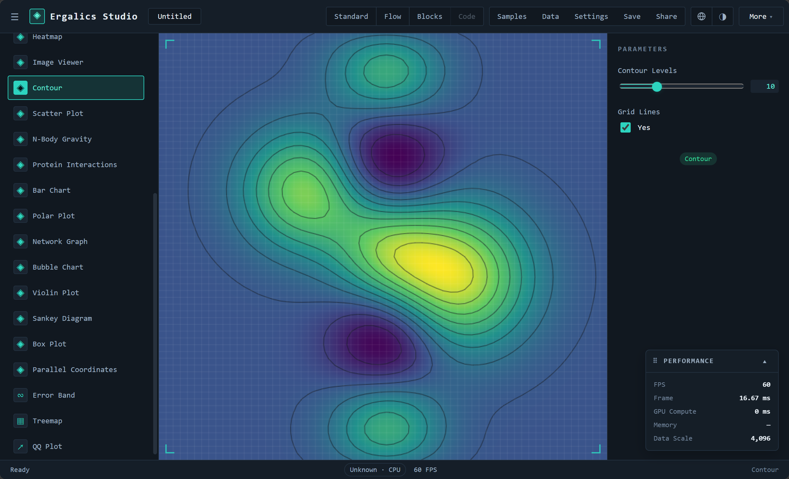

<div align="center">

<h1>◈ Ergalics Studio</h1>

<p><b>浏览器中的科学计算工作站</b>——交互式数据探索、GPU 计算调度与沙箱化插件系统，全部在浏览器中运行，核心由 Rust/WASM 构建。</p>

<p>
<a href="https://snowleopard-io.github.io/ErgalicsStudio/"></a>
</p>

<p>
<a href="https://github.com/SnowLeopard-io/ErgalicsStudio"></a>
<a href="LICENSE"></a>
<a href="https://www.typescriptlang.org/"></a>
<a href="https://react.dev/"></a>
<a href="#gpu-计算与原生核心"></a>
<a href="#gpu-计算与原生核心"></a>
</p>

</div>

<br>


---

## 目录

- [概览](#概览)
- [特性](#特性)
- [架构](#架构)
- [技术栈](#技术栈)
- [快速开始](#快速开始)
- [项目结构](#项目结构)
- [标准模式](#标准模式)
- [流程模式](#流程模式)
- [积木模式](#积木模式)
- [代码模式](#代码模式)
- [插件系统](#插件系统)
- [GPU 计算与原生核心](#gpu-计算与原生核心)
- [测试](#测试)
- [文档](#文档)
- [路线图](#路线图)
- [贡献](#贡献)
- [许可证](#许可证)

---

## 概览

Ergalics Studio 是一款完全运行于浏览器中的专业科学计算工作站。它结合了 React + TypeScript 前端、编译为 WebAssembly 的 Rust 核心、WebGPU 计算管线，以及为第三方扩展设计的插件架构。

工作台为四类用户提供了四种模式——各自详见下文对应章节：

- **标准（Standard）**——将数据集拖入插件即可看到可视化。这是从"我有数据"到"我看到结果"的最快路径。
- **流程（Flow）**——从内置区块组合出可视化数据流管线，按拓扑顺序运行，并检查每个节点的输出。
- **积木（Block）**——类 Scratch 的积木编辑器，单个"运行"帽子区块即可启动程序。对新手友好，但完全可脚本化（变量、循环、条件、变换、绘图）。
- **代码（Code）**——基于 Pyodide Worker 运行时的 Monaco Python 编辑器，提供与积木模式相同的 `studio.*` API、REPL 控制台和变量面板。

Ergalics Studio 处于**积极开发**中，且已可端到端使用：核心闭环（项目管理、数据加载、插件注册、2D/3D 渲染、i18n、主题、性能监控、流程模式、积木模式，以及搭载 Pyodide Python 运行时的代码模式）均已可用并由测试覆盖。GPU 加速覆盖 Particles、N-Body、直方图、热力图与点云内核；插件市场的包签名与 R 运行时（webR）是接下来的里程碑。每个模块都刻意保持小巧且可测试，使代码库能持续扩展而无需重写。

> 状态：**积极开发**——今日即可使用，具备四种工作台模式、33 个内置插件（核心 + 趣味）、沙箱化插件系统、市场目录、实时 GPU 计算、浏览器内 AI 训练插件，以及基于 Pyodide 的 Python 代码编辑器；包签名与 R 运行时为后续工作。

---

## 特性

**工作台**

- 四区布局：侧边栏（项目 / 插件）、中央视口、右侧参数面板，以及带 GPU/性能指示器的状态栏。项目数据文件与设置位于顶部栏（`示例 | 数据 | 设置 | 保存 | 分享`）。
- 项目生命周期：创建 / 打开 / 保存 / 自动保存 / 分享（`.clproj` 格式存储于 IndexedDB）。
- 文件路由：拖放任意文件；宿主通过魔数**与**扩展名（可选 WASM 辅助）检测格式，并将其路由到匹配的插件——当多个插件匹配时弹出选择对话框。

**渲染**

- 由所有 2D 插件共享的 2D canvas 容器（点云、粒子、时间序列、直方图、热力图、图像查看器、等值线图、散点图、柱状图、雷达图、网络图、气泡图、小提琴图、桑基图、箱线图、平行坐标图、误差带、矩形树图、QQ 图，以及分形/艺术玩具）。
- 宿主管理的 **Three.js 3D 场景**（`Scene3DHandle`）：网格/坐标轴/灯光、轨道控制、缩放处理、自动相机适配，以及 GPU 安全的销毁。3D 表面按需懒创建——仅对声明了 3D 能力（`renderToScene`）的插件创建——且**当 2D 插件激活时自动隐藏**，因此 3D 坐标系绝不会渗透到 2D 视图中。

**插件系统**

- **33 个内置插件**——23 个核心/科学可视化器外加 10 个趣味与工具玩具——覆盖完整 API 面（2D canvas、Three.js 场景、WGSL 计算、按钮/开关、沙箱、浏览器内模型训练）。
- **两级加载**：核心插件在启动时自动加载；趣味/工具插件声明 `autoload: false`，按需从内置面板或市场标签页加载，保持启动注册表精简。
- **市场目录**（`src/plugins/marketplace.ts`）——每个内置插件均附带精选标签、流行度与分类筛选（科学 / 趣味 / 工具）；社区"敬请期待"提交作为占位符列出。
- `.cspkg` 包加载（含 `manifest.json` + 入口 + 资源的 ZIP），并带有清单校验（id 格式、入口路径穿越防护、沙箱枚举）。
- **真正的沙箱隔离**（§6.2）：第三方入口代码运行于 Web Worker 内，通过 postMessage RPC 桥接——无法访问宿主页面的全局变量、DOM 或 stores。Canvas 渲染通过转移的 `OffscreenCanvas` 完成；当 Worker 不可用时存在文档化的尽力而为的回退方案。
- 支持本地化的参数面板（范围 / 选择 / 数字 / 复选框 / 文本 / 文件 / 按钮 / 开关）。

**基础设施**

- i18n（zh-CN / en-US），支持响应式语言切换。
- 通过 CSS 变量实现的暗/亮主题。
- 性能监控：FPS、帧时间、GPU 时间、内存、数据规模，并带有告警阈值（§7.3）。
- 错误边界、回退方案，以及横幅/通知系统。

**流程模式（可视化数据流管线）**

- 标准模式之外的第二个工作台模式——通过顶栏的 `Standard | Flow` 开关切换。标准模式是*加载数据 → 可见*；流程模式是*组合可视化管线 → 运行 → 查看每个节点的输出*。
- 按类别组织的 23 个内置区块：数据源、变换、过滤器、数学、统计与可视化。控制流区块（if/else、repeat、parallel）被刻意推迟——`BlockInstance` 上的 `region` 接缝已就位，以便后续作为扩展嵌入而非重构。
- **编译器是纯函数**：结构校验（端口 / 必需输入 / 类型兼容）、环检测，以及 Kahn 式拓扑排序。错误以结构化 `diagnostics` 返回，使画布可绘制红色边和内联诊断条而无需抛出异常。
- **带增量缓存的执行器**，粒度到单个节点，外加脏值传播失效遍历——修改单个区块的参数，仅该区块及其下游重新执行。
- **一键结果预览**：`RenderedView` 输出经由现有插件渲染器（散点图、直方图……）；`DataTable` 输出渲染为只读表格（使 `stats.summary` / `stats.histogram` 的分箱切实可见）；`Scalar` 输出内联渲染。当管线有多个输出时，通过芯片切换器选择要检视的节点。
- **响应式参数编辑器**绑定到所选节点，与画布双向联动——节点卡片显示实时的 `key: value` 摘要，使你始终能看到画布实际在运行什么。
- **区块元数据已本地化**（`nameI18n` / `descriptionI18n`），调色板、节点卡片与参数面板均通过 `src/blocks/l10n.ts` 解析，因此新增语言仅为数据修改。
- **示例管线以 `.clproj` 文件形式存在**于 `examples/projects/`（`block-01-signal-analysis.clproj`……）。它们是普通项目——可通过标准项目选择器加载——并在构建时通过 `import.meta.glob` 发现。新增示例只需放入一个文件并在 `SAMPLE_META` 中加一条记录。
- 整个图持久化到项目的 `blockGraph` 并在打开时重新水合，共享支撑每个 `.clproj` 的自动保存/分享/导出管线。

**积木模式（类 Scratch 脚本编辑器）**

- 第三个工作台模式——顶栏的 `Standard | Flow | Blocks | Code`。积木模式是学习者及任何想要命令式体验者的入口：在单个绿色**「运行时 / Run」帽子**下编写自上而下的区块脚本，且该帽子是唯一的执行入口（孤立区块永不运行）。
- 按类别组织的 30+ 内置区块——Start、Data、Variables、Operators、Transform、Statistics、Visualize、Control、Utility——覆盖数据源（`load CSV`、`load XYZ`、`random`、`range`）、变换（`normalize`、`sort`、`select`、`filter`）、统计（`summary`、`histogram`）、绘图（`scatter`、`line`、`histogram`、`point cloud`）、控制流（`if`、`repeat`、`while`、`for_each`），以及 1 对 1 的工具原语（`set`、`print`）。
- **共享 IR**（`src/editor/ir/`）是唯一事实来源。区块 JSON ↔ IR 在纯函数、可在 Node 中测试的模块内往返——同一份 IR 也由代码模式与积木模式共享以实现双向同步。
- **IR 解释器**（`src/editor/runtime/interpreter.ts`）直接遍历 IR，并调用与流程模式区块**相同的 `studio.*` API**（`studio.load / normalize / plot / print / …`），因此 `studio.plot('scatter', df, { x, y })` 会落到与流程模式 `viz.scatter` 区块完全相同的散点图插件。
- **IR → JS / Python 代码生成**（`src/editor/codegen/`）从 IR 产出可运行代码；工具栏的 "Python" / "JS" 切换显示当前工作区的实时生成结果。
- **Blockly 13** 驱动画布（`src/editor/block/`）；该包**懒加载**，使标准/流程模式首屏不受影响（~828 KB 按需 chunk）。
- **区块名称、提示、下拉选项与工具箱类别均已本地化**，通过 Blockly 的 `BKY_*` 键系统；切换语言会以重新标注的区块重建工作区，并由专门的单元测试（`tests/editor/block-i18n.test.ts`）验证。
- **示例程序**位于 `src/editor/block/samples.ts`（5 个内置管线：星系散点、遥测折线、随机直方图、归一化散点、repeat-print），并通过顶栏的 **Examples** 对话框加载——任何用户均可发现，一键即达。

**代码模式（Monaco + Pyodide Python 运行时）**

- 第四个工作台模式——顶栏的 `Standard | Flow | Blocks | Code`。代码模式是真正脚本的逃生通道：在 Monaco 编辑器中编写自由格式的 **Python**，并通过 **Pyodide Web Worker 在 CPython 上运行**。
- **与积木模式相同的 `studio.*` API**（`load / random / range / normalize / sort / select / addColumn / filter / summary / histogram / plot / print / notify / getParam / setParam`），作为真正可导入的 Python 模块注入；`studio.plot(...)` 通过共享的插件桥接渲染。
- **REPL** 输入位于控制台面板，无需完整重跑即可求值单个表达式；**停止**会终止并重启 Worker，使失控循环不会卡死页面。
- **9 个示例程序**以真实文件形式位于 `examples/code/*.py`（通过 `import.meta.glob` 加载，在 `src/editor/code/samples.ts` 中展示元数据），并通过 **Examples** 对话框加载——从单行散点图到完整 EDA 管线、蒙特卡洛 π 估计与信号平滑。

---

## 架构


- **宿主 ↔ 插件契约**：每个插件实现一个 `Plugin` 接口（init/destroy/activate/deactivate/render/updateParams/getParams/compute/loadData/renderToScene），并接收一个 `PluginApi` 用于本地化、状态、性能上报、通知、文件访问及项目级参数。
- **隔离边界**：沙箱化插件仅通过类型化 RPC 协议通信（`src/core/sandbox.ts` + `src/core/plugin-worker.ts`）。
- **WebGPU**：`src/core/gpu.ts` 管理适配器/设备并带 CPU 回退；Rust 核心（`native/ergalics-core`）通过 wasm-bindgen 向 JS 暴露 `BindingDescriptor`、`ComputeKernel`（compile/dispatch/compilation_info）与 `GpuDeviceManager`。

---

## 技术栈

| 层级    | 选型                                                       |
| ------- | --------------------------------------------------------- |
| UI      | React 18, react-router-dom 7, Zustand 5                   |
| 语言    | TypeScript 5.7 (strict)                                   |
| 构建    | Vite 6                                                     |
| 3D      | Three.js r185 (+ @types/three)                            |
| 原生    | Rust → wasm32-unknown-unknown, wasm-bindgen 0.2            |
| GPU     | WebGPU / WGSL via web-sys                                  |
| 测试    | Vitest (单元) + Playwright-core (E2E, headless Edge)       |
| 文档    | VitePress (独立的 `docs/` workspace)                       |
| 打包    | fflate (cspkg ZIP), lz-string (项目压缩)                   |

---

## 快速开始

### 前置要求

- **Node.js ≥ 20** 与 npm
- **Rust 工具链**，带 `wasm32-unknown-unknown` target 与 `wasm-bindgen-cli`（仅在构建原生核心时需要；当 WASM 模块缺失时前端可优雅降级）

### 安装

```bash
npm install
```

### 开发运行

```bash
npm run dev
```

应用会在 Vite dev server 的 URL 打开。欢迎页在进入工作台前会执行硬件自检（WebGPU、WASM、IndexedDB）。

### 构建

```bash
npm run build          # wasm → 类型检查 → vite build
npm run build:web      # 仅前端（无 WASM）
npm run build:wasm     # 将 Rust 核心重新构建到 src/native
```

生产构建产物输出到 `dist/`。注意 `build:wasm` 会在 `vite build` 之前运行，以确保 WASM 绑定始终是最新的。

### 文档站点

```bash
cd docs && npm install && npm run dev
```

详见[文档](#文档)。

---

## 项目结构

```
.
├── src/                      # 前端
│   ├── core/                 #   服务: storage, events, i18n, gpu, wasm,
│   │                         #   fileFormat, scene3d, sandbox, cspkg, …
│   ├── blocks/               #   区块系统 (流程模式):
│   │                         #     types · registry · compiler · executor ·
│   │                         #     ops · catalog · sample · l10n · render
│   ├── editor/               #   积木与代码模式:
│   │                         #     ir · block (Blockly) · code · codegen ·
│   │                         #     runtime (StudioApi + interpreter)
│   ├── components/blocks/    #   流程模式画布、调色板、节点、参数编辑器,
│   │                         #     工具栏、结果预览、工作台外壳
│   ├── components/editor/    #   积木/代码画布、变量 / 控制台面板
│   ├── pages/                #   欢迎、工作台、设置、分享、对话框
│   ├── plugins/builtin/      #   23 核心 + 10 趣味/工具插件 (2D + 3D)
│   ├── plugins/marketplace.ts #   市场目录 (标签/流行度/筛选)
│   ├── stores/               #   zustand stores (app/project/plugin/settings/block/editor)
│   ├── types/                #   插件 & 项目 & 编辑器契约
│   └── native/               #   生成的 WASM 绑定 (git 未跟踪)
├── native/ergalics-core/     # Rust 核心 (device, compute, utils)
├── examples/
│   ├── data/                 # 示例插件使用的示例数据集
│   ├── projects/             # 示例 `.clproj` 项目 (含流程管线)
│   └── code/                 # 代码模式的示例 Python 程序 (*.py)
├── scripts/                  # build-wasm · make-example-data · E2E 套件
├── tests/                    # Vitest 单元测试
├── docs/                     # VitePress 文档 workspace
```

---

## 标准模式


默认的落地体验。三个面板：列出你的项目与插件的**左侧栏**、承载当前激活插件的**中央视口**（首次启动时为放置区），以及将激活插件声明的参数转为响应式表单字段的**右侧面板**。拖到中央（或插件列表）的文件会按扩展名和魔数路由到匹配的插件；当多个插件匹配时，由选择对话框决定。

当你已经知道哪个插件能回答你的问题、只需把它指向一个文件时，这就是你要的模式。

---

## 流程模式



第二个工作台模式。与*使用*某个插件不同，你从内置区块**组合出一条可视化数据流管线**并运行它。管线编辑器位于屏幕左侧（调色板），中间是画布（节点 + 边），右侧是针对所选节点的参数编辑器，底部是会根据所选节点输出类型自适应的实时**结果预览**：

- **`RenderedView`**（任意 `viz.*` 节点）——经由现有插件渲染器（散点图、直方图……）路由。
- **`DataTable`**（`stats.summary` / `stats.histogram` 的行）——只读表格，使非可视化输出也变得可见。
- **`Scalar`**——内联值。

图持久化到项目的 `blockGraph` 并在打开时重新水合，共享支撑每个 `.clproj` 的自动保存/分享/导出管线。架构（编译器 + 增量执行器 + 渲染桥接）详见 [`docs/guide/flow-mode.md`](docs/guide/flow-mode.md)，示例管线位于 `examples/projects/`。

---

## 积木模式


一个用于完整可脚本化程序的、类 Scratch 的积木编辑器。单个绿色**「运行时 / Run」帽子区块**是唯一入口——任何未连接在其下方的内容在运行时都会被忽略，使"破损代码"无法被意外执行。帽子之下，区块拼接成自上而下的脚本：`set df = load CSV telemetry.csv` → `set n = normalize df column temp min-max` → `scatter df X:time Y:temp_minmax color:…`。

运行按钮在右侧卡片中提供**实时结果预览**、**变量**面板与**控制台**面板，因此每次运行都会展示你的数据变成了什么、打印了什么。

底层原理：

- **共享 IR**（`src/editor/ir/`）是积木模式与代码模式双方的唯一事实来源。区块 JSON ↔ IR 在可在 Node 中测试的纯函数模块内往返。
- **IR 解释器**（`src/editor/runtime/interpreter.ts`）直接遍历 IR，并调用与流程模式区块相同的 `studio.*` API——因此 `studio.plot('scatter', df, { x, y })` 会落到与流程模式 `viz.scatter` 区块完全相同的散点图插件。
- **IR → JS / Python 代码生成**（`src/editor/codegen/`）复用同一份 IR 来产出代码，驱动工具栏中的"查看代码"浮层。
- **Blockly 13**（`src/editor/block/`）提供画布；该包**懒加载**，使标准/流程模式首屏不受影响（~828 KB 按需 chunk）。
- **i18n** 通过 `BKY_*` 键接入 Blockly 的本地化系统——切换语言会以重新标注的区块重建工作区。

完整架构、30+ 内置区块、5 个示例程序以及限制/后续步骤，详见 [`docs/guide/block-mode.md`](docs/guide/block-mode.md)。

---

## 代码模式


用于第四个工作台模式的真正 Python 编辑器。代码模式通过 Pyodide Web Worker 在浏览器中运行 **CPython**，因此你可以针对积木模式所生成的同一套 `studio.*` API 编写自由格式的 Python——无需脚手架，无需上下文切换。

- **Monaco 编辑器**（`src/components/editor/CodeEditor.tsx`），带 Python 语法高亮、暗/亮主题、自动换行以及 `studio.*` 自动补全。
- **Pyodide worker 运行时**（`src/core/pyodide/`）——Web Worker 中真正的 CPython。`studio` 模块作为正经的可导入模块（`sys.modules['studio']`）注入，项目数据文件以 `_FILES` 形式送入 worker，因此 `studio.load('telemetry.csv')` 可同步解析。
- **与积木模式相同的 Studio API**——`studio.load / random / range / normalize / sort / select / addColumn / filter / summary / histogram / plot / print / notify / getParam / setParam`。`studio.plot(...)` 通过与流程模式 `viz.*` 区块完全相同的插件桥接渲染，因此绘图会落到同一个散点 / 折线 / 直方图插件。
- **REPL**——无需重跑整个程序，即可从控制台输入求值单个 Python 表达式或语句。
- **中断**——停止一次运行会终止并重启 worker，因此失控循环不会卡死页面。
- **9 个示例程序**以真实文件形式位于 `examples/code/*.py`（与流程模式的 `examples/projects/` 对应），并通过 **示例 / Examples** 对话框加载——从单行散点图到完整 EDA 管线、蒙特卡洛 π 估计与信号平滑。

与积木模式共享的 IR（`src/editor/ir/`）、IR 解释器以及 IR → JS / Python 代码生成在此处全部复用，使积木与代码模式在相同的数据语义上保持一致。

**三模式互转**——共享的 IR 是三种编辑模式的唯一中枢：`src/editor/flow/convert.ts` 负责 IR ↔ 流程 DAG 的往返（`irToFlow` / `flowToIR`），`src/editor/block/convert.ts` 负责 Blockly JSON ↔ IR 的往返（`blockJSONToIR` / `irToBlockJSON`）。在流程模式中编辑一条管线，切换到积木即可看到同一逻辑以 Scratch 积木呈现，再跳转到代码模式即可看到生成的 Python——全部由同一份 IR 驱动。一个专门的 `sync-threeway` 单元测试为双向往返兜底。

架构详见 [`docs/guide/block-mode.md`](docs/guide/block-mode.md)；R via webR 是剩余的运行时。

---

## 插件系统

### 内置插件

**核心 / 科学插件**（启动时自动加载，共 23 个）：

| 插件                | 数据                        | 能力                      |
| ------------------- | --------------------------- | ------------------------- |
| Point Cloud         | `.xyz`                      | 2D canvas                 |
| Point Cloud 3D      | `.xyz`, `.dat`              | Three.js 场景, 高度渐变   |
| Particles           | `.dat`                      | 2D 模拟 + 真实 WGSL 计算 + 进度 |
| Time Series         | `.csv`                      | 2D 折线图                 |
| Histogram           | `.dat`                      | 分箱 + 对数刻度           |
| Heatmap             | `.json` (网格)              | viridis 渐变              |
| Image Viewer        | `.png`                      | base64 资源               |
| Contour             | `.json` (网格)              | 色彩渐变 + 等值线         |
| Scatter             | `.dat`, `.csv`, `.xyz`      | 2D 散点, 颜色通道         |
| N-Body Gravity      | `.json` (bodies)            | 3D Three.js 点 + WGSL 全对引力 |
| Protein Interactions| `.json` (网络)              | 力导向布局 + 连通分量指标 |
| Bar Chart           | `.csv` (类别, 数值)         | 分组柱状, 方向与调色板    |
| Polar / Radar Plot  | `.csv` (维度 × 系列)        | 多系列雷达图              |
| Network Graph       | `.csv` (source, target, weight) | 力导向布局, 按度数缩放 |
| Bubble Chart        | `.csv` (x, y, size, color)  | 气泡大小 + 颜色通道       |
| Violin Plot         | `.csv` (分组, 数值)         | 核密度 + 箱线叠加         |
| Sankey Diagram      | `.csv` (source, target, value) | 比例流带               |
| Box Plot            | `.csv` (分组, 数值)         | 四分位、须、离群点        |
| Parallel Coordinates| `.csv` (多变量)             | 分类别着色                |
| Error Band          | `.csv` (x, y, err)          | 阴影置信带                |
| Treemap             | `.csv` (label, size / label, parent, size) | 层级矩形布局 |
| QQ Plot             | `.csv`, `.dat` (单列)       | 正态分位比较 + 参考线     |
| AI Trainer          | `.csv`, `.json` (MNIST)     | 4 个模型 (线性 / 非线性 NN / 逻辑回归 / CNN)，带实时损失曲线、散点+拟合 / 决策边界 / 数字网格 |

每个核心插件都附带一份示例数据集（见 `examples/data/`），因此在 **示例 / Examples** 对话框中一键加载即可立即产出真实可视化。下面展示四个依赖非平凡计算路径的插件——三个 WGSL 计算演示和 TF.js 驱动的浏览器内训练器：

**N-Body Gravity**——直接求和引力，每步 O(N²)，运行于 GPU。


**Protein Interactions**——PPI 网络的力导向布局，附带连通分量指标。


**Contour**——以 viridis 渐变和等值线渲染的 64×64 双峰标量场。



**AI Trainer**——使用 TensorFlow.js 在浏览器中训练线性 / 非线性 / 逻辑回归 / 卷积模型。画布顶部显示实时损失曲线，下方面板按模型在散点+拟合、2D 决策边界与数字网格之间切换。四个内置样本（`examples/data/ai/*.csv`）覆盖线性回归、三次+正弦曲线、双高斯分类与 200 张图片的 MNIST 子集。TF.js 包本身在首次点击 **Train** 时懒加载，因此训练器位于自动加载注册表中而无需在启动时承担 2 MB 成本。


**趣味与工具插件**（`autoload: false`，共 10 个——按需从内置面板或市场标签页加载）：

| 插件              | 类型    | 描述                                    |
| ----------------- | ------- | --------------------------------------- |
| Mandelbrot        | 分形    | Mandelbrot / Julia 集浏览器，带调色板与缩放 |
| Spirograph        | 艺术    | 次摆线曲线艺术                          |
| Lissajous         | 艺术    | 动画 Lissajous 曲线                     |
| Game of Life      | 玩具    | 经典元胞自动机（播放 / 暂停 / 重播种）  |
| Harmonograph      | 艺术    | 由衰减正弦波叠加生成的曲线艺术           |
| Palette Explorer  | 工具    | 双停靠点渐变预览 + 色板                  |
| Koch Snowflake    | 分形    | 递归线段分形                            |
| Barnsley Fern     | 分形    | 迭代函数系统蕨叶                        |
| Fireworks         | 玩具    | 带引力与拖尾的粒子烟花                   |
| Truchet Tiles     | 图案    | 随机四分之一圆弧瓦片                     |

当 WebGPU 缺失时，每个内置插件都在 CPU 上运行相同的数学——完整列表及其计算路径见 [GPU 计算与原生核心](#gpu-计算与原生核心) 与 [`docs/guide/plugins.md`](docs/guide/plugins.md)。

### 第三方包（`.cspkg`）

一个包是包含 `manifest.json` 外加入口模块和任意资源的 ZIP。加载时会校验清单（必填字段、插件 id 格式、入口路径穿越、沙箱枚举），随后默认在 **Web Worker 沙箱**内执行入口：

```jsonc
{
  "id": "com.example.analyzer",
  "name": "Analyzer",
  "version": "1.2.0",
  "author": "Example Corp",
  "description": "…",
  "entry": "dist/index.js",
  "sandbox": "isolated",        // "isolated"（默认）| "trusted"
  "formats": [{ "extension": ".dat" }]
}
```

- `sandbox: "isolated"`（默认）——在 Worker 中运行：独立全局作用域，无 DOM/window/store 访问；canvas 渲染经由 `OffscreenCanvas`。
- `sandbox: "trusted"`——在宿主上下文中执行，拥有完整 DOM 访问权。仅对你自己控制的包使用。

**限制（如实记录）**：worker 共享同源的 IndexedDB，且遗留回退方案（`new Function` 配遮蔽的全局变量）只是尽力而为的近似，**并非**安全边界。当回退方案被启用时 UI 会发出告警。

---

## GPU 计算与原生核心

Rust crate `native/ergalics-core` 编译为 `wasm32-unknown-unknown` 并以 wasm-bindgen 绑定。当前暴露面：

- `GpuDeviceManager`——适配器/设备获取，带 CPU 回退选项。
- `GpuBuffer`——计算基础中缺失的 buffer 半边：以显式 usage 掩码创建（`create_storage`、`create_readable_storage`、`create_uniform`），用 `write` 上传字节，用 `read` 读回结果（拷贝进一个专用的 `MAP_READ | COPY_DST` 回读缓冲——见下文 buffer-usage 注记）。
- `KernelDescriptor` + `BindingDescriptor`——描述一个计算内核及其 buffer 绑定（uniform / storage / read-only-storage、动态偏移、最小绑定尺寸）。
- `ComputeKernel::compile`——从绑定描述符构建**真实**的 `GPUBindGroupLayout`，编译 WGSL 模块并创建管线。
- `ComputeKernel::bind_group`——从内核保留的布局物化出一个绑定组（buffer *i* → binding *i*）。
- `ComputeKernel::run(queue, buffers, x, y, z)`——一次调用完成绑定组 + dispatch + 提交；`dispatch(queue, bindGroup, x, y, z)` 留给宿主管理的命令编码器。
- `ComputeKernel::compilation_info()`——异步暴露 WGSL 编译诊断（错误/警告 + 行/列）。
- `detect_file_kind`——加载器使用的魔数文件检测。

### 宿主侧计算服务

`src/core/gpu.ts` 拥有适配器/设备生命周期（CPU 回退、OOM 跟踪）。在其之上，`src/core/compute.ts` 暴露**面向插件的计算面**（`PluginApi.gpu`）：`createBuffer` / `write` / `read`、`compileKernel` + `compilationInfo`，以及一次性 `run`。当 WASM 模块已加载时它经由 Rust 核心路由，否则经由原生 WebGPU API 路由——因此加速计算在开发与生产中均可用，而 Rust 核心始终是参考引擎。

可复用的 WGSL 内核位于 `src/core/wgsl.ts`（粒子积分与 3D 全对 N-body 引力），并配有与内核数学一致、供 CPU 回退使用的宿主侧打包/解包辅助函数。Particles 插件演示单缓冲路径（上传交错式 `[x, y, vx, vy]` + uniform 参数 → dispatch WGSL 积分器 → 读回 → 上报真实 GPU 时间）；N-Body 插件演示更重的全对路径，使用乒乓缓冲让每个积分步都留在设备上、无需每步回读。

> 当 WebGPU（或 WASM 模块）不可用时，`api.gpu` 为 `undefined`，插件回退到 CPU——行为一致，无需 GPU。

---

## 测试

单元测试（Vitest，node 环境）：

```bash
npm test          # 或 npm run test:unit
npm run verify    # 类型检查 + 单元测试
```

285 个测试横跨 31 个套件：文件格式检测、cspkg 解析/校验、沙箱 RPC（含一次穿越 fake Worker 的端到端往返）、i18n、app store、WASM 重试策略、GPU 计算（WGSL 模板——粒子、N-Body、直方图、热力图、点云——缓冲打包、CPU 积分器、服务门控）、内置插件逻辑、数据插件的解析辅助（误差带行、矩形树层级、QQ probit）、区块系统端到端——`DataTable` ops、注册表、编译器（校验/拓扑/类型检查）、执行器（增量缓存 + 失效）、几何、目录执行器、`viz.*` → 插件渲染桥接、代码生成（JS/Python）、三模式 IR 同步（积木 ↔ 流程 ↔ 代码）、Pyodide worker 协议，以及通过 `import.meta.glob` 加载的管线示例。

针对生产预览的 E2E 套件（Playwright-core, headless Edge）：

```bash
npm run test:e2e
```

| 套件                | 覆盖                                                                 |
| ------------------- | -------------------------------------------------------------------- |
| `smoke-test`        | 启动、自动加载插件、响应式参数、项目恢复                              |
| `verify-ui`         | 布局、主题、画布、插件列表                                           |
| `verify-fixes`      | 所有示例插件正确渲染其示例数据                                        |
| `verify-3d`         | 宿主 Three.js 场景中的 3D 点云                                        |
| `verify-plugins`    | 3D↔2D 表面可见性、等值线、散点、tornado 示例                          |
| `verify-webgpu`     | GPU 计算内核（直方图 / 热力图 / 点云）+ CPU 回退                      |
| `verify-block-mode` | 积木编辑器：模式切换、编译、运行、积木 → 代码同步                     |
| `verify-code-mode`  | Monaco + Pyodide：运行 Python 程序、控制台、变量、绘图                |
| `verify-ai-samples` | AI 训练：加载全部 4 个样本（线性 / 非线性 / 逻辑回归 / MNIST）        |
| `verify-ai-training`| AI Trainer：激活、TF.js 训练、损失曲线、模型切换重置、决策边界、MNIST CNN 网格 |

---

## 文档

一个独立的 VitePress 文档 workspace 位于 [`docs/`](docs/)：

```bash
cd docs
npm install
npm run dev       # 本地文档站点
npm run build     # 静态站点 → docs/.vitepress/dist
```

生产前端构建会将文档站点拷贝进 `dist/docs/`，因此欢迎页的 **Docs** 链接在预览服务器下可用。文档站点也可独立部署（例如 GitHub Pages）。

---

## 路线图

当前状态表见 [`docs/guide/roadmap.md`](docs/guide/roadmap.md)。要点：

- [x] 工作台布局、项目管理、文件路由
- [x] 33 个内置插件（23 核心 + 10 趣味/工具）、cspkg 加载、Worker 沙箱
- [x] 插件市场目录（精选标签 / 流行度 / 分类筛选，按需加载）
- [x] WebGPU 设备管理 + 真实计算内核管线
- [x] i18n、主题、性能监控、分享链接
- [x] 流程模式——可视化数据流管线（编译器 + 增量执行器 + 23 个内置区块 + 画布 UI + `examples/projects/` 中的示例管线）
- [x] Vitest 单元测试 + Playwright E2E 套件
- [x] 插件计算面（`api.gpu`）、WGSL 模板、Particles 加速
- [x] 所有示例插件的 GPU 加速（直方图/热力图/点云）
- [ ] 插件市场：包签名与第三方安装管线
- [x] GitHub Actions CI（单元 + E2E + Pages 部署）
- [x] 积木模式（类 Scratch，Google Blockly）——见 [积木模式](docs/guide/block-mode.md)。30+ 内置区块、与解释器共享的 IR、懒加载的 Blockly 13 及 5 个示例程序；位于顶栏 `Blocks` 槽位之后。
- [x] 代码模式（经 Pyodide 的 Python）——Monaco 编辑器、带可导入 `studio` 模块的 CPython worker 运行时、REPL + 变量、worker 中断，以及 `examples/code/` 下 9 个示例程序；与积木模式共享同一 IR。
- [x] 三模式互转——积木 ↔ 流程 ↔ 代码经由共享 IR 往返（`src/editor/flow/convert.ts` + `src/editor/block/convert.ts`），由 `sync-threeway` 单元测试兜底
- [ ] 代码模式：R 运行时（webR）

---

## 贡献

1. Fork 本仓库并创建功能分支。
2. 保持改动小巧且由测试覆盖——`npm run verify` 必须保持绿色，新的插件/功能工作应附带 E2E 检查。
3. 在发起 pull request 前运行 `npm run test:e2e`（要求 Edge 浏览器位于默认安装路径；否则请在脚本中调整 `EDGE`）。
4. 触碰 `native/ergalics-core` 后用 `npm run build:wasm` 重新生成 WASM 绑定。

通过 [GitHub Issues](https://github.com/SnowLeopard-io/ErgalicsStudio/issues) 报告 bug 与功能请求。

---

## 许可证

[MIT](LICENSE) © 2026 [SnowLeopard-io](https://github.com/SnowLeopard-io)
