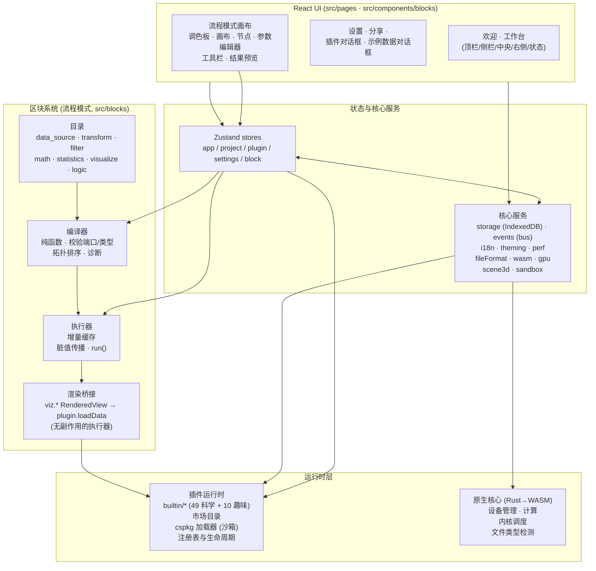

<div align="center">


<h1>Ergalics Studio</h1>

<p><b>浏览器中的科学计算工作站</b>——交互式数据探索、GPU 计算调度与沙箱化插件系统，全部在浏览器中运行，核心由 Rust/WASM 构建。</p>

<p>
<a href="https://snowleopard-io.github.io/ErgalicsStudio/"></a>
<a href="https://snowleopard-io.github.io/ErgalicsStudio/app/"></a>
<a href="https://snowleopard-io.github.io/ErgalicsStudio/app/docs/"></a>
</p>

<p>
<a href="https://github.com/SnowLeopard-io/ErgalicsStudio"></a>
<a href="LICENSE"></a>
<a href="https://www.typescriptlang.org/"></a>
<a href="https://react.dev/"></a>
<a href="#gpu-计算与原生核心"></a>
<a href="#gpu-计算与原生核心"></a>
</p>

</div>

<br>


---

## 目录

- [概览](#概览)
- [特性](#特性)
- [技术栈](#技术栈)
- [快速开始](#快速开始)
- [架构](#架构)
- [项目结构](#项目结构)
- [四种工作模式](#四种工作模式)
- [科研模块](#科研模块)
- [插件系统](#插件系统)
- [GPU 计算与原生核心](#gpu-计算与原生核心)
- [测试](#测试)
- [文档](#文档)
- [路线图](#路线图)
- [贡献](#贡献)
- [许可证](#许可证)

---

## 概览

Ergalics Studio 是完全运行于浏览器中的专业科学计算工作站：React + TypeScript 前端、编译为 WebAssembly 的 Rust 核心、WebGPU 计算管线，以及为第三方扩展设计的插件架构。工作台以四种模式为不同用户提供入口：

| 模式 | 适合谁 | 你做什么 |
| ---- | ------ | -------- |
| **标准（Standard）** | "我有数据 → 我看到结果" | 将数据集拖入插件即可看到可视化——最快路径。 |
| **流程（Flow）** | 管线搭建者 | 从内置区块组合出可视化数据流管线，按拓扑顺序运行并逐节点检查输出。 |
| **积木（Block）** | 学习者 / 喜欢命令式手感的人 | 类 Scratch 的积木编辑器，单个"运行"帽子区块启动程序；完全可脚本化。 |
| **代码（Code）** | 真正的脚本编写 | Monaco 编辑器支持 Python / R / JavaScript，切换语言时整份代码经共享 IR 即时互译。 |

项目处于**积极开发**且已可端到端使用。已交付（详见下文各节）：

| 领域 | 今日已交付 |
| ---- | ---------- |
| 工作台 | 四种模式、59 个内置插件（49 科学 + 10 趣味/工具）、沙箱化插件系统 + 市场目录、cspkg 签名门禁 |
| 计算 | 实时 GPU 计算、浏览器内 AI 训练插件、AI 助手（离线规则引擎 / 在线 OpenAI 兼容服务） |
| 数据与绘图 | 科研二进制数据导入（NetCDF / HDF5 / FITS / Zarr / Parquet）、出版级 SVG/PDF 绘图、统计分析、可复现性支持 |
| 代码编辑 | Python 经 Pyodide；R/JS 经共享 IR 引擎，R 存在内置 webR 分发包时升级为完整自由运行时 |
| 科研 | 19 个独立整页科研工具 + 单位系统、分块读取配套内核 |
| Web 界面 | 官方网站（画廊 / 主题市场 / 插件市场），与工作台深链打通 |

---

## 特性

**渲染与工作台**

- 四区布局：侧边栏（项目 / 插件）、中央视口、参数面板、带 GPU/性能指示器的状态栏。
- 项目生命周期：创建 / 打开 / 保存 / 自动保存 / 分享（`.clproj` 存于 IndexedDB）。
- 文件路由：按魔数 + 扩展名把拖入文件路由到匹配插件，多匹配时弹出选择，同名文件替换时先确认。
- 2D canvas 容器（点云 / 粒子 / 时间序列 / 直方图 / 热力图 / 等值线 / 散点 / 柱状 / 雷达 / 网络 / 气泡 / 小提琴 / 桑基 / 箱线 / 平行坐标 / 误差带 / 矩形树 / QQ 图等）+ 宿主管理的 Three.js 3D 场景（按需懒创建、插件间干净清理）。

**插件系统**

- **59 个内置插件**（49 科学 + 10 趣味/工具），覆盖完整 API 面；两级加载（核心自动 / 趣味按需）。
- 市场目录 `src/plugins/marketplace.ts`（精选标签 / 流行度 / 分类筛选）。
- `.cspkg` 包加载 + 清单校验 + **Worker 优先隔离**（§沙箱）：第三方入口经 postMessage 桥接与 OffscreenCanvas 渲染，回退为受限制作用域的 `new Function`（非安全边界）；两者均受 Ed25519 签名门禁约束（FR-05，见 `SECURITY.md`）。
- 本地化参数面板；所有插件一键导出 PNG / CSV，多个插件带分析叠加层（趋势线、累积/密度直方图、均值标记、抖动点、排序）与发送至 Figure Studio 动作。

**基础设施**

- i18n（zh-CN / en-US）、暗 / 亮主题、性能监控（FPS / GPU / 内存 / 数据规模）。
- 研究级可靠性内核：结构化错误分类法 + `Result`/重试 + 错误注册表、可组合校验框架与安全解析、Pandera 风格数据质量引擎（期望 / 画像 / 坏行隔离），见 `src/core/errors|validation|data-quality`。

**科学计算与科研模块（纯 TS 核心 + Zustand store + 独立整页）**

- 统计内核 `src/core/stats/`：描述统计、特殊函数、假设检验、效应量、多重比较校正、功效分析。
- 科研二进制 I/O `src/core/io/`：HDF5 / NetCDF / FITS / Parquet / Zarr 单一调度器。
- 出版级绘图引擎 `src/core/plot/`（SVG + PDF 导出）。
- 可复现性内核 `src/core/repro/`（带种子随机数、稳定哈希、运行清单、DAG→Python 导出）、`repro.lock`。
- 数据质量引擎 `src/core/data-quality/` 与类型化单位系统 `src/core/units/`。

---

## 技术栈

| 层级    | 选型                                                       |
| ------- | --------------------------------------------------------- |
| UI      | React 18, react-router-dom 7, Zustand 5                   |
| 语言    | TypeScript 5.7 (strict)                                   |
| 构建    | Vite 6                                                     |
| 3D      | Three.js r185 (+ @types/three)                            |
| 原生    | Rust → wasm32-unknown-unknown, wasm-bindgen 0.2            |
| GPU     | WebGPU / WGSL via web-sys                                  |
| SQL     | DuckDB-WASM（懒加载）+ Apache Arrow                        |
| 测试    | Vitest (单元) + Playwright-core (E2E, headless Edge)       |
| 文档    | VitePress (独立的 `docs/` workspace)                       |
| 打包    | fflate (cspkg ZIP), lz-string (项目压缩)                   |

---

## 快速开始

前置要求：**Node.js ≥ 20** 与 npm；构建原生核心时需要 **Rust 工具链**（`wasm32-unknown-unknown` target + `wasm-bindgen-cli`）——WASM 缺失时前端可优雅降级。

```bash
npm install         # 安装依赖
npm run dev         # 开发运行（欢迎页先做硬件自检：WebGPU/WASM/IndexedDB）

npm run build       # wasm → 类型检查 → vite build → 文档
npm run build:web   # 仅前端（无 WASM）
npm run build:wasm  # 重建 Rust 核心到 src/native

cd docs && npm install && npm run dev   # 文档站点
```

生产构建产物输出到 `dist/`。

---

## 架构



- **宿主 ↔ 插件契约**：每个插件实现 `Plugin` 接口（init/destroy/activate/…/renderToScene）并接收 `PluginApi`；沙箱化插件仅通过类型化 RPC 协议通信（`src/core/sandbox.ts` + `plugin-worker.ts`）。
- **WebGPU**：`src/core/gpu.ts` 管理适配器/设备并带 CPU 回退；Rust 核心经 wasm-bindgen 暴露 `ComputeKernel`（compile/dispatch/compilation_info）与 `GpuDeviceManager`。

---

## 项目结构

```
.
├── src/                      # 前端
│   ├── core/                 #   服务: storage, events, i18n, gpu, wasm, fileFormat,
│   │                         #   scene3d, sandbox, cspkg, errors, validation,
│   │                         #   data-quality, stats, io (HDF5/NetCDF/FITS/Zarr/Parquet),
│   │                         #   plot, repro, uncertainty, units, experiment, lineage,
│   │                         #   chunked, figure, notebook, package, model, signal,
│   │                         #   sweep, profiler, sql, report, inference, logger
│   ├── blocks/               #   区块系统 (流程模式): types · registry · compiler ·
│   │                         #     executor · ops · catalog · sample · l10n · render
│   ├── editor/               #   积木与代码模式: ir · block (Blockly) · code · codegen ·
│   │                         #     runtime (StudioApi + interpreter)
│   ├── components/           #   流程画布 / 积木与代码画布 / 工作台外壳
│   ├── pages/                #   欢迎、工作台、设置、分享、插件视图、figures、notebook、
│   │                         #     labs (runs · analysis · uncertainty · model-lab ·
│   │                         #     profiler · reprolock · lineage · supplement)、signal、
│   │                         #     sweeps、sql、report
│   ├── plugins/builtin/      #   49 科学 + 10 趣味/工具插件 (2D + 3D)
│   ├── plugins/marketplace.ts#   市场目录
│   ├── stores/               #   zustand stores
│   ├── types/                #   插件 & 项目 & 编辑器契约
│   └── native/               #   生成的 WASM 绑定 (git 未跟踪)
├── native/ergalics-core/     # Rust 核心 (device, compute, utils)
├── examples/{data,projects,code}/  # 示例数据、`.clproj` 工程、Python 程序
├── scripts/ · tests/ · docs/ · website/
```

---

## 四种工作模式

**标准模式**——默认落地体验：左侧栏（项目 / 插件）、中央视口、右侧参数面板。拖入文件即按扩展名 + 魔数路由到匹配插件；多匹配时由选择对话框决定。适合"已知要哪个插件、只差一个文件"的场景。


**流程模式**——从内置区块**组合可视化数据流管线**并运行。左侧调色板、中间画布（节点 + 边）、右侧节点参数编辑器、底部按输出类型自适应的实时结果预览（`RenderedView` 经插件渲染器 / `DataTable` 只读表 / `Scalar` 内联）。编译器是纯函数（端口 / 类型校验 + 环检测 + Kahn 拓扑排序）；执行器带增量缓存与脏值传播，改单个区块只重跑自身及其下游。图持久化到 `blockGraph`。架构详见 [`docs/guide/flow-mode.md`](docs/guide/flow-mode.md)。


**积木模式**——类 Scratch 编辑器，单个「运行 / Run」帽子区块是唯一执行入口。区块 JSON ↔ **共享 IR**（`src/editor/ir/`）双向往返；IR 解释器调用与流程模式区块相同的 `studio.*` API，因此 `studio.plot(...)` 落到同一个散点图插件；IR → JS/Python 代码生成实时可见。Blockly 13 提供画布并**懒加载**（~828 KB 按需 chunk），i18n 经 `BKY_*` 键接入。含 30+ 区块与 5 个示例程序，详见 [`docs/guide/block-mode.md`](docs/guide/block-mode.md)。


**代码模式**——真正脚本的 Monaco 编辑器，分段的 **Python / R / JS** 切换器 + 引擎徽章。**Python** 经 Pyodide Web Worker 运行完整 CPython（`studio` 作为可导入模块注入，REPL 单条求值，停止即重启 worker）。**R / JavaScript** 解析为共享 IR，在积木模式同一解释器上执行；R 优先升级到内置完整 webR 运行时，缺失时回退 IR 引擎。切换语言即经 IR 中枢互译。三模式经同一份 IR 无缝互转（`flow/block/convert.ts` + `code/parse.ts` + `mergeFlowIR` 合并写回 + 图签名守卫防丢节点）。含 9 个示例程序，详见 [`docs/guide/block-mode.md`](docs/guide/block-mode.md)。


---

## 科研模块

顶栏**科研**下拉 + **分析**页 + 欢迎页网格可打开 19 个独立科研整页，共享统一实验室外壳；每个模块都遵循"纯 TS 核心（无 React）→ Zustand store → 页面，单元测试覆盖"的分层：

| 页面 | 路由 | 功能 |
| ---- | ---- | ---- |
| 分析 | `/#/analysis` | 快速图表（折线/散点/直方图/柱状）+ 描述统计 + t / Mann–Whitney 检验 |
| 实验记录 | `/#/runs` | 自动记录运行历史（来源/参数/指标/耗时），参数 A/B 对比 |
| 不确定性 | `/#/uncertainty` | bootstrap 置信区间、蒙特卡洛传播、MCMC——CPU 或 WGSL GPU 引擎，R-hat / ESS |
| 模型实验室 | `/#/model-lab` | OLS / 逻辑 / 岭 / 多项式回归 + 系数表与 2×2 残差诊断 |
| Inference Forge | `/#/inference` | HMC / NUTS 贝叶斯推断 + WAIC / LOO / PPC + 轨迹与密度图 |
| 模型推理 | `/#/model-inference` | 浏览器内用 WebGPU 运行 ONNX 模型 |
| 数据画像 | `/#/profiler` | 流式列画像、相关矩阵、质量评分 + 问题清单、指纹缓存 |
| 信号实验室 | `/#/signal` | FFT / Welch PSD、窗函数、Savitzky–Golay / 移动平均滤波、ACF/PACF、季节分解 |
| 参数扫描 | `/#/sweeps` | 网格 / 列表 / 拉丁超立方参数批量实验，响应面可视化 |
| SQL 工作台 | `/#/sql` | DuckDB-WASM 查询项目文件：join / 聚合 / 窗口函数，结果自动接入血缘 |
| 数据清洗向导 | `/#/cleaning` | 分步向导：类型转换、缺失值策略、异常值标记、去重、重命名 |
| 报告生成器 | `/#/report` | 叙述 + 图表 + 表格 + 交互筛选器 → 单个自包含 HTML |
| 可复现锁 | `/#/reprolock` | `repro.lock` 导出 / 导入 + 五类漂移校验与一键复现 |
| 数据血缘 | `/#/lineage` | 由运行记录 + 数据导入重建的文件→运行 DAG（SVG 画布） |
| Figure Studio | `/#/figures` | 在 IEEE / Elsevier 模板上组合多面板出版级图表，SVG / PDF / PNG-600dpi 导出 |
| Notebook | `/#/notebook` | 项目内 Markdown + Python 混合单元格，运行于专用 Pyodide 并汇入实验历史 |
| 补充材料打包 | `/#/supplement` | 论文随附 ZIP（`manifest.json` + 运行记录 + 血缘 + 可选数据/代码） |
| 课程模式 | `/#/course` | 布置作业、收集并离线批改学生实验成果 |
| 作品画廊 | `/#/gallery` | 浏览并重新打开社区分享的可复现作品 |

配套内核补齐工具集：**单位系统**（量纲安全的 `Quantity` + `units.convert` / `units.check`）、**分块读取**（大型分隔符文件的异步行窗口读取）。Figure Studio 之上还有**期刊投稿检查**（IEEE / Elsevier 规范，按 image / annotation / text / metadata 预检）、**图注起草器**（中英双语）与 **3D 场图**面板。来自各模式的运行记录统一汇入同一份历史与血缘图，"这张图由哪次运行、基于哪些数据产出？"始终可答，并随补充材料 ZIP 交付。

### 科研实验室实景


*Inference Forge 在浏览器内（WebAssembly）运行 NUTS 采样：含 94% HDI / MCSE / R-hat / ESS 的后验摘要、WAIC / PSIS-LOO 模型对比、后验预测检查与轨迹 + 密度图。*


*Figure Studio 组合出版级图表——此处为套用 IEEE 单栏模板的多面板图组，支持图注起草器、期刊投稿检查与 SVG / PDF / 600 dpi PNG 导出。*


*信号实验室执行频域分析——对加速度时序做 Welch PSD（矩形窗、nfft=256），主峰清晰可见；支持基 2 FFT 幅值谱 / 窗函数 / 滤波，并发送到 Figure Studio。*


*作品画廊按学科汇聚可复现作品，每张卡片按复现锁状态（已锁定 / 检出漂移 / 未锁定）标记，便于发现、核验与引用。*

---

## 插件系统

### 内置插件

**核心 / 科学插件**（启动时自动加载，共 49 个）：

- 二维与三维可视化：Point Cloud、Point Cloud 3D、3D Surface、3D Voxel Field、Time Series、Histogram、Heatmap、Image Viewer、Contour、Scatter、Bar / Polar / Radar、Network Graph、Bubble、Violin、Sankey、Box、Parallel Coordinates、Error Band、Treemap、QQ Plot，以及 Particles（真实 WGSL 计算）。
- GPU 仿真引擎：N-Body Gravity（WGSL 全对齐）、LBM Fluid（D2Q9 格子 Boltzmann，collide+stream，卡门涡街）、Wave Equation（WGSL leapfrog，高斯脉冲 / 双源干涉 / 双缝衍射）、Double Pendulum（RK4 + 混沌幽灵摆）。
- 物理实验室：电磁场、光学实验、结构力学（均可直接在画布上操作）。
- 生物与生化：晶胞 3D 预览、反应分子动力学 3D、酶动力学（米氏方程 LM 拟合）、传染病分室模型、序列比对（NW/SW）、群体遗传学（HW 检验 + Wright–Fisher 漂变）、AI Trainer（浏览器内用 TF.js 训练 4 种模型，含 MNIST CNN）。
- 地理插件系列（`geo/`，均支持一键发送 Figure Studio）：GeoJSON Map、太阳高度与昼长（FAO-56）、气候图（柯本）、人口金字塔、空间插值（IDW / 普通克里金 + LOOCV + Moran's I）、测距测面（标准差椭圆）、投影变形（Tissot）、地形分析（priority-flood → D8 → 汇流累积流域三件套）、GPX 轨迹、3D 地球仪。
- **两个赛题级科学求解器**（Pyodide Worker 运行，见 `docs/technical/09|10`）：
  - **电磁谐振特征值求解器**（EM Eigensolver）——稀疏厄密特征值求解：thick-restart Lanczos / 块 LOBPCG / Jacobi-Davidson + MINRES 位移反演、自适应位移、真实残差认证；输出 2D 谱报告与 3D 模式场，十万阶低内存。
  - **流体双向耦合求解器**（Fluid CFD Coupler）——1D 管网与 3D 标量场双向耦合：多速率时间步协调、正反向边界耦合、毫秒级阀门控制、守恒审计；含壅塞（Case A/C）与亚临界文献（Case D）验证。

模拟类插件严格数据驱动：初始为空、绝不伪造默认场景，**重置**仅重放已加载的数据。每个核心插件都附示例数据集（`examples/data/`），经 **示例** 对话框一键加载即可产出真实可视化。

其中四个依赖非平凡计算路径的插件：


*N-Body Gravity 用 WGSL 全对引力内核在 GPU 上模拟直和引力，每步 O(N²)。*


*AI Trainer 用 TensorFlow.js 在浏览器内训练线性 / 非线性 / 逻辑回归 / 卷积模型，TF.js 在首次点击 Train 时懒加载（~2 MB）。*


*GeoJSON Map 离线渲染矢量地图并按属性分级设色，支持 Albers / 墨卡托 / 等距圆柱投影。*

三个可交互物理实验室作为旗舰演示（对象可直接在画布上操作）：


*电磁场：可拖动电荷在库仑力与洛伦兹力下运动，回旋加速器示例让电荷旋入半径由速度 / 质量 / B 决定的螺线。*


*光学实验：几何光学光线追踪（薄透镜、斯涅尔折射 + 色散三棱镜、可拖动光屏）。*


*结构力学：铰接桁架按轴力着色并显示利用率读数，超载断裂直至垮塌。*

**更多插件实景**（地理 / 流体仿真 / 生命科学 / 化学）：


*LBM 流体用 D2Q9 格子 Boltzmann 的 collide+stream 双内核模拟通道绕流，涡量场实时显示卡门涡街的脱落。*


*交互地球仪把 Natural Earth 110m 海岸线与经纬网贴在球面上并叠加球面 Tissot 变形圆，支持滚轮缩放与自动自转。*


*DEM 地形分析解析 ESRI ASCII Grid 高程，给出山体阴影、Horn 法坡度 / 坡向与等高线，并支持可拖拽旋转的三维建模视图。*


*空间插值把离散站点观测网格化：反距离加权（幂次可调）与普通克里金（球状 / 指数经验变差函数自动拟合）输出热力面、等值线与站点标注。*


*生物酶插件对底物-速率数据做米氏方程非线性 LM 拟合，输出 K_m 与 V_max 及置信区间。*


*化学晶体插件把晶胞渲染为真三维结构，可沿任一轴旋转并叠加电子密度等值面。*

**趣味与工具插件**（`autoload: false`，共 10 个，按需从内置面板或市场加载）：Mandelbrot、Spirograph、Lissajous、Game of Life、Harmonograph、Palette Explorer、Koch Snowflake、Barnsley Fern、Fireworks、Truchet Tiles。

当 WebGPU 缺失时，每个内置插件都在 CPU 上运行相同数学——完整计算路径见 [GPU 计算与原生核心](#gpu-计算与原生核心)。

### 第三方包（`.cspkg`）

包是含 `manifest.json` + 入口 + 资源的 ZIP，加载时校验清单（id 格式、入口路径穿越、沙箱枚举）后执行：

```jsonc
{
  "id": "com.example.analyzer",
  "name": "Analyzer",
  "version": "1.2.0",
  "entry": "dist/index.js",
  "sandbox": "isolated",        // "isolated"（默认，Worker 中运行，无 DOM）| "trusted"（完整 DOM 访问）
  "formats": [{ "extension": ".dat" }]
}
```

- `sandbox: "isolated"`（默认）——Worker 内独立全局作用域，canvas 经 OffscreenCanvas 渲染。
- `sandbox: "trusted"`——宿主上下文中执行，仅对自己控制的包使用。

**限制（如实记录）**：Worker 共享同源 IndexedDB，且 `new Function` 回退只是尽力而为的近似、**并非**安全边界，启用时会告警。

---

## GPU 计算与原生核心

Rust crate `native/ergalics-core` 编译为 WASM 并以 wasm-bindgen 绑定。暴露面：`GpuDeviceManager`（带 CPU 回退）、`GpuBuffer`、`KernelDescriptor` + `BindingDescriptor`、`ComputeKernel`（`compile` / `bind_group` / `run` / `compilation_info`）、`detect_file_kind` 魔数检测。

`src/core/gpu.ts` 拥有适配器/设备生命周期，`src/core/compute.ts` 暴露**面向插件的计算面**（`PluginApi.gpu`）：`createBuffer` / `write` / `read`、`compileKernel`，以及一次性 `run`——WASM 已加载时经 Rust 核心路由，否则经原生 WebGPU API，因此加速计算在生产可用而 Rust 核心始终是参考引擎。

可复用 WGSL 内核位于 `src/core/wgsl.ts`（粒子积分、3D 全对齐 N-body、D2Q9 LBM collide/stream/curl、二维波动方程 leapfrog），并配有 CPU 回退用的宿主侧打包辅助。Particles 演示单缓冲路径，N-Body 使用乒乓缓冲让每个积分步留在设备上。

> 当 WebGPU（或 WASM 模块）不可用时，`api.gpu` 为 `undefined`，插件回退到 CPU——行为一致，无需 GPU。

---

## 测试

单元测试（Vitest，node 环境）：

```bash
npm test          # 或 npm run test:unit
npm run verify    # 类型检查 + 单元测试
```

**2233 个测试分布在 123 个测试文件中**（2231 通过，2 个在无 GPU 环境跳过），覆盖：数据与 I/O、统计内核、插件与沙箱、GPU 计算、区块系统、三模式 IR 同步（积木 ↔ 流程 ↔ 代码往返）、科研模块（不确定性 / 单位 / 实验记录 / 血缘 / 图表 / 打包 / Notebook / 模型 / 画像 / 信号 / 扫描 / SQL / 报告 / 可复现锁 / 推断引擎）、可靠性内核、平台。

E2E 套件（Playwright-core, headless Edge）：

```bash
npm run test:e2e
```

覆盖 `smoke-test`、`verify-ui`、`verify-fixes`、`verify-3d`、`verify-plugins`、`verify-webgpu`、`verify-block-mode`、`verify-code-mode`、`verify-ai-samples`、`verify-ai-training`、`verify-research`；另有两项单独运行：`verify-lang-modes`（R/JS 在 IR 引擎上运行与互译）与 `npm run verify:site`（合并部署三界面路径完整性）。

---

## 文档

三个 Web 界面统一部署到同一 GitHub Pages 站点：

- **官方网站**（`website/`）位于 Pages 根——画廊、主题市场与插件市场，零安装深链。
- **工作站**（React 应用）位于 `<repo>/app/`——"在线工作站"入口，内嵌文档副本。
- **文档**——独立 VitePress workspace 位于 [`docs/`](docs/)：

```bash
cd docs && npm install && npm run dev    # 本地文档站点
npm run build                            # 静态站点 → docs/.vitepress/dist
```

`deploy.yml` 用 `scripts/merge-deploy.mjs` 合并三者；`npm run verify:site` 在发布前探测三个关键路径，跨站导航回归会在 CI 中报错而非静默失效。

---

## 路线图

要点（完整状态见 [`docs/guide/roadmap.md`](docs/guide/roadmap.md)）：

- [x] 工作台布局、项目管理、文件路由；四种模式（标准 / 流程 / 积木 / 代码）
- [x] 59 个内置插件、cspkg 加载、Worker 沙箱、Ed25519 签名门禁（FR-05）
- [x] 插件全量一键 PNG/CSV 导出 + 分析叠加层；市场目录
- [x] WebGPU 设备管理 + 真实计算内核管线（Particles / N-Body / LBM / 波动方程…）
- [x] 地理插件系列（空间插值含 LOOCV + Moran's I、地形分析流域三件套、FAO-56 等），全部支持发送 Figure Studio
- [x] 流程模式（编译器 + 增量执行器 + 40+ 区块）、积木模式（Blockly 13 + 共享 IR）、代码模式（Python / R / JavaScript，多语言互译）
- [x] 三模式无缝互转（共享 IR 中枢，`mergeFlowIR` + 签名守卫）
- [x] 统计分析子系统（`src/core/stats/`）、科研二进制导入（`src/core/io/`）、出版级绘图引擎（`src/core/plot/`）、可复现性内核
- [x] 科研工具集整页化（实验记录 / 不确定性 GPU 引擎 / 模型实验室 / 数据画像 / 信号实验室 / Sweep Studio / SQL 工作台 / 报告生成器 / 可复现锁 / Inference Forge / Figure Studio / Notebook / 数据血缘 / 课程模式 / 作品画廊等 19 个）
- [x] 研究级可靠性层（错误分类法 + 校验框架 + 数据质量引擎）
- [x] AI 助手（自然语言 → `studio.*` 代码草稿 → 运行；离线 / 在线两种模式）
- [x] 完整自由语法 R 运行时（webR + CRAN 包，缺失时回退 IR 引擎）
- [x] 官方网站（画廊 / 主题市场 / 插件市场）+ 官网市场"下载"产出可加载 `.cspkg`
- [x] GitHub Actions CI（单元 + E2E + Pages 部署）
- [ ] 插件市场：第三方自助提交与安装管线

---

## 贡献

1. Fork 并创建功能分支。
2. 保持改动小巧且由测试覆盖——`npm run verify` 必须保持绿色；新插件/功能应附带 E2E 检查。
3. 提交 PR 前运行 `npm run test:e2e`。
4. 触碰 `native/ergalics-core` 后用 `npm run build:wasm` 重新生成 WASM 绑定。

通过 [GitHub Issues](https://github.com/SnowLeopard-io/ErgalicsStudio/issues) 报告 bug 与功能请求。

---

## 许可证

[MIT](LICENSE) © 2026 [SnowLeopard-io](https://github.com/SnowLeopard-io)