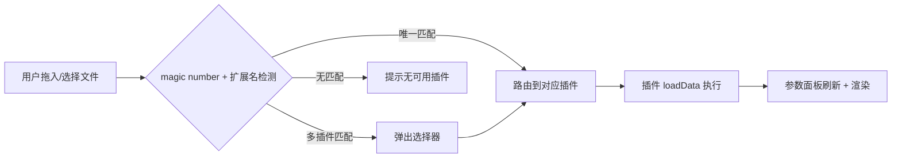
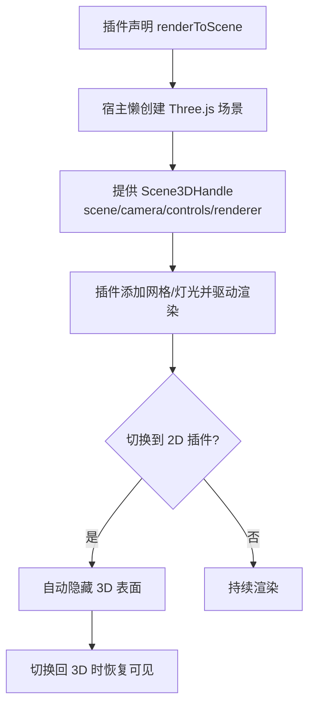
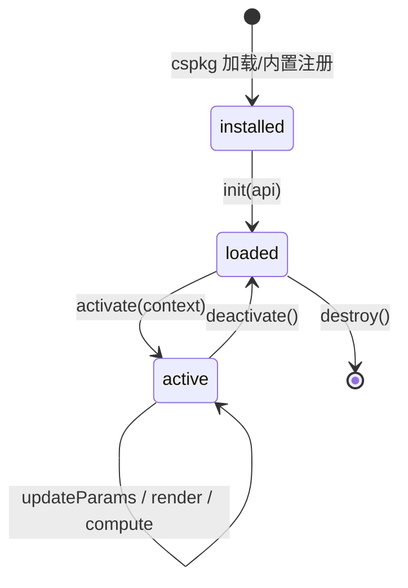
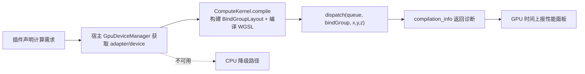

# Ergalics Studio 需求规格说明书

> 版本：1.0 ｜ 状态：规划阶段 ｜ 适用对象：本项目的后续开发与评审
>
> 本文档基于当前代码库的实际状态编写，参考 JupyterLab、VS Code Extensions、Observable、Google Colab、Streamlit/Dash 等行业标杆提炼需求。标注 ✅ 的为已实现、🚧 为待建、🟡 为部分实现。本文档不包含难度评估与推进日期。

---

## 目录

- [1. 项目概述](#1-项目概述)
- [2. 行业标杆对标分析](#2-行业标杆对标分析)
- [3. 功能需求详细清单](#3-功能需求详细清单)
- [4. 非功能需求](#4-非功能需求)
- [5. 接口契约要求](#5-接口契约要求)
- [6. 验收要求与质量门槛](#6-验收要求与质量门槛)

---

## 1. 项目概述

### 1.1 背景

科学计算与数据探索类工具长期被两类形态占据：一类是以 JupyterLab、Google Colab 为代表的云端笔记本，依赖服务端内核（Python kernel）执行计算，浏览器仅作前端；另一类是以 Origin、MATLAB Online 为代表的重量级桌面/网页应用，安装与协作成本高。两者都把"算力"绑定在服务端，导致离线场景、敏感数据场景、轻量探索场景缺乏顺手的工具。

Ergalics Studio 选择第三条路：**把科学计算工作站的全部运行时搬进浏览器**。计算能力来自 WebGPU 与 Rust 编译的 WebAssembly 核心，而非服务端内核；可视化由 Three.js 与 Canvas 直接在客户端渲染；第三方能力通过沙箱化的插件包（`.cspkg`）扩展。这意味着一个静态站点即可承载完整的数据探索流程，无需后端、无需安装、数据不出本机。

### 1.2 产品定位

一款**浏览器原生、零后端依赖的科学计算工作站脚手架**，面向需要在客户端完成数据加载、可视化、GPU 计算与插件扩展的研发场景。当前阶段以"工业级脚手架"为目标：核心回路（项目管理、数据加载、插件注册、2D/3D 渲染、i18n、主题、性能监控）已可运行，GPU 加速计算与插件市场正在增量构建。

### 1.3 目标用户

| 用户角色 | 典型场景 | 核心诉求 |
| --- | --- | --- |
| 科研/工程人员 | 离线探索点云、时序、热力图等数据 | 快速拖入文件即出图，参数实时可调 |
| 数据可视化开发者 | 为自定义数据格式编写可视化插件 | 清晰的插件契约、隔离的运行环境、可分发 |
| 算法/计算研究人员 | 在浏览器跑 WGSL 计算核 | GPU 设备管理、核编译/调度、性能遥测 |
| 团队协作者 | 分享分析结果与可复现项目 | 一条链接复现完整工作区状态 |

### 1.4 核心目标

1. **客户端自洽**：从数据加载到渲染到计算，全部在浏览器内完成，不依赖任何后端服务。
2. **插件可扩展**：第三方以 `.cspkg` 包形式扩展能力，默认运行在 Web Worker 沙箱中，与宿主页面隔离。
3. **GPU 可调度**：通过 Rust/WASM 核心统一管理 WebGPU 设备，向插件暴露核编译与调度能力，并具备 CPU 降级。
4. **工程可演进**：分层清晰（pages → stores → core）、契约单一（`Plugin` 接口）、测试覆盖（单元 + E2E），使脚手架能成长为生产系统而无需重写。

### 1.5 设计原则

- **诚实标注边界**：沙箱隔离页面上下文但不隔离同源 IndexedDB；Worker 不可用时降级为非安全边界的 `new Function`，并在 UI 明确告警。需求中所有"隔离"都按实际能力描述，不夸大。
- **分层单向依赖**：`pages → stores → core`，下层永不反向引用上层；`core` 保持 DOM 轻量以便在 Node 环境单测。
- **契约即唯一词汇表**：宿主与第三方代码之间只通过 `src/types/plugin.ts` 暴露的类型交互，不泄漏内部实现。
- **渐进降级**：WebGPU 不可用时退 CPU，WASM 缺失时前端仍可构建，Worker 不可用时退 best-effort 沙箱并告警。

---

## 2. 行业标杆对标分析

### 2.1 对标对象选取

| 标杆 | 对标价值 |
| --- | --- |
| **JupyterLab** | 科学计算 IDE 的工作台布局、文件浏览器、单元格/输出渲染、扩展机制（lab extensions） |
| **VS Code** | 扩展 API 设计（activation events、capability）、扩展市场、命令面板、四区工作台 |
| **Observable** | 响应式 notebook、内联可视化、数据反应式更新 |
| **Google Colab** | 云端 GPU 调度形态（作为反面对标：本项目坚持客户端算力） |
| **Streamlit / Plotly Dash** | 数据应用的快速原型与参数面板交互范式 |
| **Three.js Editor** | 3D 场景的宿主托管、相机/灯光/网格基线、资源释放 |

### 2.2 能力维度对比

下图以八个维度对比 Ergalics Studio 与主要标杆的能力取向。数值为相对评分（0–5），用于说明定位差异而非精确测量。


### 2.3 关键差异与启示

从标杆实践可以提炼出几条对本项目直接可用的方法论：

**工作台布局收敛于"四区"**。VS Code 与 JupyterLab 都把工作台拆为侧栏（导航/资源）、中央视图（主交互）、右侧面板（属性/参数）、底部状态栏（运行态指示）。本项目已采用相同结构，应继续把任何新功能归入四区之一，避免出现第五个游离面板。

**扩展能力通过 capability 而非全量 API 暴露**。VS Code 的 Extension API 只暴露受控能力点（命令、视图、状态栏项），插件无法触碰任意内部状态。本项目的 `PluginApi` 同样是能力受限的小接口（locale、status、perf、notify、file、param），应坚持"按需授予能力"，新需求优先表现为 `PluginApi` 的新方法而非放开内部 store。

**可视化与数据反应式绑定**。Observable 的核心是变量依赖自动重算。本项目插件采用"参数变更 → `updateParams` → 重渲染"的拉模型，应在参数面板层面保证参数变更可观测、可批处理、可防抖，避免每次微调都触发全量重算。

**算力归属决定架构形态**。Colab 把算力放在服务端 GPU，因此天然支持重计算但牺牲离线与隐私；本项目把算力放在客户端 WebGPU，离线与隐私是优势，但单机算力受限。需求层面应把"GPU 不可用时的降级路径"作为一等公民，而非附属处理。

**市场是分发的最后一步，签名是信任的前提**。VS Code Marketplace 对扩展做版本管理与签名校验。本项目插件市场（🚧 待建）必须把包签名作为安装前置条件，否则沙箱的同源 IndexedDB 暴露面会演变为实际风险。

---

## 3. 功能需求详细清单

本章是文档主体。每个模块给出需求项表格（编号、描述、优先级、状态、对标参考），关键模块辅以 Mermaid 图说明流程或状态。优先级定义：**P0 必须**、**P1 应该**、**P2 可选**。

### 3.1 欢迎页与硬件自检（WP）

进入工作台前的入口页，负责环境探测与首选项设置。

| 编号 | 需求描述 | 优先级 | 状态 | 对标参考 |
| --- | --- | --- | --- | --- |
| FR-WP-01 | 提供项目品牌标识、一句话定位与"进入工作台"主入口 | P0 | ✅ | JupyterLab 启动页 |
| FR-WP-02 | 进入工作台前执行硬件自检：WebGPU 可用性、WASM 加载、IndexedDB 可写 | P0 | ✅ | Colab 运行时检查 |
| FR-WP-03 | 自检结果以可读清单呈现，每项给出"可用/不可用/降级"状态与简短说明 | P0 | ✅ | — |
| FR-WP-04 | 提供 语言切换（zh-CN/en-US）与 主题切换（亮/暗/跟随系统），无需进入工作台即可切换 | P0 | ✅ | VS Code 首次启动 |
| FR-WP-05 | 自检不通过的项不影响进入工作台，但需在工作台状态栏持续提示降级状态 | P1 | ✅ | — |
| FR-WP-06 | 提供"文档"入口，链接到内置 VitePress 文档站 | P2 | ✅ | — |
| FR-WP-07 | 自检结果可一键复制为文本，便于用户反馈环境信息 | P2 | 🚧 | — |

### 3.2 工作台布局（WB）

四区布局是所有交互的容器，需保证结构稳定、状态可恢复。

| 编号 | 需求描述 | 优先级 | 状态 | 对标参考 |
| --- | --- | --- | --- | --- |
| FR-WB-01 | 四区布局：左侧栏（项目/插件/工具）、中央视口、右侧参数面板、底部状态栏 | P0 | ✅ | VS Code / JupyterLab |
| FR-WB-02 | 提供空状态：无项目/无插件激活时，中央视口引导用户拖入文件或新建项目 | P0 | ✅ | VS Code 空编辑器 |
| FR-WB-03 | 支持拖拽文件到中央视口，触发文件路由（见 3.4） | P0 | ✅ | JupyterLab 拖入 |
| FR-WB-04 | 各区域可折叠/展开，折叠状态随项目持久化 | P1 | 🚧 | VS Code 视图切换 |
| FR-WB-05 | 状态栏常驻显示：当前插件、GPU 后端、FPS、帧时间、内存、数据规模、警告徽标 | P0 | ✅ | VS Code 状态栏 |
| FR-WB-06 | 顶栏提供项目名、保存/分享/设置入口 | P0 | ✅ | — |
| FR-WB-07 | 工作台布局比例可拖拽调整，比例随项目持久化 | P2 | 🚧 | VS Code 分栏 |
| FR-WB-08 | 全局命令面板（Ctrl/Cmd+P）快速切换插件、项目、命令 | P2 | 🚧 | VS Code 命令面板 |

### 3.3 项目管理（PM）

项目是工作区的持久化单元，`.clproj` 格式存储于 IndexedDB。

| 编号 | 需求描述 | 优先级 | 状态 | 对标参考 |
| --- | --- | --- | --- | --- |
| FR-PM-01 | 项目生命周期：新建 / 打开 / 保存 / 自动保存 / 另存 / 删除 | P0 | ✅ | JupyterLab 文件 |
| FR-PM-02 | 项目格式 `.clproj`，结构包含 `files`、`state`（activePlugin/parameters/camera/scene）、`metadata`（version/tags/description） | P0 | ✅ | — |
| FR-PM-03 | 项目持久化于 IndexedDB，并使用 lz-string 压缩以降低存储体积 | P0 | ✅ | — |
| FR-PM-04 | 自动保存按可配置间隔触发，保存时状态栏提示 `saving` | P0 | ✅ | VS Code auto save |
| FR-PM-05 | 打开项目时恢复全部状态：激活插件、参数、相机视角、场景对象 | P0 | ✅ | — |
| FR-PM-06 | 提供最近项目列表，按 `updatedAt` 倒序排列 | P0 | ✅ | — |
| FR-PM-07 | 项目支持标签与描述，便于检索 | P1 | ✅ | — |
| FR-PM-08 | 项目可导出为文件、可从文件导入，实现跨设备迁移 | P1 | ✅ | — |
| FR-PM-09 | 项目格式带版本号 `PROJECT_FORMAT_VERSION`，未来升级需提供迁移逻辑 | P1 | ✅ | — |
| FR-PM-10 | 支持项目级快照（历史版本回溯） | P2 | 🚧 | Colab 版本历史 |

### 3.4 数据加载与文件路由（DL）

文件如何进入系统并被分派到正确插件。



| 编号 | 需求描述 | 优先级 | 状态 | 对标参考 |
| --- | --- | --- | --- | --- |
| FR-DL-01 | 支持文件选择器与拖拽两种入口 | P0 | ✅ | JupyterLab |
| FR-DL-02 | 文件类型检测同时依据 magic number 与扩展名，WASM 核心可辅助检测（`detect_file_kind`） | P0 | ✅ | UNIX file 命令 |
| FR-DL-03 | 唯一匹配插件时自动路由；多插件匹配时弹出选择器对话框 | P0 | ✅ | VS Code 文件关联 |
| FR-DL-04 | 无匹配插件时给出明确提示，并引导用户安装或选择插件 | P0 | ✅ | — |
| FR-DL-05 | 文件元数据（id/name/size/mimeType/format/content）写入项目 `data.files` | P0 | ✅ | — |
| FR-DL-06 | 支持大文件分片读取与进度反馈 | P1 | 🚧 | — |
| FR-DL-07 | 插件可声明 `getSupportedFormats()` 动态返回支持的格式 | P1 | ✅ | — |
| FR-DL-08 | 内置示例数据集，无需外部文件即可体验各插件 | P0 | ✅ | Observable 示例 |

### 3.5 2D 渲染管线（R2D）

所有 2D 可视化共享的渲染容器与生命周期。

| 编号 | 需求描述 | 优先级 | 状态 | 对标参考 |
| --- | --- | --- | --- | --- |
| FR-R2D-01 | 中央视口维护共享 2D Canvas（`central-canvas`），所有 2D 插件在其上绘制 | P0 | ✅ | — |
| FR-R2D-02 | 维护 DOM 容器（`central-dom-host`）供需要 DOM 元素的插件挂载 | P0 | ✅ | — |
| FR-R2D-03 | 2D 与 3D 表面互斥：2D 插件激活时立即隐藏 3D 场景，避免坐标系串扰 | P0 | ✅ | — |
| FR-R2D-04 | 插件切换时清理上一插件的画布帧，防止残留 | P0 | ✅ | — |
| FR-R2D-05 | Canvas 尺寸随视口自适应，支持 devicePixelRatio 高清渲染 | P0 | ✅ | — |
| FR-R2D-06 | 内置 2D 插件覆盖：点云、粒子、时序、直方图、热力图、图像查看器、等值线、散点 | P0 | ✅ | — |
| FR-R2D-07 | 支持 viridis 等科学色带映射 | P1 | ✅ | matplotlib colormap |
| FR-R2D-08 | 支持对数刻度（如直方图） | P1 | ✅ | — |
| FR-R2D-09 | 2D 画布支持导出为 PNG | P2 | 🚧 | — |

### 3.6 3D 渲染管线（R3D）

宿主托管的 Three.js 场景，按需创建、按可见性切换。



| 编号 | 需求描述 | 优先级 | 状态 | 对标参考 |
| --- | --- | --- | --- | --- |
| FR-R3D-01 | 仅当插件声明 `renderToScene` 时才创建 Three.js 场景，避免无谓 GPU 占用 | P0 | ✅ | Three.js Editor 懒加载 |
| FR-R3D-02 | 宿主预置网格、坐标轴、灯光、轨道控制器、相机自动 fit | P0 | ✅ | Three.js Editor |
| FR-R3D-03 | `Scene3DHandle` 暴露 `setVisible/dispose/render/snapshot` 控制接口 | P0 | ✅ | — |
| FR-R3D-04 | 非 3D 插件激活时宿主自动隐藏场景，保证 3D 坐标系不渗入 2D 视图 | P0 | ✅ | — |
| FR-R3D-05 | 场景资源（几何体、材质、纹理）在销毁时 GPU 安全释放 | P0 | ✅ | — |
| FR-R3D-06 | Canvas resize 时正确更新相机与渲染器 | P0 | ✅ | — |
| FR-R3D-07 | 相机状态（position/target/up）持久化到项目 `state.camera` | P1 | ✅ | — |
| FR-R3D-08 | 支持场景快照导出 PNG | P1 | ✅ | — |
| FR-R3D-09 | 支持多 3D 插件叠加渲染（图层化） | P2 | 🚧 | — |

### 3.7 插件系统——生命周期与契约（PL）

插件从加载到销毁的完整状态机，是整个系统的中枢。



| 编号 | 需求描述 | 优先级 | 状态 | 对标参考 |
| --- | --- | --- | --- | --- |
| FR-PL-01 | 每个插件实现 `Plugin` 接口：init/destroy/activate/deactivate/render/updateParams/getParams/compute/loadData/renderToScene | P0 | ✅ | VS Code Extension activate/deactivate |
| FR-PL-02 | 宿主驱动生命周期：load → init(api) → activate(context) → params 协商 → deactivate → destroy | P0 | ✅ | — |
| FR-PL-03 | `getParams()` 支持异步返回（沙箱插件经 RPC 应答） | P0 | ✅ | — |
| FR-PL-04 | 注册表记录每个插件的 `installed/loaded/active` 状态与元数据 | P0 | ✅ | — |
| FR-PL-05 | 插件激活时由插件库集中决定 2D/3D 表面可见性 | P0 | ✅ | — |
| FR-PL-06 | 插件可订阅项目保存/加载事件（`onProjectSave/onProjectLoad`） | P1 | ✅ | — |
| FR-PL-07 | 同一时刻仅一个插件处于 active（单激活模型）；多插件叠加为 P2 | P1 | ✅ | — |
| FR-PL-08 | 插件销毁时必须释放所有 GPU/Worker/定时器资源，宿主在 deactivate 后兜底清理 | P0 | ✅ | — |
| FR-PL-09 | 提供插件热重载（开发态）以便快速迭代 | P2 | 🚧 | VS Code 开发主机 |

### 3.8 插件系统——包加载（PKG）

第三方插件以 `.cspkg`（ZIP）形式分发与加载。

| 编号 | 需求描述 | 优先级 | 状态 | 对标参考 |
| --- | --- | --- | --- | --- |
| FR-PKG-01 | `.cspkg` 为 ZIP 包，包含 `manifest.json` + 入口模块 + 资源 | P0 | ✅ | VS Code VSIX |
| FR-PKG-02 | Manifest 字段：id/name/version/author/description/entry/sandbox/formats/nameI18n/descriptionI18n | P0 | ✅ | VS Code package.json |
| FR-PKG-03 | 加载时校验：必填字段、id 格式、entry 路径穿越防护、sandbox 枚举合法性 | P0 | ✅ | — |
| FR-PKG-04 | `sandbox: isolated`（默认）在 Web Worker 执行；`sandbox: trusted` 在宿主上下文执行 | P0 | ✅ | — |
| FR-PKG-05 | 入口模块默认导出为工厂函数或对象，接收 `PluginApi` 返回 `Plugin` | P0 | ✅ | — |
| FR-PKG-06 | 支持包依赖声明（`dependencies`）与依赖解析 | P1 | 🚧 | VS Code extensionDependencies |
| FR-PKG-07 | 支持包版本冲突检测与提示 | P1 | 🚧 | — |
| FR-PKG-08 | 包可携带图标与多语言名称/描述 | P1 | ✅ | — |

### 3.9 插件系统——沙箱隔离（SBX）

第三方代码与宿主页面的隔离边界，是安全的核心。

| 编号 | 需求描述 | 优先级 | 状态 | 对标参考 |
| --- | --- | --- | --- | --- |
| FR-SBX-01 | `isolated` 插件运行于 Web Worker，独立全局作用域，无 DOM/window/store 访问 | P0 | ✅ | VS Code Extension Host |
| FR-SBX-02 | Worker 内 Canvas 渲染通过 `OffscreenCanvas` 转移实现 | P0 | ✅ | — |
| FR-SBX-03 | 宿主与 Worker 间通过类型化 RPC 协议通信（`sandbox.ts` + `plugin-worker.ts`） | P0 | ✅ | — |
| FR-SBX-04 | Worker 不可用时降级为 `new Function` + 影子全局，并明确告警"非安全边界" | P0 | ✅ | — |
| FR-SBX-05 | `dom`/`three` 句柄在 isolated 模式下不可用，仅 2D Canvas 可用 | P0 | ✅ | — |
| FR-SBX-06 | 文档诚实声明：Worker 共享同源 IndexedDB，恶意包仍可读取应用数据 | P0 | ✅ | — |
| FR-SBX-07 | 包签名校验作为安装前置，未签名包禁止安装（待市场落地） | P0 | 🚧 | VS Code 签名 |
| FR-SBX-08 | 提供 Worker 资源配额（CPU 时间/内存）软限制与超时终止 | P1 | 🚧 | — |
| FR-SBX-09 | isolated 插件崩溃不影响宿主，宿主可捕获并提示重启插件 | P1 | 🚧 | — |

### 3.10 插件系统——参数面板（PP）

右侧面板根据插件声明动态生成参数控件。

| 编号 | 需求描述 | 优先级 | 状态 | 对标参考 |
| --- | --- | --- | --- | --- |
| FR-PP-01 | 支持控件类型：range/select/number/checkbox/text/file/button/toggle | P0 | ✅ | Streamlit 控件 |
| FR-PP-02 | 控件支持多语言 label（`labelI18n`） | P0 | ✅ | — |
| FR-PP-03 | 参数变更经防抖后批量调用 `updateParams`，避免高频重渲染 | P0 | 🟡 | Observable 反应式 |
| FR-PP-04 | toggle 控件支持 on/off 双标签（如 Start/Stop） | P1 | ✅ | — |
| FR-PP-05 | button 控件支持 primary/danger/default 变体 | P1 | ✅ | — |
| FR-PP-06 | 参数值持久化到项目 `state.parameters[pluginId]` | P0 | ✅ | — |
| FR-PP-07 | 参数面板支持分组与折叠 | P2 | 🚧 | — |
| FR-PP-08 | 参数变更可触发 compute 并显示进度 | P1 | ✅ | — |

### 3.11 插件市场（MKT）

🚧 待建模块。插件发现、安装、更新、签名的分发体系。

| 编号 | 需求描述 | 优先级 | 状态 | 对标参考 |
| --- | --- | --- | --- | --- |
| FR-MKT-01 | 提供插件市场 UI：浏览/搜索/分类/详情页 | P0 | 🚧 | VS Code Marketplace |
| FR-MKT-02 | 支持一键安装 `.cspkg`，安装前校验签名与 manifest | P0 | 🚧 | — |
| FR-MKT-03 | 支持插件版本管理与更新提示 | P1 | 🚧 | — |
| FR-MKT-04 | 包签名机制（签名密钥 + 校验流程），未签名包禁止安装 | P0 | 🚧 | VS Code 签名 |
| FR-MKT-05 | 支持本地安装 `.cspkg` 文件（离线场景） | P1 | 🚧 | — |
| FR-MKT-06 | 已安装插件管理：启用/禁用/卸载/查看详情 | P0 | 🚧 | VS Code 扩展视图 |
| FR-MKT-07 | 市场元信息：下载量、评分、作者认证标识 | P2 | 🚧 | — |
| FR-MKT-08 | 插件权限声明与安装时权限确认（访问文件/GPU/网络） | P0 | 🚧 | 浏览器扩展权限 |

### 3.12 GPU 计算管线（GPU）

🚧 待建（核心已就绪）。把 WGSL 核接入示例插件并暴露给第三方。



| 编号 | 需求描述 | 优先级 | 状态 | 对标参考 |
| --- | --- | --- | --- | --- |
| FR-GPU-01 | 统一管理 WebGPU adapter/device 生命周期，支持 `forceFallbackAdapter` | P0 | ✅ | WebGPU 规范 |
| FR-GPU-02 | `ComputeKernel` 支持从 `KernelDescriptor` + `BindingDescriptor` 编译真实管线 | P0 | ✅ | — |
| FR-GPU-03 | 支持 dispatch（x/y/z 工作组）与单次命令编码提交 | P0 | ✅ | — |
| FR-GPU-04 | `compilation_info()` 异步返回 WGSL 编译诊断（严重级 + 行列号 + 消息） | P0 | ✅ | — |
| FR-GPU-05 | 监听 `uncapturederror` 与 out-of-memory，向 UI 上报 | P0 | ✅ | — |
| FR-GPU-06 | GPU 时间经 `api.reportGpuTime` 上报性能面板 | P0 | ✅ | — |
| FR-GPU-07 | 示例插件（粒子优先）从模拟进度迁移到真实 WGSL 核 | P0 | 🚧 | Colab GPU 调度 |
| FR-GPU-08 | 通过 PluginApi 向插件暴露 buffer/bind group 能力 | P1 | 🚧 | — |
| FR-GPU-09 | GPU 不可用时透明降级 CPU，并在状态栏标注降级 | P0 | ✅ | — |
| FR-GPU-10 | 提供计算核性能遥测（耗时/吞吐/显存占用） | P1 | 🚧 | — |

### 3.13 原生核心（NC）

Rust 编译为 WASM 的底层能力层，经 wasm-bindgen 暴露给 JS。

| 编号 | 需求描述 | 优先级 | 状态 | 对标参考 |
| --- | --- | --- | --- | --- |
| FR-NC-01 | `native/ergalics-core` 编译到 `wasm32-unknown-unknown`，绑定输出至 `src/native/` | P0 | ✅ | — |
| FR-NC-02 | 导出 `core_version()`、`detect_file_kind(buf)` | P0 | ✅ | — |
| FR-NC-03 | 导出 `GpuDeviceManager`、`GpuInfo`、`KernelDescriptor`、`BindingDescriptor`、`ComputeKernel`、`ComputeQueue` | P0 | ✅ | — |
| FR-NC-04 | `BindingDescriptor` 支持 uniform/storage/read-only-storage、动态偏移、最小绑定长度 | P0 | ✅ | WebGPU 规范 |
| FR-NC-05 | WASM 缺失时前端可独立构建与运行（graceful degrade） | P0 | ✅ | — |
| FR-NC-06 | `.d.ts` 类型声明入库（tracked），`.js/.wasm` 产物 git-ignored | P0 | ✅ | — |
| FR-NC-07 | WASM 加载失败时提供重试策略 | P1 | ✅ | — |
| FR-NC-08 | `build:wasm` 脚本自动安装缺失的 wasm-bindgen-cli | P1 | ✅ | — |
| FR-NC-09 | 扩展原生能力（如数值计算库、文件解析）时保持 API 小而稳定 | P1 | 🚧 | — |

### 3.14 国际化与主题（I18N）

| 编号 | 需求描述 | 优先级 | 状态 | 对标参考 |
| --- | --- | --- | --- | --- |
| FR-I18N-01 | 支持 zh-CN / en-US 双语，语言切换即时生效（反应式） | P0 | ✅ | VS Code i18n |
| FR-I18N-02 | 自动检测浏览器首选语言 | P0 | ✅ | — |
| FR-I18N-03 | 插件可通过 `api.t()` 与 `api.onLocaleChange` 接入宿主翻译 | P0 | ✅ | — |
| FR-I18N-04 | 主题支持 亮/暗/跟随系统，经 CSS 变量驱动 | P0 | ✅ | VS Code 主题 |
| FR-I18N-05 | 插件 manifest 支持多语言名称/描述（`nameI18n/descriptionI18n`） | P1 | ✅ | — |
| FR-I18N-06 | 新增语言仅需扩展 locale 字典，无需改组件 | P1 | ✅ | — |
| FR-I18N-07 | 主题与语言选择持久化到设置 | P0 | ✅ | — |

### 3.15 性能监控（PERF）

| 编号 | 需求描述 | 优先级 | 状态 | 对标参考 |
| --- | --- | --- | --- | --- |
| FR-PERF-01 | 实时监控 FPS、帧时间、GPU 时间、内存、数据规模 | P0 | ✅ | 游戏引擎 HUD |
| FR-PERF-02 | 各指标设警告阈值，超阈值状态栏徽标提示 | P0 | ✅ | — |
| FR-PERF-03 | 数据规模由插件经 `reportDataScale(n)` 上报 | P0 | ✅ | — |
| FR-PERF-04 | GPU 时间由插件/核心经 `reportGpuTime(ms)` 上报 | P0 | ✅ | — |
| FR-PERF-05 | 性能数据可叠加显示（overlay）或独立面板查看 | P1 | ✅ | — |
| FR-PERF-06 | 支持性能数据录制与导出（用于回归对比） | P2 | 🚧 | — |

### 3.16 分享与导出（SHR）

| 编号 | 需求描述 | 优先级 | 状态 | 对标参考 |
| --- | --- | --- | --- | --- |
| FR-SHR-01 | 生成分享链接，打开即恢复完整工作区状态 | P0 | ✅ | Observable 分享 |
| FR-SHR-02 | 项目可导出为文件用于离线迁移 | P0 | ✅ | — |
| FR-SHR-03 | 分享链接压缩项目状态以控制 URL 长度 | P1 | ✅ | — |
| FR-SHR-04 | 渲染结果（2D/3D）可导出为 PNG | P1 | 🟡 | — |
| FR-SHR-05 | 支持导出可复现的独立 HTML 快照 | P2 | 🚧 | Observable 导出 |

### 3.17 设置中心（SET）

| 编号 | 需求描述 | 优先级 | 状态 | 对标参考 |
| --- | --- | --- | --- | --- |
| FR-SET-01 | 设置分区：通用 / GPU / 数据 / 关于 | P0 | ✅ | VS Code Settings |
| FR-SET-02 | GPU 模式可切换（高性能/降级） | P0 | ✅ | — |
| FR-SET-03 | 自动保存间隔可配置 | P0 | ✅ | — |
| FR-SET-04 | 设置持久化（settingsStore） | P0 | ✅ | — |
| FR-SET-05 | 语言与主题入口 | P0 | ✅ | — |
| FR-SET-06 | 显示版本号、仓库链接、许可证 | P1 | ✅ | — |

### 3.18 错误处理与降级（ERR）

| 编号 | 需求描述 | 优先级 | 状态 | 对标参考 |
| --- | --- | --- | --- | --- |
| FR-ERR-01 | 全局错误边界捕获渲染异常并展示降级 UI | P0 | ✅ | React ErrorBoundary |
| FR-ERR-02 | 通知/横幅系统统一呈现 info/success/warning/error | P0 | ✅ | — |
| FR-ERR-03 | WebGPU/WASM/IndexedDB 不可用时各自有降级路径与提示 | P0 | ✅ | — |
| FR-ERR-04 | 插件异常被隔离，不拖垮宿主，可提示重启 | P1 | 🟡 | VS Code 扩展崩溃 |
| FR-ERR-05 | 关键操作失败提供重试 | P1 | 🟡 | — |
| FR-ERR-06 | 错误日志可收集便于反馈 | P2 | 🚧 | — |

### 3.19 测试体系（TST）

| 编号 | 需求描述 | 优先级 | 状态 | 对标参考 |
| --- | --- | --- | --- | --- |
| FR-TST-01 | 单元测试（Vitest，node 环境）覆盖核心服务：文件格式检测、cspkg 解析校验、沙箱 RPC、i18n、store、WASM 重试、插件逻辑 | P0 | ✅ | — |
| FR-TST-02 | E2E（Playwright-core，headless Edge）覆盖：冒烟、UI 校验、8 插件示例数据渲染、3D 场景、2D/3D 切换 | P0 | ✅ | — |
| FR-TST-03 | 沙箱 RPC 含端到端往返测试（fake Worker） | P0 | ✅ | — |
| FR-TST-04 | `npm run verify` = 类型检查 + 单元测试，作为合入门槛 | P0 | ✅ | — |
| FR-TST-05 | 新插件/新功能须配套 E2E 用例 | P1 | ✅ | — |
| FR-TST-06 | 测试覆盖率报告与门槛 | P2 | 🚧 | — |

### 3.20 CI/CD（CI）

🚧 待建模块。

| 编号 | 需求描述 | 优先级 | 状态 | 对标参考 |
| --- | --- | --- | --- | --- |
| FR-CI-01 | GitHub Actions 流水线：单元测试 + E2E + 类型检查 | P0 | 🚧 | VS Code CI |
| FR-CI-02 | 文档站自动部署到 GitHub Pages | P1 | 🚧 | — |
| FR-CI-03 | 构建产物发布（Release artifact） | P1 | 🚧 | — |
| FR-CI-04 | PR 检查强制 `npm run verify` 通过 | P0 | 🚧 | — |
| FR-CI-05 | WASM 构建在 CI 中可复现 | P1 | 🚧 | — |

---

## 4. 非功能需求

### 4.1 性能（NFR-PERF）

| 编号 | 要求 |
| --- | --- |
| NFR-PERF-01 | 工作台首屏可交互时间（TTI）≤ 3s（中端设备，示例数据） |
| NFR-PERF-02 | 2D 渲染稳态 FPS ≥ 55（数据规模 ≤ 10 万点） |
| NFR-PERF-03 | 3D 渲染稳态 FPS ≥ 30（中等场景） |
| NFR-PERF-04 | 参数微调到画面更新延迟 ≤ 100ms（防抖后） |
| NFR-PERF-05 | 单次 compute 调用主线程阻塞 ≤ 16ms（重计算移入 Worker/GPU） |
| NFR-PERF-06 | 项目自动保存不阻塞交互，保存耗时 ≤ 500ms（常规项目） |
| NFR-PERF-07 | 内存占用在长时间会话（1h）后不持续增长（无泄漏） |

### 4.2 安全（NFR-SEC）

| 编号 | 要求 |
| --- | --- |
| NFR-SEC-01 | 第三方插件默认 isolated，运行于 Web Worker，无 DOM/store/window 访问 |
| NFR-SEC-02 | cspkg 加载强制校验 manifest（字段/id 格式/路径穿越/sandbox 枚举） |
| NFR-SEC-03 | 包签名校验作为安装前置（市场落地后强制） |
| NFR-SEC-04 | trusted 模式插件须用户显式确认方可执行 |
| NFR-SEC-05 | Worker 降级（`new Function`）须在 UI 明确告警非安全边界 |
| NFR-SEC-06 | 文档诚实披露同源 IndexedDB 暴露面，不夸大隔离能力 |
| NFR-SEC-07 | 页面配置内容安全策略（CSP），禁止外站脚本注入 |

### 4.3 兼容性（NFR-COMP）

| 编号 | 要求 |
| --- | --- |
| NFR-COMP-01 | 支持 Chromium 内核浏览器（Edge/Chrome）最新两个大版本 |
| NFR-COMP-02 | WebGPU 不可用时透明降级 CPU，功能不缺失（仅性能下降） |
| NFR-COMP-03 | WASM 缺失时前端可独立构建运行 |
| NFR-COMP-04 | Worker 不可用时降级 best-effort 沙箱并告警 |
| NFR-COMP-05 | 窗口尺寸从 1280px 到 4K 自适应，关键区域不溢出 |

### 4.4 可维护性（NFR-MAINT）

| 编号 | 要求 |
| --- | --- |
| NFR-MAINT-01 | 分层单向依赖：`pages → stores → core`，下层不引用上层 |
| NFR-MAINT-02 | `core` 保持 DOM 轻量，核心服务可在 Node 环境单测 |
| NFR-MAINT-03 | TypeScript strict 模式，`tsc --noEmit` 零错误 |
| NFR-MAINT-04 | 宿主与第三方仅通过 `src/types/plugin.ts` 契约交互 |
| NFR-MAINT-05 | 单元 + E2E 测试覆盖核心路径，`npm run verify` 为合入门槛 |
| NFR-MAINT-06 | 文档站（VitePress）与代码同步演进 |

### 4.5 可扩展性（NFR-EXT）

| 编号 | 要求 |
| --- | --- |
| NFR-EXT-01 | 新增内置插件无需改宿主，仅需实现 `Plugin` 接口并注册 |
| NFR-EXT-02 | 新增参数控件类型仅需扩展 `ParamDefinition` 联合与面板渲染 |
| NFR-EXT-03 | 新增语言仅需扩展 locale 字典 |
| NFR-EXT-04 | 新增文件格式检测仅需扩展 magic number/扩展名表 |
| NFR-EXT-05 | PluginApi 按需授予新能力，不放开内部 store |
| NFR-EXT-06 | 原生核心 API 保持小而稳定，新增能力以独立导出形式扩展 |

### 4.6 无障碍（NFR-A11Y）

| 编号 | 要求 |
| --- | --- |
| NFR-A11Y-01 | 文本对比度 ≥ 4.5:1（WCAG AA） |
| NFR-A11Y-02 | 所有交互元素可键盘访问，焦点可见 |
| NFR-A11Y-03 | 图表/图标提供可读替代文本 |
| NFR-A11Y-04 | 主题切换不破坏对比度 |

### 4.7 国际化（NFR-I18N）

| 编号 | 要求 |
| --- | --- |
| NFR-I18N-01 | 默认支持 zh-CN / en-US，架构允许扩展任意语言 |
| NFR-I18N-02 | 用户可见文案均经 i18n 字典，无硬编码字符串 |
| NFR-I18N-03 | 语言切换即时反应，无需刷新 |

### 4.8 可靠性（NFR-REL）

| 编号 | 要求 |
| --- | --- |
| NFR-REL-01 | 自动保存保障用户数据不因崩溃丢失 |
| NFR-REL-02 | 单插件崩溃不拖垮宿主 |
| NFR-REL-03 | GPU/WASM 异常可恢复，提供重试 |
| NFR-REL-04 | 错误边界兜底，永不白屏 |

---

## 5. 接口契约要求

本章规定宿主与第三方插件之间的契约边界。所有契约定义于 `src/types/plugin.ts`，是双方共享的唯一词汇表。

### 5.1 Plugin 接口

第三方插件必须实现以下生命周期与能力方法：

```ts
interface Plugin {
  readonly manifest: PluginManifest;
  init(api: PluginApi): Promise<void> | void;
  destroy(): Promise<void> | void;
  activate(context: PluginRenderContext): Promise<void> | void;
  deactivate(): Promise<void> | void;
  render?(container: ContainerCapabilities): Promise<void> | void;
  updateParams(params: Record<string, unknown>): Promise<void> | void;
  getParams(): ParamDefinition[] | Promise<ParamDefinition[]>;
  compute?(input: unknown, onProgress?: (p: ComputeProgress) => void): Promise<ComputeResult>;
  loadData?(file: File): Promise<void> | void;
  getSupportedFormats?(): SupportedFormat[] | Promise<SupportedFormat[]>;
  renderToScene?(scene: Scene3DHandle): Promise<void> | void;
  onProjectSave?(): Promise<void> | void;
  onProjectLoad?(): Promise<void> | void;
}
```

契约要求：`init/destroy/activate/deactivate/getParams` 为必需；其余为可选能力钩子。所有方法允许返回 Promise 以适配沙箱异步 RPC。

### 5.2 PluginManifest

```ts
interface PluginManifest {
  id: string;                  // 反向域名格式，如 com.example.analyzer
  name: string;
  version: string;             // semver
  author: string;
  description: string;
  license?: string;
  icon?: string;
  entry: string;               // 入口相对路径，加载时做穿越防护
  homepage?: string;
  dependencies?: Record<string, string>;
  formats?: SupportedFormat[];
  sandbox?: 'isolated' | 'trusted';   // 默认 isolated
  nameI18n?: Record<string, string>;
  descriptionI18n?: Record<string, string>;
}
```

要求：`id` 须符合反向域名格式；`entry` 不得指向包外路径；`sandbox` 仅接受 `isolated`/`trusted`。

### 5.3 PluginApi

宿主向插件暴露的能力受限 API：

```ts
interface PluginApi {
  readonly locale: string;
  t(key: string, params?: Record<string, string | number>): string;
  onLocaleChange(listener: (locale: string) => void): () => void;
  setStatus(status: PluginHostStatus): void;
  reportGpuTime(ms: number): void;
  reportDataScale(n: number): void;
  notify(kind: 'info' | 'success' | 'warning' | 'error', message: string): void;
  openFile(): Promise<File | null>;
  readText(file: File): Promise<string>;
  readBinary(file: File): Promise<ArrayBuffer>;
  getParam(key: string): unknown;
  setParam(key: string, value: unknown): void;
}
```

要求：API 仅授予受控能力，不暴露内部 store 或 DOM；新增能力以新方法形式扩展，保持向后兼容。

### 5.4 ContainerCapabilities

```ts
interface ContainerCapabilities {
  three?: Scene3DHandle;          // 仅 3D 插件获得
  canvas2d?: HTMLCanvasElement;   // 2D 插件获得
  dom?: HTMLDivElement;           // 仅 trusted/内置插件获得
  reportDataScale(n: number): void;
}
```

要求：isolated 插件不获得 `dom`/`three`，仅获得可转移的 `canvas2d`（OffscreenCanvas）。

### 5.5 ParamDefinition

参数控件联合类型，覆盖 range/select/number/checkbox/text/file/button/toggle 八类。每个控件含 `key/label/type`，可选 `labelI18n/hint`。要求：面板据类型动态渲染，参数值持久化到项目 `state.parameters[pluginId]`。

### 5.6 Project 数据模型

```ts
interface Project {
  id: string;
  name: string;
  createdAt: number;
  updatedAt: number;
  data: { files: FileEntry[]; processed?: unknown };
  state: ProjectState;       // activePlugin/parameters/camera/scene
  metadata: ProjectMetadata; // version/description/tags
}
```

要求：格式版本 `PROJECT_FORMAT_VERSION` 显式声明，升级须提供迁移函数；序列化为 JSON，存储经 lz-string 压缩。

### 5.7 沙箱 RPC 协议

isolated 插件经 `src/core/sandbox.ts` + `src/core/plugin-worker.ts` 的 postMessage RPC 与宿主通信。要求：消息类型化；调用/应答一一对应；支持异步 `getParams`/`compute` 往返；Worker 端无宿主全局引用。

---

## 6. 验收要求与质量门槛

### 6.1 通用验收标准

| 维度 | 门槛 |
| --- | --- |
| 类型安全 | `tsc --noEmit` 零错误（strict 模式） |
| 单元测试 | `npm run test:unit` 全绿，覆盖核心服务 |
| E2E | `npm run test:e2e` 全绿，含 8 插件示例数据渲染 |
| 合入门槛 | `npm run verify`（类型检查 + 单元测试）通过 |
| 降级路径 | WebGPU/WASM/Worker/IndexedDB 各不可用时均有可用降级与提示 |
| 沙箱 | isolated 插件无法访问宿主 DOM/store/window（含测试验证） |
| 资源释放 | 插件 deactivate/destroy 后无 GPU/Worker/定时器残留 |

### 6.2 模块验收要点

- **项目管理**：新建→保存→关闭→重开，状态完整恢复（插件/参数/相机/场景）。
- **文件路由**：拖入每种示例格式均能正确路由或弹出选择器。
- **2D/3D 互斥**：3D 插件切到 2D 插件时场景立即隐藏，无坐标系残留。
- **沙箱 RPC**：经 fake Worker 的端到端往返测试通过。
- **GPU 核心**：`ComputeKernel` 可编译带 storage buffer 的 WGSL 并 dispatch，`compilation_info` 能返回诊断。
- **i18n/主题**：切换即时生效且持久化。
- **性能面板**：FPS/帧时间/GPU/内存/数据规模实时更新，超阈值告警。
- **分享**：分享链接打开后恢复完整工作区状态。

### 6.3 待建模块验收门槛（落地时须满足）

- **插件市场**：未签名包禁止安装；安装前 manifest 校验通过；权限声明经用户确认。
- **GPU 计算**：示例插件以真实 WGSL 核运行，GPU 不可用时 CPU 降级且功能不缺失。
- **CI**：PR 必须通过单元 + E2E + 类型检查；文档站可自动部署。

---

> 本文档随项目演进持续更新。状态标注以代码库与测试套件的实际验证为准，而非设计意图。
