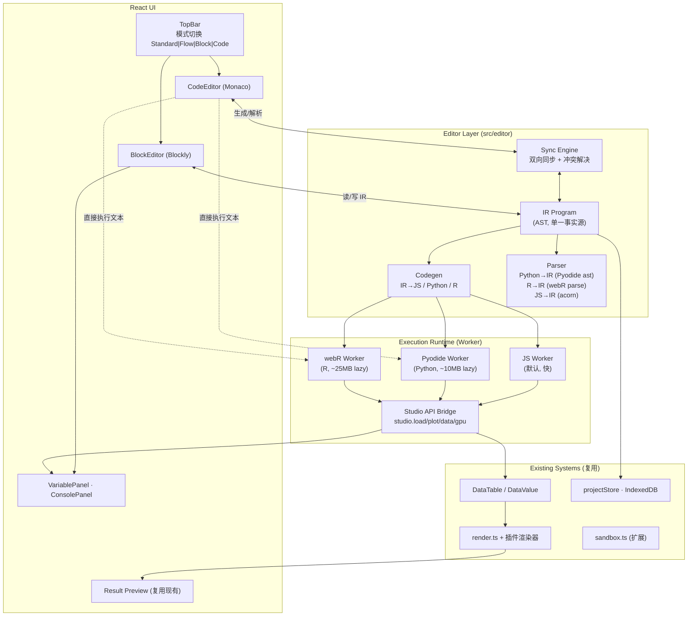

# Block Mode & Code Mode — Design

> 状态：**设计草案（Draft）**。本文是积木模式（Scratch-like）与代码模式
>（Python/R，后期 Go/TS）的完整设计文档，包含前置工作评估、架构、数据
> 模型、与现有系统的集成点、分阶段实施计划与测试策略。
>
> 关键决策（已对齐）：
> - **积木引擎**：Google Blockly（MIT）
> - **模式关系**：双向同步，共享 IR（中间表示）
> - **Phase 1 语言**：Python（Pyodide）+ R（webR）
> - **后期**：Go（tinygo/GopherJS）、TS/JS（原生 Worker）

---

## Table of Contents

- [1. 背景与目标](#1-背景与目标)
- [2. 用户画像与模式定位](#2-用户画像与模式定位)
- [3. 总体架构](#3-总体架构)
- [4. 共享 IR 设计](#4-共享-ir-设计)
- [5. 双向同步策略](#5-双向同步策略)
- [6. 积木模式设计（Blockly）](#6-积木模式设计blockly)
- [7. 代码模式设计（Monaco + Pyodide + webR）](#7-代码模式设计monaco--pyodide--webr)
- [8. 执行运行时与 Studio API 桥](#8-执行运行时与-studio-api-桥)
- [9. 数据模型与持久化](#9-数据模型与持久化)
- [10. 与现有系统的集成点](#10-与现有系统的集成点)
- [11. 前置工作评估](#11-前置工作评估)
- [12. 分阶段实施计划](#12-分阶段实施计划)
- [13. 测试策略](#13-测试策略)
- [14. 风险与开放问题](#14-风险与开放问题)
- [15. 非目标（明确不做）](#15-非目标明确不做)

---

## 1. 背景与目标

Ergalics Studio 现有两种工作模式：

| 模式 | 心智模型 | 受众 |
| ---- | -------- | ---- |
| Standard | 拖一个文件 → 看可视化 | 任意用户 |
| Flow | 组合数据流 DAG → 跑 → 看每节点输出 | 数据工程师 |

二者都假定用户已经"知道自己要做什么"。对于**低龄学习者**（无编程基础）
与**程序员**（习惯写代码）两类用户，缺少一条平滑的入口：

- **小朋友**：Flow 模式的 DAG 太抽象（端口、类型、拓扑序），需要更贴近
  Scratch 的指令式积木（"重复 10 次：画一个点"），并通过积木→代码的
  可见映射完成编程启蒙。
- **程序员**：数据探索时反复拖块效率低，需要直接写
  `df = studio.load('galaxy.dat'); studio.plot('scatter', df)`，并能复用
  numpy/pandas/ggplot2 生态。

### 1.1 设计目标

1. **积木模式**：6 岁以上可上手，指令式控制流（变量、循环、条件、函数），
   块即代码，所见即所得。
2. **代码模式**：完整语言运行时（Python/R），宿主提供 `studio.*` API 直连
   数据/可视化/GPU。
3. **双向同步**：积木 ⇄ 代码（Python/R）通过共享 IR 实时同步，作为
   "积木→代码"的学习桥梁。
4. **零重写接入**：复用现有 `DataTable`/`RenderedView` 数据契约、`render.ts`
   渲染桥、插件渲染器、Worker 沙箱、IndexedDB 持久化。
5. **渐进加载**：Blockly/Monaco/Pyodide/webR 全部按需 lazy import，
   不影响 Standard/Flow 模式的首屏体积。

### 1.2 与 Flow 模式的关系

| 维度 | Flow | Block | Code |
| ---- | ---- | ----- | ---- |
| 范式 | 声明式数据流 DAG | 指令式积木 AST | 自由文本代码 |
| 编辑粒度 | 节点 + 连线 | 积木块 | 字符 |
| 执行模型 | 拓扑序 DAG 执行器 | AST 树遍历解释器 / 代码生成 | 语言原生解释器 |
| 受众 | 数据工程师 | 学习者 | 程序员 |
| 输出 | DataValue | DataValue | DataValue |

三者**共用 `DataValue`（DataTable/Scalar/RenderedView）作为输出契约**，
因此下游可视化完全复用——这是接入成本可控的关键。

---

## 2. 用户画像与模式定位

### 2.1 三类受众与推荐路径

```
   小朋友(6+)           学生(12+)            程序员
       │                   │                  │
       ▼                   ▼                  ▼
   积木模式 ──生成代码预览──▶ 代码模式(Python) ──▶ 代码模式(R/Go/TS)
       │                   │                  │
       └─────── 共享 IR ───┴──────────────────┘
                     │
                     ▼
              DataValue → 现有插件渲染
```

- **小朋友**：只用积木模式。点"查看代码"看到 Python，但不编辑。
- **学生**：积木↔Python 双向切换，逐步从积木过渡到写代码。
- **程序员**：直接代码模式，按需切换语言；积木仅作快速原型。

### 2.2 模式切换

TopBar 模式开关从当前二档（Standard | Flow）升级为四档：

```
[ Standard | Flow | Block | Code ]
```

`appStore.blockMode: boolean` 改为 `mode: WorkbenchMode`（见 §10.1）。

---

## 3. 总体架构



### 3.1 关键不变量

1. **IR 是单一事实源**：积木视图与代码视图都是 IR 的投影。持久化存 IR，
   不存代码文本（代码文本可由 IR 重生成，用户编辑通过 §5 的 RawCode
   机制吸收）。
2. **执行后端可换**：同一份 IR 可经 JS codegen（默认快）或 Python codegen
   （真 Python 语义）执行，结果一致。
3. **输出统一为 DataValue**：积木/代码的产出与 Flow 模式同构，下游渲染
   零改动。

---

## 4. 共享 IR 设计

IR 是 JSON 可序列化的 AST（便于持久化、跨 Worker 传输、版本 diff）。
设计参考 [Microsoft MakeCode](https://makecode.microsoft.com/) 的
blocks↔text 同步模型：**受限 AST + RawCode 降级节点**。

### 4.1 节点类型

| 类别 | 节点 | 示例（积木形态） |
| ---- | ---- | ---------------- |
| 字面量 | `Number` `String` `Boolean` `Null` | `42` `"hi"` `true` |
| 变量 | `VarRef` `VarAssign` | `设 x = 5` |
| 集合 | `List` `ListIndex` `ListSlice` `Dict` | `[1, 2, 3]` |
| 运算 | `BinaryOp` `UnaryOp` | `a + b` `not x` |
| 控制流 | `If` `Repeat` `While` `ForEach` `Break` `Continue` | `重复 10 次: ...` |
| 函数 | `FuncDef` `Return` `Call` | `定义 f(x): 返回 x*2` |
| 数据源 | `LoadCSV` `LoadXYZ` `Random` `Range` | `载入 "galaxy.dat"` |
| 数据变换 | `Filter` `Normalize` `Sort` `Select` `AddColumn` | `标准化 列 "x" (minmax)` |
| 统计 | `Summary` `Histogram` | `统计摘要 列 "y"` |
| 可视化 | `PlotScatter` `PlotHistogram` `PlotPointCloud` | `画散点图(df)` |
| GPU | `GpuRun` | `GPU 运行 kernel(...)` |
| 宿主调用 | `StudioCall` | `studio.notify(...)` |
| **降级** | `RawCode` | `（原始文本，不可解析为 IR 节点）` |

### 4.2 IR 结构（TypeScript 骨架）

```ts
// src/editor/ir/types.ts
export type IRNode =
  | { kind: 'Number'; value: number }
  | { kind: 'String'; value: string }
  | { kind: 'VarRef'; name: string }
  | { kind: 'VarAssign'; name: string; value: IRNode; declare: boolean }
  | { kind: 'BinaryOp'; op: '+' | '-' | '*' | '/' | '==' | '<' | 'and' | ...; left: IRNode; right: IRNode }
  | { kind: 'If'; branches: { cond: IRNode; body: IRNode[] }[]; elseBody?: IRNode[] }
  | { kind: 'ForEach'; varName: string; iterable: IRNode; body: IRNode[] }
  | { kind: 'Repeat'; count: IRNode; body: IRNode[] }
  | { kind: 'FuncDef'; name: string; params: string[]; body: IRNode[] }
  | { kind: 'Call'; callee: string; args: IRNode[] }
  | { kind: 'LoadCSV'; path: string }
  | { kind: 'Normalize'; column: string; mode: 'minmax' | 'zscore' }
  | { kind: 'PlotScatter'; data: IRNode; x: string; y: string; color?: string }
  | { kind: 'RawCode'; lang: 'python' | 'r' | 'js'; text: string }
  | ...;

export interface IRProgram {
  version: 1;
  body: IRNode[];        // 顶层语句
  functions: IRNode[];   // 顶层函数定义
  sourceLang?: 'python' | 'r' | 'js'; // 上次解析来源
  hash: string;          // 内容哈希，用于同步去抖
}
```

### 4.3 设计约束

1. **受限子集**：IR 只覆盖"积木可表达"的语言子集。复杂语法（列表推导、
   装饰器、R 的 `%>%` 管道、元编程）一律落入 `RawCode` 节点。
2. **类型化端口**：IR 节点携带可选类型标注（`type?: 'DataTable' | 'number' | ...`），
   供 codegen 生成更地道的代码（如 R 用 `<-` 而非 `=`）。
3. **不可变 + 哈希**：每次修改生成新 IR 对象 + SHA-1 哈希，同步引擎据此
   判断"哪边变了"。

---

## 5. 双向同步策略

### 5.1 同步模型

```
  Block 视图                IR（事实源）              Code 视图
     │                         │                         │
     │  编辑积木                 │                         │
     ├────────────────────────▶│                         │
     │                         │  codegen → 文本           │
     │                         ├────────────────────────▶│ （替换编辑器内容，保留光标）
     │                         │                         │
     │                         │  ◀───────────────────────┤  编辑代码
     │                         │  parse → IR (尝试)         │
     │  ◀──────────────────────┤                         │
     │  重生成积木（仅 RawCode 区变化则局部）                │
```

### 5.2 同步状态机

| 触发 | 动作 | 失败处理 |
| ---- | ---- | -------- |
| 积木编辑 | IR 更新 → codegen 当前语言 → 替换 CodeEditor 文本（保留光标位置） | 不会失败（codegen 是纯函数） |
| 代码编辑 | 防抖 300ms → parse → IR 更新 → 重生成积木 | parse 成功部分应用，失败部分入 `RawCode`；完全失败则回滚 + 错误条 |
| 切换语言 | IR → 新语言 codegen → 替换文本 | 同上 |
| 加载项目 | 反序列化 IR → 双视图各自渲染 | — |

### 5.3 冲突解决：RawCode 降级

**核心机制**：当代码文本包含 IR 无法表达的构造时，解析器将连续的
"不可表达片段"打包为一个 `RawCode` 节点，原样保留文本。

```python
# 用户在 Python 编辑器写了：
df = studio.load('galaxy.dat')
# 下面这行 IR 不支持（列表推导）：
squares = [x**2 for x in df['x']]
studio.plot('scatter', df)
```

解析后 IR：
```
VarAssign(df, Call(studio.load, ['galaxy.dat']))
RawCode(lang='python', text='squares = [x**2 for x in df[\'x\']]')
Call(studio.plot, ['scatter', VarRef(df)])
```

积木视图渲染：`df = studio.load(...)` 块 → **一个橙色的"原始代码"块**
（显示文本，不可拆分）→ `studio.plot(...)` 块。

**降级保证**：
1. 永不丢失用户代码（RawCode 文本逐字保留）。
2. 永不静默修改语义（codegen 对 RawCode 原样输出）。
3. 用户可选择"展开为积木"（尝试拆分 RawCode）或"保留为原始代码"。

### 5.4 同步去抖与防抖

- 代码→IR：300ms 防抖 + 仅在 `hash` 变化时触发。
- IR→代码：立即触发，但用 Monaco 的 `editor.executeEdits` 做**最小化
  diff 替换**（保留 undo 栈与光标）。
- 双向并发：用单一 `syncLock` 互斥，避免 A→B→A 循环。

### 5.5 不变量

- **block→code→block** 永远保真（codegen + parse 都是 IR 同构）。
- **code→block→code** 在"可表达子集"内保真；含 RawCode 时文本逐字保留。

---

## 6. 积木模式设计（Blockly）

### 6.1 引擎选择

**Google Blockly**（MIT，npm: `blockly`）：
- 工业标准，App Inventor / Blockly Games / MakeCode 在用。
- 内置代码生成器：JS / Python / PHP / Lua / Dart（**R 需自研**，见 §6.5）。
- 工具箱（toolbox）、自定义块、主题、无障碍（ARIA）、缩放、剪贴板。
- 与 React 集成：轻量自研封装（不引入 `react-blockly`，避免版本耦合）。

### 6.2 工具箱分类

| 分类 | 块（对齐 IR 节点） |
| ---- | ----------------- |
| 数据 | 载入 CSV / 载入 XYZ / 随机数 / 等差数列 |
| 变量 | 创建变量 / 赋值 / 取值 |
| 列表 | 创建列表 / 取第 i 项 / 长度 / 追加 |
| 运算 | 算术 / 比较 / 逻辑 / 字符串拼接 |
| 控制 | 如果/否则 / 重复 n 次 / 当…循环 / 对每个 / 跳出 / 继续 |
| 函数 | 定义函数 / 返回 / 调用 |
| 变换 | 选列 / 重命名 / 加列 / 标准化 / 排序 / 过滤 |
| 统计 | 摘要 / 直方图 |
| 可视化 | 散点图 / 折线图 / 直方图 / 点云 |
| 进阶 | GPU 运行 / 原始代码块 |

### 6.3 自定义块规范

每个数据/可视化块映射到 IR 节点，并声明：
- 输入槽（值输入、语句输入、下拉框）
- 输出类型（`DataTable` / `number` / `void`）
- 代码生成器（Python / R / JS 三套）
- 工具提示 i18n key

```ts
// src/editor/blocks/blocks/plot_scatter.ts
export const plotScatterBlock: BlockDef = {
  type: 'studio_plot_scatter',
  message0: '画散点图 %1 X: %2 Y: %3 颜色: %4',
  args0: [
    { type: 'input_value', name: 'DATA', check: 'DataTable' },
    { type: 'field_input', name: 'X', text: 'x' },
    { type: 'field_input', name: 'Y', text: 'y' },
    { type: 'field_input', name: 'COLOR', text: '' },
  ],
  output: null,
  colour: '#8b5cf6',
  tooltip: i18nKey('block.plot_scatter.tooltip'),
  generators: {
    python: (b) => `studio.plot('scatter', ${b.value('DATA')}, x='${b.field('X')}', y='${b.field('Y')}')`,
    r:      (b) => `studio.plot("scatter", ${b.value('DATA')}, x="${b.field('X')}", y="${b.field('Y')}")`,
    js:     (b) => `studio.plot('scatter', ${b.value('DATA')}, { x: '${b.field('X')}', y: '${b.field('Y')}' })`,
  },
  toIR: (b) => ({ kind: 'PlotScatter', data: b.ir('DATA'), x: b.field('X'), y: b.field('Y'), color: b.field('COLOR') || undefined }),
};
```

### 6.4 积木 ↔ IR 双向

- **积木 → IR**：遍历 Blockly workspace 的顶块，递归 `toIR()` 生成 IR。 
  Blockly 的事件 `workspace.addChangeListener` 触发同步。
- **IR → 积木**：遍历 IR，按 `kind` 查找块工厂，构造 Blockly XML/JSON，
  加载到 workspace。`RawCode` 节点 → 单个"原始代码"块。

### 6.5 R 代码生成器

Blockly 不内置 R 生成器。自研 `src/editor/codegen/r.ts`：
- 复用 Python 生成器的 AST→文本骨架。
- 替换语法差异：`=` → `<-`，`True/False` → `TRUE/FALSE`，`None` → `NULL`，
  `len(x)` → `length(x)`，`[i]` → `[[i]]`（R 1-based 索引）。
- 数据变换块映射到 R 习惯用法（`df[order(df$x),]` 而非 `sort`）。

### 6.6 儿童友好设计

- **大字号、高对比度块**：独立 Blockly 主题 `studio-kids`。
- **类别颜色**：数据=蓝、控制=黄、运算=绿、可视化=紫（对齐 Scratch 习惯）。
- **语音朗读**：Blockly ARIA + 宿主 `api.notify` 朗读块文本（i18n）。
- **防错**：未连接的输入槽显示"?"占位，运行前校验并高亮。
- **示例项目**：`examples/projects/block-*.clproj` 增加儿童向样本
  （"画 100 个随机点"、"模拟抛硬币 1000 次"）。

---

## 7. 代码模式设计（Monaco + Pyodide + webR）

### 7.1 编辑器：Monaco

`monaco-editor` + `@monaco-editor/react`：
- 内置 Python/R 语法高亮、IntelliSense（Python via Pyodide 的 Jedi/Pyright
  LSP 可选，Phase 2）。
- 主题与宿主 CSS 变量同步（dark/light）。
- Vim/Emacs 键绑定（可选，Phase 2）。

### 7.2 Python 运行时：Pyodide

- **加载**：CDN `pyodide` full build，core ~6MB，含 numpy 后 ~10MB。
  通过 IndexedDB 缓存（复用现有 `storage.ts`，新增 `wasm-cache` object store）。
- **包**：默认仅核心；用户 `import numpy` 时按需 `pyodide.loadPackagesFromImports()`。
- **DataFrame 桥**：提供 `studio.to_dataframe(table) -> pandas.DataFrame` 与
  `studio.from_dataframe(df) -> DataTable` 适配器（零拷贝通过 typed array）。
- **执行**：在专用 Pyodide Worker 内 `pyodide.runPythonAsync(code)`，
  stdout/stderr 重定向到 ConsolePanel。

### 7.3 R 运行时：webR

- **加载**：webR ~25MB（R 4.x + WASM），lazy import，首次切换到 R 时下载。
- **包**：base + 默认 datasets；`ggplot2` 按需 `webr::install('ggplot2')`。
- **data.frame 桥**：`studio.to_dataframe() -> data.frame`，
  R 的 `data.frame` 列即 typed array。
- **执行**：webR 的 `webR.evalRString(code)` 或 `evalR(parse(text=code))`，
  输出捕获到 ConsolePanel。

### 7.4 语言切换

CodeEditor 顶部语言选择器：
```
[ Python ▾ ]   ▶ Run   ⏹ Stop   🔄 同步到积木
```
切换语言时：当前代码 parse → IR → 新语言 codegen → 替换文本。若当前代码
含 RawCode（仅 Python 可解析），切到 R 时 RawCode 标记为"需手动改写"。

### 7.5 直接执行 vs IR 执行

Code 模式有两种执行路径：
1. **IR 执行**（默认）：代码 → parse → IR → JS codegen → JS Worker 执行。
   快，无语言运行时加载。
2. **原生执行**（显式 `▶ Run as Python`）：代码直接送 Pyodide。真 Python
   语义，可用 numpy。

积木模式只走路径 1（IR → JS codegen）。

---

## 8. 执行运行时与 Studio API 桥

### 8.1 三种 Worker

| Worker | 用途 | 体积 | 加载时机 |
| ------ | ---- | ---- | -------- |
| `editor-js.worker` | IR→JS 执行（积木默认 + 代码 IR 执行） | ~50KB | 首次进 Block/Code 模式 |
| `editor-pyodide.worker` | Python 原生执行 | ~10MB | 首次 `▶ Run as Python` |
| `editor-webr.worker` | R 原生执行 | ~25MB | 首次切换到 R |

全部基于现有 [sandbox.ts](file:///c:/Users/HUAWEI/Desktop/project/src/core/sandbox.ts)
的 RPC 模式扩展，复用 `encodeArgs/decodeArgs` 的函数 token 机制。

### 8.2 Studio API（注入到每个运行时）

每个 Worker 启动时注入全局 `studio` 对象，与现有 [PluginApi](file:///c:/Users/HUAWEI/Desktop/project/src/types/plugin.ts)
对齐但面向代码使用：

```ts
// src/editor/runtime/studio-api.ts
interface StudioApi {
  // 数据
  load(path: string): Promise<DataTable>;
  loadCSV(text: string): DataTable;
  loadXYZ(text: string): DataTable;
  random(n: number, seed?: number): DataTable;
  // 变换（镜像 src/blocks/ops.ts）
  filter(df: DataTable, pred: (row: Row) => boolean): DataTable;
  normalize(values: number[], mode?: 'minmax' | 'zscore'): number[];
  sort(df: DataTable, column: string, direction?: 'asc' | 'desc'): DataTable;
  select(df: DataTable, columns: string[]): DataTable;
  addColumn(df: DataTable, name: string, values: number[]): DataTable;
  // 统计
  summary(values: number[]): ColumnSummary;
  histogram(values: number[], bins: number): Histogram;
  // 可视化（产出 RenderedView → 复用 render.ts）
  plot(type: 'scatter' | 'histogram' | 'pointcloud' | ..., data: DataTable, opts?: PlotOpts): void;
  // GPU（透传 api.gpu）
  gpu?: GpuComputeApi;
  // 宿主交互
  notify(kind: 'info' | 'success' | 'warning' | 'error', msg: string): void;
  print(...args: unknown[]): void;  // → ConsolePanel
  // 持久化（项目作用域）
  getParam(key: string): unknown;
  setParam(key: string, value: unknown): void;
}
```

Python 侧通过 Pyodide 的 `globals.set('studio', apiProxy)` 暴露；R 侧通过
`webr.globalEnv['studio']`。所有 `studio.plot` 调用经 RPC 回到宿主，
复用 [render.ts](file:///c:/Users/HUAWEI/Desktop/project/src/blocks/render.ts)
的 `RenderedView → plugin.loadData` 桥。

### 8.3 跨边界数据交换

DataTable 的列是 typed array（Float64Array 等），其 `buffer` 是
`ArrayBuffer`——**Transferable**。Worker 与宿主之间通过 `postMessage` 的
transfer 列表零拷贝传递。Python 侧：Pyodide 的
`pyodide.toPy(typedArray)` 直接映射为 numpy 数组（零拷贝）。

### 8.4 执行生命周期

```
用户点 ▶ Run
  ↓
editorStore.runStart()
  ↓
IR → codegen (JS) → editor-js.worker
  ↓ (或) code 直接 → editor-pyodide.worker
  ↓
Worker: 执行语句，studio.* 调用经 RPC 回宿主
  ↓
宿主: render.ts 渲染 RenderedView 到画布；DataTable 更新到 VariablePanel
  ↓
Worker: 完成 → 返回 { ok, outputs, consoleLogs, gpuMs }
  ↓
editorStore.runComplete()
```

### 8.5 中断

`⏹ Stop` 经 `worker.terminate()` 强制中断（与 Flow 的 `runSeq` token
不同：代码执行可能阻塞在 numpy/R 内核，无法协作式中断）。
重新运行时重建 Worker（Pyodide/webR 重建成本高，故保留 Worker 实例，
仅中断当前 eval——Pyodide 用 `setInterruptBuffer`，webR 用 `R_interrupts`）。

---

## 9. 数据模型与持久化

### 9.1 新增类型

```ts
// src/types/editor.ts
export type WorkbenchMode = 'standard' | 'flow' | 'block' | 'code';
export type CodeLanguage = 'python' | 'r' | 'js';  // 后期 + go, ts

export interface EditorSession {
  id: string;
  mode: 'block' | 'code';
  language: CodeLanguage;
  /** 单一事实源：IR 程序。代码文本可由 IR 重生成。 */
  ir: IRProgram;
  /** 上次同步的代码文本（用于恢复光标/diff）。 */
  lastCode: string;
  /** 同步状态。 */
  syncState: 'clean' | 'block-dirty' | 'code-dirty' | 'conflict';
  createdAt: number;
  updatedAt: number;
}

export interface EditorRunResult {
  ok: boolean;
  outputs: Record<string, DataValue>;  // 变量名 → 值
  console: ConsoleEntry[];
  error?: { line?: number; message: string };
  gpuMs?: number;
  durationMs: number;
}

export interface ConsoleEntry {
  stream: 'stdout' | 'stderr' | 'info';
  text: string;
  timestamp: number;
}
```

### 9.2 持久化扩展

[ProjectState](file:///c:/Users/HUAWEI/Desktop/project/src/types/project.ts)
新增字段：

```ts
export interface ProjectState {
  // ...existing...
  activePlugin: string | null;
  parameters: Record<string, Record<string, unknown>>;
  camera: CameraState | null;
  scene: SceneState | null;
  blockGraph?: BlockGraphState | null;
  /** 新增：编辑器会话（积木/代码模式）。 */
  editorSessions?: EditorSession[];
  /** 新增：当前激活的会话 id。 */
  activeEditorSession?: string | null;
  /** 新增：上次使用的模式。 */
  workbenchMode?: WorkbenchMode;
}
```

序列化复用 `.clproj` 路径（`serializeProject`），IR 是纯 JSON，无需特殊处理。
分享链接（lz-string 压缩）天然支持。

### 9.3 变量作用域

执行期变量环境（VariablePanel 可见）：
- `editorStore.variables: Record<string, DataValue>` — 顶层变量快照。
- 每次运行清空重建（纯函数语义，与 Flow executor 一致）。
- 函数局部变量不暴露到面板。

---

## 10. 与现有系统的集成点

### 10.1 状态层改造

**`appStore`**：`blockMode: boolean` → `mode: WorkbenchMode`。

```ts
// before
blockMode: boolean;
toggleBlockMode: () => void;
// after
mode: WorkbenchMode;
setMode: (m: WorkbenchMode) => void;
```

兼容：迁移函数 `blockMode = (mode === 'flow')`，TopBar 临时映射，随后清理。

### 10.2 TopBar 模式开关

[TopBar.tsx](file:///c:/Users/HUAWEI/Desktop/project/src/pages/workbench/TopBar.tsx)
当前是二档 cluster，改为四档：

```tsx
<div className="topbar-cluster mode-switch">
  {(['standard','flow','block','code'] as const).map((m) => (
    <button key={m}
      className={`cluster-btn${mode === m ? ' btn-toggle-on' : ''}`}
      onClick={() => setMode(m)}>
      {t(`workbench.mode.${m}`)}
    </button>
  ))}
</div>
```

### 10.3 WorkbenchPage 路由

[WorkbenchPage.tsx](file:///c:/Users/HUAWEI/Desktop/project/src/pages/workbench/WorkbenchPage.tsx)
按 `mode` 渲染：

```tsx
{mode === 'flow' ? <BlockWorkbench />      // 现有 Flow
 : mode === 'block' ? <BlockEditor />       // 新：积木
 : mode === 'code' ? <CodeEditor />         // 新：代码
 : <>                                        // standard
     {sidebarOpen && <Sidebar />}
     <CentralArea />
     <RightPanel />
   </>}
```

### 10.4 复用 render.ts

[render.ts](file:///c:/Users/HUAWEI/Desktop/project/src/blocks/render.ts)
的 `RenderedView → plugin.loadData` 桥**零改动**直接用于积木/代码模式的
`studio.plot(...)` 调用。Studio API 的 `plot` 方法构造 `RenderedView` 并
交给宿主，宿主调用 `renderView()`。

### 10.5 复用 ops.ts

[ops.ts](file:///c:/Users/HUAWEI/Desktop/project/src/blocks/ops.ts)
的 `normalize`/`histogram`/`summarize`/`filterRows` 等纯函数直接作为
Studio API 的实现后端（积木 IR→JS codegen 调用同名函数）。代码模式
原生执行（Pyodide）则用 numpy/pandas 实现等价逻辑，数值结果对齐。

### 10.6 复用 sandbox.ts

[sandbox.ts](file:///c:/Users/HUAWEI/Desktop/project/src/core/sandbox.ts)
的 RPC 模式（`encodeArgs`/`decodeArgs`/函数 token/Worker 生命周期）扩展为
`code-sandbox.ts`，新增：
- 代码执行 RPC（`run`/`interrupt`/`eval`）。
- stdout/stderr 流式回传（新增 `event: 'stdout'`/`event: 'stderr'`）。
- Studio API 调用回传（复用 `event: 'api'`）。

### 10.7 复用 storage.ts

IndexedDB 新增 object store `wasm-cache`（缓存 Pyodide/webR 的
`.wasm`/`.js`，用 Cache API 更合适——二者择一）。`editorSessions` 随
`ProjectState` 走现有 `projects` store。

### 10.8 i18n

[src/i18n/](file:///c:/Users/HUAWEI/Desktop/project/src/i18n)
新增键前缀：
- `workbench.mode.block` / `workbench.mode.code`
- `editor.*`（运行、停止、语言、同步状态、控制台）
- `block.*`（每个积木块的名称与提示，en + zh）

### 10.9 主题

[theme/](file:///c:/Users/HUAWEI/Desktop/project/src/theme)
新增 Monaco 主题映射（dark/light）与 Blockly 主题 `studio-kids`。

### 10.10 性能监控

[perf.ts](file:///c:/Users/HUAWEI/Desktop/project/src/core/perf.ts)
新增：代码执行时长、Pyodide/webR 加载时长、内存占用（运行时上报）。

---

## 11. 前置工作评估

按"必须先做"→"可并行"→"可延后"分级。

### 11.1 依赖与基础设施（必须先做）

| 项 | 包 | 体积 | 用途 | 备注 |
| -- | -- | ---- | ---- | ---- |
| Blockly | `blockly` | ~1.5MB | 积木引擎 | MIT，npm |
| Monaco | `monaco-editor` + `@monaco-editor/react` | ~5MB | 代码编辑器 | MIT，需 Vite worker 配置 |
| Pyodide | CDN / 自托管 | ~10MB | Python 运行时 | lazy，IndexedDB 缓存 |
| webR | CDN / 自托管 | ~25MB | R 运行时 | lazy，Phase 2 |
| acorn | `acorn` | ~100KB | JS→IR 解析（代码模式 JS 子集） | 备选：用 `meriyah` |
| **Pyodide ast** | 内置 | — | Python→IR 解析 | Pyodide 自带 `ast` 模块 |
| **webR parse** | 内置 | — | R→IR 解析 | webR 自带 `parse()` |

**Vite 配置改造**：[vite.config.ts](file:///c:/Users/HUAWEI/Desktop/project/vite.config.ts)
新增 Monaco 的 `worker` 配置（`new Worker(new URL(...))` 模式），与现有
`worker: { format: 'es' }` 协同。

### 11.2 架构决策（已定）

1. IR 为单一事实源，三视图（block/py/R）投影。
2. RawCode 降级节点处理不可表达代码（MakeCode 模式）。
3. 执行后端三选一：JS Worker（默认）/ Pyodide / webR。
4. Studio API 桥统一注入。
5. DataTable 跨边界零拷贝（transferable）。
6. 复用 render.ts + 插件渲染器，不重造可视化。

### 11.3 现有代码改造清单

| 文件 | 改造 | 工作量 |
| ---- | ---- | ------ |
| [appStore.ts](file:///c:/Users/HUAWEI/Desktop/project/src/stores/appStore.ts) | `blockMode` → `mode: WorkbenchMode` + 迁移 | 小 |
| [TopBar.tsx](file:///c:/Users/HUAWEI/Desktop/project/src/pages/workbench/TopBar.tsx) | 二档→四档模式开关 | 小 |
| [WorkbenchPage.tsx](file:///c:/Users/HUAWEI/Desktop/project/src/pages/workbench/WorkbenchPage.tsx) | 按 mode 路由编辑器 | 小 |
| [project.ts](file:///c:/Users/HUAWEI/Desktop/project/src/types/project.ts) | `ProjectState` 加 `editorSessions` 等 | 小 |
| [projectStore.ts](file:///c:/Users/HUAWEI/Desktop/project/src/stores/projectStore.ts) | 持久化 editorSessions、`applyEditor()` | 中 |
| [settingsStore.ts](file:///c:/Users/HUAWEI/Desktop/project/src/stores/settingsStore.ts) | 代码模式偏好（默认语言、字体、自动运行） | 小 |
| [sandbox.ts](file:///c:/Users/HUAWEI/Desktop/project/src/core/sandbox.ts) | 提取 RPC 基类供 code-sandbox 复用 | 中 |
| [storage.ts](file:///c:/Users/HUAWEI/Desktop/project/src/core/storage.ts) | `wasm-cache` store 或 Cache API | 小 |
| [i18n/en-US.ts](file:///c:/Users/HUAWEI/Desktop/project/src/i18n/en-US.ts) + [zh-CN.ts](file:///c:/Users/HUAWEI/Desktop/project/src/i18n/zh-CN.ts) | 新增 editor/block 键 | 中 |
| [theme/](file:///c:/Users/HUAWEI/Desktop/project/src/theme) | Monaco/Blockly 主题 | 中 |
| [vite.config.ts](file:///c:/Users/HUAWEI/Desktop/project/vite.config.ts) | Monaco worker + manualChunks | 小 |

### 11.4 新建模块清单

```
src/
├── editor/                          # 新顶层目录
│   ├── ir/
│   │   ├── types.ts                 # IR 节点定义
│   │   ├── hash.ts                  # 内容哈希
│   │   ├── validate.ts              # IR 校验
│   │   ├── diff.ts                  # IR diff（同步用）
│   │   └── serialize.ts             # JSON 序列化
│   ├── block/
│   │   ├── engine.ts                # Blockly workspace 管理
│   │   ├── toolbox.ts               # 工具箱配置
│   │   ├── theme.ts                 # studio-kids 主题
│   │   ├── blocks/                  # 自定义块定义
│   │   │   ├── data.ts
│   │   │   ├── control.ts
│   │   │   ├── transform.ts
│   │   │   ├── stats.ts
│   │   │   ├── viz.ts
│   │   │   └── raw.ts               # RawCode 块
│   │   ├── to_ir.ts                 # Blockly workspace → IR
│   │   └── from_ir.ts               # IR → Blockly workspace
│   ├── code/
│   │   ├── editor.ts                # Monaco 封装
│   │   ├── languages.ts             # 语言服务注册
│   │   └── theme.ts                 # Monaco 主题
│   ├── codegen/
│   │   ├── js.ts                    # IR → JS
│   │   ├── python.ts                # IR → Python
│   │   └── r.ts                     # IR → R（自研）
│   ├── parser/
│   │   ├── python.ts                # Python → IR（Pyodide ast）
│   │   ├── r.ts                     # R → IR（webR parse）
│   │   └── js.ts                    # JS → IR（acorn）
│   ├── runtime/
│   │   ├── js.worker.ts             # IR→JS 执行 Worker
│   │   ├── pyodide.worker.ts        # Pyodide Worker
│   │   ├── webr.worker.ts           # webR Worker
│   │   ├── studio-api.ts            # StudioApi 实现
│   │   └── data-bridge.ts           # DataTable ↔ pandas/data.frame
│   └── sync/
│       ├── engine.ts                # 双向同步状态机
│       ├── rawcode.ts               # RawCode 降级/升级
│       └── debounce.ts              # 防抖 + 锁
├── components/
│   └── editor/
│       ├── BlockEditor.tsx
│       ├── CodeEditor.tsx
│       ├── EditorToolbar.tsx
│       ├── VariablePanel.tsx
│       ├── ConsolePanel.tsx
│       └── RawCodeBlock.tsx
├── stores/
│   └── editorStore.ts               # 会话/运行/变量状态
└── types/
    └── editor.ts                    # WorkbenchMode/EditorSession/...
```

### 11.5 文档与测试基建

- 本设计文档（本文）。
- E2E 套件新增：`verify-block-mode.mjs`、`verify-code-mode.mjs`、
  `verify-sync.mjs`（积木↔代码往返）。
- 单测套件：`ir-roundtrip.test.ts`、`codegen.test.ts`、`parser.test.ts`、
  `sync.test.ts`、`studio-api.test.ts`。

---

## 12. 分阶段实施计划

### Phase 0 — 地基（1-2 周）

- IR 类型骨架（`src/editor/ir/`）+ 校验 + 序列化。
- StudioApi 接口定义 + JS 桩实现。
- `WorkbenchMode` 类型 + appStore 改造 + TopBar 四档（后两档 disabled）。
- 持久化字段扩展（`editorSessions`）。
- **可验证**：四档开关可见，后两档置灰；IR 类型单测通过。

### Phase 1 — 积木模式 MVP（3-4 周）

- Blockly 集成（`src/editor/block/`）。
- 20+ 核心块（数据/变量/运算/控制/函数/变换/统计/可视化）。
- Blockly → IR + IR → Blockly 双向。
- IR → JS codegen + JS Worker 执行。
- StudioApi JS 实现（复用 `ops.ts`）+ `render.ts` 桥接。
- BlockEditor UI + VariablePanel + ConsolePanel。
- 儿童主题 `studio-kids`。
- **可验证**：搭积木跑通"载入 galaxy.dat → 标准化 → 画散点图"。
- E2E：`verify-block-mode.mjs`。

### Phase 2 — Python 代码模式 + 双向同步（4-5 周）

- Monaco 集成 + Python 语法高亮。
- Pyodide Worker + StudioApi Python 桥（含 pandas DataFrame 适配）。
- Python → IR 解析器（Pyodide `ast`）。
- IR → Python codegen。
- 双向同步引擎 + RawCode 降级。
- "Run as Python" 原生执行路径。
- **可验证**：积木搭的管线 ↔ Python 代码双向同步；含 RawCode 的代码
  往返保真；numpy 版与 IR 版数值对齐（误差 < 1e-9）。
- E2E：`verify-code-mode.mjs` + `verify-sync.mjs`。

### Phase 3 — R 代码模式（3-4 周）

- webR Worker + StudioApi R 桥（含 data.frame 适配）。
- R → IR 解析器（webR `parse`）。
- IR → R codegen（自研）。
- R 主题/语法习惯（`<-`、1-based 索引、`ggplot2` 适配）。
- **可验证**：R 代码与 Python 代码同语义结果一致。

### Phase 4 — 扩展（按需）

- TS/JS 代码模式（原生 Worker，零运行时）。
- Go 代码模式（tinygo + WASM 或 GopherJS）。
- IntelliSense（Python LSP via Pyright、R via languageserver）。
- 调试器（断点、单步——需 IR 解释器支持）。
- 积木市场（用户自定义块，`.cspkg` 扩展）。

---

## 13. 测试策略

### 13.1 单元测试（Vitest）

| 套件 | 覆盖 |
| ---- | ---- |
| `ir-roundtrip` | block→IR→block、code→IR→code 往返保真 |
| `codegen` | IR→JS/Python/R 生成器快照 |
| `parser` | Python/R/JS→IR，含 RawCode 降级场景 |
| `sync` | 同步状态机、冲突解决、防抖 |
| `studio-api` | 数据/变换/统计 API 数值正确性（与 `ops.ts` 对齐） |
| `data-bridge` | DataTable↔pandas/data.frame 零拷贝 |
| `runtime-js` | IR 解释器执行语义 |

### 13.2 集成测试

- 完整管线：积木 → IR → JS 执行 → 渲染。
- 完整管线：Python 代码 → Pyodide 执行 → 渲染。
- 双向：积木改 → 代码更新 → 代码改 → 积木更新（含 RawCode）。

### 13.3 E2E（Playwright）

| 套件 | 覆盖 |
| ---- | ---- |
| `verify-block-mode` | 积木搭管线 + 运行 + 渲染正确 |
| `verify-code-mode` | Python 代码运行 + numpy + 渲染 |
| `verify-sync` | 积木↔Python 双向同步 + RawCode |
| `verify-r-mode` | R 代码运行（Phase 3） |
| `verify-webgpu-code` | 代码调用 `studio.gpu` 真实 WebGPU |

### 13.4 数值对齐

复用现有 [wgsl.ts](file:///c:/Users/HUAWEI/Desktop/project/src/core/wgsl.ts)
的 `advanceNBodyCPU` 作为参考实现，Python（numpy）/R 版本结果与之对齐
（误差 < 1e-9），确保跨语言语义一致。

### 13.5 沙箱逃逸测试

复用 [sandbox.test.ts](file:///c:/Users/HUAWEI/Desktop/project/tests/sandbox.test.ts)
模式，新增代码执行 Worker 的逃逸测试（`import os`、`fetch`、DOM 访问等
均应被拦截或降级）。

---

## 14. 风险与开放问题

### 14.1 风险

| 风险 | 影响 | 缓解 |
| ---- | ---- | ---- |
| Pyodide/webR 体积大 | 首次加载慢 | lazy + IndexedDB 缓存 + 进度条 + 明确提示 |
| 双向同步解析失败率高 | 用户体验差 | RawCode 降级 + 明确冲突提示 + "保留原始代码"选项 |
| R 代码生成器自研成本 | Phase 3 延期 | 复用 Python 生成器骨架；先支持子集，逐步扩展 |
| Blockly 与 React 协同（HMR/StrictMode） | 开发体验 | 参考现有 blockStore 的幂等注册模式 |
| Monaco worker 与 Vite 构建 | 构建失败 | 用 `?worker` 后缀显式导入 |
| 跨语言数值不一致 | 结果不可复现 | 数值对齐测试 + 文档约定（如 R 1-based 索引的映射） |
| 沙箱逃逸（Pyodide `import os`） | 安全 | Worker 隔离 + 明确"非安全边界"声明（同现有 sandbox） |

### 14.2 开放问题

1. **IR 的类型系统深度**：是否引入完整类型推断（如 `df['x']` 是
   `Float64Array`）？还是仅标注端口类型？建议 Phase 1 仅端口类型，
   Phase 2 按需深化。
2. **调试器范围**：Phase 4 的断点/单步是否值得？需 IR 解释器改造，
   成本高。建议先做"语句高亮 + 变量快照"，不做完整断点。
3. **多文件代码**：Phase 1 单文件；多文件（`import` 本地模块）是否
   Phase 2？Pyodide 支持 `micropip`，webR 支持 `source()`，但 UI 复杂度上升。
4. **R 的 `ggplot2` 集成**：`studio.plot` 是否直接映射到 ggplot？
   还是 ggplot 独立渲染？建议：`studio.plot` 走宿主渲染器（复用现有），
   ggplot 独立输出图片到 ConsolePanel。
5. **积木市场的自定义块**：第三方 `.cspkg` 是否可声明积木块？
   建议延后，先固化内置块。

---

## 15. 非目标（明确不做）

1. **不做完整 IDE**：不实现项目管理、Git、多标签页等 IDE 特性——
   Ergalics 是科学计算工作站，不是 VSCode。
2. **不做双向同步的"完美保真"**：任意代码无法 100% 往返为积木，
   RawCode 是设计的一部分，不是缺陷。
3. **不做实时协作**：多用户同时编辑积木/代码不在本期范围（
   见 `docs/guide/roadmap.md` Phase 3 的协作特性）。
4. **不做服务器端执行**：所有运行时在浏览器内，无后端。
5. **不替换 Flow 模式**：Flow（DAG）与 Block（指令式）是不同范式，
   并存而非替换。Flow 适合数据工程师的可视化管线，Block 适合学习者
   的指令式编程。
6. **不支持任意 Python/R 包**：仅支持 Pyodide/webR 可加载的包，
   无原生 C 扩展（除非已编译为 WASM）。

---

## 附录 A：与现有模块的复用映射

| 现有模块 | 新模式复用方式 |
| -------- | -------------- |
| [types/datatable.ts](file:///c:/Users/HUAWEI/Desktop/project/src/types/datatable.ts) | 直接用，跨边界零拷贝 |
| [blocks/ops.ts](file:///c:/Users/HUAWEI/Desktop/project/src/blocks/ops.ts) | StudioApi JS 实现后端 |
| [blocks/render.ts](file:///c:/Users/HUAWEI/Desktop/project/src/blocks/render.ts) | `studio.plot` → RenderedView → 插件 |
| [core/sandbox.ts](file:///c:/Users/HUAWEI/Desktop/project/src/core/sandbox.ts) | RPC 模式扩展为 code-sandbox |
| [core/storage.ts](file:///c:/Users/HUAWEI/Desktop/project/src/core/storage.ts) | + wasm-cache store |
| [core/compute.ts](file:///c:/Users/HUAWEI/Desktop/project/src/core/compute.ts) | `studio.gpu` 透传 |
| [core/wgsl.ts](file:///c:/Users/HUAWEI/Desktop/project/src/core/wgsl.ts) | 数值对齐参考实现 |
| [stores/projectStore.ts](file:///c:/Users/HUAWEI/Desktop/project/src/stores/projectStore.ts) | + editorSessions 持久化 |
| [i18n/](file:///c:/Users/HUAWEI/Desktop/project/src/i18n) | + editor/block 键 |
| [theme/](file:///c:/Users/HUAWEI/Desktop/project/src/theme) | + Monaco/Blockly 主题 |

## 附录 B：术语表

- **IR**（Intermediate Representation）：中间表示，积木与代码共享的 AST。
- **RawCode**：IR 中保留原始代码文本的降级节点。
- **Studio API**：注入到运行时的 `studio.*` 全局对象。
- **双向同步**：积木视图与代码视图通过 IR 实时保持一致。
- **降级**：代码无法解析为 IR 节点时，打包为 RawCode 节点。
