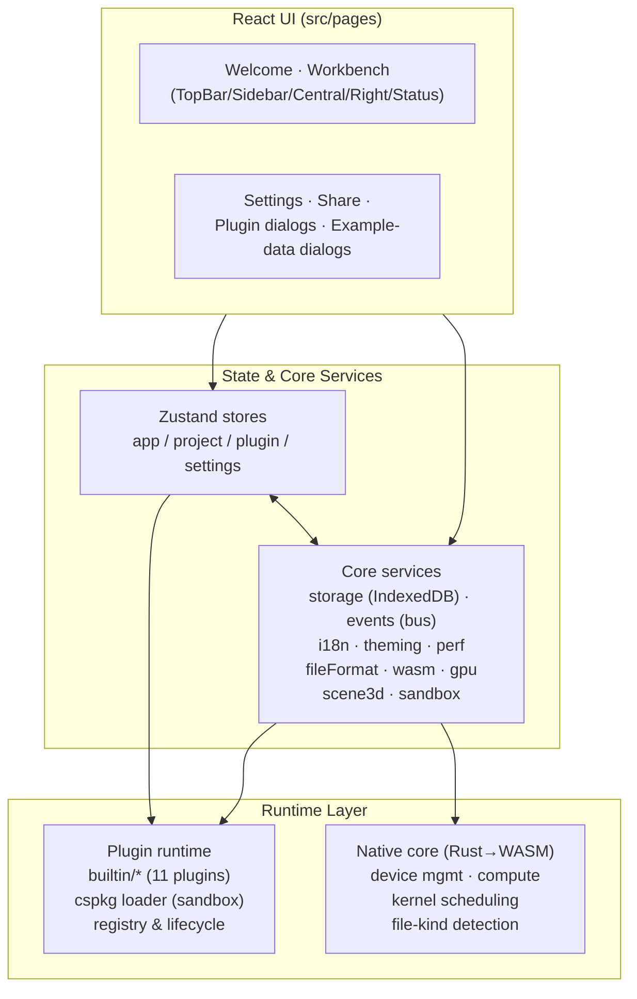

# Architecture

## Layers

## State management

Four Zustand stores hold all application state:

| Store          | Responsibility                                                        |
| -------------- | --------------------------------------------------------------------- |
| `appStore`     | host status, banners, notifications, perf metrics, panel toggles      |
| `projectStore` | current project, recent list, save/autosave, share, param persistence |
| `pluginStore`  | registry, load/activate lifecycle, file dispatch, host containers     |
| `settingsStore`| GPU mode, autosave interval, and other preferences                    |

Cross-cutting UI communication uses a small typed event bus
(`src/core/events.ts`) — e.g. `plugin:<id>:params`, `host:params:changed`,
`host:file:choose-plugin`.

## Rendering pipeline

The central viewport owns three surfaces:

1. **`central-canvas`** — the shared 2D canvas every 2D plugin draws into.
2. **`central-dom-host`** — a DOM container for plugins that need elements
   (also where the sandboxed canvas surfaces are mounted).
3. **Three.js scene** — created lazily by `scene3d.ts` **only** when a
   plugin declares `renderToScene`. The plugin store decides visibility
   centrally on every activation:

   - plugin declares 3D → show the scene, clear any stale 2D frame;
   - anything else → hide the scene immediately.

   This guarantees a 3D coordinate system can never appear over a 2D
   viewport (and vice versa).

## Native core

`native/ergalics-core` (Rust) compiles to `wasm32-unknown-unknown` and is
bound with wasm-bindgen into `src/native/`. It requires the unstable web-sys
WebGPU bindings, enabled via `rustflags = ["--cfg=web_sys_unstable_apis"]`
in `native/.cargo/config.toml`. See [Native Core & WebGPU](native-core) for
the exact API surface and the calling conventions.

## Dependency rules

- `pages → stores → core` — lower layers never import higher ones.
- `core` must stay DOM-light: pure services (i18n, fileFormat, storage
  adapters) are unit-testable in a node environment.
- The plugin contract (`src/types/plugin.ts`) is the only shared vocabulary
  between the host and third-party code.
