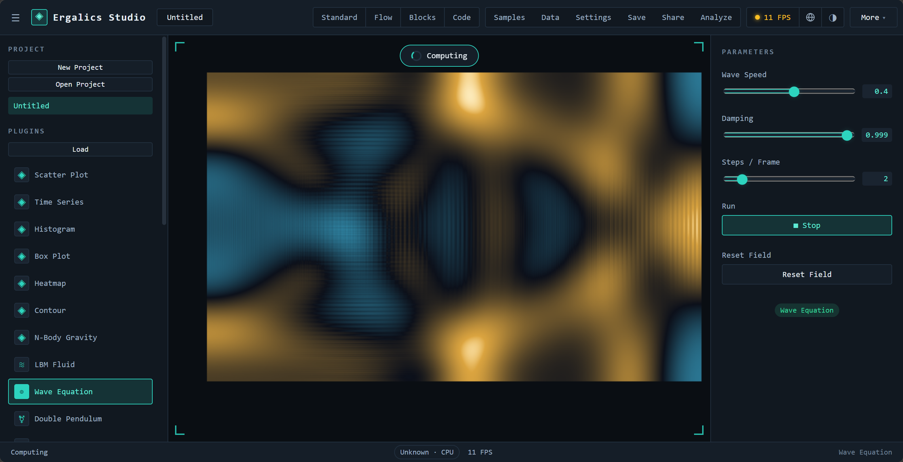
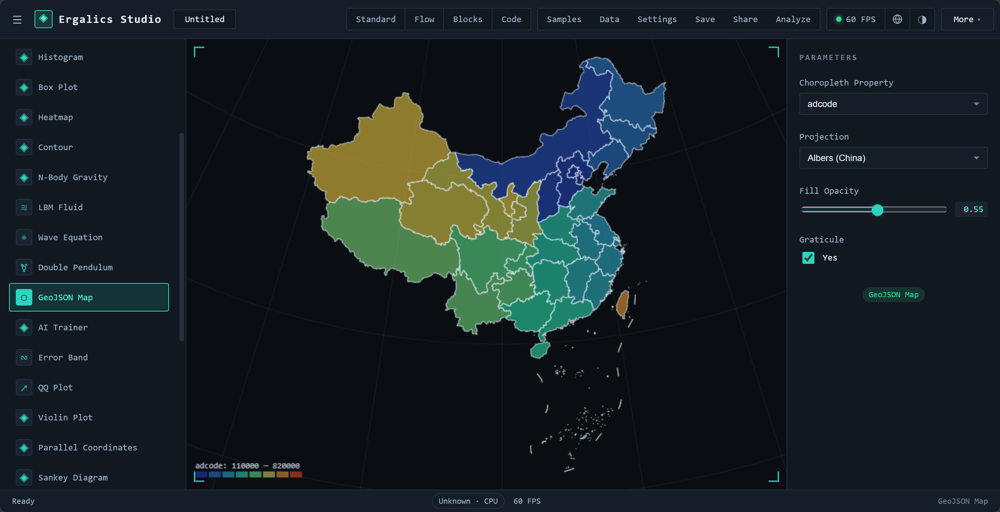

# Plugin Development

## The Plugin interface

Every plugin implements the `Plugin` contract (`src/types/plugin.ts`):

```ts
interface Plugin {
  readonly manifest: PluginManifest;
  init(api: PluginApi): Promise<void> | void;
  destroy(): Promise<void> | void;
  activate(context: PluginRenderContext): Promise<void> | void;
  deactivate(): Promise<void> | void;
  render?(container: ContainerCapabilities): Promise<void> | void;
  updateParams(params: Record<string, unknown>): Promise<void> | void;
  getParams(): ParamDefinition[] | Promise<ParamDefinition[]>;
  compute?(input, onProgress?): Promise<ComputeResult>;
  loadData?(file: File): Promise<void> | void;
  getSupportedFormats?(): SupportedFormat[] | Promise<SupportedFormat[]>;
  renderToScene?(scene: Scene3DHandle): Promise<void> | void;
}
```

The host drives the lifecycle:

1. **load** — the module factory runs, then `init(api)` is called with the
   host `PluginApi`.
2. **activate** — the plugin receives `{ container, api }` and renders into
   the container (2D canvas, DOM, or the Three.js scene).
3. **params** — `getParams()` is resolved (possibly asynchronously — e.g. a
   sandboxed plugin answers over RPC) and shown in the right panel;
   user edits arrive via `updateParams`.
4. **deactivate / destroy** — the plugin releases its resources.

## Manifest

```jsonc
{
  "id": "com.example.analyzer",
  "name": "Analyzer",
  "version": "1.2.0",
  "author": "Example Corp",
  "description": "…",
  "license": "MIT",
  "entry": "dist/index.js",
  "sandbox": "isolated",            // "isolated" (default) | "trusted"
  "formats": [{ "extension": ".dat", "mimeTypes": ["application/octet-stream"] }],
  "nameI18n": { "zh-CN": "分析器" }
}
```

The `sandbox` field decides where the entry code executes (see below).
Built-in plugins always run in the host context.

## Container capabilities

```ts
interface ContainerCapabilities {
  three?: Scene3DHandle;        // host-managed Three.js scene (3D plugins)
  canvas2d?: HTMLCanvasElement; // shared 2D canvas
  dom?: HTMLDivElement;         // generic DOM container
  reportDataScale(n: number): void; // feed the perf panel
}
```

Declaring `renderToScene` makes the host materialize the Three.js scene for
your plugin — the 2D canvas and the scene are mutually exclusive by design,
and the host toggles visibility for you.

**Camera controls come from the host, so plugins need no input code.**

- **3D viewport** — drag to orbit, right-drag to pan, scroll to zoom;
  arrow keys pan, **WASD** moves along the view axes (hold **Shift** to
  boost), and **Q/E** yaw the camera around the target.
- **2D viewport** — drag to pan and scroll to zoom the shared canvas;
  double-click resets the view.

## PluginApi

Plugins interact with the host through a small, capability-limited API:
locale (`locale`, `t`, `onLocaleChange`), status/perf (`setStatus`,
`reportGpuTime`, `reportDataScale`), notifications (`notify`), files
(`openFile`, `readText`, `readBinary`), project-scoped persistence
(`getParam`, `setParam`), and — when a WebGPU device is available — GPU
compute (`gpu`, see [Native Core & WebGPU](native-core)).

### GPU compute

`api.gpu` is present only when WebGPU is available (and inside the Worker
sandbox it is always absent), so always guard with `available`:

```ts
const gpu = api.gpu;
if (!gpu?.available) {
  // CPU fallback — same math, no GPU.
}

const data = gpu.createBuffer(
  bytes,
  GPUBufferUsage.STORAGE | GPUBufferUsage.COPY_DST | GPUBufferUsage.COPY_SRC,
  'data',
);
const kernel = gpu.compileKernel({
  label: 'my.kernel',
  wgsl: myWgsl,                    // or a template from src/core/wgsl.ts
  workgroupSize: [64, 1, 1],
  bindings: [{ binding: 0, bufferType: 'storage' }],
});
data.write(particles);
gpu.run(kernel, [data], workgroups, 1, 1);   // bind group + dispatch + submit
const result = await data.read();            // readback copy (read() handles it)
```

> **Buffer usage note** — WebGPU only allows `MAP_READ` alongside `COPY_DST`,
> so a compute storage buffer cannot be mapped directly. Create it with
> `STORAGE | COPY_DST | COPY_SRC`; `read()` copies the results into a separate
> `MAP_READ | COPY_DST` readback buffer internally.

## Built-in example plugins

Twenty-seven core example plugins ship in `src/plugins/builtin/` and cover the
full plugin contract surface — 2D canvas, host Three.js scene, `loadData`,
`compute`, and the `api.gpu` accelerated path:

| Plugin id           | Data                 | Capability                                        |
| ------------------- | -------------------- | ------------------------------------------------- |
| `example.point-cloud`   | `.xyz`           | 2D canvas point cloud                             |
| `example.point-cloud-3d`| `.xyz`, `.dat`   | Three.js `Points`, height ramp, auto-fit          |
| `example.particles`     | `.dat`           | 2D simulation + real WGSL integration kernel      |
| `example.timeseries`    | `.csv`           | 2D multi-series line chart                        |
| `example.histogram`     | `.dat`           | binning + log scale                               |
| `example.heatmap`       | `.json` (grid)   | viridis ramp                                      |
| `example.image`         | `.png`           | base64 image viewer                               |
| `example.contour`       | `.json` (grid)   | color ramp + marching-squares isolines            |
| `example.scatter`       | `.dat/.csv/.xyz` | 2D scatter with color channel                     |
| `example.nbody`         | `.json` (bodies) | 3-D all-pairs gravity, GPU + CPU                  |
| `example.protein`       | `.json` (network)| force-directed layout + component metrics         |
| `example.bar_chart`     | `.csv`           | grouped bars, orientation & palette               |
| `example.polar`         | `.csv`           | multi-series radar plot                           |
| `example.network`       | `.csv` (edges)   | force-directed layout, degree sizing              |
| `example.bubble`        | `.csv`           | bubble size + color channels                      |
| `example.violin`        | `.csv`           | kernel density + box overlay                      |
| `example.sankey`        | `.csv` (edges)   | proportional flow ribbons                         |
| `example.boxplot`       | `.csv`           | quartiles, whiskers, outliers                     |
| `example.parallel`      | `.csv`           | parallel coordinates, categorical coloring        |
| `example.errorband`     | `.csv`           | shaded confidence band around a line              |
| `example.treemap`       | `.csv`           | hierarchical rectangle layout (flat or nested)    |
| `example.qqplot`        | `.csv/.dat`      | normal quantile comparison + reference line       |
| `example.ai-training`   | `.csv`, `.json`  | 4 models (linear / non-linear NN / logistic / MNIST CNN), live loss curve, scatter+fit / decision boundary / digit grid |
| `example.fluid`         | `.json` (obstacle mask) | 2-D lattice-Boltzmann channel flow (D2Q9), WGSL collide + stream kernels, Kármán vortex street |
| `example.wave`          | `.json` (u / drive grids) | 2-D finite-difference wave equation (pulse / twin-source / double-slit), WGSL leapfrog kernel |
| `example.pendulum`      | `.json` (initial conditions) | RK4 double pendulum with a chaos ghost twin offset by 0.001 rad |
| `example.geomap`        | `.geojson`, `.json` | offline vector map with choropleth shading; Albers (China) / Web Mercator / equirectangular |

Ten additional **fun / utility** plugins (`fun.*`, e.g. Mandelbrot, Game of
Life, Koch Snowflake, Fireworks) declare `autoload: false` and are loaded on
demand from the built-in panel or the marketplace tab.

### Contour (`example.contour`)


A 64×64 scalar-field viewer: viridis color ramp plus marching-squares
isolines. Its grid normalization logic is covered by `builtinPlugins.test.ts`,
and the bundled sample (`field.json`) renders the twin-peak field above.

### AI Trainer (`example.ai-training`)


A drop-in for "train a small model in the browser without writing code".
Four model kinds — `linear`, `nonlinear-nn`, `logistic`, `mnist` — share the
same `Train` / `Stop` / `Export Weights` button surface and the same
live-updating loss curve. A handy reference for plugin authors because it
exercises several host features at once:

- **`loadData(file)`** parses tabular CSV through a single helper and
  accepts the MNIST 785-column `label,p0..p783` layout. The host router
  picks the right plugin from the file's extension, so dropping a CSV onto
  the canvas is enough to start training.
- **`button` parameters + `updateParams`** drive the training flow. The
  plugin publishes three buttons; each carries an `action` string
  (`train` / `stop` / `export`), and `updateParams` reads it back and
  dispatches. No custom `api.*` calls are required.
- **A long-running `compute` callback** streams progress via the
  `onProgress` hook so the loss curve and the lower panel repaint during
  training without blocking the UI.
- **Dynamic imports for heavy deps.** TensorFlow.js is ~2 MB and is
  *not* loaded by the auto-load step — `loadTf()` does
  `await import('@tensorflow/tfjs')` on first use, then prefers the WebGL
  backend and falls back to CPU. Plugin authors shipping a heavy native
  dep can follow the same pattern.
- **Bundled sample data lives in `examples/data/ai/`** (linear, non-linear,
  logistic, MNIST) and is exposed through the global **示例** dialog rather
  than a per-plugin "Load Sample" button, so the dialog stays the single
  entry point for one-click data.

### N-Body Gravity (`example.nbody`)


A 3-D astrophysics demo: direct-summation gravity where every body feels the
pull of every other body — **O(N²) per step**. It declares `renderToScene`,
so the host materializes the Three.js scene and the plugin renders the bodies
as `THREE.Points` (colored by speed, camera auto-fit).

- **Data** — JSON initial conditions. Either an array of `[x, y, z, vx, vy,
  vz, mass]` tuples or objects with those keys:
  ```json
  { "bodies": [[0, 0, 0, 0, 0, 0, 50], [0.9, 0.18, 0.0, 0.01, 0, -1.56, 1]] }
  ```
  The bundled sample (`nbody.json`) is a 4096-body **torus ring** orbiting a
  central mass.
- **Compute** — the `⚡ GPU all-pairs` button (or `compute()`) uploads the
  bodies to an interleaved `[x,y,z,vx,vy,vz,mass]` storage buffer and
  dispatches a WGSL all-pairs kernel. Two buffers are used in **ping-pong** so
  every integration step stays on the device with no per-step read-back. On
  CPUs (or when `api.gpu` is absent) the identical integrator
  (`advanceNBodyCPU` in `src/core/wgsl.ts`) runs as a fallback.
- **Parameters** — `Bodies` (resample count), `Gravity G`, `Softening`,
  `Timestep`, `Compute steps`, a `Run` toggle (live animation), and the GPU
  compute button.
- The plugin is **data-driven**: it renders an empty scene until a `.json`
  file or sample data is loaded, and it never fabricates a dataset.

### Protein Interactions (`example.protein`)


A systems-biology demo. Loads a protein-protein interaction (PPI) network and
computes a **force-directed layout** (Fruchterman-Reingold spring-electrical
model) — O(V²) repulsion + O(E) attraction per iteration, annealed to
convergence — then reports biology-relevant metrics.

- **Data** — JSON with `proteins` (`{id, name}`) and `interactions`
  (`{source, target, weight}` or `[sourceIdx, targetIdx, weight]`):
  ```json
  {
    "proteins": [{ "id": "P0", "name": "Protein-0" }],
    "interactions": [{ "source": "P0", "target": "P1", "weight": 0.8 }]
  }
  ```
  The bundled sample (`protein.json`) is a 560-protein / ~1700-interaction
  modular network.
- **Compute** — the `⚡ Compute layout` button runs `Iterations` steps of the
  layout with simulated-annealing temperature decay, then reports the number
  of **connected components** (putative complexes/modules) and the largest
  component size via the `ComputeResult.output`.
- **Parameters** — `Proteins`, `Iterations`, `Repulsion (k)`, a `Run` toggle
  (live relaxation), and the compute button. The live animation anneals its
  temperature and auto-stops once settled, so nodes do not jitter.
- Nodes are colored by degree and sized by degree; edges are weighted.

### LBM Fluid (`example.fluid`)


A 2-D lattice-Boltzmann channel flow (D2Q9) around a user-supplied obstacle
mask. Collide and stream steps run as **WGSL kernels** (with a matching
`fluidStepCPU` fallback pinned by tests), and long obstacles develop a
Kármán vortex street.

- **Data** — JSON obstacle mask where `1` marks solid cells. The bundled
  sample (`fluid-obstacle.json`) is an airfoil profile.
- **Parameters** — `Inflow Speed`, `Relaxation (1/viscosity)`, `Lattice
  Detail`, `Steps / Frame`, a `View` selector (`Wind Flow` / vorticity and
  friends), plus `Run` / `Stop` and `Reset Flow`.
- Like every simulation plugin it is strictly data-driven: it starts empty
  and never fabricates a default scene.

### Wave Equation (`example.wave`)



A 2-D finite-difference wave equation on a grid, integrated by a **WGSL
leapfrog kernel** (`waveStepCPU` as tested CPU fallback).

- **Data** — JSON with a `u` grid and an optional drive grid (`< 0`
  barrier, `> 0` source amplitude). Three bundled samples cover the
  scenarios: `wave-pulse.json`, `wave-twin.json` (two-source interference),
  and `wave-slit.json` (double slit).
- **Parameters** — `Wave Speed`, `Damping`, `Steps / Frame`, `Run`/`Stop`,
  and `Reset Field`.

### Double Pendulum (`example.pendulum`)


A chaos demonstration: two double pendulums integrated with **RK4**, the
ghost twin starting at an angle offset of just **0.001 rad**. The HUD reads
out the live ghost divergence so sensitive dependence on initial conditions
is directly visible as the trajectories peel apart.

- **Data** — JSON initial conditions (angles + angular velocities). Bundled
  samples: `pendulum-chaos.json` and `pendulum-flip.json`.
- **Parameters** — `Mass 1/2`, `Length 1/2`, `Gravity`, `Speed`, a trail
  toggle, the `Chaos Ghost` toggle, and `Run`/`Stop`.

### GeoJSON Map (`example.geomap`)



An **offline** vector map: loads a GeoJSON FeatureCollection and shades each
feature by a chosen property (choropleth) — no tile server, no network.

- **Data** — `.geojson` (or `.json`) files. Bundled samples:
  `china-provinces.geojson` (province polygons with `adcode`) and
  `choropleth-sample.geojson`.
- **Parameters** — `Choropleth Property`, `Projection` (Albers (China) /
  Web Mercator / equirectangular), `Fill Opacity`, and a graticule toggle.
- `parseGeoJSON` — geometry and property extraction — is unit-tested in
  `geoPhysicsPlugins.test.ts` alongside the fluid / wave / pendulum logic.

All built-ins register via `BUILTIN_PLUGINS` in `src/plugins/builtin/index.ts`
and their sample data via `BUILTIN_EXAMPLES` in `src/core/examples.ts`.

## Building a `.cspkg` package

A package is a ZIP with `manifest.json` + entry + assets:

```
my-plugin.cspkg
├── manifest.json
└── dist/
    └── index.js        # module whose default export is the plugin factory
```

The entry source is a function body that receives the (sandboxed) `api` and
returns a `Plugin` object.

## Sandboxing

- **`isolated` (default)** — the entry runs inside a **Web Worker** with a
  postMessage RPC bridge (`src/core/sandbox.ts`). It has no access to the
  host page's globals, DOM, `window`, or stores. Canvas rendering works via
  an `OffscreenCanvas` transferred into the worker; `dom`/`three` handles
  are intentionally unavailable.
- **`trusted`** — executes directly in the host context with full DOM
  access. Use only for packages you control.

If Workers are unavailable, the loader falls back to a best-effort strict
`new Function` with shadowed globals and **warns the user** that this is not
a security boundary.

> **Honest limits**: workers share the origin's IndexedDB, so a malicious
> package could still read app data through it. Treat the sandbox as
> isolation from the page context, not from the origin's storage.
