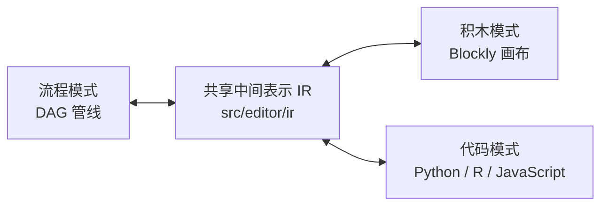
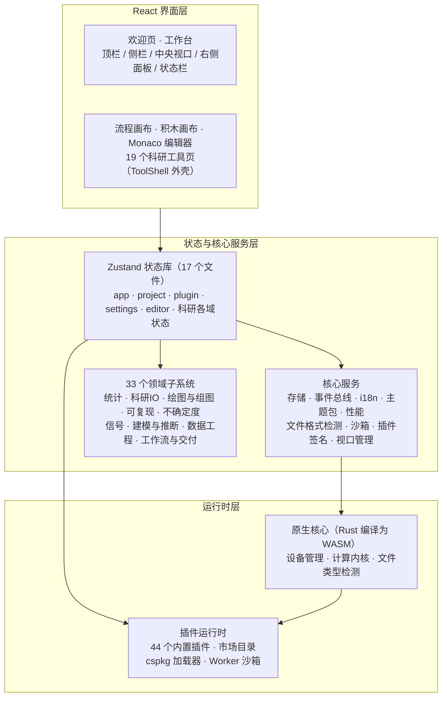
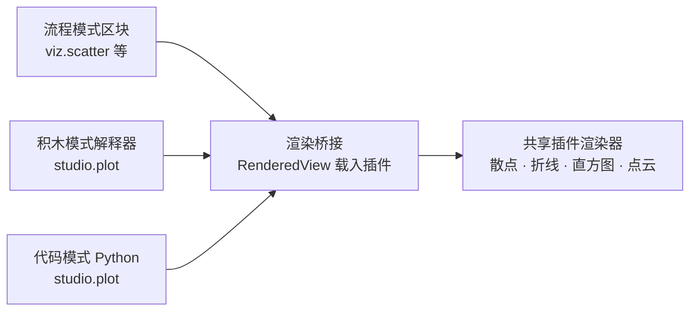

# Ergalics Studio 产品介绍

Ergalics Studio 是一款完全运行于浏览器中的专业科学计算工作站。它把交互式数据探索、GPU 计算调度、沙箱化插件系统与四种面向不同用户的工作模式整合进同一个网页应用：无需安装任何本地软件，打开网页即可使用；数据保存在浏览器本地（IndexedDB），不出本机；项目可以保存为 .clproj 文件或分享链接，随取随用。

它带来的，是一条从"零代码"到"真代码"的完整科学计算路径：拖入一个 CSV 文件立即看到图表，用 42 个内置区块搭出可视化数据流管线，用类 Scratch 积木写出第一段程序，最终在 Monaco 编辑器里编写由真实 CPython 运行时（Pyodide）执行的 Python 代码。四种模式共享同一份数据语义与渲染后端，切换模式时逻辑原样保留。

它与工作台并列的还有一条科研主线：**19 个科研工具**覆盖数据体检、清洗、建模、推断、参数扫描、图表排版、报告、可复现锁与补充材料打包，把"跑完一次分析"变成"交付一份可被别人原样重跑的研究成果"（详见 05 篇）。

它适合谁：想快速看图的研究人员、刚开始学习数据分析的学生、讲授编程与计算思维的老师，以及需要一个"零安装、可离线、可扩展"科学计算环境的任何人。本文从产品视角展开介绍项目背景、技术架构、功能全景、应用场景与创新点；更细的工程实现见本目录其余技术文档。

## 一、项目背景与设计目标

### 1.1 科学计算工具链的三重门槛

安装与环境门槛高。传统桌面软件（如 MATLAB、Origin）体积庞大、授权昂贵，一台新电脑从安装到能用往往要以小时计；Python 生态虽然免费开放，但要让初学者独立配好解释器、虚拟环境、数值库与绘图库，仍然是一件容易劝退的事。环境问题消耗的是本应投入在数据与问题本身上的注意力。

教学路径存在断层。从积木式编程过渡到真实代码，中间缺少一款能把"拖拽数据、搭建流程、编写代码"统一在同一界面里的工具。学生在一个工具里学会拖积木，换到另一个工具里面对黑漆漆的终端，两次学习之间没有衔接，已建立的直觉难以迁移。

交付与复现的门槛被低估。即便分析跑通了，"这次结论是怎么算出来的"往往没有留下可核查的痕迹：环境版本、随机种子、输入数据的哈希、代码快照散落在不同地方。等到投稿或复核时，重跑一遍常常得不到同一个数字。

前两条门槛 Ergalics Studio 用"把整个工作台搬进浏览器标签页"来回答；第三条门槛用一条从运行记录到可复现锁、再到补充材料打包的完整交付链来回答——这也是它与"在线画图工具"最根本的区别。

### 1.2 六条设计目标

1. **零安装，打开即用。** 全部能力随网页交付，标准模式下把数据文件拖进窗口就能看到可视化结果。
2. **数据不出本机。** 项目与数据存储在浏览器 IndexedDB 中，可导出为 .clproj 文件离线流转，不存在云端副本。
3. **一条学习曲线走到底。** 四种模式面向同一份项目数据，从看到图、到搭流程、到拼积木、到写代码，能力渐进而不换工具。
4. **计算必须是真计算。** GPU 内核是真实的 WGSL 计算着色器，Python 是真正的 CPython，原生核心由 Rust 编译为 WebAssembly；每一个内核都有对应的单元测试与端到端数值一致性校验。
5. **结论必须可被重放。** 每一次执行都留下运行记录，环境与数据指纹可锁定为 `repro.lock`，报告与补充材料可一键打包成自包含文件与 ZIP。
6. **开放可扩展。** 插件契约清晰、市场目录内建、第三方插件默认运行在 Worker 沙箱中、`.cspkg` 包支持 Ed25519 签名与信任注册表，配合完整的开源代码与持续集成，生态可以安全地生长。

### 1.3 四类用户，四种模式

| 模式 | 面向人群 | 核心体验 |
| --- | --- | --- |
| 标准（Standard） | 只想快速看图的人 | 拖入数据文件，自动识别格式并路由到匹配插件，即刻看到可视化 |
| 流程（Flow） | 数据分析初学者 | 用 42 个内置区块搭出可视化数据流管线，拓扑排序执行，逐节点查看输出 |
| 积木（Block） | 编程启蒙与教学 | 类 Scratch 积木编辑器，唯一入口是绿色"运行时"帽子区块，30 余种积木完全可脚本化 |
| 代码（Code） | 真实脚本用户 | Monaco 编辑器，Python 走 Pyodide Worker 中的真实 CPython，R / JavaScript 由进程内 IR 引擎执行，带 REPL 控制台与变量面板 |

<!-- pagebreak -->

**标准模式**是产品的"前门"。工作台采用经典的四区布局：顶栏负责项目与模式切换，左侧是项目树与插件列表，中央视口承载插件渲染，右侧是与所选插件实时绑定的参数面板。把文件拖进窗口，宿主会通过文件格式检测（按魔数识别，辅以扩展名，可选 WASM 辅助）自动路由到匹配的插件，例如拖入 .xyz 文件直接得到点云渲染；多个插件同时匹配时弹出选择框由用户决定。

<!-- pagebreak -->

**流程模式**把分析过程显式化为一张有向无环图。用户从区块目录拖出数据源、变换、过滤、数学、统计、单位、可视化与绘图区块，连线成管线；编译器先做结构校验（端口匹配、必填参数、类型检查）与环检测、拓扑排序，执行器再按序执行并对每个节点做增量缓存，改动一个参数只重算受影响的下游节点。每个区块的输出都可以就地预览：可视化区块弹出插件渲染，统计区块以只读数据表或标量形式呈现。

<!-- pagebreak -->

**积木模式**面向编程启蒙。类 Scratch 的画布上，绿色"运行时"帽子区块是脚本的唯一入口，帽子下方未连接的孤立区块永不运行，从根本上杜绝误执行破损代码；数据加载、变量、循环、数学运算与绘图积木拼在其下。点击运行后，宿主把积木图编译为共享中间表示（IR），由内置解释器逐节点执行。积木名称、提示与下拉选项均已本地化，5 个内置示例程序开箱即玩。

<!-- pagebreak -->

**代码模式**面向真实脚本用户。Monaco 编辑器之外，侧栏提供控制台与变量面板；Python 代码运行在 Pyodide Worker 中，是货真价实的 CPython，`studio` 作为正经可导入模块注入；R 与 JavaScript 走进程内 IR 引擎，与积木模式共用同一个解释器。仓库在 `examples/code` 目录提供 9 个可直接运行的示例程序，从蒙特卡洛求圆周率到信号分析一应俱全。

三个脚本模式共享同一份 IR：流程里搭好的管线可以变成积木，积木可以生成 Python 代码，代码模式下编辑的 studio 调用也能解析回积木图。一次编辑，三种表达，由专门的往返互转单元测试兜底。

### 1.4 项目现状

项目处于积极开发中，核心闭环已端到端可用并有测试覆盖。当前基线（版本 0.1.0，MIT 协议）：

- **44 个内置插件**：34 个核心/科学插件随启动自动加载，10 个趣味与工具插件声明 `autoload: false` 按需加载；侧栏按 charts / stats / physics / geo / data / fun 六个学科分组。
- **四种工作模式**全部可用；积木、流程、代码三种模式经由共享 IR 双向互转。
- **19 个科研工具**按测量与评估、建模与推断、数据与谱系、信号与记录、报告与复现五组组织，统一挂在 `/studio/:toolId` 路由下。
- **42 个流程区块**覆盖数据源、变换、过滤、数学、统计、单位、绘图与可视化八类。
- **13 个可复用 WGSL 内核**：粒子积分、N-Body 全对引力、直方图、热力图、点云、D2Q9 流体的碰撞/迁移/涡量、波动方程、分块矩阵乘、基 2 FFT、K-means、键值分箱；每个内核都配数学一致的 CPU 实现。
- **33 个领域子系统目录**落地了统计、科研二进制 I/O、出版级绘图与组图、可复现性、不确定度、信号处理、建模与推断、数据质量与清洗、SQL、血缘、报告、补充材料、课程与作品长廊等能力（详见 07 篇）。
- **质量保障**：111 个测试文件、1849 个单元测试（1847 通过，2 个在无 GPU 的 CI 上跳过）；13 套 Playwright 端到端套件驱动真实浏览器（无头 Edge）验证；5 条 GitHub Actions 工作流覆盖单元测试、性能基准、安全扫描、发版归档与部署（详见 08 篇）。

## 二、技术架构

### 2.1 总体分层

整体为"React 界面层 + 状态与核心服务层 + 插件运行时与原生核心 + 浏览器底座"的多层结构。所有层级运行在同一浏览器页面内，通过明确的契约通信，低层从不反向导入高层。

各层职责如下：

- **React 界面层**（`src/pages` 与 `src/components`）：欢迎页、工作台四区布局、流程画布、积木画布、Monaco 代码编辑器与 19 个科研工具页。界面组件只与状态库和插件契约打交道，不含业务算法。
- **状态层**（`src/stores`，17 个文件）：分别管理应用壳、项目、插件、设置、编辑器、AI 面板、分析、区块、分块、实验、图表、血缘、笔记本、研究、模板引导与流程同步等状态，互相之间通过事件总线协作而非直接引用。
- **核心服务层**（`src/core`）：存储（IndexedDB 与 OPFS）、事件总线、国际化（中英双语）、主题包、性能上报、文件格式检测、视口管理、沙箱与 cspkg 加载、插件签名等横切能力，以及 33 个领域子系统。
- **插件运行时**（`src/plugins`）：内置插件的注册表与生命周期、市场目录、cspkg 包加载器与 Worker 沙箱。
- **原生核心**（`native/ergalics-core`，Rust）：编译为 WebAssembly 后向 JavaScript 暴露设备管理、缓冲区与计算内核抽象，并承担文件类型魔数检测。
- **浏览器底座**：WebGPU、Web Workers、IndexedDB / OPFS、OffscreenCanvas 与 Three.js，是所有能力最终落地的平台。

### 2.2 贯穿架构的三条设计主线

**宿主与插件之间只有一个契约。** 每个插件实现统一的 Plugin 接口（初始化、激活、渲染、参数读写、数据加载、3D 场景渲染等），并从宿主获得一个 PluginApi 句柄用于本地化、状态上报、性能上报、通知与文件访问。第三方插件的入口代码默认运行在 Web Worker 沙箱中，仅通过类型化 RPC 协议与宿主通信，画布渲染经 OffscreenCanvas 转移完成；`.cspkg` 包在加载时进行清单校验（必填字段、id 格式、入口路径穿越防护、沙箱枚举），并可选地经 Ed25519 签名验证来源。沙箱回答"它运行时能做什么"，签名回答"这个包是谁发布的"——两者互相独立，合法签名不会削弱沙箱隔离。

**一条渲染管线服务全部模式。** 无论是流程模式的可视化区块、积木模式解释器调用的 `studio.plot`，还是代码模式 Python 里的 `studio.plot` 调用，最终都汇入同一个渲染桥接，落到同一个散点图、直方图插件上。2D 插件共享同一个 canvas 视口；3D 插件按需懒创建宿主管理的 Three.js 场景，并在 2D 插件激活时自动隐藏，保证两种视口互不渗透。

**GPU 计算三级降级。** Rust 核心编译为 WebAssembly，向 JavaScript 暴露设备管理、缓冲区与计算内核的完整抽象；当 WASM 模块不可用时，宿主侧服务自动改走原生 WebGPU API；两者皆不可用时插件回退到 CPU 实现，行为一致。`gpu-kernels.ts` 另按数据规模设阈值（如矩阵乘 16384 个输出元素、FFT 1024 个复数样本），低于阈值的小数据自动走 CPU，避免上传回读开销吃掉收益；引擎选择结果会写入运行记录，使"这一次是谁在算"可追溯。端到端测试对 GPU 与 CPU 的计算结果做数值一致性校验（误差约 2×10⁻⁶）。

### 2.3 一条渲染管线服务全部模式

三种编辑模式产生的绘图请求汇入同一个渲染桥接，由共享的插件渲染器出图，因此"换一种表达方式"看到的是同一张图。

## 三、功能全景

### 3.1 内置插件生态

34 个核心/科学插件按能力分为六组，随启动自动加载：

| 分组 | 插件 | 说明 |
| --- | --- | --- |
| 基础与三维可视化 | 散点、时间序列、柱状、气泡、直方图、热力图、等值线、图像查看、点云（2D 与 3D）、三维曲面、三维体素、粒子 | 覆盖最常见的工程与科学出图需求；2D 插件共享同一 canvas 视口，三维插件走 Three.js 场景 |
| 高级统计图 | 箱线、小提琴、误差带、QQ 图、平行坐标、桑基、矩形树图、网络图、雷达/极坐标、蛋白质互作网络 | 面向统计教学与多变量探索，网络类插件内置力导向布局 |
| 物理仿真 | N-Body 引力、格子 Boltzmann 流体、波动方程、双摆、流体双向耦合求解器（1D 管网-3D 场） | 数据驱动的仿真引擎，WGSL 计算内核加速，带 CPU 回退 |
| 交互实验室 | 电磁场、光学实验、结构力学、电磁谐振特征值求解器（稀疏厄密特征值） | 元件可直接拖动，实时求解并可视化 |
| 机器学习 | AI 训练器 | 四类模型（线性回归、非线性神经网络、逻辑回归、MNIST 卷积网络）浏览器内训练 |
| 地理可视化 | GeoJSON 地图 | 离线矢量地图与分级设色，内置中国省份示例 |

10 个趣味/工具插件按需加载，保持首屏轻量：Mandelbrot 与 Julia 集浏览器、Spirograph 摆线艺术、Lissajous 曲线、Game of Life 元胞自动机、Harmonograph 谐振绘图、调色板探索器、科赫雪花、巴恩斯利蕨、烟花粒子与 Truchet 瓷砖。

插件全部来自同一套契约：无论内置还是第三方，加载、渲染、参数与数据访问走的是同一条路径，市场目录（`src/plugins/marketplace.ts`）按科学、趣味、工具三类组织，支持按需加载。参数面板由宿主依清单自动生成本地化表单，支持范围滑杆、下拉、数字、复选框、文本、文件、按钮与开关八类控件。

### 3.2 流程模式区块体系

42 个内置区块分八类，构成流程模式的"词汇表"：

| 类别 | 数量 | 区块 |
| --- | --- | --- |
| 数据源 source | 4 | 示例数据、随机数据、网格数据、文件导入 |
| 变换 transform | 5 | 选择列、重命名列、添加列、归一化、排序 |
| 过滤 filter | 3 | 范围过滤、数值过滤、Top-K 选取 |
| 数学 math | 6 | 加、减、乘、除、平方根、绝对值（支持与标量或另一列运算） |
| 统计 stats | 14 | 摘要统计、直方图分箱、单样本 / 独立双样本 / 配对 t 检验、单因素方差分析、Mann-Whitney U 检验、卡方独立性检验、相关分析、Cohen's d 效应量、多重比较校正、Bootstrap、蒙特卡洛传播、MCMC 采样 |
| 单位 units | 2 | 量纲换算、量纲一致性检查 |
| 可视化 viz | 4 | 散点、折线、直方图、二维点云（经渲染桥接走插件出图） |
| 绘图 plot | 4 | 折线、散点、直方图、柱状（出版级矢量引擎渲染，可直接导出 SVG / PDF） |

区块元数据（名称、描述）内建中英双语；编译器负责结构校验、端口匹配、类型检查与环检测，执行器以节点为粒度做增量缓存与失效重算，示例管线（`examples/projects` 下 11 个真实 .clproj 项目文件）在构建期经 `import.meta.glob` 自动发现。

### 3.3 数据格式支持

| 类别 | 格式 | 说明 |
| --- | --- | --- |
| 常规数据 | CSV、JSON、XYZ、DAT、PNG、GeoJSON | 散点、表格、网格、图像与矢量地图 |
| 科研二进制 | HDF5、NetCDF、FITS、Zarr、Parquet | 由纯 TypeScript 实现的科研 I/O 子系统解析，统一调度器按魔数分派 |
| 项目文件 | .clproj | 工程自有格式，lz-string 压缩，IndexedDB 存储并支持导出分享 |
| 插件包 | .cspkg | fflate 打包的 ZIP，加载时校验清单、可选验签，并落入沙箱 |

格式检测优先按魔数识别，辅以扩展名匹配；识别结果驱动标准模式的插件自动路由。大文件在进入解析前先经 `src/core/chunked/` 的行窗口读取与内容指纹，再由 Worker 池并行解析，避免阻塞主线程。

### 3.4 科研能力全景

科研能力分布在两个层面——19 个面向任务的工具页，以及 33 个领域子系统。工具页解决"这一步要做什么"，子系统提供"这一步怎么算"：

- **测量与评估**：不确定性套件（Bootstrap / 蒙特卡洛 / MCMC 与 GPU 加速重采样，带 R-hat、ESS、HDI 等收敛诊断）、数据画像（流式单遍列画像与 0–100 质量分）。
- **建模与推断**：模型工作台（OLS / 逻辑 / 岭回归 / 多项式拟合与残差诊断）、贝叶斯推断（HMC / NUTS 与 WAIC、PSIS-LOO 模型比较）、模型推理（浏览器内 WebGPU 运行 ONNX）、参数扫描（全网格与拉丁超立方设计点、响应面）。
- **数据与谱系**：SQL 数据工作台（DuckDB-WASM）、数据血缘（Sugiyama 式分层 DAG）、图表工作台（IEEE / Elsevier 模板网格与矢量导出）、数据分析（假设检验与多重比较校正）、数据清洗向导（五类可回退步骤）。
- **信号与记录**：信号实验室（FFT、窗函数、Savitzky-Golay、ACF / PACF、加性时序分解）、Notebook（Markdown + Python）、实验记录（全工具运行台账与指标对比）。
- **报告与复现**：报告生成器（单一自包含 HTML）、可复现锁（`repro.lock` 五类漂移判定）、补充材料打包（数据 + 代码 + 许可的 ZIP）、课程模式、作品画廊。

此外，运行日志导出（`src/core/logger.ts`）把会话内的事件序列落为可下载文件，便于问题回溯与教学演示复盘。

## 四、应用场景

### 4.1 科学与工程数据可视化

覆盖统计分析与工程绘图的常见图型：散点、折线、直方图、热力图、等值线、箱线图、小提琴图、误差带、平行坐标、桑基图、矩形树图、QQ 图、气泡图、雷达图、网络图等；数据格式上除 CSV、JSON、XYZ 外，还支持 HDF5、NetCDF、FITS、Zarr、Parquet 等科研领域常用的二进制格式导入，可服务地学、天文、生物等学科的数据探索需求。下图是等值线插件渲染的双高斯标量场。

### 4.2 物理仿真与教学演示

内置多个数据驱动的仿真引擎，全部"初始为空、绝不伪造默认场景"，数据既可来自内置示例也可来自用户文件：

| 插件 | 演示内容 |
| --- | --- |
| N-Body 引力 | 4096 体的三维全对引力直接求和，WGSL 内核加速 |
| 格子 Boltzmann 流体 | D2Q9 通道流绕障碍物，展示卡门涡街与机翼绕流 |
| 波动方程 | 高斯脉冲、双源干涉、双缝衍射场景，leapfrog 内核积分 |
| 双摆 | RK4 积分配合初值仅差 0.001 弧度的"混沌幽灵摆"，直观展示混沌 |
| 电磁场 | 可拖动电荷在库仑力与洛伦兹力共同作用下的回旋运动 |
| 光学实验 | 薄透镜成像、三棱镜折射与色散，元件可在画布上直接拖动 |
| 结构力学 | 铰接桁架实时承重，杆件按轴力着色，超载断裂直至垮塌 |

### 4.3 编程与计算思维教学

四种模式构成一条从"零代码"到"真代码"的渐进路径：初学者先在标准模式拖数据看图，再到流程模式理解数据流与统计概念（t 检验、方差分析、相关分析等 14 个统计区块），继而进入积木模式写出第一段带变量与循环的"程序"，最后在代码模式直接写 Python。三个脚本模式共享同一份 IR，切换模式时逻辑原样保留；仓库附带的 11 个流程示例项目、5 个积木示例与 9 个 Python 示例，构成可直接布置的练习素材库。课程模式进一步把这个闭环落在工具里：教师发布绑定学科模板的作业，学生提交带 `repro.lock` 的运行结果，教师查看学生 × 作业矩阵并批改。

### 4.4 浏览器内机器学习入门

AI 训练插件基于 TensorFlow.js，支持线性回归、非线性神经网络、逻辑回归与卷积神经网络四类模型，画布上方实时绘制损失曲线，下方按模型切换散点加拟合线、二维决策边界或 MNIST 数字识别网格。训练样本内置（线性、三次加正弦、双高斯分类、200 张 MNIST 子集），TF.js 依赖在首次点击训练时才懒加载，避免拖慢启动。

### 4.5 地理可视化与算法艺术

离线 GeoJSON 分级设色地图支持 Albers（中国）、Web 墨卡托与等距圆柱投影，内置中国省份示例；Mandelbrot 与 Julia 集、科赫雪花、巴恩斯利蕨、Spirograph 等 10 个趣味插件适合课堂演示与兴趣探索。

### 4.6 研究交付与协作

面向"要把结果交出去"的场景：数据清洗向导把脏数据变成可用表格；实验记录台账汇总每一次运行的参数与指标；数据血缘图说明某个产物是由哪些文件、哪些步骤生成的；图表工作台按期刊模板拼出多面板组图；报告生成器把叙述、图与表打包成单一自包含 HTML；可复现锁锁定环境与数据指纹；补充材料打包把数据、代码与许可压成一个 ZIP。一条链路走完，结论不再只是截图。

## 五、创新点

**四模式同源架构。** 市面上的工具要么只做拖拽可视化，要么只做代码编辑。Ergalics Studio 用一份共享 IR 打通积木、流程与代码三种范式，并配备三模式往返互转的专门单元测试；代码模式的缓冲区内容还能解析回 IR，使"换一种表达方式理解同一逻辑"成为一键操作。对教学而言，这意味着同一条管线可以用三种难度梯度反复讲解。

**零安装的全栈科学计算环境。** CPython（Pyodide Worker）、Rust/WASM 原生核心、WebGPU 计算与 IndexedDB / OPFS 持久化全部运行在浏览器内，数据不出本机，同时保持接近桌面软件的体验。这不仅是部署便利，更改变了"教学机房的软件审批、学生自带电脑的环境差异"这类现实约束的性质。

**真实 GPU 计算加优雅降级。** 计算管线不是演示性质的：从 Rust 核心暴露的缓冲区与内核抽象，到 13 个真实 WGSL 内核（含 D2Q9 流体、N-Body、波动方程、FFT、K-means），再到端到端测试中 GPU 与 CPU 结果的数值一致性校验（误差约 2×10⁻⁶），每一层都可用、可测；数据规模低于阈值或 WebGPU 缺失时自动回退 CPU，行为一致，且引擎选择被记入运行记录。

**严格数据驱动的仿真插件。** 所有仿真插件初始为空，重置只重放已加载数据，杜绝"伪造默认场景"。这一约束保证了演示与真实数据的统一性，也倒逼插件把物理参数做成可调项，而不是把结论画死在界面里。

**沙箱与签名两条正交防线。** 第三方插件默认运行于 Web Worker，通过类型化 RPC 访问宿主，画布渲染经 OffscreenCanvas 转移完成；`.cspkg` 包在加载时进行清单校验（必填字段、id 格式、入口路径穿越防护、沙箱枚举），并支持 Ed25519 签名与信任注册表（纯 TypeScript 自实现，不依赖 WebCrypto）。沙箱约束"能做什么"，签名回答"是谁发布的"——一把钥匙丢了不会连带废掉另一把锁。

**从"能算"到"能交付"。** 运行记录、数据血缘、可复现锁、报告生成与补充材料打包构成一条完整的交付链：一次分析不光产出图表，还产出可核查的溯源信息与可原样重跑的材料包。这是把"科学计算"与"数据可视化"区分开的关键能力。

**工程化质量。** 111 个测试文件、1849 个单元测试构成回归网，13 套端到端套件在真实浏览器中校验像素与零控制台错误，5 条 CI 工作流分别把守单元测试与类型、性能基线、依赖安全与 SBOM、发版归档（Zenodo DOI）与文档站部署；性能与体积用基线对比而非拍定阈值，且基线按运行环境分文件，避免共享 Runner 上的噪声被当成性能回归。

## 六、运行与获取

- 在线演示：GitHub Pages（见仓库 README 徽章链接），打开即用。
- 本地开发：`npm install` 后 `npm run dev` 启动；构建原生核心需要 Rust 工具链与 `wasm32-unknown-unknown` 目标，前端在缺失 WASM 模块时会优雅降级（`npm run build:web` 可跳过 WASM 步骤）。
- 质量检查：`npm test` 跑单元测试，`npm run verify` 先做 `tsc --noEmit` 严格类型检查再跑单测，`npm run test:e2e` 串联端到端套件。
- 开源协议：MIT，欢迎通过 Issue 与 Pull Request 参与贡献。
