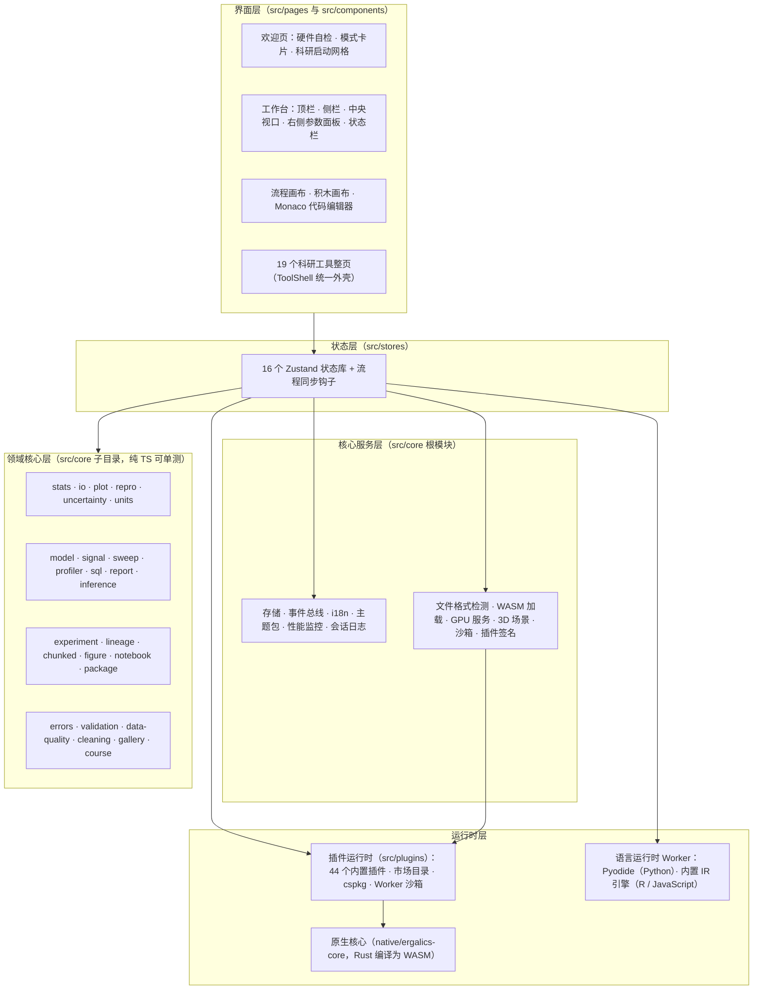
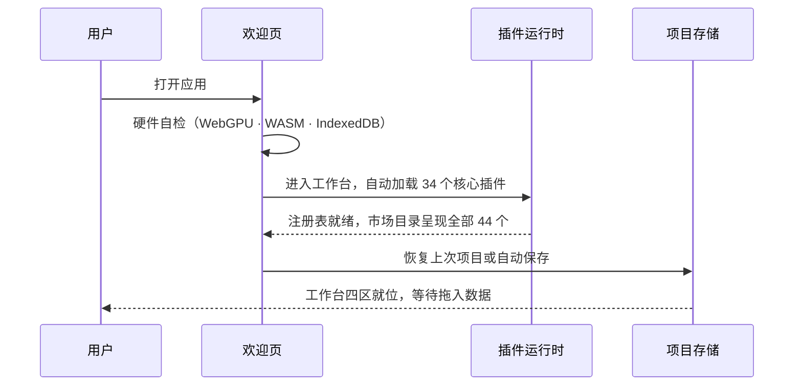
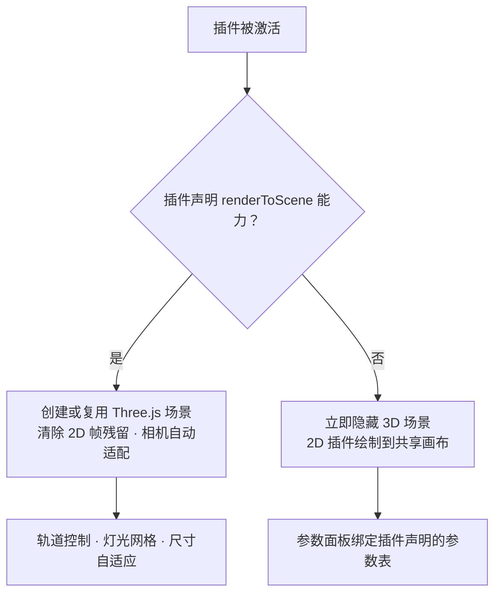

# 02 系统架构

本文从工程视角描述 Ergalics Studio 的分层结构、路由组织、启动时序、状态管理、渲染管线、目录约定与依赖规则。目录约定：前端代码在 `src/` 下，Rust 原生核心在 `native/ergalics-core/` 下，示例数据与项目在 `examples/` 下，单元测试在 `tests/` 下，官方站点与文档站分别在 `website/` 与 `docs/` 下。

## 一、总体分层

整个应用是单页应用（Vite 6 构建，React 18 加 TypeScript 5.7 严格模式），自上而下分为四层，低层从不反向导入高层。核心原则是：**领域核心保持纯 TypeScript 且可单测，UI 层保持薄，第三方代码仅可进入沙箱**。

**分层约束**

| 层 | 允许依赖 | 禁止依赖 |
| --- | --- | --- |
| 界面层 | 核心服务、状态库、领域核心 | 直接操作运行时细节（一律经服务层） |
| 领域核心 | 纯 TS 标准库、内部模块 | DOM、React、浏览器专属 API |
| 核心服务 | 领域核心、浏览器 API | React 组件 |
| 运行时层 | 浏览器 API、WASM | 领域核心反向依赖 |

各层职责与技术选型：

| 层 | 职责 | 主要技术 |
| --- | --- | --- |
| 界面层 | 路由、工作台四区布局、三种编辑器、科研工具整页、对话框与引导 | React 18、react-router-dom 7（HashRouter） |
| 状态层 | 16 个领域状态库与跨界面事件 | Zustand 5 |
| 核心服务层 | 横切服务（存储、i18n、主题、性能、沙箱、签名等） | 纯 TypeScript、IndexedDB、Web Workers、WebCrypto 之外的纯 TS 密码学实现 |
| 领域核心层 | 科学计算、科研工作流与可靠性内核，全部纯 TS 可 Node 单测 | 纯 TypeScript |
| 运行时层 | 插件注册与生命周期、沙箱执行、语言运行时、原生加速 | fflate（ZIP）、lz-string（压缩）、Rust 与 wasm-bindgen 0.2 |

## 二、路由与页面组织

应用采用 HashRouter（静态部署兼容），全部路由懒加载并以 `location.pathname` 为 key 重放 `.route-stage` 入场动画。路由表：

| 路径 | 页面 | 说明 |
| --- | --- | --- |
| `/` | 欢迎页 | 硬件自检（WebGPU · WASM · IndexedDB）、四模式卡片、科研工具启动网格、最近项目 |
| `/workbench` | 工作台 | 标准 / 流程 / 积木 / 代码四模式容器 |
| `/studio/:toolId` | 科研工具页 | 由 `RESEARCH_TOOLS` 注册表驱动，统一 ToolShell 外壳 |
| 旧路径（如 `/#/signal`） | 重定向 | 客户端重定向到 `/studio/:toolId`，永久保活 |
| `/settings` | 设置 | 全局设置、主题市场、PWA 面板、存储管理 |
| `/plugin/:pluginId` | 插件视图 | 单插件详情 |
| `/share/:payload` | 分享 | 分享载荷渲染 |
| `*` | 重定向 | 回欢迎页 |

### 2.1 科研工具注册表（RESEARCH_TOOLS）

`src/pages/research/toolRegistry.ts` 是科研界面的唯一事实来源：每个工具声明一次 `id`、`path`、`legacyPath`、图标、i18n 标题与描述键、分组、是否进入启动网格、是否要求项目上下文与懒加载组件，由 `/studio` 路由、顶栏启动器与欢迎页启动网格共同消费。

当前共 **19 个科研工具**，分五组：

| 分组 | 工具 |
| --- | --- |
| 测量与不确定性 measure | uncertainty（不确定性）、profiler（数据画像） |
| 建模与推断 model | model-lab（回归建模）、inference（Inference Forge）、model-inference（ONNX 推理）、sweeps（参数扫描） |
| 数据与图谱 data | sql（SQL 工作台）、lineage（数据血缘）、figures（Figure Studio）、analysis（快速分析）、cleaning（数据清洗） |
| 信号与扫描 signal | signal（信号实验室）、notebook（笔记本）、runs（实验记录） |
| 交付与复现 deliver | report（报告构建）、reprolock（复现锁）、supplement（补充材料）、course（课程模式）、gallery（作品长廊） |

其中快速分析 `analysis` 的 `inGrid` 为 `false`——它保留顶栏独立按钮入口，不占启动网格位。新科研工具必须注册进该表并配置 `legacyPath`，禁止散落路由。

## 三、启动时序

应用启动遵循"先自检、再加载、后恢复"的固定顺序，任何一步的环境缺失都会如实报告而不是静默降级：

应用装配阶段还会执行 `initProjectStore` / `initExperimentStore` / `initLineageStore`，使项目、实验记录与血缘图在任何页面进入前就绪；`main.tsx` 另行预热插件签名模块（含公钥信任注册表）与 OPFS 迁移逻辑。

欢迎页的自检结果同时决定后续行为的"档位"：WebGPU 可用则计算走 GPU 加速，WASM 模块存在则走 Rust 参考引擎，两者皆缺时插件以 CPU 完成同样的数学（详见 06 篇）。

## 四、状态管理

`src/stores/` 下共 **17 个文件**，承载全部应用状态；跨界的 UI 通信走一个小型类型化事件总线（`src/core/events.ts`），例如插件参数变化、宿主文件选择对话框等事件。状态库之间通过事件总线协作而非直接引用，避免环状依赖。

| 状态库 | 职责 |
| --- | --- |
| appStore | 宿主状态、横幅与通知、性能指标、面板开关 |
| projectStore | 当前项目、最近列表、保存与自动保存、分享、参数持久化 |
| pluginStore | 插件注册表、加载与激活生命周期、文件分发、宿主容器、内置插件加载失败重试 |
| settingsStore | GPU 模式、自动保存间隔、语言、PWA、主题包等偏好；语言以 i18n 模块为唯一权威源并双向订阅 |
| blockStore | 流程模式图状态、运行编排、节点输出缓存、运行取消 |
| editorStore | 积木与代码模式的会话（IR、代码文本、变量、控制台、语言），载入时逐字段净化 |
| analysisStore | 快速分析页的列选择、图型与分析结果 |
| researchStore | 科研工具页的公共上下文（当前文件、最近使用工具） |
| experimentStore | 实验运行记录的读写与筛选（IndexedDB runs 存储） |
| lineageStore | 数据血缘图的重建与查询 |
| chunkStore | 分块加载任务队列与进度 |
| figureStore | Figure Studio 的面板布局、图注与投稿检查状态 |
| notebookStore | 笔记本单元、执行状态与输出 |
| aiPanelStore | AI 助手面板的会话、模式（离线/在线）与授权状态 |
| tourStore / templateTourStore | 引导流程与模板引导的进度 |
| useFlowSync | 流程图 ↔ 共享 IR 的双向同步钩子，含注水签名守卫 |

项目生命周期：创建、打开、保存、自动保存与分享。项目格式为 `.clproj`，内容经 lz-string 压缩后存入 IndexedDB；流程图画布、积木程序、代码会话与笔记本单元全部持久化进项目文件，重新打开时完整恢复。分享链接由随机 UUID 标识，载荷在解析端做大小与结构双重校验，拒绝畸形数据。大文件场景下 `src/core/opfs.ts` 提供 OPFS 分块存储，`opfs-migration.ts` 负责把既有 IndexedDB 数据平滑迁移。

## 五、渲染管线

中央视口拥有三个绘图表面，宿主集中管理其可见性：

1. **共享 2D canvas**：所有 2D 插件（散点、折线、直方图、热力图、等值线、箱线、小提琴、桑基等）画在同一个画布上，由统一的 2D 视口抽象（`viewport2d`）提供快照式访问。
2. **DOM 容器**：供需要 DOM 元素的插件使用，也是沙箱插件经 OffscreenCanvas 转移后挂载画布的位置。
3. **宿主管理的 Three.js 3D 场景**：只有声明了 `renderToScene` 能力的插件激活时才按需创建，并配套轨道控制、灯光网格与尺寸自适应。

可见性判定流程：

这保证 3D 坐标系永远不会渗透进 2D 视图，反之亦然；端到端测试对两种视口的互斥有专门断言。三维数据侧另有 `src/core/mesh3d.ts`（三维网格数据管线，纯函数）与 `src/core/pointcloud-gpu.ts`（百万级点云的 GPU 预算与降采样策略）。

## 六、目录结构

| 位置 | 内容 |
| --- | --- |
| src/core（根模块，34 个） | storage、events、settings、perf、logger、i18n（经 src/i18n）、gpu、compute、gpu-kernels、wgsl、wasm、fileFormat、parse-tasks、parse-worker、worker-pool、scene3d、viewport2d、mesh3d、pointcloud-gpu、sandbox、plugin-worker、pluginCache、cspkg、plugin-signing、crypto-primitives、dataFiles、exampleAssets、examples、download、opfs、opfs-migration、pwa、recentTools、site-links、citation |
| src/core（子目录，33 个） | stats、io、plot、repro、uncertainty、units、model、signal、sweep、profiler、sql、report、inference、experiment、lineage、chunked、cleaning、figure、notebook、package、gallery、course、templates、theme-pack、submit、bench、validation、errors、data-quality、ai、r、pyodide、monaco |
| src/blocks | 流程模式区块系统：类型、注册表、编译器、执行器、ops 与 DataTable 运算、区块目录（catalog，42 个区块）、本地化（l10n）、渲染桥接（render.ts） |
| src/editor | 积木与代码模式：ir（types、validate、hash、serialize）、flow 与 block 的互转、block（Blockly 引擎、积木定义、工具箱、主题、示例）、code（解析与示例）、codegen（Python、R、JS 三个生成器）、runtime（解释器与 Studio API） |
| src/components | 流程模式画布组件、积木与代码模式的编辑器面板组件、反馈与错误边界、图标集 |
| src/pages | welcome、workbench、studio、research（toolRegistry）、labs、signal、sweeps、sql、report、figures、notebook、gallery、settings、share、plugin、plugin-dialog |
| src/plugins | 内置插件（builtin，42 个）、市场目录（marketplace.ts）、示例包（marketplace-demo-packages.ts）、分类表（categories.ts） |
| src/stores | Zustand 状态库（17 个文件） |
| src/types | 插件、项目、区块、编辑器与 DataTable 契约类型 |
| src/native | 构建生成的 WASM 绑定（不入库） |
| native/ergalics-core | Rust 原生核心（lib、device、buffer、compute、utils） |
| examples | 示例数据（data）、示例项目（projects，11 个 .clproj）、代码模式示例（code，9 个 Python 程序） |
| scripts | WASM 构建、存根生成、示例数据生成、签名 CLI、SBOM / CITATION 生成、部署合并与 13 个端到端验证脚本 |
| tests | Vitest 单元测试（111 个测试文件、1849 个用例） |
| docs | VitePress 文档站与本技术文档目录（technical） |
| website | 官方站点（作品长廊 · 主题市场 · 插件市场），部署到 Pages 根路径 |

## 七、依赖规则与分包策略

- 界面层依赖状态层，状态层依赖核心服务与领域核心，核心服务层绝不导入界面层。
- 领域核心禁止访问 DOM 与 React，测试在 Node 环境运行（Vitest）；新能力优先落在 `src/core/` 的纯 TS 模块，再在 UI 层装配，禁止在组件内实现领域逻辑。
- 运行类操作（流程 / 积木 / 代码 / 笔记本 / 扫描 / 不确定性 / 建模 / 推断）必须通过事件总线汇入实验记录与血缘，禁止绕过。
- 插件契约（`src/types/plugin.ts`）是宿主与第三方代码之间唯一的共享词汇表；渲染桥接（`src/blocks/render.ts`）是区块系统唯一带副作用的模块，负责把可视化输出送进插件渲染器，使编译器与执行器保持可测。
- 重依赖全部懒加载分包：Blockly（约 828 KB）在首次进入积木模式时才拉取，TensorFlow.js 在首次点击训练时才拉取，Pyodide 运行时在首次运行 Python 时才引导，Monaco 与 DuckDB-WASM 同理；标准与流程模式的首屏不受影响。WASM 与 Blockly 媒体资源经自定义 Vite 插件同源 vendoring 到 `public/`，不依赖外部 CDN。
- 应用版本号经 `define.__APP_VERSION__` 从 package.json 注入，禁止硬编码。
- 错误边界按区域隔离（顶栏、状态栏独立包裹），边界重置通过递增 key 实现有界重试，避免错误死循环。

## 八、可观测性

- **性能监控**（perf）：帧时间与 GPU 时间聚合，超阈值时经通知系统提示用户而非静默卡顿。
- **运行日志**（logger 加 download）：会话事件序列可导出为文件，用于问题反馈与回归定位。
- **状态栏**：常驻显示 GPU 可用性、当前引擎与性能指标，用户随时知道"现在是谁在算"。
- **基准套件**（`src/core/bench/`）：导入、GPU 内核、渲染帧率与内存四类基准，配合 `scripts/bench-*.mjs` 与 `budget-baseline.json` 在 CI 中做性能回归门禁（详见 08 篇）。
- **可靠性内核**（`src/core/errors/`）：结构化错误分类法、`Result` 类型、退避重试、去重错误注册表与全局 `error` / `unhandledrejection` 捕获，把"静默失败"转成可上报的事件。
