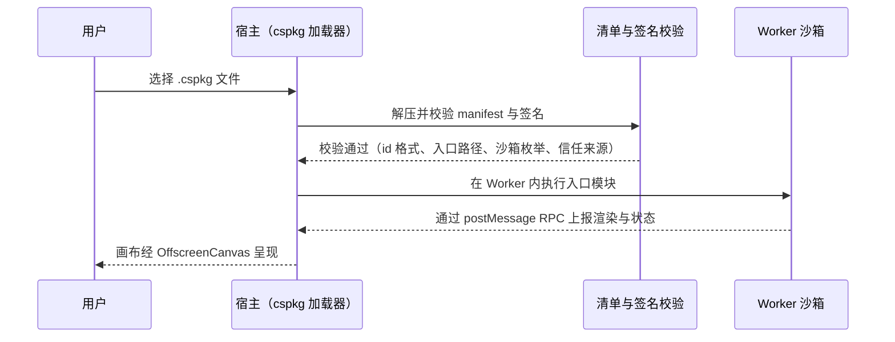
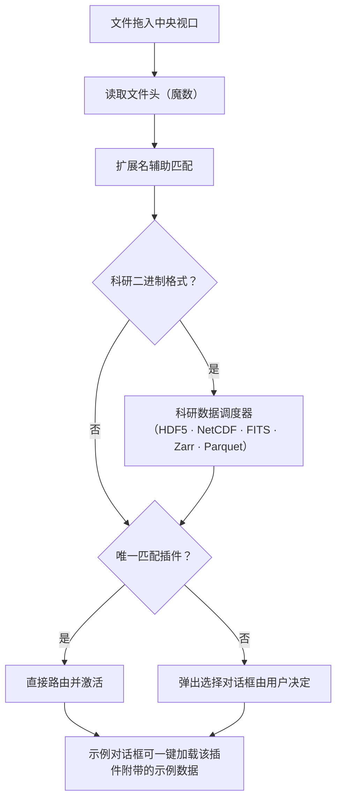

# 03 插件系统

Ergalics Studio 把"一切可视化皆插件"作为第一性设计。宿主与插件之间只有一个契约，第三方扩展与内置插件走同一套接口与生命周期。当前共有 **59 个内置插件**：49 个核心/科学插件在启动时自动加载，10 个趣味与工具插件声明 `autoload: false` 按需加载。

## 一、宿主与插件的契约

每个插件实现统一的 `Plugin` 接口（`src/types/plugin.ts`），主要方法包括：

| 方法 | 作用 |
| --- | --- |
| init / destroy | 初始化与销毁，宿主负责 GPU 安全的资源回收 |
| activate / deactivate | 激活与去激活，驱动 2D/3D 视口切换与残留帧清理 |
| render / updateParams | 绘制与参数更新（右侧面板响应式表单） |
| getParams / compute | 参数读取与计算 |
| loadData | 接收宿主分发的数据（文件路由与渲染桥接的入口） |
| renderToScene | 可选能力声明，激活时获得宿主 Three.js 场景句柄 |

宿主向插件提供 `PluginApi` 句柄，能力面如下：

| 能力组 | 内容 |
| --- | --- |
| 本地化 | 插件文案按当前语言取值，语言切换时参数面板自动重建 |
| 状态上报 | 插件向状态栏上报运行状态与进度 |
| 性能上报 | 帧时间与真实 GPU 时间进入性能监控与告警 |
| 通知 | 按严重级别的横幅与提示 |
| 文件访问 | 项目数据文件解析（项目自有文件、内置示例与代码模式文件共享同一套逻辑） |
| 参数读写 | 项目级参数的持久化存取 |
| GPU 计算面 | createBuffer、write、read、compileKernel、compilationInfo 与一次性 run（详见 06 篇） |

插件在清单中声明参数表，宿主据此自动生成本地化的响应式参数面板，支持八类控件：

| 控件 | 用途示例 |
| --- | --- |
| 范围（滑杆） | 引力常数、阻尼系数 |
| 下拉 | 场景预设、投影方式、调色板 |
| 数字 | 分箱数、步长 |
| 复选框 | 轨迹线、网格显示 |
| 文本 | 列名、标签 |
| 文件 | 附加数据选择 |
| 按钮 | 重新播种、导出 |
| 开关 | 运行 / 暂停之外的布尔状态 |

插件生命周期由插件运行时统一编排：


每个内置插件另有一键导出能力：2D 画布或 3D 场景的 PNG 快照，以及所属表格数据的 RFC-4180 CSV 导出（UTF-8 BOM，仿真类带行数上限与抽样）。

## 二、59 个内置插件

### 2.1 核心 / 科学插件（自动加载，49 个）

| 插件 | 数据格式 | 能力 |
| --- | --- | --- |
| 散点图 Scatter Plot | .dat、.csv、.xyz | 渲染数值列（x y [值]）为二维散点，第三列可作为颜色通道 |
| 时间序列绘图 Time Series | .csv | 将 CSV 各列绘制为随时间变化的折线图 |
| 直方图 Histogram | .csv、.dat、.json、.txt | 对一维数值数据绘制分布直方图，可调节分箱数 |
| 箱线图 Box Plot | .csv、.dat、.json、.txt | 对分组数值数据绘制箱线图（四分位箱体 + 须线 + 离群点） |
| 热力图 Heatmap | .json | 将二维数值网格（JSON 矩阵）渲染为热力图 |
| 等值线图 Contour | .json | 渲染二维标量场（JSON 网格）为色带 + 等值线，适合涡旋场、地形等数据 |
| 引力 N 体模拟 N-Body Gravity | .json | 三维天体物理 N 体引力直接求和模拟，支持 GPU 全配对计算与 CPU 降级 |
| 流体模拟（LBM）LBM Fluid | .json | 二维格子 Boltzmann 通道流（D2Q9），绕流涡街演示，GPU 三内核（碰撞 / 流 / 涡量观测）逐步计算 + CPU 降级 |
| 波动方程 Wave Equation | .json | 二维波动方程有限差分模拟：高斯脉冲、双源干涉、双缝衍射三种场景，GPU 逐步计算 + CPU 降级 |
| 双摆（混沌）Double Pendulum | .json | RK4 积分的经典双摆：主摆与初始角仅差 0.001 rad（≈0.057°）的"幽灵摆"并行演化，直观展示混沌对初值的敏感依赖 |
| GeoJSON 地图 GeoJSON Map | .geojson、.json | 离线渲染 GeoJSON 矢量数据：多边形/线/点，支持按数值属性分级设色（choropleth）与墨卡托/等距圆柱投影 |
| 太阳高度与昼夜长短 Solar Elevation & Day Length | .json | 给定纬度与日期计算太阳赤纬、正午太阳高度、昼长与日出日落地方时；绘制全年昼长与正午太阳高度曲线，演示极昼极夜与季节变化 |
| 气候直方图 Climograph | .csv、.txt | 以"气温折线 + 降水柱状"双轴绘制月度气候图，自动汇总年均温、年降水、气温年较差与降水季节分配，给出简明气候类型判读 |
| 人口金字塔 Population Pyramid | .csv | 背靠背年龄性别金字塔（左男右女，年龄自下而上），计算 0-14 / 15-64 / 65+ 占比、总人口性别比，并自动判读增长型 / 稳定型 / 缩减型结构 |
| 空间插值 Spatial Interpolation | .csv | 将离散站点观测值网格化：反距离加权（IDW，幂次可调）与普通克里金（经验变差函数自动拟合球状 / 指数模型 + 克里金方程组求解），输出热力面、等值线与站点标注 |
| 距离与面积量算 Distance & Area Measure | .json、.csv | 在画布上点击加点：测距模式逐段给出大圆距离与累计里程；测面模式用球面多边形公式计算围合面积与周长，支持撤销、清空、视图复位与 JSON / CSV 点位导入 |
| 投影变形（Tissot 圆）Projection Distortion (Tissot) | .json | 在等距圆柱、墨卡托、正弦、摩尔威德、高尔-彼得斯、方位等积与正射七种投影下绘制世界海岸线与 Tissot 变形圆：面积比表征面积变形，扁率表征角度（形状）变形 |
| DEM 地形分析 DEM Terrain Analysis | .asc | 解析 ESRI ASCII Grid（.asc）高程数据：高程设色、山体阴影（方位 315°、太阳高度 45°）、Horn 法坡度 / 坡向、等高线叠加，以及可拖拽旋转的三维建模视图（垂直夸张系数可调） |
| GPX 轨迹分析 GPX Track Analysis | .gpx | 解析 GPX `<trkpt>` 轨迹点（含海拔 / 时间），统计总里程、累计爬升 / 下降（2 m 迟滞滤波）、用时与最高最低点；左图按海拔着色显示轨迹，右图绘制海拔-距离剖面 |
| 交互地球仪（3D）Interactive Globe (3D) | .json | 可拖拽旋转、滚轮缩放的真三维地球仪：Natural Earth 110m 海岸线与经纬网贴在球面上，叠加球面 Tissot 变形圆，支持自动自转 |
| AI 训练 AI Trainer | .csv、.json | 基于 TF.js 的四类模型（线性回归 / 非线性神经网络 / 逻辑回归 / MNIST 卷积网络），实时损失曲线，TF.js 懒加载 |
| 误差带图 Error Band | .csv、.dat、.txt | 折线 + 半透明误差带（置信区间）图，适合带不确定性的测量数据 |
| QQ 图（正态检验）QQ Plot | .csv、.dat、.txt | 样本分位数与标准正态分位数对比，偏离对角线表示非正态 |
| 小提琴图 Violin Plot | .csv、.dat、.json、.txt | 对分组数值数据绘制核密度小提琴图，支持带宽调节与箱线图叠加 |
| 平行坐标图 Parallel Coordinates | .csv、.dat、.json、.txt | 将多变量数据绘制为平行坐标轴，每行一条折线，可用类别列着色 |
| 桑基图 Sankey Diagram | .csv、.dat、.json、.txt | 从源→目标→值的边数据渲染桑基流图，带按比例缩放的流量带 |
| 矩形树图 Treemap | .csv、.dat、.txt | 用嵌套矩形展示层级数据，矩形面积与数值成正比 |
| 网络图 Network Graph | .csv、.dat、.json、.txt | 从边列表数据渲染力导向网络图，支持节点大小、颜色与动画 |
| 柱状图 Bar Chart | .csv、.dat、.json、.txt | 渲染分类数据为柱状图，支持水平 / 垂直方向与配色选择 |
| 气泡图 Bubble Chart | .csv、.dat、.xyz、.json | 渲染三维数值数据（x y 大小 [颜色]）为气泡图，第四列可作颜色通道 |
| 雷达图 Polar Plot | .csv、.dat、.json、.txt | 渲染多系列雷达 / 极坐标图，每列一个维度，每行一个系列 |
| 点云查看器 Point Cloud | .xyz | 渲染 .xyz 点云文件，可调节点大小与颜色 |
| 3D 点云 Point Cloud 3D | .xyz、.dat | 基于宿主 Three.js 场景的交互式 3D 点云渲染，支持高度着色与自适应视野 |
| 3D 表面图 3D Surface | .json、.dat、.txt | 三维表面图：高度场网格 z=f(x,y)，数据来自项目文件或示例数据，自适应视角 |
| 3D 体素渲染 3D Voxel Field | .json、.dat、.txt | 三维标量场等值面与半透明体素渲染，数据来自项目文件，单次实例化提交 |
| 粒子模拟 Particles | .dat | 交互式粒子模拟，演示计算进度与性能上报 |
| 蛋白质交互网络 Protein Interactions | .json | 蛋白质-蛋白质交互网络与力导向布局计算，输出度分布与连通分量等生物学指标 |
| 图像查看器 Image Viewer | .png、.jpg、.jpeg、.webp、.gif | 加载并查看图片文件（PNG/JPEG/WebP/GIF） |
| 电磁场 Electromagnetism | .json | 在画布上拖动电荷并自由释放：电荷受库仑力与均匀磁场的洛伦兹力共同作用运动，磁场可单独设置（强度与方向） |
| 光学实验 Optics Lab | .json | 几何光学光线追踪：凸透镜 / 凹透镜（薄透镜）、三棱镜（斯涅尔折射 + 色散）、光屏成像，所有元件可在画布上拖动 |
| 结构力学 Structural Mechanics | .json | 桁架承重演示：点击「运行」观察结构在自重与重物作用下杆件轴力增长、材料超限断裂，直至整体垮塌 |
| 电磁谐振特征值求解器 EM Eigensolver | .npz、.npy、.mtx | 面向电磁谐振 / 微波器件仿真的十万阶非正定厄密稀疏矩阵特征值求解器：厚重启 Lanczos、块 LOBPCG、Jacobi-Davidson 三内核 + MINRES 位移逆变换 |
| 1D-3D 双向耦合求解器 Fluid-CFD Coupler | .json | 1D 管网-3D 场双向耦合：多速率时间步协调、粗-细时间子循环、正反向边界耦合、毫秒级阀门控制、守恒性审计与精度-效率权衡曲线 |
| 晶胞 · 3D 预览 Crystal · 3D Unit Cell | .cif、.poscar、.vasp、.xyz | 加载 CIF / POSCAR / XYZ 主流晶胞格式，3D 查看原子、周期性化学键、有效组成与密度估算 |
| 反应 · 自由反应动力学 3D Reaction · Mechanism 3D | .json | 反应分子动力学 3D：内置 NumPy / Langevin 引擎在所选温度与催化剂条件下积分真实轨迹——键越过 Arrhenius 势垒而断裂、自由基重组而成键，原子运动来自真实物理而非脚本动画 |
| 酶动力学 Enzyme Kinetics | .csv、.tsv、.json、.dat | Michaelis-Menten 酶动力学：支持竞争性 / 非竞争性 / 反竞争性抑制、Lineweaver-Burk 线性化，并用 Levenberg-Marquardt 拟合从含噪初速度数据中反解 Vmax 与 Km，输出 kcat、催化效率与拟合优度 |
| 传染病分室模型 Epidemic Modeling | .json、.csv、.tsv、.dat | 确定性 SIR / SEIR 分室传染病模型，用经典 RK4 积分，输出 R₀、群体免疫阈值、感染峰值时刻与总感染率等流行病学指标，可对比 SIR 与 SEIR、改变 R₀ / 潜伏期 / 接触模式 |
| 序列比对与分析 Sequence Alignment | .fasta、.fa、.txt、.json、.csv、.tsv | BLOSUM62 / 核酸打分矩阵的双序列比对（全局 Needleman-Wunsch 或局部 Smith-Waterman，仿射空位罚分），以及碱基组成、GC / GC1-3 密码子 GC 和滑动窗口 GC 分析，支持 FASTA 数据 |
| 群体遗传学 Population Genetics | .csv、.tsv、.json、.vcf、.dat | 哈代-温伯格平衡（HWE）卡方检验，以及带可选自然选择（隐性 / 加性 / 显性）的、可复现的 Wright-Fisher 遗传漂变模拟；展示等位基因频率的随机漂移、固定概率与杂合度衰减 |

### 2.2 趣味与工具插件（按需加载，10 个）

| 插件 | 类型 | 描述 |
| --- | --- | --- |
| Mandelbrot | 分形 | Mandelbrot 与 Julia 集浏览器，带调色板与缩放 |
| 螺旋线 Spirograph | 艺术 | 次摆线曲线艺术 |
| 利萨茹曲线 Lissajous | 艺术 | 动画曲线 |
| 生命游戏 Game of Life | 玩具 | 经典元胞自动机，播放、暂停、重播种，含图案预设 |
| 谐振记录仪 Harmonograph | 艺术 | 衰减正弦叠加曲线 |
| 调色板探索 Palette Explorer | 工具 | 双停靠点渐变预览与色板 |
| 科赫雪花 Koch Snowflake | 分形 | 递归线段分形 |
| 巴恩斯利蕨 Barnsley Fern | 分形 | 迭代函数系统蕨叶 |
| 烟花 Fireworks | 玩具 | 带引力与拖尾的粒子烟花 |
| Truchet 瓦片 | 图案 | 随机四分之一圆弧瓦片 |

### 2.3 侧栏学科分组

市场分类（科学 / 趣味 / 工具）对浏览而言过于粗糙，因此侧栏按**学科**再分组，映射表 `src/plugins/categories.ts` 是唯一事实来源，未登记的第三方插件回落到"图表可视化"组：

| 分组 | 数量 | 代表性插件 |
| --- | --- | --- |
| 图表可视化 charts | 16 | 散点、时间序列、热力图、等值线、柱状、气泡、雷达、网络、桑基、矩形树图、平行坐标、三维曲面、三维体素、点云、三维点云、图像查看器 |
| 数学统计 stats | 5 | 直方图、箱线图、小提琴图、QQ 图、误差带 |
| 物理模拟 physics | 10 | 粒子、N-Body、流体模拟（LBM）、波动方程、双摆、电磁场、光学实验、结构力学、电磁谐振特征值求解器、1D-3D 双向耦合求解器 |
| 化学 chem | 2 | 晶胞 · 3D 预览、反应 · 自由反应动力学 3D |
| 地理 geo | 10 | GeoJSON 地图、太阳高度与昼夜长短、气候直方图、人口金字塔、空间插值、距离与面积量算、投影变形（Tissot 圆）、DEM 地形分析、GPX 轨迹分析、交互地球仪（3D） |
| 生物学 bio | 5 | 蛋白质交互网络、酶动力学、传染病分室模型、序列比对与分析、群体遗传学 |
| 数据与智能 data | 1 | AI 训练器 |
| 趣味工具 fun | 10 | 见 2.2 节 |

所有仿真类插件严格数据驱动：初始为空，绝不伪造默认场景；画布给出明确的空态提示，运行按钮带数据守卫，空数据启动会收到提示而非静默空跑；"重置"只重放已加载的数据，回归作者基准构型。每个核心插件都附带示例数据集（见 `examples/data/`），在"示例"对话框中一键加载即可看到真实可视化。


*电磁场插件：在画布上拖动并释放电荷，电荷受库仑力与匀强磁场的洛伦兹力共同作用做回旋运动，磁场强度与方向可单独设置。*


*光学实验室：白光束经三棱镜折射发生色散，凸凹透镜与元件均可在画布上拖动，用于薄透镜成像与色散演示。*


*结构力学插件：铰接桁架实时承重，杆件按轴力着色，超载时依次断裂直至整体垮塌，直观展示材料极限与失效传播。*

**化学套件**


*晶胞 · 3D 预览：加载 CIF 格式晶胞以球棍模型查看原子、周期性化学键与晶胞框，Rutile 示例含 8 个原子，并可结合有效组成与密度估算。*


*自由反应动力学 3D：内置 NumPy / Langevin 引擎在设定温度与催化剂条件下积分真实轨迹——酯化反应（乙醇 + 乙酸）中键越过 Arrhenius 势垒断裂、自由基重组而成键，原子运动来自真实物理而非脚本动画。*

**生物学套件**


*酶动力学：以 v=f([S]) 饱和曲线对照无抑制 / 竞争性 / 非竞争性 / 反竞争性四种情形，并用 Levenberg-Marquardt 从含噪初速度数据反解 Vmax、Km，输出 kcat 与催化效率。*


*传染病分室模型：确定性 SIR / SEIR 用经典 RK4 积分，图中 SEIR 显示 S/E/I/R 随时间演化，给出感染峰值时刻、总感染率（attack 92.1%）与群体免疫阈值。*


*序列比对：BLOSUM62 打分矩阵的双序列全局（NW）或局部（SW）比对与仿射空位罚分，图中给出两条蛋白序列的对齐、一致性 46.4%、9 个空位及 GC 分析。*


*群体遗传学 HWE 检验：输入三个基因型计数，χ² 检验观察值与 HWE 期望值之差（图中 χ²=0.832、p=0.86），p ≥ 0.05 判定处于平衡。*


*群体遗传学遗传漂变：可复现的 Wright-Fisher 模拟，40 条轨迹展示等位基因频率的随机游走，记录固定 / 丢失次数与平均固定代数，支持可选隐性 / 加性 / 显性选择。*

**地理套件**


*气候直方图：以气温折线（左轴）+ 降水柱状（右轴）双轴绘制月度气候图，图上北京自动汇总年均温 12.7 ℃、年降水 527 mm、年较差 29.9 ℃并判读气候类型。*


*人口金字塔：背靠背年龄性别分组（左男右女），自动计算 0-14 / 15-64 / 65+ 占比、性别比（105.7）并判读增长型 / 稳定型 / 缩减型结构。*


*空间插值：将离散站点观测值网格化——图中 IDW（p=2）对 31 站点生成热力面与等值线，附 LOOCV 交叉验证 RMSE / MAE 与 Moran's I 空间自相关检验。*


*投影变形（Tissot 圆）：在七种投影下绘制世界海岸线与 Tissot 变形圆，圆面积比表征面积变形、扁率表征角度（形状）变形；图中为保持等积性质的 Mollweide 投影。*


*DEM 地形分析（3D Mesh 视图）：解析 ESRI ASCII Grid 高程数据，三维曲面按高程设色、垂直夸张系数可调，并可叠加等高线。*


*DEM 地形分析（坡度视图）：按 Horn 法计算坡度（0-72°）并叠加等高线，另一模式给出山体阴影，用于提取地形坡度与坡向。*


*GPX 轨迹分析：解析 GPX 轨迹点，左图按海拔着色显示路径（46 点、11.19 km、+217 m / −217 m），右图绘制海拔-距离剖面，并统计总里程与累计爬升 / 下降。*


*交互地球仪（3D）：可拖拽旋转、滚轮缩放的真三维地球仪，Natural Earth 110m 海岸线贴于球面，叠加球面 Tissot 变形圆并支持自动自转。*


*距离与面积量算：画布点选加点后逐段给出大圆距离与累计里程，对 ≥3 点还可计算标准差椭圆（SDE a / b 半轴与方位角）与围合面积——图中为长江沿岸 6 城测距与标准差椭圆。*

## 三、市场目录与两级加载

市场目录（`src/plugins/marketplace.ts`）把每个内置插件以精选标签、流行度与分类筛选（科学、趣味、工具）的形式呈现，社区"敬请期待"条目以占位符列出；`marketplace-demo-packages.ts` 提供可真正安装的示例包。加载策略分两级：


自动加载失败可重试：插件运行时把"初始化完成"作为状态机节点，失败后注册表不会进入就绪态，用户重试不会被误判为重复加载。

## 四、第三方包（.cspkg）、沙箱与签名

`.cspkg` 包是包含 `manifest.json`、入口模块与资源的 ZIP 压缩包（fflate 打包）。加载时校验清单：必填字段、插件 id 格式、入口路径穿越防护与沙箱枚举。清单声明 `sandbox` 字段：

```jsonc
{
  "id": "com.example.analyzer",
  "name": "Analyzer",
  "version": "1.2.0",
  "author": "Example Corp",
  "description": "…",
  "entry": "dist/index.js",
  "sandbox": "isolated",        // "isolated"（默认）| "trusted"
  "formats": [{ "extension": ".dat" }]
}
```

- **isolated（默认）**：入口代码运行在 Web Worker 内，拥有独立全局作用域，无法访问宿主页面的全局变量、DOM 与状态库；画布渲染通过转移的 OffscreenCanvas 完成，宿主与 Worker 之间只走类型化 RPC 协议（`src/core/sandbox.ts` 与 `src/core/plugin-worker.ts`）。
- **trusted**：在宿主上下文中执行，拥有完整 DOM 访问权，仅建议用于自研包。

第三方插件加载与通信流程：



### 4.1 包签名与信任注册表

签名能力已落地（`src/core/plugin-signing.ts` + `src/core/crypto-primitives.ts` + `scripts/sign-cspkg.mjs`），回答的是"**这个包是谁发布的**"，与沙箱回答的"**它运行时能做什么**"互相独立——合法签名不会削弱沙箱隔离。

| 环节 | 实现 |
| --- | --- |
| 算法 | Ed25519（RFC 8032）与 SHA-256（FIPS 180-4），纯 TypeScript 在 BigInt 上自实现，不依赖 WebCrypto（各浏览器与 Node 对 Ed25519 支持不齐） |
| 签名载荷 | 规范化后的包载荷：manifest 递归排序键、去空白、丢弃 undefined 的稳定 JSON 加入口字节；签名 CLI 与浏览器校验端字节级一致 |
| 指纹 | `ed25519:<hex32>`——公钥 SHA-256 的前 16 字节 |
| 信任模型 | `verifyPackageSignature` 返回结构化结果，结论含 `unsigned` / `untrusted-key` / 通过三类；未签名包默认拒绝，未知密钥的合法签名提示用户核对指纹后显式信任 |
| 信任注册表 | 内置官方公钥常量 `OFFICIAL_TRUSTED_KEYS`，用户新增的受信密钥经 `storage.ts` 持久化，IndexedDB 不可用时优雅降级 |
| 工具链 | `node scripts/sign-cspkg.mjs --genkey <keyfile>` 生成密钥对；`<package-dir> --key <keyfile>` 签名产出 .cspkg；`--verify <file.cspkg> [--trust <keyfile>]` 复验 |

已知限制（如实记录）：Worker 与页面共享同源的 IndexedDB；当 Worker 不可用时的遗留回退方案（`new Function` 加遮蔽全局变量）只是尽力而为的近似，并非安全边界，回退启用时界面会明确告警。

## 五、文件路由

用户把任意文件拖入中央视口或插件列表时，宿主按魔数与扩展名（可选 WASM 辅助检测）识别格式并路由到匹配插件：



导入对话框本身也按文件格式过滤，未识别的文件不会进入解析器。大文件在进入解析前会先经 `src/core/chunked/` 的行窗口读取与内容指纹，配合 `parse-worker.ts` 与 `worker-pool.ts` 把解析放到 Worker 池中执行，避免阻塞主线程。

示例资产经 `exampleAssets` 与 `examples` 模块统一发现与加载；内容指纹（`citation.ts` 与存储层共用）让同一份数据的重复导入可被识别与复用。
