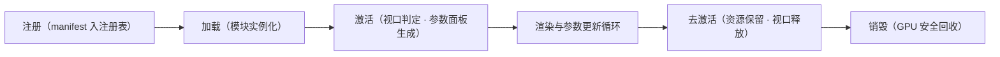
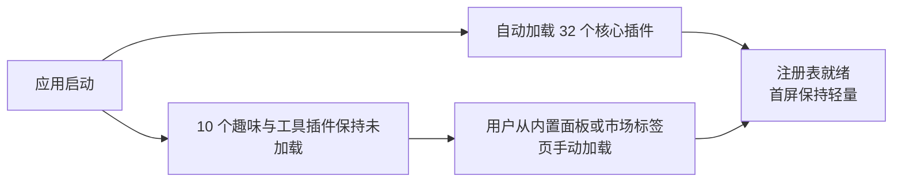
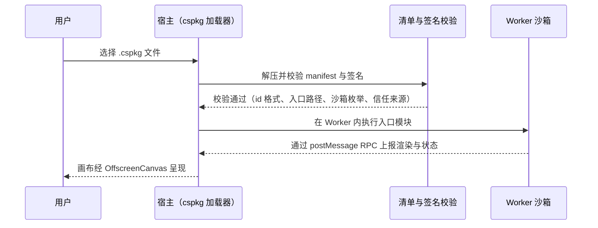
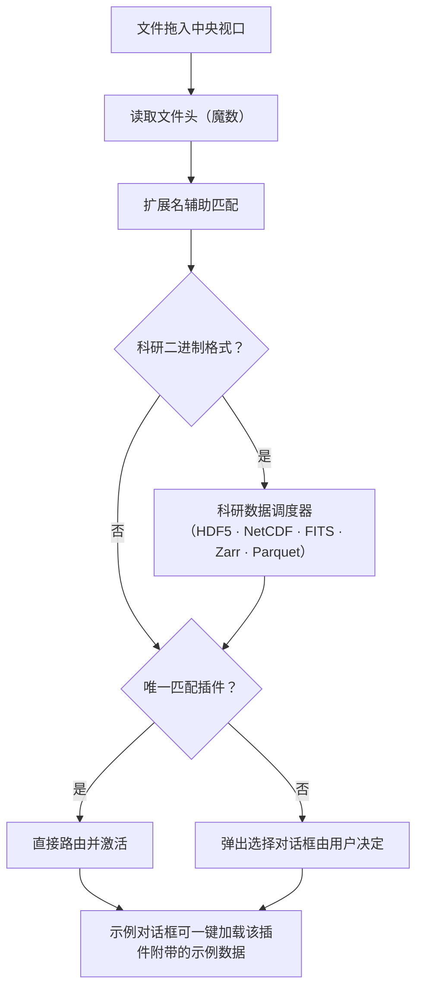

# 03 插件系统

Ergalics Studio 把"一切可视化皆插件"作为第一性设计。宿主与插件之间只有一个契约，第三方扩展与内置插件走同一套接口与生命周期。当前共有 **42 个内置插件**：32 个核心/科学插件在启动时自动加载，10 个趣味与工具插件声明 `autoload: false` 按需加载。

## 一、宿主与插件的契约

每个插件实现统一的 `Plugin` 接口（`src/types/plugin.ts`），主要方法包括：

| 方法 | 作用 |
| --- | --- |
| init / destroy | 初始化与销毁，宿主负责 GPU 安全的资源回收 |
| activate / deactivate | 激活与去激活，驱动 2D/3D 视口切换与残留帧清理 |
| render / updateParams | 绘制与参数更新（右侧面板响应式表单） |
| getParams / compute | 参数读取与计算 |
| loadData | 接收宿主分发的数据（文件路由与渲染桥接的入口） |
| renderToScene | 可选能力声明，激活时获得宿主 Three.js 场景句柄 |

宿主向插件提供 `PluginApi` 句柄，能力面如下：

| 能力组 | 内容 |
| --- | --- |
| 本地化 | 插件文案按当前语言取值，语言切换时参数面板自动重建 |
| 状态上报 | 插件向状态栏上报运行状态与进度 |
| 性能上报 | 帧时间与真实 GPU 时间进入性能监控与告警 |
| 通知 | 按严重级别的横幅与提示 |
| 文件访问 | 项目数据文件解析（项目自有文件、内置示例与代码模式文件共享同一套逻辑） |
| 参数读写 | 项目级参数的持久化存取 |
| GPU 计算面 | createBuffer、write、read、compileKernel、compilationInfo 与一次性 run（详见 06 篇） |

插件在清单中声明参数表，宿主据此自动生成本地化的响应式参数面板，支持八类控件：

| 控件 | 用途示例 |
| --- | --- |
| 范围（滑杆） | 引力常数、阻尼系数 |
| 下拉 | 场景预设、投影方式、调色板 |
| 数字 | 分箱数、步长 |
| 复选框 | 轨迹线、网格显示 |
| 文本 | 列名、标签 |
| 文件 | 附加数据选择 |
| 按钮 | 重新播种、导出 |
| 开关 | 运行 / 暂停之外的布尔状态 |

插件生命周期由插件运行时统一编排：



每个内置插件另有一键导出能力：2D 画布或 3D 场景的 PNG 快照，以及所属表格数据的 RFC-4180 CSV 导出（UTF-8 BOM，仿真类带行数上限与抽样）。

## 二、42 个内置插件

### 2.1 核心 / 科学插件（自动加载，32 个）

| 插件 | 数据格式 | 能力 |
| --- | --- | --- |
| 点云 Point Cloud | .xyz | 2D 画布，GPU 加速 |
| 三维点云 Point Cloud 3D | .xyz、.dat | Three.js 场景，高度渐变 |
| 三维曲面 3D Surface | .json、.dat、.txt | 高程场曲面 z = f(x, y)，宿主 Three.js 场景 |
| 三维体素 3D Voxel Field | .json、.dat、.txt | 三维标量场的等值面 / 半透明体素渲染 |
| 粒子 Particles | .dat | 2D 模拟，WGSL 积分器，真实 GPU 时间上报 |
| 时间序列 Time Series | .csv | 2D 折线 |
| 直方图 Histogram | .dat | 分箱与对数刻度，GPU 加速 |
| 热力图 Heatmap | .json（网格） | viridis 渐变，GPU 加速 |
| 图像查看器 Image Viewer | .png | base64 资源展示 |
| 等值线 Contour | .json（网格） | 色彩渐变加等值线 |
| 散点图 Scatter | .dat、.csv、.xyz | 2D 散点，颜色通道 |
| N-Body 引力 | .json（天体） | 三维点渲染，WGSL 全对引力内核 |
| 蛋白质互作网络 Protein Interactions | .json（网络） | 力导向布局加连通分量指标 |
| 柱状图 Bar Chart | .csv（类别、数值） | 分组柱状，方向与调色板可调 |
| 雷达 / 极坐标 Polar / Radar | .csv（维度 × 系列） | 多系列雷达 |
| 网络图 Network Graph | .csv（source、target、weight） | 力导向布局，按度数缩放节点 |
| 气泡图 Bubble Chart | .csv（x、y、size、color） | 气泡大小与颜色双通道 |
| 小提琴图 Violin Plot | .csv（group、value） | 核密度估计加箱线叠加 |
| 桑基图 Sankey Diagram | .csv（source、target、value） | 比例流带 |
| 箱线图 Box Plot | .csv（group、value） | 四分位、须与离群点 |
| 平行坐标 Parallel Coordinates | .csv（多变量） | 分类别着色 |
| 误差带 Error Band | .csv（x、y、err） | 阴影置信带 |
| 矩形树图 Treemap | .csv（层级） | 层级矩形布局 |
| QQ 图 | .csv、.dat（单列） | 正态分位比较加参考线 |
| AI 训练器 AI Trainer | .csv、.json（MNIST） | 四类模型（线性 / 非线性网络 / 逻辑回归 / 卷积），实时损失曲线，TF.js 懒加载 |
| 格子 Boltzmann 流体 LBM Fluid | .json（障碍掩膜） | D2Q9 通道流绕障碍物，WGSL 碰撞与迁移内核，卡门涡街 |
| 波动方程 Wave Equation | .json（u / 驱动网格） | 二维有限差分，WGSL leapfrog 内核，脉冲 / 双源干涉 / 双缝场景 |
| 双摆 Double Pendulum | .json（初始条件） | RK4 积分加初值差 0.001 弧度的混沌幽灵摆 |
| GeoJSON 地图 GeoJSON Map | .geojson、.json | 离线矢量地图分级设色；Albers（中国）/ Web 墨卡托 / 等距圆柱投影 |
| 电磁场 Electromagnetism | .json（电荷 / 场） | 可拖动电荷在库仑力与均匀磁场洛伦兹力下运动，回旋加速器示例 |
| 光学实验 Optics Lab | .json（光路） | 薄透镜、斯涅尔折射加色散棱镜与可拖动光屏的几何光路追迹 |
| 结构力学 Structural Mechanics | .json（桁架杆件） | 铰接桁架实时承重，杆件按轴力着色，超载断裂直至垮塌 |

### 2.2 趣味与工具插件（按需加载，10 个）

| 插件 | 类型 | 描述 |
| --- | --- | --- |
| Mandelbrot | 分形 | Mandelbrot 与 Julia 集浏览器，带调色板与缩放 |
| 螺旋线 Spirograph | 艺术 | 次摆线曲线艺术 |
| 利萨茹曲线 Lissajous | 艺术 | 动画曲线 |
| 生命游戏 Game of Life | 玩具 | 经典元胞自动机，播放、暂停、重播种，含图案预设 |
| 谐振记录仪 Harmonograph | 艺术 | 衰减正弦叠加曲线 |
| 调色板探索 Palette Explorer | 工具 | 双停靠点渐变预览与色板 |
| 科赫雪花 Koch Snowflake | 分形 | 递归线段分形 |
| 巴恩斯利蕨 Barnsley Fern | 分形 | 迭代函数系统蕨叶 |
| 烟花 Fireworks | 玩具 | 带引力与拖尾的粒子烟花 |
| Truchet 瓦片 | 图案 | 随机四分之一圆弧瓦片 |

### 2.3 侧栏学科分组

市场分类（科学 / 趣味 / 工具）对浏览而言过于粗糙，因此侧栏按**学科**再分组，映射表 `src/plugins/categories.ts` 是唯一事实来源，未登记的第三方插件回落到"图表可视化"组：

| 分组 | 数量 | 代表性插件 |
| --- | --- | --- |
| 图表可视化 charts | 13 | 散点、时间序列、热力图、等值线、柱状、气泡、雷达、网络、桑基、矩形树图、平行坐标、三维曲面、三维体素 |
| 数学统计 stats | 5 | 直方图、箱线图、小提琴图、QQ 图、误差带 |
| 物理模拟 physics | 8 | 粒子、N-Body、流体、波动方程、双摆、电磁场、光学实验、结构力学 |
| 地理 geo | 1 | GeoJSON 地图 |
| 数据与智能 data | 5 | 点云、三维点云、图像查看器、蛋白质互作网络、AI 训练器 |
| 趣味工具 fun | 10 | 见 2.2 节 |

所有仿真类插件严格数据驱动：初始为空，绝不伪造默认场景；画布给出明确的空态提示，运行按钮带数据守卫，空数据启动会收到提示而非静默空跑；"重置"只重放已加载的数据，回归作者基准构型。每个核心插件都附带示例数据集（见 `examples/data/`），在"示例"对话框中一键加载即可看到真实可视化。


## 三、市场目录与两级加载

市场目录（`src/plugins/marketplace.ts`）把每个内置插件以精选标签、流行度与分类筛选（科学、趣味、工具）的形式呈现，社区"敬请期待"条目以占位符列出；`marketplace-demo-packages.ts` 提供可真正安装的示例包。加载策略分两级：



自动加载失败可重试：插件运行时把"初始化完成"作为状态机节点，失败后注册表不会进入就绪态，用户重试不会被误判为重复加载。

## 四、第三方包（.cspkg）、沙箱与签名

`.cspkg` 包是包含 `manifest.json`、入口模块与资源的 ZIP 压缩包（fflate 打包）。加载时校验清单：必填字段、插件 id 格式、入口路径穿越防护与沙箱枚举。清单声明 `sandbox` 字段：

```jsonc
{
  "id": "com.example.analyzer",
  "name": "Analyzer",
  "version": "1.2.0",
  "author": "Example Corp",
  "description": "…",
  "entry": "dist/index.js",
  "sandbox": "isolated",        // "isolated"（默认）| "trusted"
  "formats": [{ "extension": ".dat" }]
}
```

- **isolated（默认）**：入口代码运行在 Web Worker 内，拥有独立全局作用域，无法访问宿主页面的全局变量、DOM 与状态库；画布渲染通过转移的 OffscreenCanvas 完成，宿主与 Worker 之间只走类型化 RPC 协议（`src/core/sandbox.ts` 与 `src/core/plugin-worker.ts`）。
- **trusted**：在宿主上下文中执行，拥有完整 DOM 访问权，仅建议用于自研包。

第三方插件加载与通信流程：



### 4.1 包签名与信任注册表

签名能力已落地（`src/core/plugin-signing.ts` + `src/core/crypto-primitives.ts` + `scripts/sign-cspkg.mjs`），回答的是"**这个包是谁发布的**"，与沙箱回答的"**它运行时能做什么**"互相独立——合法签名不会削弱沙箱隔离。

| 环节 | 实现 |
| --- | --- |
| 算法 | Ed25519（RFC 8032）与 SHA-256（FIPS 180-4），纯 TypeScript 在 BigInt 上自实现，不依赖 WebCrypto（各浏览器与 Node 对 Ed25519 支持不齐） |
| 签名载荷 | 规范化后的包载荷：manifest 递归排序键、去空白、丢弃 undefined 的稳定 JSON 加入口字节；签名 CLI 与浏览器校验端字节级一致 |
| 指纹 | `ed25519:<hex32>`——公钥 SHA-256 的前 16 字节 |
| 信任模型 | `verifyPackageSignature` 返回结构化结果，结论含 `unsigned` / `untrusted-key` / 通过三类；未签名包默认拒绝，未知密钥的合法签名提示用户核对指纹后显式信任 |
| 信任注册表 | 内置官方公钥常量 `OFFICIAL_TRUSTED_KEYS`，用户新增的受信密钥经 `storage.ts` 持久化，IndexedDB 不可用时优雅降级 |
| 工具链 | `node scripts/sign-cspkg.mjs --genkey <keyfile>` 生成密钥对；`<package-dir> --key <keyfile>` 签名产出 .cspkg；`--verify <file.cspkg> [--trust <keyfile>]` 复验 |

已知限制（如实记录）：Worker 与页面共享同源的 IndexedDB；当 Worker 不可用时的遗留回退方案（`new Function` 加遮蔽全局变量）只是尽力而为的近似，并非安全边界，回退启用时界面会明确告警。

## 五、文件路由

用户把任意文件拖入中央视口或插件列表时，宿主按魔数与扩展名（可选 WASM 辅助检测）识别格式并路由到匹配插件：



导入对话框本身也按文件格式过滤，未识别的文件不会进入解析器。大文件在进入解析前会先经 `src/core/chunked/` 的行窗口读取与内容指纹，配合 `parse-worker.ts` 与 `worker-pool.ts` 把解析放到 Worker 池中执行，避免阻塞主线程。

示例资产经 `exampleAssets` 与 `examples` 模块统一发现与加载；内容指纹（`citation.ts` 与存储层共用）让同一份数据的重复导入可被识别与复用。
