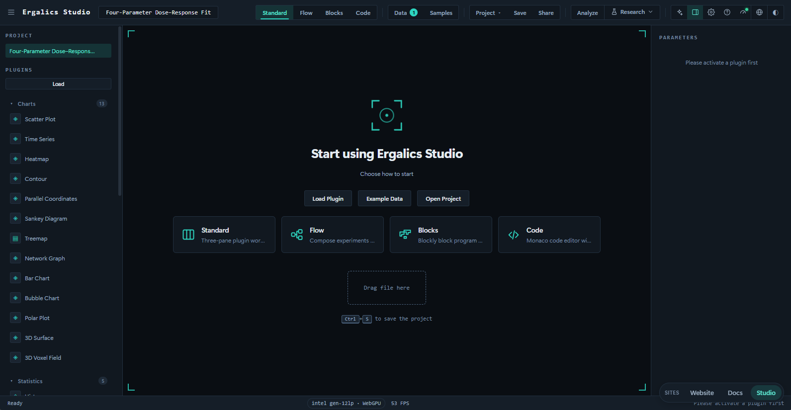
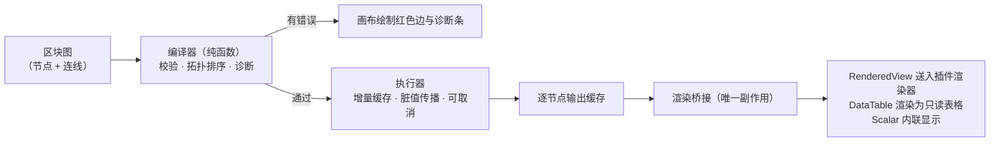
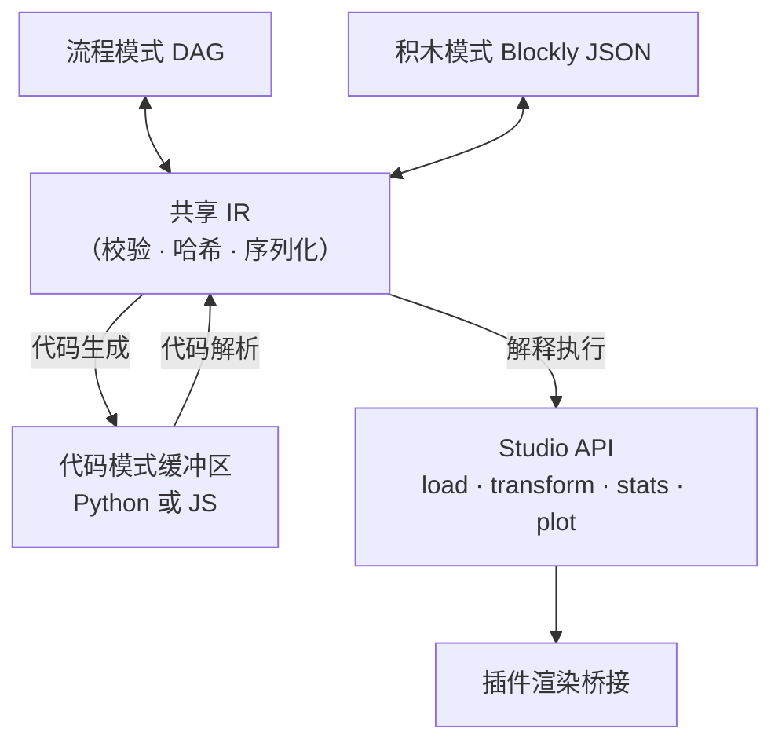

# 04 四大工作模式

Ergalics Studio 的工作台提供四种模式，由顶栏切换：标准（Standard）、流程（Flow）、积木（Blocks）、代码（Code）。四种模式共享同一套数据语义（DataTable）、同一套插件渲染器，后三种模式更共享同一份中间表示（IR）。切换模式时项目数据、插件状态与参数面板原样保留，上下文零损耗。

## 一、标准模式

默认落地体验。工作台为四区布局：顶栏（项目与模式切换）、左侧栏（项目树与插件列表）、中央视口（激活插件渲染，首次启动为拖放区）、右侧参数面板（把激活插件声明的参数转成响应式表单），状态栏常驻显示 GPU 可用性与性能指标。文件拖入后由宿主按魔数与扩展名路由，多插件匹配时弹选择框。

适合"我已经知道哪个插件能回答我的问题，只想把文件指给它"的场景。

## 二、流程模式（Flow）

可视化数据流管线编辑器。左侧调色板、中间画布（节点加边）、右侧参数编辑器、底部结果预览。整个图持久化进项目的 blockGraph 字段，重新打开自动恢复，并共享 .clproj 的自动保存与分享管线。

### 2.1 区块目录（37 个内置区块）

| 类别 | 数量 | 区块 |
| --- | --- | --- |
| 数据源 | 4 | 内置示例数据、随机数生成、网格生成、文件加载 |
| 过滤 | 3 | 数值范围过滤、条件值过滤、TopK 选取 |
| 数学 | 6 | 加、减、乘、除（列对列或列对标量）、平方根、绝对值 |
| 变换 | 5 | 列选取、列重命名、新增列、归一化、排序 |
| 统计 | 11 | 摘要统计、直方图分箱、单样本 t 检验、双样本 t 检验、配对 t 检验、单因素方差分析、Mann-Whitney U 检验、卡方独立性检验、相关分析、Cohen's d 效应量、多重比较校正 |
| 绘图 | 4 | 折线、散点、直方图、柱状（出版级绘图引擎渲染） |
| 可视化 | 4 | 散点、折线、直方图、二维点云（经渲染桥接走插件出图） |

统计区块直接调用 src/core/stats 统计内核的纯函数实现（详见 06 篇）；区块元数据（名称、描述）内建中英双语。

### 2.2 编译器与执行器

编译器是一个纯函数：结构校验（端口匹配、必需输入、类型兼容）、环检测、Kahn 式拓扑排序，错误以结构化诊断返回，画布据此绘制红色边与内联诊断条，全程不抛异常。

执行器带节点级增量缓存与脏值传播失效：修改单个区块的参数，只有它及其下游会重新执行。运行支持取消与并发去重——重复触发运行不会产生并行执行，取消会真正终止进行中的计算节点。

### 2.3 结果预览

底部预览随所选节点输出类型自适应：可视化输出走既有插件渲染器；统计输出渲染为只读表格；标量内联显示。管线有多个输出时由芯片切换器选择检视节点。

### 2.4 示例管线

11 个示例项目以真实 .clproj 文件存放在 examples/projects，构建期经 import.meta.glob 自动发现，新增示例只需放入文件并在元数据表登记：

| 示例 | 主题 |
| --- | --- |
| block-01-signal-analysis | 信号分析 |
| block-02-random-distribution | 随机分布 |
| block-03-grid-scatter | 网格散点 |
| block-04-range-filter | 范围过滤 |
| block-05-dual-pipeline | 双管线对比 |
| block-06-topk-pipeline | Top-K 选取 |
| block-07-binning-stats | 分箱统计 |
| block-08-normalize-grid | 归一化网格 |
| crystal-lattice-demo | 晶格演示 |
| particles-demo | 粒子演示 |
| point-cloud-demo | 点云演示 |

## 三、积木模式（Blocks）

类 Scratch 的积木编辑器，面向学习者与想要命令式体验的用户。唯一执行入口是绿色"运行时"帽子区块，帽子下方未连接的孤立区块永不运行，从根本上杜绝"误执行破损代码"。33 种内置积木按九个类别组织：

| 类别 | 积木 |
| --- | --- |
| 开始 | 运行时帽子区块（唯一入口） |
| 数据 | 载入 CSV、载入 XYZ、随机数、范围、列表 |
| 变量 | 赋值与读取 |
| 运算符 | 算术、比较、逻辑、一元 |
| 变换 | 归一化、排序、列选取、过滤 |
| 统计 | 摘要、直方图 |
| 绘图 | 散点、折线、直方图、点云 |
| 控制流 | 如果、重复、当循环、遍历 |
| 工具 | 打印、原始文本 |

技术要点：

- Blockly 13 驱动画布，包为懒加载分包（约 828 KB），不影响标准与流程模式首屏。
- 区块名称、提示、下拉选项与工具箱类别经 Blockly 的 BKY 键系统本地化，切换语言时以重新标注的积木重建工作区，有专门单元测试验证。
- 运行按钮提供实时结果预览、变量面板与控制台面板三张卡片。
- 5 个内置示例程序（星系散点、遥测折线、随机直方图、归一化散点、循环打印）经顶栏"示例"对话框加载。
- 积木图编译为共享 IR 后由内置解释器执行，解释器调用与代码模式相同的 Studio API。

## 四、代码模式（Code）

真正的 Python 编辑器。Monaco 编辑器提供 Python 语法高亮、明暗主题、自动换行与 studio 接口自动补全；运行时是 Pyodide Web Worker 中的真实 CPython。

studio 模块作为正经的可导入模块注入（注册进 sys.modules），项目数据文件以 _FILES 形式送入 Worker，因此 studio.load 可以同步解析文件。studio 接口与积木模式完全一致：

| 方法 | 说明 |
| --- | --- |
| load | 装载项目数据文件为表格 |
| random / range | 生成随机数与整数序列 |
| normalize / sort / select / addColumn / filter | 表格变换 |
| summary / histogram | 摘要统计与分箱 |
| plot | 绘图（经渲染桥接走插件渲染器） |
| print / notify | 控制台输出与通知 |
| getParam / setParam | 项目参数读写 |

其他能力：

- **REPL**：控制台输入可求值单个表达式或语句，无需重跑整个程序。
- **中断**：停止运行会终止并重启 Worker，失控循环不会卡死页面；Worker 的引导地址与引导 Promise 做了记忆化，重启不重复初始化。
- **9 个示例程序**位于 examples/code（EDA 管线、蒙特卡洛估圆、信号平滑、遥测探索、星系散点、随机直方图、范围循环、添加列绘图、归一化过滤），经"示例"对话框加载。

## 五、三模式互转（共享 IR）

IR（src/editor/ir，含校验、哈希与序列化）是积木、流程、代码三种模式的唯一事实来源，各模式与 IR 之间都有纯函数往返转换：

| 转换 | 模块 |
| --- | --- |
| IR 与流程 DAG 互转 | src/editor/flow/convert.ts（irToFlow、flowToIR） |
| Blockly JSON 与 IR 互转 | src/editor/block/convert.ts |
| 代码缓冲区解析回 IR | src/editor/code/parse.ts（无法解析的行保留为原始代码节点） |
| IR 生成代码 | src/editor/codegen（JS、Python、R 三个生成器） |
| IR 直接解释执行 | src/editor/runtime/interpreter.ts（调用与流程区块相同的 Studio API） |

在流程模式搭一条管线，切到积木就能看到同样的逻辑以积木呈现，跳到代码就能看到生成的 Python；反向亦然。一个专门的 sync-threeway 单元测试为双向往返兜底。

代码生成器按目标语言处理方言差异：Python 生成器输出真实的 Python 语法，R 生成器处理 R 的语法习惯（循环写法、真值字面量、整除与逻辑运算符等），JS 生成器输出可直接求值的脚本。代码模式编辑的缓冲区内容还能反向解析回 IR，使"换一种表达方式理解同一逻辑"成为一键操作。
