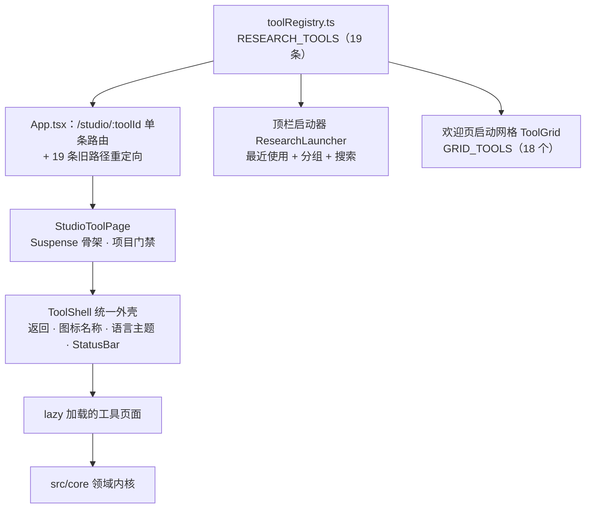
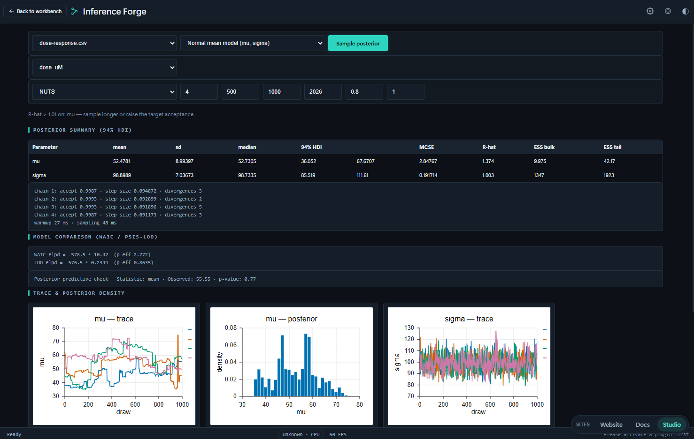
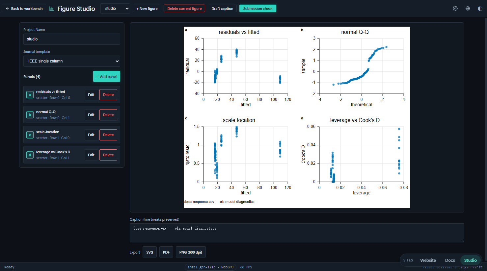
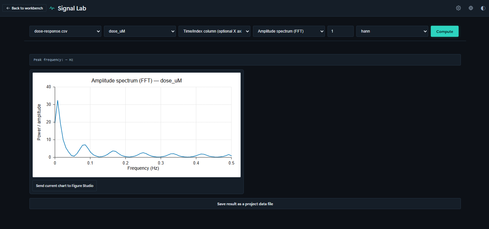
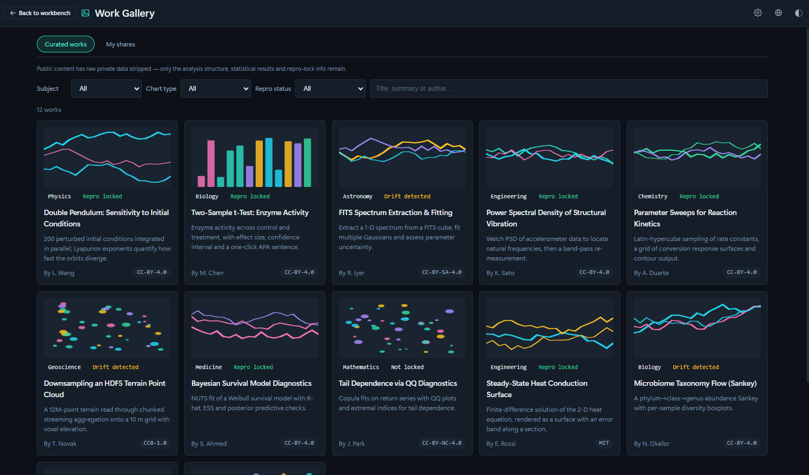
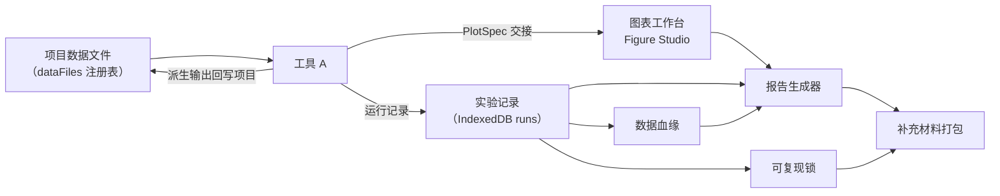

# 05 科研工具集

工作台（04 篇）解决的是"把一份数据变成一张图"，而一次完整的科研工作远不止于此：数据要先体检与清洗，模型要拟合与比较，结论要能锁定环境、打包交付，还要能被别人原样重跑。这些环节在 Ergalics Studio 中以**科研工具集**的形式提供——19 个独立工具，按五个分组组织，统一挂在 `/studio/:toolId` 路由下。

工具集与工作台共享同一套底座：同一个 `.clproj` 项目、同一批数据文件、同一组 `src/core` 内核、同一条插件渲染通路。区别只在界面形态——工作台是插件式的通用画布（四区布局加参数面板），工具集是**任务式整页**，一个页面把一项科研任务走完。

| 维度 | 工作台 | 科研工具集 |
| --- | --- | --- |
| 入口 | `/workbench` | `/studio/<toolId>` |
| 形态 | 四区布局 + 参数面板，插件可任意切换 | 任务式整页，每页一个明确的科研目标 |
| 组织 | 按插件（42 个，见 03 篇） | 按学科分组（5 组 19 个工具） |
| 数据 | 项目数据文件 + 拖入即路由 | 复用同一份项目数据文件 |
| 模式 | 标准 / 流程 / 积木 / 代码四种（见 04 篇） | 不使用模式切换，页面自带交互 |
| 适用 | 探索、"我该用哪个插件" | 交付、"我要完成哪一步" |

## 一、统一注册表

`src/pages/research/toolRegistry.ts` 是工具集的**唯一事实来源**：每个独立科研界面在这里声明一次，由 `/studio` 路由、顶栏启动器与欢迎页启动网格三处共同消费。新增一个工具的成本是"注册表加一条记录 + i18n 加标题与描述两个键"，不需要改动路由、导航或启动器。

`ResearchTool` 记录的字段：

| 字段 | 含义 |
| --- | --- |
| `id` | 稳定标识，同时是 `/studio/<id>` 的路径段 |
| `path` | 规范路由 `/studio/<id>`，由 id 推导 |
| `legacyPath` | 改造前的 hash 路径（默认 `/<id>`），作为客户端重定向保留，使旧书签不失效 |
| `icon` | `ToolIconKind` 图标种类 |
| `titleKey` / `descKey` | i18n 键；描述默认取 `tool.<id>.desc` |
| `group` | 五个学科分组之一 |
| `inGrid` | 是否出现在欢迎页启动网格（默认是） |
| `requireProject` | 无激活项目时是否渲染 `EmptyProject` 门禁页（默认否） |
| `component` | `React.lazy` 包装的页面组件，每个工具一个独立分包 |

配套导出：`GRID_GROUPS`（分组顺序）、`GRID_TOOLS`（入网格的子集，19 减 1 为 **18** 个）、`getTool(id)` 与 `TOOLS_BY_LEGACY_PATH`。

**路由**。`App.tsx` 只声明 6 条显式路由：`/`（欢迎页）、`/workbench`（工作台）、`/studio/:toolId`（全部科研工具）、`/settings`、`/plugin/:pluginId`、`/share/:payload`，其余一律回落到欢迎页。19 条旧路径的重定向由 `RESEARCH_TOOLS` 在模块加载时**自动生成**，因此数量永远与注册表一致，不存在手工维护的重定向表。应用使用 `HashRouter`，因此深度链接形如 `#/studio/uncertainty`。

**项目门禁**。`StudioToolPage` 承担三件事：为懒加载页面提供 `Suspense` 骨架；深度链接或冷启动时**一次性**恢复最近项目（与工作台行为一致）；对声明了 `requireProject` 的工具，在项目未激活时渲染 `EmptyProject`（明示的"新建 / 打开"动作）而不是自动创建一个空项目——避免用户在深链接进入时莫名其妙多出一个空项目。未知的 `toolId` 渲染 `EmptyState`（"工具不存在"），而不是白屏或抛错。

**外壳**。所有工具页共用 `ToolShell`：顶部是返回工作台、工具图标与名称、语言与主题切换；主体是工具自己的内容区（居中列、页面级滚动）；底部是工作台同一个 `StatusBar`，常驻显示 GPU / WASM / 存储状态与帧率。

## 二、五个分组的 19 个工具

分组按学科划分，互斥且穷尽。下表是注册表中的完整清单（名称与用途取自实际发布的中文 i18n 文案）：

| 分组 | 工具 id | 名称 | 用途 | 需项目 |
| --- | --- | --- | --- | --- |
| **测量与评估**（2） | `uncertainty` | 不确定性套件 | 蒙特卡洛、Bootstrap 与 GPU 加速的置信区间 | |
| | `profiler` | 数据画像 | 数据体检：缺失值、分布、相关性与质量画像 | |
| **建模与推断**（4） | `model-lab` | 模型工作台 | 回归建模、拟合诊断与多模型对比 | |
| | `inference` | 贝叶斯推断 | 贝叶斯推断模板与 MCMC 后验诊断 | |
| | `model-inference` | 模型推理 | 在浏览器内用 WebGPU 运行 ONNX 模型并查看推理结果 | |
| | `sweeps` | 参数扫描 | 参数网格与拉丁超立方扫描、响应面 | ● |
| **数据与谱系**（5） | `sql` | SQL 数据工作台 | 直接对项目数据文件运行 SQL 查询 | ● |
| | `lineage` | 数据血缘 | 文件、运行与产物的血缘图谱 | |
| | `figures` | 图表工作台 | 多面板出版级图表排版与 SVG / PDF / PNG 导出 | ● |
| | `analysis` | 数据分析 | 假设检验、相关性与基础统计分析 | |
| | `cleaning` | 数据清洗向导 | 分步引导完成表格数据的转换、清洗与去重 | ● |
| **信号与记录**（3） | `signal` | 信号实验室 | 频谱、滤波与时域信号处理 | ● |
| | `notebook` | Notebook | Markdown + Python 的可复现实验记录 | ● |
| | `runs` | 实验记录 | 实验运行台账、指标差异与成对对比 | |
| **报告与复现**（5） | `report` | 报告生成器 | 叙述、图表与结果打包成交互报告 | ● |
| | `reprolock` | 可复现锁 | 环境快照与可重复性指纹锁定 | |
| | `supplement` | 补充材料打包 | 数据、代码与许可一键打包为补充材料 | |
| | `course` | 课程模式 | 布置作业、收集并批改学生的离线实验成果 | ● |
| | `gallery` | 作品画廊 | 浏览并重新打开社区分享的可复现作品 | |

合计：测量与评估 2 + 建模与推断 4 + 数据与谱系 5 + 信号与记录 3 + 报告与复现 5 = **19**。其中 8 个绑定项目（`sweeps`、`sql`、`figures`、`signal`、`notebook`、`report`、`course`、`cleaning`），`analysis` 不进入启动网格（`inGrid: false`），因为它同时由工作台顶栏的独立按钮发起，避免同一入口出现两次。

### 2.1 测量与评估

- **不确定性套件（`uncertainty`）**——把"这个数字有多确定"变成可计算的对象。提供 Bootstrap 置信区间、蒙特卡洛传播与 MCMC 采样三条路径，并给出 R-hat、有效样本量 ESS、HDI 与 MCSE 等收敛诊断；样本量足够大时自动切到 WGSL GPU 引擎（每链一个 workgroup），未达阈值或设备不可用时回落到 CPU，两条路径在同一随机数序列下结果在数值容差内一致（内核细节见 07 篇）。
- **数据画像（`profiler`）**——数据体检。流式单遍计算：数值列用 Welford 递推求精确均值与方差、蓄水池采样求分位数与 MAD，并以修正 z 分数标记离群；文本列用 HyperLogLog 估计基数、Space-Saving 求 Top-K；表级给出 Pearson / Spearman 相关与重复率，最终综合成 0–100 的确定性质量分与问题清单，按内容指纹缓存以支持重复打开。

### 2.2 建模与推断

- **模型工作台（`model-lab`）**——拟合与诊断。支持普通最小二乘（Householder QR）、逻辑回归（IRLS）、岭回归（K 折交叉验证选参）与多项式拟合，产出含估计值、标准误、p 值与置信区间的系数表，并附 2×2 残差诊断图（残差-拟合、QQ、尺度-位置、残差-杠杆），支持多模型横向对比。
- **贝叶斯推断（`inference`）**——Inference Forge。HMC / NUTS 采样器（NUTS 带 U 形回旋判据与 Dual Averaging 步长自适应，无须手工设步数）、声明式似然模板配数据尺度化的弱先验、R-hat 与 bulk / tail-ESS 等后验诊断，以及 WAIC 与 PSIS-LOO 模型比较。

*Inference Forge 在浏览器内（WebAssembly）跑 NUTS 采样，并把收敛情况讲完整：后验摘要给出 94% HDI、MCSE、R-hat 与 ESS，另有逐链诊断、WAIC / PSIS-LOO 模型比较、后验预测检验，以及轨迹图与后验密度图。*

- **模型推理（`model-inference`）**——把已训练好的模型搬进浏览器：用 WebGPU 运行 ONNX 模型并查看推理结果，适合"模型在别处训练、结论要在这里复现"的场景。
- **参数扫描（`sweeps`）**——`expandPlan` 把扫描计划展开为确定性设计点：全网格 / 列表轴走完整笛卡尔积，全拉丁超立方轴按维度分层抽样；混合 lhs 与 grid 的方案被显式拒绝，因为样本量此时没有无歧义的定义。执行后可看响应面。

### 2.3 数据与谱系

- **SQL 数据工作台（`sql`）**——DuckDB-WASM 引擎，首次使用时懒加载；项目数据文件注册进 DuckDB 虚拟文件系统并直接暴露为表，因此可以对 `.clproj` 里的文件写 SQL。查询支持超时与 `AbortSignal`，中止或超时会终止 Worker 并丢弃单例，下次调用重建实例——一次跑疯的查询不会拖垮整个页面。
- **数据血缘（`lineage`）**——以运行记录上的文件 id 把项目文件（源）连到运行（变换），绘制成 Sugiyama 式分层 DAG（最长路径分层、单趟重心排序、行居中）。领域层无 React / store / DOM 依赖，画布可独立测试。
- **图表工作台（`figures`）**——出版级组图。`FigureSpec` 是挂在期刊模板网格（IEEE / Elsevier 栏宽、色盲友好调色板）上的多面板容器，`composeFigure` 渲染为单张独立 SVG（嵌套面板 viewport 加 a / b / c 面板标签），`exportFigure` 处理 SVG / PDF / PNG-600dpi 下载。组图只重新定尺寸，绝不修改原 `PlotSpec`。

*图表工作台在 IEEE 单栏模板上排一张 2×2 的 OLS 诊断组图：逐面板布局、图注草拟、投稿前检查，以及 SVG / PDF / 600dpi PNG 导出。*

- **数据分析（`analysis`）**——假设检验、相关性与基础统计分析的常规入口：t 检验族、单因素方差分析、Mann-Whitney U、卡方独立性检验、Cohen's d 效应量，以及 Bonferroni 与 Benjamini-Hochberg 多重比较校正；结果可直接转写成中英双语的出版级句子。
- **数据清洗向导（`cleaning`）**——分步引导。步骤模型是五类可序列化操作：类型转换、缺失值策略（删除 / 均值 / 中位数 / 零 / 前向填充）、离群标注（IQR / z 分数）、去重、列重命名。每一步永不改写输入表，因此可以逐步前进、回退、跳转或"撤销该步"；质量侧的期望契约由 `data-quality` 提供（见 07 篇）。

### 2.4 信号与记录

- **信号实验室（`signal`）**——频谱、滤波与时域处理。基 2 FFT 与幅值谱（与 GPU 端 `fftKernelWGSL` 数学一致）、Hann / Hamming / Blackman 等窗函数、Savitzky-Golay 平滑与滑动平均、自相关 ACF 与偏自相关 PACF，以及经典加性时序分解 x = 趋势 + 季节 + 残差。滤波后的列可作为派生文件保存回项目，并自动进入血缘图。

*信号实验室对一组剂量-响应序列做频域分析——图中为幅值谱（FFT）；算完的图可以直接送往图表工作台，也可以作为派生文件保存回项目。*

- **Notebook（`notebook`）**——Markdown 与 Python 单元混排的可复现实验记录，执行走代码模式同一个 Pyodide 运行时，因此 notebook 与脚本看到的是同一个 `studio` API；单元列表持久化在 `project.state.notebook`。
- **实验记录（`runs`）**——全工具的运行台账。流程、积木、代码、笔记本、扫描、不确定度、建模、推断的每一次执行都会留下耐久快照（参数、指标、耗时、来源），支持指标差异与成对对比。记录存于 IndexedDB 的 `runs` 存储而**不**写进 `.clproj`，使项目文件保持小巧，并随项目删除一并清理。

### 2.5 报告与复现

- **报告生成器（`report`）**——`buildReport` 把有序章节（标题、Markdown、图表工作台的图、数据表、运行摘要、筛选器）构建成**单一自包含 HTML**：内联 CSS、内联 SVG、内联 JSON 数据与零依赖原生 JS 控制器。所有用户字符串先转义，内嵌 JSON 以 `` 载荷逃逸——报告可以安全地直接投递给他人。
- **可复现锁（`reprolock`）**——导出与校验 `repro.lock`：数据指纹、参数哈希、种子与代码快照，支持五类漂移判定与一键重跑；环境快照（版本、平台与内核可用性）一并纳入锁文件，使"漂移发生在数据还是环境"有明确答案。
- **补充材料打包（`supplement`）**——`manifest.json`（项目元数据、运行记录、血缘图、作者与许可表单）加可选的原始数据文件与代码会话，用 fflate 打成研究者随论文一起上传的 ZIP。
- **课程模式（`course`）**——本地优先的教学闭环：教师创建课程（由本地身份字符串标识，无账号体系）、发布绑定学科模板的作业；学生领取任务、在项目中作业并提交运行结果的 `repro.lock` 快照；教师查看学生 × 作业矩阵、记录评分与评语，并把整个班级按学生一目录导出为包。持久化在 IndexedDB `courses` 存储。
- **作品画廊（`gallery`）**——本地"我的分享"存储（localStorage），记录分享出去的作品元数据与净化后的快照 HTML，使详情弹窗可离线重开。v1 不上传任何内容，下架只做标记（保留审计轨迹）并从所有列表过滤。

*作品画廊陈列按学科整理的可复现作品，每件标注主题与可复现锁状态（已锁定 / 检测到漂移 / 未锁定）以及作者与许可，便于发现与引用。*

## 三、入口与导航

同一份注册表驱动三个入口，行为统一：

- **欢迎页启动网格**（`/`，`ToolGrid`）——按五个分组陈列 18 个工具卡片，附过滤框；搜索时分组被打平成一列。卡片点击即记录使用并跳转 `/studio/<id>`。
- **顶栏科研启动器**（工作台与工具页顶栏的"科研▾"，`ResearchLauncher`）——取代了早期的平铺式工具菜单。顶部是"最近使用"分组（最近 3 个，带角标），其下按学科分组列出全部工具；每项显示图标、名称与一行描述，使工具在打开前就能被识别；支持过滤输入与完整键盘导航。
- **旧路径重定向**——改造前形如 `#/uncertainty` 的书签会被自动生成的重定向送到 `#/studio/uncertainty`。

"最近使用"由 `src/core/recentTools.ts` 维护，存储在 localStorage（键 `ergalics:recent-tools`），最多保留 8 条、界面只展示前 3 条——留出余量是为了让裁剪永远不产生空位。

## 四、工具之间的流转

工具是分立的页面，但**不是孤岛**。它们通过三条共享通道协作，这也是把 19 项能力放在同一注册表下的实际意义：

- **共享数据文件注册表**。`src/core/dataFiles.ts` 让项目自有文件、内置示例与代码模式的 `_FILES` 走同一套解析逻辑；`src/pages/research/researchUi.ts` 是这一层之上的薄胶水（无 React 依赖），负责"装载表格并识别数值列""把 PlotSpec 送进图表工作台""把派生输出组装成 CSV 存回项目"。因此数据清洗的结果能被信号实验室直接读取，滤波后的列又能被模型工作台拟合。
- **PlotSpec 交接**。任何工具画出的图都是同一个 `PlotSpec` 数据结构，可以被图表工作台接收为组图的一个面板，从而复用期刊模板、面板标签与矢量导出。
- **实验记录作为主干**。每一次执行都进入 `experiment` 台账，血缘图据此把文件与运行连成 DAG，报告生成器再从中取运行摘要。科研工具集的"可复现"因此不是某几个功能，而是贯穿全部工具的一条数据流。

## 五、小结

19 个工具覆盖了从数据入库到论文交付的完整链路：**测量与评估**回答"结果有多确定"，**建模与推断**回答"数据支持什么结论"，**数据与谱系**回答"数据从哪来、改过什么"，**信号与记录**回答"过程是否被完整记录"，**报告与复现**回答"别人能否原样重跑"。它们共享同一个项目、同一批数据文件、同一组 `src/core` 内核与同一条插件渲染通路，因此从工作台切换到工具集（或反向）时，上下文零损耗。

每个工具背后的算法内核、依赖库与导出格式，见 07 篇《科学计算子系统》；工具的运行记录、血缘与复现链条如何被测试与门禁约束，见 08 篇《测试与质量保障》。
