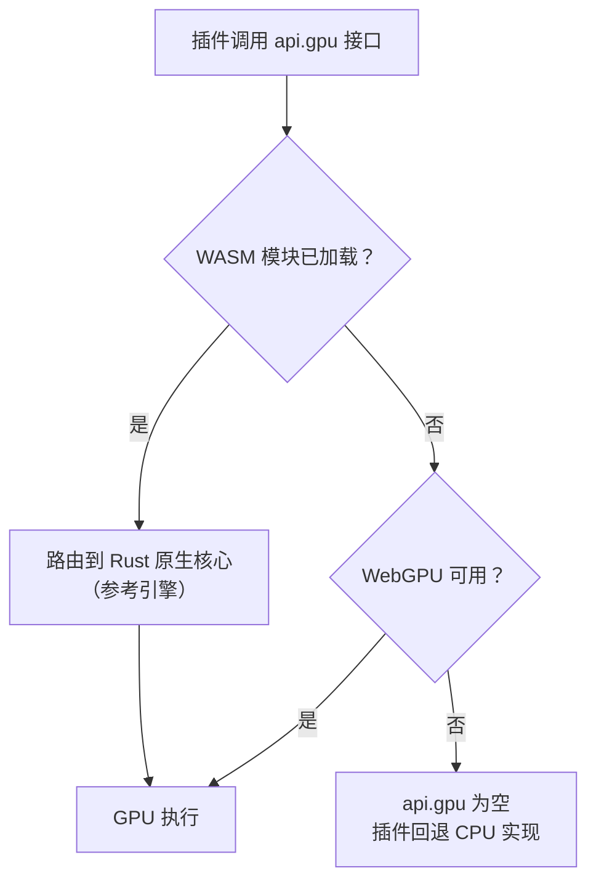

# 06 GPU 计算与原生核心

Ergalics Studio 的计算加速由两层构成：Rust 编译的 WebAssembly 原生核心（`native/ergalics-core`）提供设备管理与计算内核的参考实现；宿主侧的计算服务（`src/core/gpu.ts`、`src/core/compute.ts` 与 `src/core/gpu-kernels.ts`）把这套能力以统一接口暴露给插件与领域内核，并在 WASM 或 WebGPU 缺失时逐级降级到纯 CPU 路径。

## 一、Rust 原生核心

`native/ergalics-core`（crate 版本 0.1.0，edition 2021，`crate-type = ["cdylib", "rlib"]`）编译目标为 `wasm32-unknown-unknown`，经 wasm-bindgen 0.2 绑定到 `src/native`（构建产物，不入库）。WebGPU 绑定依赖 web-sys 的实验性 GPU API 面，通过 Cargo feature 显式开启。依赖为 wasm-bindgen、wasm-bindgen-futures、js-sys、web-sys、console_error_panic_hook、serde 与 serde_json；release profile 开启 `lto`、`codegen-units = 1` 与 `opt-level = 3`。Rust 源码按职责分为五个模块：

| 源文件 | 职责 |
| --- | --- |
| lib.rs | 对外导出、版本查询（core_version）与初始化 |
| device.rs | GpuDeviceManager 与 GpuInfo：适配器与设备获取，`webgpu_available` 探测，带 CPU 回退选项 |
| buffer.rs | GpuBuffer：以显式 usage 掩码创建存储 / 只读 / 均匀缓冲，write 上传、read 经专用回读缓冲读回 |
| compute.rs | KernelDescriptor 与 BindingDescriptor、ComputeKernel 编译、绑定组物化与 dispatching，ComputeQueue 封装 |
| utils.rs | detect_file_kind 等辅助（基于魔数的文件类型检测）与日志 |

面向 JavaScript 的暴露面：

| 能力 | 说明 |
| --- | --- |
| GpuDeviceManager / GpuInfo | 适配器与设备获取，带 CPU 回退选项；`webgpu_available` 供降级决策 |
| GpuBuffer | 显式 usage 掩码的缓冲创建（create_storage、create_readable_storage、create_uniform）、上传与经回读缓冲的读取 |
| KernelDescriptor / BindingDescriptor | 描述计算内核与缓冲绑定（uniform、storage、read-only-storage，动态偏移与最小绑定尺寸） |
| ComputeKernel::compile | 从绑定描述符构建真实的 GPUBindGroupLayout，编译 WGSL 模块并创建管线 |
| ComputeKernel::bind_group | 从保留的布局物化绑定组（第 i 个缓冲对应第 i 个绑定） |
| ComputeKernel::run | 一次调用完成绑定组、dispatch 与提交；dispatch 方法留给宿主自管命令编码器 |
| compilation_info | 异步暴露 WGSL 编译诊断（错误或警告加行列号） |
| detect_file_kind | 基于魔数的文件类型检测，供加载器使用 |

## 二、宿主侧计算服务

`src/core/gpu.ts` 持有适配器与设备生命周期（`initGpu` / `getGpuBackend` / `resetGpu` / `subscribeGpu`），负责 CPU 回退与显存不足跟踪。其上的 `src/core/compute.ts` 是面向插件的计算面（即 `PluginApi.gpu`）：`createBuffer`、`write`、`read`、`compileKernel`、`compilationInfo` 与一次性 `run`。路由逻辑：

> 当 WebGPU（或 WASM 模块）不可用时，`api.gpu` 为 `undefined`，插件回退到 CPU 实现——行为一致，不要求 GPU 存在。

这一设计保证开发与生产环境的加速计算均可用：Rust 核心始终是参考引擎，WebGPU 直连是加速路径，而每个内置插件的 CPU 回退跑的是与 GPU 内核数学一致的实现。

## 三、可复用 WGSL 内核

`src/core/wgsl.ts` 收纳可复用的 WGSL 计算内核，并配套与内核数学一致的宿主侧打包 / 解包辅助函数供 CPU 回退使用。当前共 **13 个内核**：

| 内核 | 数学内容 | 主要使用方 |
| --- | --- | --- |
| particleKernelWGSL | 交错式 [x, y, vx, vy] 单缓冲积分 | 粒子插件 |
| nbodyKernelWGSL | 三维全对引力 O(N²) 直接求和 | N-Body 引力插件 |
| histogramKernelWGSL | 分箱计数 + 对数刻度 | 直方图插件与统计区块 |
| heatmapKernelWGSL | 网格标量到颜色映射（viridis 停靠点） | 热力图插件 |
| pointCloudKernelWGSL | 点云投影与密度输出 | 点云插件、百万级点云增强 |
| fluidCollideKernelWGSL | D2Q9 格子 Boltzmann 碰撞 | 流体插件 |
| fluidStreamKernelWGSL | D2Q9 迁移 | 流体插件 |
| fluidCurlKernelWGSL | 涡量计算（涡街可视化） | 流体插件 |
| waveKernelWGSL | 二维波动方程 leapfrog 时间推进 | 波动方程插件 |
| matmulKernelWGSL | 分块矩阵乘法（TILE = 16） | 领域内核线性代数加速 |
| fftKernelWGSL | 按级迭代的基 2 FFT（最大 N = 4096） | 信号实验室 |
| kmeansKernelWGSL | K-means 指派与质心累加 | 数据画像与聚类 |
| binningKernelWGSL | 键值分箱聚合（sum / mean / count） | 分箱统计与扫描 |

两种典型的内核调用路径：

1. **单缓冲路径**（粒子演示）：上传交错式数据加均匀参数，dispatch WGSL 积分器，读回结果并上报真实 GPU 时间。
2. **乒乓缓冲路径**（N-Body 演示）：成对缓冲交替读写，每个积分步完全留在设备上，无逐步回读开销。

以 N-Body 为例的逐步流程：

### 3.1 引擎选择与数据规模阈值

GPU 的收益来自算力，但上传与回读有固定开销，小规模数据在 GPU 上反而更慢。`src/core/gpu-kernels.ts` 因此提供统一分派层与一组数据规模阈值，`auto` 模式下低于阈值自动走 CPU：

| 内核 | 阈值单位 | 阈值 |
| --- | --- | --- |
| matmul | 输出元素数（m × n） | 16384（128 × 128） |
| fft | 复数样本数 | 1024 |
| kmeans | 点数 | 2048 |
| binning | 行数 | 10000 |

阈值判断还会叠加实时设备可用性（`getGpuBackend()`），并把引擎选择写入运行记录，使"这一次是谁在算"可追溯。`src/core/pointcloud-gpu.ts` 在此之上提供百万级点云的预算控制与自动降采样策略，`src/core/mesh3d.ts` 提供三维网格数据管线的纯函数实现。

## 四、端到端数值验证

GPU 路径不是摆设：`verify-webgpu` 端到端套件在无头 Edge（SwiftShader 软件渲染）中驱动真实 WebGPU 通路，用数值基准比较 GPU 结果与 CPU 积分器，误差要求在约 2e-6 以内；另有应用集成步骤点击粒子插件并断言出现 wasm 引擎的 GPU 提示。单元测试层覆盖每个 WGSL 模板的生成、参数打包、输出尺寸与 CPU 回退的一致性，以及 GPU 与 CPU 两条路径的数值一致性比对（内核级与领域级两层）。

## 五、构建与降级说明

构建命令链为：先执行 `build:wasm` 将 Rust 核心编译进 `src/native`，再进行类型检查与 Vite 生产构建。只构建前端可跳过 WASM 步骤（`build:web`）。持续集成环境不安装完整 Rust 工具链，由存根生成脚本（`make-wasm-stub.mjs`）提供占位 WASM 模块。

当 WASM 模块缺失时前端优雅降级：欢迎页硬件自检会如实报告 WebGPU、WASM 与 IndexedDB 的可用性；计算路由自动改走原生 WebGPU API 或 CPU 实现；插件在无 GPU 环境下以 CPU 完成同样的数学，行为一致。三级降级路径总结：

| 档位 | 条件 | 计算路径 |
| --- | --- | --- |
| 参考引擎 | WASM 模块已加载 | Rust 原生核心 |
| 加速路径 | WebGPU 可用（含经 WASM 或直连） | GPU 内核 |
| 兜底路径 | 两者皆缺 | 与内核数学一致的 CPU 实现 |
