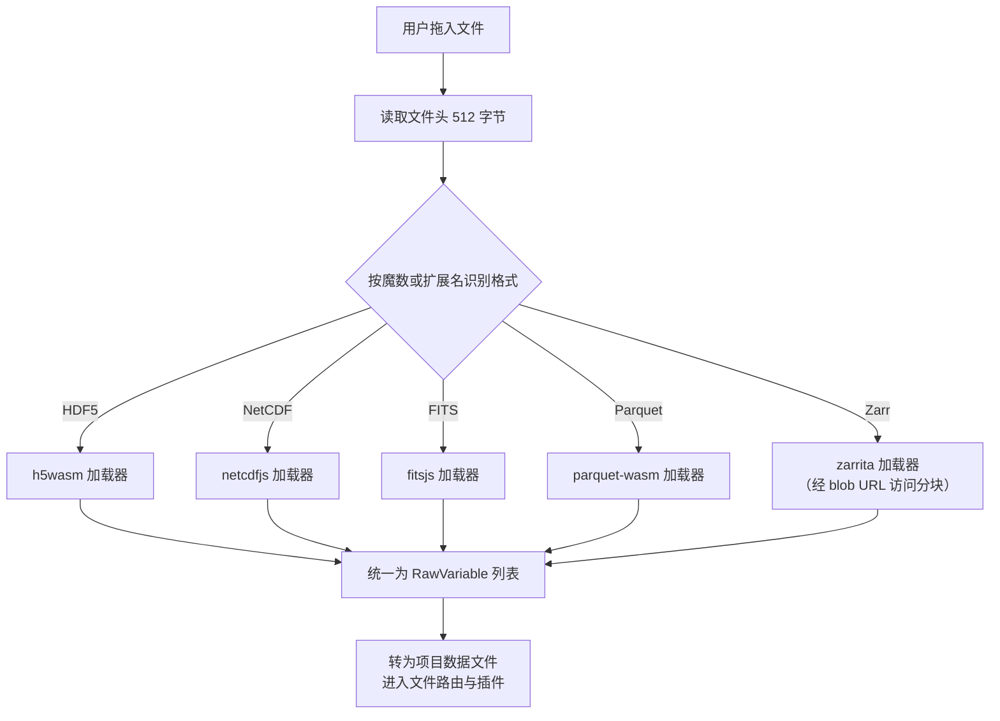
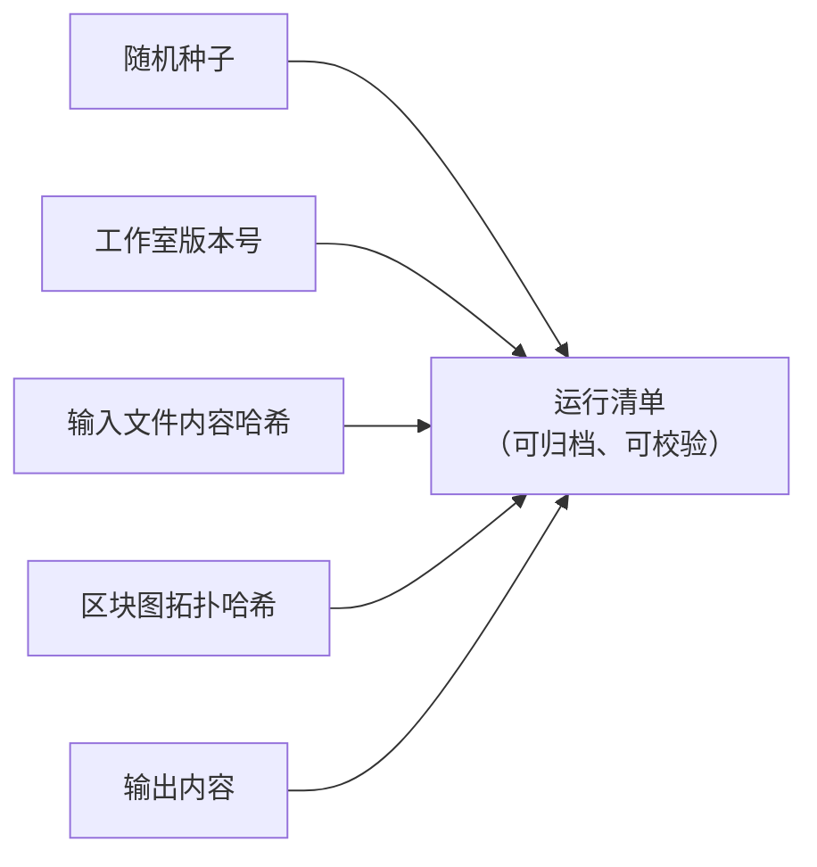

# 07 科学计算子系统

`src/core` 下除横切服务外，另有 **33 个领域子系统目录**，全部为纯 TypeScript、少 DOM、可在 Node 环境用 Vitest 直接测试。它们被区块系统、Studio API、科研工具页与交付管线共同消费，是产品从"能画图"走向"可用于真实科研"的能力层。

## 一、内核总览

| 分组 | 子系统 |
| --- | --- |
| 数学与数据 | stats（统计）、units（单位与量纲）、signal（信号处理）、model（回归建模）、inference（贝叶斯推断）、uncertainty（不确定度）、profiler（数据画像）、data-quality（数据质量）、cleaning（数据清洗） |
| 数据入口 | io（科研二进制 I/O）、chunked（分块读取）、sql（DuckDB 工作台） |
| 交付与复现 | plot（出版级绘图）、figure（组图）、submit（投稿检查）、report（报告构建）、package（补充材料）、notebook（笔记本）、repro（可复现性）、lineage（数据血缘）、experiment（实验记录）、sweep（参数扫描） |
| 教学与社区 | course（课程模式）、gallery（作品长廊）、templates（学科模板） |
| 平台内核 | errors（错误分类法与 Result）、validation（校验框架）、bench（性能基准）、ai（AI 助手策略）、pyodide（Python 运行时）、r（R 运行时）、monaco（编辑器宿主）、theme-pack（主题包） |

## 二、统计内核（src/core/stats）

统计内核消费普通数值数组、DataTable 或 Dataset，返回结构化结果，全部为纯函数实现。公共出口按模块划分：

| 模块 | 能力 |
| --- | --- |
| descriptive | 均值、方差、标准差、中位数、分位数、摘要统计、均值置信区间（t 分布临界值经 studentTInv 求得） |
| special | 特殊函数：不完全伽马与贝塔函数、正态与 t 分布等累积分布及其逆函数（供检验与功效计算复用） |
| tests | 单样本 t 检验、双样本 t 检验（Welch 校正自由度）、配对 t 检验、单因素方差分析、Mann-Whitney U 检验、卡方独立性检验，返回含统计量、p 值与自由度的结构化结果 |
| effect | Cohen's d 效应量、Pearson 与 Spearman 相关 |
| correction | Bonferroni 与 Benjamini-Hochberg 多重比较校正，p 值先经清洗（非有限值剔除）再校正 |
| power | 双样本 t 检验的功效分析 |
| narrative | 把五类主要检验族（t 检验、方差分析、卡方、相关、线性回归）的结构化结果转写成中英双语的出版级句子；按期刊惯例渲染 p 值（`p < .001` 用不等式，其余三位小数省略前导零），不显著结果使用中性措辞 |

边界输入一律显式抛错而不是静默给出错误数字：Welch 自由度除零、方差分析组数不足、配对检验长度不等都会得到结构化错误。统计能力向用户的呈现方式有三种：流程模式的 14 个 `stats.*` 区块、积木与代码模式 Studio API 中的 `summary` 等调用，以及报告构建器与 Figure Studio 的图注草稿——底层都指向同一实现。

## 三、科研二进制 I/O（src/core/io）

科研数据常以领域二进制格式存储。`scientific.ts` 提供单一入口：给定拖入或打开的 File，先读文件头并按魔数（或扩展名）识别格式，再路由到对应加载器，把每个变量、数据集或 HDU 转成统一的 `RawVariable` 列表，调用方负责将其转为项目数据文件。

| 格式 | 典型领域 | 依赖库 | 模块 |
| --- | --- | --- | --- |
| HDF5 | 通用科学分层数据 | h5wasm | hdf5.ts |
| NetCDF | 地学、气象 | netcdfjs | netcdf.ts |
| FITS | 天文图像与表 | fitsjs | fits.ts |
| Parquet | 列式表格 | parquet-wasm（经 apache-arrow 合并全部记录批次） | parquet.ts |
| Zarr | 分块 N 维数组（本地目录或远程存储） | zarrita | zarr.ts |

辅助工具（`types.ts`）包括整型到 Float64 的安全转换（int64 与 uint64 数据集不再抛错）、名称净化、DataTable 转 CSV 与数据集构造。大文件的导入路径会先经 `chunked/` 的行窗口读取与内容指纹，再由 `parse-worker.ts` 与 `worker-pool.ts` 在 Worker 池中并行解析。

## 四、出版级绘图引擎（src/core/plot）

区别于插件里的画布渲染，plot 子系统是一套纯 TS 的矢量绘图引擎，目标是把 DataTable 转成出版级 SVG 并导出：

| 模块 | 能力 |
| --- | --- |
| types | PlotSpec、PlotSeries、比例类型与 SVG 载荷定义 |
| scale | 线性、对数、时间刻度，niceTicks 优雅刻度值，刻度格式化；退化定义域（单点、零跨度）有明确处理 |
| charts | DataTable 转折线、散点、直方图、柱状四类图型 |
| svg | renderSVG 矢量渲染，属性与文本分别转义 |
| export | 导出 SVG 文件与 PDF（jsPDF + svg2pdf.js），下载文本 |

由于整条链路（数据、刻度、渲染、导出）都是纯函数，绘图引擎有专门的单元测试（`tests/plot`），也是可复现性内核 DAG 转 Python 导出策略的天然搭配。流程模式的 4 个 `plot.*` 区块即由这套引擎渲染，与 4 个走插件渲染器的 `viz.*` 区块互为补充。

## 五、可复现性内核（src/core/repro）

科研计算的可复现性要求"同样的输入与参数得到同样的输出"。repro 内核提供六块能力：

| 模块 | 能力 |
| --- | --- |
| random | 带种子的伪随机数：mulberry32 算法，同种子产生完全一致的序列；全局 setSeed 与 currentSeed 支持会话级设定 |
| manifest | 运行清单 createManifest：记录种子、工作室版本、每个输入文件的哈希、区块图（经拓扑排序后计算哈希）与输出；manifestToText 生成可归档文本 |
| exporter | DAG 转 Python：把流程图导出为可独立重跑的 Python 脚本，与 topoSort 依赖排序配合，脚本内含与运行清单一致的种子设定 |
| lock | `repro.lock` 导出与校验：数据指纹、参数哈希、种子与代码快照，支持五类漂移判定与一键重跑 |
| snapshot | 环境快照（版本、平台与内核可用性）纳入锁文件，便于判定"漂移发生在数据还是环境" |
| index | 统一出口与稳定哈希（FNV-1a hashString，八位十六进制，供输入与图的指纹复用） |

运行清单的构成：

运行清单与重跑锁的界面落点：

*可复现性锁把运行清单（种子、版本号、输入哈希、区块图拓扑哈希、输出、环境快照）归档为可校验的 `repro.lock`，界面按五类漂移判定把每个作品标记为已锁定 / 检出漂移 / 未锁定，任何人都能据此核验结论能否原样重放。*

## 六、不确定度引擎（src/core/uncertainty）

| 模块 | 能力 |
| --- | --- |
| bootstrap | Bootstrap 置信区间：可复现重采样，支持均值 / 中位数 / 标准差等统计量 |
| montecarlo | 蒙特卡洛传播：输入分布经样本传播到输出分布 |
| mcmc | Metropolis-Hastings 采样（CPU 路径） |
| pcg | PCG32 伪随机数发生器，与 GPU 内核共享同一序列定义 |
| gpu-engine | WGSL GPU 加速的 Bootstrap 重采样（每链一个 workgroup），百万级样本重采样 |
| gpu-mcmc | GPU 上的并行链 MCMC |
| diagnostics | 收敛诊断：R-hat、有效样本量 ESS、HDI 区间与 MCSE |
| index | CPU / GPU 引擎自动选择与统一出口，选择结果写入运行记录 |

引擎选择遵循 06 篇的阈值与设备可用性规则，GPU 不可用时自动回落到 CPU，两条路径在同一随机数序列下结果在数值容差内一致，并有专门的一致性单元测试。

不确定度能力在科研工具页中的实景：

*不确定度实验室对同一统计量给出 Bootstrap 置信区间与蒙特卡洛传播的对比，重采样种子可复现，GPU 加速路径在样本量达到阈值时自动接管。*

## 七、单位系统（src/core/units）

`quantity.ts` 提供类型化量值 `Quantity`：SI 词头、量纲代数与换算检查。它以 `units.convert`（换算）与 `units.check`（一致性检查）两个流程区块，以及参数面板中的 `QuantityInput` 组件向用户暴露，使带单位的物理参数不再以裸数字出现在管线里。

## 八、信号处理（src/core/signal）

| 模块 | 能力 |
| --- | --- |
| fft | 基 2 FFT 与幅值谱；与 GPU 端 `fftKernelWGSL` 数学一致 |
| window | 窗函数（Hann、Hamming、Blackman 等） |
| filter | Savitzky-Golay 平滑与滑动平均滤波 |
| correlation | 自相关 ACF 与偏自相关 PACF |
| decompose | 经典加性时序分解 x = 趋势 + 季节 + 残差：趋势用对称滑动平均（偶数周期用周期加一居中平均，同 X-11），季节项按相位去趋势均值归一化到零和；残差摘要给出均值 / 标准差与 Jarque-Bera 式偏度峰度正态性检查 |
| index | 统一出口；滤波后的列可作为派生文件保存回项目并进入血缘图 |

信号能力的界面落点——信号实验室：

*信号实验室对加速度时序做频谱分析：Welch PSD 主峰清晰可见并伴谐波，支持基 2 FFT 幅值谱、窗函数、Savitzky-Golay 滤波与时域处理，成品可发送到 Figure Studio 或存回项目文件。*

## 九、建模与推断

**回归建模（src/core/model）**

| 模块 | 能力 |
| --- | --- |
| linalg | 小型稠密线性代数：转置、乘法、Householder QR 与三角求解（只覆盖 OLS / 岭 / 多项式拟合所需） |
| ols | 普通最小二乘（QR 分解），系数表含估计值、标准误、p 值与置信区间 |
| logistic | 逻辑回归（IRLS 迭代重加权最小二乘） |
| ridge | 岭回归，K 折交叉验证选参 |
| poly | 多项式拟合 |
| diagnostics | 2×2 残差诊断图（残差-拟合、QQ、尺度-位置、残差-杠杆） |
| index | 统一拟合入口与结果类型 |

**贝叶斯推断 · Inference Forge（src/core/inference）**

| 模块 | 能力 |
| --- | --- |
| hmc | 哈密顿蒙特卡洛采样器，含 Dual Averaging 步长自适应 |
| nuts | No-U-Turn Sampler（U 形回旋判据），无须手工设步数 |
| model / templates | 声明式似然模板（线性回归、逻辑回归等），配数据尺度化的弱先验 |
| model-catalog | 可推断模型目录与参数元数据 |
| diag | R-hat、bulk / tail-ESS、HDI、MCSE 等后验诊断 |
| compare | WAIC 与 PSIS-LOO 模型比较；PSIS 采用 0.2 倍最大权重的原始截断（不做完整广义帕累托重拟合），Pareto-k 用 Hill 型尾部估计，足以标记 k > 0.7，但不等价于完整的 loo 诊断 |
| onnx-runner | 浏览器内 ONNX 模型推理（WebGPU 加速路径） |
| types | 采样、模型与诊断的公共类型 |

推断能力在流程区块中以 `stats.mcmc`、`stats.bootstrap`、`stats.montecarlo` 三块的形式进入管线，在科研工具页中以 Inference Forge（`/studio/inference`）与模型推理（`/studio/model-inference`）两个整页呈现。

建模与推断在科研工具页中的实景：

*Inference Forge 在浏览器内（WebAssembly）运行 NUTS 采样：含 94% HDI / MCSE / R-hat / ESS 的后验摘要、WAIC / PSIS-LOO 模型对比、后验预测检查与轨迹 + 密度图，底层即本节 model / inference 内核。*

## 十、数据工程与可靠性内核

| 子系统 | 关键能力 |
| --- | --- |
| data-quality | Pandera 风格列级 / 表级期望契约，懒求值质量报告；类型推断与画像（四分位、IQR 离群、缺失与去重计数）、由画像反推 schema 建议、逐行隔离（quarantine）并记录拒绝原因、DataTable 适配器 |
| cleaning | 数据清洗向导的步骤模型与引擎：类型转换、缺失值策略（删除 / 均值 / 中位数 / 零 / 前向填充）、离群标注（IQR / z 分数）、去重、列重命名五类可序列化步骤；步骤永不改写输入表，支持逐步前进 / 回退 / 跳转与"撤销该步" |
| profiler | 流式单遍列画像：数值列用 Welford 精确均值方差加蓄水池采样求分位数与 MAD，修正 z 分数（\|0.6745(x−median)/MAD\| > 3.5）计离群；文本列用 HyperLogLog 估基数与 Space-Saving 求 Top-K；表级给出 Pearson / Spearman 联合采样与重复率估计，综合成 0–100 确定性质量分与问题清单，按内容指纹缓存 |
| chunked | 大分隔文件的按行窗口读取（csv / tsv / dat / xyz / txt），工作集保持在一个分块而非整文件；其余格式仍走整文件 io |
| sql | DuckDB-WASM 引擎，首次使用时懒加载；项目文件注册进 DuckDB 虚拟文件系统并暴露为表；查询支持超时与 AbortSignal，中止或超时会终止 Worker 并丢弃单例，下次调用重建实例 |
| validation | 可组合校验器 `(value, path) => issues[]`：组合即普通函数组合，schema 是普通数据，可复用、可部分应用、可无 React 单测；类型校验器跳过 null / undefined，需要必填时用 `required()` 组合 |
| errors | 结构化错误分类法与原因链、`Result<T, E>` 显式错误值通道、退避加抖动的重试与中止、断言守卫、去重错误注册表与有界诊断环，以及全局 `error` / `unhandledrejection` 捕获 |

`Result` 类型的存在理由是边界代码不应以抛错为默认：一行非法 CSV、一个缺失文件都是调用方必须分支处理的**预期**结果，把它变成值可以让分支在 `noImplicitReturns` 下穷尽，也把堆栈开销从热校验路径上移走。

数据画像与清洗在科研工具页中的实景：

*数据画像页对每个列给出 Welford 均值方差、分位数、离群计数与 HyperLogLog 基数估计，并综合出 0–100 确定性质量分与按内容指纹缓存的问题清单。*

*数据清洗向导由本小节 cleaning 内核驱动：类型转换、缺失值策略、IQR / z 离群标注、去重与列重命名五类步骤均可前进 / 回退 / 撤销，且永不改写输入表。*

## 十一、科研工作流与交付

| 子系统 | 关键能力 |
| --- | --- |
| experiment | 运行记录模型与 A/B 参数对比：一次执行（流程 / 积木 / 代码 / 笔记本 / 扫描 / 不确定度 / 建模 / 推断）的耐久快照，存于 IndexedDB `runs` 存储而**不**写进 `.clproj`，使项目文件保持小巧；按 projectId 建索引，项目删除时一并清理；内容哈希复用 repro 的 FNV-1a |
| lineage | 数据血缘图与分层布局：以运行记录上的文件 id 把项目文件（源）连到运行（变换），采用 Sugiyama 式分层 DAG 画法（最长路径分层、单趟重心排序、行居中），无 React / store / DOM 依赖 |
| sweep | 参数扫描领域层：`expandPlan` 把 SweepPlan 展开为确定性设计点——全网格 / 列表轴走完整笛卡尔积，全拉丁超立方轴按维度分层抽样，混合 lhs / grid 方案被拒绝（样本量无歧义定义）；纯 TS，全部校验可测 |
| figure | 出版级组图：FigureSpec 是挂到期刊模板网格（IEEE / Elsevier 栏宽、色盲友好调色板）上的多面板 PlotSpec 容器；`composeFigure` 渲染单张独立 SVG（嵌套面板 viewport 加 a/b/c 面板标签），`exportFigure` 处理 SVG / PDF / PNG-600dpi 下载；组图只重新定尺寸，**不**修改原 PlotSpec |
| submit | 投稿前检查门：`runSubmissionCheck` 依据目标期刊档案（IEEE / Elsevier）遍历图文档（模板、面板、图注、导出设置），返回按图像 / 标注 / 文本 / 元数据分组的通过与失败项；每个失败项带 i18n 消息、修复键与问题控件的 DOM id，使界面可以提供"定位问题"；`caption.ts` 依据图型、列名与可选统计量草拟中英双语的"图 1. …"图注 |
| report | 交互式报告构建器：`buildReport` 把 ReportSpec（有序章节：标题、Markdown、Figure Studio 图、数据表、运行摘要、筛选器）构建成**单一自包含 HTML**——内联 CSS、内联 SVG、内联 JSON 数据与零依赖的原生 JS 控制器（筛选联动、可排序表格）；所有用户字符串先转义，内嵌 JSON 以 `` 载荷逃逸 |
| package | 补充材料打包：manifest.json（项目元数据、运行记录、血缘图、作者与许可表单）加可选的原始数据文件与代码会话，用 fflate 打成研究者随论文一起上传的 ZIP |
| notebook | 笔记本模型：markdown / 代码单元的扁平列表，持久化在 `project.state.notebook`；执行语义在 notebookStore（Pyodide 运行时是有状态且页面级的），模块本身只持有单元模型、输出模型与一个安全的小型 markdown 渲染器 |
| course | 课程模式领域模型：本地优先的教学闭环——教师创建课程（由本地身份字符串标识，无账号体系）、发布绑定学科模板的作业，学生领取任务、在项目中作业并提交运行结果的 repro.lock 快照，教师查看学生 × 作业矩阵、记录评分与评语，并把整个班级按学生一目录导出为包；持久化在 IndexedDB `courses` 存储 |
| gallery | 作品长廊：本地"我的分享"存储（localStorage），记录用户分享出去的作品元数据与净化后的快照 HTML，使详情弹窗可离线重开；v1 不上传任何内容，下架只做标记（保留审计轨迹）并从所有列表过滤 |
| templates | 学科模板目录：把早期"功能演示"样例改写为学科情景模板，每个从真实研究问题出发，附带确定性示例数据集与 3–6 步引导；模板内容以 `{ zh, en }` 对形式内嵌（不走全局 i18n 字典），只有周边 UI 框架使用 `tpl.` 键 |

交付与协作子系统的界面实景：

*报告构建器把有序章节（标题、Markdown、Figure Studio 图、数据表、运行摘要、筛选器）编译成单一自包含 HTML——内联 CSS / SVG / JSON 与零依赖的原生 JS 控制器，筛选联动、表格可排序。*

*Figure Studio 挂在期刊模板网格（IEEE / Elsevier 栏宽、色盲友好调色板）上组合多面板组图，并提供图注起草器与投稿前检查门（submit 内核）。*

*参数扫描把 sweep 的 SweepPlan 展开为确定性设计点：全网格 / 列表轴走完整笛卡尔积，拉丁超立方轴分层抽样，混合方案被拒绝以保证样本量定义无歧义。*

*课程模式实现 teacher–student 教学闭环：教师发布绑定学科模板的作业，学生提交运行结果（repro.lock 快照），教师以学生 × 作业矩阵评分并把全班导出为包。*

## 十二、语言运行时与 AI 助手

| 子系统 | 关键能力 |
| --- | --- |
| pyodide | 代码模式 Python 运行时：`pyodide-worker.ts` 在 Web Worker 中启动 CPython，`studio.py.ts` 作为可导入模块注入 `sys.modules`，`runtime.ts` 把 PyodideClient 接到编辑器 store 与渲染桥——流式回传 stdout/stderr、把绘图载荷转给积木模式同一条 RenderedView → 插件通路、把 Python 变量快照转成面板可用的 DataValue |
| r | R 运行时工厂 `createRRuntime({ preferFull })`：优先尝试 webR 完整运行时，若 bundle 缺失或启动失败则回落到内置 IR 引擎并记录 `fallbackReason` 供界面如实告知；`preferFull = false` 时直接走内置引擎。内置路径无外部依赖，必须始终可用——当前发行版即以此路径运行完整 `studio.*` DSL |
| monaco | Monaco 编辑器宿主与语言服务装配（懒加载） |
| ai | 助手双模式策略：离线（默认）是 `intents.ts` 的纯 TS 规则引擎，把自然语言请求（如"对 x 和 y 做相关分析并画散点图"）经五类意图模板（相关 / 回归 / 分布 / 检验 / 筛选）合成为可运行的 `studio.*` Python 代码，全程不联网；在线模式要求**同时**具备显式授权标志与已配置端点，缺一即拒绝或降级，使提示词不会意外外泄；`validateStudioApi` 保证生成的调用不超出真实运行时模块的 API 白名单，助手绝不臆造接口 |
| theme-pack | `.cstheme` 主题包：纯声明式数据（CSS 自定义属性覆盖、字体偏好、密度模式与可选图表配色），**绝不携带可执行内容**；`parseCsTheme` 是唯一校验闸门——严格拒绝每层未知键、拒绝 `__proto__` / `constructor` / `prototype` 等危险原型键、要求 CSS 变量名为 `--kebab-case` |

## 十三、支撑设施

- **运行日志导出**：`logger.ts` 聚合会话日志，配合 `download.ts` 支持从工作台导出日志文件，便于问题反馈与回归定位。
- **插件缓存与示例资产**：`pluginCache.ts` 与 `exampleAssets.ts`、`examples.ts` 支撑内置示例数据与示例项目（`examples/projects` 下 11 个流程管线、`examples/code` 下 9 个 Python 示例）的发现与加载。
- **viewport2d 与 dataFiles**：2D 视口抽象（快照式访问，插件卸载安全）与项目数据文件注册（`setProjectFiles` 与 `resolveDataFile`），使项目自有文件、内置示例与代码模式 `_FILES` 共享同一套加载逻辑。
- **OPFS 与迁移**：`opfs.ts` 提供大文件分块存储，`opfs-migration.ts` 把既有 IndexedDB 数据平滑迁移，项目元数据仍留在 IndexedDB。
- **PWA 与跨站导航**：`pwa.ts` 处理离线缓存与服务工作者预缓存清单（由 `gen-sw-precache.mjs` 生成），`site-links.ts` 负责工作台、官方站点与文档站三者的互相跳转。
- **引用与归档**：`citation.ts` 生成软件引用与归档元数据，由 `gen-citation-cff.mjs` 与 `check-citation.mjs` 维护 CITATION.cff。
- **性能基准**：`bench/` 的 `runAllBenchmarks()` 执行导入 / 计算 / 渲染 / 内存四类关键路径套件，返回含环境信息（Node 版本、平台、架构、CPU 型号、日期）的结构化结果，由 `scripts/bench-run.mjs` 在 Node 中无头运行并写入 `bench-results.json`，再与 `bench/baseline.json` 对比（详见 08 篇）。

这 33 个子系统共同构成产品的"科学"底座：统计、建模与推断保证结果的专业性，I/O 与数据工程保证数据入口的开放性与可信度，绘图与组图保证输出的出版级质量，可复现性与交付管线保证结论可以被别人原样重放并随论文一起交付。
