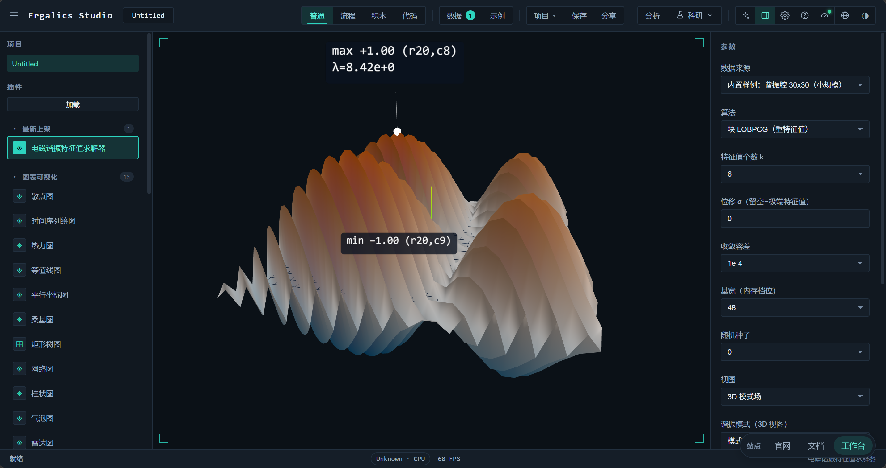
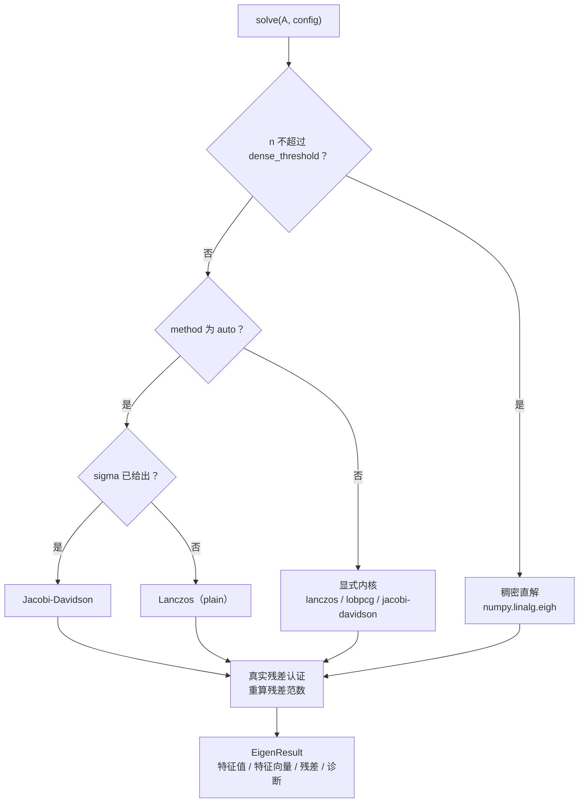
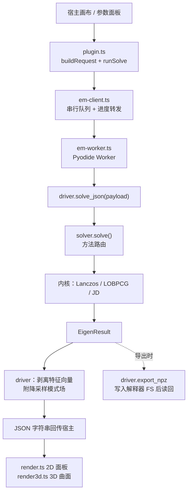
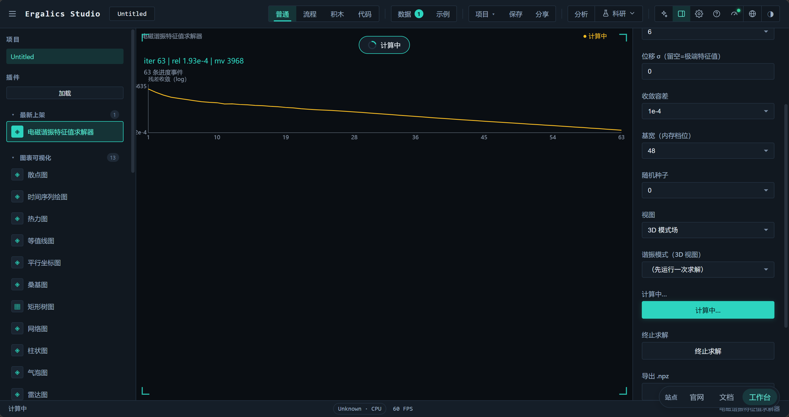
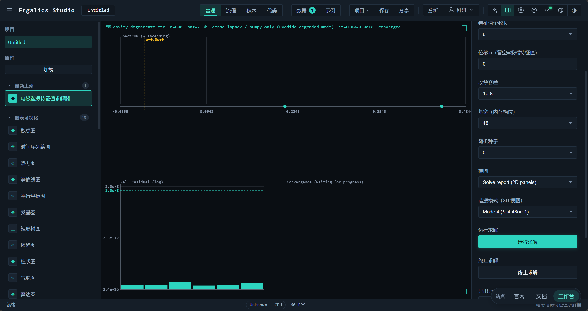
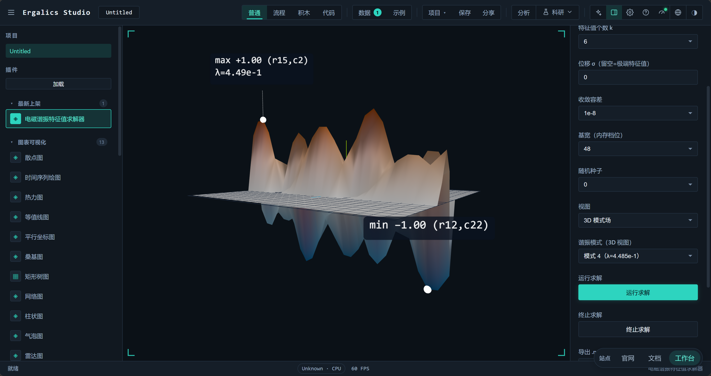
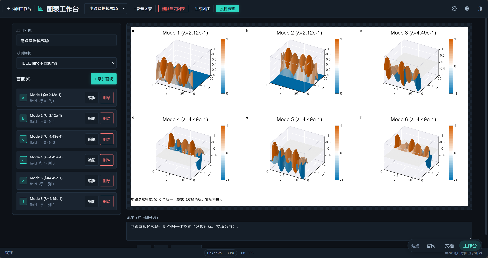

# 电磁谐振特征值求解器



电磁谐振特征值求解器（EM Eigensolver）是一个内置插件（`src/plugins/builtin/em-eigensolver/`，注册 id `example.em-eigensolver`，分类"物理模拟 physics"，沙箱级别 `trusted`），用于求解微波器件、天线、电磁兼容与光子晶体等场景中由有限元（FEM）或矩量法（MoM）离散得到的**大规模稀疏厄密非正定矩阵特征值问题** `A x = λ x`。插件在宿主侧提供参数面板与求解报告，在独立的 Web Worker 中用 Pyodide 运行配套的纯 Python 包 `em_eigensolver`，并把谱、真实残差、外迭代收敛轨迹与谐振模式场渲染到画布或 Three.js 场景中。

求解器本身不依赖任何闭源组件：核心算法是纯 Python + NumPy 实现，SciPy 存在时只用于更成熟的稀疏存储与向量内核；整个流程从不构造或稠密化 `n × n` 算子，唯一的稠密分解作用在规模不超过 `basis_dim` 的投影矩阵上。

## 一、问题定义与适用边界

### 1.1 从麦克斯韦方程到厄密本征问题

电磁谐振分析在离散化之后归结为稀疏厄密矩阵的本征问题。本插件处理的是**标准形式** `A x = λ x`：`A` 为 `n × n` 稀疏厄密矩阵（实对称或复厄密），`n` 可到十万量级。材料色散、复杂边界条件（如 PML）与高频/低频效应使 `A` 不再正定，目标频率对应的位移 `σ` 可能落在谱内部，此时 `A − σI` 可以接近奇异——这是本插件与常规"只处理正定矩阵"工具的差别所在。

### 1.2 三类困难场景

| 场景 | 数学表现 | 朴素做法的失败方式 |
| --- | --- | --- |
| 零附近密集谱（低频击穿） | 大量特征值挤在 `σ` 附近甚至 `σ = 0` | 位移逆变换的内层线性系统病态，迭代次数爆炸或结果错误 |
| 重特征值 | 同一特征值有多重（简并模式） | 单向量迭代收敛到同一个向量，其余简并模式丢失 |
| 近奇异位移 | `σ` 与某个特征值几乎重合 | `(A − σI)⁻¹` 元素巨大，残差被放大，收敛判据失真 |

这三类场景在内置样例中都有对应：`cluster_zero` 在零附近给出 720 阶中的 153 个 `abs(λ) < 0.05` 的特征值，`degenerate_pair` 的每个特征值都至少二重，两者默认位移恰好落在谱内部。插件针对它们分别提供了块迭代与收缩（deflation）机制、自适应位移策略，以及按真实残差认证的收敛判据。

### 1.3 适用边界

| 维度 | 支持范围 | 说明 |
| --- | --- | --- |
| 矩阵类型 | 实数对称或复厄密（`A = Aᴴ`） | 非厄密、非对称矩阵不在求解范围内 |
| 问题形式 | 标准本征问题 `A x = λ x` | 广义问题 `A x = λB x` 未实现，需使用者先用 `B` 的因子变换 |
| 规模 | `n` 从个位数到 `1e5` 量级 | 内置 `cavity_large` 样例 `n = 102400`，`nnz = 510720` |
| 谱位置 | 极端特征值或谱内目标位移 | 位移由 `σ` 指定，支持自适应偏移 |
| 存储 | `.mtx`（Matrix Market）、`.npz`（SciPy 稀疏或稠密归档）、`.npy`（稠密，受尺寸护栏）；本地 CPython 另支持 `.h5`/`.hdf5`（h5py）、`.fits`（astropy）、`.nc`（SciPy NetCDF）可选直读 | 稠密输入即刻稀疏化，`n² ≤ 4×10⁶` 才接受；工程格式缺包时抛出指名缺失包的 `MatrixIOError` |
| 运算环境 | CPython + NumPy（SciPy 可选）；浏览器 Pyodide | 纯 NumPy 后端自带行块多线程 matvec（见第六节）；WebGPU SpMV 内核为平台级资产 |

## 二、求解内核

三个迭代内核加上一条稠密直解兜底，统一由 `SolverConfig` 与 `solve()` 门面（`python/em_eigensolver/solver.py`）路由。

| 内核 | 实现文件 | 递推与投影空间 | 主要适用场景 |
| --- | --- | --- | --- |
| 厚重启 Lanczos | `lanczos.py` | 三对角 Krylov 子空间，厚重启保留 `k` 个 Ritz 向量加最后一个 Lanczos 向量 | 极端特征值；目标落在谱间隙时的位移逆变换 |
| 块 LOBPCG | `lobpcg.py` | `span{X, R, P}` 三块 Rayleigh-Ritz（块宽 `B`） | 极端特征值，且存在聚簇或重特征值 |
| Jacobi-Davidson | `jacdavid.py` | 搜索空间 `V` 加投影校正方程，带收缩锁定 | 谱内密集簇中的目标、近奇异位移 |
| 稠密直解 | `solver.py` | `numpy.linalg.eigh` | `n ≤ dense_threshold`（默认 800）的小问题 |

### 2.1 方法路由

`method` 取 `auto`（默认）时按位移是否存在分流；显式指定内核则直接调用。`which` 在无位移时决定取哪一端（`LM` 最大幅值、`LA` 最大代数、`SA` 最小代数）。



插件界面上的算法下拉把这条路由显式暴露给使用者（"自动（有 σ → JD，无 σ → Lanczos）"），并允许强制指定三个内核之一。需要说明的是，插件固定以 `which = 'LM'` 发起请求，界面没有提供极端类型选择；`which` 的完整取值只在 Python 包与 CLI 层可用。

### 2.2 厚重启 Lanczos（Krylov-Schur）

`lanczos_solve()` 每轮把 Krylov 基扩张到宽度 `m = max(basis_dim, k + 8)`（上限 `n`），在 `m × m` 的三对角投影上做 Rayleigh-Ritz，然后按 Wu & Simon 的厚重启策略重建基：保留 `k` 个目标 Ritz 向量与最后一个 Lanczos 向量，把已收敛信息全部带过去，而不是丢弃整段 Krylov 空间重新开始。投影矩阵强制对称化（`H = (H + Hᴴ)/2`）以抵消浮点累积的非厄密性。

- **正交化**：每步做两遍 DGKS 全重正交（`for pas in (0, 1)`），投影系数在两遍中累加进 `H`；基础向量范数低于 `1e-14` 时判为到达不变子空间，改用随机方向继续扩张并把该列次对角元置 0。
- **两种谱变换**：`sigma` 为空时逐次计算 `A q`（plain，求极端特征值）；给出 `sigma` 时逐次调用 MINRES 解 `(A − σI)⁻¹ q`（位移逆），Ritz 值按 `λ = σ + 1/θ` 映射回原谱。
- **收敛判据**：每个周期都用真实 matvec 重算 `‖A y − λ y‖`，除以该次返回的最大 `|λ|`，全部小于容差才算收敛。
- **诊断输出**：周期数、基宽、当前位移、残差估计上界（末行耦合 `|lastrow · S|` 的最大值）均写入 `diagnostics`。

### 2.3 MINRES 内层求解器

位移逆变换与 JD 的校正方程都需要解厄密**不定**线性系统，共轭梯度不再适用，因此内层统一使用 MINRES（`minres.py`）。

| 设计点 | 做法 |
| --- | --- |
| 极小化问题 | Hermitian Lanczos 三项递推构造基，在 `(k+1) × k` 三对角投影上解最小二乘 `min ‖β₁e₁ − T_k y‖` |
| 求解方式 | 每 `check_every = 4` 步调用一次 LAPACK `lstsq`；`T_k` 规模受 `restart` 限制（默认 80），开销可忽略 |
| 重启 | 基宽达 `restart` 或最小二乘残差达标即停，物化增量解并**用一次额外 matvec 重算真实残差** |
| 判据 | 真实残差判据，不使用递推式累积量；返回 `converged` / `maxiter` 状态 |
| 预条件 | 默认不施加。理由见下 |

内层**有意做不精确求解**：外层 Rayleigh-Ritz 重正交会恢复精度，而近奇异的 `A − σI` 只消耗有界的内层迭代次数。位移逆路径上外层有效容差相应放宽为 `max(tol, 20 × minres_rtol)`。反过来说，若使用者把容差设到 `1e-12` 而内层相对残差是 `1e-6`，外层实际能达到的精度上限就是 `2×10⁻⁵`——这是不精确位移逆的固有代价，也是收敛报告里残差与容差之间为什么会出现约两个数量级间隔的原因。

内层预条件被有意省略，两个方向都验证过代价：不定算子的 Jacobi 预条件 `M = diag(A)` 并不正定，负的 `M` 内积会产生 NaN；对称对角缩放 `A' = PAP`（`P = diag(1/√|d|)`）在对角元接近零时会把条件数改坏——实测某算例从干净收敛变为 400 次 MINRES 迭代仍未收敛。因此对对角结构良好的矩阵，文档建议的做法是先做显式对称变换再求解，而不是让内层自动施加预条件。块 LOBPCG 保留了 SPD 预条件钩子 `precond`，但门面 `solve()` 目前不传入任何预条件。

### 2.4 块 LOBPCG

`lobpcg_solve()` 实现经典三基 Rayleigh-Ritz：搜索空间取 `span{X, R, P}`，其中 `X` 是当前 Ritz 块、`R = AX − X·diag(θ)` 是残差块、`P` 是上一轮的方向块。块宽 `B` 由门面按 `max(basis_dim // 3, k + 4)` 计算，投影矩阵规模为 `3B × 3B`，稠密工作量保持在 `O(B³)`。

块形式是它处理重特征值的机制：同一个简并特征值的多个正交模式可以同时存在于 `X` 中，一轮迭代就能一起收敛，无需收缩逻辑。正交化采用带重正交的修正 Gram-Schmidt；遇到线性相关列时用随机方向替换，空间耗尽后**宁可让块变窄也不填充噪声方向**。收敛判据是尚未被选中的 `k` 个最小残差列全部达标；迭代结束后再从 `XᴴAX` 做一次 Rayleigh-Ritz 并重算 `k` 个真实残差。

需要注意的是，这个内核只求极端特征值：门面按 `which != 'SA'` 映射到"最大"或"最小"一侧，位移 `σ` 对它不生效。若在界面上选择 LOBPCG 同时填写了 `σ`，`σ` 会被忽略。

### 2.5 Jacobi-Davidson

`jd_solve()` 是应对谱内密集簇与近奇异位移的主力内核，迭代为 Sleijpen & van der Vorst 的标准流程：

1. 在当前搜索空间 `V` 上做 Rayleigh-Ritz（`H = VᴴAV`，对称化后 `eigh`），取距离 `σ` 最近的 Ritz 对；
2. 用显式的 `AV` 列计算精确残差 `r = A u − θ u`；
3. 近似求解校正方程 `(I − uuᴴ − WWᴴ)(A − θI)(I − uuᴴ − WWᴴ) t = −r'`，其中 `W` 是已锁定的特征向量基。两个斜投影把 `θ` 从谱中移开，因此即使 `θ ≈ λ`（近奇异位移）校正系统依然可解；内层仍由 MINRES 不精确求解，因为 JD 只需要一个下降方向；
4. 把正交化后的校正向量扩张进 `V`，基宽达到 `basis_dim` 时按"保留最好的 Ritz 向量、不足处补随机方向"的方式重启。

**收缩（deflation）与简并模式**：收敛的特征对被锁定进 `W` 并从后续搜索中投影剔除。判定某个 Ritz 对是否已锁定需要**同时**满足两个条件——特征值相对匹配（`|θ − λ_locked| ≤ 1e-9 · max(scale, |θ|)`）且 Ritz 向量与已锁定向量平行度大于 0.9。只用特征值判据会把重特征值的正交副本当作"已找到"而跳过，这正是简并模式丢失的原因。

有效内层预算：门面传 `minres_rtol = min(cfg.minres_rtol, 1e-4)` 与 `minres_maxiter = min(cfg.minres_maxiter, 160)`；按默认配置 `minres_rtol = 1e-6`，因此 JD 内层实际使用 `rtol = 1e-6`、`maxiter = 160`。

### 2.6 稠密直解路径

当 `n ≤ dense_threshold`（插件固定传 800）且矩阵对象提供 `todense()` 或 `toarray()` 时，`solve()` 直接走 `numpy.linalg.eigh`。这是一条**有界**路径，不构成"把稀疏矩阵显式转成稠密矩阵"的违规：触发条件是小到稠密特征分解比任何迭代路径都便宜，其 `O(n²)` 工作区（`n = 800` 时约 5 MB）比迭代法所需的 `n × basis_dim` 基块更小。该路径返回 `method = 'dense-lapack'`，`iterations` 与 `matvecs` 均为 0。

这一点对使用体验有直接影响：内置示例文件 `em-cavity-degenerate.mtx` 是 600 阶，低于 800 的阈值，因此从"内置样例"下拉里选它并点求解，走的就是稠密直解，报告中的算法字段会显示 `dense-lapack` 而不是三个迭代内核中的任何一个。

## 三、位移策略与自适应位移

位移 `σ` 是电磁谐振求解的核心输入：`σ` 对应目标频率，实际要找的是距 `σ` 最近的一批特征值。当 `σ` 数值上落在某个特征值上时，`A − σI` 近奇异，内层 MINRES 的迭代次数会急剧上升甚至无法在预算内收敛。

`lanczos_solve()` 在外层周期边界监测这一现象并自动偏移 `σ`：

| 触发条件 | 判定 |
| --- | --- |
| 内层迭代速率过高 | 最近 16 次内层求解中，达到 `near_singular_threshold = 120` 步的比例超过 30% |
| 内层不收敛 | 任意一次 MINRES 返回未收敛 |

触发后按固定方向、步长倍增的方式移动：首次偏移取 `step = max(1e-3 × ‖A‖, 1e-2 × |σ|)`，方向为 `sign(σ)`（`σ = 0` 时取正），之后每次触发把步长乘 2；最多移动 `max_shift_moves = 5` 次，每次移动都追加进 `shift_history` 并整体重建 Krylov 基（变换后的算子已经不同，旧基不再有效）。内层计数窗口在移动后清零，`inner_converged` 标志复位。

两个被排除的替代方案有明确的实测理由：按比例取步长在 `σ ≈ 0` 时步长趋近于零、位移几乎不动；让方向在正负之间交替则会在谱附近来回振荡而不逃离奇异区。

自适应位移只作用于**位移逆 Lanczos**。Jacobi-Davidson 依靠校正方程的投影天然规避近奇异（`θ` 被投影移出谱），因此不需要偏移 `σ`；LOBPCG 不涉及位移。插件界面上"位移 σ（留空=极端特征值）"文本框中，留空表示不设位移、转而求极端特征值。

## 四、收敛性控制与精度认证

三个内核的收敛判据都基于**真实残差**，即用新的 matvec 重新计算 `‖A y − λ y‖`，而不用投影空间内的估计量。这一点在实现上是硬约束：Lanczos 的 `exact_residuals()` 每个周期为每个目标 Ritz 向量各做一次 matvec；LOBPCG 直接用本轮的 `AX` 计算 `R = AX − Xθ`；JD 在锁定后重新对每个输出向量做一次 matvec 校验。

| 内核 | 残差定义 | 相对量分母 | 收敛条件 | 迭代计数含义 |
| --- | --- | --- | --- | --- |
| Lanczos | `‖A y − λ y‖` | 该次返回的最大 `\|λ\|` | 全部 `k` 个残差 ≤ 有效容差 | 外层重启周期数 |
| LOBPCG | `‖A x − θ x‖` | 当前 Ritz 值绝对值的最大值 | 所选 `k` 列全部 ≤ 容差 | 迭代步数 |
| Jacobi-Davidson | `‖A u − θ u‖` | `max(max\|λ_locked\|, 1e-3 × scale)` | 每个被锁定对达标，锁定数 ≥ `k` | 外层扩张步数 |
| 稠密直解 | `‖A y − λ y‖` | 全部特征值绝对值的最大值 | 全部残差 ≤ 容差 | 0（不适用） |

分母取该次求解的**最大** `|λ|` 而不是逐特征值各自的分母，使小特征值的相对残差判据更严格、更保守。这一取舍意味着报告的残差略偏大，不会给出虚高的精度评价。

有效容差方面有两处需要使用者知道：位移逆 Lanczos 会把外层容差放宽到 `max(tol, 20 × minres_rtol)`（默认内层 `1e-6`，即下限 `2×10⁻⁵`）；LOBPCG 与 JD 直接用 `tol`。此外 `SolverConfig.normalized()` 会拒绝 `k < 1`、`tol ≤ 0`、未知 `method`，并给 `jacobi-davidson` 在未指定位移时补上 `σ = 0`（JD 必须有目标）。

每次求解返回的 `diagnostics` 字典包含：`k`、`n`、`tol`、`sigma`、`inner_iterations`（内层 MINRES 迭代总数）、`shift_history`（自适应位移轨迹）、`memory_hint_mb`（基块内存估算），以及各内核自身的字段（Lanczos 的 `cycles` / `basis` / `backend_shift` / `residual_estimate_max`，LOBPCG 的 `block`，JD 的 `locked` / `last_rel`）。

## 五、内存与复杂度

每轮迭代的开销集中在两处：一次 `O(nnz)` 的稀疏矩阵向量乘，一次对宽度 `m` 的基做正交化（工作量为 `O(n × m)`）。唯一的稠密特征分解规模是 `m × m`（`m = basis_dim`，默认 48，可选 16–200），因此 `n × n` 算子在整个流程中从不被构造或稠密化。

| 量 | 表达式 | `n = 102400`、`basis_dim = 48`（实矩阵）时的值 |
| --- | --- | --- |
| 算子存储 | CSR，`nnz × (值 + 索引)` | 6.5 MB（`nnz = 510720`，实值） |
| Krylov / 搜索空间基块 | `n × basis_dim × 8`（复矩阵 16） | 39.3 MB |
| 投影矩阵 | `basis_dim²` 量级 | 约 18 KB |
| 内层基块 | `n × restart × 8`（`restart = 80`，仅位移逆） | 65.5 MB |

`solver.py` 按 `n × basis_dim × (16 或 8)` 计算并写入 `diagnostics.memory_hint_mb`；`csr.py: sparse_memory_bytes()` 给出稀疏存储的估算，各样例的该值在第九节的表中列出。内存的主要旋钮是 `basis_dim`（界面上标注为"基宽（内存档位）"）：它同时决定基块内存、每轮正交化开销与收敛速度。

不得稠密化是本插件的一条硬约束，代码层面表现为三点：CSR 构造路径（`csr_from_coo` / `_coo_reduce`）只使用 `O(nnz log nnz)` 的工作区；`NumpyCSR.dot()` 对多列右端项按列迭代（峰值内存 `O(nnz + n·k)`），不生成中间稠密矩阵；输入侧的稠密通道有显式护栏 `max_dense_cells = 4×10⁶`，超限直接抛 `MatrixIOError` 而不是尝试分配。

## 六、并行与运行环境

同一份求解器源码在两种环境下运行，通过 `backend.py` 在导入期探测：

| 环境 | 稀疏存储 | 后端标识 | 线程 |
| --- | --- | --- | --- |
| CPython（本地 CLI / 脚本） | `scipy.sparse.csr_matrix` | `scipy <版本> (CPython)` | NumPy/BLAS 自动多线程（`OMP_NUM_THREADS` / `MKL_NUM_THREADS`） |
| 浏览器（Pyodide） | `NumpyCSR`（纯 NumPy） | `numpy-only (Pyodide degraded mode)` | WASM 单线程 |

浏览器侧只 vendored 了 Pyodide 与 numpy（`public/pyodide/` 内为 numpy 2.4.3，无 SciPy），因此网页运行必然走纯 NumPy 的降级后端——这不是故障路径，而是设计上的默认路径：`csr.py` 以手写 CSR 支持求解器所需的全部操作（`A @ x`、`A.H`、`diagonal`、`coo_of` 等），两个后端暴露同一套鸭子类型接口。

关于并行加速，需要如实说明当前边界：**没有 MPI 路径**。多线程能力来自两处：NumPy/BLAS 的向量内核（由 `matvec` 与小型 `eigh` 调用自动获得），以及纯 NumPy 后端（`NumpyCSR.dot`）的行块多线程 matvec——大矩阵按行块切分后经 `ThreadPoolExecutor` 并行（NumPy 的大 ufunc 会释放 GIL），`EM_EIGENSOLVER_THREADS` 环境变量可覆盖线程数。实测拐点：10 201 行强制并行只有 0.25×（线程池开销反而拖慢），40 000 行起才有收益（1.40×@4e4、1.49×@1e5，见 9.4 节），因此默认行数阈值 `_PARALLEL_MIN_ROWS = 40000` 以下保持串行——线程池只在 n ≳ 4×10⁴ 启用。

WebGPU 方向：宿主平台层（`src/core/wgsl.ts` + `src/core/gpu-kernels.ts`）提供了 CSR SpMV 计算内核（每行一线程、6-binding 布局、GPU 不可用自动回落 CPU），与 matmul/FFT/k-means/binning 同属平台级 GPU 资产并有完整 vitest 覆盖。对外口径一句话：**GPU SpMV 内核已实现并暴露为独立 API，求解主循环保持 CPU f64 精确路径**——Pyodide 中的 Python 求解是同步的，事件循环在求解期间被阻塞，而 WebGPU 的 readback 是异步的，逐 matvec 的同步 GPU 委派在当前架构下不可行，因此浏览器内运行的求解循环目前用不上它。Python 侧为此保留了通用同步桥钩子（`csr.set_gpu_spmv`），供未来的同步宿主接入；`SolverConfig.gpu_spmv` 打开时诊断信息会如实说明这一边界。相应地"缺少特定 GPU 硬件时的降级问题"不存在——GPU 不是运行前提，任何环境的行为一致。

## 七、插件运行时架构

### 7.1 文件职责

| 文件 | 职责 |
| --- | --- |
| `index.ts` | 工厂导出，供内置注册表惰性加载 |
| `plugin.ts` | `Plugin` 接口实现：清单、参数定义与更新、求解编排、状态机、导出与 Figure Studio 桥接 |
| `types.ts` | 插件 ⇄ 客户端 ⇄ Worker 的协议类型（配置、请求、事件、结果载荷、模式场） |
| `em-client.ts` | Worker 生命周期与 RPC：首次使用时 spawn、串行队列、进度转发、终止与重建 |
| `em-worker.ts` | Pyodide 引导、把 Python 源码写入解释器文件系统、进度回调桥、求解与导出入口 |
| `render.ts` | 2D 报告面板（谱、残差、收敛轨迹）；几何辅助为纯函数 |
| `render3d.ts` | 3D 模式场位移曲面与极值标注；色标、极点定位、缓冲构造为纯函数 |
| `python/em_eigensolver/` | 求解器包（13 个模块，见下） |

Python 包按单一职责拆分：`backend.py`（后端探测）、`csr.py`（纯 NumPy CSR 与稀疏原语，含行块多线程 matvec 与 GPU SpMV 同步桥钩子）、`io_matrix.py`（`.mtx`/`.npz`/`.npy` 读写与本地 `.h5`/`.fits`/`.nc` 可选直读、三角恢复、厄密化、结果写出）、`minres.py`（内层求解器）、`lanczos.py`、`lobpcg.py`、`jacdavid.py`（三个内核）、`samples.py`（参数化样例）、`solver.py`（门面与配置）、`sweep.py`（参数扫描诊断，见 9.5 节）、`driver.py`（JSON 桥）、`cli.py`（命令行）、`__init__.py`（包导出）。

### 7.2 数据流



### 7.3 跨语言边界与生命周期

跨边界只传 JSON 字符串。浏览器 Worker 的 `postMessage` 无法结构化克隆 PyProxy 对象，因此 Python 侧的进度、报告、元数据一律序列化为 JSON 文本；`n × k` 特征向量块留在 Python 进程内，只在显式导出时写成压缩 `.npz` 再从解释器文件系统读回。这一约定把最大的数据块排除在消息通道之外——报告本身只带特征值、残差、诊断与降采样后的模式场。

几处与稳定性相关的设计：

- **引导与超时**：Worker 首次使用时创建，`em-worker.ts` 动态 import `pyodide.mjs`（模块 Worker 不允许 `importScripts`），加载 `numpy` 包，再把 11 个 Python 源码文件写入 `/lib/em_eigensolver/`、把 `/lib` 插入 `sys.path` 并导入。宿主侧引导超时为 120 秒；引导失败可重试（失败时清空缓存的 bootstrap Promise）。
- **进度桥**：Python 端 `driver.set_progress_sink()` 接受一个 JS 回调，每个重启周期把进度字典 JSON 化后推回宿主；进度回调中的异常被吞掉，保证"进度上报永不影响求解"。
- **串行队列**：客户端把求解与导出请求排在一条 Promise 链上，同一时刻只跑一个作业；作业内再次校验 Worker 身份，避免已被终止的实例继续返回结果。
- **终止语义**：用户点"终止求解"时不做软取消，而是**整体重建计算栈**——终止 Worker、重建客户端、复位状态栏与按钮文案，下一次求解会重新启动解释器。求解期的陈旧拒绝（abort 之后到达的异常）用自增的 epoch 号识别并直接丢弃，不会污染当前状态。
- **渲染与场景**：3D 视图需要的宿主场景句柄在 `renderToScene` 时获得；宿主场景在工作台卸载（例如切到 Figure Studio）后会被重建，因此缓存的网格除了按模式场判断，还要按场景句柄判断是否需要重建。切回 2D 报告时主动隐藏 3D 面并释放网格与标注资源。

## 八、界面与交互

### 8.1 参数面板

参数面板由清单驱动，宿主按当前语言自动生成本地化控件。数值型参数一律做成**下拉选择**而非自由数字输入，既限定了有意义的档位，也避开了"默认值无法删除"的输入框陷阱。

| 控件 | 键 | 取值 |
| --- | --- | --- |
| 数据来源 | `matrix` | 内置样例 6 项（含内置示例文件）+ 导入文件项（仅在已导入时出现） |
| 算法 | `method` | 自动 / 厚重启 Lanczos / 块 LOBPCG / Jacobi-Davidson |
| 特征值个数 k | `k` | 1、2、3、4、5、6、8、10、12、16、20、24、32、48、64 |
| 位移 σ | `sigma` | 文本，留空表示求极端特征值 |
| 收敛容差 | `tol` | 1e-4、1e-6、1e-8、1e-10、1e-12 |
| 基宽（内存档位） | `basisDim` | 16、24、32、48、64、80、96、128、160、200 |
| 随机种子 | `seed` | 0–9 |
| 视图 | `view` | 求解报告（2D 面板）/ 3D 模式场 |
| 谐振模式（3D 视图） | `modeIndex` | 每个已返回模式一项，标签带 λ 值 |
| 运行求解 / 终止求解 | `run` / `abort` | 动作按钮 |
| 导出 .npz | `exportNpz` | 动作按钮 |
| 发送到 Figure Studio | `sendToFigure` | 动作按钮 |
| 重置插件 | `reloadPlugin` | 动作按钮 |

数据来源采用单层下拉（`sample:<id>` 或 `file`），取代了早期"矩阵来源 + 样例"两级选择；旧的 `source` / `sample` 键仍然接受，以便已保存的项目与顶栏样例导入继续可用。这里有一条务实的约束：`file` 选项只有在 `File` 对象确实存在时才生效——`File` 不随页面刷新保留，恢复一个只有 `source: 'file'` 而没有文件的项目时必须回落到样例路径，否则下拉框会显示一个点了必然失败的选项。

请求配置由 `buildRequest()` 组装：`which` 固定 `LM`，`maxCycles = 60`、`maxIter = 400`、`denseThreshold = 800`，其余取自界面状态。界面以 camelCase（`basisDim`、`maxCycles`）发送这些键，而 `driver._build_config` 曾只读 snake_case——意味着界面上选择的基宽曾被静默忽略。该问题已修复：驱动层现在同时接受两种命名（`max_cycles`/`maxCycles` 等），并有专门的单测守住这一行为（`test_driver_config_accepts_camel_case`）。

### 8.2 2D 求解报告

求解前显示进度行与内核日志尾部（最多 8 行），以及一张实时收敛迷你图；得到结果后画布分为三个面板：

| 面板 | 内容 |
| --- | --- |
| 谱（上部，占高度 55%） | 升序排列的特征值散点，横轴画 5 个刻度，`σ` 以虚线标出并带标签 |
| 相对残差（下部左，占宽度 45%） | 每个特征值一根柱，按是否达标取不同颜色，叠加对数刻度的容差虚线 |
| 外迭代收敛轨迹（下部右，占宽度 55%） | 每轮的最大相对残差随周期数变化的折线，纵轴对数，横轴约 8 个刻度 |

顶部信息行为"样例名 / n / nnz / 算法 / 后端 / 迭代数 / matvec 数 / 是否收敛"。所有几何辅助（谱域计算、值到像素映射、刻度选取、进度摘要）都是导出的纯函数，便于单元测试覆盖。

参数面板在求解期间同时承担进度显示：画布切到实时收敛轨迹（当前迭代步、最大相对残差、matvec 计数），面板底部按钮变为"计算中…"，"终止求解"保持可用。



求解完成后的报告如下：上部是升序谱散点并以虚线标注 σ，左下是每个特征值的相对残差柱与对数刻度容差线，右下留给外迭代收敛轨迹；顶部信息行给出样例名、n、nnz、算法、后端、迭代数与是否收敛。



### 8.3 3D 模式场

3D 视图把选中的模式场画成位移曲面：网格值同时决定高度与顶点颜色，色标采用 Okabe-Ito 发散配色（负值走蓝、零为白、正值走朱红），并在正峰与负谷各放一枚标记球、一条垂线与一个浮层标签（含数值、网格坐标 `(r, c)`，主导侧额外带 λ）。顶点颜色在写入前做了 sRGB → 线性空间转换，否则渲染器输出时再次应用线性到 sRGB 的变换会把中间色调冲成粉彩、与 SVG 导出不一致。

两个与宿主相关的细节：`heightScale` 固定 0.35，高度按 `值 × heightScale × max(rows, cols)` 缩放，使不同网格尺寸下的观感一致；相机距离按网格外接尺寸计算（`extent × 2.1 + 2`），并在每次重建网格时重新取景。

模式场数据本身由 `driver.mode_fields()` 生成：对最后一次求解的前 6 个特征向量做**块均值降采样**，每轴最多 64 格（等距分块，最后一块可能更宽），复特征向量取模、实特征向量保留符号（以便看清节线结构），整体归一化到最大绝对值 1。网格形状按 `n` 的最近因子对推断：`cavity_*` 这类方形网格样例能还原真实网格（`approx: false`），而按波段拼装的样例只能得到近似布局（`approx: true`），报告中的标志位如实反馈这一点。质数（以及 n < 4 的极小值）没有任何两侧都 ≥ 2 的因子对——若强行取 `(1, n)` 布局，曲面网格将退化成零 quad 的空片；因此 `_nearest_grid` 对这类 n 回退为近似 2 行布局，`mode_fields` 对多余格点零填充，仍以 `approx: true` 标记。

需要提醒的是，Pyodide 运行在 Worker 中，而 3D 渲染需要主线程的宿主场景；若场景未挂载，插件会退回 2D 报告并给出一次提示（按原因去重），引导使用者"重置插件"后重新求解。

下图是内置示例文件 `em-cavity-degenerate.mtx` 求解后第 4 个模式（λ = 4.485e-1）的模式场：曲面高度与顶点颜色来自同一份降采样网格，正峰与负谷各有一枚标记球、一条垂线与一个浮层标签，标签中含峰值、网格坐标 `(r, c)` 与 λ。



小规模样例 `cavity_small`（30 × 30）配合块 LOBPCG 内核时，同一视图给出极端特征值附近的模式场，见开篇示意图。

### 8.4 与工具链的衔接

- **导出 `.npz`**：把最后一次求解的特征值与特征向量写成 NumPy 归档（`eigenvalues`、`eigenvectors`、`residuals`（真实残差，与 CLI 输出一致），可选 `meta` 为 JSON 文本框；虚部整体小于 `1e-14` 的复特征向量会自动降为实数组），文件名沿用输入名加 `.eigen.npz`。
- **发送到 Figure Studio**：每个模式场生成一个 3 列排布的图表面板，标签按电子表格习惯编号（a、b、c…），带发散色标与 λ 标题，并写入整张图的图注。图仓库在此处惰性导入——静态导入会形成 `plugin → figureStore → projectStore → pluginStore → builtin registry → plugin` 的循环，使注册表条目在初始化时未定义。
- **顶栏内置示例**：`examples/data/em-cavity-degenerate.mtx` 同时登记在全局示例库（id `em-cavity-degenerate`，绑定到本插件），因此从顶栏导入与从插件下拉选择走的是同一条文件路径。

下图是"发送到 Figure Studio"的结果：6 个模式场以 2 × 3 面板排布，套用 IEEE 单栏模板，每个面板带发散色标与含 λ 的标题，绘图区下方由插件写入一行图注，供使用者续写。这批模式取自内置简并示例，标题里的 λ 恰好重复出现（2.12e-1 两次、4.49e-1 四次），与 9.2 节实测的重数分布互相印证。



## 九、内置样例与基准数据

### 9.1 五个参数化样例

样例由 `samples.py` 的构造器生成，全部是稀疏、按构造即厄密的矩阵，尺寸与参数由 `(n_cells, bandwidth, seed, ...)` 之类的旋钮决定，没有把任何题面尺寸或答案写死。下表数据为按默认参数实际构造后测得。

| 样例 | n | nnz | CSR 存储 | 推荐 σ | 推荐 k | 谱范围（实测） | 覆盖场景 |
| --- | --- | --- | --- | --- | --- | --- | --- |
| `cavity_small` | 900 | 4380 | 0.06 MB | 0.6 | 6 | 0.5153 … 8.4847 | 小规模冒烟测试、低内存环境 |
| `cluster_zero` | 720 | 2148 | 0.03 MB | 0.0 | 8 | −0.2836 … 0.3040 | 零附近密集谱 + 近奇异位移 |
| `degenerate_pair` | 300 | 894 | 0.01 MB | −1.0 | 6 | −1.2511 … 2.2942 | 重特征值（收缩与块迭代） |
| `cavity_complex` | 576 | 2784 | 0.06 MB | 1.2 | 6 | 1.0282 … 8.9718（复厄密） | 复厄密算子 |
| `cavity_large` | 102400 | 510720 | 6.54 MB | 0.5 | 6 | 五点差分网格，理论范围 0 … 8 | 十万阶、控内存 |

各样例的构造方式：

- `cavity_small`、`cavity_complex`、`cavity_large` 是二维五点差分网格 Laplacian（`_grid_laplacian`），在被移位的谱上加入确定性的材料不均匀项；`cavity_complex` 进一步给水平耦合加上一个常数相位 `e^{iφ}`，矩阵仍保持厄密。
- `cluster_zero` 由 6 个窄带三对角块拼装，块中心在 ±0.2 之间等距分布、半宽 0.03，共 720 个特征值挤在零附近。实测其中 153 个特征值满足 `|λ| < 0.05`、35 个满足 `|λ| < 0.01`，因此默认的 `σ = 0` 确实落在密集谱内部，`A − σI` 接近奇异。
- `degenerate_pair` 由三个三对角块拼装，其中前两个块是同一个块（同一数组重复两次），因此该带的每个特征值恰好二重。

`cavity_large` 是"十万阶"量级的实证用例：`n = 102400`（320 × 320 网格）、`nnz = 510720`，CSR 存储约 6.5 MB；按默认基宽 48 计算，Krylov 基块约 39.3 MB，与仓库文档给出的数百兆量级预算相符。

### 9.2 内置示例文件（实测结构）

`examples/data/em-cavity-degenerate.mtx` 是随仓库提供的一个 Matrix Market 文件，登记在全局示例库并由插件下拉直接选用。对其做了独立解析与谱分析，实测结构如下：

| 属性 | 实测值 |
| --- | --- |
| 维度与规模 | 600 × 600，`nnz = 2760`（实数，对称） |
| 结构 | 块对角：6 个 100 × 100 块，每块 `nnz = 460`；块间无耦合 |
| 块内容 | 每块为 10 × 10 网格的标准五点差分 Laplacian：对角常数分别为 4.05、4.6、5.4，非对角元均为 −1 |
| 重复方式 | 三种参数各出现两次（块 0≡3、1≡4、2≡5），因此每个特征值至少二重 |
| 单块谱 | 100 个特征值中 51 个不同；重数分布为 1（10 个）、2（40 个）、10（1 个），来自网格的 p↔q 对称 |
| 全局谱 | 600 个特征值中 153 个不同，范围 0.2120 … 9.2380；重数分布为 2（30 个）、4（120 个）、20（3 个） |
| 默认求解路径 | 600 ≤ `dense_threshold`(800)，因此走稠密直解，报告显示 `dense-lapack` |

文档与数据曾有一处不一致：全局示例库对它的描述是"3 组不同参数的 10×10 谐振腔各重复两次，每个特征值恰好两重"。前半句与实测一致，后半句不准确——由于 10 × 10 网格本身的谱就含重数 2 与 10 的内部简并，整体谱的重数是 2 / 4 / 20 三种（都是偶数重，但并非"恰好两重"）。示例描述已按实测重数分布更正为"实测特征值重数分布为 2 / 4 / 20（均为偶数重）"（中英双语同步）。

### 9.3 基准与复现

三个环境使用同一份样例构造代码，因此基准可比：

```bash
# 本地 CPython（SciPy 后端）
cd src/plugins/builtin/em-eigensolver/python
python -m em_eigensolver.cli --sample cluster_zero --sigma 0 --k 8 --verbose --out eigen.npz
python -m em_eigensolver.cli --sample cavity_large --sigma 0.5 --k 6 --basis_dim 48 --out large.npz

# 浏览器：插件面板选择样例与参数，点"运行求解"
```

CLI 在标准输出给出后端、输入描述、方法、位移、k、收敛状态、迭代数、matvec 数、最大相对残差、耗时与特征值列表，并把特征值、特征向量与**真实残差**写入 `--out` 指定的 `.npz`（`eigenvalues` / `eigenvectors` / `residuals` 键；`meta` 键内附 JSON 元数据，含方法、后端、迭代数、matvec 数、耗时、位移与内核诊断）。`--config` 可加载完整配置 JSON，`config.example.json` 给出全部字段与默认值。退出码约定：收敛为 0，未收敛为 1，配置或输入错误为 2。

参数扫描（`--sweep KIND:PARAM=V1,V2,...`）把单点求解升级为诊断曲线：例如 `--sweep cavity:size=12,16,20,24` 逐点重建矩阵、求解并输出 JSON 报告（每点的特征值、真实残差、收敛状态、耗时与误差捕获），细节见 9.5 节。

需要提醒的是，`--sample` 路径在没有显式 `--sigma`/`--config` 时会套用该样例的推荐位移，而不像插件那样默认求极端特征值。

### 9.4 性能实测（3.2 / 3.3）

以下数据由 `python/benchmarks/perf_bench.py` 在本机实测产出（Windows、8 逻辑核、CPython 3.x + numpy 2.5.3 + scipy 1.18.1；`best-of-5` 计时，求解含 tracemalloc 峰值内存），原始 JSON 落在仓库 `bench/em-eigensolver-results.json`。

**SpMV 行块多线程曲线**（纯 NumPy 后端，串行 vs 8 线程，`_PARALLEL_MIN_ROWS` 临时下调以强制走并行分支）：

| 网格 n | nnz | 串行 | 并行(8) | 加速比 |
| --- | --- | --- | --- | --- |
| 1 024 | 4 992 | 0.016 ms | 0.015 ms | 1.03× |
| 4 096 | 20 224 | 0.047 ms | 0.487 ms | 0.10× |
| 10 201 | 50 601 | 0.106 ms | 0.418 ms | 0.25× |
| 40 000 | 199 200 | 0.937 ms | 0.672 ms | 1.40× |
| 102 400 | 510 720 | 2.592 ms | 1.745 ms | 1.49× |

诚实结论：`reduceat` 行块向量化本身已经很快，线程池的提交/同步开销使**约 2×10⁴ 行以下并行反而更慢**（0.10×–0.25×），只在 4×10⁴ 行以上开始受益（1.40×@4e4、1.49×@1e5）。因此默认阈值 `_PARALLEL_MIN_ROWS = 65536` 以下保持串行是实测支持的选择，而非保守拍脑袋。

**求解规模曲线**（厚重启 Lanczos，k=6，tol=1e-8，extremal，纯 NumPy 路径）：

| 样例 | n | 收敛 | 最大真实残差 | 周期 | matvec | 耗时 | 峰值内存 |
| --- | --- | --- | --- | --- | --- | --- | --- |
| grid-32×32 | 1 024 | 是 | 7.2e-09 | 6 | 295 | 0.22 s | 0.6 MB |
| grid-64×64 | 4 096 | 是 | 1.3e-08 | 13 | 631 | 0.57 s | 2.4 MB |
| grid-101×101 | 10 201 | 是 | 1.4e-08 | 13 | 631 | 3.4 s | 5.8 MB |
| grid-200×200 | 40 000 | 是 | 8.4e-09 | 25 | 1 207 | 9.6 s | 22.5 MB |
| grid-320×320 | 102 400 | 是 | 3.6e-09 | 24 | 1 159 | 16.8 s | 57.4 MB |

**cavity_large（n = 102400）两条路径对照**：

| 路径 | 收敛 | 最大真实残差 | matvec | 耗时 | 峰值内存 |
| --- | --- | --- | --- | --- | --- |
| extremal（`which=LM`，Lanczos） | 是 | 3.8e-09 | 1 159 | 13.8 s | 57.4 MB |
| 内点位移逆（`σ = 0.5`） | 是 | 5.9e-05 | 41 017 | 374.8 s | 123.4 MB |

同一矩阵、同一 k 下的鲜明对照正是 2.3 节"不精确位移逆"的实证：extremal 路径 13.8 秒认证 `3.8e-9`；内点位移逆在 1e5 阶的不定系统上每步 MINRES 内层都要爬行（matvec 数 41 017 vs 1 159），外层虽收敛，真实残差只能认证到约 `6e-5`。这组数字已列入第十四章的已知边界。

### 9.5 参数扫描诊断（4.2）

`sweep.py`（CLI 经 `--sweep KIND:PARAM=V1,V2,...` 触发，Worker 经 `sweep_json` 桥）把单点求解升级为工程诊断曲线：扫一个几何/材料旋钮，逐点重建矩阵、求解、记录，输出"参数 → 谐振频率带"的轨迹视图。

| 旋钮 | 适用样例 | 含义 | 默认扫描值 |
| --- | --- | --- | --- |
| `size` | cavity 族 | 方网格边长（`n = size²`） | 12, 16, 20, 24 |
| `mu` | cavity 族 | 材料偏置，整谱平移 | 0, 0.5, 1, 1.5 |
| `scale` | cavity 族 | 耦合强度 | 0, 0.5, 1, 1.5 |
| `seed` | 其余全部样例 | 重建种子 | 0, 0.5, 1, 1.5 |

每点输出 `value`、特征值列表、真实残差、收敛状态、迭代数、matvec 数、独立计时、`n`/`nnz`；单点异常被捕获为该点的 `error` 字段而**不会杀死整条扫描**（配置错误仍会显式失败）。扫描完全可复现：同一参数列表 + 同一种子必然重建同一批矩阵。正确性由 `test_parameter_sweep_curves` 守住：size 曲线逐点收敛且残差 ≤ 1e-6、谱落在理论区间内；mu 旋钮以 `which='SA', k=1` 验证最小特征值的平移量恰好等于扫参步长（1.0）；非法旋钮报错。

### 9.6 正确性验证与对抗基准（4.3 / 4.4）

`python/benchmarks/validate_correctness.py` 一次运行产出两张表（`--fast` 跳过两个大用例；`--json` 落盘原始报告，仓库归档于 `bench/em-eigensolver-validate.json`）：

**4.4 稠密参考对照**——每个中小规模样例与 `numpy.linalg.eigh`（LAPACK）比对：按目标选取规则取同一批参考特征值，报告最大特征值误差与由参考向量过稀疏算子重算的残差。实测（scipy 后端）：

| 用例 | 方法 | max\|dλ\| | 最大残差 | matvec | 状态 |
| --- | --- | --- | --- | --- | --- |
| cavity_small k=6（extremal） | lanczos | 2.7e-14 | 2.5e-09 | 295 | PASS |
| cavity_complex k=4（extremal） | lanczos | 3.4e-14 | 8.3e-10 | 245 | PASS |
| degenerate_pair k=4 σ=−1 | jacobi-davidson | 1.6e-15 | 6.9e-09 | 34 810 | PASS |
| cluster_zero k=4 σ=0 | jacobi-davidson | 5.1e-18 | 3.5e-09 | 40 137 | PASS |
| cavity_small k=4 σ=8.3（谱顶内点） | jacobi-davidson | 7.1e-15 | 4.2e-09 | 89 933 | PASS |

特征值误差全部在 1e-14 量级（对 LAPACK 的浮点一致），真实残差全部 ≤ 1e-8。

**4.3 对抗 stress bench**——八组数值对抗用例，全部以真实残差认证（或要求干净地失败）：

| 用例 | 考察点 | 最大残差 | 状态 |
| --- | --- | --- | --- |
| near_singular_shift（σ=0，零附近密集谱） | 近奇异位移 + 自适应 | 3.5e-09 | PASS |
| dense_spectrum_interior（σ=0.05） | 谱内密集目标 | 5.0e-09 | PASS |
| repeated_eigenvalues（σ=−1） | 重特征值收缩 | 6.9e-09 | PASS |
| ill_conditioned_scale_1e9（矩阵 ×1e9） | 极端尺度不变性 | 1.3e-09 | PASS |
| ill_conditioned_scale_1e-9（矩阵 ×1e-9） | 极端尺度不变性 | 4.6e-09 | PASS |
| complex_hermitian（σ=1.2） | 复厄密算子 | 1.2e-09 | PASS |
| large_scale_cavity_1e5（extremal，n=102400） | 十万阶收敛认证 | 2.2e-08 | PASS |
| nonfinite_input（植入 NaN/Inf） | 必须显式失败而非静默"收敛" | —（未收敛，按预期 flag） | PASS |

`--fast` 子集（前四组参考对照 + 除 1e5 外的 stress 用例）由测试套件的 `test_validate_correctness_fast_subset` 随 CI 执行；完整版在本机实测 13 用例 0 失败、约 92 秒。参考对照里 `sigma=None` 严格表示 extremal 请求（不代推荐位移），返回特征值个数不足 k 时判 FAIL——验证基准不吞短返回。

## 十、故障场景与处置建议

| 症状 | 成因 | 处置 |
| --- | --- | --- |
| 内层 MINRES 达到 `maxiter` | `σ` 几乎正好是一个特征值，`A − σI` 近奇异 | 自适应位移会自动介入；否则加大基宽或提高内层迭代上限 |
| 达到 `max_cycles` 仍未收敛 | 谱内密集簇而基宽不足 | 提高基宽、放宽容差，或改用 Jacobi-Davidson |
| 随机稀疏矩阵上进展缓慢 | 随机稀疏矩阵的谱近似 Wigner 半圆，任何谱内目标附近都很密 | 这是问题本身的性质而非缺陷；应改用有结构的样例或从物理问题而来的矩阵 |
| 选了 LOBPCG 但位移没生效 | 该内核只求极端特征值 | 需要谱内目标时改用 Jacobi-Davidson 或位移逆 Lanczos |
| 选 `1e-12` 容差却停在约 `2e-5` | 位移逆 Lanczos 的有效容差下限 `20 × minres_rtol` | 放宽预期，或改用其他内核 |
| 未收敛且残差不下降 | 期望精度低于内层不精确求解所能提供的水平 | 提高精度需求时应改写问题而非常规调参 |
| `MatrixIOError: unsupported extension` | 核心格式只接受 `.mtx` / `.npz` / `.npy`；`.h5`/`.fits`/`.nc` 仅在本地 CPython 且装了对应可选包时可用 | 浏览器侧转换格式或改选内置样例；本地侧 `pip install h5py` / `astropy`（`.nc` 随 SciPy） |
| 报告"结果包含非有限值" | 求解发散产生 NaN/Inf，`driver` 清洗为 null 并置 `nonfinite` 标志，宿主拒绝渲染 | 调整位移 σ 或容差后重试 |
| 稠密文件被拒绝 | 超过 `max_dense_cells = 4×10⁶` | 改用稀疏 `.npz` 或 `.mtx` |
| 3D 视图退回 2D | 宿主场景未挂载，或本次结果不含模式场 | 按提示重置插件后重新求解 |

## 十一、测试与可复现性

### 11.1 Python 测试套件

`python/tests/test_all.py` 共 22 项测试，可独立运行（`python tests/test_all.py`）或交给 pytest。覆盖范围：

| 测试 | 覆盖点 |
| --- | --- |
| `test_csr_matvec_and_hermiticity` | 纯 NumPy CSR 的 matvec 与厄密性度量、存储估算 |
| `test_numpy_csr_backend_matches_scipy` | 两后端一致性：经 `csr_from_coo` 构造 `NumpyCSR`，与 SciPy CSR 比对 matvec / 共轭转置 / 复合矩阵，误差 < 1e-12 |
| `test_numpy_csr_parallel_matvec_matches_serial` | 行块多线程 matvec 与串行结果逐位一致（含空行 CSR），线程数与阈值经 monkeypatch 强制走并行分支 |
| `test_hermiticity_measure_defaults` | `hermiticity_measure` 无 `rng` 参数可调用、`sample_size` 生效为探针列数、非厄密矩阵测度显著大于零 |
| `test_mtx_npz_roundtrip` | `.mtx` 与稀疏 `.npz` 的写读往返，误差 < 1e-12 |
| `test_hermitize_and_materialize` | 三角恢复与厄密化投影、漂移估计 |
| `test_minres_indefinite` | 不定系统的 MINRES 收敛与真实残差 |
| `test_lanczos_plain_and_shift_invert` | 极端特征值与位移逆两条路径，对照稠密 LAPACK 参考 |
| `test_lobpcg_extremal_and_repeated` | 极端特征值、重特征值块收敛、特征向量正交性 |
| `test_jacobi_davidson_dense_interior_and_deflation` | 谱内目标、简并模式收缩、正交性 |
| `test_jd_inner_tolerance_is_relaxed` | JD 内层容差按"有意不精确"取 `max(minres_rtol, 1e-4)`（spy 校验） |
| `test_samples_hermitian` | 各样例构造的厄密性 |
| `test_solver_facade_all_methods` | 门面路由（含稠密兜底必须返回 `dense-lapack`） |
| `test_driver_config_accepts_camel_case` | 驱动层双命名兼容：界面 camelCase（`basisDim`/`maxCycles` 等）与内部 snake_case 等价 |
| `test_export_npz_contains_residuals` | 导出归档含 `eigenvalues` / `eigenvectors` / `residuals` 三键 |
| `test_parameter_sweep_curves` | 参数扫描：size 曲线逐点收敛且残差达标、mu 平移恰好等于扫参步长、非法参数报错不杀死扫描（见 9.5 节） |
| `test_validate_correctness_fast_subset` | 4.3 + 4.4 快速子集：稠密参考对照与对抗基准全部 PASS，特征值误差 < 1e-8 |
| `test_cli_end_to_end` | CLI 端到端：写矩阵 → 求解 → 校验输出 `.npz` |
| `test_driver_solve_json_flat_payload` | Worker 桥的扁平载荷约定与报告结构（含嵌套载荷必须显式失败） |
| `test_driver_mode_fields` | 模式场降采样：方形网格还原、带状样例近似布局、每轴 64 格上限、复特征向量取模 |
| `test_nearest_grid_prime_falls_back` | 质数/极小 n 的退化布局回退（两侧 ≥ 2 + 零填充），精确因子仍还原方形网格 |
| `test_sanitize_json_replaces_nonfinite` | NaN/Inf → null 清洗与 `nonfinite` 标志，杜绝非法 JSON 进入宿主解析器 |

三个内核的数值结果都与稠密 LAPACK 参考比对，并覆盖了重复特征值与谱内目标。`python/README.md` 已重写为中文并同步了测试计数与行为描述（含质数布局回退与非有限值清洗）。需要注意"用屏蔽 SciPy 导入的方式验证降级后端"没有对应的独立实现——浏览器后端由 Pyodide 环境本身（只 vendored numpy）覆盖，若要在 CPython 中复现该路径需要另写一个屏蔽脚本。

### 11.2 前端单元测试

`tests/emEigensolver.test.ts` 共 10 组、30 项用例，不启动 Worker，只覆盖纯逻辑与状态机：清单与注册表解析、`parseSigma` 的空值与非法输入处理、谱域与像素映射的边界行为、3D 色标（钳制、NaN 安全、零点为白、两臂可分）、极值定位（保留符号、单侧为空）、曲面缓冲（顶点数、中心化、高度缩放、颜色一致性）、3D 视图状态机（字符串参数、越界忽略、无结果时的 2D 回退不抛异常）、参数处理（数值下拉的白名单语义、非支持格式的文件被拒、`.mtx` 被接受并切换来源、合并后的数据来源下拉、刷新后 `source: 'file'` 的回落）、Figure Studio 面板构造（列排布、标签、字段序列、标题含 λ）。

### 11.3 最小复现环境与命令

| 项 | 要求 |
| --- | --- |
| Python | 3.10+（浏览器侧由 Pyodide 提供的 CPython 承担） |
| 必装依赖 | `numpy >= 1.24`（BSD-3-Clause） |
| 可选依赖 | `scipy >= 1.10`（BSD-3-Clause），缺失即运行纯 NumPy 后端 |
| 运行方式 | 独立：`python -m em_eigensolver.cli ...`；插件：在应用内选择样例或导入矩阵后点"运行求解" |
| 确定性 | 所有随机初始化都走 `np.random.default_rng(seed)`；`seed` 为界面参数与配置字段，同配置同种子结果可复现 |
| 结果归档 | 特征值与特征向量写入 `.npz`（`numpy.load` 直接可读）；报告中的诊断含迭代数、matvec 数、位移轨迹与内存估算 |
| 运行特征 | `main()` 按字母序执行全部 22 项、不提供筛选参数。其中 Jacobi-Davidson 与大规模样例相关的用例是主要耗时项，完整套件在 CPython 下为分钟到十数分钟量级；调试单项时可用 `pytest -k <用例名>`，或临时只保留目标用例。`stdout` 被重定向到文件时 `[PASS]` 行会因缓冲延迟出现，实时进度以 `stderr` 的内核日志为准 |

## 十二、安全与合规设计

| 关注点 | 设计 |
| --- | --- |
| 禁止硬编码 | 所有阈值（`tol`、`basis_dim`、`dense_threshold`、`near_singular_threshold`、`minres_rtol/maxiter`、块宽、种子）都是 `SolverConfig` 字段或内核参数；样例矩阵由带显式维度的构造器生成，没有针对任何输入的特殊分支 |
| 不读取参考结果 | 代码中不含任何参考答案、期望特征值表或外部结果文件的读取路径；收敛判定完全来自运行时计算的真实残差 |
| 不为公开用例调参 | 内核中不存在以输入名称或规模为条件的参数分支 |
| 不得稠密化 | 见第五节；稠密路径受 `dense_threshold` 严格限制，输入侧的稠密通道受 `max_dense_cells` 护栏限制，超限抛错 |
| 计算位置与数据边界 | 矩阵只在本地进程内解析与计算：浏览器中位于独立 Worker 的解释器文件系统内，导出经由本地文件下载；没有任何网络上传路径 |
| 进程隔离与复位 | 求解在专用 Worker 中执行，终止即整体重建；输入尺寸护栏在解析前生效，避免恶意大文件导致内存耗尽 |
| 依赖授权 | numpy / SciPy（BSD-3-Clause）、Pyodide（MPL-2.0）、Three.js（MIT）；本插件与 Python 包均为 MIT |
| 输入解析注意点 | `.npy` 读取显式关闭 pickle（`allow_pickle=False`）；`.npz` 为兼容 SciPy 稀疏归档与稠密归档使用了 `allow_pickle=True`，只应加载可信来源的归档 |
| 脱敏与访问控制 | 插件不采集、不回传任何矩阵内容或元数据；参数与结果仅存在于本地会话与用户主动导出的文件中 |

## 十三、与赛题要求的对应

赛题《面向电磁谐振与微波器件仿真的高效、稳定求解方案》（AI+工业软件赛道）要求一套可复现、低内存、高精度的大规模非正定厄密稀疏矩阵特征值求解方案。下表把交付要求逐条映射到实现位置。

| 赛题要求 | 本方案的对应实现 |
| --- | --- |
| a. 统一的矩阵读取、预处理、核心迭代、收敛控制与结果输出 | `io_matrix.py`（读取与预处理）、`solver.py`（路由与收敛控制）、三个内核、`write_eigen_npz` 与 `driver.py`（输出）；CLI 与插件共用同一门面 |
| b. 支持 NumPy / SciPy 格式输入，高效稀疏存储，按需恢复三角/完整矩阵 | `.npy` / `.npz`（SciPy 稀疏与稠密两种载荷）/ `.mtx`（general、symmetric、hermitian、skew-symmetric、pattern、array）；本地 CPython 另可直读 `.h5`/`.hdf5`（h5py）、`.fits`（astropy）、`.nc`（SciPy NetCDF），缺包时抛出指名缺失包的 `MatrixIOError`；`csr_from_coo(hermitian_fill=True)` 与 `materialize_triangle(part='lower' / 'upper')` 完成三角恢复，全程不经过稠密 |
| c. 适配非正定/不定厄密矩阵的 Krylov 或现代迭代算法 | 厚重启 Lanczos（Krylov-Schur）、块 LOBPCG、Jacobi-Davidson 三内核；核组件独立成文件，可单独导入 |
| d. 位移策略与自适应位移 | `σ` 驱动的位移逆变换（`λ = σ + 1/θ`）+ `lanczos_solve` 的自适应位移（内层迭代速率触发、固定方向步长倍增、轨迹记录）；JD 通过投影校正方程规避近奇异 |
| e. 收敛性控制与精度 | 全部内核以真实残差判据收敛，结束后重新认证；`diagnostics` 报告迭代数、matvec 数、内层次数、位移轨迹与残差估计 |
| f. 资源与性能优化，控制内存峰值，避免稠密化 | `basis_dim` 作为内存旋钮、`memory_hint_mb` 估算、CSR 存储估算、`dense_threshold` 与 `max_dense_cells` 双重护栏；BLAS 多线程 + 纯 NumPy 后端行块多线程 matvec（阈值路由，见 9.4 节）；WebGPU SpMV 内核为平台级资产（浏览器内同步求解循环的委派边界如实标注，见第六节） |
| 方案说明文档 | 本文档（算法原理、复杂度、预处理取舍、收敛性、并行现状、样例与基准、故障场景、安全设计） |
| 可运行原型 | `python -m em_eigensolver.cli`（输入 `.npy/.npz/.mtx`，输出 `.npz`）与内置插件的图形界面；两条路径共用同一求解核心 |
| 核心算法组件与开源依赖说明 | 内核文件按算法独立；依赖与授权见第十二节；调用方式见 `python/README.md` 与第九节的命令示例 |
| 样例数据与基准、默认配置样例 | 5 个参数化样例 + 1 个随仓库分发的 `.mtx` 示例；`config.example.json` 给出完整默认配置 |
| 故障场景与验证 | 见第十节；测试覆盖重特征值、谱内目标、不定系统与降采样边界 |
| 可复现材料 | 源码、`requirements.txt`、`python/README.md`（中文）、22 项 Python 测试与 30 项前端用例、`benchmarks/`（性能与正确性基准脚本 + 实测结果 JSON）、同种子可复现的随机初始化 |
| 不得将不可验证的闭源服务作为核心能力 | 核心算法为纯 Python + NumPy，无闭源依赖，无网络调用 |
| 须实现基本的敏感信息保护 | 见第十二节：无上传、无采集，导出仅本地文件，加载不可信 `.npz` 的风险已注明 |

按评审维度看，本方案的证据分布为：任务定义与通用性对应第一、十三节；算法正确性与精度对应第四、十一节（真实残差认证 + LAPACK 参考比对）；性能与资源效率对应第五、九节（`n = 102400` 样例、内存估算、不得稠密化的实现约束）；稳定性与鲁棒性对应第三、十节（近奇异位移、零附近密集谱、重特征值各有专门机制与样例）；创新性与工程落地对应第二、七节（不精确位移逆、双判据收缩、自适应位移，以及浏览器内运行同一套求解器的工程形态）；可复现性与文档对应本文档与第九、十一节。

## 十四、已知边界与后续工作

| 项 | 现状 | 影响与建议方向 |
| --- | --- | --- |
| 广义特征问题 | 仅支持 `A x = λ x` | 电磁问题的常见形式是 `A x = λB x`（`B` 为质量矩阵）。目前需使用者先做变换；后续可在门面内接受 `B` 并对内层系统改用 `B` 内积 |
| 内层预条件 | 默认不施加，仅 LOBPCG 保留钩子 | 无预条件时谱内密集目标的迭代次数偏高；可考虑对可判定为正定的位移区间启用位移相关的 SPD 预条件 |
| 并行与硬件加速 | BLAS 多线程 + 纯 NumPy 后端行块多线程 matvec（线程池仅在 n ≳ 4×10⁴ 启用，实测拐点见 9.4 节）；无 MPI；GPU SpMV 内核已实现并暴露为平台级独立 API | 浏览器内同步求解循环无法逐 matvec 委派异步 GPU，求解主循环保持 CPU f64 精确路径（见第六节）——十万阶以上或大批量求解时性能仍受单线程 WASM 限制；同步宿主可经 `csr.set_gpu_spmv` 桥接入 |
| 大规模内点位移逆的精度上限 | `n = 102400`、`σ = 0.5` 时 MINRES 内层在巨大不定系统上爬行，外层收敛但真实残差只能认证约 `6e-5`（同一矩阵的极端路径收敛 `3.6e-9`，见 9.4 节） | 这是内层不精确求解在超大不定系统上的固有代价；对内点目标建议折中规模或提高 `basis_dim`，未来可引入内层预条件 |
| 谱顶/谱底密集簇的 JD 锁定速度 | `cavity_small`（900 阶）`σ = 8.3` 求近顶部 6 个模式时，400 步只能锁定 5 个（k=4 可在 284 步收敛，见 4.4 基准） | 顶部密集簇叠加简并时收缩进度慢属已知行为；建议减小 k 或加大 `max_cycles` |
| 前端端到端覆盖 | 本插件只有纯逻辑单测，无 e2e 套件 | 求解链路（含 Pyodide 引导）没有自动化回归；建议补一条点击样例并断言出现收敛状态的端到端用例 |
| 极端类型选择 | 插件固定 `which = 'LM'` | 界面无法直接求最大/最小代数特征值；可在参数面板补一个下拉（Python 包与 CLI 层已支持 `LM`/`LA`/`SA`） |

曾经记录在案的若干"文档—实现"不一致项已在本轮修复并有测试守住：后端一致性测试提前返回（现为真实比对）、JD 内层容差 `min` → `max`（有意不精确）、CLI `.npz` 缺 `residuals` 键（已写入）、`hermiticity_measure` 默认 `rng` 崩溃与 `sample_size` 无效（已修复）、内置示例文件重数描述（已按实测更新）。
