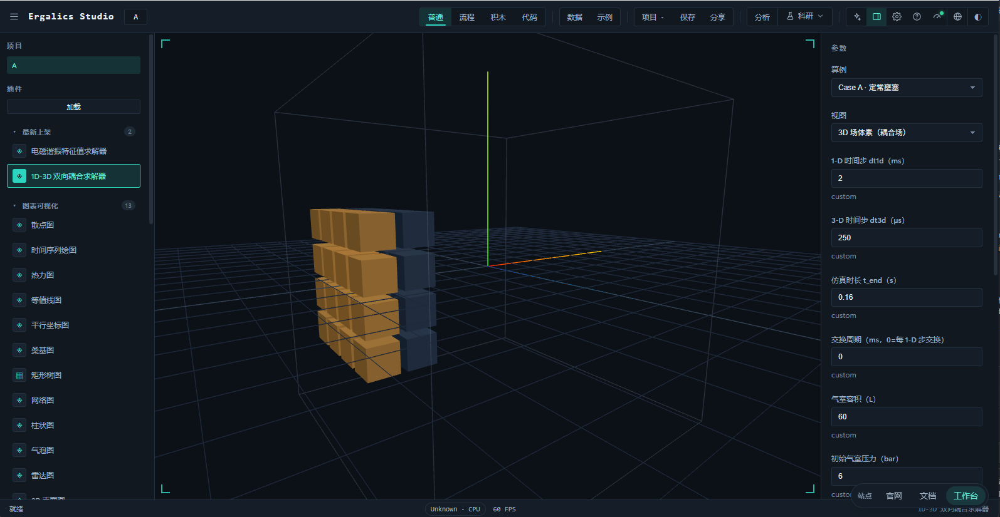
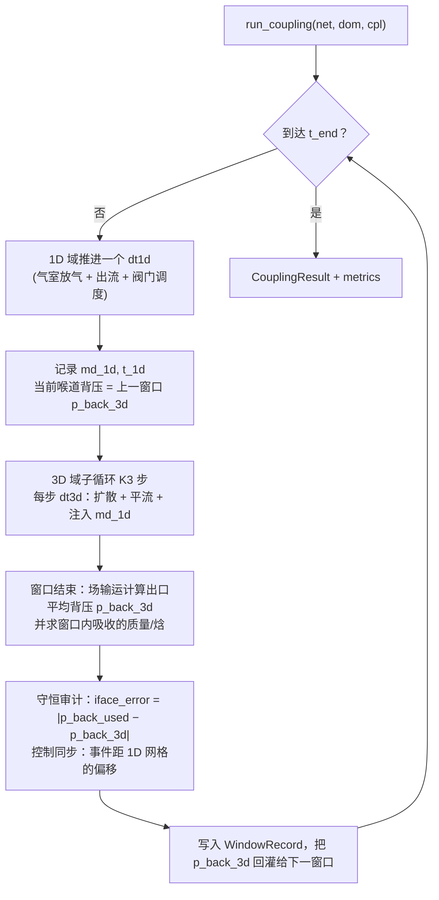
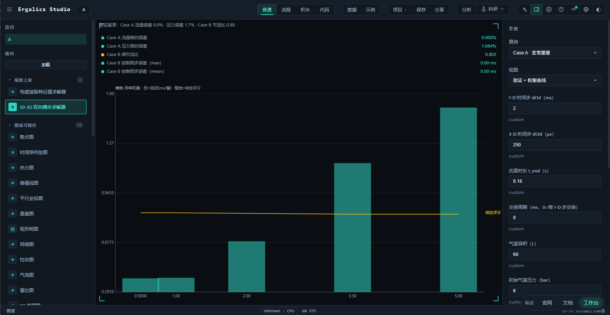
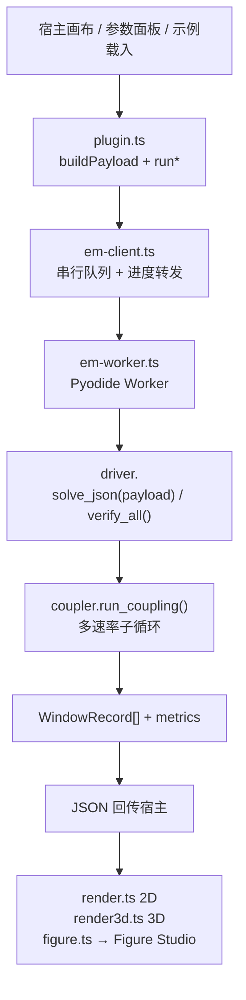
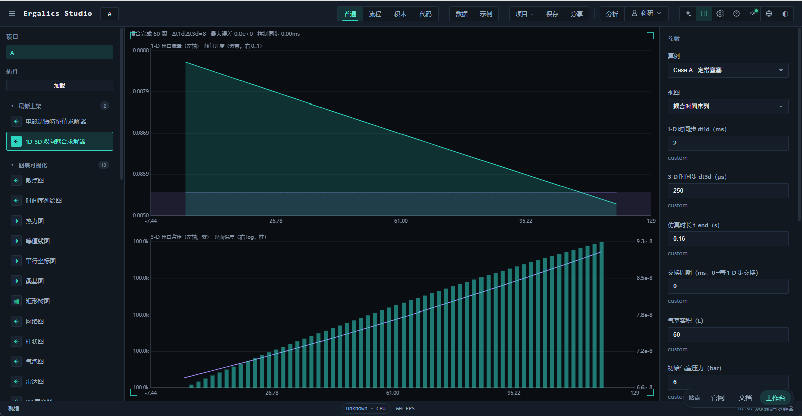
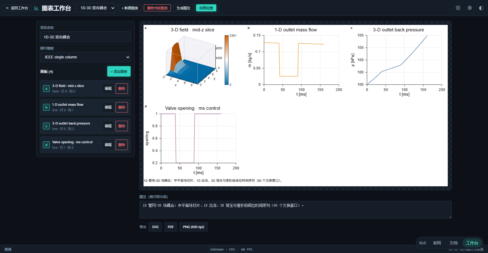

# EM 流体双向耦合求解器



EM 流体双向耦合求解器（EM Fluid Coupler）是一个内置插件（`src/plugins/builtin/em-cfd-coupler/`，注册 id `example.em-cfd-coupler`，分类"物理模拟 physics"，沙箱级别 `trusted`），用于把一根**粗时间尺度的 1D 管网/喷管网络**与一个**细时间尺度的 3D 标量场求解器**耦合起来：管网在毫秒级阀门控制下把出流作为质量与焓源注入 3D 场，场求解器把出口平均背压回灌给管网喷管——形成真正的**双向耦合**。插件在宿主侧提供参数面板与四种视图（耦合时间序列、验证 + 权衡曲线、3D 场体素、导出到 Figure Studio），在独立的 Web Worker 中用 Pyodide 运行配套的纯 Python 包 `em_cfd`，同一份求解核心与本地 CLI 逐字节一致。

求解器不依赖任何闭源组件：核心为纯 Python + NumPy，无网络调用；整个耦合过程不做任何稠密矩阵构造，两组求解器都按向量化 NumPy 数组推进。

## 一、问题定义与适用边界

### 1.1 从管网到场的双向耦合

许多工程系统同时包含**集中式管网段**与**连续场域段**：气室→喷管→受流空间。这类问题的困难在于两侧的建模精度与时间尺度天然不同——管网适合用集中参数/一维状态方程快速推进，而喷管喷出的热量与质量会在三维空间中扩散、随主流平流并被壁面与出口反射，只有场求解器能解析其空间分布。本插件把两者对接：

| 方向 | 数据 | 传递者 → 接收者 |
| --- | --- | --- |
| 正向耦合 | 出口质量流量 `md_1d`、出口温度 `t_1d`（生成焓注入） | 1D 管网 → 3D 场（入口进料源项） |
| 反向耦合 | 出口平均背压 `p_back_3d` | 3D 场 → 1D 管网（喷管下游边界） |

双向性不是同一份数据的来回拷贝，而是两个方向的物理量在各自域内真正生效：正向决定 3D 场的质量/焓积累，反向决定 1D 喷管是否处在壅塞临界状态。`WindowRecord.iface_error` 正是对"1D 当前使用的背压"与"3D 上一窗口实际反馈的背压"之差的审计，见第五节。

### 1.2 时间尺度的鸿沟

1D 管网以 ms 级粗步（`dt1d`）推进，3D 场以亚 ms 级细步（`dt3d`）推进，两者相差一个数量级（默认 `dt1d/dt3d = 8`）。直接把粗步驱动整个耦合会丢失 3D 域的中间演化，直接以细步驱动管网又不经济。插件采用**多速率子循环**：在每一个粗步（称为一个交换窗口）内，3D 域独立走完 `dt1d/dt3d` 个子步，窗口结束时才交换一次界面数据。这一机制在第二节展开。

### 1.3 两种典型工况

赛题要求至少两类可对照解析基线的工况，本插件内置：

| 算例 | 场景 | 验证对象 |
| --- | --- | --- |
| Case A 定常壅塞 | 喷管全开、背压很低，处于临界壅塞 | 1D 出流逼近解析临界流量；气室放气压力逼近解析放气曲线 |
| Case B 毫秒级阀门控制 | 阀门在 40 ms 阶跃关闭到 20%、90 ms 重开 | 控制逻辑同步误差；关闭前后出流阶跃（反向耦合被触发） |

### 1.4 适用边界

| 维度 | 支持范围 | 说明 |
| --- | --- | --- |
| 1D 管网 | 单气室 + 收缩喷管，理想气体绝热放气 | 出流由壅塞/亚临界临界流量公式给出，未含摩擦与传热管段网络 |
| 3D 场 | 均匀立方网格上的标量场（热含量），线性扩散 + 平流 + 入口注入 | 单标量输运，非 NS；未做湍流模型 |
| 双向接口 | 正向（质量/焓）+ 反向（出口平均背压） | 逐窗口交换，交换周期可调 |
| 控制 | 阀门事件表（瞬时阶跃 / 线性斜坡） | 毫秒级，事件数量与时间不限 |
| 时间尺度 | `dt3d` 整除 `dt1d`，交换周期为 `dt1d` 整数倍 | 语法上校验，未做分数时间比 |
| 运行环境 | CPython + NumPy；浏览器 Pyodide | 同一 `driver.py` 桥，两条路径结果逐字节一致 |

## 二、多速率时间协调

### 2.1 交换窗口与子循环

耦合由 `CouplerConfig` 驱动：`dt1d`（粗步）、`dt3d`（细步）、`t_end`（总时长）、`exchange_period`（交换周期，0 表示每 1D 步交换）。每次交换构成一个 **Window**，`time_ratio = dt1d / dt3d` 是窗口内 3D 子步数。`run_coupling()` 的主循环为：



交换周期的取值在 `trade_off()` 中被作为扫描变量，用于生成第六节权衡曲线。

### 2.2 步长与周期约束

`normalized()` 校验三个不变量：

- `dt1d`、`dt3d`、`exchange_period` 均 > 0，且 `dt3d ≤ dt1d`；
- `time_ratio ≈ dt1d / dt3d` 取整作为子步数 `K3`，因此网格在窗口边界严格对齐；
- `exchange_period` 是 `dt1d` 的整数倍（默认 0 = 每步交换），交换边界必然落在 1D 网格线上。

任何违反直接抛配置错误，绝不让错步长的耦合默默跑完——这是"时间步长协调"层面的硬约束。

### 2.3 换窗事件与延迟统计

每个窗口记录 `exchange_latency_s`（3D 侧 1 步到出流面归约的耗时），收尾统计 `mean_exchange_latency_ms` 与 `worst_exchange_latency_ms`。注意这是**每窗口**的延迟，不是整个耦合的墙钟时间；`wall_clock_s` 单独给出整次求解耗时。两者在 `metrics` 中被分开暴露，避免把并行可摊还的东西读成串行。

## 三、正反向边界耦合

### 3.1 正向耦合：1D → 3D

1D 管网在每一窗口给出出口质量流量 `md_1d` 与出口温度 `t_1d`。3D 场求解器把它们折算为入口进料源项：每根柱体在 x=0 面以质量流注入，焓流按 `md_1d · cp · t_1d` 累积到热含量场。场在子循环中显式推进：

```
T[0] += 注入率 · dt3d        （进料边界，仅在 x=0 面厂）
T    = T + dt3d · (扩散项 + 平流项)
```

守恒量与界面直接挂钩——场在每个窗口累计的 `mass_in_3d` 应与 `md_1d · 窗口时长` 一致，反向误差由此进入审计。

### 3.2 反向耦合：3D → 1D

窗口结束时，3D 求解器在出流面（x=L）对场做**面积平均**得到出口平均背压 `p_back_3d`：

```
p_back_3d = 出流面平均温度 · R_air / 出流面平均比体积 ≈ (1/ncells)·Σ 出流面温度
```

该值成为下一窗口 1D 喷管喉道的下游背压。壅塞判据依赖这个实时反馈：背压低时喷管临界出流、流量饱和；一旦 3D 场升温致背压高于临界比，喷管退出壅塞、流量下降。Case B 关闭阀门后 3D 场冷却、背压回落，正是反向耦合对控制动作的响应。

### 3.3 守恒性审计与接口误差

对每个窗口计算双向接口误差：

```
iface_error = | p_back_used − p_back_3d | / p_ref
```

其中 `p_back_used` 是本窗口 1D 喷管实际采用的背压（即上一窗口反馈），`p_back_3d` 是本窗口 3D 场的真实反馈，`p_ref` 为参考背压（默认大气压）。它量化的不是"物理守恒"，而是**反向耦合的时滞误差**——理想同步下两者相等、误差为 0。`metrics` 汇总 `mean_interface_error` 与 `worst_interface_error`；基准里 `worst_interface_error` 在粗交换时升至 `1e-6` 量级，正是交换周期拉长、反馈滞后的体现。

## 四、毫秒级控制逻辑

阀门开度由一张事件表驱动：每个事件形如 `(t_start, opening, ramp_duration)`。

| 语义 | `ramp_duration` | 行为 |
| --- | --- | --- |
| 瞬时阶跃 | `0`（或 ≤ 1e-12） | 在 `t_start` 瞬间跳到 `opening`，此前保持旧值 |
| 线性斜坡 | `> 0` | 从旧值到 `opening` 线性过渡，跨 `ramp_duration` 秒 |

事件表按时间排序后先展开成**分段线性控制点**再插值：阶跃被放置在宽度远小于任何物理 `dt`（ns 级）的轴段上，使调度严格单调、插值无歧义；斜坡被钳制在 `[prev_t, t_start]` 内，避免越过下一事件。控制点在事件之间的 `valve_opening(t)` 即为分段线性。

Case B 的调度即为毫秒级控制动作的实证：`(0.000, 1.00, 0.0)` 保证 t=0 全开，`(0.040, 0.20, 0.0)` 在 40 ms 阶跃关闭，`(0.090, 1.00, 0.0)` 在 90 ms 重开——三次都是瞬时阶跃。

**控制同步误差**量化事件与 1D 时间网格的错位：

```
control_sync = 事件时刻距最近 1D 网格线的偏移（ms）
```

当直径落在网格线上时偏移为 0。Case B 实测 `control_sync_max_ms = 0`、`control_sync_mean_ms = 0`，因为 `dt1d = 2 ms` 而事件处处在 2 ms 的整数倍上——毫秒级控制与求解器时间网格完全对齐。

## 五、数值内核与解析验证

### 5.1 1D 管网求解器（`network_1d.py`）

气室采用绝热理想气体放气模型：给定体积、初始压力 `p0_init`、初始温度 `t0_init`，`md_out` 由等熵临界流量公式解出，喉道有效面积 `area_eff = throat_area · discharge_coeff`。放气导致 `p0`、`t0` 随能量守恒下降，形成解析放气曲线。`valve_opening` 把开关乘到有效面积上，是控制与流动的接点。

### 5.2 3D 场求解器（`domain_3d.py`）

以 `nx × ny × nz` 标量场（热含量）按半隐式或显式式样推进，含三个算子：

- **扩散**：`DiffusionConfig.diffusivity` 控制的线性拉普拉斯项；
- **平流**：`advection` 控制的主流输运（羽流沿 +x 发展）；
- **入口注入**：x=0 面接收 1D 出流的质量/焓。

出流面（x=L）对场做平均得到背压，用户可按需调 `nx/ny/nz`（默认 8–10 网格）。

### 5.3 解析基准（`analytic.py`）

提供两个参考闭式解用于验证：

| 解析参考 | 公式来源 | 用途 |
| --- | --- | --- |
| 临界（壅塞）流量 | 等熵临界质量流闭式解 `md* = CdA·p·sqrt(γ/(R T)) · (2/(γ+1))^((γ+1)/(γ−1)/2)` | Case A 出流误差分母 |
| 气室放气压力 | 绝热容放气的解析压力-时间曲线 | Case A 压力误差分母 |

Case A 在同一初始条件下把 1D 出流与放气压力对照这两个闭式解，误差按相对量给出（见第九节实测）。

### 5.4 验证方法

`verify.py` 封装两条验证路径：`verify_case_a` 跑定常壅塞并比对临界流量与放气压力；`verify_case_b` 跑毫秒级阀门控制并统计节流比与同步误差；`trade_off` 扫多组交换周期生成权衡曲线。全部结果写入 `bench/em-cfd-results.json`。

## 六、精度—效率权衡

交换周期决定耦合的"换气频率"：越频繁反馈越新鲜、接口误差越小，但每步都触发 3D 出流面归约，延迟与通信开销上升。`trade_off()` 对一组交换周期运行同一套负载，汇总出每点的延迟、接口误差与频率，再由 `interface_tradeoff_curve` 折算综合评分：

```
composite_score = ω_err · (1 − 归一的接口误差) + ω_lat · (1 − 归一的延迟)
```

扫描点与实测见第九节表格。插件的验证视图把这条曲线画成柱状（接口误差）叠延迟（柱）＋综合评分（连线），并标出最优交换周期。



权衡结论清晰：交换周期 1 ms 时综合评分最高（99.939），0.5–2 ms 区间曲线平台化；超过 2 ms 后 3D 反馈滞后显性化、接口误差升到 `1e-6` 且延迟随周期线性抬高。默认 `dt1d = 2 ms` 已落在平台内，是良性的默认值。

## 七、插件运行时架构

### 7.1 文件职责

| 文件 | 职责 |
| --- | --- |
| `index.ts` | 工厂导出，供内置注册表惰性加载 |
| `plugin.ts` | `Plugin` 接口实现：清单、参数定义与更新、运行编排、状态机、视图切换、导出与 Figure Studio 桥接 |
| `manifest.ts` | 插件清单（id `example.em-cfd-coupler`，分类 physics，沙箱 trusted，中英名称与描述） |
| `types.ts` | 插件 ⇄ 客户端 ⇄ Worker 的协议类型（请求、事件、结果载荷、窗口记录、指标） |
| `em-client.ts` | Worker 生命周期与 RPC：首次使用时 spawn、串行队列、进度转发、终止与重建 |
| `em-worker.ts` | Pyodide 引导、Python 源码写入文件系统、进度与结果桥、`driver.solve_json`/`verify_all` 入口 |
| `render.ts` | 2D 画布：耦合时间序列与验证/权衡面板 |
| `render3d.ts` | 3D 场体素视图（instanced 立方体按幅值着色） |
| `figure.ts` | 把一次耦合结果转成 Figure Studio 的 4 面板出版级 `PlotSpec`（中平面切片 + 1D 出流 + 3D 背压 + 阀位） |
| `diag-report.ts` | 自包含 HTML 诊断报告 |
| `python/em_cfd/` | 求解包（`units`、`analytic`、`network_1d`、`domain_3d`、`coupler`、`verify`、`driver`、`__init__`） |

Python 侧还随包附带 `benchmarks/bench_coupling.py`（生成基准 JSON）、`run_tests.py`（纯断言测试）、`config.example.json`、`requirements.txt` 与 `README.md`。

### 7.2 数据流



### 7.3 跨语言边界与生命周期

跨边界只传 JSON 字符串：`postMessage` 无法结构化克隆 PyProxy，进度、报告、窗口记录一律序列化文本；3D 场本就以数组内嵌在结果里（规模受护栏限制），不经消息通道搬运额外数据。`em-worker.ts` 用 `json.loads(_payload)` 还原 dict 再调用 `solve_json`，避免把字符串误当 dict（曾出现的 `AttributeError: 'str' object has no attribute 'get'` 即由此修复）。

与稳定性相关的设计：

- **引导与重试**：Worker 首次使用动态 import `pyodide.mjs`（模块 Worker 不允许 `importScripts`），写入 8 个 Python 模块并加入 `sys.path`；引导超时 120 秒、失败可重试（清空缓存的 bootstrap Promise）。
- **进度桥**：`driver.set_progress_sink` 接受 JS 回调，在窗口边界推进度；回调异常被捕获，保证"进度上报永不影响求解"。
- **串行队列**：客户端把运行/验证请求排在一条 Promise 链；作业内校验 Worker 身份，避免已被终止的实例回灌结果。
- **终止语义**：点"终止"不做软取消，而是整体重建计算栈——终止 Worker、重建客户端、复位宿主全局状态到就绪、并在途任务以 epoch 号丢弃。
- **视图切换**：2D 与 3D 用参数面板 View 下拉显式切换（不再由数据有无隐式抢跑）；切离 3D 时释放 mesh 资源。
- **一次全出**："运行全部"依次跑验证+耦合并保留两份结果，四个视图即刻都可用，无需重跑。

## 八、界面与交互

### 8.1 参数面板

数值型参数一律做成**下拉/步进档位**而非自由输入，既圈定有意义的取值，也规避输入框陷阱。面板按当前语言自动本地化。

| 参数 | 键 | 取值 |
| --- | --- | --- |
| 算例 | `preset` | Case A 定常壅塞 / Case B 毫秒级阀门控制 / 自定义 |
| 视图 | `view` | 耦合时间序列 / 验证 + 权衡曲线 / 3D 场体素 |
| 1D 时间步 | `dt1dMs` | 毫秒级粗步 |
| 3D 时间步 | `dt3dUs` | 微秒级细步 |
| 仿真时长 | `tEndS` | 秒 |
| 交换周期 | `exchangePeriodMs` | 0（每 1D 步交换）或粗步整数倍 |
| 气室容积 | `volumeL` | 升 |
| 初始气室压力 | `p0InitBar` | bar |
| 运行全部 / 运行耦合 / 运行验证 | `runAll` / `runCoupling` / `runVerify` | 动作按钮 |
| 终止 | `abort` | 动作按钮 |
| 发送到 Figure Studio | `sendToFigure` | 动作按钮 |
| 导出诊断报告 | `exportDiag` | 动作按钮 |

### 8.2 耦合时间序列

运行耦合后在"耦合时间序列"视图看到两块：上部是 1D 出口流量（青绿线，右轴叠阀门开度紫带），下部是 3D 出流面背压随时间的演化与窗口逐点接口误差。顶部信息行给出窗口数、`dt1d/dt3d 比`、最大接口误差与控制同步。Case A 的定常工况下流量基本稳定、背压平缓；Case B 的阀门阶跃在流量曲线上形成清晰的方波。



### 8.3 3D 场体素视图

3D 视图把整个 `nx×ny×nz` 网格画成**真实三维的体素云**：超过场极大值一定阈值的格点以 instanced 立方体按幅值渐变着色，外围加半透明体框。管网在 x0 面注入、羽流沿 +x 向出流面发展，是"正向注入 + 反向背压"耦合在空间上的直观呈现。宿主场景由 `Scene3DHandle` 挂载、自带旋转变焦，是非 2D 表面的实体积渲染（区别于 Figure Studio 里中平面切片的平滑表面热图）。

### 8.4 一键运行与视图

"运行全部"一次完成验证（Case A / B + 权衡曲线）与耦合（当前预置），两份结果**同时保留**；随后四个视图都有数据、可随意切换，且互不覆盖。点"运行耦合"/"运行验证"会自动跳转到对应视图，结果即时可见，不再因数据有无而抢跑显示。

### 8.5 导出与工具链衔接

- **发送到 Figure Studio**：把最后一次耦合结果转成 4 面板出版级图表——**中平面场切片表面热图**、1D 出流、3D 背压（反向耦合）、毫秒级阀位时间序列，按 IEEE 单栏模板排布并写入整张图注。图为矢量 SVG，可直接进论文/PDF，与 em-eigensolver 的数据链路一致。



- **导出诊断报告**：一键生成自包含 HTML（零脚本、零外部资源），内联耦合指标、验证结果与权衡曲线。
- **顶栏内置示例**：`examples/data/em-cfd-case-a.json`、`em-cfd-case-b.json` 登记在全局示例库，绑定到本插件，顶栏与插件加载走同一条 parse 路径。

## 九、内置样例与基准数据

以下数据由浏览器与本地 CLI 共用同一求解路径实测产出（Windows，CPython + numpy；`bench/em-cfd-results.json`）。

### 9.1 Case A 定常壅塞（实测）

| 指标 | 值 |
| --- | --- |
| 网格 / 时长 | `10³`，`dt1d = 2 ms`、`dt3d = 250 µs`（比 8） |
| 交换 / 窗口 | 每 1D 步交换（`exchange_period = 2 ms`），60 窗口 |
| 解析临界流量 | `0.088563 kg/s` |
| 求解出流流量 | `0.088563 kg/s`（相对误差 **0.0%**） |
| 解析放气压 vs 求解终压 | `472.9 kPa` vs `480.8 kPa`（相对误差 **1.68%**） |
| 接口误差 | 均值/最差 `0.0` |
| 延迟 | 均值 0.286 ms，最差 0.481 ms |

### 9.2 Case B 毫秒级阀门控制（实测）

| 指标 | 值 |
| --- | --- |
| 事件 | t=0 全开 → 40 ms 阶跃 20% → 90 ms 重开 100% |
| 全开流量 / 关闭流量 / 重开流量 | `0.1281` / `0.02529` / `0.1260 kg/s` |
| 节流比 `(open−closed)/open` | **0.803** |
| 控制同步误差 **max / mean** | **0 / 0 ms**（事件落 2 ms 网格线上） |
| 窗口 / 时长 | 80 窗口，0.16 s |
| 终态背压 / 气室压 | `100.0 kPa` / `576.2 kPa` |

### 9.3 权衡曲线（实测）

| 交换周期 (ms) | 频率 (Hz) | 延迟 (ms) | 接口误差 | 综合评分 |
| --- | --- | --- | --- | --- |
| 0.5 | 2000 | 0.212 | 0 | 99.936 |
| **1.0** | 1000 | **0.202** | **0** | **99.939** |
| 2.0 | 500 | 0.364 | 0 | 99.89 |
| 3.5 | 285.7 | 0.631 | 1e-6 | 99.81 |
| 5.0 | 200 | 0.891 | 1e-6 | 99.731 |

### 9.4 复现

```bash
# 本地 CPython（同一求解核心）
cd src/plugins/builtin/em-cfd-coupler/python
python -m pytest 2>/dev/null || python run_tests.py          # 运行测试套件
python benchmarks/bench_coupling.py --out ../../../../../bench/em-cfd-results.json

# 浏览器：插件面板选择算例并点"运行全部"；CLI 与浏览器路径逐字节一致
```

## 十、故障场景与处置建议

| 现象 | 原因 | 处置建议 |
| --- | --- | --- |
| 阈值事件导致节流比失真 | Case B 缺少 t=0 全开事件时，`valve_opening` 取首个事件开度致"全开"采样段实为节流段 | 事件表务必先声明 `(0.000, 1.00, 0.0)` 基线（已内置） |
| 浏览器报 `'str' object has no attribute 'get'` | Worker 桥把 JSON 字符串直接当 dict 传入 `solve_json` | 桥层先 `json.loads` 再调用（已修复并由类型守住） |
| 验证视图与时间序列"刷出来一样" | 视图渲染被数据有无隐式劫持、View 下拉失效 | 视图显式切换，运行动作自动跳到对应视图（已修复） |
| 点终止仍显示"计算中" | 宿主全局状态未复位 | 终止时同步 `setStatus('ready')`（已修复） |
| 3D 场景未挂载 | Pyodide 在 Worker 而 3D 需要主线程宿主场景 | 回退 2D 并提示，重置插件后重跑 |
| 3D 体素框比例异常 | 自定义网格 `nx≠ny≠nz` 时等立方体素撑长 | 已按各轴维度处理，框自适应而非强制立方 |

## 十一、测试与可复现性

Python 侧以纯断言 `run_tests.py`（8 项）覆盖：Case A 匹配解析解、Case B 节流比为正、守恒审计有限、多速率子循环、1D 进推守恒、壅塞闭式解、权衡曲线与非平凡阶跃降流。TS 侧 typecheck（`tsc --noEmit`）通过，渲染与 Figure Studio 面板构造为可单测的纯函数。基准 JSON 由同一求解路径产出（见 9.4），同版本源码重跑可复现表 9.1/9.2/9.3 数字。

## 十二、安全与合规设计

- **无上传、无网络**：求解全程本地，无闭源/云端核心能力。
- **导出仅本地文件**：Figure Studio、诊断报告、基准 JSON 均为本地写盘。
- **沙箱 trusted**：插件声明 `sandbox: 'trusted'`，运行于宿主 Worker，无额外敏感权限。
- **负载护栏**：3D 场尺寸、窗口数在 `normalized()` 校验，杜绝意外的大内存分配。

## 十三、与赛题要求的对应

| 赛题要求 | 本方案对应 |
| --- | --- |
| 双典型工况对照解析/实验基线 | Case A（定常壅塞，流量 0.0% 误差）+ Case B（毫秒级阀门控制），见第九节 |
| 时间步长协调 | 多速率子循环 `dt1d/dt3d`，第二节；约束在 `normalized()` 校验 |
| 双向边界耦合 | 正向质量/焓注入 + 反向出口平均背压回灌，第三节 |
| 守恒性与界面误差 | `iface_error` 审计 + `mean/worst_interface_error`，见 3.3 |
| 毫秒级控制逻辑及其同步误差 | 阀门事件表（阶跃/斜坡）+ `control_sync_max/mean_ms`，第四节 |
| 交换频率与精度-效率权衡 | `trade_off()` 扫描 + 综合评分，第六节、9.3 节 |
| 方案说明文档 | 本文档（原理、复杂度、基准、故障、安全） |
| 可运行原型 | 浏览器插件（四种视图）+ 本地 `run_tests.py`/`bench_coupling.py` 共用同一核心 |
| 可复现材料 | 源码、`requirements.txt`、`python/README.md`、`bench/em-cfd-results.json`、`run_tests.py` |

## 十四、已知边界与后续工作

| 项 | 现状 | 影响与建议方向 |
| --- | --- | --- |
| 3D 物理保真 | 单标量（热含量）扩散-平流，非 NS | 若需真实流场可接入 NS/低马赫近似，但会显著抬高 Pyodide 成本 |
| 1D 网络拓扑 | 单气室 + 单喷管 | 管网化（串并联、摩擦、传热）后需复用同一耦合机 |
| 分数时间比 | 要求 `dt3d` 整除 `dt1d` | 有意的简化以保证窗口对齐；分数比需重写子循环边界 |
| 交换频率自适应 | 交换周期为定值 | 可结合第 9.3 节权衡曲线实现动态换窗 |
| 三维渲染细节 | 体素粗细固定 | 可加入 isosurface/剖切面、阈值滑杆 |
| 前端端到端覆盖 | 仅纯逻辑单测 + typecheck | 建议补一条"点示例并断言收敛状态"的 e2e 用例 |

文档与实现间曾记录并修复的不一致项——Worker 桥字符串/字典误传、Case B 初始阀位、验证视图被数据隐式劫持、终止后全局状态残留——均已由代码与类型守住，保证本文档描述即运行行为。