# Ergalics Studio

Ergalics Studio 是一款完全运行在浏览器中的科学计算工作站：无需安装，打开即用，数据保存在本机。四种工作模式共享同一份数据，从看图、搭流程到写代码连贯不换工具，并可交付可复现的研究成果。

> 本文是 Ergalics Studio 的完整技术总结，覆盖系统架构、插件体系、四种工作模式、科研工具集、GPU 计算引擎与测试质量保障，另附使用指南与文档索引。数字基线为 59 个内置插件、42 个流程区块、19 个科研工具、33 个领域子系统、123 个测试文件 / 2233 个单元测试、13 套端到端套件、5 条 CI 工作流。

## 第一章 项目概览

### 1.1 项目背景与设计目标

#### 1.1.1 科学计算工具链的三重门槛

安装与环境门槛高。传统桌面软件（如 MATLAB、Origin）体积庞大、授权昂贵，一台新电脑从安装到能用往往要以小时计；Python 生态虽然免费开放，但要让初学者独立配好解释器、虚拟环境、数值库与绘图库，仍然是一件容易劝退的事。环境问题消耗的是本应投入在数据与问题本身上的注意力。

教学路径存在断层。从积木式编程过渡到真实代码，中间缺少一款能把"拖拽数据、搭建流程、编写代码"统一在同一界面里的工具。学生在一个工具里学会拖积木，换到另一个工具里面对黑漆漆的终端，两次学习之间没有衔接，已建立的直觉难以迁移。

交付与复现的门槛被低估。即便分析跑通了，"这次结论是怎么算出来的"往往没有留下可核查的痕迹：环境版本、随机种子、输入数据的哈希、代码快照散落在不同地方。等到投稿或复核时，重跑一遍常常得不到同一个数字。

前两条门槛 Ergalics Studio 用"把整个工作台搬进浏览器标签页"来回答；第三条门槛用一条从运行记录到可复现锁、再到补充材料打包的完整交付链来回答——这也是它与"在线画图工具"最根本的区别。

#### 1.1.2 六条设计目标

1. **零安装，打开即用。** 全部能力随网页交付，标准模式下把数据文件拖进窗口就能看到可视化结果。
2. **数据不出本机。** 项目与数据存储在浏览器 IndexedDB 中，可导出为 .clproj 文件离线流转，不存在云端副本。
3. **一条学习曲线走到底。** 四种模式面向同一份项目数据，从看到图、到搭流程、到拼积木、到写代码，能力渐进而不换工具。
4. **计算必须是真计算。** GPU 内核是真实的 WGSL 计算着色器，Python 是真正的 CPython，原生核心由 Rust 编译为 WebAssembly；每一个内核都有对应的单元测试与端到端数值一致性校验。
5. **结论必须可被重放。** 每一次执行都留下运行记录，环境与数据指纹可锁定为 `repro.lock`，报告与补充材料可一键打包成自包含文件与 ZIP。
6. **开放可扩展。** 插件契约清晰、市场目录内建、第三方插件默认运行在 Worker 沙箱中、`.cspkg` 包支持 Ed25519 签名与信任注册表，配合完整的开源代码与持续集成，生态可以安全地生长。

#### 1.1.3 四类用户，四种模式

| 模式 | 面向人群 | 核心体验 |
| --- | --- | --- |
| 标准（Standard） | 只想快速看图的人 | 拖入数据文件，自动识别格式并路由到匹配插件，即刻看到可视化 |
| 流程（Flow） | 数据分析初学者 | 用 42 个内置区块搭出可视化数据流管线，拓扑排序执行，逐节点查看输出 |
| 积木（Block） | 编程启蒙与教学 | 类 Scratch 积木编辑器，唯一入口是绿色"运行时"帽子区块，30 余种积木完全可脚本化 |
| 代码（Code） | 真实脚本用户 | Monaco 编辑器，Python 走 Pyodide Worker 中的真实 CPython，R / JavaScript 由进程内 IR 引擎执行，带 REPL 控制台与变量面板 |

<!-- pagebreak -->

**标准模式**是产品的"前门"。工作台采用经典的四区布局：顶栏负责项目与模式切换，左侧是项目树与插件列表，中央视口承载插件渲染，右侧是与所选插件实时绑定的参数面板。把文件拖进窗口，宿主会通过文件格式检测（按魔数识别，辅以扩展名，可选 WASM 辅助）自动路由到匹配的插件，例如拖入 .xyz 文件直接得到点云渲染；多个插件同时匹配时弹出选择框由用户决定。


*标准模式主界面：四区布局（顶栏模式切换、左侧项目与插件、中央插件渲染视口、右侧参数面板），文件拖入即自动路由到匹配插件。*

<!-- pagebreak -->

**流程模式**把分析过程显式化为一张有向无环图。用户从区块目录拖出数据源、变换、过滤、数学、统计、单位、可视化与绘图区块，连线成管线；编译器先做结构校验（端口匹配、必填参数、类型检查）与环检测、拓扑排序，执行器再按序执行并对每个节点做增量缓存，改动一个参数只重算受影响的下游节点。每个区块的输出都可以就地预览：可视化区块弹出插件渲染，统计区块以只读数据表或标量形式呈现。


*流程模式：以 DAG 管线连接数据源 / 变换 / 统计 / 可视化区块，编译后增量执行、就地预览。*

<!-- pagebreak -->

**积木模式**面向编程启蒙。类 Scratch 的画布上，绿色"运行时"帽子区块是脚本的唯一入口，帽子下方未连接的孤立区块永不运行，从根本上杜绝误执行破损代码；数据加载、变量、循环、数学运算与绘图积木拼在其下。点击运行后，宿主把积木图编译为共享中间表示（IR），由内置解释器逐节点执行。积木名称、提示与下拉选项均已本地化，5 个内置示例程序开箱即玩。


*积木模式：类 Scratch 画布以帽子区块启动脚本，积木图编译为共享 IR 执行。*

<!-- pagebreak -->

**代码模式**面向真实脚本用户。Monaco 编辑器之外，侧栏提供控制台与变量面板；Python 代码运行在 Pyodide Worker 中，是货真价实的 CPython，`studio` 作为正经可导入模块注入；R 与 JavaScript 走进程内 IR 引擎，与积木模式共用同一个解释器。仓库在 `examples/code` 目录提供 9 个可直接运行的示例程序，从蒙特卡洛求圆周率到信号分析一应俱全。


*代码模式：Monaco 编辑器 + 控制台 / 变量面板，Python 运行于 Pyodide Worker，注入 `studio` 模块。*

三个脚本模式共享同一份 IR：流程里搭好的管线可以变成积木，积木可以生成 Python 代码，代码模式下编辑的 studio 调用也能解析回积木图。一次编辑，三种表达，由专门的往返互转单元测试兜底。

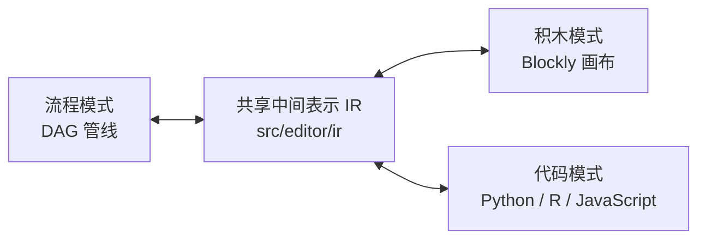
```mermaid
flowchart LR
    F["流程模式<br/>DAG 管线"] <--> IR["共享中间表示 IR<br/>src/editor/ir"]
    IR <--> B["积木模式<br/>Blockly 画布"]
    IR <--> C["代码模式<br/>Python / R / JavaScript"]
```

#### 1.1.4 项目现状

项目处于积极开发中，核心闭环已端到端可用并有测试覆盖。当前基线（版本 0.1.0，MIT 协议）：

- **59 个内置插件**：49 个核心/科学插件随启动自动加载，10 个趣味与工具插件声明 `autoload: false` 按需加载；侧栏按 charts / stats / physics / geo / bio / data / fun 七个学科分组。
- **四种工作模式**全部可用；积木、流程、代码三种模式经由共享 IR 双向互转。
- **19 个科研工具**按测量与评估、建模与推断、数据与谱系、信号与记录、报告与复现五组组织，统一挂在 `/studio/:toolId` 路由下。
- **42 个流程区块**覆盖数据源、变换、过滤、数学、统计、单位、绘图与可视化八类。
- **13 个可复用 WGSL 内核**：粒子积分、N-Body 全对引力、直方图、热力图、点云、D2Q9 流体的碰撞/迁移/涡量、波动方程、分块矩阵乘、基 2 FFT、K-means、键值分箱；每个内核都配数学一致的 CPU 实现。
- **33 个领域子系统目录**落地了统计、科研二进制 I/O、出版级绘图与组图、可复现性、不确定度、信号处理、建模与推断、数据质量与清洗、SQL、血缘、报告、补充材料、课程与作品长廊等能力（详见 07 篇）。
- **质量保障**：123 个测试文件、2233 个单元测试（2231 通过，2 个在无 GPU 的 CI 上跳过）；13 套 Playwright 端到端套件驱动真实浏览器（无头 Edge）验证；5 条 GitHub Actions 工作流覆盖单元测试、性能基准、安全扫描、发版归档与部署（详见 08 篇）。

### 1.2 技术架构

#### 1.2.1 总体分层

整体为"React 界面层 + 状态与核心服务层 + 插件运行时与原生核心 + 浏览器底座"的多层结构。所有层级运行在同一浏览器页面内，通过明确的契约通信，低层从不反向导入高层。

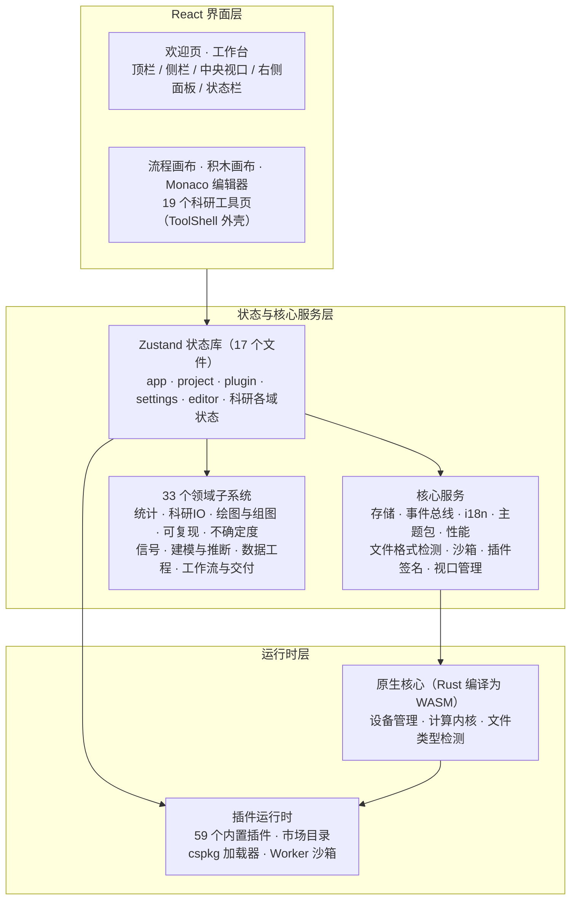
```mermaid
flowchart TB
    subgraph UI["React 界面层"]
        A1["欢迎页 · 工作台<br/>顶栏 / 侧栏 / 中央视口 / 右侧面板 / 状态栏"]
        A2["流程画布 · 积木画布 · Monaco 编辑器<br/>19 个科研工具页（ToolShell 外壳）"]
    end
    subgraph State["状态与核心服务层"]
        B1["Zustand 状态库（17 个文件）<br/>app · project · plugin · settings · editor · 科研各域状态"]
        B2["核心服务<br/>存储 · 事件总线 · i18n · 主题包 · 性能<br/>文件格式检测 · 沙箱 · 插件签名 · 视口管理"]
        B3["33 个领域子系统<br/>统计 · 科研IO · 绘图与组图 · 可复现 · 不确定度<br/>信号 · 建模与推断 · 数据工程 · 工作流与交付"]
    end
    subgraph Runtime["运行时层"]
        C1["插件运行时<br/>59 个内置插件 · 市场目录<br/>cspkg 加载器 · Worker 沙箱"]
        C2["原生核心（Rust 编译为 WASM）<br/>设备管理 · 计算内核 · 文件类型检测"]
    end
    UI --> B1
    B1 --> B2
    B1 --> B3
    B1 --> C1
    B2 --> C2
    C2 --> C1
```

各层职责如下：

- **React 界面层**（`src/pages` 与 `src/components`）：欢迎页、工作台四区布局、流程画布、积木画布、Monaco 代码编辑器与 19 个科研工具页。界面组件只与状态库和插件契约打交道，不含业务算法。
- **状态层**（`src/stores`，17 个文件）：分别管理应用壳、项目、插件、设置、编辑器、AI 面板、分析、区块、分块、实验、图表、血缘、笔记本、研究、模板引导与流程同步等状态，互相之间通过事件总线协作而非直接引用。
- **核心服务层**（`src/core`）：存储（IndexedDB 与 OPFS）、事件总线、国际化（中英双语）、主题包、性能上报、文件格式检测、视口管理、沙箱与 cspkg 加载、插件签名等横切能力，以及 33 个领域子系统。
- **插件运行时**（`src/plugins`）：内置插件的注册表与生命周期、市场目录、cspkg 包加载器与 Worker 沙箱。
- **原生核心**（`native/ergalics-core`，Rust）：编译为 WebAssembly 后向 JavaScript 暴露设备管理、缓冲区与计算内核抽象，并承担文件类型魔数检测。
- **浏览器底座**：WebGPU、Web Workers、IndexedDB / OPFS、OffscreenCanvas 与 Three.js，是所有能力最终落地的平台。

#### 1.2.2 贯穿架构的三条设计主线

**宿主与插件之间只有一个契约。** 每个插件实现统一的 Plugin 接口（初始化、激活、渲染、参数读写、数据加载、3D 场景渲染等），并从宿主获得一个 PluginApi 句柄用于本地化、状态上报、性能上报、通知与文件访问。第三方插件的入口代码默认运行在 Web Worker 沙箱中，仅通过类型化 RPC 协议与宿主通信，画布渲染经 OffscreenCanvas 转移完成；`.cspkg` 包在加载时进行清单校验（必填字段、id 格式、入口路径穿越防护、沙箱枚举），并可选地经 Ed25519 签名验证来源。沙箱回答"它运行时能做什么"，签名回答"这个包是谁发布的"——两者互相独立，合法签名不会削弱沙箱隔离。

**一条渲染管线服务全部模式。** 无论是流程模式的可视化区块、积木模式解释器调用的 `studio.plot`，还是代码模式 Python 里的 `studio.plot` 调用，最终都汇入同一个渲染桥接，落到同一个散点图、直方图插件上。2D 插件共享同一个 canvas 视口；3D 插件按需懒创建宿主管理的 Three.js 场景，并在 2D 插件激活时自动隐藏，保证两种视口互不渗透。

**GPU 计算三级降级。** Rust 核心编译为 WebAssembly，向 JavaScript 暴露设备管理、缓冲区与计算内核的完整抽象；当 WASM 模块不可用时，宿主侧服务自动改走原生 WebGPU API；两者皆不可用时插件回退到 CPU 实现，行为一致。`gpu-kernels.ts` 另按数据规模设阈值（如矩阵乘 16384 个输出元素、FFT 1024 个复数样本），低于阈值的小数据自动走 CPU，避免上传回读开销吃掉收益；引擎选择结果会写入运行记录，使"这一次是谁在算"可追溯。端到端测试对 GPU 与 CPU 的计算结果做数值一致性校验（误差约 2×10⁻⁶）。

#### 1.2.3 一条渲染管线服务全部模式

三种编辑模式产生的绘图请求汇入同一个渲染桥接，由共享的插件渲染器出图，因此"换一种表达方式"看到的是同一张图。

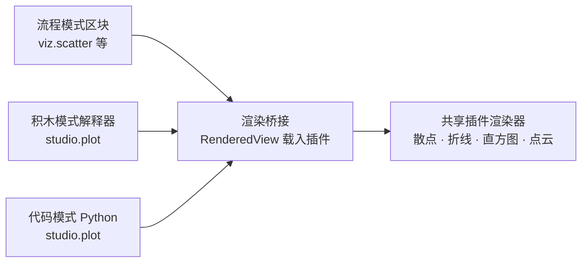
```mermaid
flowchart LR
    F["流程模式区块<br/>viz.scatter 等"] --> R["渲染桥接<br/>RenderedView 载入插件"]
    B["积木模式解释器<br/>studio.plot"] --> R
    C["代码模式 Python<br/>studio.plot"] --> R
    R --> P["共享插件渲染器<br/>散点 · 折线 · 直方图 · 点云"]
```

### 1.3 功能全景

#### 1.3.1 内置插件生态

49 个核心/科学插件按能力分为七组，随启动自动加载：

| 分组 | 插件 | 说明 |
| --- | --- | --- |
| 基础与三维可视化 | 散点、时间序列、柱状、气泡、直方图、热力图、等值线、图像查看、点云（2D 与 3D）、三维曲面、三维体素、粒子 | 覆盖最常见的工程与科学出图需求；2D 插件共享同一 canvas 视口，三维插件走 Three.js 场景 |
| 高级统计图 | 箱线、小提琴、误差带、QQ 图、平行坐标、桑基、矩形树图、网络图、雷达/极坐标 | 面向统计教学与多变量探索，网络类插件内置力导向布局 |
| 物理仿真 | N-Body 引力、格子 Boltzmann 流体、波动方程、双摆、流体双向耦合求解器（1D 管网-3D 场）、化学晶体、化学反应 | 数据驱动的仿真引擎，WGSL 计算内核加速，带 CPU 回退 |
| 交互实验室 | 电磁场、光学实验、结构力学、电磁谐振特征值求解器（稀疏厄密特征值） | 元件可直接拖动，实时求解并可视化 |
| 生物科学 | 蛋白质互作网络、酶动力学、流行病建模、序列比对、群体遗传学 | 从分子网络到群体遗传的数据驱动生物学建模 |
| 机器学习 | AI 训练器 | 四类模型（线性回归、非线性神经网络、逻辑回归、MNIST 卷积网络）浏览器内训练 |
| 地理可视化 | GeoJSON 地图、太阳系、气候图、人口金字塔、空间插值、地理测量、Tissot 椭圆、地形、GPX 轨迹、地球仪 | 离线矢量地图、投影畸变分析与 3D 地理渲染 |

10 个趣味/工具插件按需加载，保持首屏轻量：Mandelbrot 与 Julia 集浏览器、Spirograph 摆线艺术、Lissajous 曲线、Game of Life 元胞自动机、Harmonograph 谐振绘图、调色板探索器、科赫雪花、巴恩斯利蕨、烟花粒子与 Truchet 瓷砖。

插件全部来自同一套契约：无论内置还是第三方，加载、渲染、参数与数据访问走的是同一条路径，市场目录（`src/plugins/marketplace.ts`）按科学、趣味、工具三类组织，支持按需加载。参数面板由宿主依清单自动生成本地化表单，支持范围滑杆、下拉、数字、复选框、文本、文件、按钮与开关八类控件。

#### 1.3.2 流程模式区块体系

42 个内置区块分八类，构成流程模式的"词汇表"：

| 类别 | 数量 | 区块 |
| --- | --- | --- |
| 数据源 source | 4 | 示例数据、随机数据、网格数据、文件导入 |
| 变换 transform | 5 | 选择列、重命名列、添加列、归一化、排序 |
| 过滤 filter | 3 | 范围过滤、数值过滤、Top-K 选取 |
| 数学 math | 6 | 加、减、乘、除、平方根、绝对值（支持与标量或另一列运算） |
| 统计 stats | 14 | 摘要统计、直方图分箱、单样本 / 独立双样本 / 配对 t 检验、单因素方差分析、Mann-Whitney U 检验、卡方独立性检验、相关分析、Cohen's d 效应量、多重比较校正、Bootstrap、蒙特卡洛传播、MCMC 采样 |
| 单位 units | 2 | 量纲换算、量纲一致性检查 |
| 可视化 viz | 4 | 散点、折线、直方图、二维点云（经渲染桥接走插件出图） |
| 绘图 plot | 4 | 折线、散点、直方图、柱状（出版级矢量引擎渲染，可直接导出 SVG / PDF） |

区块元数据（名称、描述）内建中英双语；编译器负责结构校验、端口匹配、类型检查与环检测，执行器以节点为粒度做增量缓存与失效重算，示例管线（`examples/projects` 下 11 个真实 .clproj 项目文件）在构建期经 `import.meta.glob` 自动发现。

#### 1.3.3 数据格式支持

| 类别 | 格式 | 说明 |
| --- | --- | --- |
| 常规数据 | CSV、JSON、XYZ、DAT、PNG、GeoJSON | 散点、表格、网格、图像与矢量地图 |
| 科研二进制 | HDF5、NetCDF、FITS、Zarr、Parquet | 由纯 TypeScript 实现的科研 I/O 子系统解析，统一调度器按魔数分派 |
| 项目文件 | .clproj | 工程自有格式，lz-string 压缩，IndexedDB 存储并支持导出分享 |
| 插件包 | .cspkg | fflate 打包的 ZIP，加载时校验清单、可选验签，并落入沙箱 |

格式检测优先按魔数识别，辅以扩展名匹配；识别结果驱动标准模式的插件自动路由。大文件在进入解析前先经 `src/core/chunked/` 的行窗口读取与内容指纹，再由 Worker 池并行解析，避免阻塞主线程。

#### 1.3.4 科研能力全景

科研能力分布在两个层面——19 个面向任务的工具页，以及 33 个领域子系统。工具页解决"这一步要做什么"，子系统提供"这一步怎么算"：

- **测量与评估**：不确定性套件（Bootstrap / 蒙特卡洛 / MCMC 与 GPU 加速重采样，带 R-hat、ESS、HDI 等收敛诊断）、数据画像（流式单遍列画像与 0–100 质量分）。
- **建模与推断**：模型工作台（OLS / 逻辑 / 岭回归 / 多项式拟合与残差诊断）、贝叶斯推断（HMC / NUTS 与 WAIC、PSIS-LOO 模型比较）、模型推理（浏览器内 WebGPU 运行 ONNX）、参数扫描（全网格与拉丁超立方设计点、响应面）。
- **数据与谱系**：SQL 数据工作台（DuckDB-WASM）、数据血缘（Sugiyama 式分层 DAG）、图表工作台（IEEE / Elsevier 模板网格与矢量导出）、数据分析（假设检验与多重比较校正）、数据清洗向导（五类可回退步骤）。
- **信号与记录**：信号实验室（FFT、窗函数、Savitzky-Golay、ACF / PACF、加性时序分解）、Notebook（Markdown + Python）、实验记录（全工具运行台账与指标对比）。
- **报告与复现**：报告生成器（单一自包含 HTML）、可复现锁（`repro.lock` 五类漂移判定）、补充材料打包（数据 + 代码 + 许可的 ZIP）、课程模式、作品画廊。

此外，运行日志导出（`src/core/logger.ts`）把会话内的事件序列落为可下载文件，便于问题回溯与教学演示复盘。

## 第二章 系统架构

### 2.1 总体分层

整个应用是单页应用（Vite 6 构建，React 18 加 TypeScript 5.7 严格模式），自上而下分为四层，低层从不反向导入高层。核心原则是：**领域核心保持纯 TypeScript 且可单测，UI 层保持薄，第三方代码仅可进入沙箱**。

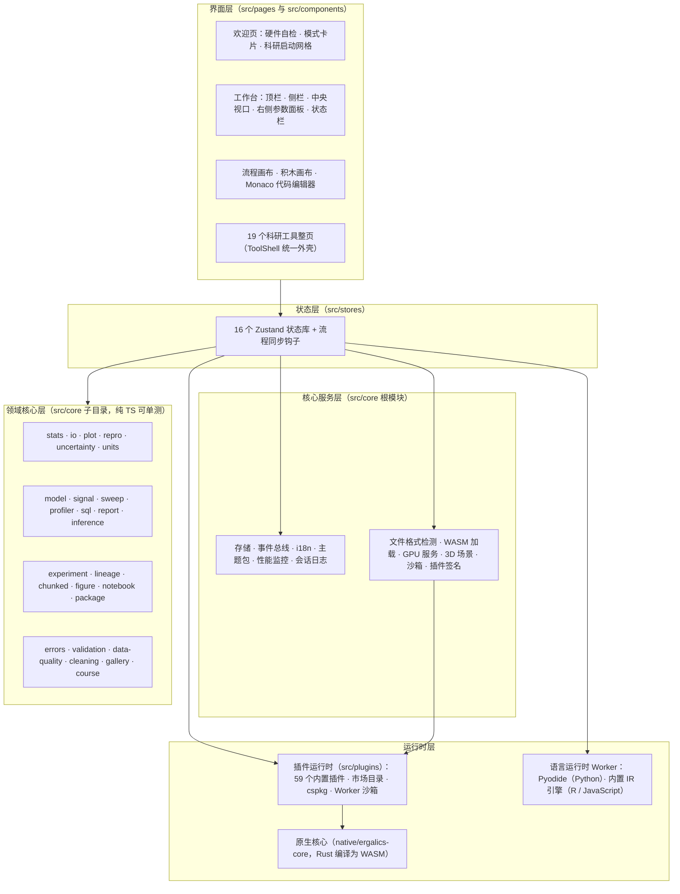
```mermaid
flowchart TB
    subgraph L1["界面层（src/pages 与 src/components）"]
        A1["欢迎页：硬件自检 · 模式卡片 · 科研启动网格"]
        A2["工作台：顶栏 · 侧栏 · 中央视口 · 右侧参数面板 · 状态栏"]
        A3["流程画布 · 积木画布 · Monaco 代码编辑器"]
        A4["19 个科研工具整页（ToolShell 统一外壳）"]
    end
    subgraph L2["状态层（src/stores）"]
        B1["16 个 Zustand 状态库 + 流程同步钩子"]
    end
    subgraph L3["核心服务层（src/core 根模块）"]
        C1["存储 · 事件总线 · i18n · 主题包 · 性能监控 · 会话日志"]
        C2["文件格式检测 · WASM 加载 · GPU 服务 · 3D 场景 · 沙箱 · 插件签名"]
    end
    subgraph L35["领域核心层（src/core 子目录，纯 TS 可单测）"]
        E1["stats · io · plot · repro · uncertainty · units"]
        E2["model · signal · sweep · profiler · sql · report · inference"]
        E3["experiment · lineage · chunked · figure · notebook · package"]
        E4["errors · validation · data-quality · cleaning · gallery · course"]
    end
    subgraph L4["运行时层"]
        D1["插件运行时（src/plugins）：59 个内置插件 · 市场目录 · cspkg · Worker 沙箱"]
        D2["原生核心（native/ergalics-core，Rust 编译为 WASM）"]
        D3["语言运行时 Worker：Pyodide（Python）· 内置 IR 引擎（R / JavaScript）"]
    end
    L1 --> B1
    B1 --> C1
    B1 --> C2
    B1 --> L35
    B1 --> D1
    C2 --> D1
    D1 --> D2
    B1 --> D3
```

**分层约束**

| 层 | 允许依赖 | 禁止依赖 |
| --- | --- | --- |
| 界面层 | 核心服务、状态库、领域核心 | 直接操作运行时细节（一律经服务层） |
| 领域核心 | 纯 TS 标准库、内部模块 | DOM、React、浏览器专属 API |
| 核心服务 | 领域核心、浏览器 API | React 组件 |
| 运行时层 | 浏览器 API、WASM | 领域核心反向依赖 |

各层职责与技术选型：

| 层 | 职责 | 主要技术 |
| --- | --- | --- |
| 界面层 | 路由、工作台四区布局、三种编辑器、科研工具整页、对话框与引导 | React 18、react-router-dom 7（HashRouter） |
| 状态层 | 16 个领域状态库与跨界面事件 | Zustand 5 |
| 核心服务层 | 横切服务（存储、i18n、主题、性能、沙箱、签名等） | 纯 TypeScript、IndexedDB、Web Workers、WebCrypto 之外的纯 TS 密码学实现 |
| 领域核心层 | 科学计算、科研工作流与可靠性内核，全部纯 TS 可 Node 单测 | 纯 TypeScript |
| 运行时层 | 插件注册与生命周期、沙箱执行、语言运行时、原生加速 | fflate（ZIP）、lz-string（压缩）、Rust 与 wasm-bindgen 0.2 |

### 2.2 路由与页面组织

应用采用 HashRouter（静态部署兼容），全部路由懒加载并以 `location.pathname` 为 key 重放 `.route-stage` 入场动画。路由表：

| 路径 | 页面 | 说明 |
| --- | --- | --- |
| `/` | 欢迎页 | 硬件自检（WebGPU · WASM · IndexedDB）、四模式卡片、科研工具启动网格、最近项目 |
| `/workbench` | 工作台 | 标准 / 流程 / 积木 / 代码四模式容器 |
| `/studio/:toolId` | 科研工具页 | 由 `RESEARCH_TOOLS` 注册表驱动，统一 ToolShell 外壳 |
| 旧路径（如 `/#/signal`） | 重定向 | 客户端重定向到 `/studio/:toolId`，永久保活 |
| `/settings` | 设置 | 全局设置、主题市场、PWA 面板、存储管理 |
| `/plugin/:pluginId` | 插件视图 | 单插件详情 |
| `/share/:payload` | 分享 | 分享载荷渲染 |
| `*` | 重定向 | 回欢迎页 |

#### 2.2.1 科研工具注册表（RESEARCH_TOOLS）

`src/pages/research/toolRegistry.ts` 是科研界面的唯一事实来源：每个工具声明一次 `id`、`path`、`legacyPath`、图标、i18n 标题与描述键、分组、是否进入启动网格、是否要求项目上下文与懒加载组件，由 `/studio` 路由、顶栏启动器与欢迎页启动网格共同消费。

当前共 **19 个科研工具**，分五组：

| 分组 | 工具 |
| --- | --- |
| 测量与不确定性 measure | uncertainty（不确定性）、profiler（数据画像） |
| 建模与推断 model | model-lab（回归建模）、inference（Inference Forge）、model-inference（ONNX 推理）、sweeps（参数扫描） |
| 数据与图谱 data | sql（SQL 工作台）、lineage（数据血缘）、figures（Figure Studio）、analysis（快速分析）、cleaning（数据清洗） |
| 信号与扫描 signal | signal（信号实验室）、notebook（笔记本）、runs（实验记录） |
| 交付与复现 deliver | report（报告构建）、reprolock（复现锁）、supplement（补充材料）、course（课程模式）、gallery（作品长廊） |

其中快速分析 `analysis` 的 `inGrid` 为 `false`——它保留顶栏独立按钮入口，不占启动网格位。新科研工具必须注册进该表并配置 `legacyPath`，禁止散落路由。

### 2.3 启动时序

应用启动遵循"先自检、再加载、后恢复"的固定顺序，任何一步的环境缺失都会如实报告而不是静默降级：

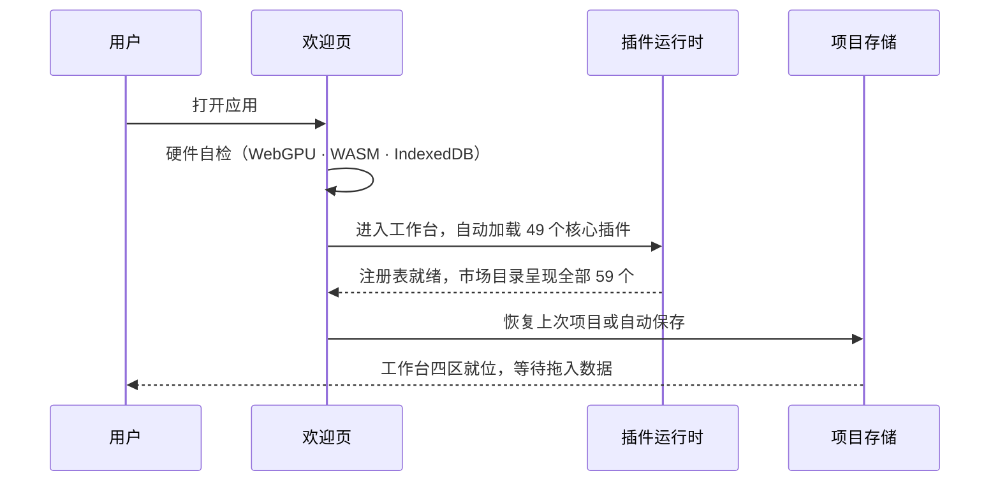
```mermaid
sequenceDiagram
    participant U as 用户
    participant W as 欢迎页
    participant P as 插件运行时
    participant S as 项目存储
    U->>W: 打开应用
    W->>W: 硬件自检（WebGPU · WASM · IndexedDB）
    W->>P: 进入工作台，自动加载 49 个核心插件
    P-->>W: 注册表就绪，市场目录呈现全部 59 个
    W->>S: 恢复上次项目或自动保存
    S-->>U: 工作台四区就位，等待拖入数据
```

应用装配阶段还会执行 `initProjectStore` / `initExperimentStore` / `initLineageStore`，使项目、实验记录与血缘图在任何页面进入前就绪；`main.tsx` 另行预热插件签名模块（含公钥信任注册表）与 OPFS 迁移逻辑。

欢迎页的自检结果同时决定后续行为的"档位"：WebGPU 可用则计算走 GPU 加速，WASM 模块存在则走 Rust 参考引擎，两者皆缺时插件以 CPU 完成同样的数学（详见 06 篇）。

### 2.4 状态管理

`src/stores/` 下共 **17 个文件**，承载全部应用状态；跨界的 UI 通信走一个小型类型化事件总线（`src/core/events.ts`），例如插件参数变化、宿主文件选择对话框等事件。状态库之间通过事件总线协作而非直接引用，避免环状依赖。

| 状态库 | 职责 |
| --- | --- |
| appStore | 宿主状态、横幅与通知、性能指标、面板开关 |
| projectStore | 当前项目、最近列表、保存与自动保存、分享、参数持久化 |
| pluginStore | 插件注册表、加载与激活生命周期、文件分发、宿主容器、内置插件加载失败重试 |
| settingsStore | GPU 模式、自动保存间隔、语言、PWA、主题包等偏好；语言以 i18n 模块为唯一权威源并双向订阅 |
| blockStore | 流程模式图状态、运行编排、节点输出缓存、运行取消 |
| editorStore | 积木与代码模式的会话（IR、代码文本、变量、控制台、语言），载入时逐字段净化 |
| analysisStore | 快速分析页的列选择、图型与分析结果 |
| researchStore | 科研工具页的公共上下文（当前文件、最近使用工具） |
| experimentStore | 实验运行记录的读写与筛选（IndexedDB runs 存储） |
| lineageStore | 数据血缘图的重建与查询 |
| chunkStore | 分块加载任务队列与进度 |
| figureStore | Figure Studio 的面板布局、图注与投稿检查状态 |
| notebookStore | 笔记本单元、执行状态与输出 |
| aiPanelStore | AI 助手面板的会话、模式（离线/在线）与授权状态 |
| tourStore / templateTourStore | 引导流程与模板引导的进度 |
| useFlowSync | 流程图 ↔ 共享 IR 的双向同步钩子，含注水签名守卫 |

项目生命周期：创建、打开、保存、自动保存与分享。项目格式为 `.clproj`，内容经 lz-string 压缩后存入 IndexedDB；流程图画布、积木程序、代码会话与笔记本单元全部持久化进项目文件，重新打开时完整恢复。分享链接由随机 UUID 标识，载荷在解析端做大小与结构双重校验，拒绝畸形数据。大文件场景下 `src/core/opfs.ts` 提供 OPFS 分块存储，`opfs-migration.ts` 负责把既有 IndexedDB 数据平滑迁移。

### 2.5 渲染管线

中央视口拥有三个绘图表面，宿主集中管理其可见性：

1. **共享 2D canvas**：所有 2D 插件（散点、折线、直方图、热力图、等值线、箱线、小提琴、桑基等）画在同一个画布上，由统一的 2D 视口抽象（`viewport2d`）提供快照式访问。
2. **DOM 容器**：供需要 DOM 元素的插件使用，也是沙箱插件经 OffscreenCanvas 转移后挂载画布的位置。
3. **宿主管理的 Three.js 3D 场景**：只有声明了 `renderToScene` 能力的插件激活时才按需创建，并配套轨道控制、灯光网格与尺寸自适应。

可见性判定流程：

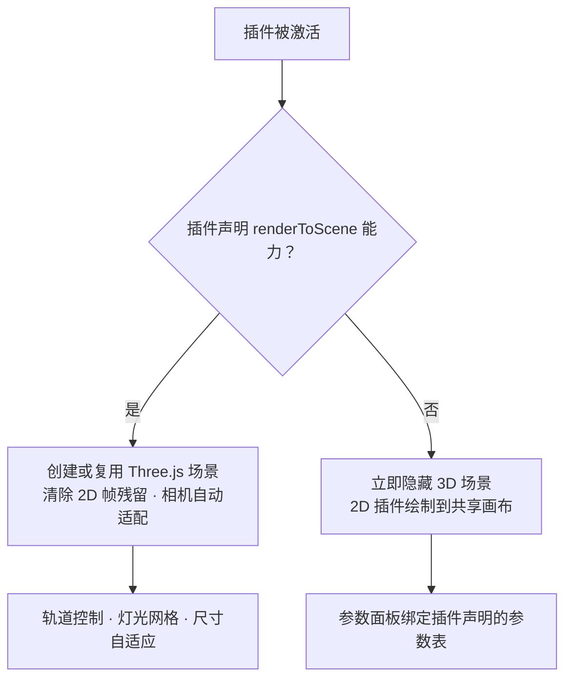
```mermaid
flowchart TD
    A["插件被激活"] --> B{"插件声明 renderToScene 能力？"}
    B -- 是 --> C["创建或复用 Three.js 场景<br/>清除 2D 帧残留 · 相机自动适配"]
    B -- 否 --> D["立即隐藏 3D 场景<br/>2D 插件绘制到共享画布"]
    C --> E["轨道控制 · 灯光网格 · 尺寸自适应"]
    D --> F["参数面板绑定插件声明的参数表"]
```

这保证 3D 坐标系永远不会渗透进 2D 视图，反之亦然；端到端测试对两种视口的互斥有专门断言。三维数据侧另有 `src/core/mesh3d.ts`（三维网格数据管线，纯函数）与 `src/core/pointcloud-gpu.ts`（百万级点云的 GPU 预算与降采样策略）。

### 2.6 目录结构

| 位置 | 内容 |
| --- | --- |
| src/core（根模块，34 个） | storage、events、settings、perf、logger、i18n（经 src/i18n）、gpu、compute、gpu-kernels、wgsl、wasm、fileFormat、parse-tasks、parse-worker、worker-pool、scene3d、viewport2d、mesh3d、pointcloud-gpu、sandbox、plugin-worker、pluginCache、cspkg、plugin-signing、crypto-primitives、dataFiles、exampleAssets、examples、download、opfs、opfs-migration、pwa、recentTools、site-links、citation |
| src/core（子目录，33 个） | stats、io、plot、repro、uncertainty、units、model、signal、sweep、profiler、sql、report、inference、experiment、lineage、chunked、cleaning、figure、notebook、package、gallery、course、templates、theme-pack、submit、bench、validation、errors、data-quality、ai、r、pyodide、monaco |
| src/blocks | 流程模式区块系统：类型、注册表、编译器、执行器、ops 与 DataTable 运算、区块目录（catalog，42 个区块）、本地化（l10n）、渲染桥接（render.ts） |
| src/editor | 积木与代码模式：ir（types、validate、hash、serialize）、flow 与 block 的互转、block（Blockly 引擎、积木定义、工具箱、主题、示例）、code（解析与示例）、codegen（Python、R、JS 三个生成器）、runtime（解释器与 Studio API） |
| src/components | 流程模式画布组件、积木与代码模式的编辑器面板组件、反馈与错误边界、图标集 |
| src/pages | welcome、workbench、studio、research（toolRegistry）、labs、signal、sweeps、sql、report、figures、notebook、gallery、settings、share、plugin、plugin-dialog |
| src/plugins | 内置插件（builtin，42 个）、市场目录（marketplace.ts）、示例包（marketplace-demo-packages.ts）、分类表（categories.ts） |
| src/stores | Zustand 状态库（17 个文件） |
| src/types | 插件、项目、区块、编辑器与 DataTable 契约类型 |
| src/native | 构建生成的 WASM 绑定（不入库） |
| native/ergalics-core | Rust 原生核心（lib、device、buffer、compute、utils） |
| examples | 示例数据（data）、示例项目（projects，11 个 .clproj）、代码模式示例（code，9 个 Python 程序） |
| scripts | WASM 构建、存根生成、示例数据生成、签名 CLI、SBOM / CITATION 生成、部署合并与 13 个端到端验证脚本 |
| tests | Vitest 单元测试（123 个测试文件、2233 个用例） |
| docs | VitePress 文档站与本技术文档目录（technical） |
| website | 官方站点（作品长廊 · 主题市场 · 插件市场），部署到 Pages 根路径 |

### 2.7 依赖规则与分包策略

- 界面层依赖状态层，状态层依赖核心服务与领域核心，核心服务层绝不导入界面层。
- 领域核心禁止访问 DOM 与 React，测试在 Node 环境运行（Vitest）；新能力优先落在 `src/core/` 的纯 TS 模块，再在 UI 层装配，禁止在组件内实现领域逻辑。
- 运行类操作（流程 / 积木 / 代码 / 笔记本 / 扫描 / 不确定性 / 建模 / 推断）必须通过事件总线汇入实验记录与血缘，禁止绕过。
- 插件契约（`src/types/plugin.ts`）是宿主与第三方代码之间唯一的共享词汇表；渲染桥接（`src/blocks/render.ts`）是区块系统唯一带副作用的模块，负责把可视化输出送进插件渲染器，使编译器与执行器保持可测。
- 重依赖全部懒加载分包：Blockly（约 828 KB）在首次进入积木模式时才拉取，TensorFlow.js 在首次点击训练时才拉取，Pyodide 运行时在首次运行 Python 时才引导，Monaco 与 DuckDB-WASM 同理；标准与流程模式的首屏不受影响。WASM 与 Blockly 媒体资源经自定义 Vite 插件同源 vendoring 到 `public/`，不依赖外部 CDN。
- 应用版本号经 `define.__APP_VERSION__` 从 package.json 注入，禁止硬编码。
- 错误边界按区域隔离（顶栏、状态栏独立包裹），边界重置通过递增 key 实现有界重试，避免错误死循环。

### 2.8 可观测性

- **性能监控**（perf）：帧时间与 GPU 时间聚合，超阈值时经通知系统提示用户而非静默卡顿。
- **运行日志**（logger 加 download）：会话事件序列可导出为文件，用于问题反馈与回归定位。
- **状态栏**：常驻显示 GPU 可用性、当前引擎与性能指标，用户随时知道"现在是谁在算"。
- **基准套件**（`src/core/bench/`）：导入、GPU 内核、渲染帧率与内存四类基准，配合 `scripts/bench-*.mjs` 与 `budget-baseline.json` 在 CI 中做性能回归门禁（详见 08 篇）。
- **可靠性内核**（`src/core/errors/`）：结构化错误分类法、`Result` 类型、退避重试、去重错误注册表与全局 `error` / `unhandledrejection` 捕获，把"静默失败"转成可上报的事件。

## 第三章 插件系统

### 3.1 宿主与插件的契约

每个插件实现统一的 `Plugin` 接口（`src/types/plugin.ts`），主要方法包括：

| 方法 | 作用 |
| --- | --- |
| init / destroy | 初始化与销毁，宿主负责 GPU 安全的资源回收 |
| activate / deactivate | 激活与去激活，驱动 2D/3D 视口切换与残留帧清理 |
| render / updateParams | 绘制与参数更新（右侧面板响应式表单） |
| getParams / compute | 参数读取与计算 |
| loadData | 接收宿主分发的数据（文件路由与渲染桥接的入口） |
| renderToScene | 可选能力声明，激活时获得宿主 Three.js 场景句柄 |

宿主向插件提供 `PluginApi` 句柄，能力面如下：

| 能力组 | 内容 |
| --- | --- |
| 本地化 | 插件文案按当前语言取值，语言切换时参数面板自动重建 |
| 状态上报 | 插件向状态栏上报运行状态与进度 |
| 性能上报 | 帧时间与真实 GPU 时间进入性能监控与告警 |
| 通知 | 按严重级别的横幅与提示 |
| 文件访问 | 项目数据文件解析（项目自有文件、内置示例与代码模式文件共享同一套逻辑） |
| 参数读写 | 项目级参数的持久化存取 |
| GPU 计算面 | createBuffer、write、read、compileKernel、compilationInfo 与一次性 run（详见 06 篇） |

插件在清单中声明参数表，宿主据此自动生成本地化的响应式参数面板，支持八类控件：

| 控件 | 用途示例 |
| --- | --- |
| 范围（滑杆） | 引力常数、阻尼系数 |
| 下拉 | 场景预设、投影方式、调色板 |
| 数字 | 分箱数、步长 |
| 复选框 | 轨迹线、网格显示 |
| 文本 | 列名、标签 |
| 文件 | 附加数据选择 |
| 按钮 | 重新播种、导出 |
| 开关 | 运行 / 暂停之外的布尔状态 |

插件生命周期由插件运行时统一编排：


```mermaid
flowchart LR
    A["注册（manifest 入注册表）"] --> B["加载（模块实例化）"]
    B --> C["激活（视口判定 · 参数面板生成）"]
    C --> D["渲染与参数更新循环"]
    D --> E["去激活（资源保留 · 视口释放）"]
    E --> F["销毁（GPU 安全回收）"]
```

每个内置插件另有一键导出能力：2D 画布或 3D 场景的 PNG 快照，以及所属表格数据的 RFC-4180 CSV 导出（UTF-8 BOM，仿真类带行数上限与抽样）。

### 3.2 59 个内置插件

#### 3.2.1 核心 / 科学插件（自动加载，49 个）

| 插件 | 数据格式 | 能力 |
| --- | --- | --- |
| 散点图 Scatter Plot | .dat、.csv、.xyz | 渲染数值列（x y [值]）为二维散点，第三列可作为颜色通道 |
| 时间序列绘图 Time Series | .csv | 将 CSV 各列绘制为随时间变化的折线图 |
| 直方图 Histogram | .csv、.dat、.json、.txt | 对一维数值数据绘制分布直方图，可调节分箱数 |
| 箱线图 Box Plot | .csv、.dat、.json、.txt | 对分组数值数据绘制箱线图（四分位箱体 + 须线 + 离群点） |
| 热力图 Heatmap | .json | 将二维数值网格（JSON 矩阵）渲染为热力图 |
| 等值线图 Contour | .json | 渲染二维标量场（JSON 网格）为色带 + 等值线，适合涡旋场、地形等数据 |
| 引力 N 体模拟 N-Body Gravity | .json | 三维天体物理 N 体引力直接求和模拟，支持 GPU 全配对计算与 CPU 降级 |
| 流体模拟（LBM）LBM Fluid | .json | 二维格子 Boltzmann 通道流（D2Q9），绕流涡街演示，GPU 三内核（碰撞 / 流 / 涡量观测）逐步计算 + CPU 降级 |
| 波动方程 Wave Equation | .json | 二维波动方程有限差分模拟：高斯脉冲、双源干涉、双缝衍射三种场景，GPU 逐步计算 + CPU 降级 |
| 双摆（混沌）Double Pendulum | .json | RK4 积分的经典双摆：主摆与初始角仅差 0.001 rad（≈0.057°）的"幽灵摆"并行演化，直观展示混沌对初值的敏感依赖 |
| GeoJSON 地图 GeoJSON Map | .geojson、.json | 离线渲染 GeoJSON 矢量数据：多边形/线/点，支持按数值属性分级设色（choropleth）与墨卡托/等距圆柱投影 |
| 太阳高度与昼夜长短 Solar Elevation & Day Length | .json | 给定纬度与日期计算太阳赤纬、正午太阳高度、昼长与日出日落地方时；绘制全年昼长与正午太阳高度曲线，演示极昼极夜与季节变化 |
| 气候直方图 Climograph | .csv、.txt | 以"气温折线 + 降水柱状"双轴绘制月度气候图，自动汇总年均温、年降水、气温年较差与降水季节分配，给出简明气候类型判读 |
| 人口金字塔 Population Pyramid | .csv | 背靠背年龄性别金字塔（左男右女，年龄自下而上），计算 0-14 / 15-64 / 65+ 占比、总人口性别比，并自动判读增长型 / 稳定型 / 缩减型结构 |
| 空间插值 Spatial Interpolation | .csv | 将离散站点观测值网格化：反距离加权（IDW，幂次可调）与普通克里金（经验变差函数自动拟合球状 / 指数模型 + 克里金方程组求解），输出热力面、等值线与站点标注 |
| 距离与面积量算 Distance & Area Measure | .json、.csv | 在画布上点击加点：测距模式逐段给出大圆距离与累计里程；测面模式用球面多边形公式计算围合面积与周长，支持撤销、清空、视图复位与 JSON / CSV 点位导入 |
| 投影变形（Tissot 圆）Projection Distortion (Tissot) | .json | 在等距圆柱、墨卡托、正弦、摩尔威德、高尔-彼得斯、方位等积与正射七种投影下绘制世界海岸线与 Tissot 变形圆：面积比表征面积变形，扁率表征角度（形状）变形 |
| DEM 地形分析 DEM Terrain Analysis | .asc | 解析 ESRI ASCII Grid（.asc）高程数据：高程设色、山体阴影（方位 315°、太阳高度 45°）、Horn 法坡度 / 坡向、等高线叠加，以及可拖拽旋转的三维建模视图（垂直夸张系数可调） |
| GPX 轨迹分析 GPX Track Analysis | .gpx | 解析 GPX `<trkpt>` 轨迹点（含海拔 / 时间），统计总里程、累计爬升 / 下降（2 m 迟滞滤波）、用时与最高最低点；左图按海拔着色显示轨迹，右图绘制海拔-距离剖面 |
| 交互地球仪（3D）Interactive Globe (3D) | .json | 可拖拽旋转、滚轮缩放的真三维地球仪：Natural Earth 110m 海岸线与经纬网贴在球面上，叠加球面 Tissot 变形圆，支持自动自转 |
| AI 训练 AI Trainer | .csv、.json | 基于 TF.js 的四类模型（线性回归 / 非线性神经网络 / 逻辑回归 / MNIST 卷积网络），实时损失曲线，TF.js 懒加载 |
| 误差带图 Error Band | .csv、.dat、.txt | 折线 + 半透明误差带（置信区间）图，适合带不确定性的测量数据 |
| QQ 图（正态检验）QQ Plot | .csv、.dat、.txt | 样本分位数与标准正态分位数对比，偏离对角线表示非正态 |
| 小提琴图 Violin Plot | .csv、.dat、.json、.txt | 对分组数值数据绘制核密度小提琴图，支持带宽调节与箱线图叠加 |
| 平行坐标图 Parallel Coordinates | .csv、.dat、.json、.txt | 将多变量数据绘制为平行坐标轴，每行一条折线，可用类别列着色 |
| 桑基图 Sankey Diagram | .csv、.dat、.json、.txt | 从源→目标→值的边数据渲染桑基流图，带按比例缩放的流量带 |
| 矩形树图 Treemap | .csv、.dat、.txt | 用嵌套矩形展示层级数据，矩形面积与数值成正比 |
| 网络图 Network Graph | .csv、.dat、.json、.txt | 从边列表数据渲染力导向网络图，支持节点大小、颜色与动画 |
| 柱状图 Bar Chart | .csv、.dat、.json、.txt | 渲染分类数据为柱状图，支持水平 / 垂直方向与配色选择 |
| 气泡图 Bubble Chart | .csv、.dat、.xyz、.json | 渲染三维数值数据（x y 大小 [颜色]）为气泡图，第四列可作颜色通道 |
| 雷达图 Polar Plot | .csv、.dat、.json、.txt | 渲染多系列雷达 / 极坐标图，每列一个维度，每行一个系列 |
| 点云查看器 Point Cloud | .xyz | 渲染 .xyz 点云文件，可调节点大小与颜色 |
| 3D 点云 Point Cloud 3D | .xyz、.dat | 基于宿主 Three.js 场景的交互式 3D 点云渲染，支持高度着色与自适应视野 |
| 3D 表面图 3D Surface | .json、.dat、.txt | 三维表面图：高度场网格 z=f(x,y)，数据来自项目文件或示例数据，自适应视角 |
| 3D 体素渲染 3D Voxel Field | .json、.dat、.txt | 三维标量场等值面与半透明体素渲染，数据来自项目文件，单次实例化提交 |
| 粒子模拟 Particles | .dat | 交互式粒子模拟，演示计算进度与性能上报 |
| 蛋白质交互网络 Protein Interactions | .json | 蛋白质-蛋白质交互网络与力导向布局计算，输出度分布与连通分量等生物学指标 |
| 图像查看器 Image Viewer | .png、.jpg、.jpeg、.webp、.gif | 加载并查看图片文件（PNG/JPEG/WebP/GIF） |
| 电磁场 Electromagnetism | .json | 在画布上拖动电荷并自由释放：电荷受库仑力与均匀磁场的洛伦兹力共同作用运动，磁场可单独设置（强度与方向） |
| 光学实验 Optics Lab | .json | 几何光学光线追踪：凸透镜 / 凹透镜（薄透镜）、三棱镜（斯涅尔折射 + 色散）、光屏成像，所有元件可在画布上拖动 |
| 结构力学 Structural Mechanics | .json | 桁架承重演示：点击「运行」观察结构在自重与重物作用下杆件轴力增长、材料超限断裂，直至整体垮塌 |
| 电磁谐振特征值求解器 EM Eigensolver | .npz、.npy、.mtx | 面向电磁谐振 / 微波器件仿真的十万阶非正定厄密稀疏矩阵特征值求解器：厚重启 Lanczos、块 LOBPCG、Jacobi-Davidson 三内核 + MINRES 位移逆变换 |
| 1D-3D 双向耦合求解器 Fluid-CFD Coupler | .json | 1D 管网-3D 场双向耦合：多速率时间步协调、粗-细时间子循环、正反向边界耦合、毫秒级阀门控制、守恒性审计与精度-效率权衡曲线 |
| 晶胞 · 3D 预览 Crystal · 3D Unit Cell | .cif、.poscar、.vasp、.xyz | 加载 CIF / POSCAR / XYZ 主流晶胞格式，3D 查看原子、周期性化学键、有效组成与密度估算 |
| 反应 · 自由反应动力学 3D Reaction · Mechanism 3D | .json | 反应分子动力学 3D：内置 NumPy / Langevin 引擎在所选温度与催化剂条件下积分真实轨迹——键越过 Arrhenius 势垒而断裂、自由基重组而成键，原子运动来自真实物理而非脚本动画 |
| 酶动力学 Enzyme Kinetics | .csv、.tsv、.json、.dat | Michaelis-Menten 酶动力学：支持竞争性 / 非竞争性 / 反竞争性抑制、Lineweaver-Burk 线性化，并用 Levenberg-Marquardt 拟合从含噪初速度数据中反解 Vmax 与 Km，输出 kcat、催化效率与拟合优度 |
| 传染病分室模型 Epidemic Modeling | .json、.csv、.tsv、.dat | 确定性 SIR / SEIR 分室传染病模型，用经典 RK4 积分，输出 R₀、群体免疫阈值、感染峰值时刻与总感染率等流行病学指标，可对比 SIR 与 SEIR、改变 R₀ / 潜伏期 / 接触模式 |
| 序列比对与分析 Sequence Alignment | .fasta、.fa、.txt、.json、.csv、.tsv | BLOSUM62 / 核酸打分矩阵的双序列比对（全局 Needleman-Wunsch 或局部 Smith-Waterman，仿射空位罚分），以及碱基组成、GC / GC1-3 密码子 GC 和滑动窗口 GC 分析，支持 FASTA 数据 |
| 群体遗传学 Population Genetics | .csv、.tsv、.json、.vcf、.dat | 哈代-温伯格平衡（HWE）卡方检验，以及带可选自然选择（隐性 / 加性 / 显性）的、可复现的 Wright-Fisher 遗传漂变模拟；展示等位基因频率的随机漂移、固定概率与杂合度衰减 |

#### 3.2.2 趣味与工具插件（按需加载，10 个）

| 插件 | 类型 | 描述 |
| --- | --- | --- |
| Mandelbrot | 分形 | Mandelbrot 与 Julia 集浏览器，带调色板与缩放 |
| 螺旋线 Spirograph | 艺术 | 次摆线曲线艺术 |
| 利萨茹曲线 Lissajous | 艺术 | 动画曲线 |
| 生命游戏 Game of Life | 玩具 | 经典元胞自动机，播放、暂停、重播种，含图案预设 |
| 谐振记录仪 Harmonograph | 艺术 | 衰减正弦叠加曲线 |
| 调色板探索 Palette Explorer | 工具 | 双停靠点渐变预览与色板 |
| 科赫雪花 Koch Snowflake | 分形 | 递归线段分形 |
| 巴恩斯利蕨 Barnsley Fern | 分形 | 迭代函数系统蕨叶 |
| 烟花 Fireworks | 玩具 | 带引力与拖尾的粒子烟花 |
| Truchet 瓦片 | 图案 | 随机四分之一圆弧瓦片 |

#### 3.2.3 侧栏学科分组

市场分类（科学 / 趣味 / 工具）对浏览而言过于粗糙，因此侧栏按**学科**再分组，映射表 `src/plugins/categories.ts` 是唯一事实来源，未登记的第三方插件回落到"图表可视化"组：

| 分组 | 数量 | 代表性插件 |
| --- | --- | --- |
| 图表可视化 charts | 16 | 散点、时间序列、热力图、等值线、柱状、气泡、雷达、网络、桑基、矩形树图、平行坐标、三维曲面、三维体素、点云、三维点云、图像查看器 |
| 数学统计 stats | 5 | 直方图、箱线图、小提琴图、QQ 图、误差带 |
| 物理模拟 physics | 12 | 粒子、N-Body、流体模拟（LBM）、波动方程、双摆、电磁场、光学实验、结构力学、电磁谐振特征值求解器、1D-3D 双向耦合求解器、晶胞 · 3D 预览、反应 · 自由反应动力学 3D |
| 地理 geo | 10 | GeoJSON 地图、太阳高度与昼夜长短、气候直方图、人口金字塔、空间插值、距离与面积量算、投影变形（Tissot 圆）、DEM 地形分析、GPX 轨迹分析、交互地球仪（3D） |
| 生物学 bio | 5 | 蛋白质交互网络、酶动力学、传染病分室模型、序列比对与分析、群体遗传学 |
| 数据与智能 data | 1 | AI 训练器 |
| 趣味工具 fun | 10 | 见 2.2 节 |

所有仿真类插件严格数据驱动：初始为空，绝不伪造默认场景；画布给出明确的空态提示，运行按钮带数据守卫，空数据启动会收到提示而非静默空跑；"重置"只重放已加载的数据，回归作者基准构型。每个核心插件都附带示例数据集（见 `examples/data/`），在"示例"对话框中一键加载即可看到真实可视化。


*电磁场：在画布上拖动并释放电荷，电荷在库仑力与均匀磁场的洛伦兹力共同作用下做回旋运动。*


*光学实验：几何光学光线追踪，白光束经三棱镜折射色散，薄透镜成像焦距演示，元件均可拖动。*


*结构力学：铰接桁架实时承重，杆件按轴力着色，超载时依次断裂直至整体垮塌。*

### 3.3 市场目录与两级加载

市场目录（`src/plugins/marketplace.ts`）把每个内置插件以精选标签、流行度与分类筛选（科学、趣味、工具）的形式呈现，社区"敬请期待"条目以占位符列出；`marketplace-demo-packages.ts` 提供可真正安装的示例包。加载策略分两级：

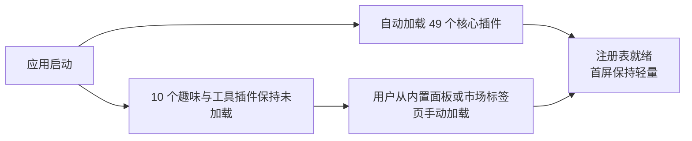
```mermaid
flowchart LR
    A["应用启动"] --> B["自动加载 49 个核心插件"]
    A --> C["10 个趣味与工具插件保持未加载"]
    C --> D["用户从内置面板或市场标签页手动加载"]
    B --> E["注册表就绪<br/>首屏保持轻量"]
    D --> E
```

自动加载失败可重试：插件运行时把"初始化完成"作为状态机节点，失败后注册表不会进入就绪态，用户重试不会被误判为重复加载。

### 3.4 第三方包（.cspkg）、沙箱与签名

`.cspkg` 包是包含 `manifest.json`、入口模块与资源的 ZIP 压缩包（fflate 打包）。加载时校验清单：必填字段、插件 id 格式、入口路径穿越防护与沙箱枚举。清单声明 `sandbox` 字段：

```jsonc
{
  "id": "com.example.analyzer",
  "name": "Analyzer",
  "version": "1.2.0",
  "author": "Example Corp",
  "description": "…",
  "entry": "dist/index.js",
  "sandbox": "isolated",        // "isolated"（默认）| "trusted"
  "formats": [{ "extension": ".dat" }]
}
```

- **isolated（默认）**：入口代码运行在 Web Worker 内，拥有独立全局作用域，无法访问宿主页面的全局变量、DOM 与状态库；画布渲染通过转移的 OffscreenCanvas 完成，宿主与 Worker 之间只走类型化 RPC 协议（`src/core/sandbox.ts` 与 `src/core/plugin-worker.ts`）。
- **trusted**：在宿主上下文中执行，拥有完整 DOM 访问权，仅建议用于自研包。

第三方插件加载与通信流程：

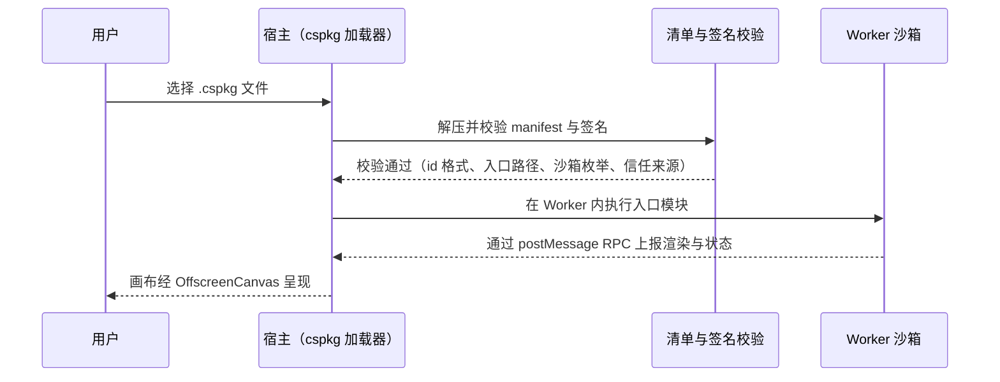
```mermaid
sequenceDiagram
    participant U as 用户
    participant H as 宿主（cspkg 加载器）
    participant V as 清单与签名校验
    participant W as Worker 沙箱
    U->>H: 选择 .cspkg 文件
    H->>V: 解压并校验 manifest 与签名
    V-->>H: 校验通过（id 格式、入口路径、沙箱枚举、信任来源）
    H->>W: 在 Worker 内执行入口模块
    W-->>H: 通过 postMessage RPC 上报渲染与状态
    H-->>U: 画布经 OffscreenCanvas 呈现
```

#### 3.4.1 包签名与信任注册表

签名能力已落地（`src/core/plugin-signing.ts` + `src/core/crypto-primitives.ts` + `scripts/sign-cspkg.mjs`），回答的是"**这个包是谁发布的**"，与沙箱回答的"**它运行时能做什么**"互相独立——合法签名不会削弱沙箱隔离。

| 环节 | 实现 |
| --- | --- |
| 算法 | Ed25519（RFC 8032）与 SHA-256（FIPS 180-4），纯 TypeScript 在 BigInt 上自实现，不依赖 WebCrypto（各浏览器与 Node 对 Ed25519 支持不齐） |
| 签名载荷 | 规范化后的包载荷：manifest 递归排序键、去空白、丢弃 undefined 的稳定 JSON 加入口字节；签名 CLI 与浏览器校验端字节级一致 |
| 指纹 | `ed25519:<hex32>`——公钥 SHA-256 的前 16 字节 |
| 信任模型 | `verifyPackageSignature` 返回结构化结果，结论含 `unsigned` / `untrusted-key` / 通过三类；未签名包默认拒绝，未知密钥的合法签名提示用户核对指纹后显式信任 |
| 信任注册表 | 内置官方公钥常量 `OFFICIAL_TRUSTED_KEYS`，用户新增的受信密钥经 `storage.ts` 持久化，IndexedDB 不可用时优雅降级 |
| 工具链 | `node scripts/sign-cspkg.mjs --genkey <keyfile>` 生成密钥对；`<package-dir> --key <keyfile>` 签名产出 .cspkg；`--verify <file.cspkg> [--trust <keyfile>]` 复验 |

已知限制（如实记录）：Worker 与页面共享同源的 IndexedDB；当 Worker 不可用时的遗留回退方案（`new Function` 加遮蔽全局变量）只是尽力而为的近似，并非安全边界，回退启用时界面会明确告警。

### 3.5 文件路由

用户把任意文件拖入中央视口或插件列表时，宿主按魔数与扩展名（可选 WASM 辅助检测）识别格式并路由到匹配插件：

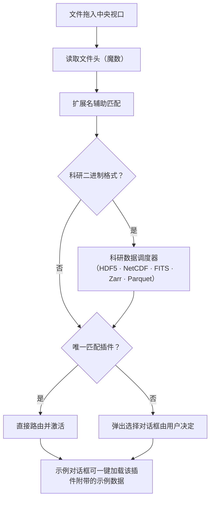
```mermaid
flowchart TD
    A["文件拖入中央视口"] --> B["读取文件头（魔数）"]
    B --> C["扩展名辅助匹配"]
    C --> D{"科研二进制格式？"}
    D -- 是 --> E["科研数据调度器<br/>（HDF5 · NetCDF · FITS · Zarr · Parquet）"]
    D -- 否 --> F{"唯一匹配插件？"}
    E --> F
    F -- 是 --> G["直接路由并激活"]
    F -- 否 --> H["弹出选择对话框由用户决定"]
    G --> I["示例对话框可一键加载该插件附带的示例数据"]
    H --> I
```

导入对话框本身也按文件格式过滤，未识别的文件不会进入解析器。大文件在进入解析前会先经 `src/core/chunked/` 的行窗口读取与内容指纹，配合 `parse-worker.ts` 与 `worker-pool.ts` 把解析放到 Worker 池中执行，避免阻塞主线程。

示例资产经 `exampleAssets` 与 `examples` 模块统一发现与加载；内容指纹（`citation.ts` 与存储层共用）让同一份数据的重复导入可被识别与复用。

## 第四章 四大工作模式

### 4.1 标准模式

默认落地体验。工作台为四区布局：顶栏（项目与模式切换）、左侧栏（项目树与插件列表）、中央视口（激活插件渲染，首次启动为拖放区）、右侧参数面板（把激活插件声明的参数转成响应式表单），状态栏常驻显示 GPU 可用性与性能指标。文件拖入后由宿主按魔数与扩展名路由，多插件匹配时弹选择框。

顶栏动作按语义分为五簇，以分隔线区隔：`[标准 | 流程 | 积木 | 代码]` 模式开关、`[数据⓷ | 示例]` 数据簇、`[项目▾ | 保存 | 分享]` 项目簇（项目▾ 含新建 / 打开 / 另存为 / 导出日志）、`[分析 | 科研▾]` 科研簇（科研▾ 展开 19 个科研工具，见 05 篇）、`[⚙ | ? | FPS | 语言 | 主题]` 环境簇。

适合"我已经知道哪个插件能回答我的问题，只想把文件指给它"的场景。


*标准模式：四区布局工作台，中央视口承载插件渲染、右侧参数面板实时联动，是默认探索入口。*

### 4.2 流程模式（Flow）

可视化数据流管线编辑器。左侧调色板、中间画布（节点加边）、右侧参数编辑器、底部结果预览。整个图持久化进项目的 `blockGraph` 字段，重新打开自动恢复，并共享 `.clproj` 的自动保存与分享管线。

#### 4.2.1 区块目录（42 个内置区块）

| 类别 | 数量 | 区块 |
| --- | --- | --- |
| 数据源 source | 4 | 示例数据、随机数据生成、网格生成、文件加载 |
| 变换 transform | 5 | 列选取、列重命名、新增列、归一化、排序 |
| 过滤 filter | 3 | 数值范围过滤、条件值过滤、Top-K 选取 |
| 数学 math | 6 | 加、减、乘、除（列对列或列对标量）、平方根、绝对值 |
| 统计 stats | 14 | 摘要统计、直方图分箱、单样本 / 独立双样本 / 配对 t 检验、单因素方差分析、Mann-Whitney U 检验、卡方独立性检验、相关分析、Cohen's d 效应量、多重比较校正、Bootstrap、蒙特卡洛传播、MCMC 采样 |
| 单位 units | 2 | 量纲换算（units.convert）、量纲一致性检查（units.check） |
| 可视化 viz | 4 | 散点、折线、直方图、二维点云（经渲染桥接走插件出图） |
| 绘图 plot | 4 | 折线、散点、直方图、柱状（出版级绘图引擎渲染） |

`viz.*` 与 `plot.*` 的分工是刻意的：`viz.*` 把 `RenderedView` 交给**插件渲染器**，与标准模式看到的是同一个插件；`plot.*` 走 `src/core/plot/` 的**纯 TS 矢量引擎**，产出可直接导出 SVG / PDF 的出版级图。数学与统计区块直接调用 `src/core/stats` 与 `src/core/units` 的纯函数实现（详见 07 篇）；区块元数据（名称、描述）内建中英双语，经 `src/blocks/l10n.ts` 统一解析，新增语言是纯数据改动。

控制流区块（if/else、repeat、parallel）刻意推迟——`BlockInstance` 上的 `region` 接缝已就位，后续可作为扩展嵌入而非重构。

#### 4.2.2 编译器与执行器

编译器是一个纯函数：结构校验（端口匹配、必需输入、类型兼容）、环检测、Kahn 式拓扑排序，错误以结构化 `diagnostics` 返回，画布据此绘制红色边与内联诊断条，全程不抛异常。

执行器带节点级增量缓存与脏值传播失效：修改单个区块的参数，只有它及其下游会重新执行。运行支持取消与并发去重——重复触发运行不会产生并行执行，取消会真正终止进行中的计算节点。

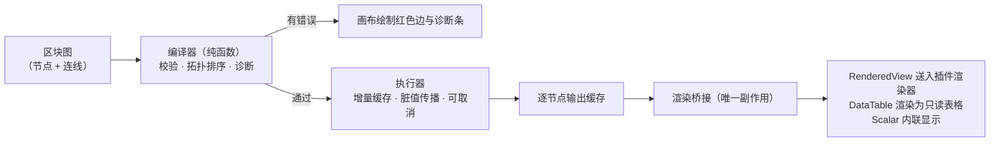
```mermaid
flowchart LR
    A["区块图<br/>（节点 + 连线）"] --> B["编译器（纯函数）<br/>校验 · 拓扑排序 · 诊断"]
    B -- 有错误 --> C["画布绘制红色边与诊断条"]
    B -- 通过 --> D["执行器<br/>增量缓存 · 脏值传播 · 可取消"]
    D --> E["逐节点输出缓存"]
    E --> F["渲染桥接（唯一副作用）"]
    F --> G["RenderedView 送入插件渲染器<br/>DataTable 渲染为只读表格<br/>Scalar 内联显示"]
```

#### 4.2.3 结果预览

底部预览随所选节点输出类型自适应：`RenderedView` 走既有插件渲染器（散点、直方图等）；`DataTable` 输出（如 `stats.summary`、`stats.histogram` 的分箱结果）渲染为只读表格，使非可视化输出也看得见；`Scalar` 内联显示。管线有多个输出时由芯片切换器选择检视节点。


*流程模式：以 DAG 管线连接数据源 / 变换 / 统计 / 可视化区块，编译后增量执行、就地预览。*

#### 4.2.4 示例管线

11 个示例项目以真实 `.clproj` 文件存放在 `examples/projects`，构建期经 `import.meta.glob` 自动发现，新增示例只需放入文件并在元数据表登记：

| 示例 | 主题 |
| --- | --- |
| block-01-signal-analysis | 信号分析 |
| block-02-random-distribution | 随机分布 |
| block-03-grid-scatter | 网格散点 |
| block-04-range-filter | 范围过滤 |
| block-05-dual-pipeline | 双管线对比 |
| block-06-topk-pipeline | Top-K 选取 |
| block-07-binning-stats | 分箱统计 |
| block-08-normalize-grid | 归一化网格 |
| crystal-lattice-demo | 晶格演示 |
| particles-demo | 粒子演示 |
| point-cloud-demo | 点云演示 |

全部 11 个示例都通过共享 IR 解释器执行，并由 `examples-roundtrip` 单元测试逐一验证。

### 4.3 积木模式（Blockly）

类 Scratch 的积木编辑器，面向学习者与想要命令式体验的用户。唯一执行入口是绿色"运行时"帽子区块，帽子下方未连接的孤立区块永不运行，从根本上杜绝"误执行破损代码"。30 余种内置积木按九个类别组织：

| 类别 | 积木 |
| --- | --- |
| 开始 | 运行时帽子区块（唯一入口） |
| 数据 | 载入 CSV、载入 XYZ、随机数、范围、列表 |
| 变量 | 赋值与读取 |
| 运算符 | 算术、比较、逻辑、一元 |
| 变换 | 归一化、排序、列选取、过滤 |
| 统计 | 摘要、直方图 |
| 绘图 | 散点、折线、直方图、点云 |
| 控制流 | 如果、重复、当循环、遍历 |
| 工具 | 打印、原始文本 |


*积木模式：类 Scratch 画布以帽子区块启动脚本，积木拼图编译为共享 IR 执行。*

技术要点：

- Blockly 13 驱动画布，包为懒加载分包（约 828 KB），不影响标准与流程模式首屏；媒体资源同源 vendoring，不依赖 CDN。
- 区块名称、提示、下拉选项与工具箱类别经 Blockly 的 `BKY_*` 键系统本地化，切换语言时以重新标注的积木重建工作区，有专门单元测试（`tests/editor/block-i18n.test.ts`）验证。
- 运行按钮提供实时结果预览、变量面板与控制台面板三张卡片。
- 5 个内置示例程序（星系散点、遥测折线、随机直方图、归一化散点、循环打印）位于 `src/editor/block/samples.ts`，经顶栏"示例"对话框加载。
- 积木图编译为共享 IR 后由内置解释器执行，解释器调用与代码模式相同的 Studio API。

### 4.4 代码模式（Monaco · Python / R / JavaScript）

真正的脚本编辑器。工具栏提供 **Python / R / JS** 分段语言开关与一个引擎徽标，明示当前缓冲区将由谁执行。

| 语言 | 执行引擎 | 说明 |
| --- | --- | --- |
| Python | Pyodide Web Worker 中的完整 CPython | 自由语法（推导式、f-string、可导入包），`studio` 作为正经可导入模块注入，支持 REPL 单表达式求值 |
| R | 进程内 IR 引擎 | 缓冲区解析为共享 IR，由与积木模式相同的解释器执行；`<-` 赋值 |
| JavaScript | 进程内 IR 引擎 | 同上；`const/let/var` 声明 |

公共能力：

- **studio 接口跨语言一致**：`load / random / range / exampleData / grid / normalize / sort / select / addColumn / addConstantColumn / filter / filterRange / topK / renameColumn / summary / histogram / plot / print / notify / getParam / setParam`。`studio.plot(...)` 经渲染桥接落到与流程模式 `viz.*` 区块完全相同的插件。
- **一键语言互译**：切换标签页即把当前程序从 IR 中枢生成到另一种语言，无需复制粘贴。
- **中断**：停止运行会终止并重启 Worker，失控循环不会卡死页面；Worker 的引导地址与引导 Promise 做了记忆化，重启不重复初始化。
- **快捷键**：`Ctrl/⌘ + Enter` 运行缓冲区（并停止进行中的 Python 任务）；键盘输入防抖 150 ms 后同步回 IR，使积木与流程在打字过程中保持实时。
- **DSL 边界显式化**：R / JS 解析器无法建模的语句保留为原始代码节点，运行时跳过并在控制台报告一次计数；完整语法随时在 Python 标签页可用。

| 方法 | 说明 |
| --- | --- |
| load | 装载项目数据文件为表格 |
| random / range / exampleData / grid | 生成随机数、整数序列、内置示例与网格数据 |
| normalize / sort / select / addColumn / addConstantColumn / filter / filterRange / topK / renameColumn | 表格变换 |
| summary / histogram | 摘要统计与分箱 |
| plot | 绘图（经渲染桥接走插件渲染器） |
| print / notify | 控制台输出与通知 |
| getParam / setParam | 项目参数读写 |

9 个示例程序以真实文件存放在 `examples/code`（EDA 管线、蒙特卡洛估圆、信号平滑、遥测探索、星系散点、随机直方图、范围循环、添加列绘图、归一化过滤），经"示例"对话框加载。


*代码模式：Monaco 编辑器 + 控制台 / 变量面板，Python 运行于 Pyodide Worker，注入 `studio` 模块。*

### 4.5 三模式互转（共享 IR）

IR（`src/editor/ir`，含校验、哈希与序列化）是积木、流程、代码三种模式的唯一事实来源，各模式与 IR 之间都有纯函数往返转换：

| 转换 | 模块 |
| --- | --- |
| IR 与流程 DAG 互转 | `src/editor/flow/convert.ts`（irToFlow、flowToIR，Kahn 拓扑排序，参数与区块目录 1:1 对齐） |
| Blockly JSON 与 IR 互转 | `src/editor/block/convert.ts` |
| 代码缓冲区解析回 IR | `src/editor/code/parse.ts`（无法解析的行保留为原始代码节点） |
| IR 生成代码 | `src/editor/codegen`（Python、R、JS 三个生成器） |
| IR 直接解释执行 | `src/editor/runtime/interpreter.ts`（调用与流程区块相同的 Studio API） |

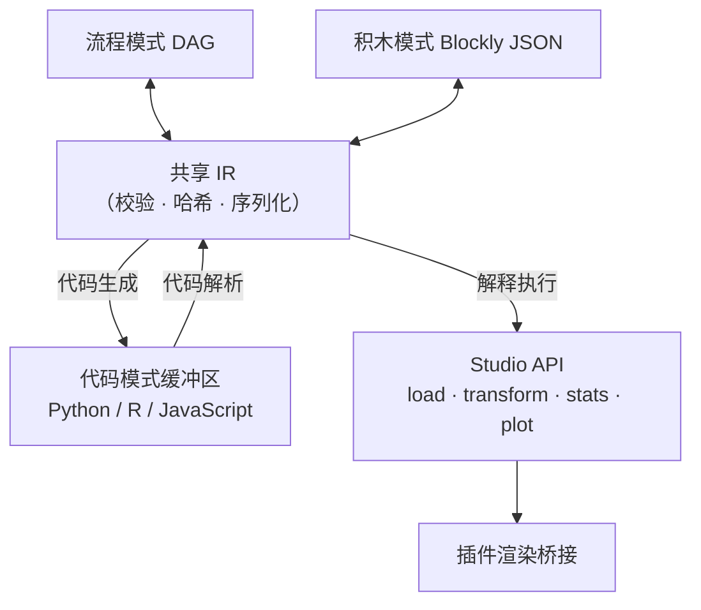
```mermaid
flowchart TD
    IR["共享 IR<br/>（校验 · 哈希 · 序列化）"]
    FL["流程模式 DAG"] <--> IR
    BL["积木模式 Blockly JSON"] <--> IR
    CD["代码模式缓冲区<br/>Python / R / JavaScript"] -- 代码解析 --> IR
    IR -- 代码生成 --> CD
    IR -- 解释执行 --> SA["Studio API<br/>load · transform · stats · plot"]
    SA --> RB["插件渲染桥接"]
```

在流程模式搭一条管线，切到积木就能看到同样的逻辑以积木呈现，跳到代码就能看到生成的 Python；反向亦然。流程编辑会**合并**进 IR 而不是把它拍平（`mergeFlowIR`）：print / loop / if / function 语句留在原位，只替换 DAG 节点；`src/stores/useFlowSync.ts` 中的图签名守卫会忽略注水产生的防抖回声，使反复切换模式不会丢失节点。

代码生成器按目标语言处理方言差异：Python 生成器输出真实 Python 语法，R 生成器处理 R 的语法习惯（循环写法、真值字面量、整除与逻辑运算符等），JS 生成器输出可直接求值的脚本。

往返一致性由 `sync-threeway`、`flow-convert`、`editorStore` 与 `examples-roundtrip` 四组单元测试钉住，并由 `verify-lang-modes` 端到端套件做真实浏览器的 R/JS 编辑、R→JS 互译、Flow ⇄ Block ⇄ Code 无损循环与真实管线运行验证。

## 第五章 科研工具集

### 5.1 统一注册表

`src/pages/research/toolRegistry.ts` 是工具集的**唯一事实来源**：每个独立科研界面在这里声明一次，由 `/studio` 路由、顶栏启动器与欢迎页启动网格三处共同消费。新增一个工具的成本是"注册表加一条记录 + i18n 加标题与描述两个键"，不需要改动路由、导航或启动器。

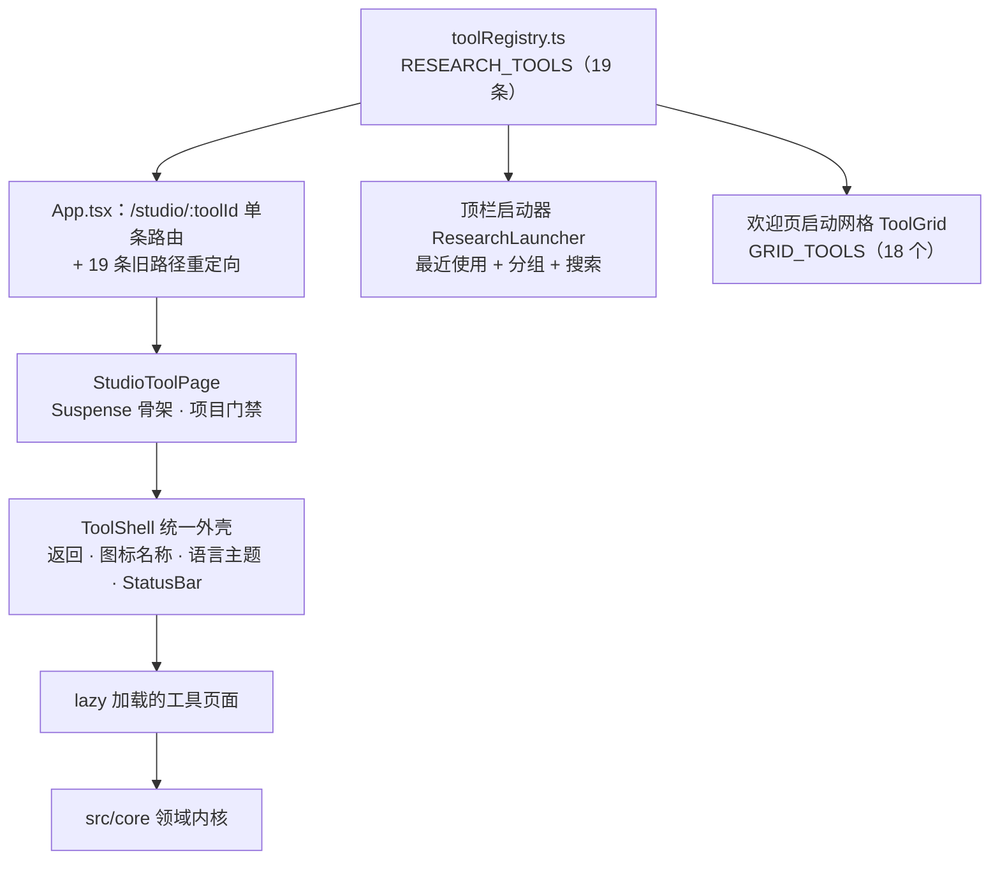
```mermaid
flowchart TD
    R["toolRegistry.ts<br/>RESEARCH_TOOLS（19 条）"]
    R --> A["App.tsx：/studio/:toolId 单条路由<br/>+ 19 条旧路径重定向"]
    R --> B["顶栏启动器 ResearchLauncher<br/>最近使用 + 分组 + 搜索"]
    R --> C["欢迎页启动网格 ToolGrid<br/>GRID_TOOLS（18 个）"]
    A --> D["StudioToolPage<br/>Suspense 骨架 · 项目门禁"]
    D --> E["ToolShell 统一外壳<br/>返回 · 图标名称 · 语言主题 · StatusBar"]
    E --> F["lazy 加载的工具页面"]
    F --> G["src/core 领域内核"]
```

`ResearchTool` 记录的字段：

| 字段 | 含义 |
| --- | --- |
| `id` | 稳定标识，同时是 `/studio/<id>` 的路径段 |
| `path` | 规范路由 `/studio/<id>`，由 id 推导 |
| `legacyPath` | 改造前的 hash 路径（默认 `/<id>`），作为客户端重定向保留，使旧书签不失效 |
| `icon` | `ToolIconKind` 图标种类 |
| `titleKey` / `descKey` | i18n 键；描述默认取 `tool.<id>.desc` |
| `group` | 五个学科分组之一 |
| `inGrid` | 是否出现在欢迎页启动网格（默认是） |
| `requireProject` | 无激活项目时是否渲染 `EmptyProject` 门禁页（默认否） |
| `component` | `React.lazy` 包装的页面组件，每个工具一个独立分包 |

配套导出：`GRID_GROUPS`（分组顺序）、`GRID_TOOLS`（入网格的子集，19 减 1 为 **18** 个）、`getTool(id)` 与 `TOOLS_BY_LEGACY_PATH`。

**路由**。`App.tsx` 只声明 6 条显式路由：`/`（欢迎页）、`/workbench`（工作台）、`/studio/:toolId`（全部科研工具）、`/settings`、`/plugin/:pluginId`、`/share/:payload`，其余一律回落到欢迎页。19 条旧路径的重定向由 `RESEARCH_TOOLS` 在模块加载时**自动生成**，因此数量永远与注册表一致，不存在手工维护的重定向表。应用使用 `HashRouter`，因此深度链接形如 `#/studio/uncertainty`。

**项目门禁**。`StudioToolPage` 承担三件事：为懒加载页面提供 `Suspense` 骨架；深度链接或冷启动时**一次性**恢复最近项目（与工作台行为一致）；对声明了 `requireProject` 的工具，在项目未激活时渲染 `EmptyProject`（明示的"新建 / 打开"动作）而不是自动创建一个空项目——避免用户在深链接进入时莫名其妙多出一个空项目。未知的 `toolId` 渲染 `EmptyState`（"工具不存在"），而不是白屏或抛错。

**外壳**。所有工具页共用 `ToolShell`：顶部是返回工作台、工具图标与名称、语言与主题切换；主体是工具自己的内容区（居中列、页面级滚动）；底部是工作台同一个 `StatusBar`，常驻显示 GPU / WASM / 存储状态与帧率。

### 5.2 五个分组的 19 个工具

分组按学科划分，互斥且穷尽。下表是注册表中的完整清单（名称与用途取自实际发布的中文 i18n 文案）：

| 分组 | 工具 id | 名称 | 用途 | 需项目 |
| --- | --- | --- | --- | --- |
| **测量与评估**（2） | `uncertainty` | 不确定性套件 | 蒙特卡洛、Bootstrap 与 GPU 加速的置信区间 | |
| | `profiler` | 数据画像 | 数据体检：缺失值、分布、相关性与质量画像 | |
| **建模与推断**（4） | `model-lab` | 模型工作台 | 回归建模、拟合诊断与多模型对比 | |
| | `inference` | 贝叶斯推断 | 贝叶斯推断模板与 MCMC 后验诊断 | |
| | `model-inference` | 模型推理 | 在浏览器内用 WebGPU 运行 ONNX 模型并查看推理结果 | |
| | `sweeps` | 参数扫描 | 参数网格与拉丁超立方扫描、响应面 | ● |
| **数据与谱系**（5） | `sql` | SQL 数据工作台 | 直接对项目数据文件运行 SQL 查询 | ● |
| | `lineage` | 数据血缘 | 文件、运行与产物的血缘图谱 | |
| | `figures` | 图表工作台 | 多面板出版级图表排版与 SVG / PDF / PNG 导出 | ● |
| | `analysis` | 数据分析 | 假设检验、相关性与基础统计分析 | |
| | `cleaning` | 数据清洗向导 | 分步引导完成表格数据的转换、清洗与去重 | ● |
| **信号与记录**（3） | `signal` | 信号实验室 | 频谱、滤波与时域信号处理 | ● |
| | `notebook` | Notebook | Markdown + Python 的可复现实验记录 | ● |
| | `runs` | 实验记录 | 实验运行台账、指标差异与成对对比 | |
| **报告与复现**（5） | `report` | 报告生成器 | 叙述、图表与结果打包成交互报告 | ● |
| | `reprolock` | 可复现锁 | 环境快照与可重复性指纹锁定 | |
| | `supplement` | 补充材料打包 | 数据、代码与许可一键打包为补充材料 | |
| | `course` | 课程模式 | 布置作业、收集并批改学生的离线实验成果 | ● |
| | `gallery` | 作品画廊 | 浏览并重新打开社区分享的可复现作品 | |

合计：测量与评估 2 + 建模与推断 4 + 数据与谱系 5 + 信号与记录 3 + 报告与复现 5 = **19**。其中 8 个绑定项目（`sweeps`、`sql`、`figures`、`signal`、`notebook`、`report`、`course`、`cleaning`），`analysis` 不进入启动网格（`inGrid: false`），因为它同时由工作台顶栏的独立按钮发起，避免同一入口出现两次。

#### 5.2.1 测量与评估

- **不确定性套件（`uncertainty`）**——把"这个数字有多确定"变成可计算的对象。提供 Bootstrap 置信区间、蒙特卡洛传播与 MCMC 采样三条路径，并给出 R-hat、有效样本量 ESS、HDI 与 MCSE 等收敛诊断；样本量足够大时自动切到 WGSL GPU 引擎（每链一个 workgroup），未达阈值或设备不可用时回落到 CPU，两条路径在同一随机数序列下结果在数值容差内一致（内核细节见 07 篇）。

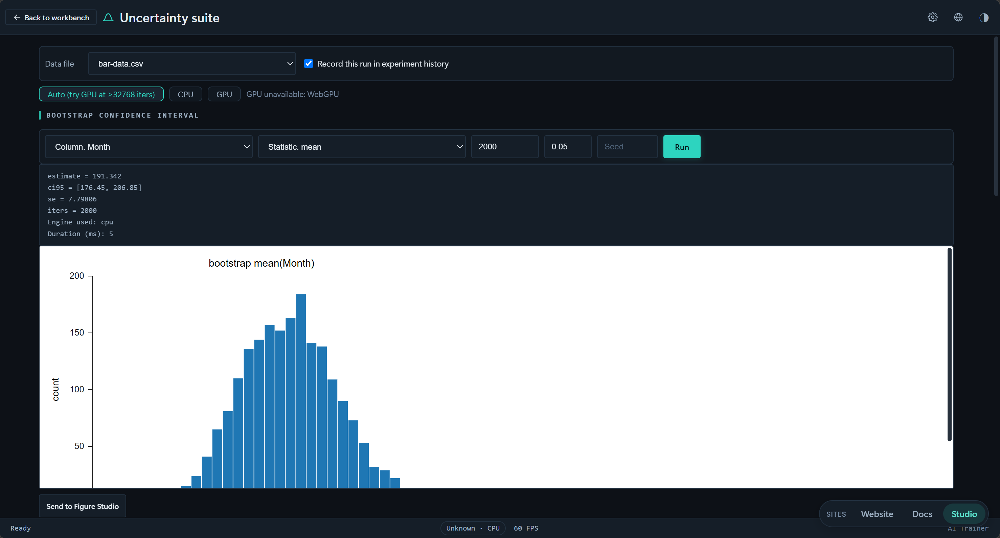

*不确定性套件以 Bootstrap 重采样给出分位数置信区间，配合蒙特卡洛传播与 MCMC，输出 HDI、R-hat、ESS 与 MCSE 等收敛诊断；样本量足够大时自动切到 WGSL GPU 引擎并按同一随机序列与 CPU 核对。*

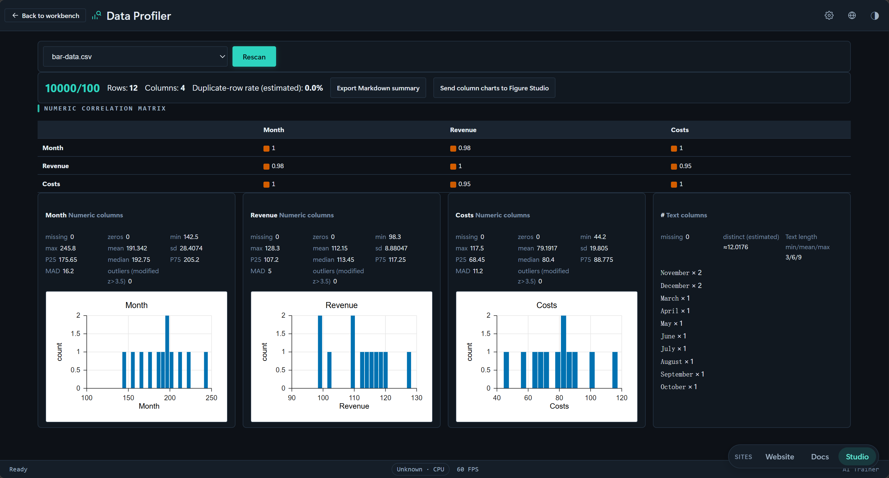

*数据画像对一份 CSV 生成相关矩阵、列级直方图与缺失统计，并综合成 0–100 的确定性质量分与问题清单。*

- **数据画像（`profiler`）**——数据体检。流式单遍计算：数值列用 Welford 递推求精确均值与方差、蓄水池采样求分位数与 MAD，并以修正 z 分数标记离群；文本列用 HyperLogLog 估计基数、Space-Saving 求 Top-K；表级给出 Pearson / Spearman 相关与重复率，最终综合成 0–100 的确定性质量分与问题清单，按内容指纹缓存以支持重复打开。

#### 5.2.2 建模与推断

- **模型工作台（`model-lab`）**——拟合与诊断。支持普通最小二乘（Householder QR）、逻辑回归（IRLS）、岭回归（K 折交叉验证选参）与多项式拟合，产出含估计值、标准误、p 值与置信区间的系数表，并附 2×2 残差诊断图（残差-拟合、QQ、尺度-位置、残差-杠杆），支持多模型横向对比。

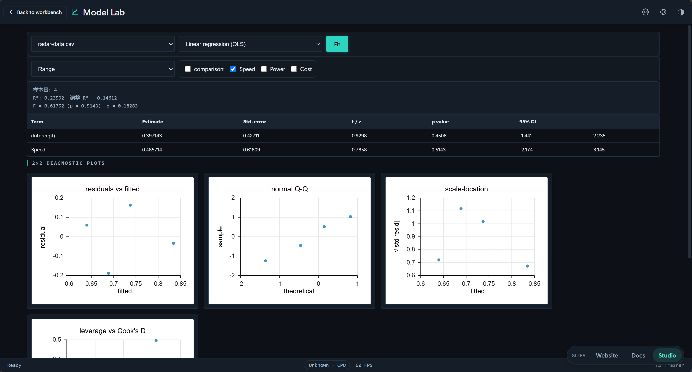

*模型工作台拟合线性模型并附 2×2 残差诊断图（残差-拟合、QQ、尺度-位置、残差-杠杆），系数表含估计值、标准误、p 值与置信区间。*

- **贝叶斯推断（`inference`）**——Inference Forge。HMC / NUTS 采样器（NUTS 带 U 形回旋判据与 Dual Averaging 步长自适应，无须手工设步数）、声明式似然模板配数据尺度化的弱先验、R-hat 与 bulk / tail-ESS 等后验诊断，以及 WAIC 与 PSIS-LOO 模型比较。


*Inference Forge 在浏览器内（WebAssembly）跑 NUTS 采样，并把收敛情况讲完整：后验摘要给出 94% HDI、MCSE、R-hat 与 ESS，另有逐链诊断、WAIC / PSIS-LOO 模型比较、后验预测检验，以及轨迹图与后验密度图。*

- **模型推理（`model-inference`）**——把已训练好的模型搬进浏览器：用 WebGPU 运行 ONNX 模型并查看推理结果，适合"模型在别处训练、结论要在这里复现"的场景。

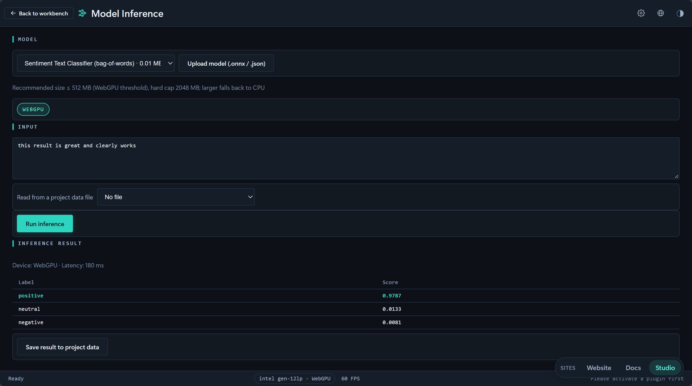

*模型推理在浏览器内用 WebGPU 运行 ONNX 情感分类模型，逐样本给出预测、置信度与端到端延迟。*

- **参数扫描（`sweeps`）**——`expandPlan` 把扫描计划展开为确定性设计点：全网格 / 列表轴走完整笛卡尔积，全拉丁超立方轴按维度分层抽样；混合 lhs 与 grid 的方案被显式拒绝，因为样本量此时没有无歧义的定义。执行后可看响应面。

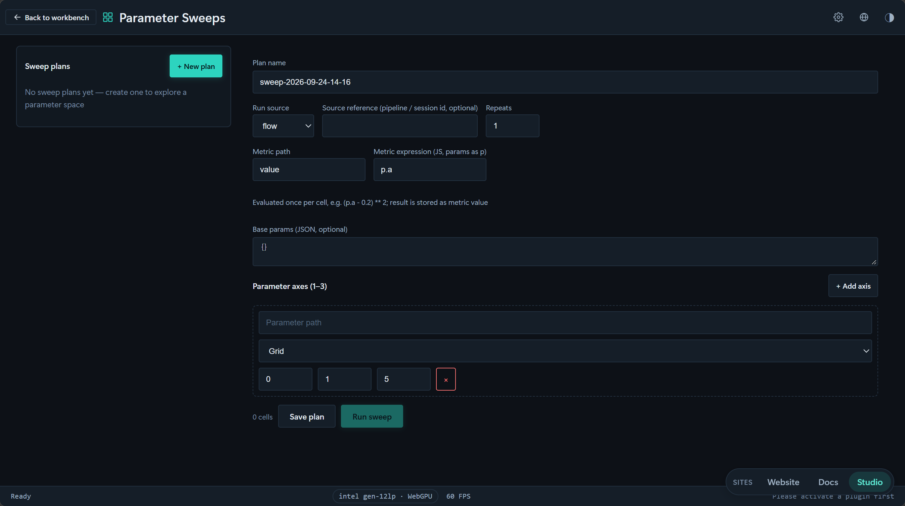

*参数扫描把扫描计划展开为确定性设计点（全网格 / 拉丁超立方按维度分层抽样），执行后可查看响应面。*

#### 5.2.3 数据与谱系

- **SQL 数据工作台（`sql`）**——DuckDB-WASM 引擎，首次使用时懒加载；项目数据文件注册进 DuckDB 虚拟文件系统并直接暴露为表，因此可以对 `.clproj` 里的文件写 SQL。查询支持超时与 `AbortSignal`，中止或超时会终止 Worker 并丢弃单例，下次调用重建实例——一次跑疯的查询不会拖垮整个页面。
- **数据血缘（`lineage`）**——以运行记录上的文件 id 把项目文件（源）连到运行（变换），绘制成 Sugiyama 式分层 DAG（最长路径分层、单趟重心排序、行居中）。领域层无 React / store / DOM 依赖，画布可独立测试。
- **图表工作台（`figures`）**——出版级组图。`FigureSpec` 是挂在期刊模板网格（IEEE / Elsevier 栏宽、色盲友好调色板）上的多面板容器，`composeFigure` 渲染为单张独立 SVG（嵌套面板 viewport 加 a / b / c 面板标签），`exportFigure` 处理 SVG / PDF / PNG-600dpi 下载。组图只重新定尺寸，绝不修改原 `PlotSpec`。


*图表工作台在 IEEE 单栏模板上排一张 2×2 的 OLS 诊断组图：逐面板布局、图注草拟、投稿前检查，以及 SVG / PDF / 600dpi PNG 导出。*

- **数据分析（`analysis`）**——假设检验、相关性与基础统计分析的常规入口：t 检验族、单因素方差分析、Mann-Whitney U、卡方独立性检验、Cohen's d 效应量，以及 Bonferroni 与 Benjamini-Hochberg 多重比较校正；结果可直接转写成中英双语的出版级句子。
- **数据清洗向导（`cleaning`）**——分步引导。步骤模型是五类可序列化操作：类型转换、缺失值策略（删除 / 均值 / 中位数 / 零 / 前向填充）、离群标注（IQR / z 分数）、去重、列重命名。每一步永不改写输入表，因此可以逐步前进、回退、跳转或"撤销该步"；质量侧的期望契约由 `data-quality` 提供（见 07 篇）。

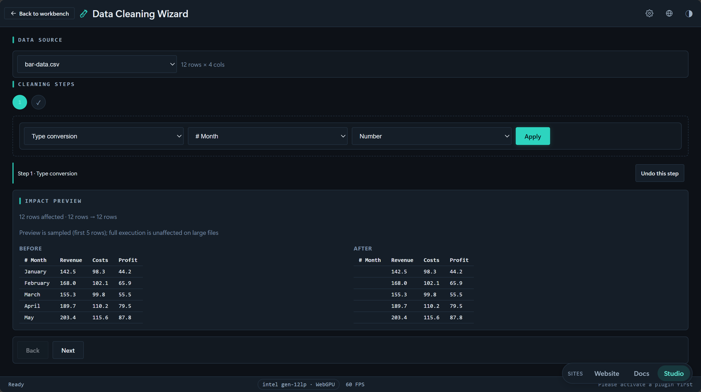

*数据清洗向导以分步卡片引导完成类型转换、缺失值处理、去重与列重命名，每一步预览前后差异且不改写原表。*

#### 5.2.4 信号与记录

- **信号实验室（`signal`）**——频谱、滤波与时域处理。基 2 FFT 与幅值谱（与 GPU 端 `fftKernelWGSL` 数学一致）、Hann / Hamming / Blackman 等窗函数、Savitzky-Golay 平滑与滑动平均、自相关 ACF 与偏自相关 PACF，以及经典加性时序分解 x = 趋势 + 季节 + 残差。滤波后的列可作为派生文件保存回项目，并自动进入血缘图。


*信号实验室对加速度时序做频谱分析：Welch PSD（矩形窗、nfft=256、7 段）主峰落在约 0.02 Hz 并伴谐波，支持 FFT 幅值谱 / 窗函数 / 滤波与时域处理，可将图表送图表工作台或存回项目。*

- **Notebook（`notebook`）**——Markdown 与 Python 单元混排的可复现实验记录，执行走代码模式同一个 Pyodide 运行时，因此 notebook 与脚本看到的是同一个 `studio` API；单元列表持久化在 `project.state.notebook`。
- **实验记录（`runs`）**——全工具的运行台账。流程、积木、代码、笔记本、扫描、不确定度、建模、推断的每一次执行都会留下耐久快照（参数、指标、耗时、来源），支持指标差异与成对对比。记录存于 IndexedDB 的 `runs` 存储而**不**写进 `.clproj`，使项目文件保持小巧，并随项目删除一并清理。

#### 5.2.5 报告与复现

- **报告生成器（`report`）**——`buildReport` 把有序章节（标题、Markdown、图表工作台的图、数据表、运行摘要、筛选器）构建成**单一自包含 HTML**：内联 CSS、内联 SVG、内联 JSON 数据与零依赖原生 JS 控制器。所有用户字符串先转义，内嵌 JSON 以 `<script type="application/json">` 输出并把 `<` 做 unicode 转义，杜绝 `</script>` 载荷逃逸——报告可以安全地直接投递给他人。

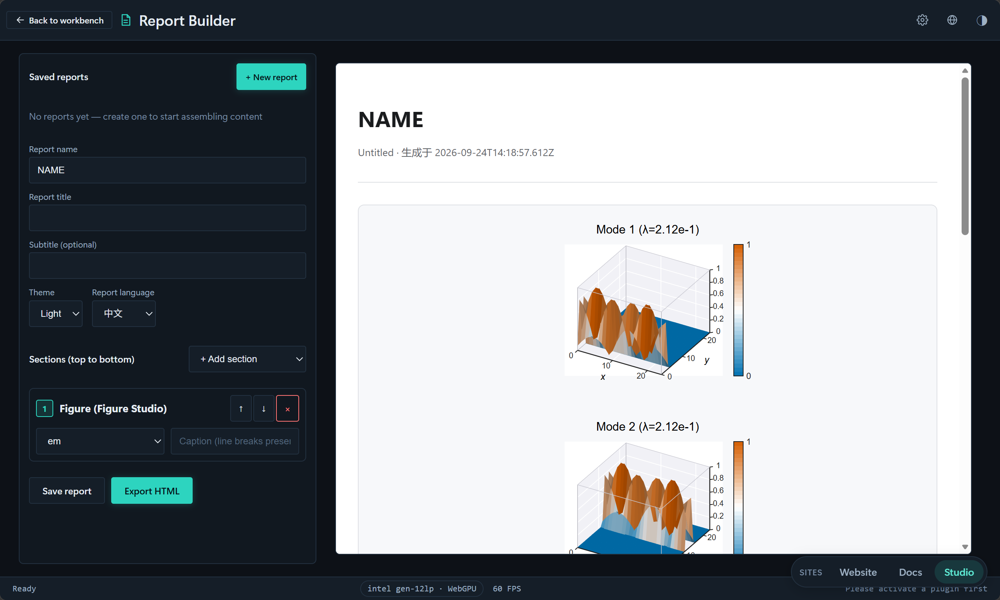

*报告生成器把标题、图表工作台的组图、数据表与运行摘要构建成单一自包含 HTML，零依赖控制器，可安全投递。*

- **可复现锁（`reprolock`）**——导出与校验 `repro.lock`：数据指纹、参数哈希、种子与代码快照，支持五类漂移判定与一键重跑；环境快照（版本、平台与内核可用性）一并纳入锁文件，使"漂移发生在数据还是环境"有明确答案。

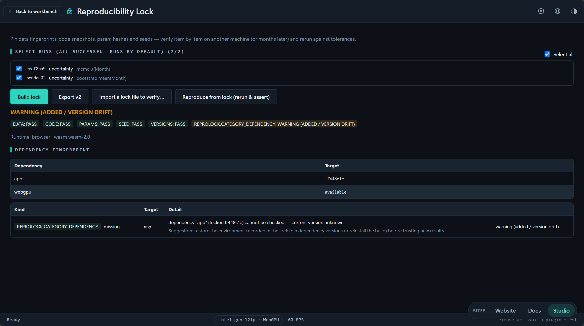

*可复现锁校验数据指纹、参数哈希、种子与代码快照并纳入环境快照，给出漂移发生在数据还是环境的判定。*

- **补充材料打包（`supplement`）**——`manifest.json`（项目元数据、运行记录、血缘图、作者与许可表单）加可选的原始数据文件与代码会话，用 fflate 打成研究者随论文一起上传的 ZIP。

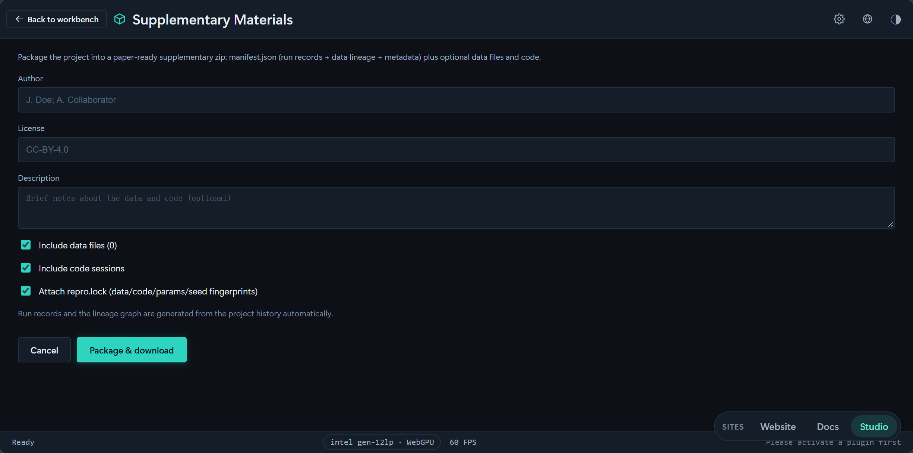

*补充材料打包把 manifest、原始数据与代码会话用 fflate 打成随论文上传的 ZIP。*

- **课程模式（`course`）**——本地优先的教学闭环：教师创建课程（由本地身份字符串标识，无账号体系）、发布绑定学科模板的作业；学生领取任务、在项目中作业并提交运行结果的 `repro.lock` 快照；教师查看学生 × 作业矩阵、记录评分与评语，并把整个班级按学生一目录导出为包。持久化在 IndexedDB `courses` 存储。


*课程模式以本地优先实现教师布置作业、学生提交 repro.lock 快照、教师批改并整班导出的教学闭环。*
- **作品画廊（`gallery`）**——本地"我的分享"存储（localStorage），记录分享出去的作品元数据与净化后的快照 HTML，使详情弹窗可离线重开。v1 不上传任何内容，下架只做标记（保留审计轨迹）并从所有列表过滤。


*作品画廊陈列按学科整理的可复现作品，每件标注主题与可复现锁状态（已锁定 / 检测到漂移 / 未锁定）以及作者与许可，便于发现与引用。*

### 5.3 入口与导航

同一份注册表驱动三个入口，行为统一：

- **欢迎页启动网格**（`/`，`ToolGrid`）——按五个分组陈列 18 个工具卡片，附过滤框；搜索时分组被打平成一列。卡片点击即记录使用并跳转 `/studio/<id>`。
- **顶栏科研启动器**（工作台与工具页顶栏的"科研▾"，`ResearchLauncher`）——取代了早期的平铺式工具菜单。顶部是"最近使用"分组（最近 3 个，带角标），其下按学科分组列出全部工具；每项显示图标、名称与一行描述，使工具在打开前就能被识别；支持过滤输入与完整键盘导航。
- **旧路径重定向**——改造前形如 `#/uncertainty` 的书签会被自动生成的重定向送到 `#/studio/uncertainty`。

"最近使用"由 `src/core/recentTools.ts` 维护，存储在 localStorage（键 `ergalics:recent-tools`），最多保留 8 条、界面只展示前 3 条——留出余量是为了让裁剪永远不产生空位。

### 5.4 工具之间的流转

工具是分立的页面，但**不是孤岛**。它们通过三条共享通道协作，这也是把 19 项能力放在同一注册表下的实际意义：

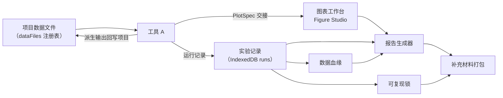
```mermaid
flowchart LR
    DF["项目数据文件<br/>（dataFiles 注册表）"]
    DF --> T1["工具 A"]
    T1 -- "派生输出回写项目" --> DF
    T1 -- "PlotSpec 交接" --> FS["图表工作台<br/>Figure Studio"]
    T1 -- "运行记录" --> RUN["实验记录<br/>（IndexedDB runs）"]
    RUN --> LIN["数据血缘"]
    FS --> REP["报告生成器"]
    RUN --> REP
    LIN --> REP
    REP --> SUP["补充材料打包"]
    RUN --> RL["可复现锁"]
    RL --> SUP
```

- **共享数据文件注册表**。`src/core/dataFiles.ts` 让项目自有文件、内置示例与代码模式的 `_FILES` 走同一套解析逻辑；`src/pages/research/researchUi.ts` 是这一层之上的薄胶水（无 React 依赖），负责"装载表格并识别数值列""把 PlotSpec 送进图表工作台""把派生输出组装成 CSV 存回项目"。因此数据清洗的结果能被信号实验室直接读取，滤波后的列又能被模型工作台拟合。
- **PlotSpec 交接**。任何工具画出的图都是同一个 `PlotSpec` 数据结构，可以被图表工作台接收为组图的一个面板，从而复用期刊模板、面板标签与矢量导出。
- **实验记录作为主干**。每一次执行都进入 `experiment` 台账，血缘图据此把文件与运行连成 DAG，报告生成器再从中取运行摘要。科研工具集的"可复现"因此不是某几个功能，而是贯穿全部工具的一条数据流。

### 5.5 小结

19 个工具覆盖了从数据入库到论文交付的完整链路：**测量与评估**回答"结果有多确定"，**建模与推断**回答"数据支持什么结论"，**数据与谱系**回答"数据从哪来、改过什么"，**信号与记录**回答"过程是否被完整记录"，**报告与复现**回答"别人能否原样重跑"。它们共享同一个项目、同一批数据文件、同一组 `src/core` 内核与同一条插件渲染通路，因此从工作台切换到工具集（或反向）时，上下文零损耗。

每个工具背后的算法内核、依赖库与导出格式，见 07 篇《科学计算子系统》；工具的运行记录、血缘与复现链条如何被测试与门禁约束，见 08 篇《测试与质量保障》。

## 第六章 GPU 计算与原生核心

### 6.1 Rust 原生核心

`native/ergalics-core`（crate 版本 0.1.0，edition 2021，`crate-type = ["cdylib", "rlib"]`）编译目标为 `wasm32-unknown-unknown`，经 wasm-bindgen 0.2 绑定到 `src/native`（构建产物，不入库）。WebGPU 绑定依赖 web-sys 的实验性 GPU API 面，通过 Cargo feature 显式开启。依赖为 wasm-bindgen、wasm-bindgen-futures、js-sys、web-sys、console_error_panic_hook、serde 与 serde_json；release profile 开启 `lto`、`codegen-units = 1` 与 `opt-level = 3`。Rust 源码按职责分为五个模块：

| 源文件 | 职责 |
| --- | --- |
| lib.rs | 对外导出、版本查询（core_version）与初始化 |
| device.rs | GpuDeviceManager 与 GpuInfo：适配器与设备获取，`webgpu_available` 探测，带 CPU 回退选项 |
| buffer.rs | GpuBuffer：以显式 usage 掩码创建存储 / 只读 / 均匀缓冲，write 上传、read 经专用回读缓冲读回 |
| compute.rs | KernelDescriptor 与 BindingDescriptor、ComputeKernel 编译、绑定组物化与 dispatching，ComputeQueue 封装 |
| utils.rs | detect_file_kind 等辅助（基于魔数的文件类型检测）与日志 |

面向 JavaScript 的暴露面：

| 能力 | 说明 |
| --- | --- |
| GpuDeviceManager / GpuInfo | 适配器与设备获取，带 CPU 回退选项；`webgpu_available` 供降级决策 |
| GpuBuffer | 显式 usage 掩码的缓冲创建（create_storage、create_readable_storage、create_uniform）、上传与经回读缓冲的读取 |
| KernelDescriptor / BindingDescriptor | 描述计算内核与缓冲绑定（uniform、storage、read-only-storage，动态偏移与最小绑定尺寸） |
| ComputeKernel::compile | 从绑定描述符构建真实的 GPUBindGroupLayout，编译 WGSL 模块并创建管线 |
| ComputeKernel::bind_group | 从保留的布局物化绑定组（第 i 个缓冲对应第 i 个绑定） |
| ComputeKernel::run | 一次调用完成绑定组、dispatch 与提交；dispatch 方法留给宿主自管命令编码器 |
| compilation_info | 异步暴露 WGSL 编译诊断（错误或警告加行列号） |
| detect_file_kind | 基于魔数的文件类型检测，供加载器使用 |

### 6.2 宿主侧计算服务

`src/core/gpu.ts` 持有适配器与设备生命周期（`initGpu` / `getGpuBackend` / `resetGpu` / `subscribeGpu`），负责 CPU 回退与显存不足跟踪。其上的 `src/core/compute.ts` 是面向插件的计算面（即 `PluginApi.gpu`）：`createBuffer`、`write`、`read`、`compileKernel`、`compilationInfo` 与一次性 `run`。路由逻辑：

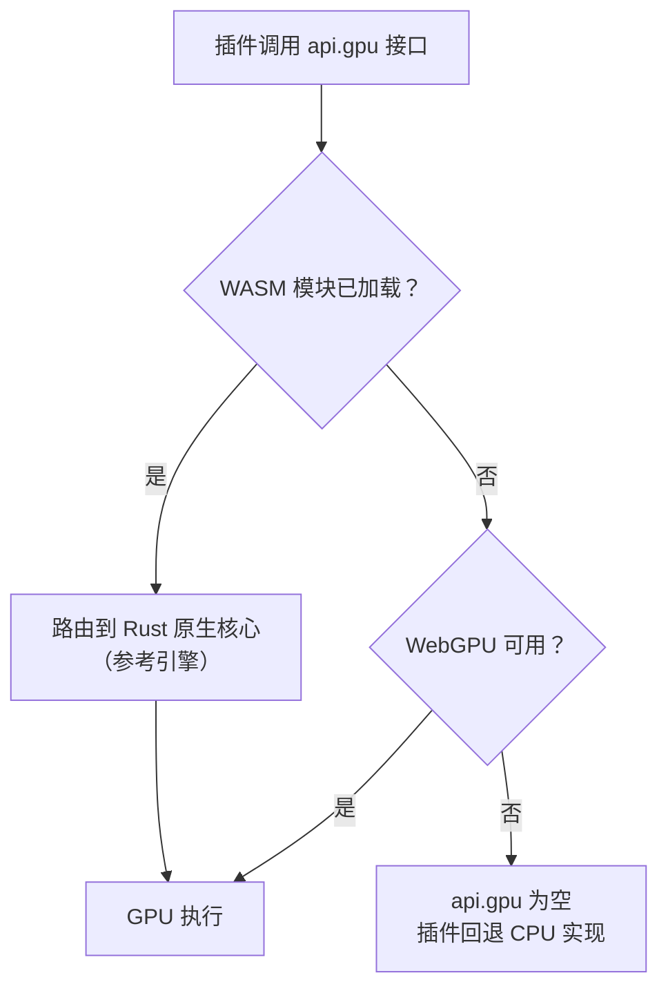
```mermaid
flowchart TD
    A["插件调用 api.gpu 接口"] --> B{"WASM 模块已加载？"}
    B -- 是 --> C["路由到 Rust 原生核心<br/>（参考引擎）"]
    B -- 否 --> D{"WebGPU 可用？"}
    C --> E["GPU 执行"]
    D -- 是 --> E
    D -- 否 --> F["api.gpu 为空<br/>插件回退 CPU 实现"]
```

> 当 WebGPU（或 WASM 模块）不可用时，`api.gpu` 为 `undefined`，插件回退到 CPU 实现——行为一致，不要求 GPU 存在。

这一设计保证开发与生产环境的加速计算均可用：Rust 核心始终是参考引擎，WebGPU 直连是加速路径，而每个内置插件的 CPU 回退跑的是与 GPU 内核数学一致的实现。

### 6.3 可复用 WGSL 内核

`src/core/wgsl.ts` 收纳可复用的 WGSL 计算内核，并配套与内核数学一致的宿主侧打包 / 解包辅助函数供 CPU 回退使用。当前共 **14 个内核**：

| 内核 | 数学内容 | 主要使用方 |
| --- | --- | --- |
| particleKernelWGSL | 交错式 [x, y, vx, vy] 单缓冲积分 | 粒子插件 |
| nbodyKernelWGSL | 三维全对引力 O(N²) 直接求和 | N-Body 引力插件 |
| histogramKernelWGSL | 分箱计数 + 对数刻度 | 直方图插件与统计区块 |
| heatmapKernelWGSL | 网格标量到颜色映射（viridis 停靠点） | 热力图插件 |
| pointCloudKernelWGSL | 点云投影与密度输出 | 点云插件、百万级点云增强 |
| fluidCollideKernelWGSL | D2Q9 格子 Boltzmann 碰撞 | 流体插件 |
| fluidStreamKernelWGSL | D2Q9 迁移 | 流体插件 |
| fluidCurlKernelWGSL | 涡量计算（涡街可视化） | 流体插件 |
| waveKernelWGSL | 二维波动方程 leapfrog 时间推进 | 波动方程插件 |
| matmulKernelWGSL | 分块矩阵乘法（TILE = 16） | 领域内核线性代数加速 |
| fftKernelWGSL | 按级迭代的基 2 FFT（最大 N = 4096） | 信号实验室 |
| kmeansKernelWGSL | K-means 指派与质心累加 | 数据画像与聚类 |
| binningKernelWGSL | 键值分箱聚合（sum / mean / count） | 分箱统计与扫描 |
| spmvKernelWGSL | 稀疏矩阵-向量乘（CSR 行式逐步） | 宿主侧稀疏线性代数内核库（暂无内置插件直接调用；em-eigensolver 改在 Pyodide 上以 NumPy 求解） |

两种典型的内核调用路径：

1. **单缓冲路径**（粒子演示）：上传交错式数据加均匀参数，dispatch WGSL 积分器，读回结果并上报真实 GPU 时间。
2. **乒乓缓冲路径**（N-Body 演示）：成对缓冲交替读写，每个积分步完全留在设备上，无逐步回读开销。

以 N-Body 为例的逐步流程：


```mermaid
flowchart LR
    A["上传天体初始状态<br/>（位置 + 质量）"] --> B["创建两份存储缓冲"]
    B --> C["编译全对引力内核"]
    C --> D["步进：ping 缓冲算力<br/>写入 pong 缓冲"]
    D --> E["交换 ping 与 pong"]
    E -- 继续 --> D
    D -- 停止 --> F["一次性读回<br/>交给 Three.js 渲染"]
```


*N-Body 引力在 GPU 上的全对求和：数天体绕中心质量的三维引力轨迹，WGSL 内核计算并一次性读回交给 Three.js 渲染。*


*格子 Boltzmann 流体：D2Q9 通道流绕翼型障碍物，展示卡门涡街与机翼绕流，GPU 三内核逐步计算 + CPU 降级。*

#### 6.3.1 引擎选择与数据规模阈值

GPU 的收益来自算力，但上传与回读有固定开销，小规模数据在 GPU 上反而更慢。`src/core/gpu-kernels.ts` 因此提供统一分派层与一组数据规模阈值，`auto` 模式下低于阈值自动走 CPU：

| 内核 | 阈值单位 | 阈值 |
| --- | --- | --- |
| matmul | 输出元素数（m × n） | 16384（128 × 128） |
| fft | 复数样本数 | 1024 |
| kmeans | 点数 | 2048 |
| binning | 行数 | 10000 |

阈值判断还会叠加实时设备可用性（`getGpuBackend()`），并把引擎选择写入运行记录，使"这一次是谁在算"可追溯。`src/core/pointcloud-gpu.ts` 在此之上提供百万级点云的预算控制与自动降采样策略，`src/core/mesh3d.ts` 提供三维网格数据管线的纯函数实现。

### 6.4 端到端数值验证

GPU 路径不是摆设：`verify-webgpu` 端到端套件在无头 Edge（SwiftShader 软件渲染）中驱动真实 WebGPU 通路，用数值基准比较 GPU 结果与 CPU 积分器，误差要求在约 2e-6 以内；另有应用集成步骤点击粒子插件并断言出现 wasm 引擎的 GPU 提示。单元测试层覆盖每个 WGSL 模板的生成、参数打包、输出尺寸与 CPU 回退的一致性，以及 GPU 与 CPU 两条路径的数值一致性比对（内核级与领域级两层）。

### 6.5 构建与降级说明

构建命令链为：先执行 `build:wasm` 将 Rust 核心编译进 `src/native`，再进行类型检查与 Vite 生产构建。只构建前端可跳过 WASM 步骤（`build:web`）。持续集成环境不安装完整 Rust 工具链，由存根生成脚本（`make-wasm-stub.mjs`）提供占位 WASM 模块。

当 WASM 模块缺失时前端优雅降级：欢迎页硬件自检会如实报告 WebGPU、WASM 与 IndexedDB 的可用性；计算路由自动改走原生 WebGPU API 或 CPU 实现；插件在无 GPU 环境下以 CPU 完成同样的数学，行为一致。三级降级路径总结：

| 档位 | 条件 | 计算路径 |
| --- | --- | --- |
| 参考引擎 | WASM 模块已加载 | Rust 原生核心 |
| 加速路径 | WebGPU 可用（含经 WASM 或直连） | GPU 内核 |
| 兜底路径 | 两者皆缺 | 与内核数学一致的 CPU 实现 |

## 第七章 科学计算子系统

### 7.1 内核总览

| 分组 | 子系统 |
| --- | --- |
| 数学与数据 | stats（统计）、units（单位与量纲）、signal（信号处理）、model（回归建模）、inference（贝叶斯推断）、uncertainty（不确定度）、profiler（数据画像）、data-quality（数据质量）、cleaning（数据清洗） |
| 数据入口 | io（科研二进制 I/O）、chunked（分块读取）、sql（DuckDB 工作台） |
| 交付与复现 | plot（出版级绘图）、figure（组图）、submit（投稿检查）、report（报告构建）、package（补充材料）、notebook（笔记本）、repro（可复现性）、lineage（数据血缘）、experiment（实验记录）、sweep（参数扫描） |
| 教学与社区 | course（课程模式）、gallery（作品长廊）、templates（学科模板） |
| 平台内核 | errors（错误分类法与 Result）、validation（校验框架）、bench（性能基准）、ai（AI 助手策略）、pyodide（Python 运行时）、r（R 运行时）、monaco（编辑器宿主）、theme-pack（主题包） |

### 7.2 统计内核（src/core/stats）

统计内核消费普通数值数组、DataTable 或 Dataset，返回结构化结果，全部为纯函数实现。公共出口按模块划分：

| 模块 | 能力 |
| --- | --- |
| descriptive | 均值、方差、标准差、中位数、分位数、摘要统计、均值置信区间（t 分布临界值经 studentTInv 求得） |
| special | 特殊函数：不完全伽马与贝塔函数、正态与 t 分布等累积分布及其逆函数（供检验与功效计算复用） |
| tests | 单样本 t 检验、双样本 t 检验（Welch 校正自由度）、配对 t 检验、单因素方差分析、Mann-Whitney U 检验、卡方独立性检验，返回含统计量、p 值与自由度的结构化结果 |
| effect | Cohen's d 效应量、Pearson 与 Spearman 相关 |
| correction | Bonferroni 与 Benjamini-Hochberg 多重比较校正，p 值先经清洗（非有限值剔除）再校正 |
| power | 双样本 t 检验的功效分析 |
| narrative | 把五类主要检验族（t 检验、方差分析、卡方、相关、线性回归）的结构化结果转写成中英双语的出版级句子；按期刊惯例渲染 p 值（`p < .001` 用不等式，其余三位小数省略前导零），不显著结果使用中性措辞 |

边界输入一律显式抛错而不是静默给出错误数字：Welch 自由度除零、方差分析组数不足、配对检验长度不等都会得到结构化错误。统计能力向用户的呈现方式有三种：流程模式的 14 个 `stats.*` 区块、积木与代码模式 Studio API 中的 `summary` 等调用，以及报告构建器与 Figure Studio 的图注草稿——底层都指向同一实现。

### 7.3 科研二进制 I/O（src/core/io）

科研数据常以领域二进制格式存储。`scientific.ts` 提供单一入口：给定拖入或打开的 File，先读文件头并按魔数（或扩展名）识别格式，再路由到对应加载器，把每个变量、数据集或 HDU 转成统一的 `RawVariable` 列表，调用方负责将其转为项目数据文件。

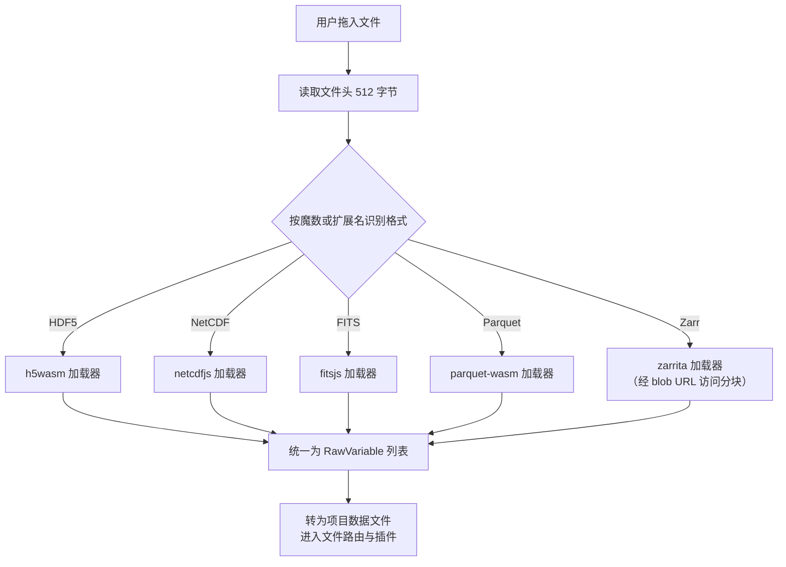
```mermaid
flowchart TD
    A["用户拖入文件"] --> B["读取文件头 512 字节"]
    B --> C{"按魔数或扩展名识别格式"}
    C -- HDF5 --> D["h5wasm 加载器"]
    C -- NetCDF --> E["netcdfjs 加载器"]
    C -- FITS --> F["fitsjs 加载器"]
    C -- Parquet --> G["parquet-wasm 加载器"]
    C -- Zarr --> H["zarrita 加载器<br/>（经 blob URL 访问分块）"]
    D --> I["统一为 RawVariable 列表"]
    E --> I
    F --> I
    G --> I
    H --> I
    I --> J["转为项目数据文件<br/>进入文件路由与插件"]
```

| 格式 | 典型领域 | 依赖库 | 模块 |
| --- | --- | --- | --- |
| HDF5 | 通用科学分层数据 | h5wasm | hdf5.ts |
| NetCDF | 地学、气象 | netcdfjs | netcdf.ts |
| FITS | 天文图像与表 | fitsjs | fits.ts |
| Parquet | 列式表格 | parquet-wasm（经 apache-arrow 合并全部记录批次） | parquet.ts |
| Zarr | 分块 N 维数组（本地目录或远程存储） | zarrita | zarr.ts |

辅助工具（`types.ts`）包括整型到 Float64 的安全转换（int64 与 uint64 数据集不再抛错）、名称净化、DataTable 转 CSV 与数据集构造。大文件的导入路径会先经 `chunked/` 的行窗口读取与内容指纹，再由 `parse-worker.ts` 与 `worker-pool.ts` 在 Worker 池中并行解析。

### 7.4 出版级绘图引擎（src/core/plot）

区别于插件里的画布渲染，plot 子系统是一套纯 TS 的矢量绘图引擎，目标是把 DataTable 转成出版级 SVG 并导出：

| 模块 | 能力 |
| --- | --- |
| types | PlotSpec、PlotSeries、比例类型与 SVG 载荷定义 |
| scale | 线性、对数、时间刻度，niceTicks 优雅刻度值，刻度格式化；退化定义域（单点、零跨度）有明确处理 |
| charts | DataTable 转折线、散点、直方图、柱状四类图型 |
| svg | renderSVG 矢量渲染，属性与文本分别转义 |
| export | 导出 SVG 文件与 PDF（jsPDF + svg2pdf.js），下载文本 |

由于整条链路（数据、刻度、渲染、导出）都是纯函数，绘图引擎有专门的单元测试（`tests/plot`），也是可复现性内核 DAG 转 Python 导出策略的天然搭配。流程模式的 4 个 `plot.*` 区块即由这套引擎渲染，与 4 个走插件渲染器的 `viz.*` 区块互为补充。

### 7.5 可复现性内核（src/core/repro）

科研计算的可复现性要求"同样的输入与参数得到同样的输出"。repro 内核提供六块能力：

| 模块 | 能力 |
| --- | --- |
| random | 带种子的伪随机数：mulberry32 算法，同种子产生完全一致的序列；全局 setSeed 与 currentSeed 支持会话级设定 |
| manifest | 运行清单 createManifest：记录种子、工作室版本、每个输入文件的哈希、区块图（经拓扑排序后计算哈希）与输出；manifestToText 生成可归档文本 |
| exporter | DAG 转 Python：把流程图导出为可独立重跑的 Python 脚本，与 topoSort 依赖排序配合，脚本内含与运行清单一致的种子设定 |
| lock | `repro.lock` 导出与校验：数据指纹、参数哈希、种子与代码快照，支持五类漂移判定与一键重跑 |
| snapshot | 环境快照（版本、平台与内核可用性）纳入锁文件，便于判定"漂移发生在数据还是环境" |
| index | 统一出口与稳定哈希（FNV-1a hashString，八位十六进制，供输入与图的指纹复用） |

运行清单的构成：

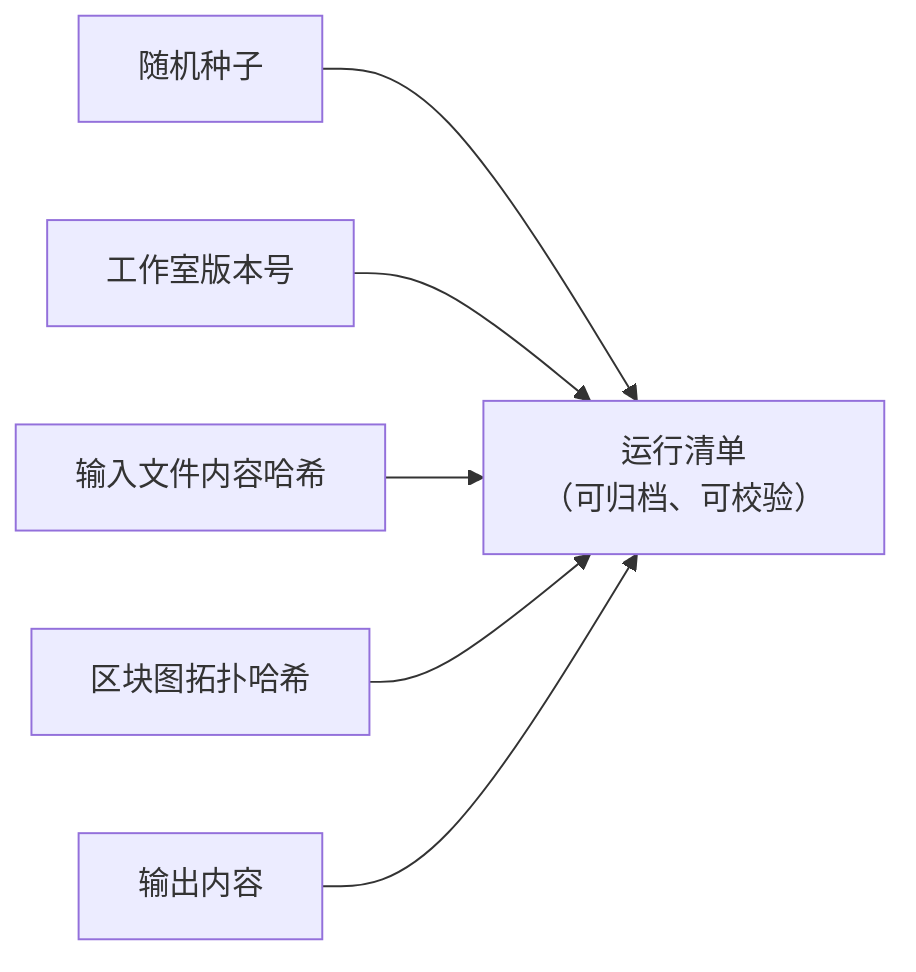
```mermaid
flowchart LR
    A["随机种子"] --> M["运行清单<br/>（可归档、可校验）"]
    B["工作室版本号"] --> M
    C["输入文件内容哈希"] --> M
    D["区块图拓扑哈希"] --> M
    E["输出内容"] --> M
```

### 7.6 不确定度引擎（src/core/uncertainty）

| 模块 | 能力 |
| --- | --- |
| bootstrap | Bootstrap 置信区间：可复现重采样，支持均值 / 中位数 / 标准差等统计量 |
| montecarlo | 蒙特卡洛传播：输入分布经样本传播到输出分布 |
| mcmc | Metropolis-Hastings 采样（CPU 路径） |
| pcg | PCG32 伪随机数发生器，与 GPU 内核共享同一序列定义 |
| gpu-engine | WGSL GPU 加速的 Bootstrap 重采样（每链一个 workgroup），百万级样本重采样 |
| gpu-mcmc | GPU 上的并行链 MCMC |
| diagnostics | 收敛诊断：R-hat、有效样本量 ESS、HDI 区间与 MCSE |
| index | CPU / GPU 引擎自动选择与统一出口，选择结果写入运行记录 |

引擎选择遵循 06 篇的阈值与设备可用性规则，GPU 不可用时自动回落到 CPU，两条路径在同一随机数序列下结果在数值容差内一致，并有专门的一致性单元测试。

### 7.7 单位系统（src/core/units）

`quantity.ts` 提供类型化量值 `Quantity`：SI 词头、量纲代数与换算检查。它以 `units.convert`（换算）与 `units.check`（一致性检查）两个流程区块，以及参数面板中的 `QuantityInput` 组件向用户暴露，使带单位的物理参数不再以裸数字出现在管线里。

### 7.8 信号处理（src/core/signal）

| 模块 | 能力 |
| --- | --- |
| fft | 基 2 FFT 与幅值谱；与 GPU 端 `fftKernelWGSL` 数学一致 |
| window | 窗函数（Hann、Hamming、Blackman 等） |
| filter | Savitzky-Golay 平滑与滑动平均滤波 |
| correlation | 自相关 ACF 与偏自相关 PACF |
| decompose | 经典加性时序分解 x = 趋势 + 季节 + 残差：趋势用对称滑动平均（偶数周期用周期加一居中平均，同 X-11），季节项按相位去趋势均值归一化到零和；残差摘要给出均值 / 标准差与 Jarque-Bera 式偏度峰度正态性检查 |
| index | 统一出口；滤波后的列可作为派生文件保存回项目并进入血缘图 |

### 7.9 建模与推断

**回归建模（src/core/model）**

| 模块 | 能力 |
| --- | --- |
| linalg | 小型稠密线性代数：转置、乘法、Householder QR 与三角求解（只覆盖 OLS / 岭 / 多项式拟合所需） |
| ols | 普通最小二乘（QR 分解），系数表含估计值、标准误、p 值与置信区间 |
| logistic | 逻辑回归（IRLS 迭代重加权最小二乘） |
| ridge | 岭回归，K 折交叉验证选参 |
| poly | 多项式拟合 |
| diagnostics | 2×2 残差诊断图（残差-拟合、QQ、尺度-位置、残差-杠杆） |
| index | 统一拟合入口与结果类型 |

**贝叶斯推断 · Inference Forge（src/core/inference）**

| 模块 | 能力 |
| --- | --- |
| hmc | 哈密顿蒙特卡洛采样器，含 Dual Averaging 步长自适应 |
| nuts | No-U-Turn Sampler（U 形回旋判据），无须手工设步数 |
| model / templates | 声明式似然模板（线性回归、逻辑回归等），配数据尺度化的弱先验 |
| model-catalog | 可推断模型目录与参数元数据 |
| diag | R-hat、bulk / tail-ESS、HDI、MCSE 等后验诊断 |
| compare | WAIC 与 PSIS-LOO 模型比较；PSIS 采用 0.2 倍最大权重的原始截断（不做完整广义帕累托重拟合），Pareto-k 用 Hill 型尾部估计，足以标记 k > 0.7，但不等价于完整的 loo 诊断 |
| onnx-runner | 浏览器内 ONNX 模型推理（WebGPU 加速路径） |
| types | 采样、模型与诊断的公共类型 |

推断能力在流程区块中以 `stats.mcmc`、`stats.bootstrap`、`stats.montecarlo` 三块的形式进入管线，在科研工具页中以 Inference Forge（`/studio/inference`）与模型推理（`/studio/model-inference`）两个整页呈现。

### 7.10 数据工程与可靠性内核

| 子系统 | 关键能力 |
| --- | --- |
| data-quality | Pandera 风格列级 / 表级期望契约，懒求值质量报告；类型推断与画像（四分位、IQR 离群、缺失与去重计数）、由画像反推 schema 建议、逐行隔离（quarantine）并记录拒绝原因、DataTable 适配器 |
| cleaning | 数据清洗向导的步骤模型与引擎：类型转换、缺失值策略（删除 / 均值 / 中位数 / 零 / 前向填充）、离群标注（IQR / z 分数）、去重、列重命名五类可序列化步骤；步骤永不改写输入表，支持逐步前进 / 回退 / 跳转与"撤销该步" |
| profiler | 流式单遍列画像：数值列用 Welford 精确均值方差加蓄水池采样求分位数与 MAD，修正 z 分数（\|0.6745(x−median)/MAD\| > 3.5）计离群；文本列用 HyperLogLog 估基数与 Space-Saving 求 Top-K；表级给出 Pearson / Spearman 联合采样与重复率估计，综合成 0–100 确定性质量分与问题清单，按内容指纹缓存 |
| chunked | 大分隔文件的按行窗口读取（csv / tsv / dat / xyz / txt），工作集保持在一个分块而非整文件；其余格式仍走整文件 io |
| sql | DuckDB-WASM 引擎，首次使用时懒加载；项目文件注册进 DuckDB 虚拟文件系统并暴露为表；查询支持超时与 AbortSignal，中止或超时会终止 Worker 并丢弃单例，下次调用重建实例 |
| validation | 可组合校验器 `(value, path) => issues[]`：组合即普通函数组合，schema 是普通数据，可复用、可部分应用、可无 React 单测；类型校验器跳过 null / undefined，需要必填时用 `required()` 组合 |
| errors | 结构化错误分类法与原因链、`Result<T, E>` 显式错误值通道、退避加抖动的重试与中止、断言守卫、去重错误注册表与有界诊断环，以及全局 `error` / `unhandledrejection` 捕获 |

`Result` 类型的存在理由是边界代码不应以抛错为默认：一行非法 CSV、一个缺失文件都是调用方必须分支处理的**预期**结果，把它变成值可以让分支在 `noImplicitReturns` 下穷尽，也把堆栈开销从热校验路径上移走。

### 7.11 科研工作流与交付

| 子系统 | 关键能力 |
| --- | --- |
| experiment | 运行记录模型与 A/B 参数对比：一次执行（流程 / 积木 / 代码 / 笔记本 / 扫描 / 不确定度 / 建模 / 推断）的耐久快照，存于 IndexedDB `runs` 存储而**不**写进 `.clproj`，使项目文件保持小巧；按 projectId 建索引，项目删除时一并清理；内容哈希复用 repro 的 FNV-1a |
| lineage | 数据血缘图与分层布局：以运行记录上的文件 id 把项目文件（源）连到运行（变换），采用 Sugiyama 式分层 DAG 画法（最长路径分层、单趟重心排序、行居中），无 React / store / DOM 依赖 |
| sweep | 参数扫描领域层：`expandPlan` 把 SweepPlan 展开为确定性设计点——全网格 / 列表轴走完整笛卡尔积，全拉丁超立方轴按维度分层抽样，混合 lhs / grid 方案被拒绝（样本量无歧义定义）；纯 TS，全部校验可测 |
| figure | 出版级组图：FigureSpec 是挂到期刊模板网格（IEEE / Elsevier 栏宽、色盲友好调色板）上的多面板 PlotSpec 容器；`composeFigure` 渲染单张独立 SVG（嵌套面板 viewport 加 a/b/c 面板标签），`exportFigure` 处理 SVG / PDF / PNG-600dpi 下载；组图只重新定尺寸，**不**修改原 PlotSpec |
| submit | 投稿前检查门：`runSubmissionCheck` 依据目标期刊档案（IEEE / Elsevier）遍历图文档（模板、面板、图注、导出设置），返回按图像 / 标注 / 文本 / 元数据分组的通过与失败项；每个失败项带 i18n 消息、修复键与问题控件的 DOM id，使界面可以提供"定位问题"；`caption.ts` 依据图型、列名与可选统计量草拟中英双语的"图 1. …"图注 |
| report | 交互式报告构建器：`buildReport` 把 ReportSpec（有序章节：标题、Markdown、Figure Studio 图、数据表、运行摘要、筛选器）构建成**单一自包含 HTML**——内联 CSS、内联 SVG、内联 JSON 数据与零依赖的原生 JS 控制器（筛选联动、可排序表格）；所有用户字符串先转义，内嵌 JSON 以 `<script type="application/json">` 输出并将 `<` 做 unicode 转义，杜绝 `</script>` 载荷逃逸 |
| package | 补充材料打包：manifest.json（项目元数据、运行记录、血缘图、作者与许可表单）加可选的原始数据文件与代码会话，用 fflate 打成研究者随论文一起上传的 ZIP |
| notebook | 笔记本模型：markdown / 代码单元的扁平列表，持久化在 `project.state.notebook`；执行语义在 notebookStore（Pyodide 运行时是有状态且页面级的），模块本身只持有单元模型、输出模型与一个安全的小型 markdown 渲染器 |
| course | 课程模式领域模型：本地优先的教学闭环——教师创建课程（由本地身份字符串标识，无账号体系）、发布绑定学科模板的作业，学生领取任务、在项目中作业并提交运行结果的 repro.lock 快照，教师查看学生 × 作业矩阵、记录评分与评语，并把整个班级按学生一目录导出为包；持久化在 IndexedDB `courses` 存储 |
| gallery | 作品长廊：本地"我的分享"存储（localStorage），记录用户分享出去的作品元数据与净化后的快照 HTML，使详情弹窗可离线重开；v1 不上传任何内容，下架只做标记（保留审计轨迹）并从所有列表过滤 |
| templates | 学科模板目录：把早期"功能演示"样例改写为学科情景模板，每个从真实研究问题出发，附带确定性示例数据集与 3–6 步引导；模板内容以 `{ zh, en }` 对形式内嵌（不走全局 i18n 字典），只有周边 UI 框架使用 `tpl.` 键 |

### 7.12 语言运行时与 AI 助手

| 子系统 | 关键能力 |
| --- | --- |
| pyodide | 代码模式 Python 运行时：`pyodide-worker.ts` 在 Web Worker 中启动 CPython，`studio.py.ts` 作为可导入模块注入 `sys.modules`，`runtime.ts` 把 PyodideClient 接到编辑器 store 与渲染桥——流式回传 stdout/stderr、把绘图载荷转给积木模式同一条 RenderedView → 插件通路、把 Python 变量快照转成面板可用的 DataValue |
| r | R 运行时工厂 `createRRuntime({ preferFull })`：优先尝试 webR 完整运行时，若 bundle 缺失或启动失败则回落到内置 IR 引擎并记录 `fallbackReason` 供界面如实告知；`preferFull = false` 时直接走内置引擎。内置路径无外部依赖，必须始终可用——当前发行版即以此路径运行完整 `studio.*` DSL |
| monaco | Monaco 编辑器宿主与语言服务装配（懒加载） |
| ai | 助手双模式策略：离线（默认）是 `intents.ts` 的纯 TS 规则引擎，把自然语言请求（如"对 x 和 y 做相关分析并画散点图"）经五类意图模板（相关 / 回归 / 分布 / 检验 / 筛选）合成为可运行的 `studio.*` Python 代码，全程不联网；在线模式要求**同时**具备显式授权标志与已配置端点，缺一即拒绝或降级，使提示词不会意外外泄；`validateStudioApi` 保证生成的调用不超出真实运行时模块的 API 白名单，助手绝不臆造接口 |
| theme-pack | `.cstheme` 主题包：纯声明式数据（CSS 自定义属性覆盖、字体偏好、密度模式与可选图表配色），**绝不携带可执行内容**；`parseCsTheme` 是唯一校验闸门——严格拒绝每层未知键、拒绝 `__proto__` / `constructor` / `prototype` 等危险原型键、要求 CSS 变量名为 `--kebab-case` |

### 7.13 支撑设施

- **运行日志导出**：`logger.ts` 聚合会话日志，配合 `download.ts` 支持从工作台导出日志文件，便于问题反馈与回归定位。
- **插件缓存与示例资产**：`pluginCache.ts` 与 `exampleAssets.ts`、`examples.ts` 支撑内置示例数据与示例项目（`examples/projects` 下 11 个流程管线、`examples/code` 下 9 个 Python 示例）的发现与加载。
- **viewport2d 与 dataFiles**：2D 视口抽象（快照式访问，插件卸载安全）与项目数据文件注册（`setProjectFiles` 与 `resolveDataFile`），使项目自有文件、内置示例与代码模式 `_FILES` 共享同一套加载逻辑。
- **OPFS 与迁移**：`opfs.ts` 提供大文件分块存储，`opfs-migration.ts` 把既有 IndexedDB 数据平滑迁移，项目元数据仍留在 IndexedDB。
- **PWA 与跨站导航**：`pwa.ts` 处理离线缓存与服务工作者预缓存清单（由 `gen-sw-precache.mjs` 生成），`site-links.ts` 负责工作台、官方站点与文档站三者的互相跳转。
- **引用与归档**：`citation.ts` 生成软件引用与归档元数据，由 `gen-citation-cff.mjs` 与 `check-citation.mjs` 维护 CITATION.cff。
- **性能基准**：`bench/` 的 `runAllBenchmarks()` 执行导入 / 计算 / 渲染 / 内存四类关键路径套件，返回含环境信息（Node 版本、平台、架构、CPU 型号、日期）的结构化结果，由 `scripts/bench-run.mjs` 在 Node 中无头运行并写入 `bench-results.json`，再与 `bench/baseline.json` 对比（详见 08 篇）。

这 33 个子系统共同构成产品的"科学"底座：统计、建模与推断保证结果的专业性，I/O 与数据工程保证数据入口的开放性与可信度，绘图与组图保证输出的出版级质量，可复现性与交付管线保证结论可以被别人原样重放并随论文一起交付。

## 第八章 测试与质量保障

### 8.1 单元测试（Vitest）

运行方式：`npm test`（即 `vitest run`）执行全部单测；`npm run verify` 先做类型检查再跑单测，是贡献指引中要求保持绿色的组合检查。

测试文件按主题组织在 `tests/` 下，根目录与子目录各占一半：

| 主题 | 文件数 | 覆盖内容 |
| --- | --- | --- |
| 插件运行时与插件族 | 30（根目录） | 内置插件、科研/地理物理/数据插件、结构力学、三维可视化、插件缺陷回归、沙箱与 cspkg、文件格式路由、插件市场生命周期、i18n、可访问性与对比度、引用元数据、PWA、主题包、存储与运行记录 |
| 区块系统 | 12 | 数据表运算、区块目录、编译器、执行器、几何、统计区块、文件数据、操作符、可视化桥接 |
| 编辑器与 IR | 12 | 共享 IR 校验与往返、Blockly JSON 与 IR 互转、解释器、JS 与 Python 代码生成、三模式 sync-threeway、积木 i18n、编辑器状态库、Studio API、代码示例 |
| 统计内核 | 7 | 描述统计、假设检验、多重比较校正、效应量、功效分析、特殊函数、结果叙述转写 |
| 平台核心 | 7 (+2) | 计算服务与 WGSL、GPU 计算、WASM 加载器、i18n；另有 `core/errors` 与 `core/validation` 各 1 |
| 可复现性 | 4 | 随机数、运行清单、锁文件、快照 |
| R 运行时 | 3 | 运行时工厂、完整运行时回落、DSL |
| 不确定度 | 3 | Bootstrap、蒙特卡洛、MCMC 与诊断 |
| 建模、推断、I/O、插件签名、扫描、模板 | 各 2 | 线性代数与拟合、贝叶斯比较与 ONNX、HDF5/NetCDF 等加载器、签名验证、设计点展开、学科模板 |
| 其余单文件模块 | 17 | AI 助手意图、分块读取、数据质量、组图、血缘、模型、笔记本、打包、页面、绘图、画像、报告、信号、SQL、状态库、单位 |

值得注意的测试技术：

- **模块级缓存重置**。像 WASM 加载器这类带模块级状态的模块，每个用例前用 `resetModules` 加 `doMock` 重置，再动态导入新实例，避免用例之间互相污染。
- **FakeWorker 驱动真实运行时**。插件 Worker 的 RPC 用假 Worker 承载真实的运行时实现，在 Node 里完成端到端往返，无需浏览器。
- **严格模式的陷阱有专门说明**。`new Function` 在严格模式下无法同时使用 `"use strict"` 指令与默认参数值，遗留沙箱为此改用普通参数并显式传 `undefined`——这类"看起来是风格问题、实则是正确性问题"的点都沉淀在测试注释里。
- **回归用例制度化**。已修复的插件缺陷沉淀为 `pluginBugfixes` 等回归用例，i18n 键值在测试中校验齐备，避免复发。

### 8.2 端到端测试（Playwright-core）

每套脚本各自启动 `vite preview` 生产预览，驱动无头浏览器，断言真实像素与零控制台错误：

| 套件 | 端口 | 覆盖内容 |
| --- | --- | --- |
| smoke-test | 4173 | 启动、自动加载插件、自动建项目、响应式参数、最近项目恢复 |
| verify-ui | 4173 | 改版后的功能回归与布局几何：尺寸、主题切换、画布可见性、插件列表 |
| verify-fixes | 4177 | 自动适配、统一等宽字体、Run 控件开关、顶栏分簇 |
| verify-3d | 4199 | 宿主 Three.js 场景中的三维点云 |
| verify-plugins | 4198 | 三维与二维视口可见性互斥、等值线渲染涡旋场、散点与龙卷风示例 |
| verify-webgpu | 4289 | 两阶段：`tests/e2e/webgpu.html` 取真实 WebGPU 设备驱动 Rust/WASM 核心做数值校验；再在无头 Edge（SwiftShader）中校验 GPU 与 CPU 一致性（约 2e-6 内）与粒子插件的 GPU 提示 |
| verify-block-mode | 4174 | 积木模式：模式切换、编译、运行、积木到代码同步 |
| verify-code-mode | 4175 | Monaco 加 Pyodide：运行 Python、变量面板、控制台、绘图画布 |
| verify-lang-modes | 4176 | R / JS 代码模式与跨模式切换、R→JS 互译、Flow ⇄ Block ⇄ Code 无损循环 |
| verify-ai-samples | 4211 | 样例对话框逐个加载四个 AI 训练样本并捕获提示文案，使解析失败可观测而非靠推断 |
| verify-ai-training | 4199 | AI 训练器：参数面板、样例加载、TF.js 真实训练与损失曲线、模型切换重置、决策边界、MNIST CNN |
| verify-research | 4173 | 科研工具链路：启动器 → 运行记录 → 血缘 → 图表工作台 → 补充材料打包 → 笔记本 |
| verify-site | — | 合并站点完整性：校验 8 条规范路径（站点契约） |

**共享 harness**。所有套件都走 `scripts/_harness.mjs`，把过去散落在各脚本里、只在某台机器上成立的三件事统一为"从环境解析并带合理默认值"：浏览器可执行路径（按平台列出候选，Edge 优先、Chrome 兜底）、截图目录（系统临时目录）、预览端口（被占用时自动另取）。harness 同时保证清理，断言失败不会泄漏预览服务或浏览器进程。

**链路与链外**。`npm run test:e2e` 串联 11 套：`smoke-test`、`verify-ui`、`verify-fixes`、`verify-3d`、`verify-plugins`、`verify-webgpu`、`verify-block-mode`、`verify-code-mode`、`verify-ai-samples`、`verify-ai-training`、`verify-research`。`verify-lang-modes` 与 `verify-site` 不在该链内——前者依赖 Monaco 与 Pyodide 的完整加载（耗时较长），后者校验的是部署产物而非开发预览，因此各有独立入口（`npm run verify:site`）。

贡献指引要求：新插件或新功能必须附带端到端检查。

### 8.3 性能基准与体积预算

性能回归靠**基线对比**而非绝对阈值，且基线按环境分文件：

- `src/core/bench/` 的 `runAllBenchmarks()` 执行导入 / GPU 内核 / 渲染帧率 / 内存四类关键路径套件，返回含环境信息（Node 版本、平台、架构、CPU 型号、日期）的结构化结果。
- `scripts/bench-run.mjs` 在 Node 中无头运行并写入 `bench-results.json`；`scripts/bench-compare.mjs` 与基线逐指标比对——`bench/baseline.json` 面向开发机，`bench/baseline.<platform>-<arch>.json`（仓库中已有 `baseline.linux-x64.json`）面向 CI，因为共享 Runner 上的数字与开发桌面没有可比性；`scripts/bench-report.mjs` 产出单文件 HTML 报告。
- 新环境首次运行没有基线时，`bench-compare.mjs` 记录一份并以 0 退出，由 bench 工作流把该文件提交回仓库，供后续运行真正设门禁。另有两类**硬件噪声守卫**会重录基线而非误报失败（重录文件**故意不提交**，避免"每次运行都产生一次提交"的噪声）：① Runner 报告的 CPU 型号或 Node 版本与基线不一致；② CPU/Node 字符串相同、但吞吐指标中 ≥75% 同向回归且内存指标全部持平——这是同型号 CPU 被换到不同宿主机（微码/固件/负载不同）的典型签名；选择性或混合方向的真实代码回归不会命中该守卫，仍会正常失败。
- 体积侧由 `scripts/build-budget.mjs` 分析构建产物，对照 `budget-baseline.json` 做门禁（FR-06）。

### 8.4 持续集成（5 条工作流）

| 工作流 | 触发 | 关键步骤与门禁 |
| --- | --- | --- |
| **ci** | push 到 main、所有 PR | 引用元数据检查（FR-10）→ `tsc --noEmit` → `npm test` → 生成 WASM 存根 → `build:web` → 性能预算（FR-06）。任一步失败即红 |
| **bench** | push 到 main、发布 Release | `npm run bench:ci`（跑基准 + 按环境基线比对）→ 首次运行提交环境基线 → 结果写入 job summary 并上传 artifact；发布时作为附件挂到 Release（FR-23） |
| **security** | push 到 main、PR、每周一 03:00 UTC、手动 | 三个并行 job：OSSF Scorecards（SARIF 产物，留存 30 天）、SBOM 生成（CycloneDX 1.5，由无依赖 Node 脚本从 `package-lock.json` 生成，留存 90 天）、`npm audit`（**high / critical 阻断合并**，带需写明理由与后续 issue 的 `AUDIT_ALLOWLIST` 豁免机制，豁免项降级为警告） |
| **release** | 推送 `v*` 标签 | build：生成 WASM 存根 → `build:web` → 生成 `CITATION.cff` → 打包 dist zip；archive：Zenodo 存缴并铸造 DOI，**未配置 `ZENODO_TOKEN` 时显式报错并给出配置指引**，而不是静默跳过归档；release：发布 GitHub Release，附 zip、`CITATION.cff` 与 DOI |
| **deploy** | push 到 main、手动 | 装 Rust（`wasm32-unknown-unknown` 目标）与 `wasm-bindgen-cli 0.2.127` → 编译真实 WASM → 构建工作台 `app/` 与官网根站 → `deploy:merge` 合并产物 → `verify-site` 校验 8 条规范路径 → 发布 GitHub Pages |

**CI 里没有 Rust 工具链**（deploy 除外）：其余工作流的 `dist` 由 `scripts/make-wasm-stub.mjs` 生成模块存根，因为 `vite build` 会把 `src/core/wasm.ts` 中的动态导入切成独立 chunk，构建期只需要该 chunk 存在、不需要真实内核。

**构建链自带门禁**：`npm run build` = `build:wasm` && `tsc --noEmit` && `vite build` && `build-docs`，任一步失败即中止；纯前端场景可用 `npm run build:web`（跳过 WASM 编译）。

### 8.5 工程脚本

`scripts/` 下 40 个脚本按用途分为六类：

| 类别 | 脚本 |
| --- | --- |
| 端到端与 harness | `_harness.mjs`（共享 harness）、`smoke-test.mjs`、`verify-*.mjs`（12 个）、`_line-check.mjs`（目检 Monaco 当前行与选区实际渲染色） |
| 性能与预算 | `bench-run.mjs`、`bench-compare.mjs`、`bench-report.mjs`、`build-budget.mjs` |
| 构建与部署 | `build-wasm.mjs`、`make-wasm-stub.mjs`、`build-docs.mjs`、`merge-deploy.mjs`、`gen-sw-precache.mjs`、`copy-pyodide.mjs`、`copy-webr.mjs`、`vendor-blockly-media.mjs` |
| 资产与示例生成 | `make-example-data.mjs`、`make-example-projects.mjs`、`gen-ai-examples.mjs`（种子化 PRNG，产出确定、可提交、可被学习者检查的 CSV） |
| 合规与签名 | `sign-cspkg.mjs`、`gen-sbom.mjs`、`gen-citation-cff.mjs`、`check-citation.mjs` |
| 技术文档排版 | `build-tech-docs.mjs`（md → 分页 HTML → A4 PDF）、`build-tech-summary.mjs`（从分篇汇编合集，使合集不可能与分篇漂移） |

其中 `gen-citation-cff.mjs` 与 `check-citation.mjs` 一写一校，共同维护 `CITATION.cff`；`gen-sw-precache.mjs` 生成 Service Worker 预缓存清单，使离线可用范围与构建产物严格一致。

**技术文档排版链路**。`docs/technical/` 下的九份文档由 `node scripts/build-tech-docs.mjs` 重建：Markdown 经内置的子集解析器转成区块，mermaid 围栏在构建期用无头浏览器渲染为内联 SVG（产物不含任何客户端脚本，PDF 里是可缩放的矢量图），随后在真实页面尺寸下**逐块测量高度**并按页高装填——固定高度的 `.page` 配 `overflow: hidden`，靠目测平衡内容会在任何一节变长时把内容裁掉，因此分页必须由测量驱动。测量结果同时回填目录页码，并在生成后逐页复检"内容是否越过下边距"，发现溢出即以缩小后的可用高度重排。技术总结（`Ergalics Studio.md`）则由 `build-tech-summary.mjs` 从八篇分篇源码汇编，因此不可能出现"分篇已改、合集还写着旧数字"的情况。

### 8.6 质量原则

1. **纯函数优先**。编译器、统计内核、绘图与组图引擎、代码生成与 IR 转换全部是纯函数，可在 Node 环境直接测试；血缘图的分层布局同样无 React / store / DOM 依赖。
2. **副作用收口**。区块系统里只有渲染桥接一个带副作用的模块，执行器异步但无副作用；研究工具页的胶水层（`researchUi.ts`）也被刻意写成无 React 依赖的薄层，以便单独测试。
3. **数值一致性兜底**。每个 GPU 内核都有数学一致的 CPU 实现，单测与端到端两层校验二者一致——这是"自动降级"能够被信任的前提。
4. **边界显式化**。边界输入抛结构化错误、空数据启动有守卫提示、环境缺失如实自检报告，而不是静默失败或静默降级；可复现性有专门的门禁文档告知。
5. **不静默跳过**。需要归档就必须归档（Zenodo 未配置即报错），需要门禁就必须门禁（审计豁免要写明理由），第一次运行没有基线就记录并提交——把"没跑成"和"跑过了"区分清楚。

## 第九章 使用指南

### 9.1 技术栈与环境要求

Ergalics Studio 是纯前端的单页应用，唯一的强依赖是一个现代浏览器；唯一可选的本地工具链是 Rust（只用于把原生核心编译成 WebAssembly，缺失时前端优雅降级）。

| 层级 | 选型 |
| --- | --- |
| 界面 | React 18、react-router-dom 7、Zustand 5 |
| 语言 | TypeScript 5.7（strict 模式） |
| 构建 | Vite 6 + Vitest |
| 可视化 | 原生 Canvas/WebGL、Three.js、WGSL 计算着色器 |
| 编辑器 | Monaco Editor、Blockly 13 |
| 运行时 | Pyodide（CPython）、DuckDB-WASM、TensorFlow.js |
| 科研 I/O | h5wasm、netcdfjs、fitsjs、zarrita、parquet-wasm（配 apache-arrow） |
| 打包与压缩 | fflate、lz-string |
| 原生核心 | Rust（wasm32-unknown-unknown）+ wasm-bindgen 0.2 |
| 端到端测试 | playwright-core 驱动无头 Edge |
| 协议 | MIT |

浏览器侧要求 WebGPU / WebAssembly / Web Worker / IndexedDB。WebGPU 与 WASM 均为可选：缺失时应用在欢迎页如实自检报告，并把计算回退到 CPU 实现。

### 9.2 安装、运行与构建

```bash
npm install          # 安装依赖
npm run dev          # 启动开发服务器
npm run build        # 完整构建：WASM 核心 → 类型检查 → 打包 → 文档站
npm run build:web    # 只构建前端（跳过 Rust 步骤）
npm run preview      # 预览生产构建
```

质量检查：

```bash
npm test             # Vitest 单元测试
npm run verify       # 类型检查（tsc --noEmit）+ 单元测试
npm run test:e2e     # Playwright 端到端套件（需本机浏览器）
npm run bench        # 性能基准并对基线
```

`npm run build` 自带门禁：WASM 编译、类型检查、打包、文档站拷贝任一步失败即中止。类型检查同时充当 lint——代码库不引入额外的 lint 规则集，而是把约束交给 TypeScript 严格模式。

### 9.3 数据格式支持

| 类别 | 格式 | 说明 |
| --- | --- | --- |
| 文本与表格 | CSV、TSV、DAT、TXT | 按分隔符推断列类型 |
| 结构数据 | JSON（点集、网格、网络、天体、桁架等） | 各插件声明自己接受的结构 |
| 点云与网格 | XYZ | 2D 与 3D 点云 |
| 图像 | PNG | 图像查看器与示例资源 |
| 地理 | GeoJSON | 离线矢量地图分级设色 |
| 科研二进制 | HDF5、NetCDF、FITS、Zarr、Parquet | 纯 TypeScript 调度器按魔数分派到各加载器 |
| 项目 | .clproj | 工程自有格式，lz-string 压缩 |
| 插件包 | .cspkg | fflate 打包，加载时校验清单与可选签名 |
| 主题包 | .cstheme | 纯声明式数据，绝不携带可执行内容 |

大文件先经分块读取与内容指纹，再交由 Worker 池并行解析。

### 9.4 示例资源一览

| 位置 | 内容 |
| --- | --- |
| examples/data | 每个内置插件附带的可加载示例数据集 |
| examples/projects | 11 个真实 .clproj 流程管线（信号分析、分箱统计、双管线对比等） |
| examples/code | 9 个 Python 示例程序（EDA 管线、蒙特卡洛估圆、信号平滑等） |
| src/editor/block/samples.ts | 5 个积木示例程序（星系散点、遥测折线、随机直方图等） |
| src/core/templates | 学科模板目录，附确定性数据集与 3–6 步引导 |

### 9.5 参与贡献

贡献流程要求：改动前先阅读仓库根目录的 ARCHITECTURE.md 与 REQUIREMENTS.md；新增插件或功能需附带端到端检查；提交前保持 `npm run verify` 绿色。已修复的缺陷应沉淀为回归用例，而不是只改代码。

### 9.6 许可证

MIT。软件引用与归档元数据由 `CITATION.cff` 维护（由脚本从 package.json 生成并在 CI 中校验），打标签发版时会自动归档到 Zenodo 并铸造 DOI。

## 第十章 应用场景

### 10.1 应用场景

#### 10.1.1 科学与工程数据可视化

覆盖统计分析与工程绘图的常见图型：散点、折线、直方图、热力图、等值线、箱线图、小提琴图、误差带、平行坐标、桑基图、矩形树图、QQ 图、气泡图、雷达图、网络图等；数据格式上除 CSV、JSON、XYZ 外，还支持 HDF5、NetCDF、FITS、Zarr、Parquet 等科研领域常用的二进制格式导入，可服务地学、天文、生物等学科的数据探索需求。下图是等值线插件渲染的双高斯标量场。


*等值线：对二维标量场（JSON 网格）渲染色带 + 等值线，双高斯双峰可清晰呈现山谷与脊线，适合涡旋场、地形等数据。*

#### 10.1.2 物理仿真与教学演示

内置多个数据驱动的仿真引擎，全部"初始为空、绝不伪造默认场景"，数据既可来自内置示例也可来自用户文件：

| 插件 | 演示内容 |
| --- | --- |
| N-Body 引力 | 4096 体的三维全对引力直接求和，WGSL 内核加速 |
| 格子 Boltzmann 流体 | D2Q9 通道流绕障碍物，展示卡门涡街与机翼绕流 |
| 波动方程 | 高斯脉冲、双源干涉、双缝衍射场景，leapfrog 内核积分 |
| 双摆 | RK4 积分配合初值仅差 0.001 弧度的"混沌幽灵摆"，直观展示混沌 |
| 电磁场 | 可拖动电荷在库仑力与洛伦兹力共同作用下的回旋运动 |
| 光学实验 | 薄透镜成像、三棱镜折射与色散，元件可在画布上直接拖动 |
| 结构力学 | 铰接桁架实时承重，杆件按轴力着色，超载断裂直至垮塌 |


*引力 N 体模拟：4096 体的三维全对引力直接求和，三维星环绕中心质量运行，WGSL 内核 GPU 加速 + CPU 降级。*


*格子 Boltzmann 流体：D2Q9 通道流绕翼型障碍物，展示卡门涡街与机翼绕流，GPU 三内核逐步计算 + CPU 降级。*


*波动方程：二维有限差分模拟高斯脉冲 / 双源干涉 / 双缝衍射，leapfrog 内核逐步积分，图为双缝衍射干涉。*

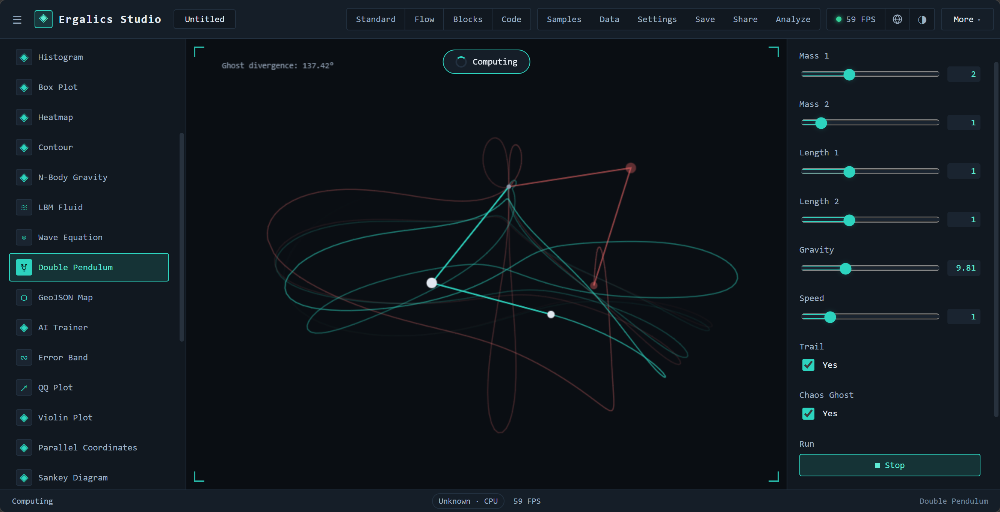

*双摆：RK4 积分，主摆与初始角仅差 0.001 rad 的"幽灵摆"并行演化，轨迹快速发散，直观展示混沌对初值的敏感依赖。*


*电磁场：在画布上拖动并释放电荷，电荷在库仑力与均匀磁场的洛伦兹力共同作用下做回旋运动。*


*光学实验：几何光学光线追踪，白光束经三棱镜折射色散，薄透镜成像焦距演示，元件均可拖动。*


*结构力学：铰接桁架实时承重，杆件按轴力着色，超载时依次断裂直至整体垮塌。*

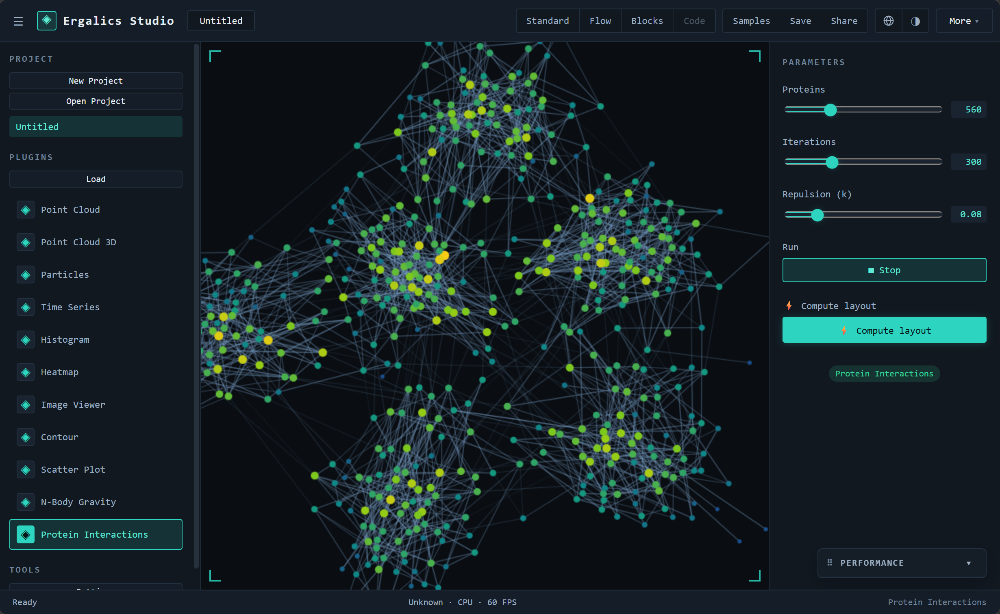

*蛋白质互作网络：560 蛋白 / ~1700 互作边的力导向布局，按度着色与定径，输出度分布与连通分量等生物学指标。*

物理仿真之外，插件库同样覆盖化学与生物学科的数据驱动演示——从分子尺度（晶胞、反应动力学）到群体尺度（酶动力学、传染病、序列比对、群体遗传学），全部以真实数据或算法渲染，并把结果送给分析叠加层与 Figure Studio：


*晶胞 · 3D 预览：加载 CIF 格式晶胞以球棍模型查看原子、周期性化学键与晶胞框，Rutile 示例含 8 个原子，并可结合有效组成与密度估算。*

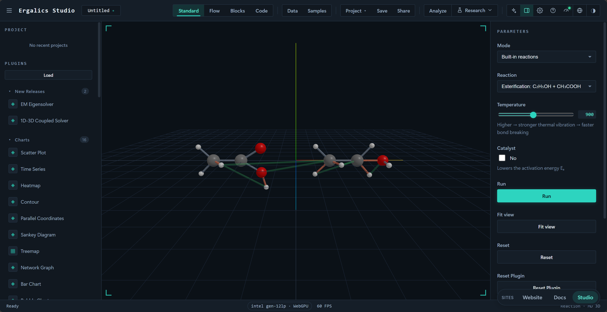

*自由反应动力学 3D：内置 NumPy / Langevin 引擎在设定温度与催化剂条件下积分真实轨迹——酯化反应（乙醇 + 乙酸）中键越过 Arrhenius 势垒断裂、自由基重组而成键，原子运动来自真实物理而非脚本动画。*

![酶动力学：Michaelis-Menten 饱和曲线 v=f([S])](../assets/screenshots/plugins/bio-enzyme/saturation.png)

*酶动力学：以 v=f([S]) 饱和曲线对照无抑制 / 竞争性 / 非竞争性 / 反竞争性四种情形，并用 Levenberg-Marquardt 从含噪初速度数据反解 Vmax、Km，输出 kcat 与催化效率。*

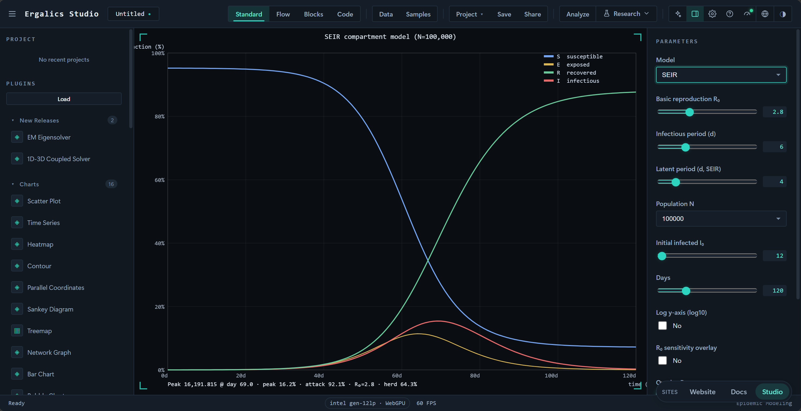

*传染病分室模型：确定性 SIR / SEIR 用经典 RK4 积分，图中 SEIR 显示 S/E/I/R 随时间演化，给出感染峰值时刻、总感染率与群体免疫阈值。*

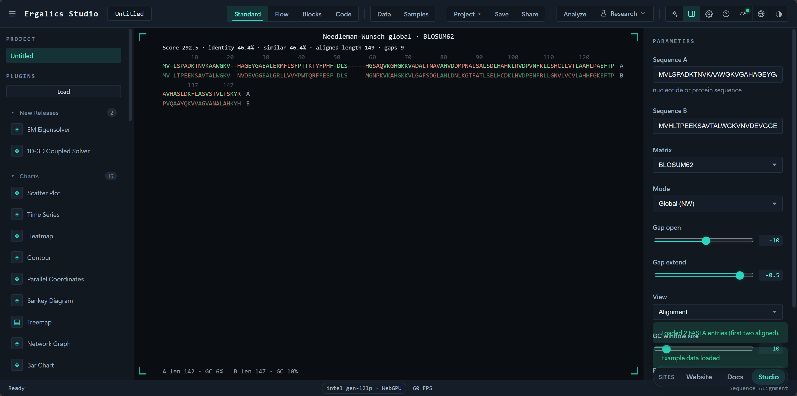

*序列比对：BLOSUM62 打分矩阵的双序列全局（NW）或局部（SW）比对与仿射空位罚分，图中给出两条蛋白序列的对齐、一致性与空位及 GC 分析。*

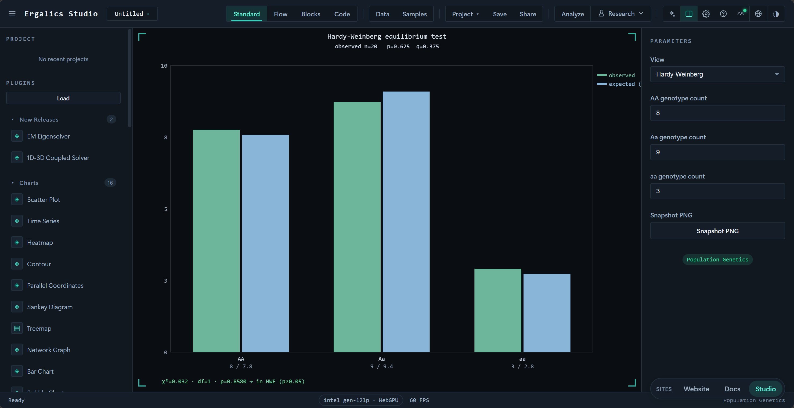

*群体遗传学 HWE 检验：输入三个基因型计数，χ² 检验观察值与 HWE 期望值之差，p ≥ 0.05 判定处于平衡。*

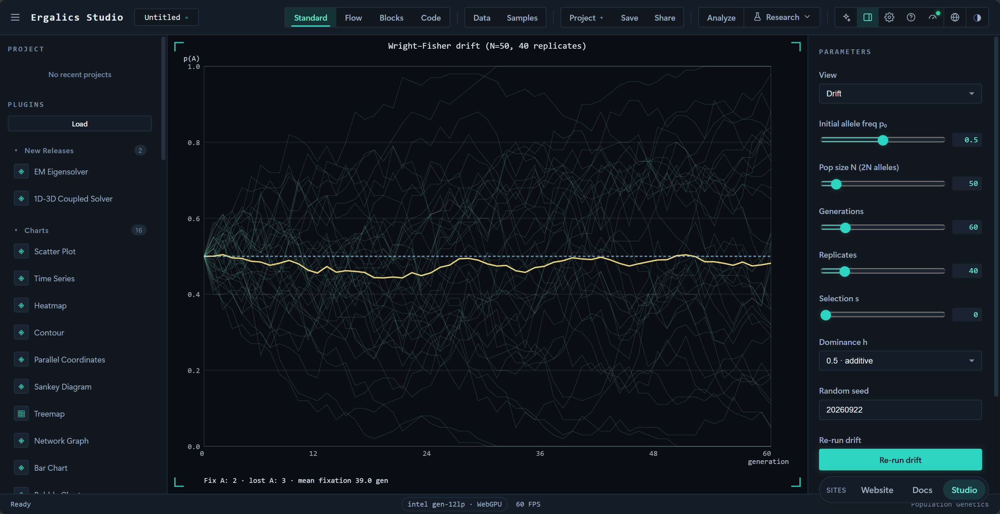

*群体遗传学遗传漂变：可复现的 Wright-Fisher 模拟，40 条轨迹展示等位基因频率的随机游走，记录固定 / 丢失次数与平均固定代数，支持可选隐性 / 加性 / 显性选择。*

#### 10.1.3 编程与计算思维教学

四种模式构成一条从"零代码"到"真代码"的渐进路径：初学者先在标准模式拖数据看图，再到流程模式理解数据流与统计概念（t 检验、方差分析、相关分析等 14 个统计区块），继而进入积木模式写出第一段带变量与循环的"程序"，最后在代码模式直接写 Python。三个脚本模式共享同一份 IR，切换模式时逻辑原样保留；仓库附带的 11 个流程示例项目、5 个积木示例与 9 个 Python 示例，构成可直接布置的练习素材库。课程模式进一步把这个闭环落在工具里：教师发布绑定学科模板的作业，学生提交带 `repro.lock` 的运行结果，教师查看学生 × 作业矩阵并批改。

#### 10.1.4 浏览器内机器学习入门

AI 训练插件基于 TensorFlow.js，支持线性回归、非线性神经网络、逻辑回归与卷积神经网络四类模型，画布上方实时绘制损失曲线，下方按模型切换散点加拟合线、二维决策边界或 MNIST 数字识别网格。训练样本内置（线性、三次加正弦、双高斯分类、200 张 MNIST 子集），TF.js 依赖在首次点击训练时才懒加载，避免拖慢启动。


*AI 训练：TF.js 四类模型（线性回归 / 神经网络 / 逻辑回归 / MNIST 卷积网络），上方实时损失曲线、下方按模型切换拟合线 / 决策边界 / MNIST 预测网格。*

#### 10.1.5 地理可视化与算法艺术

离线 GeoJSON 分级设色地图支持 Albers（中国）、Web 墨卡托与等距圆柱投影，内置中国省份示例；Mandelbrot 与 Julia 集、科赫雪花、巴恩斯利蕨、Spirograph 等 10 个趣味插件适合课堂演示与兴趣探索。


*GeoJSON 地图：离线分级设色地图，支持 Albers（中国）/ Web 墨卡托 / 等距圆柱三种投影，内置中国省份示例。*

离线地图之外，地理套件还覆盖人口结构、空间插值、投影变形分析、距离与面积量算、地形与轨迹等计算地理能力：

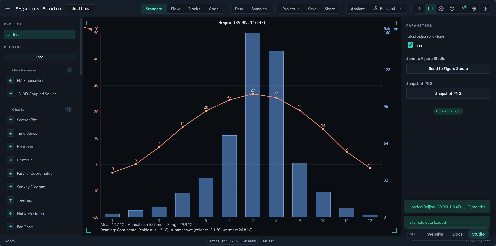

*气候直方图：以气温折线（左轴）+ 降水柱状（右轴）双轴绘制月度气候图，图上北京自动汇总年均温 12.7 ℃、年降水 527 mm、年较差 29.9 ℃并判读气候类型。*

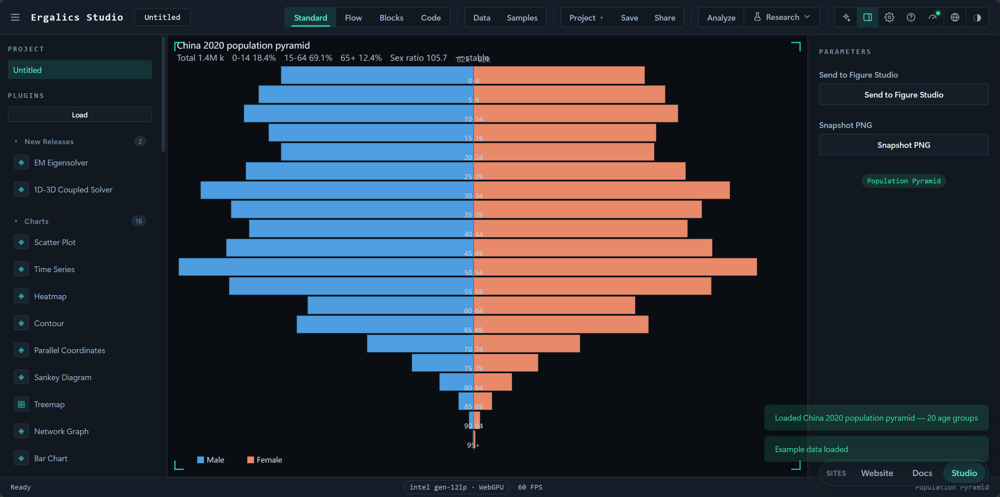

*人口金字塔：背靠背年龄性别分组（左男右女），自动计算 0-14 / 15-64 / 65+ 占比、性别比（105.7）并判读增长型 / 稳定型 / 缩减型结构。*


*空间插值：将离散站点观测值网格化——图中 IDW（p=2）对 31 站点生成热力面与等值线，附 LOOCV 交叉验证 RMSE / MAE 与 Moran's I 空间自相关检验。*

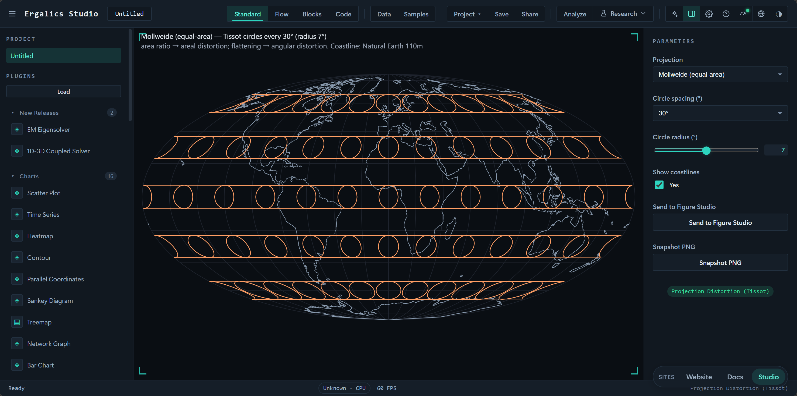

*投影变形（Tissot 圆）：在七种投影下绘制世界海岸线与 Tissot 变形圆，圆面积比表征面积变形、扁率表征角度（形状）变形。*

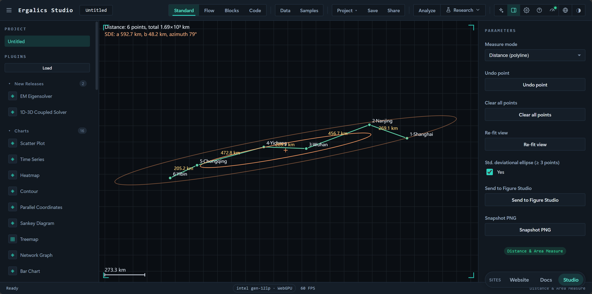

*距离与面积量算：画布点选加点后逐段给出大圆距离与累计里程，对 ≥3 点还可计算标准差椭圆（SDE a / b 半轴与方位角）与围合面积。*

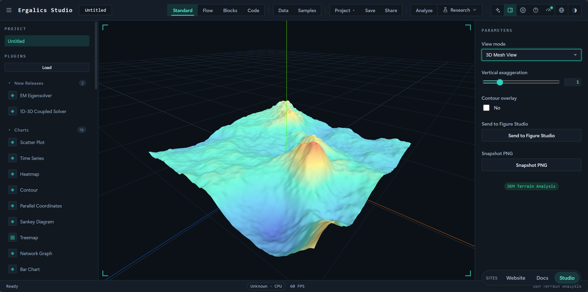

*DEM 地形分析（3D Mesh 视图）：解析 ESRI ASCII Grid 高程数据，三维曲面按高程设色、垂直夸张系数可调，并可叠加等高线。*


*DEM 地形分析（坡度视图）：按 Horn 法计算坡度（0-72°）并叠加等高线，另一模式给出山体阴影，用于提取地形坡度与坡向。*

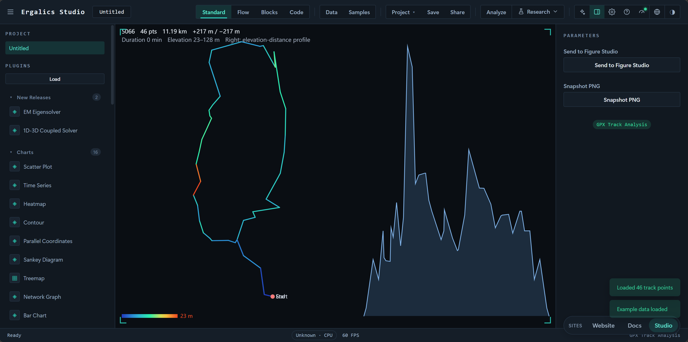

*GPX 轨迹分析：解析 GPX 轨迹点，左图按海拔着色显示路径，右图绘制海拔-距离剖面，并统计总里程与累计爬升 / 下降。*


*交互地球仪（3D）：可拖拽旋转、滚轮缩放的真三维地球仪，Natural Earth 110m 海岸线贴于球面，叠加球面 Tissot 变形圆并支持自动自转。*

#### 10.1.6 研究交付与协作

面向"要把结果交出去"的场景：数据清洗向导把脏数据变成可用表格；实验记录台账汇总每一次运行的参数与指标；数据血缘图说明某个产物是由哪些文件、哪些步骤生成的；图表工作台按期刊模板拼出多面板组图；报告生成器把叙述、图与表打包成单一自包含 HTML；可复现锁锁定环境与数据指纹；补充材料打包把数据、代码与许可压成一个 ZIP。一条链路走完，结论不再只是截图。

## 第十一章 创新点

### 11.1 创新点

**四模式同源架构。** 市面上的工具要么只做拖拽可视化，要么只做代码编辑。Ergalics Studio 用一份共享 IR 打通积木、流程与代码三种范式，并配备三模式往返互转的专门单元测试；代码模式的缓冲区内容还能解析回 IR，使"换一种表达方式理解同一逻辑"成为一键操作。对教学而言，这意味着同一条管线可以用三种难度梯度反复讲解。

**零安装的全栈科学计算环境。** CPython（Pyodide Worker）、Rust/WASM 原生核心、WebGPU 计算与 IndexedDB / OPFS 持久化全部运行在浏览器内，数据不出本机，同时保持接近桌面软件的体验。这不仅是部署便利，更改变了"教学机房的软件审批、学生自带电脑的环境差异"这类现实约束的性质。

**真实 GPU 计算加优雅降级。** 计算管线不是演示性质的：从 Rust 核心暴露的缓冲区与内核抽象，到 13 个真实 WGSL 内核（含 D2Q9 流体、N-Body、波动方程、FFT、K-means），再到端到端测试中 GPU 与 CPU 结果的数值一致性校验（误差约 2×10⁻⁶），每一层都可用、可测；数据规模低于阈值或 WebGPU 缺失时自动回退 CPU，行为一致，且引擎选择被记入运行记录。

**严格数据驱动的仿真插件。** 所有仿真插件初始为空，重置只重放已加载数据，杜绝"伪造默认场景"。这一约束保证了演示与真实数据的统一性，也倒逼插件把物理参数做成可调项，而不是把结论画死在界面里。

**沙箱与签名两条正交防线。** 第三方插件默认运行于 Web Worker，通过类型化 RPC 访问宿主，画布渲染经 OffscreenCanvas 转移完成；`.cspkg` 包在加载时进行清单校验（必填字段、id 格式、入口路径穿越防护、沙箱枚举），并支持 Ed25519 签名与信任注册表（纯 TypeScript 自实现，不依赖 WebCrypto）。沙箱约束"能做什么"，签名回答"是谁发布的"——一把钥匙丢了不会连带废掉另一把锁。

**从"能算"到"能交付"。** 运行记录、数据血缘、可复现锁、报告生成与补充材料打包构成一条完整的交付链：一次分析不光产出图表，还产出可核查的溯源信息与可原样重跑的材料包。这是把"科学计算"与"数据可视化"区分开的关键能力。

**工程化质量。** 123 个测试文件、2233 个单元测试构成回归网，13 套端到端套件在真实浏览器中校验像素与零控制台错误，5 条 CI 工作流分别把守单元测试与类型、性能基线、依赖安全与 SBOM、发版归档（Zenodo DOI）与文档站部署；性能与体积用基线对比而非拍定阈值，且基线按运行环境分文件，避免共享 Runner 上的噪声被当成性能回归。

## 附录 文档索引

| 文档 | 内容 |
| --- | --- |
| 01-产品介绍 | 项目背景、设计目标、技术架构概述、功能全景、应用场景与创新点（产品视角） |
| 02-系统架构 | 分层架构、路由与页面组织、启动时序、状态管理、渲染管线、目录结构与依赖规则 |
| 03-插件系统 | 插件契约、59 个内置插件明细、市场目录与两级加载、cspkg 沙箱与 Ed25519 签名、文件路由 |
| 04-四大工作模式 | 标准、流程、积木、代码四种模式的设计与三模式互转（共享 IR） |
| 05-科研工具集 | 19 个科研工具的统一注册表、五个分组与逐项职责、入口导航与工具间流转 |
| 06-GPU计算与原生核心 | Rust/WASM 原生核心、WebGPU 计算管线、13 个可复用 WGSL 内核与 CPU 回退 |
| 07-科学计算子系统 | 统计内核、科研二进制 I/O、出版级绘图与组图、可复现性、不确定度、建模与推断等 33 个子系统 |
| 08-测试与质量保障 | 单元测试、端到端测试、性能基准与体积预算、五条 CI 工作流与工程脚本 |
| 电磁谐振特征值求解器（独立专题） | 稀疏厄密特征值求解：Lanczos / LOBPCG / Jacobi-Davidson 内核、MINRES 位移反演、真实残差认证、3D 模式场、Pyodide Worker 运行时 |
| 流体双向耦合求解器（独立专题） | 1D 管网-3D 场双向耦合：多速率时间步协调、粗-细子循环、正反向边界耦合、毫秒级阀门控制、守恒性与精度-效率权衡 |
| Ergalics Studio（本文） | 完整技术总结：由本目录各分篇与独立专题汇编而成，含目录导航、正文与本文档索引 |
| docs/guide（VitePress 站点） | 面向使用者的在线文档：导言、架构、各模式指南、测试、路线图、插件等 |

本文与上述文档随仓库代码一同演进：代码、配置或测试发生变化时，请一并核对与更新对应章节中的数字与描述。
