# Ergalics Studio

> **文档说明**：本文是 Ergalics Studio 的完整技术总结，整合自 docs/technical 目录七篇技术文档（产品介绍、系统架构、插件系统、四大工作模式、GPU 计算与原生核心、科学计算子系统、测试与质量保障）与仓库自述文件的全部内容，按统一结构重组而成。全部内容基于仓库真实代码、配置与测试编写；数字基线为 40 个内置插件、37 个流程区块、46 个测试文件、417 个单元测试与 10 套端到端套件。

## 第一章 项目概览

### 1.1 项目是什么

Ergalics Studio 是一款完全运行于浏览器中的专业科学计算工作站。它把交互式数据探索、GPU 计算调度、沙箱化插件系统与四种面向不同用户的工作模式整合进同一个网页应用：无需安装任何本地软件，打开网页即可使用；数据保存在浏览器本地（IndexedDB），不出本机；项目可以保存为 .clproj 文件或分享链接，随取随用。

它带来的，是一条从"零代码"到"真代码"的完整科学计算路径：拖入一个 CSV 文件立即看到图表，用 37 个内置区块搭出可视化数据流管线，用类 Scratch 积木写出第一段程序，最终在 Monaco 编辑器里编写由真实 CPython 运行时（Pyodide）执行的 Python 代码。四种模式共享同一份数据语义与渲染后端，切换模式时逻辑原样保留。

它适合谁：想快速看图的研究人员、刚开始学习数据分析的学生、讲授编程与计算思维的老师，以及需要一个"零安装、可离线、可扩展"科学计算环境的任何人。

### 1.2 科学计算工具链的三重门槛

**安装与环境门槛高。** 传统桌面软件（如 MATLAB、Origin）体积庞大、授权昂贵，一台新电脑从安装到能用往往要以小时计；Python 生态虽然免费开放，但要让初学者独立配好解释器、虚拟环境、数值库与绘图库，仍然是一件容易劝退的事。环境问题消耗的是本应投入在数据与问题本身上的注意力。

**教学路径存在断层。** 从积木式编程过渡到真实代码，中间缺少一款能把"拖拽数据、搭建流程、编写代码"统一在同一界面里的工具。学生在一个工具里学会拖积木，换到另一个工具里面对黑漆漆的终端，两次学习之间没有衔接，已建立的直觉难以迁移。

**数据安全与离线可用。** 科研与教学数据常涉及隐私或涉密，上传云端在很多场景下不可接受。纯浏览器方案天然做到数据不出本机，同时保留接近桌面软件的交互体验；配合浏览器对 WebGPU、WebAssembly 与 Web Worker 的支持，"重计算发生在网页里"已经从口号变成了现实。

Ergalics Studio 的回答是：把整个工作台，包括 Python 运行时、GPU 计算与插件生态，全部搬进浏览器标签页，做到"打开网页即用、关掉即走、数据不出本机"。

### 1.3 五条设计目标

1. **零安装，打开即用。** 全部能力随网页交付，标准模式下把数据文件拖进窗口就能看到可视化结果。
2. **数据不出本机。** 项目与数据存储在浏览器 IndexedDB 中，可导出为 .clproj 文件离线流转，不存在云端副本。
3. **一条学习曲线走到底。** 四种模式面向同一份项目数据，从看到图、到搭流程、到拼积木、到写代码，能力渐进而不换工具。
4. **计算必须是真计算。** GPU 内核是真实的 WGSL 计算着色器，Python 是真正的 CPython，原生核心由 Rust 编译为 WebAssembly；每一个内核都有对应的单元测试与端到端数值一致性校验。
5. **开放可扩展。** 插件契约清晰、市场目录内建、第三方插件默认运行在 Worker 沙箱中，配合完整的开源代码与持续集成，生态可以安全地生长。

### 1.4 四类用户，四种模式

| 模式 | 面向人群 | 核心体验 |
| --- | --- | --- |
| 标准（Standard） | 只想快速看图的人 | 拖入数据文件，自动识别格式并路由到匹配插件，即刻看到可视化 |
| 流程（Flow） | 数据分析初学者 | 用 37 个内置区块搭出可视化数据流管线，拓扑排序执行，逐节点查看输出 |
| 积木（Block） | 编程启蒙与教学 | 类 Scratch 积木编辑器，唯一入口是绿色"运行时"帽子区块，33 种积木完全可脚本化 |
| 代码（Code） | 真实脚本用户 | Monaco Python 编辑器，由 Pyodide Web Worker 提供真正的 CPython 运行时，带 REPL 控制台与变量面板 |

四种模式的完整功能与实现细节见第三章；三者共享的架构基础见第二章。

### 1.5 现状基线与发展路线

项目处于积极开发中，核心闭环已端到端可用并有测试覆盖。当前基线：

- **40 个内置插件**：30 个核心/科学插件随启动自动加载，10 个趣味/工具插件按需加载。
- **四种工作模式**全部可用；积木、流程、代码三种模式经由共享 IR 双向互转。
- **37 个流程区块**覆盖数据源、变换、过滤、数学、统计、绘图与可视化七类。
- **WebGPU 实时计算**覆盖粒子、N-Body 引力、格子 Boltzmann 流体、波动方程、直方图、热力图、点云等内核，均带 CPU 回退。
- **统计内核、科研二进制 I/O、出版级绘图导出、可复现性内核**四个纯 TypeScript 科学计算子系统已落地。
- **质量保障**：46 个测试文件、417 个单元测试全部通过；10 套 Playwright 端到端套件驱动真实浏览器（无头 Edge）验证；GitHub Actions 持续集成。

发展路线（摘自仓库路线图，已完成条目以对勾标记）：

- [x] 工作台布局、项目管理、文件路由
- [x] 40 个内置插件（30 核心 + 10 趣味/工具）、cspkg 加载、Worker 沙箱
- [x] 插件市场目录（精选标签 / 流行度 / 分类筛选，按需加载）
- [x] WebGPU 设备管理与真实计算内核管线，全部示例插件的 GPU 加速（直方图/热力图/点云）
- [x] i18n、主题、性能监控、分享链接
- [x] 流程模式：编译器 + 增量执行器 + 37 个内置区块 + 画布 UI + 示例管线
- [x] 积木模式：类 Scratch 编辑器、30 余种积木、懒加载的 Blockly 13 与 5 个示例程序
- [x] 代码模式：经 Pyodide 的 Python、可导入 studio 模块、REPL 与变量面板、9 个示例程序
- [x] 三模式互转：共享 IR 双向往返，由 sync-threeway 单元测试兜底
- [x] 统计分析子系统、科研二进制数据导入、出版级绘图引擎与可复现性内核
- [x] Vitest 单元测试、Playwright 端到端套件与 GitHub Actions 持续集成
- [ ] 插件市场：包签名与第三方安装管线
- [ ] 代码模式：R 运行时（webR）

## 第二章 系统架构

本章从工程视角描述 Ergalics Studio 的分层结构、启动时序、状态管理、渲染管线、目录约定与依赖规则。

### 2.1 总体分层

整个应用是单页应用（Vite 6 构建，React 18 加 TypeScript 5.7 严格模式），自上而下分为四层，低层从不反向导入高层：

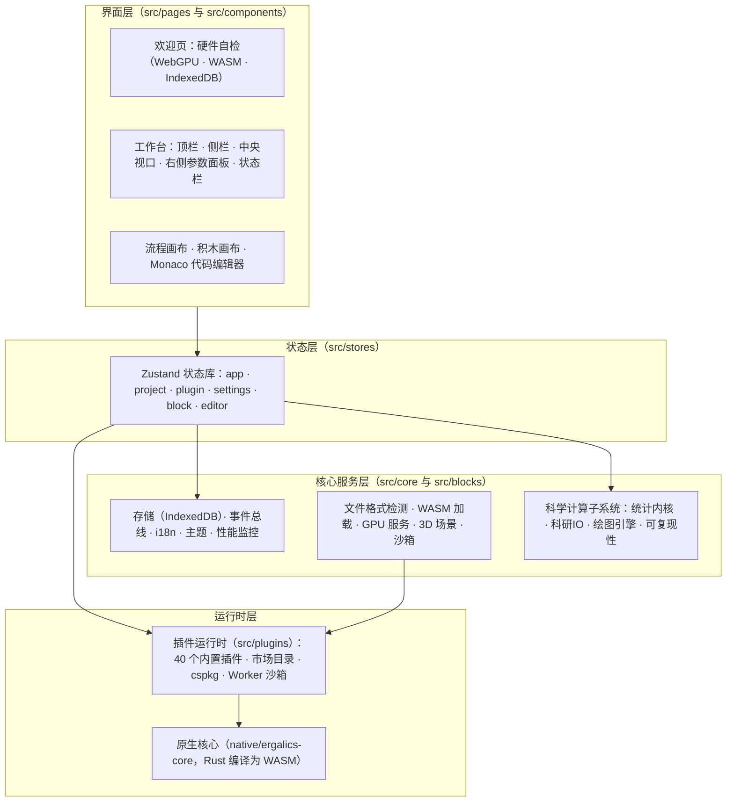

各层职责与技术选型：

| 层 | 职责 | 主要技术 |
| --- | --- | --- |
| 界面层 | 路由、工作台四区布局、三种模式编辑器、对话框与引导 | React 18、react-router-dom 7 |
| 状态层 | 六个领域状态库与跨界面事件 | Zustand 5 |
| 核心服务层 | 横切服务与科学计算子系统 | 纯 TypeScript，IndexedDB、Web Workers |
| 运行时层 | 插件注册与生命周期、沙箱执行、原生加速 | fflate（ZIP）、lz-string（压缩）、Rust 与 wasm-bindgen 0.2 |

各层职责要点：

- **React 界面层**（src/pages 与 src/components）：欢迎页、工作台四区布局、流程画布、积木画布与 Monaco 代码编辑器。界面组件只与状态库和插件契约打交道，不含业务算法。
- **状态层**（src/stores）：六个 Zustand 库分别管理应用壳、项目、插件、设置、区块系统与编辑器状态，互相之间通过事件总线协作而非直接引用。
- **核心服务层**（src/core）：存储（IndexedDB 封装）、事件总线、国际化（中英双语）、主题、性能上报、文件格式检测、3D 场景管理、沙箱与 cspkg 加载等横切能力，以及四个科学计算子系统。
- **插件运行时**（src/plugins）：内置插件的注册表与生命周期、市场目录、cspkg 包加载器与 Worker 沙箱。
- **原生核心**（native 目录，Rust）：编译为 WebAssembly 后向 JavaScript 暴露设备管理、缓冲区与计算内核抽象，并承担文件类型魔数检测。
- **浏览器底座**：WebGPU、Web Workers、IndexedDB、OffscreenCanvas 与 Three.js，是所有能力最终落地的平台。

### 2.2 贯穿架构的三条设计主线

**宿主与插件之间只有一个契约。** 每个插件实现统一的 Plugin 接口（初始化、激活、渲染、参数读写、数据加载、3D 场景渲染等），并从宿主获得一个 PluginApi 句柄用于本地化、状态上报、性能上报、通知与文件访问。第三方插件的入口代码默认运行在 Web Worker 沙箱中，仅通过类型化 RPC 协议与宿主通信，画布渲染经 OffscreenCanvas 转移完成；.cspkg 包在加载时进行清单校验（id 格式、入口路径穿越防护、沙箱枚举）。

**一条渲染管线服务全部模式。** 无论是流程模式的可视化区块、积木模式解释器调用的 studio.plot，还是代码模式 Python 里的 studio.plot 调用，最终都汇入同一个渲染桥接，落到同一个散点图、直方图插件上。2D 插件共享同一个 canvas 视口；3D 插件按需懒创建宿主管理的 Three.js 场景，并在 2D 插件激活时自动隐藏，保证两种视口互不渗透。

**GPU 计算双引擎。** Rust 核心编译为 WebAssembly，向 JavaScript 暴露设备管理、缓冲区与计算内核的完整抽象；当 WASM 模块不可用时，宿主侧服务自动改走原生 WebGPU API；两者皆不可用时插件回退到 CPU 实现，行为一致。端到端测试会对 GPU 与 CPU 的计算结果做数值一致性校验（误差约 2 乘以 10 的负 6 次方）。

### 2.3 启动时序

应用启动遵循"先自检、再加载、后恢复"的固定顺序，任何一步的环境缺失都会如实报告而不是静默降级：

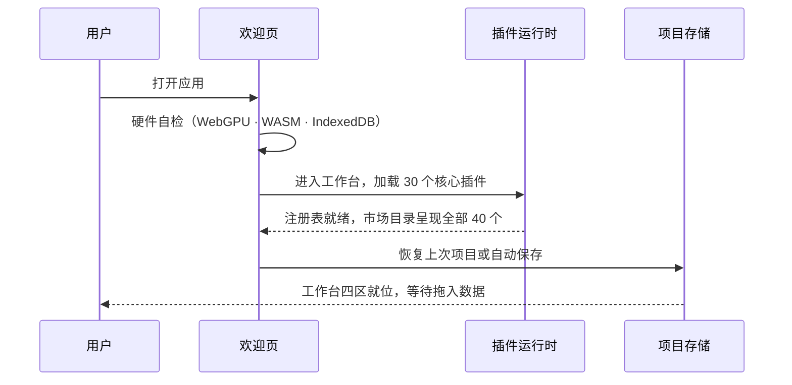

欢迎页的自检结果同时决定后续行为的"档位"：WebGPU 可用则计算走 GPU 加速，WASM 模块存在则走 Rust 参考引擎，两者皆缺时插件以 CPU 完成同样的数学（详见第五章）。

### 2.4 状态管理

六个 Zustand 状态库承载全部应用状态，跨界的 UI 通信走一个小型类型化事件总线（src/core/events.ts），例如插件参数变化、宿主文件选择对话框等事件。状态库之间通过事件总线协作而非直接引用，避免环状依赖。

| 状态库 | 职责 |
| --- | --- |
| appStore | 宿主状态、横幅与通知、性能指标、面板开关 |
| projectStore | 当前项目、最近列表、保存与自动保存、分享、参数持久化 |
| pluginStore | 插件注册表、加载与激活生命周期、文件分发、宿主容器、内置插件加载失败重试 |
| settingsStore | GPU 模式、自动保存间隔、语言等偏好，语言以 i18n 模块为唯一权威源并双向订阅 |
| blockStore | 流程模式图状态、运行编排、节点输出缓存、运行取消 |
| editorStore | 积木与代码模式的会话（IR、代码文本、变量、控制台），载入时逐字段净化 |

项目生命周期：创建、打开、保存、自动保存与分享。项目格式为 .clproj，内容经 lz-string 压缩后存入 IndexedDB；整个流程模式图、积木程序与代码会话都持久化进项目文件，重新打开时完整恢复。分享链接由随机 UUID 标识，载荷在解析端做大小与结构双重校验，拒绝畸形数据。

### 2.5 渲染管线

中央视口拥有三个绘图表面，宿主集中管理其可见性：

1. **共享 2D canvas**：所有 2D 插件（散点、折线、直方图、热力图、等值线、箱线、小提琴、桑基等 30 余个）画在同一个画布上，由统一的 2D 视口抽象（viewport2d）提供快照式访问。
2. **DOM 容器**：供需要 DOM 元素的插件使用，也是沙箱插件经 OffscreenCanvas 转移后挂载画布的位置。
3. **宿主管理的 Three.js 3D 场景**：只有声明了 renderToScene 能力的插件激活时才按需创建，并配套轨道控制、灯光网格与尺寸自适应。

可见性判定流程：

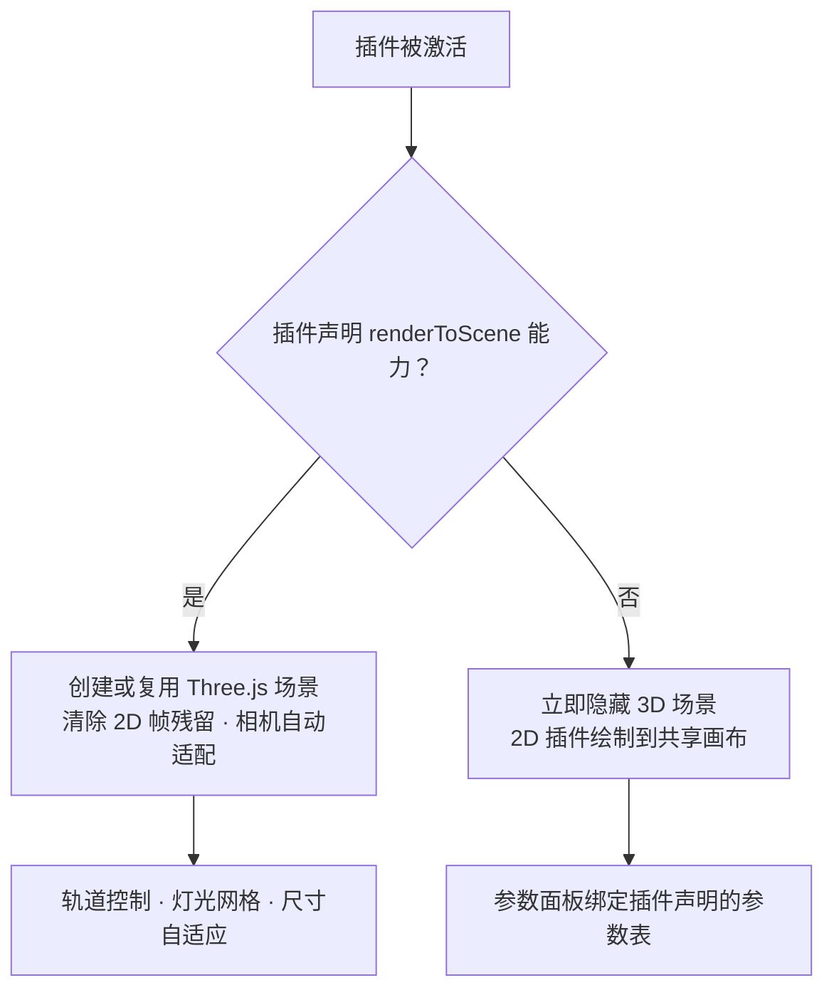

这保证 3D 坐标系永远不会渗透进 2D 视图，反之亦然；端到端测试对两种视口的互斥有专门断言。

### 2.6 目录结构

| 位置 | 内容 |
| --- | --- |
| src/core | 核心服务单文件：storage、events、i18n、settings、perf、gpu、compute、wasm、fileFormat、scene3d、viewport2d、sandbox、plugin-worker、cspkg、dataFiles、download、logger、pluginCache、exampleAssets、examples、wgsl，以及四个子系统目录 stats、io、plot、repro |
| src/blocks | 流程模式区块系统：类型、注册表、编译器、执行器、ops 与 datatable 运算、区块目录（catalog，37 个区块）、本地化、渲染桥接（render.ts） |
| src/editor | 积木与代码模式：ir（types、validate、hash、serialize）、flow 与 block 的互转、block（Blockly 引擎、积木定义、工具箱、主题、示例）、code（解析与示例）、codegen（JS、Python、R 三个生成器）、runtime（解释器与 Studio API） |
| src/components | 流程模式画布组件与积木、代码模式的编辑器面板组件、反馈与错误边界 |
| src/pages | 欢迎、工作台、设置、分享页与各类对话框 |
| src/plugins | 内置插件（builtin，40 个）与市场目录（marketplace.ts） |
| src/stores | Zustand 状态库（六个） |
| src/types | 插件、项目与编辑器契约类型 |
| src/native | 构建生成的 WASM 绑定（不入库） |
| native/ergalics-core | Rust 原生核心（device、buffer、compute、utils） |
| examples | 示例数据（data）、示例项目（projects，11 个 .clproj）、代码模式 Python 示例（code，9 个程序） |
| scripts | WASM 构建、示例数据生成与 10 套端到端测试脚本 |
| tests | Vitest 单元测试（46 个文件、417 个用例） |
| docs | VitePress 文档站与本技术文档目录（technical） |

### 2.7 依赖规则与分包策略

- 界面层依赖状态层，状态层依赖核心服务层，核心服务层绝不导入界面层。
- 核心服务保持"少 DOM"：纯函数服务（i18n、文件格式、统计、绘图、存储适配器）全部可在 Node 环境单元测试。
- 插件契约（src/types/plugin.ts）是宿主与第三方代码之间唯一的共享词汇表；渲染桥接（src/blocks/render.ts）是区块系统唯一带副作用的模块，负责把可视化输出送进插件渲染器，使编译器与执行器保持可测。
- 重依赖全部懒加载分包：Blockly（约 828 KB）在首次进入积木模式时才拉取，TensorFlow.js 在首次点击训练时才拉取，Pyodide 运行时在首次运行 Python 时才引导；标准与流程模式的首屏不受影响。
- 错误边界按区域隔离（顶栏、状态栏独立包裹），边界重置通过递增 key 实现有界重试，避免错误死循环。

### 2.8 可观测性与基础能力

- **性能监控**（perf）：帧时间与 GPU 时间聚合，超阈值时经通知系统提示用户而非静默卡顿；状态栏常驻显示 GPU 可用性、当前引擎与性能指标，用户随时知道"现在是谁在算"。
- **运行日志**（logger 加 download）：会话事件序列可导出为文件，用于问题反馈与回归定位。
- **国际化与主题**：i18n 覆盖中英双语并支持响应式语言切换；明暗主题经 CSS 变量实现，全应用统一换肤。
- **反馈体系**：错误边界、回退方案与横幅/通知系统按严重级别分级呈现。

## 第三章 四大工作模式

Ergalics Studio 的工作台提供四种模式，由顶栏切换：标准（Standard）、流程（Flow）、积木（Blocks）、代码（Code）。四种模式共享同一套数据语义（DataTable）、同一套插件渲染器，后三种模式更共享同一份中间表示（IR）。切换模式时项目数据、插件状态与参数面板原样保留，上下文零损耗。

### 3.1 标准模式

默认落地体验。工作台为四区布局：顶栏（项目与模式切换）、左侧栏（项目树与插件列表）、中央视口（激活插件渲染，首次启动为拖放区）、右侧参数面板（把激活插件声明的参数转成响应式表单），状态栏常驻显示 GPU 可用性与性能指标。文件拖入后由宿主按魔数与扩展名路由，多插件匹配时弹选择框。

适合"我已经知道哪个插件能回答我的问题，只想把文件指给它"的场景。

### 3.2 流程模式（Flow）

可视化数据流管线编辑器。左侧调色板、中间画布（节点加边）、右侧参数编辑器、底部结果预览。整个图持久化进项目的 blockGraph 字段，重新打开自动恢复，并共享 .clproj 的自动保存与分享管线。

#### 3.2.1 区块目录（37 个内置区块）

| 类别 | 数量 | 区块 |
| --- | --- | --- |
| 数据源 | 4 | 内置示例数据、随机数生成、网格生成、文件加载 |
| 过滤 | 3 | 数值范围过滤、条件值过滤、Top-K 选取 |
| 数学 | 6 | 加、减、乘、除（列对列或列对标量）、平方根、绝对值 |
| 变换 | 5 | 列选取、列重命名、新增列、归一化、排序 |
| 统计 | 11 | 摘要统计、直方图分箱、单样本 t 检验、双样本 t 检验、配对 t 检验、单因素方差分析、Mann-Whitney U 检验、卡方独立性检验、相关分析、Cohen's d 效应量、多重比较校正 |
| 绘图 | 4 | 折线、散点、直方图、柱状（出版级绘图引擎渲染） |
| 可视化 | 4 | 散点、折线、直方图、二维点云（经渲染桥接走插件出图） |

统计区块直接调用 src/core/stats 统计内核的纯函数实现（详见第六章）；区块元数据（名称、描述）内建中英双语，新增语言仅为数据修改。

#### 3.2.2 编译器与执行器

编译器是一个纯函数：结构校验（端口匹配、必需输入、类型兼容）、环检测、Kahn 式拓扑排序，错误以结构化诊断返回，画布据此绘制红色边与内联诊断条，全程不抛异常。

执行器带节点级增量缓存与脏值传播失效：修改单个区块的参数，只有它及其下游会重新执行。运行支持取消与并发去重——重复触发运行不会产生并行执行，取消会真正终止进行中的计算节点。

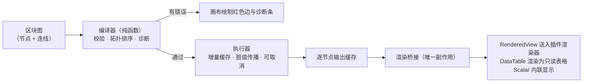

#### 3.2.3 结果预览与示例管线

底部预览随所选节点输出类型自适应：可视化输出走既有插件渲染器；统计输出渲染为只读表格；标量内联显示。管线有多个输出时由芯片切换器选择检视节点。响应式参数编辑器绑定到所选节点，与画布双向联动——节点卡片显示实时的"键: 值"摘要，使用户始终能看到画布实际在运行什么。

11 个示例项目以真实 .clproj 文件存放在 examples/projects，构建期经 import.meta.glob 自动发现，新增示例只需放入文件并在元数据表登记：

| 示例 | 主题 |
| --- | --- |
| block-01-signal-analysis | 信号分析 |
| block-02-random-distribution | 随机分布 |
| block-03-grid-scatter | 网格散点 |
| block-04-range-filter | 范围过滤 |
| block-05-dual-pipeline | 双管线对比 |
| block-06-topk-pipeline | Top-K 选取 |
| block-07-binning-stats | 分箱统计 |
| block-08-normalize-grid | 归一化网格 |
| crystal-lattice-demo | 晶格演示 |
| particles-demo | 粒子演示 |
| point-cloud-demo | 点云演示 |

### 3.3 积木模式（Blocks）

类 Scratch 的积木编辑器，面向学习者与想要命令式体验的用户。唯一执行入口是绿色"运行时"帽子区块，帽子下方未连接的孤立区块永不运行，从根本上杜绝"误执行破损代码"。33 种内置积木按九个类别组织：

| 类别 | 积木 |
| --- | --- |
| 开始 | 运行时帽子区块（唯一入口） |
| 数据 | 载入 CSV、载入 XYZ、随机数、范围、列表 |
| 变量 | 赋值与读取 |
| 运算符 | 算术、比较、逻辑、一元 |
| 变换 | 归一化、排序、列选取、过滤 |
| 统计 | 摘要、直方图 |
| 绘图 | 散点、折线、直方图、点云 |
| 控制流 | 如果、重复、当循环、遍历 |
| 工具 | 打印、原始文本 |

技术要点：

- Blockly 13 驱动画布，包为懒加载分包（约 828 KB），不影响标准与流程模式首屏。
- 区块名称、提示、下拉选项与工具箱类别经 Blockly 的 BKY 键系统本地化，切换语言时以重新标注的积木重建工作区，有专门单元测试验证。
- 运行按钮提供实时结果预览、变量面板与控制台面板三张卡片。
- 5 个内置示例程序（星系散点、遥测折线、随机直方图、归一化散点、循环打印）经顶栏"示例"对话框加载。
- 积木图编译为共享 IR 后由内置解释器执行，解释器调用与代码模式相同的 Studio API。
- IR 到 JS 与 Python 的代码生成器从 IR 产出可运行代码，工具栏的"Python"与"JS"切换可显示当前工作区的实时生成结果。

### 3.4 代码模式（Code）

真正的 Python 编辑器。Monaco 编辑器提供 Python 语法高亮、明暗主题、自动换行与 studio 接口自动补全；运行时是 Pyodide Web Worker 中的真实 CPython。

studio 模块作为正经的可导入模块注入（注册进 sys.modules），项目数据文件以 _FILES 形式送入 Worker，因此 studio.load 可以同步解析文件。studio 接口与积木模式完全一致：

| 方法 | 说明 |
| --- | --- |
| load | 装载项目数据文件为表格 |
| random / range | 生成随机数与整数序列 |
| normalize / sort / select / addColumn / filter | 表格变换 |
| summary / histogram | 摘要统计与分箱 |
| plot | 绘图（经渲染桥接走插件渲染器） |
| print / notify | 控制台输出与通知 |
| getParam / setParam | 项目参数读写 |

其他能力：

- **REPL**：控制台输入可求值单个表达式或语句，无需重跑整个程序。
- **中断**：停止运行会终止并重启 Worker，失控循环不会卡死页面；Worker 的引导地址与引导 Promise 做了记忆化，重启不重复初始化。
- **9 个示例程序**位于 examples/code（EDA 管线、蒙特卡洛估圆、信号平滑、遥测探索、星系散点、随机直方图、范围循环、添加列绘图、归一化过滤），经"示例"对话框加载。

### 3.5 三模式互转（共享 IR）

IR（src/editor/ir，含校验、哈希与序列化）是积木、流程、代码三种模式的唯一事实来源，各模式与 IR 之间都有纯函数往返转换：

| 转换 | 模块 |
| --- | --- |
| IR 与流程 DAG 互转 | src/editor/flow/convert.ts（irToFlow、flowToIR） |
| Blockly JSON 与 IR 互转 | src/editor/block/convert.ts |
| 代码缓冲区解析回 IR | src/editor/code/parse.ts（无法解析的行保留为原始代码节点） |
| IR 生成代码 | src/editor/codegen（JS、Python、R 三个生成器） |
| IR 直接解释执行 | src/editor/runtime/interpreter.ts（调用与流程区块相同的 Studio API） |

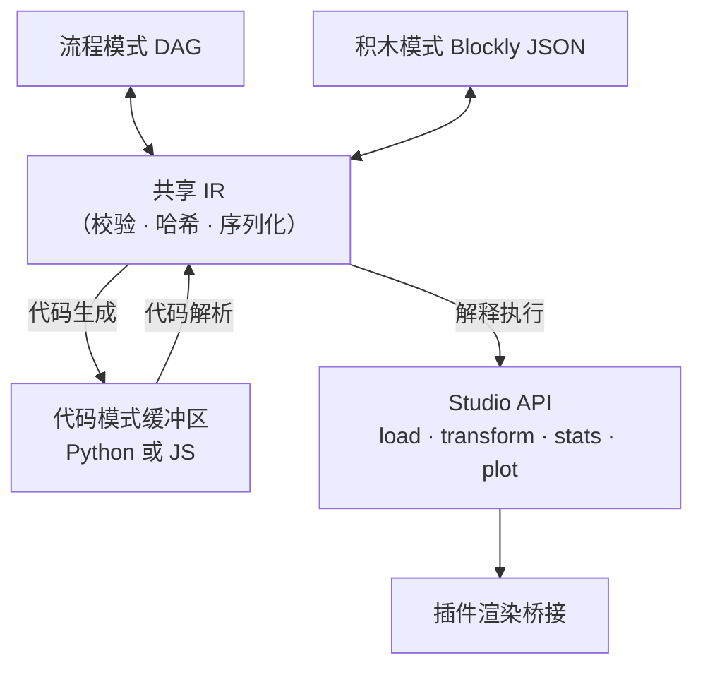

在流程模式搭一条管线，切到积木就能看到同样的逻辑以积木呈现，跳到代码就能看到生成的 Python；反向亦然。一个专门的 sync-threeway 单元测试为双向往返兜底。

代码生成器按目标语言处理方言差异：Python 生成器输出真实的 Python 语法，R 生成器处理 R 的语法习惯（循环写法、真值字面量、整除与逻辑运算符等），JS 生成器输出可直接求值的脚本。代码模式编辑的缓冲区内容还能反向解析回 IR，使"换一种表达方式理解同一逻辑"成为一键操作。

## 第四章 插件系统

Ergalics Studio 把"一切可视化皆插件"作为第一性设计。宿主与插件之间只有一个契约，第三方扩展与内置插件走同一套接口与生命周期。当前共有 40 个内置插件：30 个核心/科学插件在启动时自动加载，10 个趣味与工具插件声明为按需加载。

### 4.1 宿主与插件的契约

每个插件实现统一的 Plugin 接口，主要方法包括：

| 方法 | 作用 |
| --- | --- |
| init / destroy | 初始化与销毁，宿主负责 GPU 安全的资源回收 |
| activate / deactivate | 激活与去激活，驱动 2D/3D 视口切换与残留帧清理 |
| render / updateParams | 绘制与参数更新（右侧面板响应式表单） |
| getParams / compute | 参数读取与计算 |
| loadData | 接收宿主分发的数据（文件路由与渲染桥接的入口） |
| renderToScene | 可选能力声明，激活时获得宿主 Three.js 场景句柄 |

宿主向插件提供 PluginApi 句柄，能力面如下：

| 能力组 | 内容 |
| --- | --- |
| 本地化 | 插件文案按当前语言取值，语言切换时参数面板自动重建 |
| 状态上报 | 插件向状态栏上报运行状态与进度 |
| 性能上报 | 帧时间与真实 GPU 时间进入性能监控与告警 |
| 通知 | 按严重级别的横幅与提示 |
| 文件访问 | 项目数据文件解析（项目自有文件、内置示例与代码模式文件共享同一套逻辑） |
| 参数读写 | 项目级参数的持久化存取 |
| GPU 计算面 | createBuffer、write、read、compileKernel、compilationInfo 与一次性 run（详见第五章） |

插件在清单中声明参数表，宿主据此自动生成本地化的响应式参数面板，支持八类控件：

| 控件 | 用途示例 |
| --- | --- |
| 范围（滑杆） | 引力常数、阻尼系数 |
| 下拉 | 场景预设、投影方式、调色板 |
| 数字 | 分箱数、步长 |
| 复选框 | 轨迹线、网格显示 |
| 文本 | 列名、标签 |
| 文件 | 附加数据选择 |
| 按钮 | 重新播种、导出 |
| 开关 | 运行/暂停之外的布尔状态 |

### 4.2 插件生命周期

插件生命周期由插件运行时统一编排：

### 4.3 内置插件全景（40 个）

30 个核心/科学插件按能力分为六组，随启动自动加载；下表为分组导览，明细见随后各表。

| 分组 | 插件 | 说明 |
| --- | --- | --- |
| 基础可视化 | 散点、折线（时间序列）、柱状、气泡、直方图、热力图、等值线、图像查看、点云（2D 与 3D）、粒子 | 覆盖最常见的工程与科学出图需求 |
| 高级统计图 | 箱线、小提琴、误差带、QQ 图、平行坐标、桑基、矩形树图、网络图、雷达/极坐标 | 面向统计教学与多变量探索 |
| 物理仿真 | N-Body 引力、格子 Boltzmann 流体、波动方程、双摆 | 数据驱动的仿真引擎，WGSL 内核加速，带 CPU 回退 |
| 交互实验室 | 电磁场、光学实验、结构力学 | 元件可直接拖动，实时求解并可视化 |
| 机器学习 | AI 训练器 | 四类模型浏览器内训练（TensorFlow.js 懒加载） |
| 地理与网络 | GeoJSON 地图、蛋白质互作网络 | 离线矢量地图与力导向网络布局 |

#### 4.3.1 数据分析类（18 个，自动加载）

| 插件 | 数据格式 | 能力 |
| --- | --- | --- |
| 散点图 Scatter | .dat、.csv、.xyz | 2D 散点，颜色通道 |
| 时间序列 Time Series | .csv | 2D 折线 |
| 直方图 Histogram | .dat | 分箱与对数刻度，GPU 加速 |
| 箱线图 Box Plot | .csv | 四分位、须、离群点 |
| 小提琴图 Violin Plot | .csv | 核密度估计加箱线叠加 |
| 误差带 Error Band | .csv | 阴影置信带 |
| 平行坐标 Parallel Coordinates | .csv | 多变量，分类别着色 |
| 矩形树图 Treemap | .csv | 层级矩形布局 |
| QQ 图 | .csv、.dat | 正态分位比较加参考线 |
| 柱状图 Bar Chart | .csv | 分组柱状，方向与调色板可调 |
| 气泡图 Bubble Chart | .csv | 气泡大小与颜色双通道 |
| 雷达图 Polar/Radar | .csv | 多系列雷达 |
| 网络图 Network Graph | .csv | 力导向布局，按度数缩放节点 |
| 桑基图 Sankey | .csv | 比例流带 |
| 热力图 Heatmap | .json 网格 | viridis 渐变，GPU 加速 |
| 等值线 Contour | .json 网格 | 色彩渐变加等值线 |
| 点云 Point Cloud | .xyz | 2D 投影，GPU 加速 |
| 图像查看器 Image Viewer | .png | base64 资源展示 |

#### 4.3.2 仿真与三维类（9 个，自动加载）

| 插件 | 数据格式 | 能力 |
| --- | --- | --- |
| 三维点云 Point Cloud 3D | .xyz、.dat | Three.js 场景，高度渐变 |
| N-Body 引力 | .json（天体） | 三维点渲染，WGSL 全对引力内核 |
| 格子 Boltzmann 流体 | .json（障碍掩膜） | D2Q9 通道流，WGSL 碰撞与迁移双内核，卡门涡街 |
| 波动方程 | .json（场网格） | 有限差分，WGSL leapfrog 内核，脉冲/双源干涉/双缝场景 |
| 双摆 | .json（初始条件） | RK4 积分加混沌幽灵摆（初值差 0.001 弧度），HUD 实时读出发散角 |
| 蛋白质相互作用 | .json（网络） | 力导向布局加连通分量指标 |
| 粒子 Particles | .dat | 2D 模拟，WGSL 积分器，真实 GPU 时间上报 |
| GeoJSON 地图 | .geojson、.json | 离线矢量地图，分级设色，三种投影 |
| AI 训练器 | .csv、.json（MNIST） | 四类模型，实时损失曲线，TF.js 懒加载 |

#### 4.3.3 交互式物理实验室（3 个，产品旗舰演示）

| 插件 | 演示内容 |
| --- | --- |
| 电磁场 | 可拖动电荷在库仑力与均匀磁场洛伦兹力共同作用下运动，回旋加速器示例展示螺线轨迹；画布点击放置电荷也是合法的数据来源 |
| 光学实验 | 薄凸/凹透镜、三棱镜（斯涅尔折射加色散）、光屏成像，元件可在画布上拖动 |
| 结构力学 | 铰接桁架实时承重，杆件按轴力着色（橙为拉、青为压）并显示利用率，超载断裂直至垮塌 |

所有仿真类插件严格数据驱动：初始为空，绝不伪造默认场景；画布给出明确的空态提示，运行按钮带数据守卫，空数据启动会收到提示而非静默空跑；"重置"只重放已加载的数据，回归作者基准构型。

#### 4.3.4 趣味与工具插件（10 个，按需加载）

| 插件 | 类型 | 描述 |
| --- | --- | --- |
| Mandelbrot | 分形 | Mandelbrot 与 Julia 集浏览器，带调色板与缩放 |
| 螺旋线 Spirograph | 艺术 | 次摆线曲线艺术 |
| 利萨茹曲线 Lissajous | 艺术 | 动画曲线 |
| 生命游戏 Game of Life | 玩具 | 经典元胞自动机，播放、暂停、重播种 |
| 谐振记录仪 Harmonograph | 艺术 | 衰减正弦叠加曲线 |
| 调色板探索 Palette Explorer | 工具 | 双停靠点渐变预览与色板 |
| 科赫雪花 Koch Snowflake | 分形 | 递归线段分形 |
| 巴恩斯利蕨 Barnsley Fern | 分形 | 迭代函数系统蕨叶 |
| 烟花 Fireworks | 玩具 | 带引力与拖尾的粒子烟花 |
| Truchet 瓦片 | 图案 | 随机四分之一圆弧瓦片 |

### 4.4 市场目录与两级加载

市场目录（src/plugins/marketplace.ts）把每个内置插件以精选标签、流行度与分类筛选（科学、趣味、工具）的形式呈现，社区"敬请期待"条目以占位符列出。加载策略分两级：

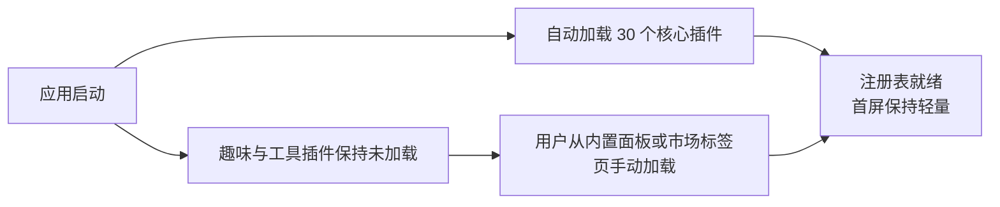

自动加载失败可重试：插件运行时把"初始化完成"作为状态机节点，失败后注册表不会进入就绪态，用户重试不会被误判为重复加载。

### 4.5 第三方包（.cspkg）与沙箱

.cspkg 包是包含 manifest.json、入口模块与资源的 ZIP 压缩包（fflate 打包）。清单字段包括插件 id、名称、版本、作者、描述、入口路径、沙箱模式与支持的文件格式声明。加载时校验清单：必填字段、插件 id 格式、入口路径穿越防护与沙箱枚举。清单声明 sandbox 字段，取值两种：

- **isolated（默认）**：入口代码运行在 Web Worker 内，拥有独立全局作用域，无法访问宿主页面的全局变量、DOM 与状态库；画布渲染通过转移的 OffscreenCanvas 完成，宿主与 Worker 之间只走类型化 RPC 协议（src/core/sandbox.ts 与 src/core/plugin-worker.ts）。
- **trusted**：在宿主上下文中执行，拥有完整 DOM 访问权，仅建议用于自研包。

第三方插件加载与通信流程：

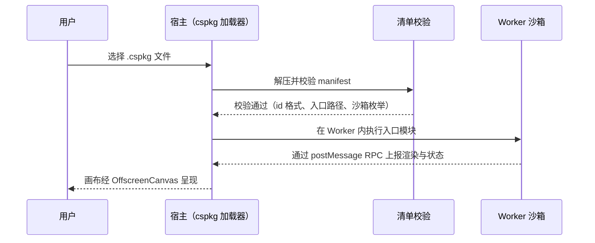

已知限制（如实记录）：Worker 与页面共享同源的 IndexedDB；当 Worker 不可用时的遗留回退方案（new Function 加遮蔽全局变量）只是尽力而为的近似，并非安全边界，回退启用时界面会明确告警。包签名与第三方安装管线是市场方向的下一个里程碑。

### 4.6 文件路由

用户把任意文件拖入中央视口或插件列表时，宿主按魔数与扩展名（可选 WASM 辅助检测）识别格式并路由到匹配插件：

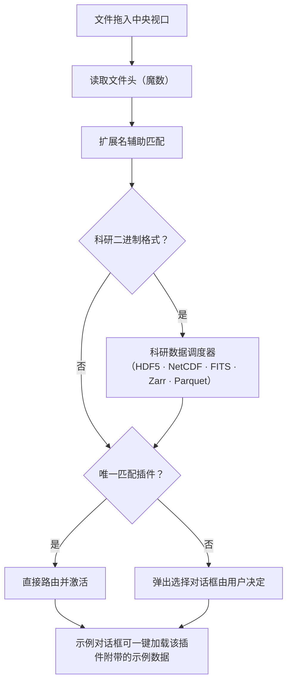

每个核心插件都附带示例数据集，在"示例"对话框中一键加载即可看到真实可视化；示例资产经 exampleAssets 与 examples 模块统一发现与加载。

## 第五章 GPU 计算与原生核心

Ergalics Studio 的计算加速由两层构成：Rust 编译的 WebAssembly 原生核心（native/ergalics-core）提供设备管理与计算内核的参考实现；宿主侧的计算服务（src/core/gpu.ts 与 src/core/compute.ts）把这套能力以统一接口暴露给插件，并在 WASM 或 WebGPU 缺失时逐级降级到纯 CPU 路径。

### 5.1 Rust 原生核心

native/ergalics-core 编译目标为 wasm32-unknown-unknown，经 wasm-bindgen 绑定到 src/native（构建产物，不入库）。WebGPU 绑定依赖 web-sys 的实验性 API，通过构建配置中的 rustflags 开启。Rust 源码按职责分为五个模块：

| 源文件 | 职责 |
| --- | --- |
| lib.rs | 对外导出与初始化 |
| device.rs | GpuDeviceManager：适配器与设备获取，带 CPU 回退选项 |
| buffer.rs | GpuBuffer：以显式 usage 掩码创建存储/只读/均匀缓冲，write 上传、read 经专用回读缓冲读回 |
| compute.rs | KernelDescriptor 与 BindingDescriptor、内核编译、绑定组物化与执行 |
| utils.rs | detect_file_kind 等辅助（基于魔数的文件类型检测） |

面向 JavaScript 的暴露面：

| 能力 | 说明 |
| --- | --- |
| GpuDeviceManager | 适配器与设备获取，带 CPU 回退选项 |
| GpuBuffer | 显式 usage 掩码的缓冲创建、上传与经回读缓冲的读取 |
| KernelDescriptor 与 BindingDescriptor | 描述计算内核与缓冲绑定（uniform、storage、read-only-storage，动态偏移与最小绑定尺寸） |
| ComputeKernel 编译 | 从绑定描述符构建真实的 GPUBindGroupLayout，编译 WGSL 模块并创建管线 |
| ComputeKernel bind_group | 从保留的布局物化绑定组（第 i 个缓冲对应第 i 个绑定） |
| ComputeKernel run | 一次调用完成绑定组、dispatch 与提交；dispatch 方法留给宿主自管命令编码器 |
| compilation_info | 异步暴露 WGSL 编译诊断（错误或警告加行列号） |
| detect_file_kind | 基于魔数的文件类型检测，供加载器使用 |

### 5.2 宿主侧计算服务

src/core/gpu.ts 持有适配器与设备生命周期，负责 CPU 回退与显存不足跟踪。其上的 src/core/compute.ts 是面向插件的计算面（即 PluginApi.gpu）：createBuffer、write、read、compileKernel、compilationInfo 与一次性 run。路由逻辑：

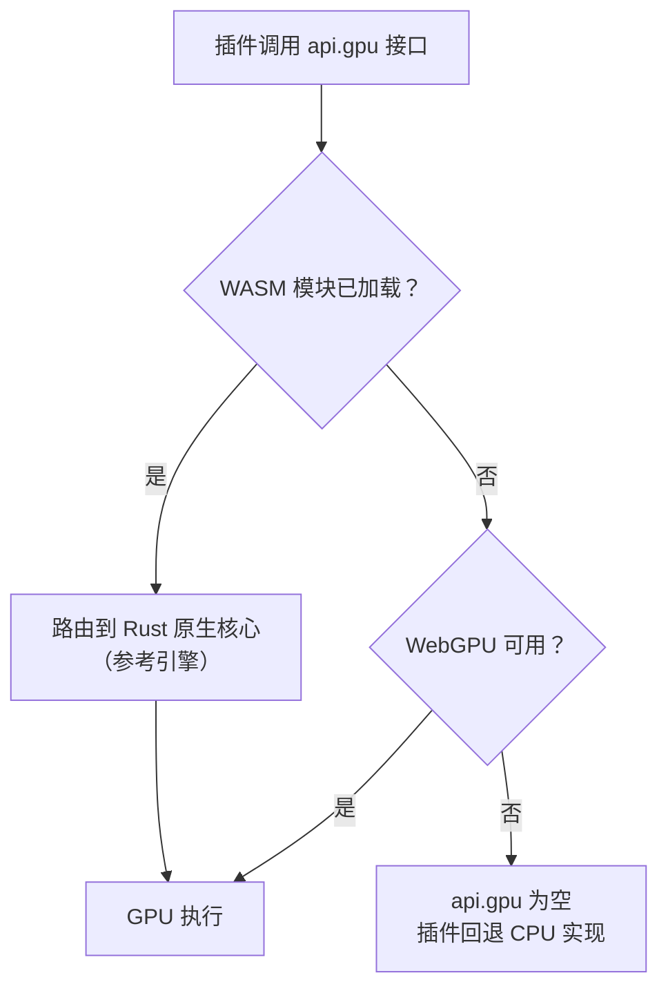

这一设计保证开发与生产环境的加速计算均可用：Rust 核心始终是参考引擎，WebGPU 直连是加速路径，而每个内置插件的 CPU 回退跑的是与 GPU 内核数学一致的实现。

### 5.3 可复用 WGSL 内核

src/core/wgsl.ts 收纳可复用的 WGSL 计算内核，并配套与内核数学一致的宿主侧打包/解包辅助函数供 CPU 回退使用：

| 内核 | 数学内容 | 使用插件 |
| --- | --- | --- |
| 粒子积分 | 交错式 [x, y, vx, vy] 单缓冲积分 | 粒子 |
| 三维全对引力 | O(N 平方) 直接求和，乒乓缓冲避免逐步回读 | N-Body 引力 |
| D2Q9 碰撞与迁移 | 格子 Boltzmann 碰撞、迁移与涡量计算 | 流体模拟 |
| 波动方程 leapfrog | 二维有限差分时间推进 | 波动方程 |
| 直方图、热力图、点云 | 数据聚合与投影加速 | 同名插件 |

两种典型的内核调用路径：

1. **单缓冲路径**（粒子演示）：上传交错式数据加均匀参数，dispatch WGSL 积分器，读回结果并上报真实 GPU 时间。
2. **乒乓缓冲路径**（N-Body 演示）：成对缓冲交替读写，每个积分步完全留在设备上，无逐步回读开销。

以 N-Body 为例的逐步流程：

### 5.4 端到端数值验证

GPU 路径不是摆设：verify-webgpu 端到端套件在无头 Edge（SwiftShader 软件渲染）中驱动真实 WebGPU 通路，用数值基准比较 GPU 结果与 CPU 积分器，误差要求在约 2 乘以 10 的负 6 次方以内；另有应用集成步骤点击粒子插件并断言出现 wasm 引擎的 GPU 提示。相关单元测试覆盖 WGSL 模板生成、参数打包、输出尺寸与 CPU 回退的一致性。

### 5.5 构建与三级降级

构建命令链为：先执行 build:wasm 将 Rust 核心编译进 src/native，再进行类型检查与 Vite 生产构建。只构建前端可跳过 WASM 步骤（build:web）。持续集成环境不安装完整 Rust 工具链，由存根生成脚本提供占位 WASM 模块。

当 WASM 模块缺失时前端优雅降级：欢迎页硬件自检会如实报告 WebGPU、WASM 与 IndexedDB 的可用性；计算路由自动改走原生 WebGPU API 或 CPU 实现；插件在无 GPU 环境下以 CPU 完成同样的数学，行为一致。三级降级路径总结：

| 档位 | 条件 | 计算路径 |
| --- | --- | --- |
| 参考引擎 | WASM 模块已加载 | Rust 原生核心 |
| 加速路径 | WebGPU 可用（含经 WASM 或直连） | GPU 内核 |
| 兜底路径 | 两者皆缺 | 与内核数学一致的 CPU 实现 |

## 第六章 科学计算子系统

src/core 下有四个纯 TypeScript、少 DOM、Node 环境可测的科学计算子系统：统计内核（stats）、科研二进制 I/O（io）、出版级绘图引擎（plot）与可复现性内核（repro）。它们被区块系统、Studio API 与工作台界面共同消费：统计与绘图保证结果的专业性，I/O 保证数据入口的开放性，可复现性保证结论可以被别人原样重放。

### 6.1 统计内核（src/core/stats）

统计内核消费普通数值数组、DataTable 或 Dataset，返回结构化结果，全部为纯函数实现。公共出口按模块划分：

| 模块 | 能力 |
| --- | --- |
| descriptive | 均值、方差、标准差、中位数、分位数、摘要统计、均值置信区间（t 分布临界值经 studentTInv 求得） |
| special | 特殊函数：不完全伽马与贝塔函数、正态与 t 分布等累积分布及其逆函数（供检验与功效计算复用） |
| tests | 单样本 t 检验、双样本 t 检验（Welch 校正自由度）、配对 t 检验、单因素方差分析、Mann-Whitney U 检验、卡方独立性检验，返回含统计量、p 值与自由度的结构化结果 |
| effect | Cohen's d 效应量、Pearson 与 Spearman 相关 |
| correction | Bonferroni 与 Benjamini-Hochberg 多重比较校正，p 值先经清洗（非有限值剔除）再校正 |
| power | 双样本 t 检验的功效分析 |

边界输入一律显式抛错而不是静默给出错误数字：Welch 自由度除零、方差分析组数不足、配对检验长度不等都会得到结构化错误。统计能力向用户的呈现方式有两种：流程模式的 11 个 stats 区块（t 检验、方差分析、非参数检验、卡方检验、相关、效应量、校正等），以及积木与代码模式 studio 接口中的 summary 等调用，底层都指向同一实现。配套单元测试覆盖描述统计、特殊函数、各类检验、效应量、校正与功效六个测试文件。

### 6.2 科研二进制 I/O（src/core/io）

科研数据常以领域二进制格式存储。io 子系统提供单一入口 loadScientificData：给定拖入或打开的 File，先读文件头并按魔数（或扩展名）识别格式，再路由到对应加载器，把每个变量、数据集或 HDU 转成统一的 RawVariable 列表，调用方负责将其转为项目数据文件。

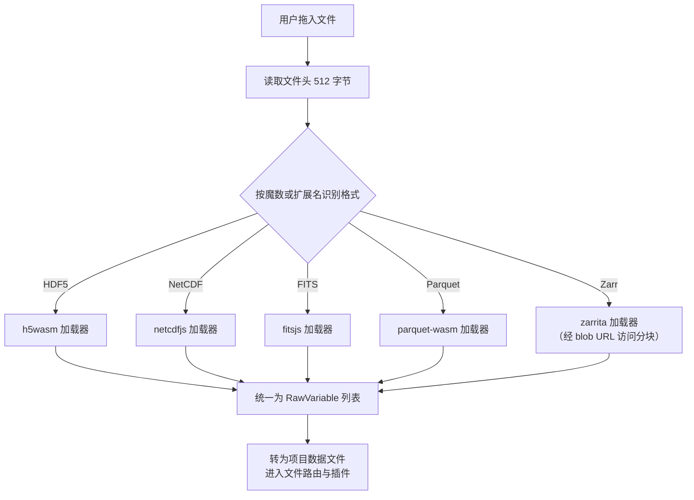

格式与依赖：

| 格式 | 典型领域 | 依赖库 |
| --- | --- | --- |
| HDF5 | 通用科学分层数据 | h5wasm |
| NetCDF | 地学、气象 | netcdfjs |
| FITS | 天文图像与表 | fitsjs |
| Parquet | 列式表格 | parquet-wasm（经 apache-arrow 合并全部记录批次） |
| Zarr | 分块 N 维数组（本地目录或远程存储） | zarrita |

辅助工具（io/types）包括整型到 Float64 的安全转换（int64 与 uint64 数据集不再抛错）、名称净化、DataTable 转 CSV 与数据集构造；NetCDF 加载器与辅助工具各有专门单元测试。

### 6.3 出版级绘图引擎（src/core/plot）

区别于插件里的画布渲染，plot 子系统是一套纯 TS 的矢量绘图引擎，目标是把 DataTable 转成出版级 SVG 并导出：

| 模块 | 能力 |
| --- | --- |
| types | PlotSpec、PlotSeries、比例类型与 SVG 载荷定义 |
| scale | 线性、对数、时间刻度，niceTicks 优雅刻度值，刻度格式化；退化定义域（单点、零跨度）有明确处理 |
| charts | DataTable 转折线、散点、直方图、柱状四类图型 |
| svg | renderSVG 矢量渲染，属性与文本分别转义 |
| export | 导出 SVG 文件与 PDF，下载文本 |

由于整条链路（数据、刻度、渲染、导出）都是纯函数，绘图引擎有专门的单元测试（tests/plot），也是可复现性内核 DAG 转 Python 导出策略的天然搭配。流程模式的绘图区块（plot.line、plot.scatter、plot.histogram、plot.bar）即由这套引擎渲染，与插件画布渲染互为补充。

### 6.4 可复现性内核（src/core/repro）

科研计算的可复现性要求"同样的输入与参数得到同样的输出"。repro 内核提供四块能力：

1. **带种子的伪随机数**：mulberry32 算法，同种子产生完全一致的序列；全局 setSeed 与 currentSeed 支持会话级设定。
2. **稳定哈希**：hashString 输出稳定的八位十六进制，用于输入与图的指纹。
3. **运行清单**：createManifest 记录种子、工作室版本、每个输入文件的哈希、区块图（经拓扑排序后计算哈希）与输出；manifestToText 生成可归档的文本清单。
4. **DAG 转 Python**：把流程图导出为可独立重跑的 Python 脚本，与 topoSort 依赖排序配合，导出脚本内含与运行清单一致的种子设定。

运行清单的构成：

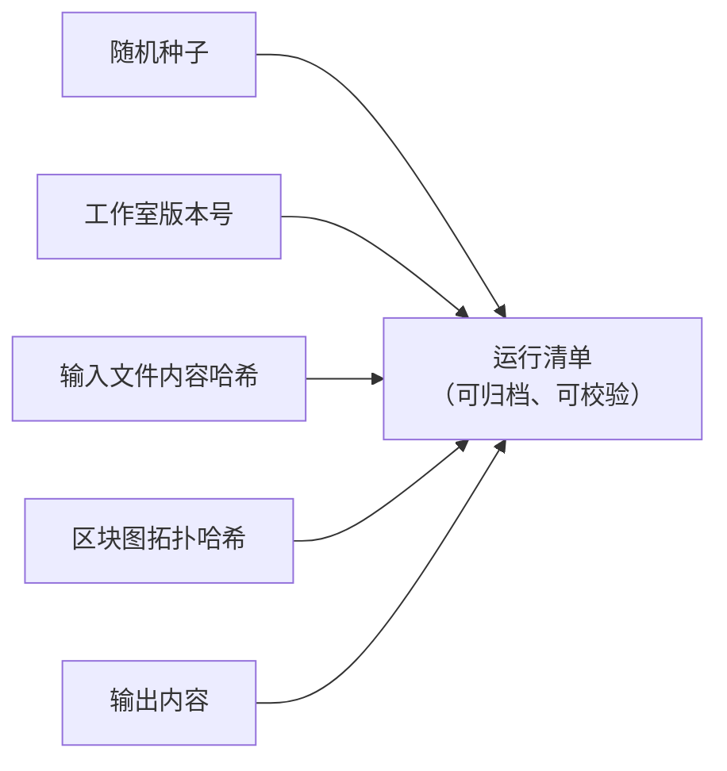

### 6.5 支撑设施

- **运行日志导出**：src/core/logger.ts 聚合会话日志，配合 download.ts 支持从工作台导出日志文件，便于问题反馈与回归定位。
- **插件缓存与示例资产**：pluginCache.ts 与 exampleAssets.ts、examples.ts 支撑内置示例数据与示例项目（examples/projects 下 11 个流程管线、examples/code 下 9 个 Python 示例）的发现与加载。
- **viewport2d 与 dataFiles**：2D 视口抽象（快照式访问，插件卸载安全）与项目数据文件注册（setProjectFiles 与 resolveDataFile），使项目自有文件、内置示例与代码模式 _FILES 共享同一套加载逻辑。

## 第七章 使用指南

### 7.1 技术栈与环境要求

| 层级 | 选型 |
| --- | --- |
| UI | React 18、react-router-dom 7、Zustand 5 |
| 语言 | TypeScript 5.7（strict） |
| 构建 | Vite 6 |
| 3D | Three.js r185（加 @types/three） |
| 原生 | Rust（目标 wasm32-unknown-unknown，经 wasm-bindgen 0.2 绑定） |
| GPU | WebGPU / WGSL（经 web-sys） |
| 测试 | Vitest（单元）+ Playwright-core（端到端，无头 Edge） |
| 文档 | VitePress（独立的 docs workspace） |
| 打包 | fflate（cspkg ZIP）、lz-string（项目压缩） |

环境要求：Node.js 20 以上与 npm；Rust 工具链（含 wasm32-unknown-unknown target 与 wasm-bindgen-cli）仅在构建原生核心时需要，WASM 模块缺失时前端可优雅降级。

### 7.2 安装、运行与构建

- 安装依赖：`npm install`。
- 开发运行：`npm run dev`，应用在 Vite 开发服务器地址打开，欢迎页在进入工作台前执行硬件自检（WebGPU、WASM、IndexedDB）。
- 生产构建：`npm run build`（依次执行 WASM 编译、类型检查、Vite 构建，产物输出到 dist）；`npm run build:web` 仅构建前端（跳过 WASM）；`npm run build:wasm` 将 Rust 核心重新构建到 src/native。
- 文档站点：docs 目录是独立的 VitePress workspace，`npm install` 后 `npm run dev` 本地预览、`npm run build` 输出静态站点；生产前端构建会将文档站点拷贝进 dist/docs，欢迎页的 Docs 链接在预览服务器下可用，文档站也可独立部署（如 GitHub Pages）。
- 在线演示：GitHub Pages（见仓库 README 徽章链接），打开即用。

### 7.3 数据格式支持

| 类别 | 格式 | 说明 |
| --- | --- | --- |
| 常规数据 | CSV、JSON、XYZ、DAT、PNG、GeoJSON | 散点、表格、网格、图像与矢量地图 |
| 科研二进制 | HDF5、NetCDF、FITS、Zarr、Parquet | 由纯 TypeScript 实现的科研 I/O 子系统解析，统一调度器按魔数分派 |
| 项目文件 | .clproj | 工程自有格式，lz-string 压缩，IndexedDB 存储并支持导出分享 |
| 插件包 | .cspkg | fflate 打包的 ZIP，加载时校验清单并落入沙箱 |

格式检测由 Rust 原生核心按魔数识别，辅以扩展名匹配；识别结果驱动标准模式的插件自动路由。

### 7.4 示例资源一览

| 类别 | 数量 | 位置 | 内容 |
| --- | --- | --- | --- |
| 流程模式示例项目 | 11 | examples/projects | 信号分析、随机分布、网格散点、范围过滤、双管线、Top-K、分箱统计、归一化网格、晶格、粒子、点云 |
| 积木模式示例程序 | 5 | src/editor/block/samples.ts | 星系散点、遥测折线、随机直方图、归一化散点、循环打印 |
| 代码模式示例程序 | 9 | examples/code | EDA 管线、蒙特卡洛估圆、信号平滑、遥测探索、星系散点、随机直方图、范围循环、添加列绘图、归一化过滤 |
| 插件示例数据 | 每个核心插件 | examples/data 与内置资产 | 经"示例"对话框一键加载 |

### 7.5 参与贡献

1. Fork 本仓库并创建功能分支。
2. 保持改动小巧且由测试覆盖——`npm run verify`（类型检查加单元测试）必须保持绿色，新的插件或功能应附带端到端检查。
3. 发起 pull request 前运行 `npm run test:e2e`（要求 Edge 浏览器位于默认安装路径，否则请在脚本中调整 EDGE 常量）。
4. 触碰 native/ergalics-core 后用 `npm run build:wasm` 重新生成 WASM 绑定。
5. 通过 GitHub Issues 报告缺陷与功能请求。

### 7.6 许可证

项目以 MIT 协议开源（LICENSE，SnowLeopard-io，2026），欢迎通过 Issue 与 Pull Request 参与贡献。

## 第八章 测试与质量保障

测试被视为代码库的一等公民：核心逻辑在 Node 环境用 Vitest 做单元测试，产品行为用 Playwright-core 驱动无头浏览器对生产预览做端到端验证。当前基线：46 个测试文件、417 个单元测试全部通过，另有 10 套端到端脚本与 GitHub Actions 持续集成。

### 8.1 单元测试（Vitest）

运行方式：`npm test` 执行全部单测；`npm run verify` 先做类型检查（tsc 严格模式，零发布）再跑单测，是贡献指引中要求保持绿色的组合检查。

测试文件按子系统组织在 tests/ 目录下：blocks（9 个文件，区块系统）、core（2 个，计算服务与 WGSL）、editor（8 个，编辑器与 IR）、io（2 个）、plot（1 个）、repro（1 个）、stats（6 个），其余 17 个在根目录覆盖插件运行时、沙箱与各插件族。

| 测试组 | 覆盖内容 |
| --- | --- |
| fileFormat | 魔数与扩展名检测、格式匹配 |
| cspkg | ZIP 解析、清单校验、可信入口执行 |
| sandbox | RPC 编解码、遗留回退、经 FakeWorker 驱动真实运行时的端到端往返 |
| i18n | 语言切换、回退、沙箱相关文案键 |
| appStore | 横幅、通知、性能告警 |
| wasm | WASM 加载器重试策略（三次、间隔一秒），模块级 mock |
| gpuService | 计算服务设备门控与 CPU 回退 |
| gpuCompute | WGSL 模板生成、缓冲打包、CPU 积分器、粒子回退一致性 |
| core/wgsl | 直方图、热力图、点云 GPU 内核：模板输出、参数打包、输出尺寸、CPU 一致性 |
| builtinPlugins | 等值线网格归一化、散点解析、N-Body、蛋白质、粒子、图像查看器等插件逻辑 |
| sciencePlugins | 三维 N-Body 内核与动量守恒、蛋白质力导向布局与连通分量、无数据守卫 |
| geoPhysicsPlugins | 流体 WGSL 内核与 CPU 步进、波动方程、双摆物理、GeoJSON 解析 |
| structure-sim | 结构力学求解：杆件轴力、利用率、超载垮塌、空态守卫、重置语义 |
| pluginBugfixes | 已修复插件缺陷的回归用例（如插件进入即暂停、Run 数据守卫） |
| dataPlugins | 误差带行、矩形树层级、QQ 概率变换等解析辅助 |
| blocks 系列 | 数据表运算、目录、编译器、执行器、几何、统计区块、文件数据、操作符、可视化桥接 |
| editor 系列 | 共享 IR 校验与往返、Blockly JSON 与 IR 互转、解释器、JS 与 Python 代码生成、三模式 sync-threeway、积木 i18n、编辑器状态库、Studio API、代码示例 |
| pluginRuntime | 插件生命周期、市场门控、加载失败重试 |
| repro、io、plot、stats 系列 | 可复现性内核、NetCDF 与辅助工具、绘图引擎、统计内核六个模块 |

值得注意的测试技术：

- 模块级缓存（如 WASM 加载器）在每个用例前用 resetModules 加 doMock 重置，再动态导入新实例。
- Worker RPC 用 FakeWorker 驱动真实的插件 Worker 运行时做端到端往返，无需浏览器。
- 严格模式下 new Function 无法同时使用 use strict 指令与默认参数值，遗留沙箱为此使用普通参数并显式传 undefined。

### 8.2 端到端测试（Playwright-core）

每套脚本各自启动 vite preview 生产预览，驱动无头 Edge（默认取系统安装路径），断言真实像素与零控制台错误：

| 套件 | 端口 | 覆盖内容 |
| --- | --- | --- |
| smoke-test | 4173 | 启动、自动加载插件、响应式参数、项目恢复 |
| verify-ui | 4173 | 布局尺寸、主题切换、画布可见性、插件列表 |
| verify-fixes | 4177 | 所有示例插件正确渲染其示例数据 |
| verify-3d | 4199 | 宿主 Three.js 场景中的三维点云 |
| verify-plugins | 4198 | 三维与二维表面可见性互斥、等值线、散点、龙卷风示例 |
| verify-webgpu | 4289 | 无头 Edge（SwiftShader）中的真实 WebGPU：GPU 与 CPU 数值一致性（约 2e-6 以内）、粒子插件 GPU 提示断言 |
| verify-block-mode | 4173 | 积木编辑器：模式切换、编译、运行、积木到代码同步 |
| verify-code-mode | 4175 | Monaco 加 Pyodide：运行 Python 程序、控制台、变量面板、绘图画布 |
| verify-ai-samples | 4173 | AI 训练：加载全部四个样本 |
| verify-ai-training | 4173 | AI 训练器：激活、TF.js 训练、损失曲线、模型切换重置、决策边界、MNIST CNN 网格 |

截图写入临时目录供人工目检。贡献指引要求新插件或新功能附带端到端检查。

### 8.3 持续集成与构建门禁

GitHub Actions 工作流覆盖三条线：单元测试、端到端测试与 GitHub Pages 部署；CI 环境中的 WASM 模块由存根生成脚本提供，避免在云端安装完整 Rust 工具链。

生产构建命令链自带门禁：WASM 编译、TypeScript 类型检查、Vite 构建、文档站点拷贝，任一步失败即中止。类型检查（tsc 严格模式，noEmit）同时充当 lint，保持零 any 级别的约束。

### 8.4 质量原则

1. **纯函数优先**：编译器、统计内核、绘图引擎、代码生成与 IR 转换全部是纯函数，可在 Node 环境直接测试。
2. **副作用收口**：区块系统里只有渲染桥接一个带副作用的模块；执行器异步但无副作用，保证可测性。
3. **数值一致性兜底**：每个 GPU 内核都有数学一致的 CPU 实现，单测与端到端两层校验二者一致。
4. **边界显式化**：边界输入抛结构化错误、空数据启动有守卫提示、环境缺失如实自检报告，杜绝静默失败与静默降级。
5. **回归防御**：已修复的插件缺陷沉淀为 pluginBugfixes 回归用例，避免复发；i18n 键值在测试中校验齐备。

## 第九章 应用场景

### 9.1 科学与工程数据可视化

覆盖统计分析与工程绘图的常见图型：散点、折线、直方图、热力图、等值线、箱线图、小提琴图、误差带、平行坐标、桑基图、矩形树图、QQ 图、气泡图、雷达图、网络图等；数据格式上除 CSV、JSON、XYZ 外，还支持 HDF5、NetCDF、FITS、Zarr、Parquet 等科研领域常用的二进制格式导入，可服务地学、天文、生物等学科的数据探索需求。

### 9.2 物理仿真与教学演示

内置多个数据驱动的仿真引擎，全部"初始为空、绝不伪造默认场景"，数据既可来自内置示例也可来自用户文件：

| 插件 | 演示内容 |
| --- | --- |
| N-Body 引力 | 4096 体的三维全对引力直接求和，WGSL 内核加速 |
| 格子 Boltzmann 流体 | D2Q9 通道流绕障碍物，展示卡门涡街与机翼绕流 |
| 波动方程 | 高斯脉冲、双源干涉、双缝衍射场景，leapfrog 内核积分 |
| 双摆 | RK4 积分配合初值仅差 0.001 弧度的"混沌幽灵摆"，直观展示混沌 |
| 电磁场 | 可拖动电荷在库仑力与洛伦兹力共同作用下的回旋运动 |
| 光学实验 | 薄透镜成像、三棱镜折射与色散，元件可在画布上直接拖动 |
| 结构力学 | 铰接桁架实时承重，杆件按轴力着色，超载断裂直至垮塌 |

### 9.3 编程与计算思维教学

四种模式构成一条从"零代码"到"真代码"的渐进路径：初学者先在标准模式拖数据看图，再到流程模式理解数据流与统计概念（t 检验、方差分析、相关分析等 11 个统计区块），继而进入积木模式写出第一段带变量与循环的"程序"，最后在代码模式直接写 Python。三个脚本模式共享同一份 IR，切换模式时逻辑原样保留；仓库附带的 11 个流程示例项目、5 个积木示例与 9 个 Python 示例，构成可直接布置的练习素材库。

### 9.4 浏览器内机器学习入门

AI 训练插件基于 TensorFlow.js，支持线性回归、非线性神经网络、逻辑回归与卷积神经网络四类模型，画布上方实时绘制损失曲线，下方按模型切换散点加拟合线、二维决策边界或 MNIST 数字识别网格。训练样本内置（线性、三次加正弦、双高斯分类、200 张 MNIST 子集），TF.js 依赖在首次点击训练时才懒加载，避免拖慢启动。

### 9.5 地理可视化与算法艺术

离线 GeoJSON 分级设色地图支持 Albers（中国）、Web 墨卡托与等距圆柱投影，内置中国省份示例；Mandelbrot 与 Julia 集、科赫雪花、巴恩斯利蕨、Spirograph 等 10 个趣味插件适合课堂演示与兴趣探索。

## 第十章 创新点

**四模式同源架构。** 市面上的工具要么只做拖拽可视化，要么只做代码编辑。Ergalics Studio 用一份共享 IR 打通积木、流程与代码三种范式，并配备三模式往返互转的专门单元测试；代码模式的缓冲区内容还能解析回 IR，使"换一种表达方式理解同一逻辑"成为一键操作。对教学而言，这意味着同一条管线可以用三种难度梯度反复讲解。

**零安装的全栈科学计算环境。** CPython（Pyodide Worker）、Rust/WASM 原生核心、WebGPU 计算与 IndexedDB 持久化全部运行在浏览器内，数据不出本机，同时保持接近桌面软件的体验。这不仅是部署便利，更改变了"教学机房的软件审批、学生自带电脑的环境差异"这类现实约束的性质。

**真实 GPU 计算加优雅降级。** 计算管线不是演示性质的：从 Rust 核心暴露的缓冲区与内核抽象，到粒子、N-Body、流体、波动方程等真实 WGSL 内核，再到端到端测试中 GPU 与 CPU 结果的数值一致性校验（误差约 2 乘以 10 的负 6 次方），每一层都可用、可测；无 WebGPU 环境自动回退 CPU，行为一致。

**严格数据驱动的仿真插件。** 所有仿真插件初始为空，重置只重放已加载数据，杜绝"伪造默认场景"。这一约束保证了演示与真实数据的统一性，也倒逼插件把物理参数做成可调项，而不是把结论画死在界面里。

**沙箱化插件生态。** 第三方插件默认运行于 Web Worker，通过类型化 RPC 访问宿主，画布渲染经 OffscreenCanvas 转移完成；.cspkg 包在加载时进行清单校验（id 格式、入口路径穿越防护、沙箱枚举）。市场目录按科学、趣味、工具分类，核心插件自动加载、趣味插件手动加载的两级策略保持首屏轻量。

**可复现性与工程化质量。** 可复现性内核提供带种子的随机数、运行清单（种子、版本、输入哈希、图哈希）与 DAG 转 Python 导出；统计内核与科研 I/O 均为纯函数实现、Node 环境可测；417 个单元测试加 10 套端到端测试构成持续回归网，全部在 GitHub Actions 上自动执行。

## 附录 文档索引

| 文档 | 内容 |
| --- | --- |
| 01-产品介绍 | 项目背景、技术架构概述、功能全景、应用场景与创新点（产品视角） |
| 02-系统架构 | 分层架构、启动时序、状态管理、渲染管线、目录结构与依赖规则 |
| 03-插件系统 | 插件契约、40 个内置插件明细、市场目录、cspkg 加载与 Worker 沙箱 |
| 04-四大工作模式 | 标准、流程、积木、代码四种模式的设计与三模式互转（共享 IR） |
| 05-GPU计算与原生核心 | Rust/WASM 原生核心、WebGPU 计算管线、WGSL 内核与 CPU 回退 |
| 06-科学计算子系统 | 统计内核、科研二进制 I/O、出版级绘图引擎、可复现性内核 |
| 07-测试与质量保障 | 单元测试、端到端测试、持续集成与质量原则 |
| README.zh-CN / README | 仓库自述文件（中/英文），另有排版 PDF 版本存于本目录 |
| docs/guide（VitePress 站点） | 面向使用者的在线文档： introduction、architecture、各模式指南、testing、roadmap、plugins 等 |

本文与上述文档随仓库代码一同演进：代码、配置或测试发生变化时，请一并核对与更新对应章节中的数字与描述。
